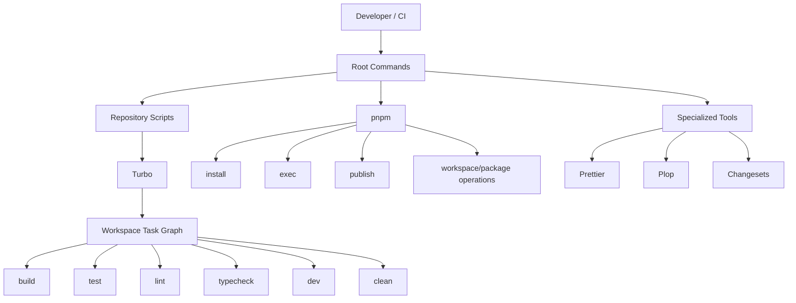
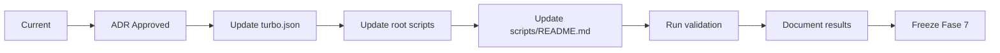

# EE-ADR-001 — Workspace Task Orchestration Strategy

Este documento registra la decisión arquitectónica correspondiente para el Engineering Ecosystem conforme a los estándares **EE-DOC-002** y **EE-DOC-005**.

---

## METADATOS

| Campo                      | Valor                                                     |
| :------------------------- | :-------------------------------------------------------- |
| **ID**                     | EE-ADR-001                                                |
| **Documento**              | Workspace Task Orchestration Strategy                     |
| **Código corto**           | ADR-001                                                   |
| **Fase**                   | Fase 2 — Foundation                                       |
| **Fase de implementación** | Fase 7 — Scripts (Implementación de EE-DOC-006)           |
| **Tipo**                   | Architectural Decision Record                             |
| **Clasificación**          | Arquitectura / Decisión Arquitectónica                    |
| **Nivel**                  | Arquitectónico                                            |
| **Normativo**              | Sí                                                        |
| **Versión**                | v1.1.0                                                    |
| **Estado**                 | Aprobado                                                  |
| **Propietario**            | Equipo de Arquitectura                                    |
| **Documento padre**        | EE-DOC-006 — Repository Structure                         |
| **Dependencias**           | EE-DOC-005; EE-DOC-006; EE-IMP-006-P07                    |
| **Decisión relacionada**   | Ninguna (primera ADR de orquestación)                     |
| **Aprobado por**           | Equipo de Arquitectura                                    |
| **Audiencia**              | Arquitectura, Desarrollo, DevOps                          |
| **Fecha de creación**      | 2026-08-20                                                |
| **Última revisión**        | 2026-10-02                                                |
| **Próxima revisión**       | Ante cambio de orquestador o de contrato de comandos root |
| **Prioridad**              | Alta                                                      |

---

## 01. Propósito

Establecer de forma explícita **quién orquesta las tareas entre workspaces** del Engineering Ecosystem, separando la responsabilidad de **pnpm** (package manager) de la de **Turbo** (orquestador de tareas workspace).

---

## 02. Contexto

El monorepo del Engineering Ecosystem utiliza **pnpm** como gestor de paquetes y **Turbo** como herramienta disponible para la ejecución y coordinación de tareas entre workspaces.

Actualmente, algunas tareas de workspace son ejecutadas mediante comandos recursivos de pnpm:

```text
pnpm -r build
pnpm -r test
pnpm -r lint
pnpm -r typecheck
```

mientras que otras tareas utilizan Turbo:

```text
turbo run dev
```

El archivo `turbo.json` ya define tareas y relaciones entre workspaces, incluyendo la dependencia:

```json
"dependsOn": ["^build"]
```

Esto genera dos mecanismos potenciales de orquestación para las tareas del workspace:

1. `pnpm -r`
2. `turbo run`

La coexistencia de ambos mecanismos para una misma responsabilidad puede producir una arquitectura ambigua respecto a quién es responsable de construir y ejecutar el grafo de tareas del monorepo.

Por lo tanto, se requiere establecer una decisión arquitectónica explícita.

---

## 03. Problema Arquitectónico

Debe definirse cuál es la responsabilidad de **orquestar las tareas entre workspaces** del Engineering Ecosystem.

La decisión debe evitar:

- duplicidad de mecanismos de orquestación;
- responsabilidades ambiguas entre pnpm y Turbo;
- divergencia entre el grafo declarado en `turbo.json` y el mecanismo utilizado por los comandos root;
- dificultad para aprovechar caching, paralelización y dependencias entre tareas;
- evolución inconsistente de los scripts del monorepo.

---

## 04. Decisión

Se adopta **Turbo como orquestador oficial de tareas entre workspaces** del Engineering Ecosystem.

**pnpm permanece como package manager y mecanismo de ejecución de operaciones relacionadas con el ecosistema de paquetes.**

La separación de responsabilidades queda establecida de la siguiente manera:

| Responsabilidad                    | Herramienta                     |
| :--------------------------------- | :------------------------------ |
| Gestión de paquetes                | pnpm                            |
| Instalación de dependencias        | pnpm                            |
| Resolución de workspaces           | pnpm                            |
| Ejecución de binarios del proyecto | pnpm / herramientas específicas |
| Publicación de paquetes            | pnpm                            |
| Gestión de Changesets              | Changesets                      |
| Orquestación de tareas workspace   | **Turbo**                       |
| Grafo de dependencias de tareas    | **Turbo**                       |
| Caching de tareas                  | **Turbo**                       |
| Paralelización de tareas           | **Turbo**                       |
| Desarrollo multi-workspace         | **Turbo**                       |

---

## 05. Alcance

### 05.1. Incluye

- Estrategia de orquestación de tareas workspace (`build`, `test`, `lint`, `typecheck`, `dev`, `clean`, y equivalentes coordinados por Turbo).
- Relación de los comandos root con `turbo run`.
- Papel de `turbo.json` como SSOT del grafo de tareas.
- Principios derivados (una sola capa de orquestación; scripts root como interfaz estable).

### 05.2. No incluye

- Estrategia de versionado.
- Política de publicación npm.
- Estrategia de releases.
- Estructura interna de los paquetes.
- Estrategia de CI/CD completa.
- Política de caching específica.
- Convenciones internas de cada workspace.
- Framework de testing (ver **EE-ADR-002**).

Esas decisiones deberán mantenerse en sus documentos correspondientes o formalizarse mediante ADR/RFC cuando corresponda.

---

## 06. Justificación Arquitectónica

### 06.1. Opción A — pnpm como orquestador

Utilizar `pnpm -r` como mecanismo principal para ejecutar tareas en todos los workspaces.

```text
pnpm build
    ↓
pnpm -r build
```

**Ventajas:** mecanismo simple; dependencia directa del package manager; menor cantidad de herramientas.

**Desventajas:** limita la responsabilidad de Turbo; duplica capacidades de coordinación; no aprovecha el grafo de `turbo.json`; dificulta una capa consistente de task orchestration.

### 06.2. Opción B — Turbo como orquestador (**elegida**)

```text
pnpm build
    ↓
scripts/build
    ↓
turbo run build
```

Turbo sería responsable de: construir el grafo; resolver dependencias entre workspaces; orden de ejecución; paralelización; caching; ejecutar las tareas definidas por los workspaces.

**Ventajas:** separación clara de responsabilidades; grafo de tareas; caching e incremental; paralelización; modelo consistente CI/CD; alineación con `turbo.json`.

**Desventajas:** capa explícita de orquestación; mantenimiento de configuración Turbo; workspaces deben exponer las tareas esperadas.

### 06.3. Opción C — Mantener ambos mecanismos

Permitir que cada comando decida entre `pnpm -r` y Turbo de forma independiente.

**Ventajas:** mínima modificación inmediata.

**Desventajas:** arquitectura ambigua; dos modelos de ejecución; comportamientos diferentes entre tareas; menor coherencia.

La **Opción B** maximiza coherencia con `turbo.json` y evita duplicidad de orquestación.

---

## 07. Modelo arquitectónico resultante



La interfaz de comandos del repositorio continúa siendo responsabilidad de los scripts root.  
La implementación interna de las tareas workspace queda delegada al orquestador correspondiente.

---

## 08. Aplicación a los comandos root

Los comandos root relacionados con tareas de workspace deberán delegar en Turbo.

| Comando          | Implementación        |
| :--------------- | :-------------------- |
| `pnpm build`     | `turbo run build`     |
| `pnpm dev`       | `turbo run dev`       |
| `pnpm test`      | `turbo run test`      |
| `pnpm lint`      | `turbo run lint`      |
| `pnpm typecheck` | `turbo run typecheck` |
| `pnpm clean`     | `turbo run clean`     |

Las operaciones que no representan tareas de workspace permanecen bajo su herramienta especializada:

```text
bootstrap → pnpm
format    → Prettier
generate  → Plop
release   → Changesets + pnpm
doctor    → script propio
```

`validate` podrá continuar actuando como comando compuesto de validación y utilizar las tareas correspondientes mediante el mecanismo de orquestación definido por este ADR.

---

## 09. Relación con `turbo.json`

La configuración de Turbo constituye la fuente técnica para el grafo de tareas.  
Las dependencias entre tareas deberán expresarse mediante `turbo.json`.

```json
{
  "tasks": {
    "build": {
      "dependsOn": ["^build"],
      "outputs": ["dist/**", "build/**", "lib/**"]
    }
  }
}
```

Los scripts root no deberán duplicar manualmente la lógica del grafo de dependencias.

---

## 10. Principios arquitectónicos derivados

### 10.1. Una única capa de orquestación

Turbo será el mecanismo oficial para coordinar tareas entre workspaces.  
No deberán introducirse mecanismos alternativos para el mismo grafo sin decisión arquitectónica explícita.

### 10.2. pnpm no pierde su responsabilidad

Esta decisión **no reemplaza pnpm**. pnpm continúa siendo el package manager oficial (dependencias, instalación, workspaces, ejecución de herramientas, publicación, operaciones de paquetes).

### 10.3. Los workspaces mantienen sus propios scripts

Turbo no reemplaza los scripts de cada workspace. Cada workspace declara las tareas que implementa; Turbo coordina su ejecución.

### 10.4. Los scripts root permanecen como interfaz estable

Los comandos públicos (`pnpm build`, `dev`, `test`, `lint`, `typecheck`, `validate`, `clean`) continúan siendo la interfaz estable. La adopción de Turbo no modifica el contrato de nombres.

---

## 11. Impacto sobre Fase 7 y migración

Esta decisión afecta directamente la implementación de **Scripts**. La Fase 7 deberá alinearse con esta decisión.

Migración progresiva desde `pnpm -r <task>` hacia `turbo run <task>` cuando la tarea sea de orquestación workspace. Actualizar `scripts/README.md`.



Validación mínima:

```bash
pnpm install
pnpm build
pnpm typecheck
pnpm lint
pnpm test
pnpm validate
pnpm clean
```

Debe confirmar: ejecución correcta; dependencias entre workspaces; sin regresiones; contrato de comandos root; documentación alineada.

---

## 12. Consecuencias

### 12.1. Positivas

- Responsabilidad arquitectónica claramente definida.
- Un único orquestador para las tareas workspace.
- Uso consistente del grafo de tareas.
- Caching y paralelización.
- Mejor alineación local ↔ CI/CD.
- Menor duplicación de lógica de ejecución.

### 12.2. Negativas / Riesgos

- Turbo pasa a ser dependencia operacional fundamental.
- `turbo.json` forma parte del contrato de automatización.
- Nuevos workspaces deben declarar tareas correctamente.
- Requiere mantenimiento de la configuración Turbo.

---

## 13. Estado de implementación (referencia histórica al momento de la decisión)

| Elemento                   | Estado (al momento de la decisión) |
| :------------------------- | :--------------------------------- |
| Decisión arquitectónica    | Aprobado                           |
| Turbo como orquestador     | Adoptado                           |
| pnpm como package manager  | Vigente                            |
| Tareas workspace vía Turbo | Evolutivo según IMP / scripts      |

> **Nota:** La tabla original de “Pendiente / Implementado” refleja el estado en la creación del ADR (2026-08-20). La materialización posterior se rige por EE-IMP y el contrato de scripts vigente.

---

## 14. Referencias

| Código             | Documento                | Descripción                    |
| :----------------- | :----------------------- | :----------------------------- |
| **EE-DOC-002**     | Document Design Template | Plantilla §18.2 ADR            |
| **EE-DOC-005**     | Development Workflow     | Mecanismo ADR                  |
| **EE-DOC-006**     | Repository Structure     | Estructura y automatización    |
| **EE-IMP-006-P07** | Scripts                  | Implementación de scripts      |
| **EE-ADR-002**     | Testing Standard         | Runners orquestados por Turbo  |
| **turbo.json**     | —                        | Grafo de tareas                |
| **package.json**   | —                        | Comandos root                  |
| **scripts/**       | —                        | Entry points de automatización |

---

## 15. Historial de Cambios

| Versión    | Fecha      | Autor                  | Aprobado por           | Motivo                | Cambios                                                                                                    | Estado       |
| :--------- | :--------- | :--------------------- | :--------------------- | :-------------------- | :--------------------------------------------------------------------------------------------------------- | :----------- |
| **v1.0.0** | 2026-08-20 | Equipo de Arquitectura | Equipo de Arquitectura | Creación inicial      | Turbo como orquestador oficial de tareas workspace                                                         | Aprobado     |
| **v1.1.0** | 2026-10-02 | Equipo de Arquitectura | Equipo de Arquitectura | Higiene DOC-002 §18.2 | Metadatos; Propósito; Alcance 05.1/05.2; Justificación; Consecuencias; Referencias; sin cambio de decisión | **Aprobado** |

---

## FIN DEL DOCUMENTO
