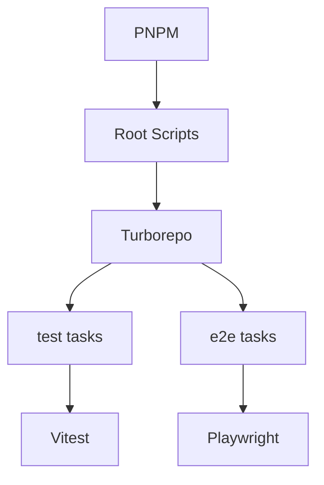
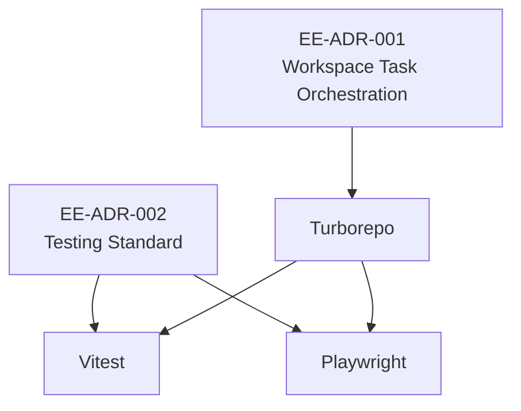
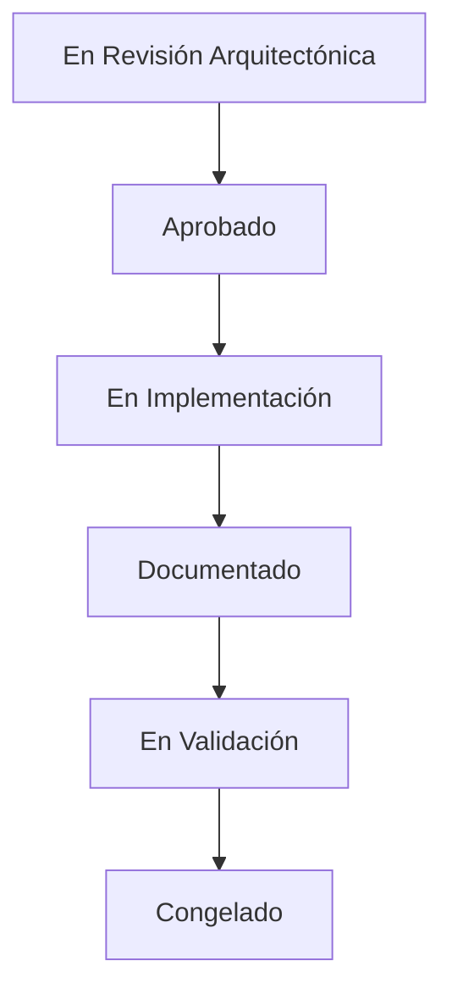

# EE-ADR-002 — Engineering Ecosystem Testing Standard

Este documento registra la decisión arquitectónica correspondiente para el Engineering Ecosystem conforme a los estándares **EE-DOC-002** y **EE-DOC-005**.

Sigue la jerarquía documental de **EE-DOC-001**, la gobernanza de **EE-DOC-003**, la arquitectura de **EE-DOC-004**, el workflow de **EE-DOC-005** y la estructura de **EE-DOC-006**.

---

## METADATOS

| Campo                      | Valor                                                                  |
| -------------------------- | ---------------------------------------------------------------------- |
| **ID**                     | EE-ADR-002                                                             |
| **Documento**              | Estándar de Testing del Engineering Ecosystem                          |
| **Código corto**           | ADR-002                                                                |
| **Fase**                   | Fase 2 — Foundation                                                    |
| **Fase de implementación** | Fase 7 — Scripts (Implementación de EE-DOC-006)                        |
| **Tipo**                   | Architectural Decision Record                                          |
| **Clasificación**          | Decisión Arquitectónica                                                |
| **Nivel**                  | Arquitectónico                                                         |
| **Normativo**              | Sí, una vez aprobado                                                   |
| **Versión**                | v1.3.0                                                                 |
| **Estado**                 | Aprobado                                                               |
| **Propietario**            | Equipo de Arquitectura                                                 |
| **Documento padre**        | EE-DOC-004                                                             |
| **Dependencias**           | EE-DOC-001, EE-DOC-002, EE-DOC-003, EE-DOC-004, EE-DOC-005, EE-DOC-006 |
| **Decisión relacionada**   | EE-ADR-001 — Estrategia de Orquestación de Tareas del Workspace        |
| **Aprobado por**           | Equipo de Arquitectura                                                 |
| **Audiencia**              | Arquitectura, Desarrollo, QA, DevOps, IA                               |
| **Fecha de creación**      | 2026-08-29                                                             |
| **Última revisión**        | 2026-10-02                                                             |
| **Próxima revisión**       | —                                                                      |
| **Prioridad**              | Alta                                                                   |

---

## 01. Propósito

Establecer el estándar oficial de testing del Engineering Ecosystem para garantizar:

- consistencia entre workspaces;
- separación clara de responsabilidades;
- reutilización de configuración;
- ejecución reproducible;
- integración con Turborepo;
- cobertura medible;
- pruebas de componentes;
- pruebas End-to-End;
- integración con CI/CD;
- compatibilidad con AI Assisted Engineering;
- trazabilidad y gobernanza arquitectónica.

La decisión busca evitar que cada workspace adopte un framework, convención o estrategia de testing independiente.

---

## 02. Contexto

El Engineering Ecosystem está estructurado como un monorepo compuesto por aplicaciones, paquetes core, configuraciones compartidas y conectores oficiales.

La ejecución de tareas del workspace está gobernada por **Turborepo**, mientras que **PNPM** administra las operaciones relacionadas con dependencias y workspaces.

Esta separación está establecida por **EE-ADR-001 — Estrategia de Orquestación de Tareas del Workspace**.

Actualmente existen:

```text
packages/config/vitest/
packages/config/jest/
```

La configuración de Vitest ya proporciona una base compartida para:

- entorno Node;
- React mediante `jsdom`;
- descubrimiento de `__tests__/`;
- archivos `*.test.*`;
- archivos `*.spec.*`;
- coverage mediante V8;
- exclusión de artefactos.

La configuración de Jest existe como infraestructura de compatibilidad, pero no constituye todavía el estándar oficial del Engineering Ecosystem.

Actualmente:

```text
24 workspaces
      │
      ▼
turbo run test
      │
      ▼
0 tareas test ejecutadas
```

Por tanto, el EE necesita formalizar qué herramienta debe utilizar cada workspace cuando implemente sus pruebas.

---

## 03. Problema Arquitectónico

La ausencia de un estándar oficial permitiría que diferentes workspaces adopten:

- Vitest;
- Jest;
- Node Test Runner;
- frameworks adicionales;
- diferentes mecanismos de coverage;
- diferentes convenciones de archivos;
- diferentes sistemas de mocking;
- diferentes comandos de ejecución.

Esto produciría:

- duplicación;
- fragmentación;
- mayor coste de mantenimiento;
- mayor complejidad de CI/CD;
- dificultad de soporte;
- dificultad para generar tests mediante IA;
- dificultad para comparar resultados;
- pérdida del principio de Single Source of Truth.

La decisión debe resolver esta fragmentación antes de que los workspaces comiencen a desarrollar suites independientes.

---

## 04. Decisión

### 04.1. Framework oficial Unit / Integration / Component

El Engineering Ecosystem adopta:

> **Vitest como estándar oficial para pruebas unitarias, de integración y de componentes.**

La arquitectura será:

```text
PNPM
  │
  ▼
Root Script
  │
  ▼
Turborepo
  │
  ▼
Workspace
  │
  ▼
Vitest
```

Turborepo mantiene la responsabilidad de:

- descubrimiento de tareas;
- dependencias entre tareas;
- orden;
- paralelismo;
- cache;
- ejecución del task graph.

Vitest mantiene la responsabilidad de:

- ejecución de tests;
- assertions;
- mocking;
- snapshots;
- coverage;
- resultados de testing.

### 04.2. Framework oficial E2E

El Engineering Ecosystem adopta:

> **Playwright como estándar oficial para pruebas End-to-End y automatización real de navegador.**

Playwright soporta proyectos múltiples para ejecutar la misma suite bajo diferentes configuraciones y navegadores.

La arquitectura será:

```text
PNPM
  │
  ▼
Root Script
  │
  ▼
Turborepo
  │
  ▼
E2E Workspace
  │
  ▼
Playwright
  │
  ├── Chromium
  ├── Firefox
  └── WebKit
```

La configuración concreta de navegadores y matrices de ejecución será definida posteriormente por los Quality Gates y por la configuración compartida.

### 04.3. Jest

Jest no será el framework estándar para código nuevo.

Jest queda clasificado como:

> **Legacy / Compatibility Runner**

Podrá utilizarse únicamente cuando exista una justificación técnica documentada.

---

## 05. Alcance

### 05.1. Incluye

Este ADR incluye:

- elección del framework oficial de testing;
- elección del framework E2E;
- clasificación de Jest;
- taxonomía oficial de tests;
- matriz de responsabilidades;
- estrategia de ejecución;
- relación PNPM → Turborepo → Runner;
- reglas de `NO_TESTS`;
- configuración compartida;
- Testing Library para React;
- política de excepciones;
- política de evolución de Jest;
- integración conceptual con Quality Gates;
- workspaces afectados.

### 05.2. No incluye

Este ADR no incluye:

- implementación de tests en workspaces;
- thresholds definitivos de coverage;
- configuración específica de cada workspace;
- migración de tests existentes;
- estrategia de datos de prueba;
- catálogo de mocks compartidos;
- herramientas de mutation testing;
- implementación de `@eq-labs/config-playwright`;
- selección definitiva de browsers para cada pipeline;
- fixtures específicas de aplicaciones;
- estrategia detallada de CI/CD.

Estas decisiones corresponden a los documentos especializados y a la fase de implementación correspondiente.

---

## 06. Justificación Arquitectónica

### 06.1. Greenfield

El EE se encuentra en fase de construcción y actualmente no posee una suite de tests consolidada.

Por tanto, no existe una inversión histórica significativa que justifique seleccionar Jest como estándar por compatibilidad.

La decisión puede optimizarse para el futuro del ecosistema.

### 06.2. TypeScript y ESM

El ecosistema utiliza TypeScript y módulos ES.

Vitest proporciona integración directa con el ecosistema moderno de Vite y soporte para configuraciones de testing específicas mediante `vitest.config.*`.

Esto reduce la cantidad de infraestructura que el EE debe construir alrededor del runner.

### 06.3. Monorepo

Vitest soporta configuraciones mediante `projects`, incluyendo múltiples configuraciones dentro de un mismo entorno.

Esta capacidad complementa a Turborepo, pero no lo sustituye.

La responsabilidad arquitectónica continúa siendo:

```text
Turborepo = Orquestación
Vitest    = Testing
```

### 06.4. Coverage

La configuración existente utiliza V8 como proveedor de coverage.

Vitest soporta coverage mediante V8 e Istanbul.

El estándar inicial del EE continuará utilizando:

```text
V8
```

Los thresholds no son responsabilidad de este ADR.

---

## 07. Taxonomía Oficial de Tests

### 07.1. Unit Test

Valida una unidad aislada de comportamiento.

Ejemplos:

- funciones;
- clases;
- validadores;
- parsers;
- transformaciones;
- reglas de dominio;
- utilidades.

Framework:

```text
Vitest
```

### 07.2. Integration Test

Valida la interacción entre múltiples componentes.

Ejemplos:

- service + repository;
- repository + adapter;
- package + package;
- adapter + cliente;
- módulos internos.

Framework:

```text
Vitest
```

### 07.3. Component Testing

El Component Test valida componentes de interfaz de forma aislada o semi-aislada.

El estándar del Engineering Ecosystem utiliza **Vitest** como runner y **Testing Library** para la interacción y validación del comportamiento observable de los componentes.

Para la política, herramientas, entorno y dependencias específicas de Testing Library, consultar la **Sección 06.5 — Testing Library**.

### 07.4. End-to-End Test

Valida un flujo completo mediante navegador real.

Framework:

```text
Playwright
```

Ejemplos:

- login;
- navegación;
- workflows;
- formularios;
- autorización;
- integración UI/API;
- comportamiento completo de aplicaciones.

### 07.5. Testing Library

Testing Library constituye el estándar para pruebas de componentes de interfaz en el Engineering Ecosystem.

Para aplicaciones React se utilizará:

| Herramienta                 | Responsabilidad                                 |
| :-------------------------- | :---------------------------------------------- |
| `@testing-library/react`    | Renderizado e interacción con componentes React |
| `@testing-library/jest-dom` | Matchers DOM adicionales                        |
| `jsdom`                     | Entorno DOM para pruebas                        |
| Vitest                      | Ejecución y orquestación del test suite         |

Las dependencias de Testing Library deben ser instaladas por el workspace consumidor.

Los paquetes de configuración compartida proporcionan configuración y convenciones, pero no deben ocultar dependencias específicas de la aplicación.

```bash
pnpm add -D @testing-library/react @testing-library/jest-dom jsdom
```

Las pruebas deben validar comportamiento observable y evitar acoplamiento innecesario con detalles internos de implementación.

**Decisión arquitectónica:** la Sección 06.5 constituye la fuente normativa detallada sobre Testing Library; la Sección 06.3 establece únicamente su clasificación y referencia a esta sección.

#### Reglas

| Regla  | Descripción                                                                                       |
| :----: | :------------------------------------------------------------------------------------------------ |
| **R1** | `@testing-library/react` es la librería oficial para tests de componentes React.                  |
| **R2** | `@testing-library/jest-dom` se utilizará para matchers específicos de DOM cuando corresponda.     |
| **R3** | `jsdom` será el entorno para tests de componentes React que requieran DOM simulado.               |
| **R4** | Las dependencias son responsabilidad del workspace consumidor.                                    |
| **R5** | `@eq-labs/config-vitest/react` proporciona configuración, no las dependencias de Testing Library. |
| **R6** | Los tests deberán priorizar comportamiento observable sobre detalles internos de implementación.  |

La instalación en un workspace consumidor será:

```bash
pnpm add -D @testing-library/react @testing-library/jest-dom jsdom
```

Esta instalación se realizará únicamente en workspaces que realmente requieran pruebas de componentes React.

---

## 08. Matriz Oficial de Testing

| Tipo        | Herramienta              | Alcance           | Orquestador |
| ----------- | ------------------------ | ----------------- | ----------- |
| Unit        | Vitest                   | Unidad aislada    | Turborepo   |
| Integration | Vitest                   | Múltiples módulos | Turborepo   |
| Component   | Vitest + Testing Library | Componentes UI    | Turborepo   |
| E2E         | Playwright               | Sistema completo  | Turborepo   |
| Browser     | Playwright               | Navegador real    | Turborepo   |
| Coverage    | Vitest + V8              | Código ejecutado  | Vitest      |

> **Nota:** La taxonomía detallada de cada tipo de testing se encuentra en la **Sección 06 — Taxonomía Oficial de Tests**.

---

## 09. Separación de Responsabilidades

| Componente    | Responsabilidad                        |
| ------------- | -------------------------------------- |
| PNPM          | Dependencias y operaciones de paquetes |
| Root Scripts  | Interfaz estable del repositorio       |
| Turborepo     | Task graph y orquestación              |
| Vitest        | Unit / Integration / Component         |
| Playwright    | E2E / Browser                          |
| TypeScript    | Type checking                          |
| ESLint        | Static analysis                        |
| Prettier      | Formatting                             |
| Quality Gates | Validación normativa                   |
| CI/CD         | Ejecución automatizada                 |

---

## 10. Estrategia de Ejecución

### 10.1. Unit / Integration / Component

La ejecución seguirá:

```text
pnpm test
    │
    ▼
scripts/test
    │
    ▼
turbo run test
    │
    ▼
workspace:test
    │
    ▼
vitest run
```

### 10.2. E2E

La ejecución seguirá:

```text
pnpm e2e
    │
    ▼
scripts/e2e
    │
    ▼
turbo run e2e
    │
    ▼
workspace:e2e
    │
    ▼
playwright test
```

### 10.3. Implementación del Script Root

El script raíz `scripts/test` será una interfaz mínima que delega en Turborepo.

```javascript
#!/usr/bin/env node

import { spawnSync } from 'node:child_process';

const result = spawnSync('turbo', ['run', 'test'], {
  stdio: 'inherit',
  shell: true,
});

process.exit(result.status ?? 1);
```

El script `scripts/e2e` seguirá el mismo patrón:

```javascript
#!/usr/bin/env node

import { spawnSync } from 'node:child_process';

const result = spawnSync('turbo', ['run', 'e2e'], {
  stdio: 'inherit',
  shell: true,
});

process.exit(result.status ?? 1);
```

Estos scripts no deberán contener lógica de testing.

Su única responsabilidad es exponer la interfaz root y delegar en Turborepo.

---

## 11. Regla de No-Falso-Positivo

El Engineering Ecosystem distingue entre:

```text
PASS
FAIL
NO_TESTS
```

### PASS

Existe al menos una tarea de testing y todas las tareas ejecutadas finalizan correctamente.

### FAIL

Una o más tareas de testing finalizan con error.

### NO_TESTS

No existe ninguna tarea de testing aplicable al conjunto seleccionado.

---

### 11.1. Regla para workspaces sin tests

Un workspace que todavía no tenga tests **no debe declarar artificialmente**:

```json
{
  "scripts": {
    "test": "vitest run --passWithNoTests"
  }
}
```

como mecanismo para aparentar cumplimiento.

La ausencia de `test` en un workspace significa:

> El workspace todavía no implementa una capacidad de testing.

Esto permite que Turborepo produzca:

```text
Tasks: 0 successful, 0 total
```

cuando ningún workspace tiene una tarea de testing.

### 11.2. Uso de `--passWithNoTests`

La opción `--passWithNoTests` permite que Vitest finalice correctamente cuando el runner no encuentra tests.

Su utilización es **excepcional** y no constituye un mecanismo para declarar artificialmente capacidad de testing en un workspace.

#### Usos legítimos

Puede utilizarse cuando exista una razón técnica documentada, por ejemplo:

- un workspace que define `test` durante un período de transición previamente documentado;
- un workspace cuyo conjunto de tests sea dinámico o generado;
- un workspace utilizado para validar la configuración del runner antes de incorporar tests reales.

#### Usos ilegítimos

No debe utilizarse para:

- añadir `test` artificialmente a los 24 workspaces;
- evitar que un workspace falle por falta de tests;
- convertir la ausencia de tests en un resultado `PASS`;
- aparentar cumplimiento del contrato de testing;
- ocultar que un workspace todavía no dispone de una suite de pruebas.

#### Regla de integración con Turbo

Un workspace que no posee tests reales **no debe declarar artificialmente un script `test`**.

En consecuencia:

| Condición                              | Resultado                                          |
| :------------------------------------- | :------------------------------------------------- |
| `test` inexistente                     | Turbo no ejecuta tarea → `NO_TESTS`                |
| `test` existente + tests válidos       | Ejecución normal                                   |
| `test` existente + `--passWithNoTests` | Permitido únicamente con justificación documentada |

El objetivo es preservar la diferencia semántica:

```text
PASS ≠ NO_TESTS
```

---

## 12. Configuración Compartida

La configuración de testing se centralizará mediante paquetes de `packages/config`.

|       Nivel        | Paquete                        | Estado            |
| :----------------: | :----------------------------- | :---------------- |
| Unit / Integration | `@eq-labs/config-vitest/base`  | Implementado      |
| Component / React  | `@eq-labs/config-vitest/react` | Implementado      |
|        E2E         | `@eq-labs/config-playwright`   | A crear en Fase 2 |
|       Legacy       | `@eq-labs/config-jest`         | Implementado      |

La creación de:

```text
@eq-labs/config-playwright
```

corresponde a la **Fase 2 de implementación de este ADR**.

La configuración compartida no contendrá:

- lógica de negocio;
- mocks específicos;
- datos de prueba;
- secretos;
- configuración específica de dominio;
- fixtures específicas de una aplicación.

---

## 13. Configuración Vitest

`@eq-labs/config-vitest` constituye la Single Source of Truth para la configuración común de Vitest.

Los workspaces utilizarán los presets correspondientes:

```text
@eq-labs/config-vitest/base
```

o:

```text
@eq-labs/config-vitest/react
```

cuando corresponda.

La configuración específica de workspace podrá extender el preset común cuando exista una necesidad real.

Regla:

> Centralizar lo común; especializar únicamente lo necesario.

---

## 14. Configuración Playwright

Se creará:

```text
packages/config/playwright/
```

con:

```text
@eq-labs/config-playwright
```

La creación de `@eq-labs/config-playwright` corresponde a la **Fase 2 de implementación de este ADR**.

Hasta completar dicha fase, Playwright podrá utilizarse únicamente mediante la configuración explícitamente documentada para los workspaces que requieran E2E, sin convertir dicha configuración provisional en una nueva fuente de verdad permanente.

Este paquete será responsable de centralizar la configuración transversal de Playwright.

La configuración deberá separar:

```text
Configuración común
        │
        ├── reporter
        ├── timeouts
        ├── artifacts
        ├── trace
        ├── retries
        └── conventions
```

de:

```text
Configuración específica
        │
        ├── baseURL
        ├── fixtures
        ├── auth
        ├── environment
        └── application-specific setup
```

Playwright soporta configuración compartida a nivel superior y configuración específica por proyecto, incluyendo múltiples browsers.

---

## 15. Convenciones de Tests

Las pruebas Unit / Integration / Component utilizarán:

```text
__tests__/
```

o:

```text
*.test.ts
*.test.tsx
*.spec.ts
*.spec.tsx
```

La convención existente de Vitest ya contempla estos patrones.

Las pruebas E2E utilizarán:

```text
*.spec.ts
```

dentro del espacio de testing E2E definido por el workspace.

La configuración de Playwright establecerá posteriormente el directorio normativo de E2E.

---

## 16. Coverage

La cobertura será responsabilidad de Vitest para:

- Unit;
- Integration;
- Component.

Proveedor inicial:

```text
V8
```

Directorio:

```text
coverage/
```

Los thresholds específicos **no forman parte de este ADR**.

### 16.1. Relación con Quality Gates

Los thresholds definitivos serán responsabilidad de:

```text
EE-DOC-010 — Quality Gates
```

Este ADR establece únicamente el contrato técnico que EE-DOC-010 deberá considerar.

| Aspecto            | Expectativa                             |
| :----------------- | :-------------------------------------- |
| Métricas           | lines, functions, branches, statements  |
| Umbrales           | Definidos normativamente por EE-DOC-010 |
| Excepciones        | Documentadas por workspace              |
| Reporte            | Compatible con CI                       |
| Bloqueo            | Determinado por EE-DOC-010              |
| Fuente de métricas | Vitest Coverage                         |

No se fija en este ADR un porcentaje obligatorio.

---

## 17. Coverage no equivale a Calidad

El Engineering Ecosystem no utilizará coverage como única métrica de calidad.

Coverage:

```text
Coverage ≠ Quality
```

Coverage no demuestra por sí mismo:

- calidad de assertions;
- cobertura de requisitos;
- ausencia de defectos;
- calidad de escenarios;
- resiliencia;
- seguridad;
- comportamiento E2E.

---

## 18. Playwright

Playwright será obligatorio para pruebas que requieran:

- navegador real;
- interacción de usuario;
- navegación;
- workflows completos;
- autenticación;
- validación UI/API;
- pruebas cross-browser.

Playwright permite configurar múltiples proyectos para distintos navegadores y configuraciones.

No se utilizará Playwright para sustituir Unit Tests o Integration Tests.

---

## 19. Browser Testing

La matriz inicial soportada será:

| Perfil        | Browser  |
| :------------ | :------- |
| Primary       | Chromium |
| Cross-browser | Firefox  |
| Cross-browser | WebKit   |

La obligatoriedad de ejecutar todos los browsers en cada PR será determinada por los Quality Gates.

Playwright soporta precisamente este modelo mediante `projects`.

---

## 20. Política de Jest

Jest se clasifica como:

> **Legacy / Compatibility Runner**

No será obligatorio migrar inmediatamente ningún workspace.

Toda nueva utilización deberá justificar:

1. motivo;
2. limitación que impide utilizar Vitest;
3. alcance;
4. impacto;
5. estrategia de salida cuando sea técnicamente viable.

### 20.1 Política de Evolución y Deprecación de Jest

`@eq-labs/config-jest` seguirá un ciclo de vida controlado.

| Fase        | Estado                  | Acción                                                    |
| :---------- | :---------------------- | :-------------------------------------------------------- |
| Actual      | Disponible / Legacy     | Excepciones documentadas permitidas                       |
| Evaluación  | Candidato a Deprecación | Se evalúa si permanecen excepciones                       |
| Deprecado   | No recomendado          | No se admiten nuevas excepciones salvo decisión explícita |
| Eliminación | Retirado                | Se elimina del monorepo                                   |

El cambio entre fases deberá estar sustentado por evidencia.

La transición a `Deprecado` o `Eliminación` requerirá una decisión arquitectónica formal cuando afecte a la arquitectura o a componentes existentes.

No se establece una fecha arbitraria de eliminación.

---

## 21. Node Test Runner

Node.js Test Runner no será el estándar principal del EE.

Podrá utilizarse excepcionalmente cuando exista una necesidad técnica claramente justificada.

No se permitirá utilizarlo como tercer estándar general junto con Vitest y Jest.

---

## 22. Excepciones

Una excepción al estándar deberá contener:

```text
Justificación
↓
Limitación técnica
↓
Impacto
↓
Alcance
↓
Plan de salida
```

Las excepciones recurrentes deberán evaluarse arquitectónicamente.

Más de tres excepciones activas para la misma causa constituirán una señal para revisar este ADR.

---

## 23. Workspaces sin Capacidad de Testing

No todos los workspaces deben tener obligatoriamente una suite de tests desde el primer momento.

Ejemplos potenciales:

- configuraciones;
- paquetes declarativos;
- paquetes que únicamente exponen configuración;
- conectores cuya superficie testeable todavía no exista.

La ausencia de tests deberá ser explícita y trazable.

No se crearán tests artificiales únicamente para satisfacer un contador de tareas.

### 23.1. Trazabilidad de la Ausencia

Cuando un workspace no tenga tests, esta ausencia deberá ser explícita, justificada y trazable.

El mecanismo mínimo de trazabilidad será:

| Mecanismo       | Descripción                                                                               |
| :-------------- | :---------------------------------------------------------------------------------------- |
| **Documental**  | Registrado en el `README.md` del workspace mediante una sección `Testing`.                |
| **Temporal**    | Debe indicarse, cuando corresponda, la expectativa o fase prevista para incorporar tests. |
| **Justificada** | Debe existir una razón técnica explícita para la ausencia actual de tests.                |
| **Normativa**   | El README debe referenciar este ADR como fuente de la política.                           |

Ejemplo:

```markdown
### Workspaces sin capacidad — nota operativa

Este paquete no implementa tests actualmente.

Razón: contiene únicamente configuración declarativa y no incorpora lógica
ejecutable propia.

Tests previstos: Fase 2, cuando exista lógica ejecutable que requiera
validación automatizada.

Política: EE-ADR-002 — Estándar de Testing del Engineering Ecosystem.
```

El README registra el estado específico del workspace; **EE-ADR-002 permanece como fuente normativa de la política general**.

---

## 24. Integración con Turborepo

Turborepo continúa siendo la autoridad de orquestación.

La relación es:



EE-ADR-001 no se modifica.

---

## 25. CI/CD

Local y CI utilizarán los mismos contratos:

```text
pnpm test
pnpm e2e
```

La ejecución deberá permanecer:

```text
Root
 ↓
Turbo
 ↓
Workspace
 ↓
Runner
```

No se permitirá que CI invoque directamente los runners ignorando el task graph salvo que exista una necesidad documentada.

---

## 26. AI Assisted Engineering

La IA podrá:

- generar tests;
- sugerir casos límite;
- generar fixtures;
- proponer mocks;
- analizar coverage;
- generar regresiones;
- analizar fallos.

La generación, modificación, revisión o análisis de tests mediante IA deberá respetar las reglas de gobernanza establecidas en **EE-DOC-013 — AI Ecosystem**.

La IA no podrá aprobar sus propios tests.

La autoridad de aprobación permanece en los roles humanos definidos por la Constitución.

---

## 27. Workspaces Afectados

Los workspaces actualmente registrados son:

| Tipo                      | Cantidad | Workspaces                                                                                                       |
| :------------------------ | :------: | :--------------------------------------------------------------------------------------------------------------- |
| Apps                      |    3     | `cli`, `dashboard`, `extensions`                                                                                 |
| Conectores oficiales      |    6     | `a2a`, `docker`, `github`, `kubernetes`, `mcp`, `notebooklm`                                                     |
| Packages core             |    9     | `foundation`, `shared`, `execution`, `intelligence`, `knowledge`, `governance`, `integration`, `registry`, `sdk` |
| Packages de configuración |    6     | `eslint`, `jest`, `prettier`, `typescript`, `vite`, `vitest`                                                     |
| **Total**                 |  **24**  | —                                                                                                                |

### Aplicación

| Tecnología       | Aplicación                                          |
| :--------------- | :-------------------------------------------------- |
| Vitest           | Workspaces con Unit / Integration / Component tests |
| Testing Library  | Workspaces React                                    |
| Playwright       | Workspaces con superficie E2E                       |
| Jest             | Únicamente excepciones legacy                       |
| Node Test Runner | Excepción técnica                                   |

### E2E inicial

La primera aplicación objetivo será:

```text
apps/dashboard
```

Esto no implica que Playwright deba instalarse en los 24 workspaces.

---

## 28. Implementación

La implementación se realizará progresivamente.

### Fase 1 — Aprobación

```text
En Revisión Arquitectónica
        ↓
Aprobado
```

### Fase 2 — Configuración

Crear:

```text
@eq-labs/config-playwright
```

y validar:

```text
@eq-labs/config-vitest
@eq-labs/config-jest
```

La creación de `@eq-labs/config-playwright` corresponde a esta fase.

### Fase 3 — Adopción

Agregar `test` únicamente a workspaces que posean una suite de pruebas.

Ejemplo:

```json
{
  "scripts": {
    "test": "vitest run"
  }
}
```

Cuando un workspace tenga una suite real.

No se agregará:

```json
{
  "scripts": {
    "test": "vitest run --passWithNoTests"
  }
}
```

como mecanismo global de estandarización.

### Fase 4 — Tests iniciales

La adopción priorizará paquetes de mayor criticidad y reutilización:

1. `foundation`
2. `shared`
3. `governance`
4. `registry`
5. `integration`
6. `execution`
7. `intelligence`
8. `knowledge`
9. `sdk`

La prioridad final será determinada por riesgo y criticidad.

### Fase 5 — E2E

Implementar inicialmente en:

```text
apps/dashboard
```

cuando la aplicación tenga la superficie funcional necesaria.

---

## 29. Criterios de Calidad

La calidad de testing será evaluada mediante:

- existencia de tests;
- resultado de ejecución;
- cobertura;
- casos límite;
- integración;
- regresión;
- E2E;
- estabilidad;
- ausencia de tests falsamente positivos;
- cumplimiento de convenciones.

Los thresholds normativos pertenecen a EE-DOC-010.

---

## 30. Consecuencias

### 30.1. Positivas

La decisión produce:

- un estándar principal;
- menor fragmentación;
- configuración reutilizable;
- mejor DX;
- integración limpia con Turbo;
- estrategia E2E especializada;
- mejor soporte para IA;
- menor coste de mantenimiento;
- mayor trazabilidad.

---

### 30.2. Negativas

La decisión introduce:

- dependencia de Vitest;
- dependencia adicional de Playwright;
- necesidad de conocer dos herramientas;
- posibles excepciones Jest;
- trabajo inicial de configuración;
- necesidad de definir Quality Gates específicos.

---

### 30.3. Riesgos

| Riesgo                       | Probabilidad | Impacto | Mitigación                     |
| :--------------------------- | :----------: | :-----: | :----------------------------- |
| Caso incompatible con Vitest |    Media     |  Medio  | Excepción documentada          |
| Uso excesivo de Jest         |    Media     |  Medio  | Política de excepciones        |
| E2E lento                    |    Media     |  Alto   | Projects y ejecución selectiva |
| Coverage mal interpretado    |     Alta     |  Medio  | EE-DOC-010                     |
| Workspaces sin tests         |     Alta     |  Alto   | Adopción progresiva            |
| Configuración duplicada      |    Media     |  Medio  | `packages/config`              |
| Excepciones recurrentes      |    Media     |  Alto   | Revisión del ADR               |

---

## 31. Principio de Single Source of Truth

Toda configuración común deberá residir en:

```text
packages/config/
```

No se permitirá duplicar arbitrariamente:

- reporters;
- coverage;
- convenciones;
- timeouts;
- presets;
- reglas comunes;
- configuración transversal.

La especialización local sólo estará permitida cuando exista una necesidad concreta.

---

## 32. Impacto Documental

La aprobación de este ADR podrá requerir actualización de:

| Código                       | Documento                  | Impacto                                           |
| :--------------------------- | :------------------------- | :------------------------------------------------ |
| EE-DOC-001                   | Master Documentation Index | Registrar ADR                                     |
| EE-DOC-005                   | Development Workflow       | Integración del testing                           |
| EE-DOC-006                   | Repository Structure       | Nuevos paquetes/configuración si corresponde      |
| EE-DOC-010                   | Quality Gates              | Coverage y ejecución                              |
| EE-DOC-011                   | Automation                 | Scripts `test` / `e2e`                            |
| EE-DOC-012                   | Templates                  | Plantillas de tests                               |
| EE-DOC-013                   | AI Ecosystem               | Gobernanza de generación y asistencia mediante IA |
| `packages/config/vitest`     | Configuración Vitest       | Declarar estándar                                 |
| `packages/config/jest`       | Configuración Jest         | Clasificar legacy                                 |
| `packages/config/playwright` | Nueva configuración        | Crear SSOT E2E                                    |

La existencia de EE-DOC-012 está establecida en la estructura oficial del ecosistema como el documento responsable de Templates.

---

## 33. Compatibilidad con EE-ADR-001

La relación entre ambos ADRs es:



EE-ADR-001 responde:

> ¿Quién orquesta las tareas?

Respuesta:

> Turborepo.

EE-ADR-002 responde:

> ¿Qué herramientas ejecutan las pruebas?

Respuesta:

> Vitest y Playwright.

No existe contradicción arquitectónica.

---

## 34. Criterios de Aprobación

Este ADR podrá pasar a:

```text
Aprobado
```

cuando el Equipo de Arquitectura confirme:

1. Vitest como estándar Unit / Integration / Component.
2. Playwright como estándar E2E.
3. Turborepo como orquestador.
4. Jest como legacy/compatibility.
5. Política de excepciones.
6. Estrategia de configuración compartida.
7. Regla `NO_TESTS`.
8. Alcance y exclusiones.
9. Impacto documental.
10. Plan de implementación.

### 34.1. Revisión del ADR

Este ADR será revisado:

#### Revisión periódica

```text
Trimestralmente
```

La fecha de próxima revisión está registrada en METADATOS.

#### Revisión extraordinaria

También deberá revisarse cuando ocurra cualquiera de las siguientes condiciones:

- cambio tecnológico significativo;
- nueva versión mayor de Vitest;
- nueva versión mayor de Playwright;
- cambio significativo en Turborepo;
- aparición de más de tres excepciones Jest activas;
- incompatibilidad estructural de Vitest;
- cambio significativo del stack frontend;
- necesidad de modificar la taxonomía de testing.

### 34.2. Revisión por cambios normativos

Los cambios en documentos normativos relacionados deberán disparar una revisión extraordinaria cuando afecten directa o indirectamente a las decisiones establecidas en este ADR.

Se incluyen específicamente:

- modificación de **EE-DOC-010 — Quality Gates** que afecte thresholds, criterios de cobertura o condiciones de aprobación;
- modificación de **EE-DOC-011 — Automation** que afecte scripts, mecanismos de ejecución u orquestación;
- modificación de **EE-DOC-013 — AI Ecosystem** que afecte generación, validación o gobernanza de tests mediante IA;
- modificación de **EE-ADR-001 — Workspace Task Orchestration Strategy** que afecte la relación entre PNPM, Turborepo y los runners de testing.

Una modificación documental superior no implica automáticamente que este ADR deba cambiar.

El resultado de la revisión deberá determinar si corresponde:

1. confirmar la vigencia;
2. actualizar este ADR;
3. crear una nueva versión;
4. sustituir la decisión mediante un nuevo ADR cuando exista un cambio arquitectónico fundamental.

#### Resultado posible

La revisión podrá producir:

```text
Confirmación
    │
    ├── Sin cambios
    │
    └── Actualización
            │
            └── Nueva versión del ADR
```

Si la arquitectura requiere sustituir la decisión fundamental, se deberá crear un nuevo ADR o reemplazar formalmente este ADR según las reglas documentales vigentes.

---

## 35. Criterios de Congelación

Este ADR podrá pasar a:

```text
Congelado
```

cuando:

- la decisión haya sido aprobada;
- `@eq-labs/config-playwright` haya sido implementado o formalmente diferido;
- la configuración Vitest haya sido validada;
- las reglas Jest estén documentadas;
- los scripts root estén alineados;
- EE-DOC-010 haya definido los Quality Gates correspondientes;
- EE-DOC-011 haya documentado la automatización;
- EE-DOC-012 haya definido las plantillas aplicables;
- los workspaces iniciales hayan adoptado el estándar;
- las validaciones hayan sido ejecutadas;
- no existan diferencias conocidas sin documentar.

El ciclo de vida debe respetar el mecanismo establecido por EE-DOC-005.

---

## 36. Decisión Final

El Engineering Ecosystem adopta:

```text
┌──────────────────────────────────────────────┐
│       ENGINEERING ECOSYSTEM TESTING          │
├──────────────────────────────────────────────┤
│                                              │
│ Unit              → Vitest                   │
│ Integration       → Vitest                   │
│ Component         → Vitest + Testing Library │
│ Coverage          → Vitest + V8              │
│ E2E               → Playwright               │
│ Browser           → Playwright               │
│ Orchestration     → Turborepo                │
│ Package Manager   → PNPM                     │
│                                              │
│ Jest              → Legacy / Exception       │
│ Node Test Runner  → No estándar              │
│                                              │
└──────────────────────────────────────────────┘
```

La decisión central es:

> **Vitest es el estándar oficial del Engineering Ecosystem para Unit, Integration y Component Testing; Playwright es el estándar oficial para E2E y Browser Testing; Turborepo continúa siendo el orquestador; Jest queda restringido a compatibilidad legacy mediante excepciones documentadas.**

---

## 37. Estado de la Decisión



Estado actual:

```text
En Revisión Arquitectónica
```

La IA Asistente propone esta decisión y su implementación documental.

La autoridad de aprobación corresponde al Equipo de Arquitectura.

---

## 38. Referencias

| Código     | Documento                             |
| :--------- | :------------------------------------ |
| EE-DOC-001 | Master Documentation Index            |
| EE-DOC-002 | Document Design Template              |
| EE-DOC-003 | Engineering Ecosystem Constitution    |
| EE-DOC-004 | Engineering Architecture              |
| EE-DOC-005 | Development Workflow                  |
| EE-DOC-006 | Repository Structure                  |
| EE-DOC-010 | Quality Gates                         |
| EE-DOC-011 | Automation                            |
| EE-DOC-012 | Templates                             |
| EE-DOC-013 | AI Ecosystem                          |
| EE-ADR-001 | Workspace Task Orchestration Strategy |

---

### 38.1. Referencias técnicas externas

| Tecnología               | Referencia                      |
| :----------------------- | :------------------------------ |
| Vitest                   | Documentación oficial de Vitest |
| Vitest Configuration     | Configuración oficial           |
| Vitest `passWithNoTests` | Configuración oficial           |
| Vitest Projects          | Documentación oficial           |
| Playwright               | Documentación oficial           |
| Playwright Configuration | Configuración oficial           |
| Playwright Projects      | Documentación oficial           |

---

## 39. Historial de Cambios

| Versión    | Fecha      | Autor                    | Aprobado por           | Motivo                                    | Cambios                                                                                                                                                                                                                                                                      | Estado                     |
| :--------- | :--------- | :----------------------- | :--------------------- | :---------------------------------------- | :--------------------------------------------------------------------------------------------------------------------------------------------------------------------------------------------------------------------------------------------------------------------------- | :------------------------- |
| **v1.0.0** | 2026-08-29 | IA Asistente (propuesta) | Pendiente              | Creación inicial                          | Definición del estándar de testing                                                                                                                                                                                                                                           | En Revisión Arquitectónica |
| **v1.1.0** | 2026-09-15 | IA Asistente (revisión)  | Pendiente              | Revisión arquitectónica                   | Alcance, configuración compartida, Testing Library, scripts root, workspaces afectados, política Jest, revisión documental, Quality Gates y semántica `NO_TESTS`                                                                                                             | En Revisión Arquitectónica |
| **v1.2.0** | 2026-09-15 | IA Asistente (revisión)  | Equipo de Arquitectura | Correcciones documentales y de gobernanza | Consolidación de Testing Library, referencias cruzadas, precisión de `--passWithNoTests`, alineación de Fase 2, trazabilidad de ausencia de tests, referencia a EE-DOC-013, revisión extraordinaria por cambios normativos y separación explícita entre autoría y aprobación | **Aprobado**               |
| **v1.3.0** | 2026-10-02 | Equipo de Arquitectura   | Equipo de Arquitectura | Higiene DOC-002 §18.2                     | Alineación formal de estructura (intro, Alcance, Consecuencias, Referencias, Código corto); sin cambio de decisión                                                                                                                                                           | **Aprobado**               |

> **Regla de autoridad:** La columna `Autor` registra quién elaboró o propuso el cambio. La columna `Aprobado por` registra exclusivamente la autoridad humana que formalmente aprobó la decisión. La IA Asistente no puede figurar como autoridad de aprobación.

---

## FIN DEL DOCUMENTO
