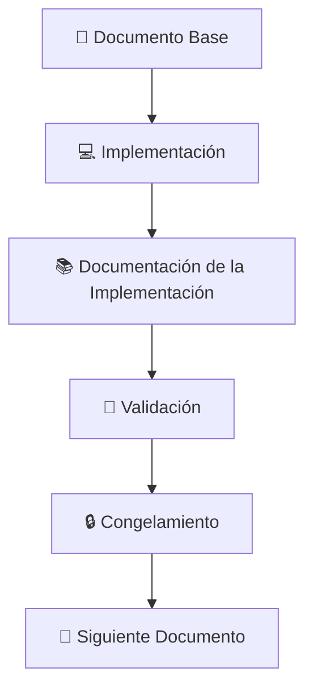
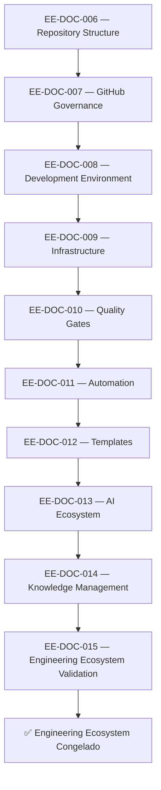
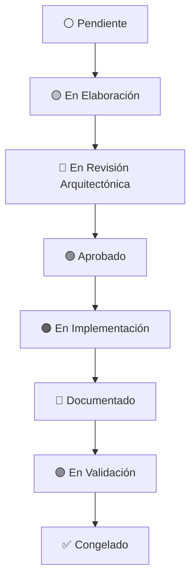
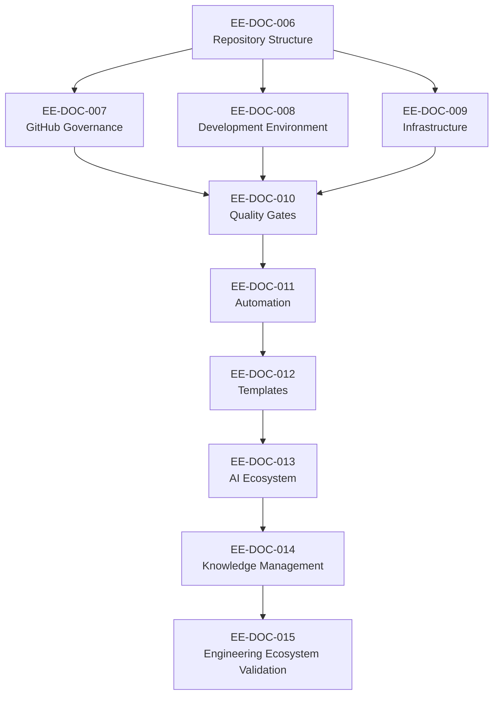

# EE-DOC-001 — Master Documentation Index

Este documento sigue el estándar **EE-DOC-002 — Document Design Template**.

## METADATOS

| Campo                 | Valor                                   |
| --------------------- | --------------------------------------- |
| **ID**                | EE-DOC-001                              |
| **Documento**         | Master Documentation Index              |
| **Código corto**      | EE-DOC-001                              |
| **Tipo**              | Documento Normativo                     |
| **Clasificación**     | Fundacional                             |
| **Nivel**             | Estratégico                             |
| **Normativo**         | Sí                                      |
| **Versión**           | v2.26.2                                 |
| **Estado**            | Congelado                               |
| **Propietario**       | Equipo de Arquitectura                  |
| **Documento padre**   | No aplica                               |
| **Dependencias**      | Ninguna                                 |
| **Aprobado por**      | Equipo de Arquitectura                  |
| **Audiencia**         | Arquitectura, Desarrollo, IA, Dirección |
| **Fecha de creación** | 2026-08-02                              |
| **Última revisión**   | 2026-10-09                              |
| **Próxima revisión**  | No aplica — Documento Congelado         |

---

## 1. Propósito

El **Master Documentation Index** es el mapa único, fuente de verdad, roadmap, planificación, estado documental, estado de implementación y trazabilidad del Engineering Ecosystem. Define qué documentos existen, su código, su propósito, su fase, su estado, qué genera y su orden de implementación.

Este documento garantiza que:

- **No existan documentos huérfanos** (sin propósito definido).
- **No existan componentes sin documentar** (todo componente del ecosistema tiene su documento).
- **La trazabilidad documental sea completa** (cada documento tiene un código, dependencias y artefacto generado).
- **La documentación nunca se desalinee de la implementación.**
- **El estado del ecosistema sea visible en un solo lugar.**

---

## 2. Alcance

Este índice cubre todos los documentos y reglas de la plataforma **EE-LABS** (Engineering Ecosystem). Todo el código fuente, automatización, herramientas y documentación de esta serie se distribuye bajo la **Apache License 2.0**. No cubre la lógica comercial propietaria de los productos o aplicaciones de negocio desarrollados sobre el ecosistema.

- Documentos de gobernanza (`EE-DOC-XXX`)
- Documentos de arquitectura (`EE-DOC-XXX`)
- Documentos de flujo de trabajo (`EE-DOC-XXX`)
- Documentos de herramientas y entornos (`EE-DOC-XXX`)
- Documentos de implementación (`EE-IMP-XXX-PXX`)

No cubre:

- Documentos específicos de proyectos (EQ-Labs, Product Ecosystem y Business Application)
- Documentación técnica de implementación (generada a partir de los documentos congelados)

---

## 3. Filosofía del Engineering Ecosystem

Este documento constituye la autoridad documental del Engineering Ecosystem. Ante cualquier discrepancia entre este índice y otros documentos, prevalece este índice hasta que la modificación correspondiente sea aprobada y sincronizada.

**Principios fundamentales:**

1. **Todo se documenta.** No existe configuración sin documentación.
2. **Una única fuente de verdad.** Nunca hay información duplicada.
3. **Automatizar todo.** Si una tarea puede automatizarse, se automatiza.

---

## 4. Estrategia Oficial de Implementación

La construcción del Engineering Ecosystem sigue la siguiente estrategia:

Este ciclo se aplica a cada documento del ecosistema, garantizando que la documentación y la implementación permanezcan siempre sincronizadas.

---

## 5. Roadmap del Ecosistema

El Engineering Ecosystem se construye en cuatro fases:

| Fase       | Nombre                          | Propósito                                           | Documentos              |
| ---------- | ------------------------------- | --------------------------------------------------- | ----------------------- |
| **Fase 1** | **Fundación (Conceptual)**      | Define el ecosistema, pero no genera código.        | EE-DOC-001 a EE-DOC-005 |
| **Fase 2** | **Foundation (Implementación)** | Crea la base física del Engineering Ecosystem.      | EE-DOC-006 a EE-DOC-008 |
| **Fase 3** | **Core Components**             | Cada documento produce un componente implementable. | EE-DOC-009 a EE-DOC-014 |
| **Fase 4** | **Validation**                  | Validación end-to-end del ecosistema completo.      | EE-DOC-015              |

---

## 6. Estructura Documental

| Fase       | Orden | Código         | Documento                          | Genera                                                                                    | Artefacto                                                      | Dependencias |
| ---------- | ----- | -------------- | ---------------------------------- | ----------------------------------------------------------------------------------------- | -------------------------------------------------------------- | ------------ |
| **Fase 1** | 1     | **EE-DOC-001** | Master Documentation Index         | Índice maestro, roadmap, trazabilidad y estado del Engineering Ecosystem                  | EE-DOC-001                                                     | Ninguna      |
| **Fase 1** | 2     | **EE-DOC-002** | Document Design Template           | Estándar para la estructura, formato y ciclo de vida de la documentación                  | EE-DOC-002                                                     | EE-DOC-001   |
| **Fase 1** | 3     | **EE-DOC-003** | Engineering Ecosystem Constitution | Principios, objetivos, gobernanza y reglas del Engineering Ecosystem                      | EE-DOC-003                                                     | EE-DOC-002   |
| **Fase 1** | 4     | **EE-DOC-004** | Engineering Architecture           | Arquitectura lógica, componentes, relaciones y flujos del Engineering Ecosystem           | EE-DOC-004                                                     | EE-DOC-003   |
| **Fase 1** | 5     | **EE-DOC-005** | Development Workflow               | SDLC, flujo de desarrollo, branching, commits, PRs y releases                             | EE-DOC-005                                                     | EE-DOC-004   |
| **Fase 2** | 6     | **EE-DOC-006** | Repository Structure               | Estructura física del repositorio, workspaces y organización del código fuente            | Git Repository                                                 | EE-DOC-005   |
| **Fase 2** | 7     | **EE-DOC-007** | GitHub Governance                  | Configuración organizacional de GitHub, repositorios, reglas, permisos y automatizaciones | `.github/`                                                     | EE-DOC-006   |
| **Fase 2** | 8     | **EE-DOC-008** | Development Environment            | Configuración estandarizada del entorno local de desarrollo                               | `.vscode/`, `devcontainer/`                                    | EE-DOC-007   |
| **Fase 3** | 9     | **EE-DOC-009** | Infrastructure                     | Infraestructura base, servicios y plataforma de ejecución del Engineering Ecosystem       | `infra/` (`containers/`, `orchestration/`)                     | EE-DOC-008   |
| **Fase 3** | 10    | **EE-DOC-010** | Quality Gates                      | Validaciones automáticas de calidad, arquitectura, seguridad y documentación              | CI Pipelines                                                   | EE-DOC-009   |
| **Fase 3** | 11    | **EE-DOC-011** | Automation                         | Automatización mediante CLI, scripts, generadores y procesos del ecosistema               | `scripts/`, `apps/cli`                                         | EE-DOC-010   |
| **Fase 3** | 12    | **EE-DOC-012** | Templates                          | Plantillas reutilizables para documentos, repositorios, paquetes y flujos de trabajo      | `templates/`                                                   | EE-DOC-011   |
| **Fase 3** | 13    | **EE-DOC-013** | AI Ecosystem                       | Integración, gobierno y colaboración de asistentes y herramientas de IA                   | `packages/intelligence/`                                       | EE-DOC-012   |
| **Fase 3** | 14    | **EE-DOC-014** | Knowledge Management               | Gestión, organización y sincronización del conocimiento del Engineering Ecosystem         | `packages/knowledge/` (+ `data/`; Obsidian = autoría opcional) | EE-DOC-013   |
| **Fase 4** | 15    | **EE-DOC-015** | Engineering Ecosystem Validation   | Validación funcional, arquitectónica y end-to-end del Engineering Ecosystem               | Validation Report                                              | EE-DOC-014   |

> **Definición de columnas:**
>
> - **Genera:** resultado funcional, lógico o documental producido por el documento (capacidad, componente o entregable conceptual).
> - **Artefacto:** implementación física o ubicación donde dicho resultado se materializa dentro del Engineering Ecosystem (repositorio, directorio, paquete, configuración, pipeline, plantilla, etc.).

---

## 7. Implementation Roadmap

> **Nota:** Cada documento del roadmap ejecuta el ciclo completo definido en la Sección 04 (Estrategia Oficial de Implementación) antes de avanzar al siguiente documento.

---

## 8. Estados del Ciclo de Vida Documental

| Icono | Estado                         | Descripción                                                       |
| ----- | ------------------------------ | ----------------------------------------------------------------- |
| ⚪    | **Pendiente**                  | El documento aún no ha comenzado.                                 |
| 🟡    | **En Elaboración**             | El documento está siendo redactado.                               |
| 🔵    | **En Revisión Arquitectónica** | El documento está en revisión por Arquitectura.                   |
| 🟢    | **Aprobado**                   | El documento fue aprobado y puede implementarse.                  |
| 🟠    | **En Implementación**          | Se está implementando lo definido por el documento.               |
| 🔷    | **Documentado**                | La documentación técnica derivada ya fue generada y sincronizada. |
| 🟣    | **En Validación**              | La implementación y documentación está siendo validada.           |
| ✅    | **Congelado**                  | Documento e implementación sincronizados y cerrados.              |

**Flujo del Ciclo de Vida:**

## 9. Matriz de Trazabilidad

| Código         | Documento                          | Naturaleza    | Implementación Aplicable | Estado Documental | Validado | Congelado |
| :------------- | :--------------------------------- | :------------ | :----------------------: | :---------------: | :------: | :-------: |
| **EE-DOC-001** | Master Documentation Index         | Fundacional   |           N/A            |     Congelado     |   N/A    |    Sí     |
| **EE-DOC-002** | Document Design Template           | Fundacional   |           N/A            |     Congelado     |   N/A    |    Sí     |
| **EE-DOC-003** | Engineering Ecosystem Constitution | Fundacional   |           N/A            |     Congelado     |   N/A    |    Sí     |
| **EE-DOC-004** | Engineering Architecture           | Fundacional   |           N/A            |     Congelado     |   N/A    |    Sí     |
| **EE-DOC-005** | Development Workflow               | Fundacional   |           N/A            |     Congelado     |   N/A    |    Sí     |
| **EE-DOC-006** | Repository Structure               | Implementable |            Sí            |     Congelado     |    Sí    |    Sí     |
| **EE-DOC-007** | GitHub Governance                  | Implementable |            Sí            |     Congelado     |    Sí    |    Sí     |
| **EE-DOC-008** | Development Environment            | Implementable |            Sí            |     Congelado     |    Sí    |    Sí     |
| **EE-DOC-009** | Infrastructure                     | Implementable |            Sí            |     Congelado     |    Sí    |    Sí     |
| **EE-DOC-010** | Quality Gates                      | Implementable |            Sí            |     Congelado     |    Sí    |    Sí     |
| **EE-DOC-011** | Automation                         | Implementable |            Sí            |     Congelado     |    Sí    |    Sí     |
| **EE-DOC-012** | Templates                          | Implementable |            Sí            |     Congelado     |    Sí    |    Sí     |
| **EE-DOC-013** | AI Ecosystem                       | Implementable |            Sí            |     Congelado     |    Sí    |    Sí     |
| **EE-DOC-014** | Knowledge Management               | Implementable |            Sí            |     Congelado     |    Sí    |    Sí     |
| **EE-DOC-015** | Engineering Ecosystem Validation   | Implementable |            Sí            |     Congelado     |    Sí    |    Sí     |

> **Naturaleza:**
>
> - **Fundacional** (EE-DOC-001 a EE-DOC-005): documentos conceptuales. No generan implementación física directa ni EE-IMP/EE-TEC propios. Excepción formal a R4.
> - **Implementable** (EE-DOC-006 en adelante): generan ciclo completo de implementación, documentación técnica y validación.
>
> **Validado / Congelado (documentos implementables):** «Sí» incluye el régimen de **PENDING listado** y dictamen de ecosistema **DEGRADED** admisible definido por EE-DOC-015 (§04.4.2, §04.4.3). No exige PASS total de todos los dominios de validación (p. ej. V-ARCH-LAYERS y V-E2E pueden permanecer PENDING).

### 9.1. Matriz de Decisiones Arquitectónicas (ADRs)

| Código         | Documento                              | Estado   | Norma/Documento Padre   | Impacto Principal                                                                                                                                                       |
| :------------- | :------------------------------------- | :------- | :---------------------- | :---------------------------------------------------------------------------------------------------------------------------------------------------------------------- |
| **EE-ADR-001** | Workspace Task Orchestration Strategy  | Aprobado | EE-DOC-006              | Establece a Turborepo como orquestador oficial y PNPM como gestor de paquetes.                                                                                          |
| **EE-ADR-002** | Engineering Ecosystem Testing Standard | Aprobado | EE-DOC-004              | Establece Vitest (Unit/Integration) y Playwright (E2E) como estándares de testing.                                                                                      |
| **EE-ADR-003** | Node.js Baseline Upgrade to 24 LTS     | Aprobado | EE-DOC-004 / EE-DOC-006 | Adopta Node.js ≥ 24 < 25 (LTS) como baseline de runtime del monorepo; sustituye ≥ 22.19 < 23.                                                                           |
| **EE-ADR-004** | Quality Gates Progressive Adoption     | Aprobado | EE-DOC-005              | Mandatory ≠ Implemented ≠ Enforced; adopción progresiva de Mandatory Gates.                                                                                             |
| **EE-ADR-005** | AI Provider SPI and Connector Adapters | Aprobado | EE-DOC-004 / EE-DOC-013 | SPI en Foundation; adapters en connectors; composition root = apps/\* (no SDK); scripts/bootstrap no es composition root; Config tooling; extensión §13.2 (EE-DOC-006). |

#### Leyenda de estados (ADRs / RFCs)

| Símbolo / Texto            | Significado                                      |
| :------------------------- | :----------------------------------------------- |
| **Aprobado**               | Decisión arquitectónica o RFC aprobado; vigente. |
| **Propuesto**              | En elaboración o revisión; aún no vinculante.    |
| **Rechazado / Superseded** | No vigente.                                      |

> Los iconos ✅ / 🟡 / ⬜ de la matriz documental (§09) no se reutilizan en las matrices de ADR/RFC para evitar ambigüedad de significado.

### 9.2. Matriz de Requests for Comments (RFCs)

| Código         | Documento                     | Estado   | Norma/Documento Padre   | Impacto Principal                                                                          |
| :------------- | :---------------------------- | :------- | :---------------------- | :----------------------------------------------------------------------------------------- |
| **EE-RFC-001** | Infra Top Level Directory     | Aprobado | EE-DOC-006 / EE-DOC-009 | Introduce `infra/` (`containers/`, `orchestration/`) en sustitución de `docker/` y `k8s/`. |
| **EE-RFC-002** | Templates Top Level Directory | Aprobado | EE-DOC-006 / EE-DOC-012 | Introduce `templates/` como top-level autorizado y sincroniza EE-DOC-006.                  |

### 9.3. Matriz de Evidencia de Implementación (documentos implementables)

| Código         | EE-IMP (fases)         | EE-TEC     | Validación                               | Pendientes residuales admisibles                                 | Estado cierre |
| :------------- | :--------------------- | :--------- | :--------------------------------------- | :--------------------------------------------------------------- | :------------ |
| **EE-DOC-006** | EE-IMP-006-P01…P08     | EE-TEC-001 | Completada                               | Ninguno conocido                                                 | Congelado     |
| **EE-DOC-007** | EE-IMP-007 (histórico) | EE-TEC-002 | Completada                               | Ninguno conocido                                                 | Congelado     |
| **EE-DOC-008** | EE-IMP-008-P01…P06     | EE-TEC-003 | Completada                               | Ninguno conocido                                                 | Congelado     |
| **EE-DOC-009** | EE-IMP-009-P01…P05     | EE-TEC-004 | Completada                               | Ninguno conocido                                                 | Congelado     |
| **EE-DOC-010** | EE-IMP-010-P01…P05     | EE-TEC-005 | Completada                               | Ninguno conocido                                                 | Congelado     |
| **EE-DOC-011** | EE-IMP-011-P01…P05     | EE-TEC-006 | Completada                               | Ninguno conocido                                                 | Congelado     |
| **EE-DOC-012** | EE-IMP-012-P01…P06     | EE-TEC-007 | Completada                               | Ninguno conocido                                                 | Congelado     |
| **EE-DOC-013** | EE-IMP-013-P01…P06     | EE-TEC-008 | Completada                               | Ninguno conocido                                                 | Congelado     |
| **EE-DOC-014** | EE-IMP-014-P01…P06     | EE-TEC-009 | Completada                               | Ninguno conocido                                                 | Congelado     |
| **EE-DOC-015** | EE-IMP-015-P01…P05     | EE-TEC-010 | Completada (dictamen DEGRADED admisible) | V-ARCH-LAYERS, V-E2E (PENDING listado, régimen EE-DOC-015 §04.4) | Congelado     |

> **Ubicación canónica de artefactos** (EE-DOC-006 `docs/`):
>
> - EE-DOC-\* / EE-TEC-001…010: `docs/architecture/`
> - EE-IMP-\* (fases 006…015): `docs/developer/`
> - EE-ADR-\*: `docs/adr/`
> - EE-RFC-\*: `docs/rfc/`
> - Validación de ecosistema (reports, waivers, evidence, audit): `docs/validation/`
>
> «Validación Completada» para EE-DOC-015 incluye el régimen PENDING listado y dictamen DEGRADED admisible (EE-DOC-015 §04.4.2 / §04.4.3). No se exige PASS de V-ARCH-LAYERS ni de V-E2E para el cierre de Fase 4.

---

## 10. Reglas de Gobernanza Documental

| Regla   | Descripción                                                                                                                                                                                                                                                                                                                                                                                                                                                                                  |
| ------- | -------------------------------------------------------------------------------------------------------------------------------------------------------------------------------------------------------------------------------------------------------------------------------------------------------------------------------------------------------------------------------------------------------------------------------------------------------------------------------------------- |
| **R1**  | Ningún documento puede implementarse sin aprobación arquitectónica.                                                                                                                                                                                                                                                                                                                                                                                                                          |
| **R2**  | Ningún documento congelado puede modificarse sin cambio gobernado: **RFC** o **ADR**, según la clasificación de EE-DOC-005 §04.2 (Tipo C/D u otras previstas). Un ADR Tipo C es vehículo válido cuando el cambio es decisión arquitectónica sin alterar necesariamente el árbol de primer nivel.                                                                                                                                                                                             |
| **R3**  | Toda implementación debe mantenerse sincronizada con su documento.                                                                                                                                                                                                                                                                                                                                                                                                                           |
| **R4**  | Cada documento **implementable** (EE-DOC-006 en adelante) genera su implementación y documentación técnica derivada. Los documentos **fundacionales** (EE-DOC-001 a EE-DOC-005) están exceptuados: no generan EE-IMP ni EE-TEC propios (ver §09 — Naturaleza).                                                                                                                                                                                                                               |
| **R5**  | El roadmap documental solo cambia mediante aprobación del Equipo de Arquitectura.                                                                                                                                                                                                                                                                                                                                                                                                            |
| **R6**  | Los documentos deben seguir la estructura definida en este índice.                                                                                                                                                                                                                                                                                                                                                                                                                           |
| **R7**  | Las dependencias entre documentos deben respetar el orden de implementación.                                                                                                                                                                                                                                                                                                                                                                                                                 |
| **R8**  | La implementación deberá seguir exactamente el orden establecido por el Implementation Roadmap, salvo excepción aprobada mediante ADR.                                                                                                                                                                                                                                                                                                                                                       |
| **R9**  | Un documento solo podrá cambiar a estado **Congelado** cuando: (1) el documento esté aprobado, (2) la implementación esté completada (si aplica), (3) la documentación derivada esté sincronizada (si aplica) y (4) la validación esté completada (si aplica). Para documentos implementables, «validación completada» incluye el régimen de **PENDING listado** y dictamen de ecosistema **DEGRADED** admisible definido por EE-DOC-015 (§04.4); no exige PASS total de todos los dominios. |
| **R10** | Cualquier modificación del orden de implementación o del roadmap requiere actualización obligatoria de **EE-DOC-001** antes de modificar cualquier otro documento.                                                                                                                                                                                                                                                                                                                           |

---

## 11. Mapa de Dependencias

> **Nota:** El diagrama representa las dependencias arquitectónicas entre los documentos del Engineering Ecosystem y no el orden de implementación. Un documento puede depender de varios documentos previos aunque su implementación se realice siguiendo el orden secuencial definido en el Roadmap del Ecosistema (Sección 06) y detallado en el Implementation Roadmap (Sección 07).

---

## 12. Resumen Estadístico

| Fase                                     | Documentos                  |
| ---------------------------------------- | --------------------------- |
| **Fase 1 — Fundación (Conceptual)**      | 5 (EE-DOC-001 a EE-DOC-005) |
| **Fase 2 — Foundation (Implementación)** | 3 (EE-DOC-006 a EE-DOC-008) |
| **Fase 3 — Core Components**             | 6 (EE-DOC-009 a EE-DOC-014) |
| **Fase 4 — Validation**                  | 1 (EE-DOC-015)              |
| **Total**                                | **15**                      |

---

## 13. Métricas del Ecosistema

| Métrica                                           | Valor                                  | Objetivo           |
| ------------------------------------------------- | -------------------------------------- | ------------------ |
| **Documentos Totales**                            | 15                                     | 15                 |
| **Documentos Congelados**                         | 15 de 15                               | 15                 |
| **Implementaciones Finalizadas**                  | 10 de 10                               | 10                 |
| **Implementaciones Validadas**                    | 10 de 10                               | 10                 |
| **Pendientes residuales admisibles (ecosistema)** | V-ARCH-LAYERS, V-E2E (PENDING listado) | Régimen EE-DOC-015 |

> **Nota — Naturaleza y cómputo:**
>
> - Las implementaciones físicas comienzan a partir de **EE-DOC-006**. Los documentos fundacionales (EE-DOC-001 a EE-DOC-005) no generan implementación directa y no entran en el denominador 10.
> - **Implementación Finalizada / Validada** = ciclo IMP + TEC + Validation Report cerrado. Para EE-DOC-015 incluye el régimen **PENDING listado** y dictamen de ecosistema **DEGRADED** admisible (EE-DOC-015 §04.4.2 / §04.4.3). No se exige PASS de V-ARCH-LAYERS ni de V-E2E para contabilizar el cierre de Fase 4.
> - **Estado actual:** EE-DOC-001 a EE-DOC-015 **Congelados**. Congelados: **15 de 15**. Implementaciones finalizadas **10 de 10**; validadas **10 de 10** (con residuales PENDING listados explícitos en §09.3).

---

## 14. Referencias

| Código         | Documento                              | Relación                                                                    |
| -------------- | -------------------------------------- | --------------------------------------------------------------------------- |
| **EE-DOC-002** | Document Design Template               | Estándar de estructura, metadatos, plantillas y ciclo de vida documental.   |
| **EE-DOC-005** | Development Workflow                   | Ciclo de vida, cambio gobernado (R2) y clasificación Tipo A/B/C/D.          |
| **EE-DOC-015** | Engineering Ecosystem Validation       | Régimen PENDING listado, dictamen DEGRADED y criterios de cierre de Fase 4. |
| **EE-ADR-001** | Workspace Task Orchestration Strategy  | Orquestador oficial (Turborepo) y gestor de paquetes (pnpm).                |
| **EE-ADR-002** | Engineering Ecosystem Testing Standard | Estándar de testing (Vitest + Playwright).                                  |
| **EE-ADR-003** | Node.js Baseline Upgrade to 24 LTS     | Baseline de runtime Node.js ≥ 24 &lt; 25.                                   |
| **EE-ADR-004** | Quality Gates Progressive Adoption     | Adopción progresiva de Mandatory Gates.                                     |
| **EE-ADR-005** | AI Provider SPI and Connector Adapters | SPI, adapters y composition root.                                           |
| **EE-RFC-001** | Infra Top Level Directory              | Top-level `infra/`.                                                         |
| **EE-RFC-002** | Templates Top Level Directory          | Top-level `templates/`.                                                     |

---

## 15. Historial de Cambios

> **Columna Estado:** refleja el estado del documento **tras** aplicar el cambio de esa fila (estado de la versión resultante), no el estado de las versiones intermedias descritas en el motivo.

| Versión     | Fecha      | Autor                  | Aprobado por           | Motivo                                | Cambios                                                                                                                                                                                                                                                                                               | Estado        |
| :---------- | :--------- | :--------------------- | :--------------------- | :------------------------------------ | :---------------------------------------------------------------------------------------------------------------------------------------------------------------------------------------------------------------------------------------------------------------------------------------------------- | :------------ |
| **v1.0.0**  | 2026-08-02 | Equipo de Arquitectura | Equipo de Arquitectura | Creación inicial                      | Versión inicial del Master Documentation Index                                                                                                                                                                                                                                                        | Congelado     |
| **v2.0.0**  | 2026-08-03 | Equipo de Arquitectura | Equipo de Arquitectura | Reestructuración completa             | Roadmap, fases, implementación, trazabilidad, métricas y reordenamiento                                                                                                                                                                                                                               | **Congelado** |
| **v2.1.0**  | 2026-09-16 | Equipo de Arquitectura | Equipo de Arquitectura | Sincronización de Decisiones          | Registro oficial de EE-ADR-001 y EE-ADR-002; alineación con estructura física real.                                                                                                                                                                                                                   | **Congelado** |
| **v2.2.0**  | 2026-09-21 | Equipo de Arquitectura | Equipo de Arquitectura | Sincronización post-cierre EE-DOC-006 | Matriz §09: EE-DOC-006 Congelado/Validado; EE-DOC-007 En Elaboración; nota IMP/TEC; métricas §13 actualizadas (6 congelados, 1 implementación finalizada y validada)                                                                                                                                  | **Congelado** |
| **v2.2.1**  | 2026-09-22 | Equipo de Arquitectura | Equipo de Arquitectura | Sincronización estado EE-DOC-007      | Matriz §09 y nota §13: EE-DOC-007 Aprobado (v1.0.0); listo para implementación                                                                                                                                                                                                                        | **Congelado** |
| **v2.2.2**  | 2026-09-23 | Equipo de Arquitectura | Equipo de Arquitectura | Registro EE-ADR-003                   | Matriz §09.1: Node.js baseline 24 LTS aprobado                                                                                                                                                                                                                                                        | **Congelado** |
| **v2.3.0**  | 2026-09-23 | Equipo de Arquitectura | Equipo de Arquitectura | Cierre EE-DOC-007                     | Matriz §09: EE-DOC-007 Congelado/Validado; EE-TEC-002; métricas 7 congelados                                                                                                                                                                                                                          | **Congelado** |
| **v2.3.2**  | 2026-09-24 | Equipo de Arquitectura | Equipo de Arquitectura | Aprobación EE-DOC-008                 | Matriz §09: EE-DOC-008 Aprobado v1.0.0; listo para EE-IMP-008                                                                                                                                                                                                                                         | **Congelado** |
| **v2.4.0**  | 2026-09-24 | Equipo de Arquitectura | Equipo de Arquitectura | Cierre EE-DOC-008                     | Matriz §09: EE-DOC-008 Congelado/Validado; EE-TEC-003; métricas 8 congelados, 3 implementaciones; próximo EE-DOC-009                                                                                                                                                                                  | **Congelado** |
| **v2.4.1**  | 2026-09-25 | Equipo de Arquitectura | Equipo de Arquitectura | Apertura EE-DOC-009                   | Matriz §09: EE-DOC-009 En Elaboración v0.1.0                                                                                                                                                                                                                                                          | **Congelado** |
| **v2.5.0**  | 2026-09-25 | Equipo de Arquitectura | Equipo de Arquitectura | EE-RFC-001 aprobado                   | Artefacto EE-DOC-009: `docker/`, `k8s/` → `infra/` (`containers/`, `orchestration/`); sincronización SSOT con EE-DOC-006 v1.4.0                                                                                                                                                                       | **Congelado** |
| **v2.5.1**  | 2026-09-25 | Equipo de Arquitectura | Equipo de Arquitectura | Aprobación EE-DOC-009                 | Matriz §09: EE-DOC-009 Aprobado v1.0.0; listo para EE-IMP-009                                                                                                                                                                                                                                         | Congelado     |
| **v2.6.0**  | 2026-09-26 | Equipo de Arquitectura | Equipo de Arquitectura | Cierre EE-DOC-009                     | Matriz §09: EE-DOC-009 Congelado/Validado v1.1.0; EE-TEC-004; métricas 9 congelados, 4 implementaciones; próximo EE-DOC-010                                                                                                                                                                           | Congelado     |
| **v2.6.1**  | 2026-09-29 | Equipo de Arquitectura | Equipo de Arquitectura | Aprobación EE-DOC-010                 | Matriz §09: EE-DOC-010 Aprobado v1.0.0; EE-ADR-004; listo para EE-IMP-010-P01                                                                                                                                                                                                                         | **Congelado** |
| **v2.7.0**  | 2026-09-30 | Equipo de Arquitectura | Equipo de Arquitectura | Cierre EE-DOC-010                     | EE-DOC-010 Congelado v1.4.0; EE-IMP-010-P01…P05 + EE-TEC-005 Completados; métricas 10/15 congelados; próximo EE-DOC-011                                                                                                                                                                               | **Congelado** |
| **v2.8.0**  | 2026-10-01 | Equipo de Arquitectura | Equipo de Arquitectura | Cierre EE-DOC-011                     | EE-DOC-011 Congelado v1.1.0; EE-IMP-011-P01…P05 + EE-TEC-006 Completados; artefacto `scripts/`+`apps/cli`; métricas 11/15 congelados; próximo EE-DOC-012                                                                                                                                              | **Congelado** |
| **v2.9.0**  | 2026-10-01 | Equipo de Arquitectura | Equipo de Arquitectura | EE-RFC-002 + EE-DOC-012 Aprobado      | `templates/` en 006 v1.5.0; EE-DOC-012 Aprobado (T-DOC RFC §18.5); listo para EE-IMP-012-P01                                                                                                                                                                                                          | **Congelado** |
| **v2.10.0** | 2026-10-02 | Equipo de Arquitectura | Equipo de Arquitectura | Cierre EE-DOC-012                     | EE-DOC-012 Congelado v1.0.0; EE-IMP-012-P01…P06 + EE-TEC-007 Completados; artefacto `templates/` + `scripts/plopfile.mjs`; métricas 12/15 congelados; próximo EE-DOC-013                                                                                                                              | **Congelado** |
| **v2.11.0** | 2026-10-02 | Equipo de Arquitectura | Equipo de Arquitectura | Apertura EE-DOC-013 + sync artefacto  | EE-DOC-013 **Aprobado** v1.0.0; artefacto roadmap `packages/ai/` → `packages/intelligence/` (EE-DOC-006); matriz §09 estado 013                                                                                                                                                                       | **Congelado** |
| **v2.12.0** | 2026-10-02 | Equipo de Arquitectura | Equipo de Arquitectura | EE-DOC-013 v0.3.0 + EE-ADR-005        | Revisión 3 bloques (capas 006, SPI/connectors, plano asistido); ADR-005 Propuesto                                                                                                                                                                                                                     | **Congelado** |
| **v2.13.0** | 2026-10-03 | Equipo de Arquitectura | Equipo de Arquitectura | Sync 013/ADR-005/006                  | EE-DOC-013; EE-ADR-005 v1.2.0; EE-DOC-006 v1.7.0 §13.2 Connectors; métricas 7/10 IMP; TEC-006/007; ADR-005 en matriz §09.1                                                                                                                                                                            | **Congelado** |
| **v2.14.0** | 2026-10-03 | Equipo de Arquitectura | Equipo de Arquitectura | ADR-005 Aprobado + sync 013/006       | EE-ADR-005 **Aprobado** v1.3.0; EE-DOC-013 v0.6.0 (Config tooling, composition root sin SDK); EE-DOC-006 higiene matriz/§12/§20.4                                                                                                                                                                     | **Congelado** |
| **v2.14.1** | 2026-10-03 | Equipo de Arquitectura | Equipo de Arquitectura | EE-DOC-006 patch version              | Vigente 006 **v1.6.1** (Config tooling, composition root sin SDK; No False Pass); sin reabrir ADR-005                                                                                                                                                                                                 | **Congelado** |
| **v2.15.0** | 2026-10-03 | Equipo de Arquitectura | Equipo de Arquitectura | 006 v1.7.0 + 013 revisión             | EE-DOC-006 **v1.7.0** (minor DOC-002 §15); EE-DOC-013 v0.7.0 **En Revisión Arquitectónica**; R2 aclara RFC o ADR                                                                                                                                                                                      | **Congelado** |
| **v2.15.1** | 2026-10-03 | Equipo de Arquitectura | Equipo de Arquitectura | Sync §13.5 / 013 / ADR                | 006 v1.7.1 §13.5; 013 v0.7.1; ADR-005 v1.3.1                                                                                                                                                                                                                                                          | **Congelado** |
| **v2.16.0** | 2026-10-03 | Equipo de Arquitectura | Equipo de Arquitectura | Aprobación EE-DOC-013 + OBS           | 013 **Aprobado** v1.0.0; ADR-005 texto composition root = apps/\*; sin pin de versión ADR en matrices donde aplique                                                                                                                                                                                   | **Congelado** |
| **v2.17.0** | 2026-10-05 | Equipo de Arquitectura | Equipo de Arquitectura | Cierre EE-IMP-013                     | EE-IMP-013-P01…P06 + **EE-TEC-008**; 013 **Congelado** (implementación cerrada); próximo EE-DOC-014                                                                                                                                                                                                   | **Congelado** |
| **v2.18.0** | 2026-10-05 | Equipo de Arquitectura | Equipo de Arquitectura | Apertura EE-DOC-014                   | Knowledge Management **v0.1.0** En Elaboración; frontera 013/Registry/docs; plan IMP-014                                                                                                                                                                                                              | **Congelado** |
| **v2.18.1** | 2026-10-05 | Equipo de Arquitectura | Equipo de Arquitectura | EE-DOC-014 v0.2.0                     | Correcciones revisión (B1–B4, M\*, m\*); techo 006 vs política Knowledge                                                                                                                                                                                                                              | **Congelado** |
| **v2.18.2** | 2026-10-05 | Equipo de Arquitectura | Equipo de Arquitectura | EE-DOC-014 v0.2.1                     | Residuales R1–R4 (004 Registry, Validation, Execution, nota techo 006)                                                                                                                                                                                                                                | **Congelado** |
| **v2.18.3** | 2026-10-05 | Equipo de Arquitectura | Equipo de Arquitectura | EE-DOC-014 v0.3.0                     | B1/B2/B3, M1–M7, m\*; KnowledgeError; un root; data/; P04 hermético; TEC-009 previsto                                                                                                                                                                                                                 | **Congelado** |
| **v2.18.4** | 2026-10-05 | Equipo de Arquitectura | Equipo de Arquitectura | EE-DOC-014 v0.3.1                     | Registry KnowledgePort; §04.7 fuentes/stores diferidos; sin Tipo A 004; TEC-005                                                                                                                                                                                                                       | **Congelado** |
| **v2.18.5** | 2026-10-05 | Equipo de Arquitectura | Equipo de Arquitectura | EE-DOC-014 v0.3.2 + sync artefacto    | Artefacto `packages/knowledge/`; métricas 13/15 y 8/10; EmbeddingPort; sin K→Execution                                                                                                                                                                                                                | **Congelado** |
| **v2.18.6** | 2026-10-05 | Equipo de Arquitectura | Equipo de Arquitectura | EE-DOC-014 v0.3.3                     | Diagrama data/; Acquisition local/externa; semantic PENDING ABI; exports workspace ≠ npm; KS-06                                                                                                                                                                                                       | **Congelado** |
| **v2.19.0** | 2026-10-05 | Equipo de Arquitectura | Equipo de Arquitectura | Aprobación EE-DOC-014                 | EE-DOC-014 **Aprobado v1.0.0**; habilita EE-IMP-014-P01…P06 + EE-TEC-009                                                                                                                                                                                                                              | **Congelado** |
| **v2.20.0** | 2026-10-06 | Equipo de Arquitectura | Equipo de Arquitectura | Cierre EE-IMP-014                     | EE-DOC-014 **Congelado** v1.1.0; EE-IMP-014-P01…P06 + **EE-TEC-009**; Fase 3 Knowledge cerrada                                                                                                                                                                                                        | **Congelado** |
| **v2.21.0** | 2026-10-06 | Equipo de Arquitectura | Equipo de Arquitectura | EE-DOC-015 v0.2.0 + 010 v1.5.0        | 015 En Elaboración (B1–B4/O1–O7); 010 frontera §02.6 sin «no vinculante»                                                                                                                                                                                                                              | **Congelado** |
| **v2.22.0** | 2026-10-06 | Equipo de Arquitectura | Equipo de Arquitectura | Sync 014/015 + 015 v0.3.0             | Métricas 14/15 congelados, 9/10 IMP; narrativa 014 Congelado; 015 v0.3.0 re-revisión                                                                                                                                                                                                                  | **Congelado** |
| **v2.22.1** | 2026-10-06 | Equipo de Arquitectura | Equipo de Arquitectura | Higiene V-GOV                         | Validadas 9/10; icono 014 ✅; 015 v0.4.0 en matriz                                                                                                                                                                                                                                                    | **Congelado** |
| **v2.23.0** | 2026-10-06 | Equipo de Arquitectura | Equipo de Arquitectura | docs/validation + 015                 | 006 autoriza docs/validation/; 015 semántica SKIPPED/QG                                                                                                                                                                                                                                               | **Congelado** |
| **v2.23.1** | 2026-10-06 | Equipo de Arquitectura | Equipo de Arquitectura | Sync 006/015 higiene                  | 006 validation README; 015 N/A agregación                                                                                                                                                                                                                                                             | **Congelado** |
| **v2.24.0** | 2026-10-07 | Equipo de Arquitectura | Equipo de Arquitectura | Sync 015 revisión arquitectónica      | 015 En Revisión Arquitectónica; higiene versiones en narrativa                                                                                                                                                                                                                                        | **Congelado** |
| **v2.25.0** | 2026-10-07 | Equipo de Arquitectura | Equipo de Arquitectura | Aprobación EE-DOC-015                 | EE-DOC-015 **Aprobado** (Fase 4 Validation)                                                                                                                                                                                                                                                           | **Congelado** |
| **v2.26.0** | 2026-10-07 | Equipo de Arquitectura | Equipo de Arquitectura | Cierre EE-DOC-015                     | EE-DOC-015 **Congelado**; EE-TEC-010; Fase 4 Validation cerrada                                                                                                                                                                                                                                       | **Congelado** |
| **v2.26.1** | 2026-10-08 | Equipo de Arquitectura | Equipo de Arquitectura | Aclaración (Tipo A) post-auditoría    | Plantilla §18.1; §14 Referencias; §09.2 RFCs; §09.3 Matriz de Evidencia IMP/TEC/Validación; columna Naturaleza; leyenda ADR/RFC sin iconos ambiguos; R4/R9 alineados con régimen PENDING listado y DEGRADED (EE-DOC-015); métricas §13 con residuales admisibles; nota de columna Estado en Historial | **Congelado** |
| **v2.26.2** | 2026-10-09 | Equipo de Arquitectura | Equipo de Arquitectura | Aclaración (Tipo A) post-reauditoría  | §09.3 rutas canónicas docs/ (architecture, developer, adr, rfc, validation); Tipo → Documento Normativo; numeración de secciones sin cero inicial; normalización de tablas (sin padding); retiro NO VERIFICABLE residual IMP-006…014                                                                  | **Congelado** |

---

## FIN DEL DOCUMENTO
