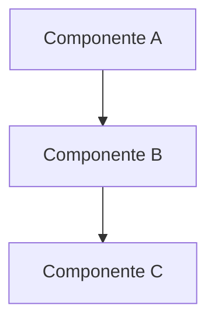
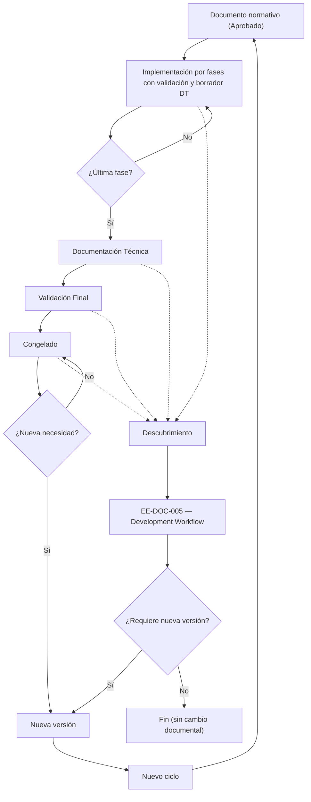
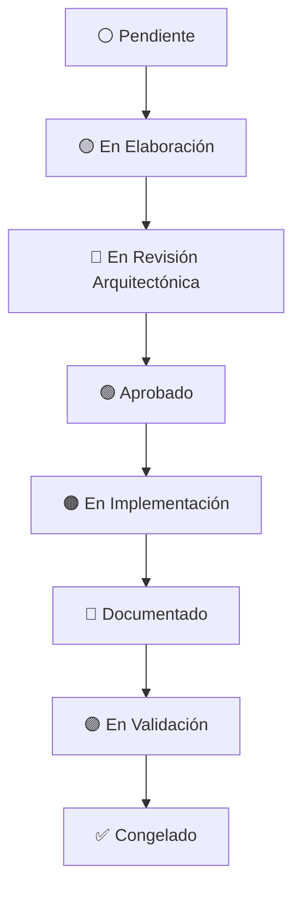
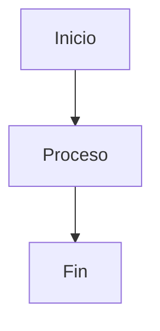
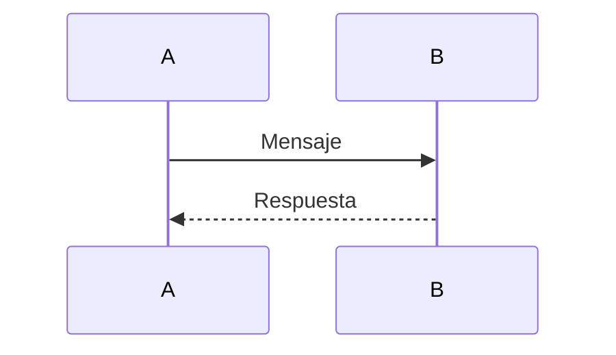

# EE-DOC-002 — Document Design Template

Este documento **es** el estándar **EE-DOC-002 — Document Design Template** (norma de diseño documental del ecosistema).

## METADATOS

| Campo                 | Valor                           |
| --------------------- | ------------------------------- |
| **ID**                | EE-DOC-002                      |
| **Documento**         | Document Design Template        |
| **Código corto**      | EE-DOC-002                      |
| **Tipo**              | Documento Normativo             |
| **Clasificación**     | Fundacional                     |
| **Nivel**             | Estratégico                     |
| **Normativo**         | Sí                              |
| **Versión**           | v1.6.1                          |
| **Estado**            | Congelado                       |
| **Propietario**       | Equipo de Arquitectura          |
| **Documento padre**   | EE-DOC-001                      |
| **Dependencias**      | EE-DOC-001                      |
| **Aprobado por**      | Equipo de Arquitectura          |
| **Audiencia**         | Arquitectura, Desarrollo, IA    |
| **Fecha de creación** | 2026-08-02                      |
| **Última revisión**   | 2026-10-10                      |
| **Próxima revisión**  | No aplica — Documento Congelado |

---

## 01. Propósito

Este documento define el estándar de diseño, estructura y formato para todos los documentos del Engineering Ecosystem. Establece las convenciones que garantizan consistencia, legibilidad, mantenibilidad y alineación con el ciclo de vida documental.

Este documento es la **plantilla oficial** que deben seguir todos los documentos del ecosistema, desde la Constitución hasta los estándares técnicos.

---

## 02. Alcance

Aplica a todos los documentos definidos por **EE-DOC-001 — Master Documentation Index**, independientemente de su clasificación o fase dentro del Engineering Ecosystem.

No aplica a:

- Documentación técnica de implementación (código, JSDoc, READMEs técnicos)
- Documentos específicos de proyectos (EQ-Labs, EUM, etc.) salvo que decidan adoptarlo

---

## 03. Estructura Base para Documentos Normativos

Todo documento normativo del Engineering Ecosystem debe seguir esta estructura base:

| Orden | Sección                  | Obligatoriedad                                   |
| ----- | ------------------------ | ------------------------------------------------ |
| 1     | **Metadatos**            | Obligatorio                                      |
| 2     | **Propósito**            | Obligatorio                                      |
| 3     | **Alcance**              | Obligatorio                                      |
| 4     | **Contenido Normativo**  | Obligatorio (contenido específico del documento) |
| 5     | **Referencias**          | Obligatorio                                      |
| 6     | **Historial de Cambios** | Obligatorio                                      |

> **Nota de Aplicación:** La estructura definida en esta sección representa la **estructura mínima obligatoria**. Cada documento podrá incorporar secciones adicionales cuando la naturaleza del documento lo requiera, manteniendo siempre dicha estructura mínima. Esta estructura base aplica a todos los documentos normativos del Engineering Ecosystem y constituye el estándar documental para los proyectos gobernados por EQ-Labs, salvo que un documento defina explícitamente una excepción aprobada por Arquitectura.

### 03.1. Jerarquía Documental

Los documentos del Engineering Ecosystem se organizan en una jerarquía que establece su orden de precedencia:

| Nivel | Tipo de Documento               | Autoridad                                                                  |
| ----- | ------------------------------- | -------------------------------------------------------------------------- |
| 1     | **Índice Maestro**              | Define la estructura documental y el roadmap del ecosistema.               |
| 2     | **Estándares Documentales**     | Define cómo se escriben todos los documentos.                              |
| 3     | **Documentos Constitucionales** | Define la gobernanza del ecosistema.                                       |
| 4     | **Documentos Arquitectónicos**  | Define la arquitectura del ecosistema.                                     |
| 5+    | **Documentos Especializados**   | Aplican las reglas de los documentos superiores en su contexto específico. |

> **Nota:** La jerarquía se define por tipo de documento, no por código específico. El `Master Documentation Index` (EE-DOC-001) es la fuente de verdad para la asignación de códigos y la estructura documental.

> **Regla de Precedencia:**
> En caso de conflicto entre dos documentos, prevalece el documento de nivel jerárquico superior. Un documento de nivel inferior no puede contradecir lo establecido en un documento de nivel superior, salvo que el documento superior haga referencia explícita a la excepción.
>
> Si dos documentos pertenecen al mismo nivel jerárquico y existe conflicto, prevalecerá el documento aprobado más recientemente, salvo que exista una relación explícita de dependencia entre ellos.

---

## 04. Estructura para Documentos Técnicos

Los documentos técnicos (guías, manuales, estándares de implementación) pueden seguir una estructura más flexible:

| Orden | Sección                  | Obligatoriedad                     |
| ----- | ------------------------ | ---------------------------------- |
| 1     | **Metadatos**            | Obligatorio                        |
| 2     | **Propósito**            | Obligatorio                        |
| 3     | **Alcance**              | Obligatorio                        |
| 4     | **Contenido Técnico**    | Obligatorio (contenido específico) |
| 5     | **Referencias**          | Recomendado                        |
| 6     | **Historial de Cambios** | Obligatorio                        |

---

## 05. Metadatos Estándar

Todos los documentos deben incluir la siguiente tabla de metadatos al inicio:

| Campo                 | Descripción                       | Obligatoriedad |
| --------------------- | --------------------------------- | -------------- |
| **ID**                | Identificador único del documento | Obligatorio    |
| **Documento**         | Nombre completo del documento     | Obligatorio    |
| **Código corto**      | Código de nivel y número          | Obligatorio    |
| **Tipo**              | Tipo de documento                 | Obligatorio    |
| **Clasificación**     | Clasificación del documento       | Obligatorio    |
| **Nivel**             | Nivel jerárquico                  | Obligatorio    |
| **Normativo**         | Indica si es normativo            | Obligatorio    |
| **Versión**           | Versión semántica                 | Obligatorio    |
| **Estado**            | Estado del ciclo de vida          | Obligatorio    |
| **Propietario**       | Equipo responsable                | Obligatorio    |
| **Documento padre**   | ID del documento padre            | Opcional       |
| **Dependencias**      | IDs de documentos relacionados    | Opcional       |
| **Aprobado por**      | Equipo que aprueba                | Opcional       |
| **Audiencia**         | Público objetivo                  | Obligatorio    |
| **Fecha de creación** | Fecha de creación                 | Obligatorio    |
| **Última revisión**   | Fecha de última revisión          | Obligatorio    |
| **Próxima revisión**  | Fecha de próxima revisión         | Obligatorio\*  |

> **(\*) Próxima revisión — excepción Congelado:** Si el **Estado** del documento es **Congelado**, el valor obligatorio del campo es `No aplica — Documento Congelado` (no se exige una fecha futura de revisión mientras permanezca congelado). Cualquier descongelamiento o nueva versión vuelve a exigir fecha o la misma excepción según el nuevo estado.

> **Regla de Inmutabilidad:** Los campos **ID**, **Código corto** y **Fecha de creación** son inmutables una vez que el documento ha sido aprobado. No pueden modificarse bajo ninguna circunstancia.

---

## 06. Convenciones de Numeración

| Elemento                  | Formato                 | Ejemplo                       |
| ------------------------- | ----------------------- | ----------------------------- |
| **Secciones principales** | Número de dos dígitos   | `## 01. Propósito`            |
| **Subsecciones**          | Número + punto          | `### 01.1. Alcance`           |
| **Sub-subsecciones**      | Número + punto + número | `#### 01.1.1. Detalle`        |
| **Tablas**                | Numeración secuencial   | `Tabla 1: Metadatos`          |
| **Figuras**               | Numeración secuencial   | `Figura 1: Diagrama de flujo` |
| **Listas**                | Viñetas o números       | `- Elemento` o `1. Elemento`  |

> **Regla de Renumeración:** La numeración de secciones es **continua**. Si una sección se elimina, el documento debe renumerarse antes de avanzar al estado **Aprobado**. Las referencias a secciones eliminadas deben actualizarse o eliminarse.

---

## 07. Convenciones de Títulos

| Nivel de Título          | Formato     | Uso                              | Ejemplo                                |
| ------------------------ | ----------- | -------------------------------- | -------------------------------------- |
| **Título del documento** | `#` (H1)    | Título principal                 | `# Engineering Ecosystem Constitution` |
| **Sección**              | `##` (H2)   | Sección principal                | `## 01. Propósito`                     |
| **Subsección**           | `###` (H3)  | Subsección dentro de una sección | `### 01.1. Alcance`                    |
| **Sub-subsección**       | `####` (H4) | Detalle dentro de una subsección | `#### 01.1.1. Reglas`                  |

---

## 08. Reglas para Tablas

| Regla              | Descripción                                                              |
| ------------------ | ------------------------------------------------------------------------ |
| **Encabezados**    | Todas las tablas deben tener encabezados claros                          |
| **Alineación**     | Usar alineación consistente (izquierda para texto, derecha para números) |
| **Formato**        | Los encabezados en negrita y Title Case                                  |
| **Separadores**    | Usar `\|` para columnas y `---` para separadores                         |
| **Simplificación** | Evitar tablas excesivamente complejas                                    |

**Formato estándar:**

| Columna 1 | Columna 2 | Columna 3 |
| --------- | --------- | --------- |
| Dato 1    | Dato 2    | Dato 3    |

---

## 09. Reglas para Diagramas Mermaid

| Regla            | Descripción                                                       |
| :--------------- | :---------------------------------------------------------------- |
| **Tipo**         | Usar el tipo de diagrama más adecuado (flowchart, sequence, etc.) |
| **Sintaxis**     | Validar que la sintaxis sea correcta                              |
| **Título**       | Incluir un título antes del diagrama                              |
| **Nodos**        | Nombres descriptivos y cortos                                     |
| **Dependencias** | Reflejar únicamente dependencias reales                           |

**Formato estándar:**

### Título del Diagrama



---

## 10. Convenciones de Imágenes

| Regla            | Descripción                                    |
| ---------------- | ---------------------------------------------- |
| **Formato**      | Preferir SVG o PNG                             |
| **Ubicación**    | Almacenar en carpeta `assets/` o `images/`     |
| **Título**       | Incluir un título antes de la imagen           |
| **Tamaño**       | Mantener tamaño razonable                      |
| **Alternativas** | Usar diagramas Mermaid siempre que sea posible |

---

## 11. Formato del Historial de Cambios

| Columna          | Descripción                             |
| ---------------- | --------------------------------------- |
| **Versión**      | Número de versión                       |
| **Fecha**        | Fecha del cambio                        |
| **Autor**        | Autor del cambio                        |
| **Aprobado por** | Quién aprobó el cambio                  |
| **Motivo**       | Razón del cambio                        |
| **Cambios**      | Descripción de los cambios              |
| **Estado**       | Estado del documento después del cambio |

**Formato estándar:**

| Versión | Fecha      | Autor  | Aprobado por | Motivo   | Cambios         | Estado                    |
| ------- | ---------- | ------ | ------------ | -------- | --------------- | ------------------------- |
| v1.0.0  | YYYY-MM-DD | Equipo | Equipo       | Creación | Versión inicial | Estado documental vigente |

> **Nota:** Cada entrada del historial representa una versión documental identificable. Una versión que haya alcanzado el estado Congelado deberá conservarse como referencia histórica y no podrá ser modificada directamente.

---

## 12. Convenciones de Referencias

| Regla         | Descripción                                                 |
| :------------ | :---------------------------------------------------------- |
| **Formato**   | Código — Nombre del Documento                               |
| **Ejemplo**   | EE-DOC-001 — Master Documentation Index                     |
| **Enlaces**   | Usar enlaces a otros documentos cuando sea posible          |
| **Secciones** | Referenciar secciones específicas cuando sea necesario      |
| **Versiones** | Referenciar versiones específicas solo cuando sea relevante |

---

## 13. Estados Documentales

| Icono | Estado                         | Descripción                                                                                         |
| :---: | :----------------------------- | :-------------------------------------------------------------------------------------------------- |
|  ⚪   | **Pendiente**                  | El documento aún no ha comenzado.                                                                   |
|  🟡   | **En Elaboración**             | El documento está siendo redactado.                                                                 |
|  🔵   | **En Revisión Arquitectónica** | El documento está en revisión por Arquitectura.                                                     |
|  🟢   | **Aprobado**                   | El documento fue aprobado y puede implementarse.                                                    |
|  🟠   | **En Implementación**          | Se está implementando lo definido por el documento.                                                 |
|  🔷   | **Documentado**                | La documentación técnica derivada ya fue generada y sincronizada.                                   |
|  🟣   | **En Validación**              | La implementación y documentación está siendo validada.                                             |
|  ✅   | **Congelado**                  | Documento e implementación sincronizados, validados y formalmente cerrados para la versión vigente. |

### 13.1. Integridad normativa durante la implementación

**Regla de Integridad Normativa:**

Un documento normativo no podrá avanzar al estado Congelado mientras exista una desviación conocida entre su contenido normativo vigente y la implementación correspondiente que no haya sido formalmente resuelta, documentada o aceptada mediante el mecanismo de gobernanza aplicable.

**Regla de Implementación Adaptativa:**

Los documentos normativos sujetos a implementación deben permanecer en el estado En Implementación mientras la implementación pueda producir descubrimientos que requieran modificar su contenido normativo.

Cuando un descubrimiento requiera una modificación normativa, el documento deberá continuar bajo el flujo de implementación adaptativa establecido en EE-DOC-005 — Development Workflow hasta que la modificación haya sido evaluada, aprobada, incorporada, validada y documentada.

### 13.2. Naturaleza del estado Congelado

**Congelado no significa inmutable.**

El estado Congelado indica que la versión vigente del documento ha completado su ciclo de implementación, documentación técnica y validación final; y que el contenido normativo y la implementación correspondiente se encuentran sincronizados o que cualquier desviación residual ha sido formalmente resuelta, documentada o aceptada mediante el mecanismo de gobernanza aplicable.

Una versión congelada no puede modificarse directamente. Cualquier modificación posterior deberá ejecutarse mediante el mecanismo de cambio gobernado correspondiente y deberá generar una nueva versión documental.

Por lo tanto:

- Congelado = versión vigente estabilizada y protegida contra modificaciones directas.
- Congelado ≠ documento permanentemente inmutable.

#### Evolución de una versión congelada



---

## 14. Ciclo de Vida Documental



> **Nota sobre evolución posterior:** El estado Congelado representa el cierre de la versión vigente, no el cierre definitivo del documento. Cuando exista una necesidad legítima de modificación posterior, deberá iniciarse el mecanismo de cambio gobernado definido en EE-DOC-005, dando lugar a una nueva versión documental.

---

## 15. Reglas de Versionado

| Regla                    | Descripción                                                                                                                            |
| ------------------------ | -------------------------------------------------------------------------------------------------------------------------------------- |
| **Formato**              | `vX.Y.Z` donde X es mayor, Y es menor y Z es parche                                                                                    |
| **Cambio Mayor (X)**     | Cambios incompatibles en la estructura, alcance o contenido normativo                                                                  |
| **Cambio Menor (Y)**     | Adiciones o modificaciones compatibles que amplían o ajustan el contenido sin romper su contrato normativo existente                   |
| **Parche (Z)**           | Correcciones ortográficas, tipográficas, de formato o errores menores que no modifican el significado normativo                        |
| **Nueva versión**        | Toda modificación posterior a una versión congelada debe generar una nueva versión mediante el mecanismo de cambio gobernado aplicable |
| **Versión congelada**    | Una versión que ha alcanzado el estado Congelado no puede modificarse directamente                                                     |
| **Evolución documental** | El documento puede evolucionar mediante nuevas versiones, cada una sometida al ciclo de gobernanza correspondiente                     |
| **Historial**            | Todo cambio de versión debe registrarse en el historial de cambios del documento.                                                      |

> **Regla de Inmutabilidad de Versión:** Una vez que una versión documental alcanza el estado Congelado, su contenido correspondiente a dicha versión no podrá modificarse directamente. Cualquier cambio posterior deberá producir una nueva versión documental y conservar la trazabilidad con respecto a la versión anterior.

---

## 16. Convenciones de Nomenclatura

| Elemento         | Formato          | Ejemplo                                 |
| ---------------- | ---------------- | --------------------------------------- |
| **IDs**          | `XX-XXX-XXX`     | `EE-DOC-001`                            |
| **Documentos**   | Title Case       | `Engineering Ecosystem Constitution`    |
| **Código Corto** | `XX-XXX-XXX`     | `EE-DOC-001`                            |
| **Archivos**     | kebab-case       | `engineering-ecosystem-constitution.md` |
| **Roles**        | Title Case       | `Arquitecto`                            |
| **Herramientas** | Capitalizado     | `VSCode`, `Windsurf`                    |
| **Paquetes**     | kebab-case       | `kernel-foundation`                     |
| **Repositorios** | kebab-case       | `eq-labs-platform`                      |
| **Carpetas**     | kebab-case       | `packages/kernel-foundation/`           |
| **Variables**    | camelCase        | `knowledgeEngine`                       |
| **Tipos**        | PascalCase       | `KnowledgeEngine`                       |
| **Interfaces**   | PascalCase       | `IKnowledgeEngine`                      |
| **Enums**        | PascalCase       | `KnowledgeStatus`                       |
| **Constantes**   | UPPER_SNAKE_CASE | `MAX_RETRY_COUNT`                       |
| **Namespaces**   | dot.case         | `company.domain`                        |

### 16.1. Política de Idioma por Tipo de Artefacto (Normativo)

El ecosistema establece una regla de separación estricta entre el código de ejecución y la documentación de gobernanza.

Esta sección es la **Single Source of Truth** de la política de idioma por tipo de artefacto. Los documentos especializados (p. ej. EE-DOC-006, EE-DOC-007) podrán especializar nomenclatura o aplicar la regla a dominios concretos, pero **no deberán redefinir ni duplicar** esta política.

| Tipo de Artefacto                                                  | Idioma Obligatorio | Justificación                                                                |
| :----------------------------------------------------------------- | :----------------- | :--------------------------------------------------------------------------- |
| **Código fuente**                                                  | Inglés (`en-US`)   | Compatibilidad con compiladores, linters y estándares internacionales.       |
| **Comentarios de código y JSDoc**                                  | Inglés (`en-US`)   | Mantenibilidad e inspección por herramientas automatizadas e IA.             |
| **Nombres de variables, funciones y tipos**                        | Inglés (`en-US`)   | Convención de desarrollo de software profesional.                            |
| **Nombres de archivos y directorios**                              | Inglés (`en-US`)   | Evitar problemas de codificación y caracteres especiales en SO.              |
| **Archivos package.json y manifiestos**                            | Inglés (`en-US`)   | Estándar de la industria de gestores de paquetes.                            |
| **README técnicos de paquetes (`packages/*/README.md`)**           | Inglés (`en-US`)   | Exposición pública y consumo técnico local.                                  |
| **Ramas Git**                                                      | Inglés (`en-US`)   | Convención de repositorio y compatibilidad con herramientas.                 |
| **Plantillas de Issue / Pull Request**                             | Inglés (`en-US`)   | Artefactos técnicos de plataforma; consumo por herramientas e integraciones. |
| **Mensajes y salidas de CI / GitHub Actions / bots de plataforma** | Inglés (`en-US`)   | Artefactos técnicos de automatización e interfaces de plataforma.            |
| **Nombres de workflows, jobs y steps de CI**                       | Inglés (`en-US`)   | Artefactos técnicos de automatización.                                       |
| **Documentos normativos (`EE-DOC-XXX`)**                           | Español            | Comprensión, precisión legal y gobernanza directa del equipo.                |
| **Planes de implementación (`EE-IMP-XXX`)**                        | Español            | Alineación con la gobernanza y el ciclo documental.                          |
| **Registros de decisión (`EE-ADR-XXX`)**                           | Español            | Claridad en la deliberación y justificación contextual.                      |
| **Propuestas de cambio (`EE-RFC-XXX`)**                            | Español            | Discusión efectiva y revisión colaborativa de arquitectura.                  |
| **Documentación técnica consolidada (`EE-TEC-XXX`)**               | Español            | Trazabilidad con la gobernanza del ecosistema.                               |
| **Documentación arquitectónica y estratégica**                     | Español            | Alineación clara con la dirección de ingeniería y stakeholders.              |
| **Mensajes y comunicación interna del equipo**                     | Español            | Fluidez operativa de la organización.                                        |

> **Regla de Oro:** _Código e interfaces en Inglés; Gobernanza y Arquitectura en Español._

> **Evolución del catálogo:** Cualquier ampliación o modificación de esta tabla deberá realizarse únicamente en esta sección (EE-DOC-002 §16.1), mediante el mecanismo de cambio gobernado aplicable. Los documentos especializados actualizarán sus referencias, no la norma.

---

## 17. Norma de Diagramas para Documentos Especializados

A partir de EE-DOC-004, los documentos especializados del Engineering Ecosystem deben incluir los siguientes tipos de diagramas cuando correspondan:

| Tipo de Diagrama                             | Aplicación                                              |
| -------------------------------------------- | ------------------------------------------------------- |
| **Diagrama de Arquitectura (Alto Nivel)**    | Documentos que definan arquitectura.                    |
| **Diagrama de Componentes**                  | Documentos que definan componentes o módulos.           |
| **Diagrama de Dependencias**                 | Documentos que definan relaciones entre componentes.    |
| **Diagrama de Flujo**                        | Documentos que definan procesos o workflows.            |
| **Diagrama de Secuencia**                    | Documentos que definan interacciones entre componentes. |
| **Diagrama de Despliegue / Infraestructura** | Documentos que definan infraestructura o despliegue.    |

> **Nota:** Los diagramas deben ser creados en **Mermaid** para garantizar consistencia y renderizado en plataformas compatibles.

---

## 18. Plantillas Base

Todos los documentos que se elaboren en el **Engineering Ecosystem** deben utilizar obligatoriamente la plantilla correspondiente a su tipo de artefacto. Cada plantilla integra de manera inseparable su **Tabla de Metadatos** al inicio y la **Estructura del Cuerpo** en formato Markdown.

| Subsección | Tipo de artefacto                              |
| :--------- | :--------------------------------------------- |
| **§18.1**  | EE-DOC-XXX (normativos)                        |
| **§18.2**  | EE-ADR-XXX (decisiones arquitectónicas)        |
| **§18.3**  | EE-IMP-XXX-PXX (implementación por fase)       |
| **§18.4**  | EE-TEC-XXX (documentación técnica consolidada) |
| **§18.5**  | EE-RFC-XXX (cambio gobernado Tipo D)           |

### 18.1 Tabla de Metadatos para Documentos Normativos (EE-DOC-XXX)

**Documentos implementables:** Cuando un EE-DOC-XXX genere implementación física (según EE-DOC-001 sección 06, a partir de EE-DOC-006), la plantilla exige las secciones fijas de cierre **XX a CC** (Plan de Implementación y Fases, Evolución, Cumplimiento, Referencias, Historial de Cambios, Cierre Documental). Los documentos conceptuales/fundacionales (EE-DOC-001 a EE-DOC-005) omiten **XX** (Plan de Implementación y Fases) y **CC** (Cierre Documental) cuando no exista implementación física que cerrar; el resto de la cola se adapta según corresponda.

```markdown
# EE-DOC-XXX — {Nombre del Documento}

Este documento sigue el estándar **EE-DOC-002 — Document Design Template**.

---

## METADATOS

| Campo                 | Valor                        |
| --------------------- | ---------------------------- |
| **ID**                | EE-DOC-XXX                   |
| **Documento**         | Nombre del Documento         |
| **Código corto**      | EE-DOC-XXX                   |
| **Tipo**              | Tipo de Documento            |
| **Clasificación**     | Clasificación                |
| **Nivel**             | Nivel Jerárquico             |
| **Normativo**         | Sí                           |
| **Versión**           | v1.0.0                       |
| **Estado**            | En Elaboración               |
| **Propietario**       | Equipo de Arquitectura       |
| **Documento padre**   | EE-DOC-XXX                   |
| **Dependencias**      | EE-DOC-XXX, EE-DOC-XXX       |
| **Aprobado por**      | Equipo de Arquitectura       |
| **Audiencia**         | Arquitectura, Desarrollo, IA |
| **Fecha de creación** | YYYY-MM-DD                   |
| **Última revisión**   | YYYY-MM-DD                   |
| **Próxima revisión**  | YYYY-MM-DD                   |

---

## 01. Propósito

[Una línea clara y concisa que define por qué existe este documento.]

---

## 02. Alcance

[El ámbito de aplicación del documento, lo que cubre y lo que explícitamente no cubre.]

---

## 03. Contenido Normativo

[Contenido normativo específico del documento organizado en subsecciones numeradas.]

### 03.1. Subsección Normativa

[Detalle normativo.]

---

## [Secciones variables numeradas: 04 a XX-1]

[Secciones específicas según el dominio del documento.]

---

## XX. Plan de Implementación y Fases (Normativo)

> **Aplicabilidad:** Obligatoria cuando el documento genera implementación física (EE-DOC-006 en adelante). No aplica a EE-DOC-001 a EE-DOC-005.

La implementación física de lo definido por este documento se rige por un flujo secuencial y adaptativo de unidades de implementación (fases). El ciclo de vida de cada unidad (**Implementación**, **Validación** y **Documentación Técnica**), así como la unificación, validación final y congelación, se rigen por **EE-DOC-005 — Development Workflow**.

flowchart LR
A["Implementación"] --> B["Validación"] --> C["Borrador de Documentación Técnica"]

### XX.1. Catálogo Oficial de Fases

| Fase       | Identificador  | Propósito Técnico              | Entregable Principal / Artefacto          |
| :--------- | :------------- | :----------------------------- | :---------------------------------------- |
| **Fase N** | [Nombre corto] | [Propósito técnico de la fase] | [Artefacto físico o entregable principal] |

[Cada fase deberá poder trazarse a un documento técnico de implementación **EE-IMP-XXX-PXX**.]

### XX.2. Especificaciones Técnicas por Unidad de Implementación

Cada unidad de implementación es responsable de materializar los elementos normativos que le correspondan. El detalle físico de archivos, configuración de bajo nivel y evidencia de validación se registra de forma exclusiva en el documento técnico **EE-IMP-XXX-PXX** correspondiente.

Para cada fase se documentará, como mínimo:

- **Propósito** de la fase.
- **Artefactos físicos** creados o modificados.
- **Documento de especificación / evidencia:** EE-IMP-XXX-PXX.
- **Restricciones** o prohibiciones relevantes de la fase, si existen.

---

## YY. Evolución

[Principios y mecanismos de evolución de lo normado por este documento. Todo cambio significativo deberá seguir el mecanismo de cambio gobernado de EE-DOC-005 (Aclaración, Especialización Técnica, ADR o RFC según corresponda).]

---

## ZZ. Cumplimiento

[Mecanismos de validación y reglas de cumplimiento de lo establecido por este documento. Debe indicar cómo se verifica la conformidad y qué constituye una desviación no autorizada.]

---

## AA. Referencias

| Código         | Documento                  | Descripción                                       |
| :------------- | :------------------------- | :------------------------------------------------ |
| **EE-DOC-001** | Master Documentation Index | Índice maestro del ecosistema                     |
| **EE-DOC-005** | Development Workflow       | Ciclo de implementación, validación y congelación |

---

## BB. Historial de Cambios

| Versión    | Fecha      | Autor                  | Aprobado por           | Motivo           | Cambios                       | Estado         |
| :--------- | :--------- | :--------------------- | :--------------------- | :--------------- | :---------------------------- | :------------- |
| **v1.0.0** | YYYY-MM-DD | Equipo de Arquitectura | Equipo de Arquitectura | Creación inicial | Versión inicial del documento | En Elaboración |

---

## CC. Cierre Documental

> **Aplicabilidad:** Obligatoria al completar la validación final de la implementación (documento implementable). Se rellena al cierre del ciclo; permanece pendiente durante Elaboración / Implementación.

### CC.1. Validación Final

[Fecha de validación final, evidencias utilizadas (EE-IMP-XXX-PXX, EE-TEC-XXX, resultados de Quality Gates).]

### CC.2. Resultado de Quality Gates

| Validación | Resultado |
| :--------- | :-------: |
| [Gate]     |  ✅ / ❌  |

### CC.3. Dictamen de Cierre

[Dictamen de conformidad respecto al alcance del documento y a la documentación técnica consolidada.]

### CC.4. Estado Final

[Estado documental final conforme a EE-DOC-005, p. ej. **Congelado**, con la versión normativa aprobada y validada.]

---

## FIN DEL DOCUMENTO
```

---

#### 18.2. Tabla de Metadatos para Registros de Decisión Arquitectónica (EE-ADR-XXX)

```markdown
# EE-ADR-XXX — {Nombre de la Decisión Arquitectónica}

Este documento registra la decisión arquitectónica correspondiente para el Engineering Ecosystem conforme a los estándares **EE-DOC-002** y **EE-DOC-005**.

---

## METADATOS

| Campo                      | Valor                                                           |
| :------------------------- | :-------------------------------------------------------------- |
| **ID**                     | EE-ADR-XXX                                                      |
| **Documento**              | Nombre de la Decisión Arquitectónica                            |
| **Código corto**           | ADR-XXX                                                         |
| **Fase**                   | Fase Global del Ecosistema                                      |
| **Fase de implementación** | Fase X — Nombre (Implementación de EE-DOC-XXX)                  |
| **Tipo**                   | Architectural Decision Record                                   |
| **Clasificación**          | Arquitectura / Decisión Arquitectónica                          |
| **Nivel**                  | Arquitectónico                                                  |
| **Normativo**              | Sí / No                                                         |
| **Versión**                | v1.0.0                                                          |
| **Estado**                 | Aprobado / En Revisión Arquitectónica                           |
| **Propietario**            | Equipo de Arquitectura                                          |
| **Documento padre**        | EE-DOC-XXX                                                      |
| **Dependencias**           | EE-DOC-XXX; EE-IMP-006-PXX                                      |
| **Decisión relacionada**   | EE-ADR-001 — Estrategia de Orquestación de Tareas del Workspace |
| **Aprobado por**           | Equipo de Arquitectura                                          |
| **Audiencia**              | Arquitectura, Desarrollo, DevOps                                |
| **Fecha de creación**      | YYYY-MM-DD                                                      |
| **Última revisión**        | YYYY-MM-DD                                                      |
| **Próxima revisión**       | YYYY-MM-DD                                                      |
| **Prioridad**              | Alta                                                            |

---

## 01. Propósito

[Propósito específico de la decisión arquitectónica.]

---

## 02. Contexto

[Contexto técnico, tecnológico u operativo que motiva la necesidad de tomar una decisión.]

---

## 03. Problema Arquitectónico

[Descripción detallada del problema, las ambigüedades o riesgos que deben resolverse.]

---

## 04. Decisión

[Declaración explícita e ineludible de la decisión adoptada y los componentes involucrados.]

---

## 05. Alcance

### 05.1. Incluye

- [Lo que comprende la decisión.]

### 05.2. No incluye

- [Lo que queda excluido de la decisión.]

---

## 06. Justificación Arquitectónica

[Sustento técnico, principios constitucionales evaluados y ventajas sobre otras opciones.]

---

## [Secciones variables específicas del ADR: 07 a XX-1]

[Taxonomías, matrices de responsabilidades, modelos de ejecución, etc.]

---

## XX. Consecuencias

### XX.1. Positivas

- [Beneficios de la decisión.]

### XX.2. Negativas / Riesgos

- [Compromisos, complejidad añadida o riesgos a mitigar.]

---

## YY. Referencias

| Código         | Documento                  | Descripción                               |
| :------------- | :------------------------- | :---------------------------------------- |
| **EE-DOC-001** | Master Documentation Index | Índice maestro del ecosistema             |
| **EE-DOC-005** | Development Workflow       | Workflow de desarrollo y cambio gobernado |

---

## ZZ. Historial de Cambios

| Versión    | Fecha      | Autor                  | Aprobado por           | Motivo           | Cambios                              | Estado                     |
| :--------- | :--------- | :--------------------- | :--------------------- | :--------------- | :----------------------------------- | :------------------------- |
| **v1.0.0** | YYYY-MM-DD | Equipo de Arquitectura | Equipo de Arquitectura | Creación inicial | Propuesta de decisión arquitectónica | En Revisión Arquitectónica |

---

## FIN DEL DOCUMENTO
```

### 18.3. Tabla de Metadatos para Documentos Técnicos de Implementación (EE-IMP-XXX-PXX)

```markdown
# EE-IMP-XXX-PXX — {Nombre del Entregable Técnico}

Este documento registra la evidencia técnica de la implementación física y validación correspondiente a la Fase X conforme al estándar **EE-DOC-005**.

---

## METADATOS

| Campo                 | Valor                               |
| :-------------------- | :---------------------------------- |
| **ID**                | EE-IMP-XXX-PXX                      |
| **Documento**         | Nombre del Entregable Técnico       |
| **Código corto**      | EE-IMP-XXX-PXX                      |
| **Fase**              | Fase X — Nombre de Fase             |
| **Tipo**              | Documento Técnico de Implementación |
| **Clasificación**     | Implementación                      |
| **Nivel**             | Técnico                             |
| **Normativo**         | No                                  |
| **Versión**           | v1.0.0                              |
| **Estado**            | Borrador / En Revisión              |
| **Propietario**       | Equipo de Arquitectura              |
| **Documento padre**   | EE-DOC-006                          |
| **Dependencias**      | EE-DOC-006                          |
| **Aprobado por**      | Equipo de Arquitectura              |
| **Audiencia**         | Arquitectura, Desarrollo, DevOps    |
| **Fecha de creación** | YYYY-MM-DD                          |
| **Última revisión**   | YYYY-MM-DD                          |
| **Próxima revisión**  | YYYY-MM-DD                          |

---

## 01. Objetivo

[Objetivo técnico concreto alcanzado en la fase de implementación.]

---

## 02. Alcance Implementado

- [Componentes físicos, configuraciones, carpetas y artefactos creados durante la fase.]

---

## 03. Estructura Física Implementada

[Árbol de directorios y archivos físicos reales creados bajo el repositorio]

---

## 04. Modelo de Orquestación y Arquitectura de Ejecución

[Descripción de la arquitectura de ejecución, componentes involucrados y flujo de orquestación.]

flowchart TD
A["[Origen / Comando]"] --> B["[Script / Entrypoint]"]
B --> C["[Orquestador / Herramienta]"]
C --> D["[Artefacto / Workspace]"]

### 04.1. Repartición de Responsabilidades

| Componente         | Responsabilidad                  |
| :----------------- | :------------------------------- |
| **[Componente 1]** | [Descripción de responsabilidad] |
| **[Componente 2]** | [Descripción de responsabilidad] |

---

## 05. Especificación Técnica de Artefactos

| Artefacto / Comando | Ruta Física / CLI  | Descripción                | Mecanismo Principal  |
| :------------------ | :----------------- | :------------------------- | :------------------- |
| **[Comando 1]**     | `[scripts/o_ruta]` | [Propósito del componente] | [Herramienta/Engine] |
| **[Comando 2]**     | `[scripts/o_ruta]` | [Propósito del componente] | [Herramienta/Engine] |

---

## [Secciones variables de detalle técnico: 06 a XX-1]

[Especificaciones técnicas, fragmentos de configuración, packages.json, scripts y archivos construidos.]

---

## XX. Validaciones Ejecutadas

| Comando / Pruebas | Resultado  | Detalle / Tiempo                   |
| :---------------- | :--------- | :--------------------------------- |
| `pnpm install`    | ✅ Exitoso | Proyectos instalados               |
| `pnpm -r build`   | ✅ Exitoso | Compilación / Typecheck verificado |

### XX.1. Resultado de la Implementación y Estado de la Fase

[Resumen del estado de la fase y componentes entregados.]

### XX.2. Correcciones / Warnings Observados (Opcional)

[Registro de incidencias, warnings de dependencias o ajustes realizados durante la ejecución.]

---

## YY. Trazabilidad

| Elemento                      | Referencia                        |
| :---------------------------- | :-------------------------------- |
| **Documento normativo padre** | EE-DOC-006 — Repository Structure |
| **Fase**                      | Fase X — Nombre de Fase           |
| **Implementación**            | EE-IMP-XXX-PXX                    |
| **Artefactos físicos**        | [Rutas bajo el repositorio]       |

### YY.1 Conformidad

[Declaración de conformidad con EE-DOC-006 y estado del ciclo de vida documental conforme a EE-DOC-005.]

---

## ZZ. Referencias

| Código         | Documento            | Descripción                                      |
| :------------- | :------------------- | :----------------------------------------------- |
| **EE-DOC-006** | Repository Structure | Documento normativo de estructura de repositorio |

---

## AA. Historial de Cambios

| Versión    | Fecha      | Autor                  | Aprobado por | Motivo                  | Cambios                                 | Estado   |
| :--------- | :--------- | :--------------------- | :----------- | :---------------------- | :-------------------------------------- | :------- |
| **v0.1.0** | YYYY-MM-DD | Equipo de Arquitectura | —            | Creación del DT de Fase | Registro de evidencia de implementación | Borrador |

---

## FIN DEL DOCUMENTO
```

### 18.4. Tabla de Metadatos para Documentación Técnica Consolidada (EE-TEC-XXX)

La Documentación Técnica Consolidada (EE-TEC-XXX) es el artefacto que unifica, tras la finalización de todas las fases de implementación de un documento normativo, la evidencia técnica as-built derivada de los documentos EE-IMP-XXX-PXX correspondientes.

Este artefacto forma parte del ciclo documental definido en EE-DOC-005: se elabora después de los borradores de Documentación Técnica por fase y antes de la Validación Final y la Congelación del documento normativo padre.

La plantilla siguiente es de uso obligatorio para todo documento EE-TEC-XXX.

```markdown
# EE-TEC-XXX — {Nombre de la Documentación Técnica Consolidada}

Este documento registra la documentación técnica consolidada (estado as-built) correspondiente a la implementación de **EE-DOC-XXX**, conforme a los estándares **EE-DOC-002** y **EE-DOC-005**.

---

## METADATOS

| Campo                 | Valor                                                               |
| :-------------------- | :------------------------------------------------------------------ |
| **ID**                | EE-TEC-XXX                                                          |
| **Documento**         | Nombre de la Documentación Técnica Consolidada                      |
| **Código corto**      | EE-TEC-XXX                                                          |
| **Tipo**              | Documento Técnico                                                   |
| **Clasificación**     | Implementación                                                      |
| **Nivel**             | Técnico                                                             |
| **Normativo**         | No                                                                  |
| **Versión**           | v1.0.0                                                              |
| **Estado**            | Borrador / En Revisión / Aprobado                                   |
| **Propietario**       | Equipo de Arquitectura                                              |
| **Documento padre**   | EE-DOC-XXX                                                          |
| **Dependencias**      | EE-DOC-XXX, EE-IMP-XXX-P01 … EE-IMP-XXX-PNN, EE-ADR-XXX (si aplica) |
| **Aprobado por**      | Equipo de Arquitectura                                              |
| **Audiencia**         | Arquitectura, Desarrollo, DevOps, IA                                |
| **Fecha de creación** | YYYY-MM-DD                                                          |
| **Última revisión**   | YYYY-MM-DD                                                          |
| **Próxima revisión**  | YYYY-MM-DD                                                          |

---

## 01. Propósito

[Declaración clara del propósito del documento: consolidar el estado as-built de la implementación del documento normativo padre, integrando las evidencias de las fases EE-IMP correspondientes.]

---

## 02. Alcance

### 02.1. Cubierto

- [Fases de implementación incluidas en la consolidación.]
- [Artefactos físicos, configuraciones, workspaces y scripts consolidados.]
- [Decisiones técnicas adoptadas durante la implementación.]
- [Estado de alineación con el documento normativo padre.]

### 02.2. No cubierto

- [Aspectos explícitamente fuera del alcance: lógica de negocio pendiente, documentos de gobernanza posteriores, etc.]

---

## 03. Resumen Ejecutivo del Estado As-Built

| Aspecto     | Estado       | Evidencia principal |
| ----------- | ------------ | ------------------- |
| [Aspecto 1] | ✅ / 🟡 / ❌ | EE-IMP-XXX-PXX      |
| [Aspecto 2] | ✅ / 🟡 / ❌ | EE-IMP-XXX-PXX      |

[Tabla o resumen de identidad del repositorio / sistema implementado cuando aplique.]

---

## 04. Estructura Física Consolidada

[Árbol de directorios y archivos físicos resultantes de la implementación completa, o referencia a la estructura canónica implementada.]

[árbol de estructura]

> **Nota de alineación (cuando aplique):** Registrar cualquier diferencia entre la estructura normativa del documento padre y la estructura física implementada, clasificando el descubrimiento conforme a EE-DOC-005.

---

## [Secciones variables de detalle técnico Consolidado por Fase / Dominio: 05 a XX-1]

[Secciones numeradas que consolidan el contenido técnico relevante de cada fase EE-IMP-XXX-PXX o de cada dominio estructural. Cada sección debe mantener trazabilidad hacia el EE-IMP-XXX-PXX de origen.]

**Ejemplo de estructura de sección de fase:**

### 05.1. Objetivo de la fase (resumen)

### 05.2. Artefactos implementados

### 05.3. Decisiones técnicas relevantes

### 05.4. Validaciones ejecutadas

---

## XX. Decisiones Técnicas Consolidadas

| ID   | Decisión   | Justificación   | Origen         |
| ---- | ---------- | --------------- | -------------- |
| D-01 | [Decisión] | [Justificación] | EE-IMP-XXX-PXX |

---

## YY. Alineación con el Documento Normativo Padre y Descubrimientos

| Elemento normativo | Estado as-built                                | Clasificación           |
| ------------------ | ---------------------------------------------- | ----------------------- |
| [Elemento]         | ✅ Cumple / 🟡 Especialización / ❌ Desviación | — / Tipo A / Tipo B / … |

[Declaración de que no existen desviaciones silenciosas. Toda diferencia debe estar documentada y clasificada.]

---

## ZZ. Quality Gates y Validación Aplicables

[Comandos o mecanismos de validación que demuestran la integridad del estado as-built.]

---

## AA. Referencias

| Código             | Documento                | Descripción                                        |
| :----------------- | :----------------------- | :------------------------------------------------- |
| **EE-DOC-XXX**     | [Nombre]                 | Documento normativo padre                          |
| **EE-IMP-XXX-P01** | [Nombre]                 | Fase 1 de implementación                           |
| **EE-IMP-XXX-PNN** | [Nombre]                 | Última fase de implementación                      |
| **EE-ADR-XXX**     | [Nombre]                 | Decisiones arquitectónicas aplicables (si existen) |
| **EE-DOC-002**     | Document Design Template | Estándar de diseño documental                      |
| **EE-DOC-005**     | Development Workflow     | Ciclo de vida y cambio gobernado                   |

---

## BB. Historial de Cambios

| Versión    | Fecha      | Autor                  | Aprobado por | Motivo                                           | Cambios                               | Estado   |
| :--------- | :--------- | :--------------------- | :----------- | :----------------------------------------------- | :------------------------------------ | :------- |
| **v1.0.0** | YYYY-MM-DD | Equipo de Arquitectura | —            | Creación de la documentación técnica consolidada | Consolidación de EE-IMP-XXX-P01 … PNN | Borrador |

---

## FIN DEL DOCUMENTO
```

**Notas de aplicación de la plantilla EE-TEC:**

1. La estructura anterior es la **estructura mínima obligatoria**. Pueden añadirse secciones adicionales cuando la naturaleza del documento normativo padre lo requiera, manteniendo la numeración continua.
2. El campo **Normativo** debe ser siempre **No**. La Documentación Técnica Consolidada no modifica ni sustituye el contenido normativo del documento padre.
3. El campo **Documento padre** debe referenciar el EE-DOC-XXX cuya implementación se consolida.
4. Toda diferencia entre el estado as-built y el contenido normativo del documento padre debe registrarse en la sección de Alineación y tratarse conforme al mecanismo de cambio gobernado de EE-DOC-005.
5. El estado del documento EE-TEC-XXX avanza de forma independiente al estado del documento normativo padre, pero la Congelación del documento padre requiere que la Documentación Técnica consolidada exista y haya sido validada (EE-DOC-005).

---

### 18.5. Tabla de Metadatos y Estructura para Requests for Comments (EE-RFC-XXX)

Los documentos **EE-RFC-XXX** formalizan un **cambio gobernado Tipo D** (EE-DOC-005 §04): cambio significativo o transversal. **No sustituyen** a los documentos normativos; proponen el cambio necesario para autorizarlos o sincronizarlos.

Esta plantilla se deriva de la estructura consolidada de **EE-RFC-001** y **EE-RFC-002** (precedente de procedimiento). El destino físico canónico en el monorepo es **`docs/rfc/`** (EE-DOC-006).

**Reglas específicas RFC:**

1. El campo **Clasificación EE-DOC-005** debe ser **D — Cambio Significativo / Transversal** (salvo que Arquitectura documente otra clasificación aplicable).
2. El RFC **no** materializa por sí solo el cambio físico en el monorepo; define criterios de aceptación y plan post-aprobación.
3. Cuando el cambio afecte un documento **Congelado** y el índice (**EE-DOC-001**), ambos (o el paquete declarado) forman un **único paquete de sincronización normativa** — no actualizaciones secuenciales informales (precedente RFC-001 / RFC-002).
4. El **ID** (`EE-RFC-XXX`) lo asigna el proceso de gobernanza / solicitante según EE-DOC-001; el template de generación **no** inventa IDs (alineado a EE-DOC-012 D-01 cuando exista T-DOC RFC).
5. Estados típicos: **Propuesto** → **Aprobado** → **Implementado (documentación)** y/o **Rechazado** / **Retirado**. No usa el cierre **CC** de EE-DOC-XXX.

```markdown
# EE-RFC-XXX — {Title in English (normative document name)}

Este documento es una **Request for Comments (RFC)** conforme a **EE-DOC-005 — Development Workflow** (clasificación **Tipo D — Cambio Significativo / Transversal**). No sustituye a los documentos normativos; propone el cambio gobernado necesario para autorizarlos.

---

## METADATOS

| Campo                               | Valor                                                             |
| :---------------------------------- | :---------------------------------------------------------------- |
| **ID**                              | EE-RFC-XXX                                                        |
| **Title**                           | {Title in English}                                                |
| **Código corto**                    | EE-RFC-XXX                                                        |
| **Tipo**                            | Request for Comments (Cambio gobernado)                           |
| **Clasificación EE-DOC-005**        | **D — Cambio Significativo / Transversal**                        |
| **Estado**                          | Propuesto                                                         |
| **Versión**                         | v0.1.0                                                            |
| **Propietario**                     | Equipo de Arquitectura                                            |
| **Solicitante**                     | {EE-DOC-XXX u origen del descubrimiento}                          |
| **Documentos normativos afectados** | {p.ej. EE-DOC-006 y EE-DOC-001 — único paquete de sincronización} |
| **Documento de dominio**            | {EE-DOC-XXX versión}                                              |
| **ADR asociado**                    | {EE-ADR-XXX / No requerido (justificar en §06)}                   |
| **Fecha de creación**               | YYYY-MM-DD                                                        |
| **Última revisión**                 | YYYY-MM-DD                                                        |
| **Audiencia**                       | Arquitectura, Desarrollo, DevOps                                  |
| **Responsable de decisión**         | Equipo de Arquitectura (revisión y aprobación)                    |

---

## 01. Resumen ejecutivo

[Qué se propone, en qué documentos, y qué queda prohibido hasta la aprobación y sincronización.]

---

## 02. Motivación

### 02.1. Descubrimiento

[Contexto y origen del hallazgo.]

### 02.2. Conflicto normativo actual

| Fuente | Estado |
| :----- | :----- |
|        |        |

### 02.3. Interpretación del cambio

[Qué significa y qué **no** significa este RFC.]

### 02.4. Límite de autoridad

| Documento | Qué autoriza / norma este RFC |
| :-------- | :---------------------------- |
|           |                               |

### 02.5. Delimitación frente a alternativas de ubicación o alcance

| Elemento | Rol | Relación con la propuesta |
| :------- | :-- | :------------------------ |
|          |     |                           |

---

## 03. Propuesta

### 03.1. Superficie A — {documento / artefacto principal}

| Sección afectada | Cambio |
| :--------------- | :----- |
|                  |        |

### 03.2. Superficie B — {p.ej. EE-DOC-001 u otro del mismo paquete}

| Ítem | Cambio |
| :--- | :----- |
|      |        |

### 03.3. Lo que este RFC **no** cambia

| Ítem | Tratamiento |
| :--- | :---------- |
|      |             |

### 03.4. Efectos técnicos de la materialización (si aplica; detalle en IMP)

| Efecto | Acción |
| :----- | :----- |
|        |        |

---

## 04. Alternativas consideradas

| ID    | Alternativa              | Dictamen                   | Motivo |
| :---- | :----------------------- | :------------------------- | :----- |
| **A** | {propuesta seleccionada} | **Propuesta seleccionada** |        |
| **B** |                          | **Rechazada**              |        |

---

## 05. Impacto

| Ámbito                    | Impacto                             |
| :------------------------ | :---------------------------------- |
| **Documentos normativos** |                                     |
| **Monorepo físico**       | Ninguno hasta post-aprobación / IMP |
| **CI / Quality Gates**    |                                     |
| **Otros**                 |                                     |

---

## 06. ADR

| Pregunta                             | Respuesta   |
| :----------------------------------- | :---------- |
| ¿Se requiere ADR además de este RFC? | **Sí / No** |
| Justificación                        |             |

---

## 07. Criterios de aceptación

Aplicados en el plano documental cuando se cumplen **todos**:

| #   | Check medible                                                                                       |
| :-- | :-------------------------------------------------------------------------------------------------- |
| 1   |                                                                                                     |
| 2   |                                                                                                     |
| 3   | Versión e historial de los documentos del paquete actualizados; sin discrepancia SSOT               |
| 4   | Este RFC en estado **Aprobado**; tras aplicar los diffs, **Implementado (documentación)** si aplica |

La materialización física en git **no** es criterio de este RFC salvo que se declare explícitamente; suele corresponder a **EE-IMP-XXX**.

---

## 08. Plan de aplicación (post-aprobación)

| Orden | Acción                                                                       | Responsable            |
| :---: | :--------------------------------------------------------------------------- | :--------------------- |
|   1   | Aprobar EE-RFC-XXX                                                           | Equipo de Arquitectura |
|   2   | Parche normativo de documentos afectados                                     | Arquitectura           |
|   3   | Sincronización de EE-DOC-001 (si aplica) — preferible **última** del paquete | Arquitectura           |
|   4   | Implementación física / IMP (si aplica)                                      | Implementación         |

---

## 09. Riesgos y mitigaciones

| Riesgo | Mitigación |
| :----- | :--------- |
|        |            |

---

## 10. Referencias

| Código         | Rol                                     |
| :------------- | :-------------------------------------- |
| **EE-DOC-005** | Tipo D; no desviación unilateral        |
| **EE-DOC-001** | SSOT del índice                         |
| **EE-RFC-001** | Precedente de procedimiento (si aplica) |
|                |                                         |

---

## 11. Resolución

| Campo                            | Valor                                                     |
| :------------------------------- | :-------------------------------------------------------- |
| **Estado**                       | Propuesto                                                 |
| **Responsable de decisión**      | Equipo de Arquitectura                                    |
| **Condición de materialización** | {RFC Aprobado + documentos del paquete sincronizados + …} |

---

## 12. Historial de Cambios

| Versión    | Fecha      | Autor                  | Motivo           | Estado    |
| :--------- | :--------- | :--------------------- | :--------------- | :-------- |
| **v0.1.0** | YYYY-MM-DD | Equipo de Arquitectura | Creación inicial | Propuesto |

---

## FIN DEL DOCUMENTO
```

---

## 19. Checklist de Validación Documental

Lista de verificación antes de aprobar un documento:

**Estructura y Formato:**

- [ ] **Cumple el estándar definido en EE-DOC-002**
- [ ] **Estructura base cumplida** (según tipo de documento)
- [ ] **Metadatos completos y correctos** (ID, código, tipo, versión, estado, etc.)
- [ ] **Propósito definido** (una línea clara)
- [ ] **Alcance definido** (qué cubre y qué no)

**Contenido:**

- [ ] **Sin errores ortográficos o gramaticales**
- [ ] **Nomenclatura consistente** (títulos, códigos, nombres)
- [ ] **No contradice un documento de mayor jerarquía** (según la jerarquía documental definida en la Sección 03.1)
- [ ] **El documento no duplica información definida en otro documento de mayor jerarquía**
- [ ] **El documento mantiene coherencia con el roadmap, dependencias y estrategia definidos en EE-DOC-001**.

**Elementos Gráficos:**

- [ ] **Diagramas correctos** (sintaxis Mermaid válida)
- [ ] **Tablas con formato correcto** (encabezados, alineación)

**Referencias y Enlaces:**

- [ ] **Referencias válidas y existentes** (todos los enlaces funcionan)
- [ ] **Enlaces funcionales** (a otros documentos, secciones, etc.)

**Control de Versiones y Estado:**

- [ ] **Versión correcta** (semántica)
- [ ] **Estado documental correcto** (según ciclo de vida)
- [ ] **Historial de cambios actualizado** (versión, fecha, cambios)

**Validación de Implementación (cuando aplique):**

- [ ] **No existen desviaciones conocidas entre el contenido normativo vigente y la implementación correspondiente sin resolución, documentación o aceptación formal.**
- [ ] **Si el documento está sujeto a implementación, no se encuentra en estado Congelado mientras puedan existir descubrimientos pendientes que requieran modificar su contenido normativo.**
- [ ] **Si el documento está en estado Congelado, la versión correspondiente no ha sido modificada directamente.**
- [ ] **Toda modificación posterior a una versión congelada genera una nueva versión documental.**

---

## 20. Apéndices

### 20.1. Plantilla en Blanco

[Ver Sección 18 — Plantillas Base]

### 20.2. Tabla de Iconos e Integridad de Ciclo de Vida

En cumplimiento del principio SSOT, la taxonomía de estados, iconografía y reglas de transición del ecosistema se definen exclusivamente en EE-DOC-001 (Sección 08), quedando prohibida su redefinición local.

### 20.3. Guía Rápida de Mermaid

#### Tipos de Diagramas

**Flow chart:**



**Sequence Diagram:**



---

## 21. Cumplimiento del Estándar

Todo documento nuevo deberá cumplir este estándar.

**Reglas de Cumplimiento:**

| Regla  | Descripción                                                                              |
| ------ | ---------------------------------------------------------------------------------------- |
| **R1** | Todo documento nuevo debe seguir la estructura definida en este estándar.                |
| **R2** | Toda excepción deberá ser aprobada mediante RFC.                                         |
| **R3** | Los documentos que no cumplan este estándar no podrán avanzar al estado **Aprobado**.    |
| **R4** | Los documentos existentes deberán migrar al nuevo estándar en la próxima revisión mayor. |

> **Responsable:** La verificación del cumplimiento corresponde al **Equipo de Arquitectura** durante la revisión arquitectónica previa a la aprobación del documento.

---

## 22. Referencias

| Código     | Documento                  | Descripción                   |
| ---------- | -------------------------- | ----------------------------- |
| EE-DOC-001 | Master Documentation Index | Índice maestro del ecosistema |

---

## 23. Historial de Cambios

| Versión    | Fecha      | Autor                  | Aprobado por           | Motivo                                                    | Cambios                                                                                                                                                                   | Estado        |
| :--------- | :--------- | :--------------------- | :--------------------- | :-------------------------------------------------------- | :------------------------------------------------------------------------------------------------------------------------------------------------------------------------ | :------------ |
| **v1.0.0** | 2026-08-02 | Equipo de Arquitectura | Equipo de Arquitectura | Creación inicial                                          | Versión inicial del estándar documental                                                                                                                                   | **Congelado** |
| **v1.1.0** | 2026-08-13 | Equipo de Arquitectura | Equipo de Arquitectura | Descubrimiento durante implementación de EE-DOC-006       | Ajustes derivados de la implementación, incluyendo integridad normativa, naturaleza de Congelado y evolución de versiones                                                 | **Congelado** |
| **v1.2.0** | 2026-09-16 | Equipo de Arquitectura | Equipo de Arquitectura | Sincronización y Estandarización de Metadatos             | Inclusión de plantillas de metadatos para EE-ADR y EE-IMP; precisión del estándar SSOT                                                                                    | **Congelado** |
| **v1.3.0** | 2026-09-20 | Equipo de Arquitectura | Equipo de Arquitectura | Sincronización y Estandarización de Metadatos             | Incorporación de 18.4 — Plantilla para Documentación Técnica Consolidada (EE-TEC-XXX)                                                                                     | **Congelado** |
| **v1.4.0** | 2026-09-21 | Equipo de Arquitectura | Equipo de Arquitectura | Alineación plantilla EE-DOC con documentos implementables | Ampliación de §18.1: cola fija XX Plan de Implementación y Fases, YY Evolución, ZZ Cumplimiento, AA Referencias, BB Historial, CC Cierre Documental                       | **Congelado** |
| **v1.5.0** | 2026-09-21 | Equipo de Arquitectura | Equipo de Arquitectura | SSOT política de idioma                                   | §16.1 ampliada (plantillas Issue/PR, CI/Actions, workflows, EE-IMP, EE-TEC); declaración explícita de Single Source of Truth; evolución del catálogo solo en esta sección | **Congelado** |
| **v1.6.0** | 2026-10-01 | Equipo de Arquitectura | Equipo de Arquitectura | Plantilla EE-RFC                                          | §18.5 Request for Comments (EE-RFC-XXX); derivada de EE-RFC-001/002                                                                                                       | **Congelado** |
| **v1.6.1** | 2026-10-10 | Equipo de Arquitectura | Equipo de Arquitectura | Aclaración (Tipo A) post-auditoría                        | §20.1 → §18 Plantillas Base; §05 excepción Próxima revisión en Congelado; §02 alcance sin redundancia; §13 tilde «documentación»; frase H1 de identidad del estándar      | **Congelado** |

---

## FIN DEL DOCUMENTO
