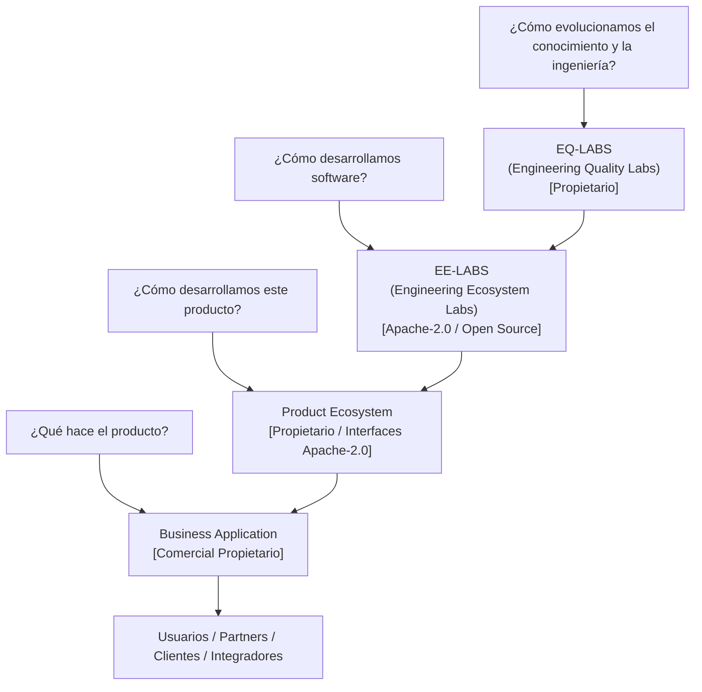
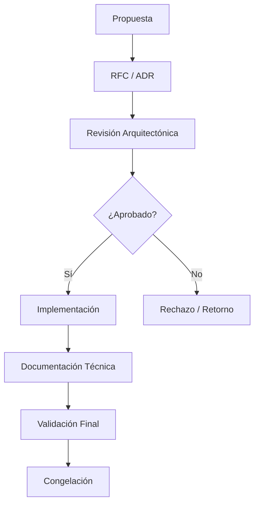
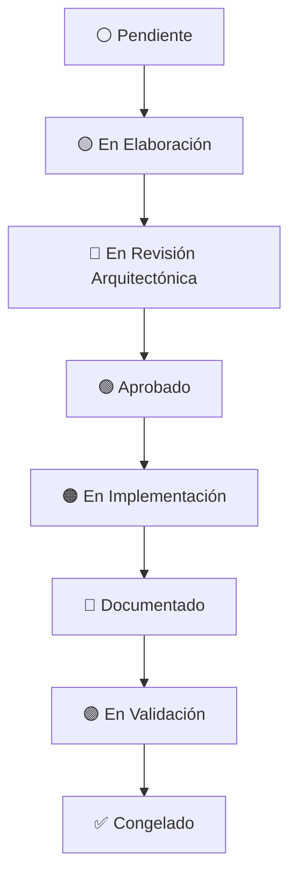
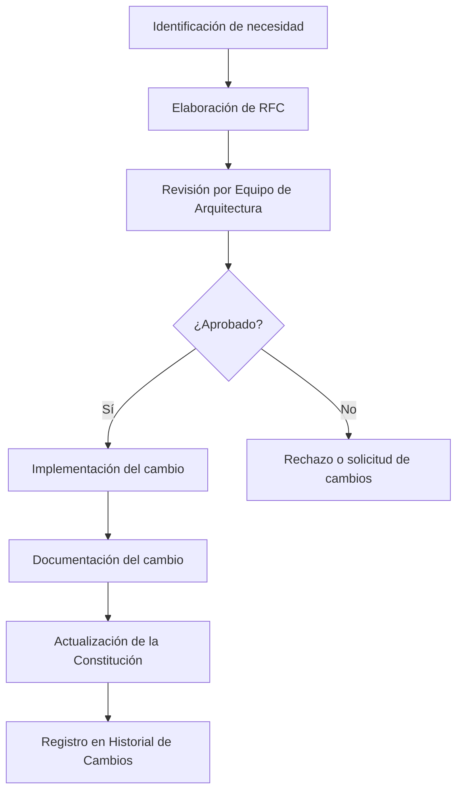

# EE-DOC-003 — Engineering Ecosystem Constitution

## METADATOS

| Campo                 | Valor                                   |
| --------------------- | --------------------------------------- |
| **ID**                | EE-DOC-003                              |
| **Documento**         | Engineering Ecosystem Constitution      |
| **Código corto**      | EE-DOC-003                              |
| **Tipo**              | Documento Normativo                     |
| **Clasificación**     | Fundacional                             |
| **Nivel**             | Estratégico                             |
| **Normativo**         | Sí                                      |
| **Versión**           | v1.0.0                                  |
| **Estado**            | Congelado                               |
| **Propietario**       | Equipo de Arquitectura                  |
| **Documento padre**   | EE-DOC-001                              |
| **Dependencias**      | EE-DOC-001, EE-DOC-002                  |
| **Aprobado por**      | Equipo de Arquitectura                  |
| **Audiencia**         | Arquitectura, Desarrollo, IA, Dirección |
| **Fecha de creación** | 2026-08-02                              |
| **Última revisión**   | 2026-08-02                              |
| **Próxima revisión**  | No aplica — Documento Congelado         |

---

Este documento sigue el estándar EE-DOC-002 — Document Design Template.

## 01. Propósito

La **Engineering Ecosystem Constitution** es el documento fundacional que establece la misión, visión, valores, principios, gobernanza y normas del Engineering Ecosystem. Define las reglas permanentes que gobiernan cómo se construye, mantiene y evoluciona el ecosistema de ingeniería.

Todo documento, herramienta, proceso o decisión dentro del ecosistema debe alinearse con esta constitución.

---

## 02. Alcance

Esta constitución cubre:

- La misión, visión, valores y objetivos estratégicos del Engineering Ecosystem.
- El marco conceptual organizacional de cuatro capas (EE-LABS, EQ-LABS, Product Ecosystem y Business Application).
- Los principios fundamentales que nunca cambian.
- La política constitucional de licenciamiento y propiedad intelectual de EE-LABS.
- El modelo de gobernanza y la organización del ecosistema.
- Los roles, responsabilidades y autoridades.
- El ciclo de vida del ecosistema y la política de idioma por artefacto.
- Las normas generales de cumplimiento.
- La gestión del cambio y las disposiciones finales.

Esta constitución **no cubre**:

- Detalles de implementación de herramientas específicas (cubiertos en documentos especializados del Engineering Ecosystem).
- Procedimientos operativos detallados (cubiertos en documentos específicos).
- Decisiones arquitectónicas de proyectos concretos (cubiertas en sus respectivos ADRs).

---

## 03. Misión

Proporcionar un ecosistema de ingeniería moderno, automatizado, reproducible y gobernado que permita desarrollar productos de software de alta calidad mediante procesos estandarizados, automatización e inteligencia artificial.

### 03.1. Marco Conceptual Organizacional (4 Capas)

El Engineering Ecosystem se fundamenta en un modelo conceptual corporativo de cuatro (4) capas que responde a la secuencia de creación de valor desde la estrategia hasta el usuario final:

| Capa                                          | Pregunta Guía                                        | Naturaleza y Responsabilidad                                                                                                | Licenciamiento / IP                                                                                         |
| :-------------------------------------------- | :--------------------------------------------------- | :-------------------------------------------------------------------------------------------------------------------------- | :---------------------------------------------------------------------------------------------------------- |
| **1. EQ-LABS** _(Engineering Quality Labs)_   | ¿Cómo evolucionamos el conocimiento y la ingeniería? | Cerebro y nivel estratégico corporativo. Responsable de la investigación, innovación y estrategia tecnológica.              | **All Rights Reserved**. Marca e IP corporativa protegida.                                                  |
| **2. EE-LABS** _(Engineering Ecosystem Labs)_ | ¿Cómo desarrollamos software?                        | Plataforma tecnológica corporativa que define estándares, herramientas, automatización, gobernanza y SDLC.                  | **Apache License 2.0**. Ecosistema Open Source abierto.                                                     |
| **3. Product Ecosystem**                      | ¿Cómo desarrollamos este producto?                   | Especialización del ecosistema al contexto de un producto (ej. EUM). Define arquitectura técnica, DevOps e infraestructura. | **Licencia Propietaria** (núcleo técnico). **Apache License 2.0** (interfaces públicas: APIs/SDKs/Schemas). |
| **4. Business Application**                   | ¿Qué hace el producto?                               | Implementación de la lógica funcional de negocio (ej. EUM ERP) que aporta valor directo al cliente.                         | **Licencia Comercial Propietaria (Cerrada)**. Producto comercial.                                           |

---

## 04. Visión

Ser el estándar de referencia para ecosistemas de ingeniería en organizaciones que buscan maximizar la calidad, consistencia y velocidad de desarrollo mediante la automatización, la gobernanza y la integración nativa de inteligencia artificial.

---

## 05. Valores

| Valor                    | Descripción                                                              |
| ------------------------ | ------------------------------------------------------------------------ |
| **Excelencia Técnica**   | Buscamos la máxima calidad en todo lo que hacemos.                       |
| **Colaboración**         | Construimos juntos, compartimos conocimiento y aprendemos unos de otros. |
| **Transparencia**        | Todo es visible, trazable y auditable.                                   |
| **Responsabilidad**      | Asumimos la propiedad de nuestras decisiones y acciones.                 |
| **Aprendizaje Continuo** | Evolucionamos mediante la mejora constante y la adaptación al cambio.    |

---

## 06. Objetivos Estratégicos

| #   | Objetivo                           | Descripción                                                            |
| --- | ---------------------------------- | ---------------------------------------------------------------------- |
| 1   | **Estandarizar el desarrollo**     | Definir procesos y herramientas consistentes para todos los proyectos. |
| 2   | **Automatizar tareas repetitivas** | Eliminar trabajo manual mediante scripts, CI/CD y herramientas.        |
| 3   | **Centralizar el conocimiento**    | Mantener una única fuente de verdad para documentación y decisiones.   |
| 4   | **Garantizar trazabilidad**        | Todo cambio, decisión y artefacto debe ser trazable.                   |
| 5   | **Integrar IA de forma gobernada** | La IA es una herramienta, no un reemplazo del criterio humano.         |
| 6   | **Garantizar calidad por defecto** | La calidad no es opcional; está incorporada en cada etapa.             |

---

## 07. Principios Fundamentales

> **Regla Introductoria:** Los principios fundamentales tienen carácter permanente y prevalecen sobre cualquier documento inferior. No pueden ser modificados sin un RFC aprobado por el Equipo de Arquitectura.

| #   | Principio                     | Descripción                                                                     |
| --- | ----------------------------- | ------------------------------------------------------------------------------- |
| 1   | **Documentation First**       | No existe configuración, decisión o herramienta sin documentación.              |
| 2   | **Architecture First**        | Toda implementación se basa en una arquitectura documentada y aprobada.         |
| 3   | **Automation First**          | Si una tarea puede automatizarse, debe automatizarse.                           |
| 4   | **AI Assisted Engineering**   | La IA asiste, pero no reemplaza el juicio humano.                               |
| 5   | **Security by Design**        | La seguridad se incorpora desde el diseño, no como un añadido.                  |
| 6   | **Quality by Default**        | La calidad es un requisito, no una opción.                                      |
| 7   | **Configuration over Code**   | La configuración debe ser externa al código siempre que sea posible.            |
| 8   | **Single Source of Truth**    | No existe información duplicada. Cada decisión tiene un único lugar donde vive. |
| 9   | **Reproducibility**           | Cualquier entorno, build o despliegue debe poder reproducirse.                  |
| 10  | **Continuous Validation**     | La validación es continua, no un evento puntual.                                |
| 11  | **Vendor Agnostic**           | El ecosistema no depende de un proveedor específico.                            |
| 12  | **Evolution over Revolution** | Los cambios se introducen de forma evolutiva y controlada.                      |

---

## 08. Modelo de Gobernanza

### 08.1. Autoridad Constitucional

La máxima autoridad normativa del Engineering Ecosystem es el **Equipo de Arquitectura**, responsable de:

- Interpretar la Constitución.
- Aprobar modificaciones a la Constitución.
- Resolver conflictos de jerarquía normativa.
- Garantizar el cumplimiento de la Constitución en todo el ecosistema.

El Equipo de Arquitectura delega en los Arquitectos la revisión y aprobación de ADRs y RFCs, pero la autoridad última sobre la Constitución reside en el equipo colegiado.

### 08.2. Estructura de Gobernanza

| Nivel                      | Responsabilidad                                                | Autoridad                                                                       |
| -------------------------- | -------------------------------------------------------------- | ------------------------------------------------------------------------------- |
| **Equipo de Arquitectura** | Define la visión, principios y evolución del ecosistema.       | Aprobación de cambios estructurales y constitucionales.                         |
| **Arquitectos**            | Diseñan y validan la arquitectura del ecosistema.              | Revisión y aprobación de ADRs y RFCs por delegación del Equipo de Arquitectura. |
| **Desarrolladores**        | Implementan y mantienen los componentes del ecosistema.        | Propuesta de cambios y mejoras.                                                 |
| **IA Asistente**           | Asiste en la generación de documentación, código y revisiones. | Propuesta de cambios (sin autoridad de aprobación).                             |

### 08.3. Mecanismos de Decisión

| Mecanismo       | Descripción                                                                        | Aplicación                                                                    | Obligatorio cuando                                                            |
| --------------- | ---------------------------------------------------------------------------------- | ----------------------------------------------------------------------------- | ----------------------------------------------------------------------------- |
| **RFC**         | Request for Comments. Documento que propone un cambio significativo.               | Cambios arquitectónicos, nuevos estándares, modificaciones a la Constitución. | El cambio afecta a múltiples proyectos o modifica la Constitución.            |
| **ADR**         | Architectural Decision Record. Documento que registra una decisión arquitectónica. | Decisiones de diseño, selección de tecnologías, patrones arquitectónicos.     | La decisión es irreversible o tiene impacto significativo en la arquitectura. |
| **Aprobación**  | Decisión formal del Equipo de Arquitectura.                                        | Cambios que afectan la Constitución o la arquitectura del ecosistema.         | El cambio modifica la Constitución o la arquitectura principal.               |
| **Congelación** | Estado final de un documento o componente.                                         | Documentos y componentes completados y estabilizados.                         | El documento o componente ha sido validado y estabilizado.                    |

### 08.4. Flujo de Aprobación

---

## 09. Organización del Ecosistema

El Engineering Ecosystem se organiza en los siguientes componentes, cuyo orden de implementación está definido en el **Master Documentation Index (EE-DOC-001)**:

| Fase       | Orden | Componente                  | Propósito                                                                 | Documento Principal |
| ---------- | ----- | --------------------------- | ------------------------------------------------------------------------- | ------------------- |
| **Fase 1** | 1     | **Master Index**            | Índice maestro, roadmap, trazabilidad y estado del ecosistema             | EE-DOC-001          |
| **Fase 1** | 2     | **Design Template**         | Estándar para la estructura, formato y ciclo de vida de la documentación. | EE-DOC-002          |
| **Fase 1** | 3     | **Governance**              | Define las reglas, roles y procesos del ecosistema.                       | EE-DOC-003          |
| **Fase 1** | 4     | **Architecture**            | Define la estructura y relaciones del ecosistema.                         | EE-DOC-004          |
| **Fase 1** | 5     | **Workflow**                | Define los procesos de desarrollo y operación.                            | EE-DOC-005          |
| **Fase 2** | 6     | **Repository Structure**    | Define la estructura del repositorio, árbol de directorios y workspaces.  | EE-DOC-006          |
| **Fase 2** | 7     | **GitHub Governance**       | Define la gobernanza de repositorios, CODEOWNERS, Rulesets y Actions.     | EE-DOC-007          |
| **Fase 2** | 8     | **Development Environment** | Define herramientas y configuraciones del entorno local.                  | EE-DOC-008          |
| **Fase 3** | 9     | **Infrastructure**          | Define servicios base y plataformas de soporte.                           | EE-DOC-009          |
| **Fase 3** | 10    | **Quality Gates**           | Define estándares y controles de calidad.                                 | EE-DOC-010          |
| **Fase 3** | 11    | **Automation**              | Define scripts, CLI y herramientas de automatización.                     | EE-DOC-011          |
| **Fase 3** | 12    | **Templates**               | Define plantillas reutilizables para el ecosistema.                       | EE-DOC-012          |
| **Fase 3** | 13    | **AI Ecosystem**            | Define la integración y uso de inteligencia artificial.                   | EE-DOC-013          |
| **Fase 3** | 14    | **Knowledge Management**    | Define la gestión del conocimiento y documentación.                       | EE-DOC-014          |
| **Fase 4** | 15    | **Validation**              | Define la validación end-to-end del ecosistema.                           | EE-DOC-015          |

> **Nota:** Este orden es el establecido oficialmente en el **Master Documentation Index (EE-DOC-001)** y debe mantenerse sincronizado con él. Cualquier modificación en el roadmap debe reflejarse primero en EE-DOC-001 y luego en este documento.

---

## 10. Roles, Responsabilidades y Autoridades

> **Regla de Multiplicidad:** Un mismo individuo puede desempeñar múltiples roles, pero las autoridades permanecen separadas. Por ejemplo, un Arquitecto puede actuar como Revisor, pero no puede aprobar sus propias decisiones sin la revisión de otro Arquitecto.

| Rol                        | Responsabilidad                                                                                                            | Autoridad                                                             |
| :------------------------- | :------------------------------------------------------------------------------------------------------------------------- | :-------------------------------------------------------------------- |
| **Equipo de Arquitectura** | Definir la visión y evolución del ecosistema. Asegurar la consistencia y calidad arquitectónica.                           | Aprobar cambios a la Constitución y a la arquitectura del ecosistema. |
| **Arquitecto**             | Diseñar y validar la arquitectura del ecosistema. Revisar y aprobar ADRs y RFCs por delegación del Equipo de Arquitectura. | Aprobar decisiones arquitectónicas dentro del ámbito delegado.        |
| **Desarrollador**          | Implementar y mantener los componentes del ecosistema. Proponer mejoras y cambios.                                         | Proponer cambios (sin autoridad de aprobación).                       |
| **Revisor**                | Revisar código, documentación y propuestas de cambio.                                                                      | Aprobar revisiones técnicas.                                          |
| **Maintainer**             | Mantener la estabilidad y calidad de los componentes. Gestionar versiones y releases.                                      | Aprobar releases y cambios en componentes mantenidos.                 |
| **DevOps**                 | Gestionar la infraestructura, CI/CD y despliegues.                                                                         | Aprobar cambios en infraestructura y pipelines.                       |
| **Security**               | Validar la seguridad de los componentes y procesos.                                                                        | Rechazar cambios que no cumplan con los estándares de seguridad.      |
| **IA Asistente**           | Asistir en la generación de documentación, código y revisiones.                                                            | Proponer cambios (sin autoridad de aprobación).                       |

---

## 11. Ciclo de Vida del Ecosistema

El ciclo de vida documental definido en **EE-DOC-002** aplica a todos los componentes del ecosistema.

> **Nota:** La fuente normativa del ciclo de vida y los estados documentales es EE-DOC-002 — Document Design Template. Este diagrama se reproduce por legibilidad, pero las definiciones oficiales de cada estado residen en el estándar documental.

**Aplicación del ciclo:**

| Fase                           | Descripción                                                       |
| :----------------------------- | :---------------------------------------------------------------- |
| **Pendiente**                  | El componente o documento ha sido identificado pero no iniciado.  |
| **En Elaboración**             | Se está desarrollando el componente o documento.                  |
| **En Revisión Arquitectónica** | El componente o documento está siendo revisado por Arquitectura.  |
| **Aprobado**                   | El componente o documento ha sido aprobado y puede implementarse. |
| **En Implementación**          | Se está implementando el componente o documento.                  |
| **Documentado**                | La documentación técnica derivada ha sido generada.               |
| **En Validación**              | La implementación y documentacion está siendo validada.           |
| **Congelado**                  | Componente o documento estabilizado y cerrado.                    |

---

## 12. Normas del Ecosistema

Las siguientes normas son de carácter constitucional y aplican a todos los proyectos gobernados por el Engineering Ecosystem. Representan la aplicación práctica de los principios fundamentales (Sección 07).

| #   | Norma                         | Principio Asociado        | Descripción                                                                     |
| --- | ----------------------------- | ------------------------- | ------------------------------------------------------------------------------- |
| 1   | **Documentation First**       | Documentation First       | Ningún cambio, decisión o configuración puede existir sin documentación.        |
| 2   | **Architecture First**        | Architecture First        | Toda implementación debe basarse en una arquitectura documentada y aprobada.    |
| 3   | **Automation First**          | Automation First          | Toda tarea repetitiva debe ser automatizada.                                    |
| 4   | **Single Source of Truth**    | Single Source of Truth    | No existe información duplicada. Cada decisión tiene un único lugar donde vive. |
| 5   | **Configuration over Code**   | Configuration over Code   | La configuración debe ser externa al código siempre que sea posible.            |
| 6   | **Security by Design**        | Security by Design        | La seguridad se incorpora desde el diseño, no como un añadido.                  |
| 7   | **Quality by Default**        | Quality by Default        | La calidad es un requisito, no una opción.                                      |
| 8   | **Reproducibility**           | Reproducibility           | Cualquier entorno, build o despliegue debe poder reproducirse.                  |
| 9   | **Vendor Agnostic**           | Vendor Agnostic           | El ecosistema no depende de un proveedor específico.                            |
| 10  | **Evolution over Revolution** | Evolution over Revolution | Los cambios se introducen de forma evolutiva y controlada.                      |

> **Nota:** Las normas operativas específicas (Git, IA, calidad, seguridad, desarrollo, etc.) se definen en sus respectivos documentos especializados. Esta sección contiene únicamente normas de carácter constitucional que derivan de los principios fundamentales.

### 12.1. Política de Licenciamiento y Propiedad Intelectual

1. **Titularidad de Activos:** EQ-LABS es el único propietario de la propiedad intelectual, marcas y productos desarrollados en la organización.
2. **Ecosistema Abierto (EE-LABS):** La plataforma EE-LABS se distribuye como software libre bajo la Apache License 2.0 para fomentar la adopción, reutilización y colaboración de la comunidad.
3. **Aislamiento de Productos y Lógica Comercial:** La arquitectura interna de los Product Ecosystems y la lógica de negocio de las Business Applications permanecen bajo licencias propietarias y comerciales cerradas.
4. **Interfaces Públicas Abiertas:** Todas las APIs públicas, SDKs públicos (Public SDKs), especificaciones OpenAPI, contratos de eventos AsyncAPI y esquemas JSON Schemas se publican bajo Apache License 2.0 para facilitar la integración de terceros sin comprometer el núcleo comercial.
5. **Apertura Controlada:** La apertura de la plataforma de ingeniería no implica la apertura del código ni del know-how comercial de las aplicaciones de negocio.

### 12.2. Ventajas Estratégicas del Modelo de Licenciamiento

- **Comunidad de Ingenieros:** EE-LABS genera adopción masiva mediante su modelo Open Source.
- **Ecosistema de Integradores:** Las interfaces públicas bajo Apache License 2.0 permiten a partners extender la plataforma sin fricción legal.
- **Protección del Know-How y del Producto:** La ventaja competitiva permanece protegida bajo licencias cerradas.

---

## 13. Gestión del Cambio

### 13.1. Modificaciones a la Constitución

| Tipo de Cambio            | Proceso                                          | Aprobación                                      | Incremento de Versión   |
| ------------------------- | ------------------------------------------------ | ----------------------------------------------- | ----------------------- |
| **Correcciones menores**  | Errores ortográficos, gramaticales o de formato. | Equipo de Arquitectura                          | Z (ej. v1.0.0 → v1.0.1) |
| **Adiciones**             | Nuevas secciones, valores, principios o normas.  | RFC + Equipo de Arquitectura                    | Y (ej. v1.0.0 → v1.1.0) |
| **Modificaciones**        | Cambios en secciones existentes.                 | RFC + Equipo de Arquitectura                    | Y (ej. v1.0.0 → v1.1.0) |
| **Eliminaciones**         | Eliminación de secciones completas.              | RFC + Equipo de Arquitectura                    | X (ej. v1.0.0 → v2.0.0) |
| **Cambios estructurales** | Reorganización de la Constitución.               | RFC + Equipo de Arquitectura + Revisión externa | X (ej. v1.0.0 → v2.0.0) |

### 13.2. Proceso de Modificación

---

## 14. Cumplimiento

### 14.1. Mecanismos de Verificación

| Mecanismo                      | Descripción                                                      | Frecuencia                | Responsable             |
| ------------------------------ | ---------------------------------------------------------------- | ------------------------- | ----------------------- |
| **Revisiones Arquitectónicas** | Verificación de alineación con la Constitución.                  | Por cambio significativo. | Equipo de Arquitectura  |
| **Auditorías**                 | Revisión periódica del cumplimiento de normas.                   | Trimestral.               | Equipo de Arquitectura  |
| **Validación Automática**      | Verificación automática de estándares documentales y de calidad. | Continua.                 | Automatización / DevOps |

### 14.2. Consecuencias del Incumplimiento

| Nivel        | Consecuencia                                 |
| :----------- | :------------------------------------------- |
| **Leve**     | Notificación y solicitud de corrección.      |
| **Moderado** | Bloqueo de cambios hasta la corrección.      |
| **Grave**    | Rechazo del cambio o componente.             |
| **Crítico**  | Revisión del componente o proyecto completo. |

---

## 15. Disposiciones Finales

### 15.1. Vigencia

Esta Constitución entra en vigencia a partir de su congelación y publicación oficial. Todos los proyectos y componentes del Engineering Ecosystem deben alinearse con ella en un plazo máximo de 90 días.

### 15.2. Jerarquía Normativa

La jerarquía documental del Engineering Ecosystem se define por **EE-DOC-001** (Master Documentation Index), que establece la estructura documental y la asignación de códigos, y por **EE-DOC-002** (Document Design Template), que establece la jerarquía normativa y las reglas de elaboración de los documentos.

A efectos constitucionales, el siguiente orden de precedencia resume dicha jerarquía:

| Nivel | Norma                                                   | Autoridad                                                                                                 |
| :---: | ------------------------------------------------------- | --------------------------------------------------------------------------------------------------------- |
| **1** | **EE-DOC-001 — Master Documentation Index**             | Define la estructura documental y el roadmap del ecosistema.                                              |
| **2** | **EE-DOC-002 — Document Design Template**               | Define cómo se escriben todos los documentos y su jerarquía normativa.                                    |
| **3** | **EE-DOC-003 — Engineering Ecosystem Constitution**     | Define la gobernanza y las normas constitucionales del ecosistema.                                        |
| **4** | **Documentos Especializados (EE-DOC-004 a EE-DOC-015)** | Aplican las reglas de los documentos superiores en su contexto específico.                                |
| **5** | **ADRs y RFCs**                                         | Decisiones específicas que no pueden contradecir la Constitución ni los documentos normativos superiores. |

### 15.3. Excepciones

Toda excepción a esta Constitución debe ser solicitada mediante un RFC aprobado por el Equipo de Arquitectura. La excepción debe ser documentada y revisada periódicamente.

### 15.4. Interpretación

La interpretación de esta Constitución corresponde al Equipo de Arquitectura. En caso de ambigüedad, prevalece el espíritu de la Constitución sobre la letra.

---

## 16. Referencias

| Código         | Documento                  | Descripción                        |
| :------------- | :------------------------- | :--------------------------------- |
| **EE-DOC-001** | Master Documentation Index | Índice maestro del ecosistema      |
| **EE-DOC-002** | Document Design Template   | Estándar documental del ecosistema |

---

## 17. Historial de Cambios

| Versión    | Fecha      | Autor                  | Aprobado por           | Motivo           | Cambios                            | Estado        |
| :--------- | :--------- | :--------------------- | :--------------------- | :--------------- | :--------------------------------- | :------------ |
| **v1.0.0** | 2026-08-02 | Equipo de Arquitectura | Equipo de Arquitectura | Creación inicial | Versión inicial de la Constitución | **Congelado** |

---

## FIN DEL DOCUMENTO
