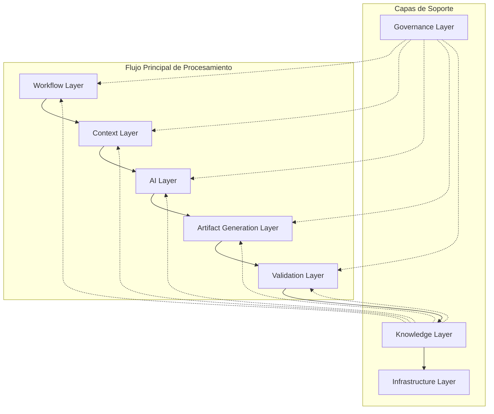
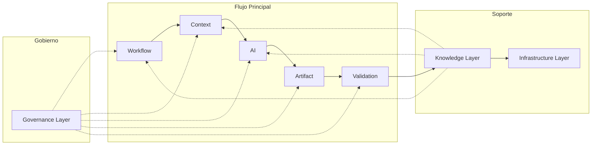
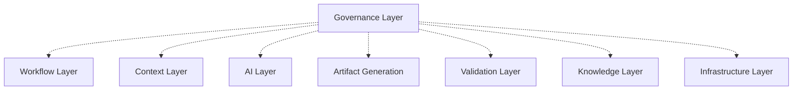
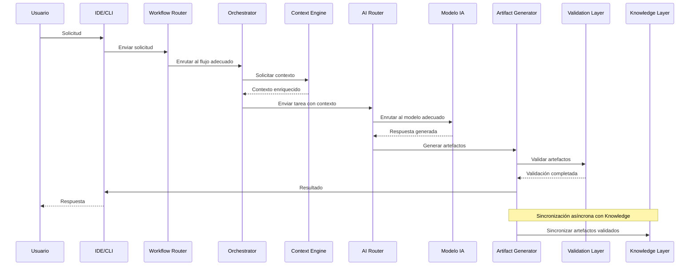
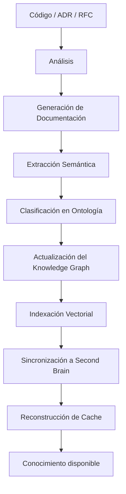

# EE-DOC-004 — Engineering Architecture

## METADATOS

| Campo                 | Valor                                          |
| --------------------- | ---------------------------------------------- |
| **ID**                | EE-DOC-004                                     |
| **Documento**         | Engineering Architecture                       |
| **Código corto**      | EE-DOC-004                                     |
| **Tipo**              | Documento Arquitectónico                       |
| **Clasificación**     | Arquitectura                                   |
| **Nivel**             | Estratégico                                    |
| **Normativo**         | Sí                                             |
| **Versión**           | v1.1.0                                         |
| **Estado**            | Congelado                                      |
| **Propietario**       | Equipo de Arquitectura                         |
| **Documento padre**   | EE-DOC-003                                     |
| **Dependencias**      | EE-DOC-001, EE-DOC-002, EE-DOC-003, EE-DOC-005 |
| **Aprobado por**      | Equipo de Arquitectura                         |
| **Audiencia**         | Arquitectura, Desarrollo, IA, Dirección        |
| **Fecha de creación** | 2026-08-02                                     |
| **Última revisión**   | 2026-09-16                                     |
| **Próxima revisión**  | No aplica — Documento Congelado                |

---

Este documento sigue el estándar EE-DOC-002 — Document Design Template, e incluye diagramas según la norma de diagramas definida en el estándar documental.

## 01. Propósito

Este documento define la arquitectura de alto nivel del Engineering Ecosystem, sus componentes, relaciones, límites y principios arquitectónicos. Establece la estructura fundamental sobre la que se construyen todos los documentos posteriores de implementación del Engineering Ecosystem (EE-DOC-006 a EE-DOC-014).

La arquitectura del Engineering Ecosystem es la base sobre la que se organizan las herramientas, procesos y estándares que permiten el desarrollo de software de forma estandarizada, automatizada y gobernada.

---

## 02. Alcance

Este documento cubre:

- Los objetivos arquitectónicos del Engineering Ecosystem.
- Los principios arquitectónicos que guían su diseño.
- La arquitectura general del ecosistema y sus componentes.
- Las capas arquitectónicas y su organización.
- Las relaciones y dependencias entre componentes.
- El flujo arquitectónico desde la solicitud hasta el resultado.
- Los límites arquitectónicos y restricciones.
- Las integraciones externas y sus principios.
- La evolución y cumplimiento arquitectónico.

Este documento **no cubre**:

- Detalles de implementación de herramientas específicas (cubiertos en documentos especializados).
- Procedimientos operativos detallados (cubiertos en documentos específicos).
- Decisiones arquitectónicas de proyectos concretos (cubiertas en sus respectivos ADRs).

---

## 03. Objetivos Arquitectónicos

| #   | Objetivo                 | Descripción                                                                            |
| --- | ------------------------ | -------------------------------------------------------------------------------------- |
| 1   | **Modularidad**          | El ecosistema está compuesto por módulos independientes con responsabilidades claras.  |
| 2   | **Escalabilidad**        | La arquitectura soporta el crecimiento en número de proyectos, equipos y herramientas. |
| 3   | **Bajo Acoplamiento**    | Los componentes se comunican a través de interfaces bien definidas.                    |
| 4   | **Alta Cohesión**        | Cada componente agrupa funcionalidades relacionadas.                                   |
| 5   | **Automatización**       | La automatización está integrada en cada capa de la arquitectura.                      |
| 6   | **Observabilidad**       | Todo el ecosistema es visible, trazable y auditable.                                   |
| 7   | **Extensibilidad**       | La arquitectura permite añadir nuevas herramientas sin modificar el núcleo.            |
| 8   | **Vendor Agnostic**      | El ecosistema no depende de un proveedor específico.                                   |
| 9   | **Seguridad por Diseño** | La seguridad está incorporada en cada capa arquitectónica.                             |
| 10  | **Consistencia**         | Todos los proyectos y equipos operan bajo los mismos estándares.                       |

---

## 04. Principios Arquitectónicos

| #   | Principio                     | Descripción                                                         |
| --- | ----------------------------- | ------------------------------------------------------------------- |
| 1   | **Layered Architecture**      | El ecosistema se organiza en capas con responsabilidades definidas. |
| 2   | **Modular Architecture**      | Los componentes son módulos independientes con interfaces claras.   |
| 3   | **Separation of Concerns**    | Cada componente tiene una única responsabilidad.                    |
| 4   | **Composition over Coupling** | Se prefiere la composición sobre el acoplamiento directo.           |
| 5   | **Event Driven**              | La comunicación entre componentes es asíncrona y basada en eventos. |
| 6   | **API First**                 | Las interfaces entre componentes se definen mediante APIs.          |
| 7   | **Infrastructure as Code**    | La infraestructura se define y gestiona mediante código.            |
| 8   | **Documentation Driven**      | La arquitectura se documenta antes de implementarse.                |
| 9   | **Configuration over Code**   | La configuración es externa al código.                              |
| 10  | **Single Source of Truth**    | Cada decisión y configuración tiene un único lugar donde vive.      |
| 11  | **Dependency Inversion**      | Las dependencias se realizan sobre abstracciones.                   |

---

## 05. Arquitectura General del Ecosistema

El Engineering Ecosystem se organiza en torno a un **flujo principal de procesamiento** apoyado por **capas de soporte** que proporcionan gobernanza, conocimiento e infraestructura.

### 05.1. Vista General

La arquitectura definida en EE-DOC-004 se ubica físicamente dentro de la capa **EE-LABS (Engineering Ecosystem Labs)** (Capa 2 del Modelo Conceptual Corporativo).
EE-LABS provee los motores de procesamiento, componentes base, conectores y puertas de calidad sobre los cuales los **Product Ecosystems** (Capa 3) despliegan sus arquitecturas de producto y soportan la ejecución de las **Business Applications** (Capa 4).

El siguiente diagrama representa la arquitectura del ecosistema EE-LABS:

### 05.2. Capas de Procesamiento

| Capa                          | Propósito                                                                    |
| :---------------------------- | :--------------------------------------------------------------------------- |
| **Workflow Layer**            | Orquesta el flujo de trabajo desde la solicitud hasta el resultado.          |
| **Context Layer**             | Gestiona el contexto de ejecución y la información del entorno.              |
| **AI Layer**                  | Provee capacidades de inteligencia artificial para asistir en el desarrollo. |
| **Artifact Generation Layer** | Genera documentación, código, diagramas y pruebas.                           |
| **Validation Layer**          | Valida la calidad, seguridad y compatibilidad de los artefactos.             |

### 05.3. Capas de Soporte

| Capa                     | Propósito                                                   | Relación con el Flujo Principal                             |
| :----------------------- | :---------------------------------------------------------- | :---------------------------------------------------------- |
| **Governance Layer**     | Define las reglas, estándares y políticas del ecosistema.   | Gobierna todas las capas de procesamiento.                  |
| **Knowledge Layer**      | Gestiona el conocimiento y la documentación del ecosistema. | Alimenta el flujo principal y es alimentada por Validation. |
| **Infrastructure Layer** | Provee la base técnica para el ecosistema.                  | Soporta todas las capas superiores.                         |

### 05.4. Relación entre Capas

> **Nota Knowledge Layer e Infrastructure Layer:** estas no forman parte del flujo principal de procesamiento. Actúan como capas de soporte que proporcionan conocimiento e infraestructura al resto del ecosistema.
>
> **Nota Infrastructure Layer:** proporciona servicios transversales a todas las capas, aunque únicamente se representa la relación lógica principal para mantener la simplicidad del diagrama.

---

## 06. Capas Arquitectónicas

| Capa                          | Propósito                                                                         | Componentes Clave Lógicos                                                                |
| :---------------------------- | :-------------------------------------------------------------------------------- | :--------------------------------------------------------------------------------------- |
| **Governance Layer**          | Define las reglas, estándares y políticas del ecosistema.                         | Constitution, Document Template, Policy Engine, Standards                                |
| **Workflow Layer**            | Orquesta el flujo de trabajo desde la solicitud hasta el resultado.               | User Interfaces (CLI/IDE), Workflow Router, Task Orchestrator                            |
| **Context Layer**             | Gestiona el contexto de ejecución y la información del entorno.                   | Context Engine, Cache Manager, Runtime Context                                           |
| **AI Layer**                  | Proporciona capacidades de inteligencia artificial para asistir en el desarrollo. | AI Router, AI Providers Abstraction, Local Inference Models                              |
| **Artifact Generation Layer** | Genera documentación, código, diagramas y pruebas.                                | Documentation Generator, Code Generator, Diagram Generator, Test Generator               |
| **Validation Layer**          | Valida la calidad, seguridad y compatibilidad de los artefactos.                  | Quality Gate, Security &amp; Static Analysis, Compatibility Check, Automated Test Engine |
| **Knowledge Layer**           | Gestiona el conocimiento y la documentación del ecosistema.                       | Knowledge Base, ADR/RFC Registry, Semantic Search Engine                                 |
| **Infrastructure Layer**      | Proporciona la base técnica para el ecosistema.                                   | Source Control, CI/CD, Package &amp; Release Management, Platform Services, Monitoring   |

> **Nota:** La **Artifact Generation Layer** es una capa arquitectónica transversal situada entre la **AI Layer** y la **Validation Layer**. Su responsabilidad es transformar las respuestas del modelo de IA en artefactos concretos (código, documentación, diagramas, pruebas) que luego serán validados por la **Validation Layer** antes de integrarse en el ecosistema.

---

## 07. Componentes arquitectónicos

### 07.1. Governance Layer

- **Responsabilidad:** Define y hace cumplir las reglas, estándares y políticas del Engineering Ecosystem.

- **Componentes clave:**
  - **Constitution:** Documento fundamental que establece la misión, visión, valores y principios.
  - **Document Template:** Estándar documental que define cómo se redactan todos los documentos.
  - **Policy Engine:** Motor de evaluación y cumplimiento de políticas de ingeniería.
  - **Standards:** Estándares técnicos y operativos del ecosistema.
- **Interfaces clave:**
  - **Expone:** Governance API (políticas, estándares, reglas).
  - **Consume:** Documentación de cambios, RFCs, ADRs.

### 07.2. Workflow Layer

- **Responsabilidad:** Orquesta el flujo de trabajo funcional desde la interacción del usuario hasta la entrega del resultado.

- **Componentes clave:**
  - **IDE/CLI:** Interfaz de usuario y línea de comandos para interactuar con el ecosistema.
  - **Workflow Router:** Enrutador de solicitudes hacia los flujos o pipelines correspondientes.
  - **Task Orchestrator:** Orquestador del grafo de tareas y dependencias entre componentes.
- **Interfaces clave:**
  - **Expone:** Workflow API.
  - **Consume:** Governance Policies.

### 07.3. Context Layer

- **Responsabilidad:** Gestiona el contexto de ejecución y la información del entorno.

- **Componentes clave:**
  - **Context Engine:** Consolida y prepara el contexto para la ejecución.
  - **Cache:** Almacena información temporal para acelerar la ejecución.
  - **Runtime Context:** Gestiona el contexto de ejecución actual (sesión, usuario, tarea).
- **Interfaces clave:**
  - **Expone:** Context API.
  - **Consume:** Workflow Requests.

### 07.4. AI Layer

- **Responsabilidad:** Proporciona capacidades de inteligencia artificial para asistir en el desarrollo.

- **Componentes clave:**
  - **AI Router:** Enruta las solicitudes al modelo de IA adecuado.
  - **AI Providers:** Proveedores de IA (múltiples e intercambiables mediante adaptadores).
  - **Local Inference Models:** Modelos locales para tareas sencillas, privacidad o baja latencia.
- **Interfaces clave:**
  - **Expone:** Inference API, Generation API.
  - **Consume:** Contexto enriquecido, tareas del flujo de trabajo.

### 07.5. Artifact Generation Layer

- **Responsabilidad:** Genera artefactos a partir de solicitudes y contexto.

- **Componentes clave:**
  - **Documentation Generator:** Genera documentación estructurada y técnica (Markdown, JSDoc, etc.).
  - **Code Generator:** Genera código a partir de especificaciones.
  - **Diagram Generator:** Genera diagramas y representaciones visuales (Mermaid, PlantUML, etc.).
  - **Test Generator:** Genera pruebas unitarias, de integración y end-to-end.
- **Interfaces clave:**
  - **Expone:** Artifact Generation API.
  - **Consume:** AI Responses.

### 07.6. Validation Layer

- **Responsabilidad:** Valida la calidad, seguridad, tipos y conformidad de los artefactos y del código.

- **Componentes clave:**
  - **Quality Gate:** Ejecuta las puertas de calidad automatizadas.
  - **Security & Static Analysis:** Validador de seguridad estática, análisis de vulnerabilidades, secretos y tipos.
  - **Compatibility Check:** Validador de compatibilidad de contratos e interfaces con el ecosistema.
  - **Automated Test Engine:** Motor de ejecución y verificación de suites de pruebas (unitarias, integración, componentes y E2E).
- **Interfaces clave:**
  - **Expone:** Validation API.
  - **Consume:** Generated Artifacts.

### 07.7. Knowledge Layer

- **Responsabilidad:** Gestiona el conocimiento y la documentación del ecosistema.

- **Componentes clave:**
  - **Knowledge Base:** Repositorio central del conocimiento del ecosistema.
  - **ADR/RFC Registry:** Almacenamiento de decisiones arquitectónicas y propuestas.
  - **Semantic Search Engine:** Búsqueda semántica sobre la base de conocimiento.
- **Interfaces clave:**
  - **Expone:** Knowledge API.
  - **Consume:** Validated Artifacts.

### 07.8. Infrastructure Layer

- **Responsabilidad:** Provee la base técnica, operacional, de almacenamiento, ejecución y observabilidad para el monorepo y el ecosistema.

- **Componentes clave:**
  - **Source Control:** Gestión de repositorios, colaboración y control de versiones distribuido.
  - **CI/CD:** Integración, pruebas automatizadas y despliegue continuo.
  - **Package & Release Management:** Gestión y resolución eficiente de dependencias del monorepo y control de versionado semántico con políticas de publicación.
  - **Platform Services:** Servicios base de la plataforma de ejecución y soporte en runtime.
  - **Monitoring:** Monitoreo, telemetría, métricas y observabilidad del ecosistema.
- **Interfaces clave:**
  - **Expone:** Infrastructure Services.
  - **Consume:** Knowledge Synchronization.

---

## 08. Relaciones entre Componentes

> **Nota sobre mecanismos de interacción:** Todas las dependencias entre componentes deben materializarse mediante **APIs bien definidas**, **eventos asíncronos** o **contratos documentados**. Las dependencias directas a través de archivos o bases de datos compartidas están prohibidas.

### 08.1. Dependencias Permitidas

| Origen                  | Destino              | Tipo       | Mecanismo de Interacción      |
| ----------------------- | -------------------- | ---------- | ----------------------------- |
| **Workflow Layer**      | Context Layer        | Uso        | API síncrona                  |
| **Workflow Layer**      | AI Layer             | Uso        | API asíncrona (eventos)       |
| **AI Layer**            | Artifact Generation  | Uso        | API síncrona                  |
| **Artifact Generation** | Validation Layer     | Uso        | API síncrona                  |
| **Validation Layer**    | Knowledge Layer      | Uso        | API síncrona + eventos        |
| **Knowledge Layer**     | Infrastructure Layer | Uso        | API asíncrona                 |
| **Governance Layer**    | Todas las capas      | Gobernanza | API de gobernanza + políticas |

### 08.2. Dependencias Prohibidas

| Origen                   | Destino             | Motivo                                                 |
| :----------------------- | :------------------ | :----------------------------------------------------- |
| **Infrastructure Layer** | Governance Layer    | La infraestructura no define la gobernanza.            |
| **Artifact Generation**  | AI Layer            | La generación de artefactos no debe depender de la IA. |
| **Validation Layer**     | Artifact Generation | La validación no debe depender de lo que valida.       |
| **Knowledge Layer**      | Validation Layer    | El conocimiento no debe depender de la validación.     |

### 08.3. Relaciones de Gobernanza

---

## 09. Flujo Arquitectónico

### 09.1. Flujo de una Solicitud

### 09.2. Flujo de Adquisición de Conocimiento

---

## 10. Límites Arquitectónicos

| Regla  | Descripción                                                                                                                                                               |
| :----- | :------------------------------------------------------------------------------------------------------------------------------------------------------------------------ |
| **R1** | La IA nunca escribe directamente al repositorio. Toda modificación pasa por Validation.                                                                                   |
| **R2** | Ningún componente accede directamente al Knowledge Base sin pasar por la Knowledge Layer.                                                                                 |
| **R3** | Las integraciones con servicios y protocolos externos se canalizan exclusivamente mediante adaptadores de la Infrastructure Layer hacia sus respectivas capas de dominio. |
| **R4** | Los cambios arquitectónicos requieren aprobación del Equipo de Arquitectura.                                                                                              |
| **R5** | Ningún componente puede depender de otro de una capa superior.                                                                                                            |
| **R6** | La Governance Layer es la única que puede imponer reglas a las demás capas.                                                                                               |
| **R7** | Los artefactos generados deben pasar por Validation antes de ser almacenados.                                                                                             |
| **R8** | Las decisiones arquitectónicas deben registrarse como ADRs.                                                                                                               |

---

## 11. Dependencias Arquitectónicas

### 11.1. Matriz de Dependencias

| Capa               | Governance | Workflow | Context | AI  | Artifact | Validation | Knowledge | Infrastructure |
| ------------------ | :--------: | :------: | :-----: | --- | :------: | :--------: | :-------: | :------------: |
| **Governance**     |     —      |    🔵    |   🔵    | 🔵  |    🔵    |     🔵     |    🔵     |       🔵       |
| **Workflow**       |     ❌     |    —     |   ✅    | ✅  |    ❌    |     ❌     |    ❌     |       ❌       |
| **Context**        |     ❌     |    ❌    |    —    | ✅  |    ❌    |     ❌     |    ❌     |       ❌       |
| **AI**             |     ❌     |    ❌    |   ❌    | —   |    ✅    |     ❌     |    ❌     |       ❌       |
| **Artifact**       |     ❌     |    ❌    |   ❌    | ❌  |    —     |     ✅     |    ❌     |       ❌       |
| **Validation**     |     ❌     |    ❌    |   ❌    | ❌  |    ❌    |     —      |    ✅     |       ❌       |
| **Knowledge**      |     ❌     |    ❌    |   ❌    | ❌  |    ❌    |     ❌     |     —     |       ✅       |
| **Infrastructure** |     ❌     |    ❌    |   ❌    | ❌  |    ❌    |     ❌     |    ❌     |       —        |

**Leyenda:**

- ✅ Dependencia directa permitida
- 🔵 Dependencia por gobernanza (la capa superior impone reglas)
- ❌ Dependencia prohibida

> **Nota:** Esta matriz representa únicamente dependencias arquitectónicas directas permitidas entre capas. Las interacciones indirectas realizadas mediante otras capas o mecanismos de integración no constituyen dependencias directas.

---

## 12. Integraciones

### 12.1. Principios de Integración

| Principio                            | Descripción                                                                                                                                                                        |
| ------------------------------------ | ---------------------------------------------------------------------------------------------------------------------------------------------------------------------------------- |
| **API First**                        | Todas las integraciones se realizan a través de APIs bien definidas.                                                                                                               |
| **Vendor Agnostic**                  | Las integraciones no dependen de un proveedor específico.                                                                                                                          |
| **Documentation Driven**             | Cada integración debe estar documentada antes de implementarse.                                                                                                                    |
| **Security by Design**               | Las integraciones incorporan seguridad desde el diseño.                                                                                                                            |
| **Observability**                    | Todas las integraciones son observables y trazables.                                                                                                                               |
| **Adapter Pattern**                  | Toda integración externa debe implementarse mediante **adaptadores** que aíslen la lógica del proveedor específico, permitiendo su reemplazo sin afectar al núcleo del ecosistema. |
| **Public Interfaces Open Licensing** | Todas las abstracciones de integración externas (SDKs, OpenAPI, AsyncAPI y JSON Schemas) se publican bajo Apache-2.0 para permitir integraciones de terceros.                      |

> **Nota:** El uso de adaptadores es obligatorio para preservar el principio **Vendor Agnostic**. Esto se aplica a todas las integraciones externas (proveedores de IA, repositorios, plataformas de infraestructura, etc.).

### 12.2. Integraciones Externas

| Conector Lógico                              | Propósito Funcional                                                                           | Capa Arquitectónica Asociada     |
| :------------------------------------------- | :-------------------------------------------------------------------------------------------- | :------------------------------- |
| **Source Control Service (GitHub)**          | Gestión de repositorios, colaboración, rastreo de cambios y flujos de revisión.               | Infrastructure Layer             |
| **Container Runtime Service (Docker)**       | Contenerización y aislamiento de entornos de ejecución.                                       | Infrastructure Layer             |
| **Orchestration Service (Kubernetes)**       | Despliegue y orquestación de cargas de trabajo escalables.                                    | Infrastructure Layer             |
| **Knowledge Vault (Obsidian)**               | Almacenamiento local y sincronización de notas de conocimiento.                               | Knowledge Layer                  |
| **Knowledge Synthesis Service (NotebookLM)** | Análisis y síntesis asistida de fuentes de documentación.                                     | Knowledge Layer                  |
| **Model Context Protocol (MCP)**             | Límite de integración oficial para servidores de contexto enriquecido.                        | Knowledge Layer / Infrastructure |
| **Agent2Agent Protocol (A2A)**               | Límite de integración oficial para la mensajería e interoperabilidad entre agentes autónomos. | Workflow Layer / Infrastructure  |

---

## 13. Evolución Arquitectónica

### 13.1. Principios de Evolución

| Principio          | Descripción                                                                  |
| ------------------ | ---------------------------------------------------------------------------- |
| **Compatibilidad** | Los cambios no rompen la compatibilidad con el ecosistema existente.         |
| **Modularidad**    | Los cambios se realizan en módulos específicos sin afectar al resto.         |
| **Gobernanza**     | Todo cambio arquitectónico debe ser aprobado por el Equipo de Arquitectura.  |
| **Documentación**  | Todo cambio debe estar documentado antes de implementarse.                   |
| **Validación**     | Todo cambio debe ser validado antes de ser incorporado.                      |
| **Deprecación**    | Las funcionalidades obsoletas se deprecan con aviso antes de ser eliminadas. |

### 13.2. Mecanismos de Evolución

| Mecanismo                               | Descripción                                                                            |
| --------------------------------------- | -------------------------------------------------------------------------------------- |
| **Incorporación de Nuevas Capas**       | Nuevas capas pueden añadirse si no rompen la arquitectura existente.                   |
| **Incorporación de Nuevos Componentes** | Nuevos componentes pueden añadirse dentro de capas existentes.                         |
| **Reemplazo de Integraciones**          | Las integraciones externas pueden reemplazarse mediante adaptadores.                   |
| **Deprecación de Componentes**          | Los componentes obsoletos se deprecan con un aviso de 6 meses antes de su eliminación. |

### 13.3. Proceso de Deprecación

1. **Anuncio de deprecación:** Publicación de RFC indicando la fecha de fin de soporte.
2. **Período de transición:** 6 meses para migrar a la alternativa.
3. **Fin de soporte:** El componente deja de ser compatible con el ecosistema.
4. **Eliminación:** El componente se retira del ecosistema.

---

## 14. Cumplimiento Arquitectónico

### 14.1. Mecanismos de Verificación

| Mecanismo                          | Descripción                                                                                                                            | Frecuencia                | Responsable             |
| :--------------------------------- | :------------------------------------------------------------------------------------------------------------------------------------- | :------------------------ | :---------------------- |
| **Revisiones Arquitectónicas**     | Verificación de alineación con la arquitectura.                                                                                        | Por cambio significativo. | Equipo de Arquitectura  |
| **Auditorías**                     | Revisión periódica del cumplimiento arquitectónico.                                                                                    | Trimestral.               | Equipo de Arquitectura  |
| **Validación Automática**          | Verificación automática de estándares arquitectónicos.                                                                                 | Continua.                 | Automatización / DevOps |
| **Architecture Compliance Checks** | Análisis estático de dependencias, reglas de capas, validadores automáticos, ADR compliance y verificación de límites arquitectónicos. | Por cambio y continua.    | Automatización / DevOps |

### 14.2. Consecuencias del Incumplimiento

| Nivel        | Consecuencia                                 |
| :----------- | :------------------------------------------- |
| **Leve**     | Notificación y solicitud de corrección.      |
| **Moderado** | Bloqueo de cambios hasta la corrección.      |
| **Grave**    | Rechazo del cambio o componente.             |
| **Crítico**  | Revisión del componente o proyecto completo. |

---

## 15. Referencias

| Código         | Documento                          | Descripción                                  |
| :------------- | :--------------------------------- | :------------------------------------------- |
| **EE-DOC-001** | Master Documentation Index         | Índice maestro del ecosistema                |
| **EE-DOC-002** | Document Design Template           | Estándar documental del ecosistema           |
| **EE-DOC-003** | Engineering Ecosystem Constitution | Constitución del ecosistema                  |
| **EE-DOC-005** | Development Workflow               | SDLC, flujo de desarrollo y cambio gobernado |

---

## 16. Historial de Cambios

| Versión    | Fecha      | Autor                  | Aprobado por           | Motivo                                | Cambios                                                                                                                                                                    | Estado        |
| :--------- | :--------- | :--------------------- | :--------------------- | :------------------------------------ | :------------------------------------------------------------------------------------------------------------------------------------------------------------------------- | :------------ |
| **v1.0.0** | 2026-08-02 | Equipo de Arquitectura | Equipo de Arquitectura | Creación inicial                      | Versión inicial de la arquitectura del Engineering Ecosystem                                                                                                               | **Congelado** |
| **v1.1.0** | 2026-09-16 | Equipo de Arquitectura | Equipo de Arquitectura | Sincronización de Arquitectura Lógica | Alineación con EE-ADR-001/002 e inclusión de subcomponentes lógicos (MCP, A2A, Task Orchestrator, Test Engine), depuración de acoplamiento físico y adición de EE-DOC-005. | **Congelado** |

---

## FIN DEL DOCUMENTO
