# EE-DOC-005 — Development Workflow

Este documento sigue el estándar EE-DOC-002 — Document Design Template.

---

## METADATOS

| Campo                 | Valor                                                                  |
| --------------------- | ---------------------------------------------------------------------- |
| **ID**                | EE-DOC-005                                                             |
| **Documento**         | Development Workflow                                                   |
| **Código corto**      | EE-DOC-005                                                             |
| **Tipo**              | Documento Normativo                                                    |
| **Clasificación**     | Workflow                                                               |
| **Nivel**             | Estratégico                                                            |
| **Normativo**         | Sí                                                                     |
| **Versión**           | v1.4.0                                                                 |
| **Estado**            | Congelado                                                              |
| **Propietario**       | Equipo de Arquitectura                                                 |
| **Documento padre**   | EE-DOC-004                                                             |
| **Dependencias**      | EE-DOC-001, EE-DOC-002, EE-DOC-003, EE-DOC-004, EE-ADR-001, EE-ADR-002 |
| **Aprobado por**      | Equipo de Arquitectura                                                 |
| **Audiencia**         | Arquitectura, Desarrollo, IA, DevOps                                   |
| **Fecha de creación** | 2026-08-02                                                             |
| **Última revisión**   | 2026-09-29                                                             |
| **Próxima revisión**  | No aplica — Documento Congelado                                        |

---

## 01. Propósito

Este documento define el workflow operativo del Engineering Ecosystem y especifica el Software Development Lifecycle (SDLC) que deben seguir todos los proyectos. Describe cómo se ejecutan los procesos definidos por la arquitectura, desde la concepción de una iniciativa hasta su despliegue y mejora continua, garantizando consistencia, calidad, trazabilidad y automatización.

El workflow abarca desde la concepción de una idea hasta la entrega en producción, incluyendo branching, commits, pull requests, code review, quality gates, releases, despliegues, monitoreo y mejora continua.

**El workflow es Documentation Driven y Governed by Controlled Adaptability.** La implementación se inicia sobre una especificación documentada y aprobada. Durante las etapas de Implementación, Documentación Técnica, Validación Final y Congelación pueden surgir descubrimientos que requieran aclaraciones, especializaciones técnicas, decisiones arquitectónicas o cambios significativos. Estos descubrimientos deberán gestionarse mediante el mecanismo de cambio gobernado definido en este documento.

---

## 02. Alcance

Este documento cubre:

- Los principios que guían el workflow de desarrollo.
- El flujo general desde la idea hasta la producción y mejora continua.
- El modelo de branching y gestión de repositorios.
- Las convenciones de commits y mensajes.
- El workflow de pull requests y code review.
- Los quality gates obligatorios y opcionales.
- El workflow de releases y versionado.
- El workflow de despliegue y post-despliegue.
- Los workflows especiales: hotfix, rollback y excepciones.
- La compliance, auditoría y métricas del workflow.

Este documento también define:

- El mecanismo de Implementación Adaptativa Controlada.
- La identificación, evaluación, clasificación y tratamiento de descubrimientos durante las etapas de Implementación, Documentación Técnica, Validación Final y Congelación.
- Los criterios para determinar cuándo corresponde una aclaración, especialización técnica, ADR o RFC.
- El procedimiento de evaluación, actualización y control de documentos normativos cuando un descubrimiento tenga impacto sobre su contenido durante las etapas de Implementación, Documentación Técnica, Validación Final o Congelación.
- Las condiciones para la congelación de documentos normativos.

Este documento **no cubre**:

- Detalles de implementación de herramientas específicas (cubiertos en documentos especializados).
- Decisiones arquitectónicas de proyectos concretos (cubiertas en sus respectivos ADRs).
- El contenido específico de los documentos normativos EE-DOC-006 y posteriores.
- Procedimientos operativos de infraestructura (cubiertos en EE-DOC-009).
- Las propuestas de cambios significativos o transversales, que se gestionan mediante RFC.

---

## 03. Principios del Workflow

| #   | Principio                     | Descripción                                                                                                                                                                                                                                                                                                                                                                                                                                     |
| --- | ----------------------------- | ----------------------------------------------------------------------------------------------------------------------------------------------------------------------------------------------------------------------------------------------------------------------------------------------------------------------------------------------------------------------------------------------------------------------------------------------- |
| 1   | **Documentation Driven**      | Toda implementación debe partir de una especificación documentada y aprobada. Los descubrimientos que surjan durante las etapas de Implementación, Documentación Técnica, Validación Final o Congelación deberán gestionarse mediante el mecanismo de Implementación Adaptativa Controlada definido en este documento.                                                                                                                          |
| 2   | **Small Incremental Changes** | Los cambios deben ser pequeños, frecuentes y reversibles.                                                                                                                                                                                                                                                                                                                                                                                       |
| 3   | **Traceability**              | Todo cambio debe ser trazable hasta su origen (issue, RFC, ADR).                                                                                                                                                                                                                                                                                                                                                                                |
| 4   | **Review Before Merge**       | Todo cambio debe ser revisado antes de ser fusionado.                                                                                                                                                                                                                                                                                                                                                                                           |
| 5   | **Automation First**          | Todo proceso repetitivo debe estar automatizado.                                                                                                                                                                                                                                                                                                                                                                                                |
| 6   | **Quality Gates**             | Todo cambio debe pasar los quality gates definidos.                                                                                                                                                                                                                                                                                                                                                                                             |
| 7   | **Security by Default**       | La seguridad está incorporada en cada etapa del workflow.                                                                                                                                                                                                                                                                                                                                                                                       |
| 8   | **Continuous Integration**    | El código se integra de forma continua y automática.                                                                                                                                                                                                                                                                                                                                                                                            |
| 9   | **Continuous Delivery**       | El código está siempre en un estado desplegable.                                                                                                                                                                                                                                                                                                                                                                                                |
| 10  | **Fail Fast**                 | Los errores se detectan lo antes posible en el ciclo.                                                                                                                                                                                                                                                                                                                                                                                           |
| 11  | **Governance First**          | Todo workflow debe respetar las reglas de Governance aplicables antes de ejecutarse, y cualquier excepción o desviación deberá gestionarse mediante los mecanismos de gobernanza definidos por el Engineering Ecosystem.                                                                                                                                                                                                                        |
| 12  | **Controlled Adaptability**   | Durante las etapas de Implementación, Documentación Técnica, Validación Final y Congelación pueden producirse descubrimientos que revelen desviaciones, necesidades, ambigüedades o mejoras respecto del contenido normativo vigente. Estos descubrimientos deberán ser identificados, evaluados, justificados y trazados y, cuando tengan impacto normativo, gestionados mediante el mecanismo de cambio gobernado definido en este documento. |

---

## 04. Gobernanza de Descubrimientos y Cambios Normativos

Durante las etapas de Implementación, Documentación Técnica, Validación Final o Congelación pueden producirse descubrimientos que revelen desviaciones, necesidades, ambigüedades o mejoras respecto del contenido normativo vigente. Cuando un descubrimiento tenga impacto normativo, deberá ser evaluado mediante el mecanismo de cambio gobernado definido en EE-DOC-005. Ninguna de estas etapas puede modificar directamente una versión normativa congelada.

### 04.1. Implementación Adaptativa Controlada

Un documento normativo aprobado constituye la referencia normativa vigente durante su ciclo de implementación. La implementación se ejecuta mediante fases sucesivas y cada fase debe evolucionar conjuntamente con su validación correspondiente y con la elaboración o actualización del borrador de Documentación Técnica asociado. Durante las etapas de Implementación, Documentación Técnica, Validación Final y Congelación pueden producirse descubrimientos respecto de la especificación vigente. Estos descubrimientos no constituyen una etapa del ciclo documental, sino un mecanismo transversal de gobernanza que puede activarse desde cualquiera de dichas etapas.

1. La necesidad debe identificarse explícitamente.
2. Debe registrarse como un descubrimiento.
3. Debe analizarse su impacto técnico, funcional y arquitectónico.
4. Debe determinarse si el descubrimiento debe ser Rechazado, Diferido o Adoptado.
5. La decisión debe quedar registrada y justificada.
6. Si el descubrimiento es Rechazado, no se incorpora a la implementación ni modifica el documento normativo.
7. Si el descubrimiento es Diferido, se registra como trabajo futuro mediante un Issue o mecanismo equivalente de seguimiento definido por el proyecto. El descubrimiento diferido no modifica la especificación normativa vigente ni bloquea la continuación de la implementación actual.
8. Si el descubrimiento es Adoptado, debe clasificarse como Aclaración, Especialización Técnica, Decisión Arquitectónica o Cambio Significativo / Transversal.
9. Cuando el descubrimiento adoptado requiera modificar o complementar el contenido normativo del documento aplicable, deberá iniciarse el proceso de actualización documental correspondiente. La modificación no será normativa ni exigible como especificación vigente hasta que la nueva versión haya sido aprobada y emitida conforme al ciclo documental definido en EE-DOC-002. La implementación deberá alinearse con la nueva versión antes de considerarse conforme.
10. Cuando corresponda, deben generarse y aprobarse los ADR o RFC asociados.
11. La implementación debe continuar utilizando exclusivamente la especificación normativa vigente resultante del proceso de cambio aprobado y emitido.
12. El documento no podrá ser congelado mientras existan desviaciones conocidas respecto de la especificación que no hayan sido resueltas, formalmente aceptadas mediante el mecanismo de gobernanza aplicable o incorporadas a la versión normativa correspondiente. La congelación solo podrá producirse después de completar todas las fases de Implementación, sus Validaciones correspondientes, la consolidación y validación de la Documentación Técnica y la Validación Final.

> **Regla de Evolución sincronizada por fase:**
> Cada fase de la etapa de Implementación debe ser seguida por su correspondiente Validación y por la elaboración o actualización del borrador de Documentación Técnica asociado. La implementación, su validación y el borrador documental evolucionan conjuntamente durante cada fase, sin considerar la documentación definitiva hasta completar la etapa correspondiente.
>
> **Regla fundamental:**
> Las etapas de Implementación, Documentación Técnica, Validación Final y Congelación pueden producir descubrimientos. Todo descubrimiento relevante debe ser registrado y evaluado. Su resultado debe quedar formalmente registrado como Rechazado, Diferido o Adoptado. Todo descubrimiento Adoptado que afecte la especificación normativa debe completar el mecanismo de cambio gobernado correspondiente antes de que el documento pueda ser congelado.
>
> **Regla de no desviación unilateral:**
> Ningún descubrimiento durante las etapas de Implementación, Documentación Técnica, Validación Final o Congelación podrá resolverse mediante una desviación silenciosa respecto de la especificación normativa vigente. Toda desviación conocida deberá ser identificada, evaluada y gestionada mediante el mecanismo de cambio gobernado definido en este documento.
>
> **Regla de Registro por Acción:**
> La ausencia de descubrimiento no constituye una decisión de gobernanza y, por tanto, no requiere un registro de decisión.
> El registro de decisiones se limita exclusivamente a los casos en que se ha identificado, evaluado y clasificado un descubrimiento, y se ha adoptado una resolución (Rechazar, Diferir o Adoptar).
>
> **Regla de aplicabilidad:**
> El mecanismo definido en esta sección es obligatorio para EE-DOC-006 y para todos los documentos normativos posteriores cuyo contenido sea objeto de Implementación, Documentación Técnica, Validación Final o Congelación. El Descubrimiento no constituye una etapa del ciclo documental ni una fase adicional de implementación; constituye un mecanismo transversal de gobernanza que puede activarse cuando una de estas etapas identifique una desviación, ambigüedad, necesidad, contradicción o mejora respecto de la especificación vigente.

#### Resultados posibles de un descubrimiento

| Resultado     | Definición                                                                                                                                      | Tratamiento                                                                   |           Modifica documento            |
| :------------ | :---------------------------------------------------------------------------------------------------------------------------------------------- | :---------------------------------------------------------------------------- | :-------------------------------------: |
| **Rechazado** | El descubrimiento es evaluado y se determina que no debe incorporarse al alcance ni a la solución vigente.                                      | Registrar la decisión y su justificación.                                     |                 **No**                  |
| **Diferido**  | El descubrimiento es considerado válido o potencialmente útil, pero su incorporación se posterga fuera del alcance de la implementación actual. | Registrar como trabajo futuro mediante Issue u otro mecanismo de seguimiento. |                 **No**                  |
| **Adoptado**  | El descubrimiento es considerado necesario o conveniente y se incorpora al alcance de la implementación.                                        | Clasificar como A, B, C o D y aplicar el tratamiento correspondiente.         | **Sí**, cuando afecte la especificación |

#### Diagrama de Gobernanza de Descubrimientos

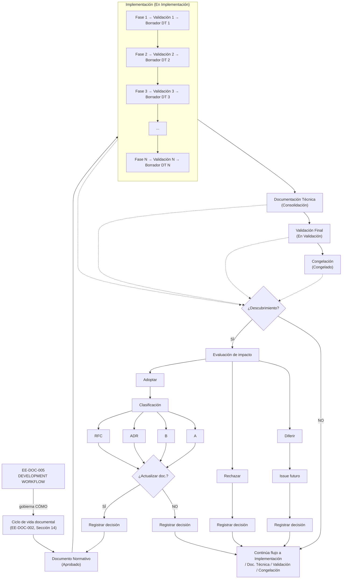

> **Nota sobre el gráfico:**
> El gráfico representa el mecanismo de Implementación Adaptativa Controlada durante la fase 🟠 En Implementación del ciclo de vida documental definido en EE-DOC-002, Sección 14. Las fases previas (⚪ Pendiente, 🟡 En Elaboración, 🔵 En Revisión Arquitectónica, 🟢 Aprobado) no se representan porque el mecanismo solo aplica una vez que el documento ha sido aprobado y está en implementación.
>
> **Nota sobre las fases de implementación:**
> Las fases de implementación (Fase 1, Fase 2, ..., Fase N) son específicas de cada documento normativo. Por ejemplo, para EE-DOC-006 corresponden a las fases definidas en su plan de implementación (Bootstrap, Configuración Compartida, Workspaces, etc.). El descubrimiento puede surgir en cualquier fase.

### 04.2. Clasificación de Descubrimientos

Los descubrimientos que hayan sido evaluados como Adoptados deben clasificarse según su naturaleza e impacto, independientemente de la etapa desde la cual se hayan identificado.

|                    Tipo                    | Descripción                                                                                                                                                                                                                                                                                                                                                                             | Tratamiento                                                                                                                                                                                         |
| :----------------------------------------: | :-------------------------------------------------------------------------------------------------------------------------------------------------------------------------------------------------------------------------------------------------------------------------------------------------------------------------------------------------------------------------------------- | :-------------------------------------------------------------------------------------------------------------------------------------------------------------------------------------------------- |
|             **A — Aclaración**             | Las etapas de Implementación, incluyendo cualquiera de sus fases, Validaciones correspondientes y Borradores de Documentación Técnica, así como la Documentación Técnica consolidada, Validación Final o Congelación, revelan una ambigüedad, omisión menor o necesidad de precisión sin alterar la arquitectura.                                                                       | Actualizar documento.                                                                                                                                                                               |
|      **B — Especialización Técnica**       | Las etapas de Implementación, incluyendo cualquiera de sus fases, Validaciones correspondientes y Borradores de Documentación Técnica, así como la Documentación Técnica consolidada, Validación Final o Congelación, requieren una decisión técnica específica dentro de la arquitectura ya aprobada, sin contradecir principios, restricciones o decisiones arquitectónicas vigentes. | Actualizar el documento. Se genera ADR cuando la decisión técnica tenga relevancia arquitectónica, afecte futuras implementaciones o requiera preservar explícitamente su contexto y justificación. |
|      **C — Decisión Arquitectónica**       | El descubrimiento requiere modificar, extender o introducir una decisión arquitectónica respecto de la arquitectura vigente.                                                                                                                                                                                                                                                            | ADR aprobado + actualización del documento normativo afectado cuando corresponda.                                                                                                                   |
| **D — Cambio Significativo / Transversal** | El descubrimiento afecta múltiples dominios, documentos, proyectos, capas, principios o componentes del Engineering Ecosystem y requiere una evaluación coordinada del impacto.                                                                                                                                                                                                         | RFC aprobado + actualización de los documentos normativos afectados cuando corresponda.                                                                                                             |

#### Resultado de la Evaluación

La evaluación de un descubrimiento debe producir uno de los siguientes resultados:

| Resultado     | Descripción                                                                           | Tratamiento                                                                                                                |
| :------------ | :------------------------------------------------------------------------------------ | :------------------------------------------------------------------------------------------------------------------------- |
| **Adoptado**  | El descubrimiento es válido y debe incorporarse a la solución.                        | Se aplica el tratamiento correspondiente al tipo A, B, C o D y se actualiza la documentación cuando corresponda.           |
| **Rechazado** | El descubrimiento no justifica un cambio en la especificación o solución vigente.     | Se registra la decisión y su justificación; la implementación continúa conforme a la especificación vigente.               |
| **Diferido**  | El descubrimiento es válido pero queda fuera del alcance de la implementación actual. | Se registra como trabajo pendiente o Issue futuro; la implementación actual continúa conforme a la especificación vigente. |

#### Ejemplo — Especialización técnica

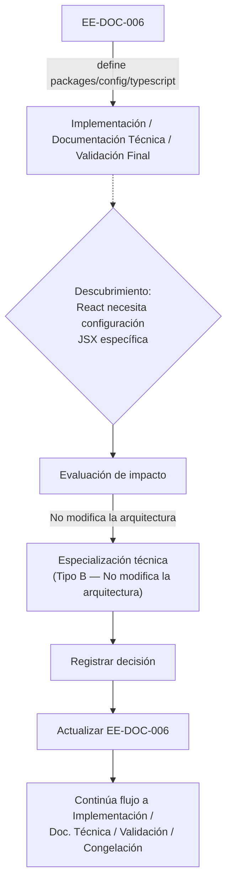

#### Flujo General de Evaluación

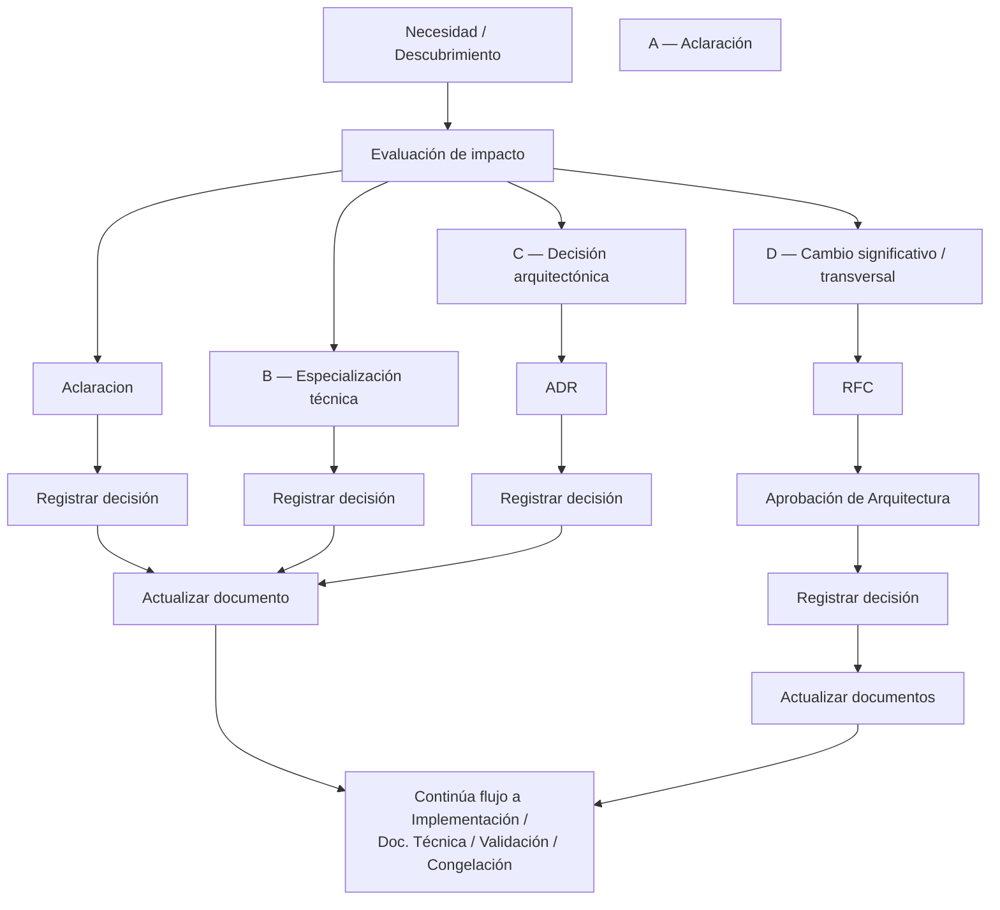

### 04.3. Evaluación de Impacto

La evaluación de impacto se realiza sobre todo descubrimiento antes de determinar si este será Rechazado, Diferido o Adoptado, independientemente de la etapa en la que haya sido identificado.

Todo descubrimiento identificado durante las etapas de Implementación, Documentación Técnica, Validación o Congelación debe ser evaluado antes de determinar su tratamiento o incorporarlo a la solución.

La evaluación debe considerar:

- Impacto arquitectónico;
- Impacto sobre estructura de repositorio;
- Impacto sobre contratos;
- Impacto sobre otros paquetes o aplicaciones;
- Impacto sobre otros documentos normativos;
- Impacto sobre seguridad;
- Impacto sobre datos;
- Impacto sobre infraestructura;
- Impacto sobre integraciones;
- Impacto sobre principios establecidos;
- Impacto transversal en otros proyectos del ecosistema.

#### Matriz de Impacto

| Nivel                     | Característica                                                                       | Mecanismo                                        |
| :------------------------ | :----------------------------------------------------------------------------------- | :----------------------------------------------- |
| **Bajo**                  | Impacto localizado, aclaración u omisión menor.                                      | AAclaración / actualización documental           |
| **Medio**                 | Impacto técnico localizado dentro de la arquitectura vigente.                        | Especialización Técnica / ADR cuando corresponda |
| **Alto**                  | Impacto sobre decisiones o estructura arquitectónica.                                | ADR                                              |
| **Crítico / Transversal** | Impacto sobre múltiples dominios, documentos, proyectos o principios del ecosistema. | RFC                                              |

#### Tratamiento según Tipo de Impacto

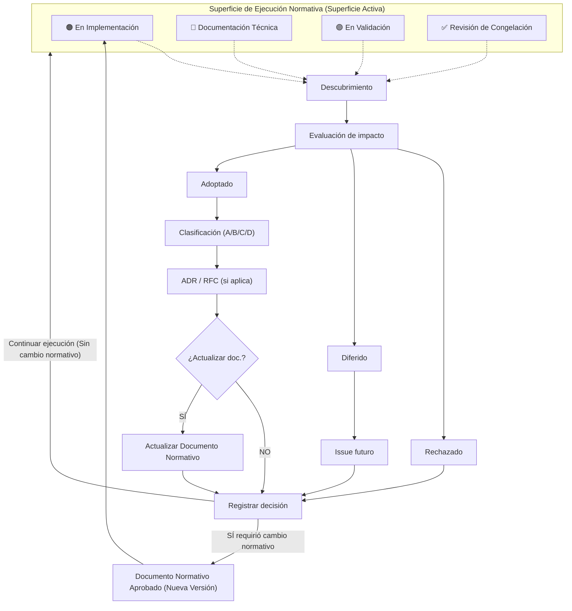

### 04.4. Tratamiento según Resultado y Tipo de Descubrimiento

El tratamiento de un descubrimiento depende primero de su resultado de evaluación y, cuando sea Adoptado, de su clasificación.

#### Descubrimiento Rechazado

Cuando un descubrimiento sea rechazado:

1. Debe registrarse la decisión.
2. Debe registrarse la justificación.
3. Debe registrarse, cuando corresponda, el impacto evaluado.
4. No debe modificar el documento normativo.
5. No debe generar un cambio de implementación derivado del descubrimiento.
6. La etapa en curso puede continuar conforme a la especificación normativa vigente.

#### Descubrimiento Diferido

Cuando un descubrimiento sea diferido:

1. Debe registrarse la decisión.
2. Debe registrarse la justificación del diferimiento.
3. Debe registrarse el alcance que queda fuera de la implementación actual.
4. Debe crearse un Issue futuro o mecanismo equivalente de seguimiento.
5. No debe modificar el documento normativo vigente para la implementación actual.
6. La etapa en curso puede continuar sin incorporar el descubrimiento diferido.

#### Descubrimiento Adoptado

1. Debe clasificarse como A, B, C o D.
2. Debe aplicarse el mecanismo correspondiente.
3. Cuando corresponda, debe generarse un ADR.
4. Cuando corresponda, debe generarse un RFC.
5. El documento normativo debe actualizarse cuando la decisión modifique o complemente su especificación.
6. La etapa correspondiente deberá continuar conforme a la especificación normativa vigente resultante del proceso de cambio.

#### Flujo General

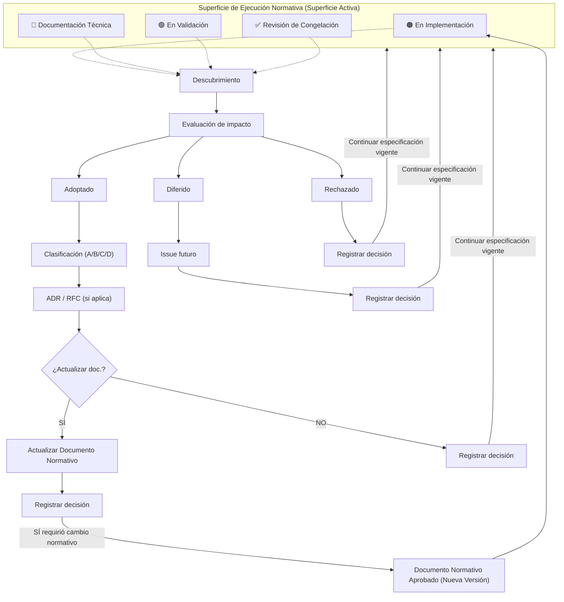

> **Regla de Actualización Normativa:**
> El ADR registra la decisión arquitectónica y su justificación. El RFC registra una propuesta de cambio significativo o transversal y su proceso de evaluación y aprobación. Ninguno de ellos sustituye al documento normativo. El documento normativo vigente constituye la fuente normativa de la especificación que debe implementarse.

### 04.5. Aplicabilidad, Actualización y Congelación de Documentos Normativos

#### Alcance

**Esta regla es obligatoria para EE-DOC-006 y para todo documento normativo posterior cuyo contenido defina un artefacto, especificación, estructura, configuración, contrato, proceso, componente o resultado susceptible de implementación técnica. Su aplicación comprende las etapas de Implementación, Documentación Técnica, Validación Final y Congelación, en las cuales puede activarse el mecanismo transversal de Descubrimiento definido en la Sección 04.1.**

Los resultados Rechazado y Diferido no modifican la especificación normativa vigente cuando hayan sido formalmente registrados y justificados conforme a la Sección 04.4. Un resultado Diferido podrá generar trabajo futuro, pero no modifica el alcance normativo de la implementación actual.

#### Regla de Actualización

- Los documentos comprendidos dentro de este alcance constituyen la referencia normativa para la implementación de aquello que especifican. No obstante, su aplicación durante las etapas de Implementación, Documentación Técnica, Validación Final y Congelación puede revelar necesidades, desviaciones, ambigüedades o mejoras no contempladas inicialmente.
- Dichas necesidades deben gestionarse mediante el mecanismo de **Implementación Adaptativa Controlada** definido en la Sección 04.1 de este documento.
- Cuando un descubrimiento requiera modificar o complementar el contenido normativo del documento aplicable, dicho documento debe actualizarse antes de que la implementación correspondiente pueda considerarse alineada con la especificación vigente.
- Ninguna etapa de Implementación, Documentación Técnica o Validación Final podrá modificar directamente una versión normativa congelada. Todo descubrimiento con impacto normativo deberá gestionarse mediante el mecanismo de cambio gobernado definido en este documento y, cuando corresponda, producir una nueva versión normativa antes de que el cambio pueda considerarse vigente.
- ADR y RFC no sustituyen la actualización del documento normativo cuando la decisión adoptada modifica su contenido.

#### Relación Documento ↔ ADR

- ADR: Registra la decisión arquitectónica, su contexto, alternativas y justificación.
- Documento normativo: Especifica el resultado vigente que debe implementarse.
- Un ADR puede identificar la necesidad de modificar un documento, pero no lo sustituye.

#### Relación Documento ↔ RFC

- RFC: Propuesta formal para cambios significativos o transversales que requieren revisión y aprobación.
- Documento normativo: Especifica el resultado vigente que debe implementarse.
- Un RFC aprobado puede requerir la actualización del documento correspondiente.

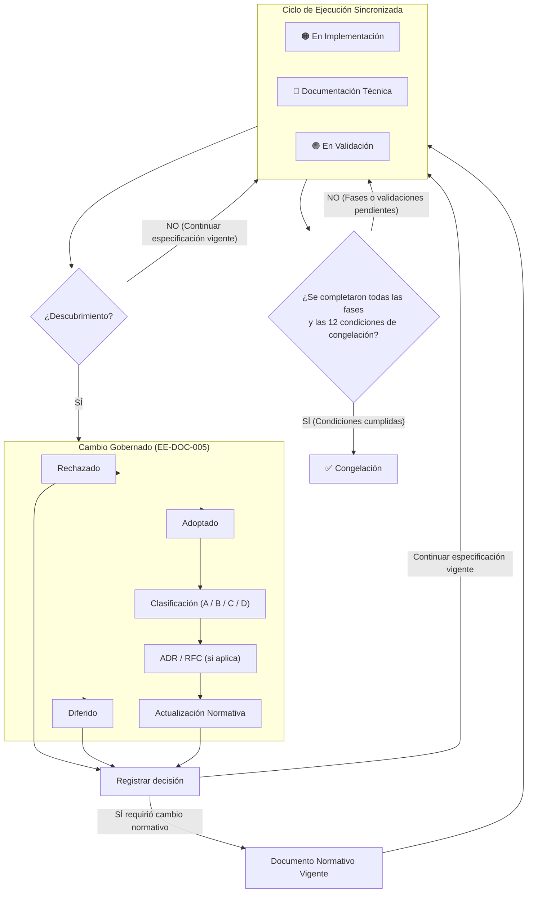

### 04.6. Congelación de Documentos

#### **Condiciones para congelar**

Un documento normativo podrá considerarse Congelado únicamente cuando:

1. Todas las fases de Implementación hayan sido completadas;
2. Cada fase de Implementación haya completado su Validación correspondiente;
3. Cada fase haya producido o actualizado su borrador de Documentación Técnica asociado;
4. La Documentación Técnica haya sido consolidada;
5. La Documentación Técnica consolidada haya sido validada;
6. La Validación Final haya sido completada satisfactoriamente;
7. No existan desviaciones no documentadas;
8. Todos los descubrimientos relevantes hayan sido clasificados;
9. Los ADR requeridos hayan sido aprobados;
10. Los RFC requeridos hayan sido aprobados;
11. El documento haya sido actualizado cuando corresponda;
12. La versión final haya sido aprobada por la autoridad correspondiente.

> **Regla central:**
> No se permite declarar un documento “Congelado” mientras exista una diferencia conocida y no documentada entre la especificación normativa y el resultado de las etapas de Implementación, Documentación Técnica o Validación Final.

### 04.7. Trazabilidad de Descubrimientos

Todo descubrimiento identificado durante las etapas de Implementación, Documentación Técnica, Validación Final o Congelación debe poder rastrearse desde su identificación hasta su resolución o cierre.

La trazabilidad mínima debe permitir determinar:

Fase 1 — Identificación:

- qué se descubrió;
- cuándo se descubrió;
- durante qué etapa y fase del ciclo documental ocurrió, identificando expresamente si el descubrimiento fue detectado durante Implementación, Documentación Técnica, Validación Final o Congelación;
- quién lo identificó;
- qué Issue lo registra;

Fase 2 — Evaluación:

- quién realizó la evaluación;
- cuál fue su impacto;
- cuál fue su clasificación;
- cuál fue el resultado de la evaluación;

Fase 3 — Decisión:

- cuál fue la decisión adoptada;
- quién aprobó la decisión cuando corresponda;
- qué ADR o RFC se generó, cuando corresponda;

Fase 4 — Resolución y Materialización:

- qué documento normativo fue afectado;
- qué Issue o PR implementó el cambio;
- qué Quality Gates fueron ejecutados;
- cuál fue el resultado final.

#### Resultado Adoptado

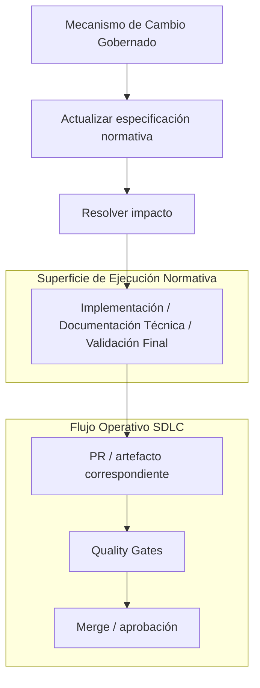

#### Resultado Rechazado

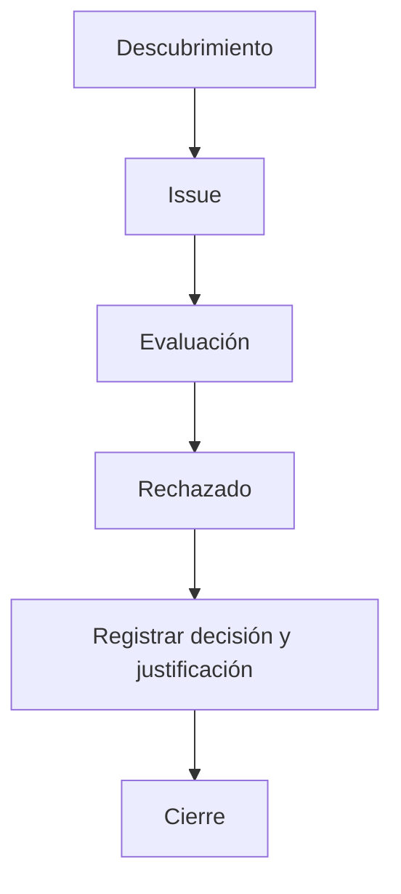

#### Resultado Diferido

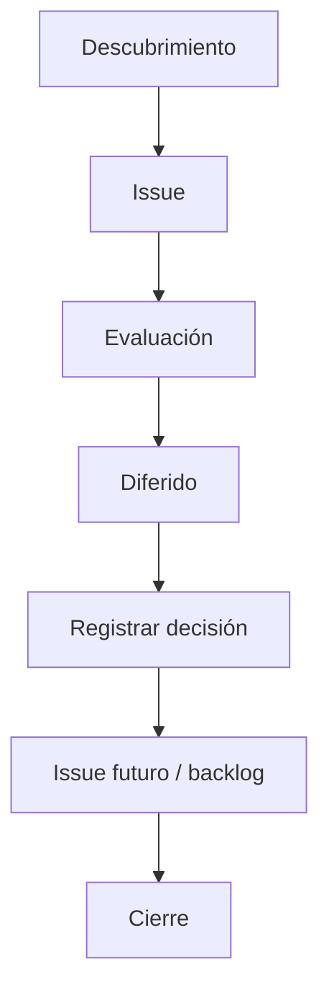

#### Flujo de trazabilidad

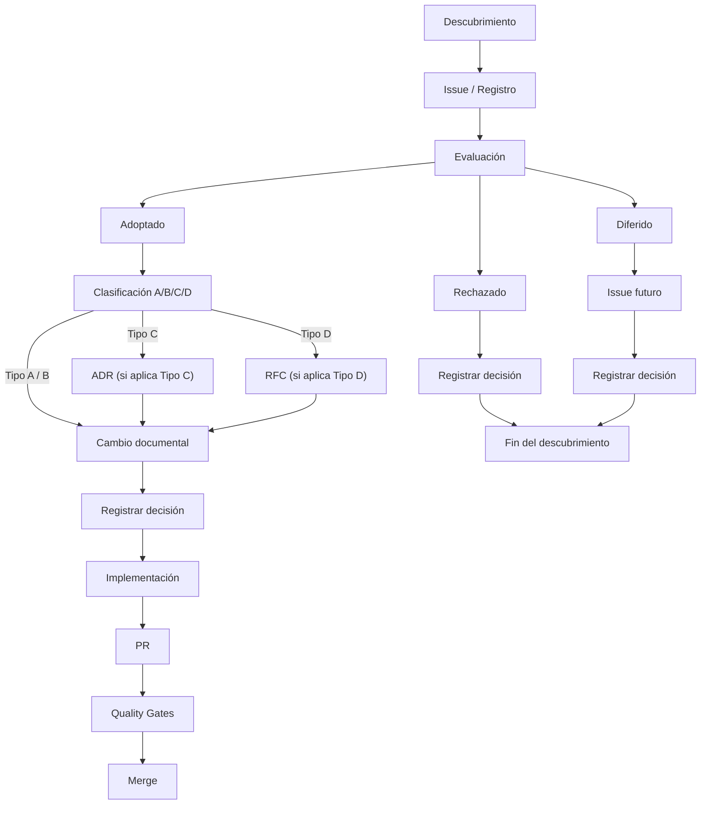

> **Regla de trazabilidad:**
> Ningún descubrimiento puede quedar sin un resultado de evaluación y tratamiento registrado. Un descubrimiento Diferido puede permanecer pendiente de implementación, pero debe quedar registrado como trabajo futuro mediante el mecanismo de seguimiento correspondiente.

---

## 05. Workflow General

### 05.1. Flujo Completo del SDLC

El workflow del Engineering Ecosystem comprende dos flujos relacionados pero semánticamente distintos:

1. SDLC de Ingeniería, que define el flujo operativo desde la idea hasta la mejora continua.
2. Ciclo Documental Normativo, definido en EE-DOC-002, que gobierna el estado de los documentos normativos y su relación con la Implementación, estructurada en fases sucesivas donde cada fase es seguida por su Validación correspondiente y la elaboración o actualización de su Borrador de Documentación Técnica, seguida posteriormente por la Documentación Técnica consolidada, la Validación Final y la Congelación.

El mecanismo de Implementación Adaptativa Controlada definido en la Sección 04 pertenece al ciclo documental normativo y no debe interpretarse como una etapa adicional ni como un mecanismo aplicable indiscriminadamente a todas las fases del SDLC.

```mermaid
flowchart TD

    %% =========================================================
    %% SDLC DE INGENIERÍA
    %% =========================================================
    subgraph SDLC["SDLC DE INGENIERÍA"]
        A[Idea] --> B{¿RFC necesario?}

        B -->|Sí| C[RFC]
        B -->|No| D{¿ADR necesario?}

        C --> D

        D -->|Sí| E[ADR]
        D -->|No| F[Issue]

        E --> F

        F --> G[Branch]
        G --> H[Development]
        H --> I[Commit]
        I --> J[Push]
        J --> K[Pull Request]
        K --> L[Code Review]
        L --> M[Quality Gates]

        M -->|Pass| N[Merge]
        M -->|Fail| H

        N --> O[Release]
        O --> P[Deployment]
        P --> Q[Monitoring]
        Q --> R[Feedback]
        R --> S[Improvement]

        S --> A
    end

    %% =========================================================
    %% CICLO DOCUMENTAL NORMATIVO
    %% =========================================================
    subgraph DOC["CICLO DOCUMENTAL NORMATIVO — EE-DOC-002 §14"]
        D1[Documento Normativo Aprobado]
        D1 --> D2[Implementación]

        subgraph IMPL["Implementación — En Implementación"]
            D2A[Fase 1]
            D2B[Validación 1]
            D2C[Borrador DT 1]

            D2D[Fase 2]
            D2E[Validación 2]
            D2F[Borrador DT 2]

            D2G[Fase 3]
            D2H[Validación 3]
            D2I[Borrador DT 3]

            D2J[...]
            D2K[Fase N]
            D2L[Validación N]
            D2M[Borrador DT N]

            D2A --> D2B --> D2C --> D2D
            D2D --> D2E --> D2F --> D2G
            D2G --> D2H --> D2I --> D2J
            D2J --> D2K --> D2L --> D2M
        end

        D2 --> D2A
        D2M --> D3["Documentación Técnica<br/>(Consolidación)"]
        D3 --> D4["Validación Final<br/>(En Validación)"]
        D4 --> D5{¿Condiciones de congelación cumplidas?}
        D5 -->|Sí| D6["Congelación<br/>(Congelado)"]
        D5 -->|No| D2
    end

    %% =========================================================
    %% RELACIÓN SDLC ↔ CICLO DOCUMENTAL
    %% =========================================================
    H -.->|Implementa cada fase de la especificación vigente| D2
    L -.->|Revisa artefactos de implementación| D2
    M -.->|Valida calidad y cumplimiento de cada fase| D2

    D2M -.->|Entrega implementación + borradores DT| D3
    D3 -.->|Entrega documentación consolidada para validación| D4
    D4 -.->|Resultado final sujeto a condiciones de congelación| D5

    %% =========================================================
    %% MECANISMO DE IMPLEMENTACIÓN ADAPTATIVA CONTROLADA
    %% =========================================================
    subgraph CHANGE["MECANISMO DE CAMBIO GOBERNADO — §04"]

        X[Descubrimiento identificado]
        X --> X1[Registrar descubrimiento]
        X1 --> X2[Evaluación de Impacto]

        X2 --> X3{Resultado}

        X3 -->|Rechazado| X4[Registrar decisión y justificación]
        X3 -->|Diferido| X5[Registrar decisión + Issue futuro]

        X3 -->|Adoptado| X6["Clasificación A / B / C / D"]

        X6 -->|A — Aclaración| X7[Actualizar Documento]
        X6 -->|B — Especialización Técnica| X7

        X6 -->|C — Decisión Arquitectónica| X8[ADR]
        X8 --> X7

        X6 -->|D — Cambio Significativo / Transversal| X9[RFC]
        X9 --> X10[Aprobación]
        X10 --> X7

        X7 --> X11[Registrar decisión]
        X11 --> X12[Continuar ciclo documental]

        X4 --> X12
        X5 --> X12
    end

    %% =========================================================
    %% ACTIVACIÓN CONTROLADA
    %% SOLO DESDE LAS ETAPAS DEFINIDAS EN §04
    %% =========================================================
    D2 -.->|Descubrimiento| X
    D3 -.->|Descubrimiento| X
    D4 -.->|Descubrimiento| X
    D6 -.->|Descubrimiento| X

    X12 --> D2
```

> **Nota de Alcance:**
> El SDLC de Ingeniería y el Ciclo Documental Normativo representan flujos relacionados pero distintos.
> El SDLC define el flujo operativo de ingeniería desde la concepción de una iniciativa hasta su implementación, revisión, integración, despliegue, monitoreo y mejora continua.
> El Ciclo Documental Normativo define el estado y control de los documentos normativos desde su aprobación hasta su implementación, validación, documentación técnica y eventual congelación, conforme al ciclo documental establecido en EE-DOC-002, Sección 14.
>
> **Nota de Integración:**
> El mecanismo de Implementación Adaptativa Controlada, definido en la Sección 04, pertenece al Ciclo Documental Normativo y constituye un mecanismo transversal de gobernanza. No representa una etapa adicional del ciclo documental ni del SDLC.
> El mecanismo puede activarse ante un descubrimiento identificado durante cualquiera de las siguientes superficies del ciclo documental:
>
> - Implementación, incluyendo cualquiera de sus fases, sus Validaciones correspondientes y la elaboración o actualización de sus Borradores de Documentación Técnica;
> - Documentación Técnica, durante su consolidación;
> - Validación Final, durante la revisión final de conformidad;
> - Congelación, cuando la revisión de las condiciones de congelación revele una desviación, contradicción, ambigüedad, necesidad o mejora respecto de la especificación vigente.
>
> El mecanismo no constituye una etapa adicional del SDLC ni se activa indiscriminadamente desde Commit, Push, Pull Request, Code Review, Merge, Release, Deployment, Monitoring o Feedback.
> Cuando un descubrimiento tenga impacto normativo, deberá seguir el mecanismo de cambio gobernado definido en la Sección 04 antes de que la especificación resultante pueda considerarse vigente.
>
> **Nota de Relación entre ambos ciclos:**
> Durante la ejecución del SDLC, las actividades de Development, Code Review y Quality Gates pueden materializar o validar artefactos correspondientes a una especificación normativa en implementación. Sin embargo, la determinación de si existe un descubrimiento normativo y su tratamiento mediante Rechazo, Diferimiento o Adopción corresponde al mecanismo transversal definido en la Sección 04. Dicho mecanismo puede activarse durante Implementación, Documentación Técnica, Validación Final o Congelación, sin constituir una etapa adicional del SDLC ni del ciclo documental normativo.

Por tanto:

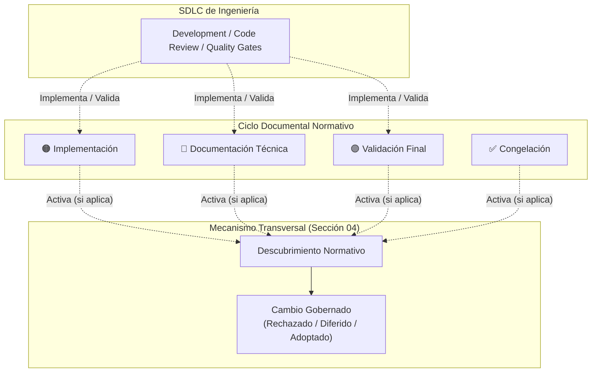

> **Regla de Gobernanza:**
> El SDLC define cómo se ejecuta el trabajo de ingeniería; el Ciclo Documental Normativo define cuál es la especificación vigente que debe implementarse y cómo debe gestionarse cualquier descubrimiento que afecte dicha especificación.

### 05.2. Fases del Workflow

| Fase              | Descripción                                                                                                                                                                                                     | Artefacto                                                       |
| :---------------- | :-------------------------------------------------------------------------------------------------------------------------------------------------------------------------------------------------------------- | :-------------------------------------------------------------- |
| **Idea**          | Concepción de una nueva funcionalidad, mejora o corrección que constituye el punto inicial del workflow.                                                                                                        | Registro de idea, propuesta o Issue inicial, según corresponda. |
| **RFC**           | Propuesta formal para cambios significativos, transversales o que puedan afectar múltiples componentes, proyectos o principios del ecosistema.                                                                  | Documento RFC aprobado.                                         |
| **ADR**           | Registro formal de una decisión arquitectónica que selecciona una solución entre alternativas y establece su justificación, independientemente de que haya sido identificada antes o durante la implementación. | Documento ADR aprobado.                                         |
| **Issue**         | Ticket de trabajo que describe la tarea a realizar.                                                                                                                                                             | Issue en sistema de seguimiento.                                |
| **Branch**        | Rama de trabajo aislada para el desarrollo.                                                                                                                                                                     | Branch en repositorio.                                          |
| **Development**   | Implementación de la solución.                                                                                                                                                                                  | Código en desarrollo.                                           |
| **Commit**        | Registro de cambios en el repositorio local.                                                                                                                                                                    | Commit con mensaje convencional.                                |
| **Push**          | Publicación de cambios en el repositorio remoto.                                                                                                                                                                | Push a la rama remota.                                          |
| **Pull Request**  | Solicitud de fusión de cambios a la rama principal.                                                                                                                                                             | PR con template completo.                                       |
| **Code Review**   | Revisión de código, arquitectura y documentación.                                                                                                                                                               | Aprobación de reviewers.                                        |
| **Quality Gates** | Validación automática de calidad y seguridad.                                                                                                                                                                   | Paso de todos los gates.                                        |
| **Merge**         | Fusión de cambios a la rama principal.                                                                                                                                                                          | Merge completado.                                               |
| **Release**       | Creación de una nueva versión.                                                                                                                                                                                  | Release con versionado semántico.                               |
| **Deployment**    | Despliegue a los entornos correspondientes.                                                                                                                                                                     | Despliegue exitoso.                                             |
| **Monitoring**    | Monitoreo de la aplicación en producción.                                                                                                                                                                       | Métricas y logs.                                                |
| **Feedback**      | Retroalimentación del sistema y usuarios.                                                                                                                                                                       | Incidentes, métricas, opiniones.                                |
| **Improvement**   | Mejora continua basada en feedback.                                                                                                                                                                             | Nuevas ideas y cambios.                                         |

### 05.3. Conexión con la Arquitectura del Ecosistema

Durante la fase **Development**, las herramientas del Engineering Ecosystem ejecutan el flujo arquitectónico definido en **EE-DOC-004 (Engineering Architecture)**, utilizando las capas de **Workflow, Context, AI, Artifact Generation y Validation** para asistir al desarrollador sin modificar el SDLC descrito en este documento.

El desarrollador interactúa con el flujo SDLC descrito en este documento (Branch → Development → Commit → Push → PR → Review → Quality Gates → Merge), mientras que el Engineering Ecosystem, de forma transparente, orquesta:

- **Context Layer:** Recupera información relevante del entorno y el historial.
- **AI Layer:** Genera código, documentación, diagramas o pruebas.
- **Artifact Generation Layer:** Materializa las respuestas de IA en artefactos concretos.
- **Validation Layer:** Valida automáticamente la calidad y seguridad de los artefactos generados.

> **Nota:**
> Este flujo arquitectónico está documentado en detalle en **EE-DOC-004 — Engineering Architecture**, específicamente en la Sección 09 (Flujo Arquitectónico). El presente documento define el SDLC humano; EE-DOC-004 define el flujo automatizado del ecosistema.

---

## 06. Branching Model

### 06.1. Estrategias Soportadas

El Engineering Ecosystem soporta dos modelos de branching, dependiendo de la complejidad del proyecto y la estructura del equipo.
El modelo de branching es una decisión de cada proyecto dentro de las estrategias soportadas por el Engineering Ecosystem. La selección debe registrarse mediante ADR durante la inicialización del proyecto y debe respetar las restricciones de protección, integración y release establecidas por este documento.

| Modelo                      | Descripción                                                                                                                                                                                           | Recomendado para                                                         |
| --------------------------- | ----------------------------------------------------------------------------------------------------------------------------------------------------------------------------------------------------- | ------------------------------------------------------------------------ |
| **Main Only (Trunk-Based)** | Solo la rama `main` como rama principal. Todas las ramas temporales (`feature/*`, `bugfix/*`) nacen y mueren en `main`.                                                                               | Proyectos pequeños, entregas continuas, equipos con alta automatización. |
| **Main + Develop**          | Dos ramas principales: `main` para producción y `develop` para integración continua. Las ramas temporales nacen y mueren en `develop`, y `release/*` y `hotfix/*` gestionan los despliegues a `main`. | Proyectos complejos, múltiples equipos, ciclos de release planificados.  |

> **Nota:**
> Cada proyecto debe definir su estrategia de branching durante su fase de Inicialización y documentarla mediante un ADR aprobado. El modelo no debe cambiarse durante el ciclo de vida del proyecto sin un ADR aprobado por el Equipo de Arquitectura.

### 06.2. Tipos de Ramas

| Tipo de Rama    | Propósito                                | Ciclo de Vida                                            | Ejemplo                       |
| :-------------- | :--------------------------------------- | :------------------------------------------------------- | :---------------------------- |
| **main**        | Rama principal de producción.            | Permanente. Protegida.                                   | `main`                        |
| **develop**     | Rama de integración continua (opcional). | Permanente (si se usa). Protegida.                       | `develop`                     |
| **feature/**    | Nueva funcionalidad.                     | Nace de `main` o `develop`. Muere en `main` o `develop`. | `feature/user-authentication` |
| **bugfix/**     | Corrección de errores no críticos.       | Nace de `main` o `develop`. Muere en `main` o `develop`. | `bugfix/login-error`          |
| **hotfix/**     | Corrección urgente en producción.        | Nace de `main`. Muere en `main` y `develop`.             | `hotfix/security-patch`       |
| **release/**    | Preparación de una nueva versión.        | Nace de `develop`. Muere en `main` y `develop`.          | `release/v1.2.0`              |
| **spike/**      | Investigación o prototipo.               | Nace de `main` o `develop`. Se descarta o se fusiona.    | `spike/new-auth-flow`         |
| **docs/**       | Documentación exclusivamente.            | Nace de `main`. Muere en `main`.                         | `docs/api-reference`          |
| **refactor/**   | Refactorización sin cambio funcional.    | Nace de `main` o `develop`. Muere en `main` o `develop`. | `refactor/kernel-module`      |
| **experiment/** | Experimentos sin garantía de fusión.     | Nace de `main`. Se descarta o se fusiona.                | `experiment/new-ai-model`     |

### 06.3. Reglas de Creación

| Regla  | Descripción                                                                                       |
| :----: | :------------------------------------------------------------------------------------------------ |
| **R1** | Toda rama debe originarse desde la rama base correspondiente a su tipo y estrategia de branching. |
| **R2** | El nombre de la rama debe seguir el formato `<tipo>/<descripción>` en `kebab-case`.               |
| **R3** | La descripción debe ser breve y descriptiva.                                                      |
| **R4** | Las ramas deben tener una vida corta (máximo 7 días sin actividad).                               |
| **R5** | Las ramas deben ser eliminadas después de ser fusionadas.                                         |

### 06.4. Protección de Ramas

| Rama         | Protección                                    | Requisitos para Merge                                    |
| :----------- | :-------------------------------------------- | :------------------------------------------------------- |
| **main**     | Bloqueada para escritura directa.             | PR aprobado, quality gates pasados, al menos 1 approval. |
| **develop**  | Bloqueada para escritura directa (si existe). | PR aprobado, quality gates pasados, al menos 1 approval. |
| **feature/** | Sin protección especial.                      | PR aprobado, quality gates pasados.                      |
| **hotfix/**  | Sin protección especial.                      | PR aprobado, quality gates pasados, approval urgente.    |

---

## 07. Commit Convention

### 07.1. Formato

```git
<tipo>(<scope opcional>): <descripción>

[body opcional]

[footer opcional]
```

### 07.2. Tipos de Commit

| Tipo         | Propósito                             | Ejemplo                                     |
| :----------- | :------------------------------------ | :------------------------------------------ |
| **feat**     | Nueva funcionalidad.                  | `feat(auth): add login endpoint`            |
| **fix**      | Corrección de error.                  | `fix(api): handle empty response`           |
| **docs**     | Cambios en documentación.             | `docs(readme): update installation guide`   |
| **style**    | Cambios de formato, semántica.        | `style: fix indentation`                    |
| **refactor** | Refactorización sin cambio funcional. | `refactor(kernel): simplify error handling` |
| **test**     | Adición o modificación de tests.      | `test(unit): add coverage for auth service` |
| **chore**    | Cambios en build, herramientas.       | `chore(deps): update typescript`            |
| **perf**     | Mejora de rendimiento.                | `perf(query): optimize index usage`         |
| **ci**       | Cambios en CI/CD.                     | `ci(github): add security scanning`         |
| **revert**   | Reversión de un commit anterior.      | `revert: undo breaking change`              |

### 07.3. Referencia a Issue/RFC/ADR

| Regla  | Descripción                                                                    |
| :----: | :----------------------------------------------------------------------------- |
| **R1** | Todo commit debe hacer referencia al Issue correspondiente cuando exista.      |
| **R2** | Los commits relacionados con RFC o ADR deben referenciarlos explícitamente.    |
| **R3** | El formato de referencia es: `Refs: #issue`, `Refs: RFC-XXX`, `Refs: ADR-XXX`. |

### 07.4. Commits Prohibidos

| Tipo de Commit                            | Motivo                                   |
| :---------------------------------------- | :--------------------------------------- |
| **Commits masivos**                       | Dificultan la revisión y el seguimiento. |
| **Commits sin mensaje**                   | No permiten trazabilidad.                |
| **Commits con mensaje genérico**          | Ej: "fix", "update", "changes".          |
| **Commits que mezclan múltiples cambios** | Deben dividirse en commits atómicos.     |

### 07.5. Granularidad y Frecuencia

| Regla  | Descripción                                            |
| :----: | :----------------------------------------------------- |
| **R1** | Un commit debe representar un cambio atómico y lógico. |
| **R2** | Los commits deben ser frecuentes (varios por día).     |
| **R3** | Los commits deben ser pequeños y enfocados.            |

---

## 08. Pull Request Workflow

### 08.1. Cuándo Crear un PR

| Regla  | Descripción                                                                                                                              |
| :----: | :--------------------------------------------------------------------------------------------------------------------------------------- |
| **R1** | Un PR debe crearse tan pronto como haya cambios listos para revisión.                                                                    |
| **R2** | Los PRs deben ser pequeños y enfocados (máximo 400 líneas de cambio), salvo que la naturaleza del cambio justifique un tamaño superior.. |
| **R3** | Los PRs deben incluir referencia al Issue correspondiente.                                                                               |

### 08.2. Template Obligatorio

| Sección               | Descripción                             |
| :-------------------- | :-------------------------------------- |
| **Descripción**       | Explicación del cambio y su motivación. |
| **Issue relacionado** | Referencia al Issue correspondiente.    |
| **Tipo de cambio**    | `feat`, `fix`, `docs`, `refactor`, etc. |
| **Testing**           | Cómo se probó el cambio.                |
| **Checklist**         | Verificación de quality gates.          |
| **Screenshots**       | Capturas de pantalla (si aplica).       |

### 08.3. Reviewers y Approvals

| Regla  | Descripción                                                                  |
| :----: | :--------------------------------------------------------------------------- |
| **R1** | Al menos 1 approval de un reviewer calificado.                               |
| **R2** | Los reviewers deben ser asignados automáticamente basándose en `CODEOWNERS`. |
| **R3** | Los cambios críticos requieren al menos 2 approvals.                         |

### 08.4. Merge Strategy

| Estrategia           | Uso                                                                     |
| :------------------- | :---------------------------------------------------------------------- |
| **Squash and Merge** | Obligatorio para `feature/*` y `bugfix/*`. Unifica commits en uno solo. |
| **Rebase and Merge** | Opcional para ramas con múltiples colaboradores.                        |
| **Merge Commit**     | Prohibido en todos los casos.                                           |

### 08.5. Resolución de Conflictos

| Regla  | Descripción                                                          |
| :----: | :------------------------------------------------------------------- |
| **R1** | Los conflictos deben resolverse en la rama de origen.                |
| **R2** | No se permite resolver conflictos directamente en la rama principal. |

---

## 09. Code Review

### 09.1. Qué Revisar

| Área               | Qué Validar                                               |
| :----------------- | :-------------------------------------------------------- |
| **Código**         | Corrección, legibilidad, mantenibilidad, uso de patrones. |
| **Arquitectura**   | Alineación con principios arquitectónicos.                |
| **Documentación**  | Documentación actualizada y completa.                     |
| **Seguridad**      | Ausencia de vulnerabilidades, manejo de secretos.         |
| **Performance**    | Eficiencia y escalabilidad.                               |
| **Observabilidad** | Logs, métricas, traces.                                   |
| **Tests**          | Cobertura, casos borde, integración.                      |

### 09.2. Principios de Revisión

| Principio          | Descripción                                                |
| :----------------- | :--------------------------------------------------------- |
| **Respeto**        | Las revisiones deben ser constructivas y respetuosas.      |
| **Rapidez**        | Las revisiones deben realizarse dentro de las 24 horas.    |
| **Completitud**    | La revisión debe cubrir todos los aspectos del cambio.     |
| **Automatización** | Todo lo que puede ser automatizado, debe ser automatizado. |

---

## 10. Quality Gates

### 10.1. Mandatory Gates (Obligatorios)

| Gate                         | Descripción                                                         | Ejecutor / Estándar                                                                                                                                                   | Fallo             |
| :--------------------------- | :------------------------------------------------------------------ | :-------------------------------------------------------------------------------------------------------------------------------------------------------------------- | :---------------- |
| **Build Validation**         | Verifica que todos los workspaces compilan correctamente.           | Turborepo (`pnpm build`)                                                                                                                                              | Bloquea el merge. |
| **Lint**                     | Verificación de estilo de código y reglas estáticas.                | ESLint (`pnpm lint`)                                                                                                                                                  | Bloquea el merge. |
| **Formatting**               | Verificación de formato de código fuente (**check**, no escritura). | Prettier check (`prettier --check` vía suite de validación / EE-DOC-010 QG-FMT-001). El comando de escritura local (`pnpm format`) **no** constituye el Quality Gate. | Bloquea el merge. |
| **Unit & Integration Tests** | Ejecución de pruebas unitarias, de integración y componentes.       | Vitest (`pnpm test` / EE-ADR-002)                                                                                                                                     | Bloquea el merge. |
| **E2E Tests**                | Ejecución de pruebas End-to-End en aplicaciones con interfaz.       | Playwright (`pnpm e2e` / EE-ADR-002)                                                                                                                                  | Bloquea el merge. |
| **Architecture & Structure** | Verificación de estructura, dependencias entre capas e imports.     | Script (`pnpm validate` / EE-DOC-006)                                                                                                                                 | Bloquea el merge. |
| **Secret Scanning**          | Verificación de ausencias de credenciales o secretos en el código.  | Security Scan / CI Pipeline                                                                                                                                           | Bloquea el merge. |
| **Documentation Validation** | Verificación de documentación técnica sincronizada y actualizada.   | Compliance Check                                                                                                                                                      | Bloquea el merge. |

> **SSOT de detalle:** el catálogo de identificadores, severidad, disponibilidad, agregación y evidencia vive en **EE-DOC-010 — Quality Gates**.
> **Esta sección** define el conjunto **Mandatory** del workflow. EE-DOC-010 **no puede eliminar ni relajar** el carácter obligatorio de estos gates.
> **Adopción progresiva:** un Mandatory Gate puede estar aún no materializado (`PENDING_IMPLEMENTATION` en EE-DOC-010). Eso **no** lo hace opcional; rige el **§10.4** y **EE-ADR-004**.

### 10.2. Conditional Gates (Condicionales)

| Gate                  | Descripción                                                                                                      |
| :-------------------- | :--------------------------------------------------------------------------------------------------------------- |
| **Performance Tests** | Obligatorio cuando el cambio pueda afectar objetivos de rendimiento definidos.                                   |
| **Security Scanning** | Obligatorio cuando el cambio afecte componentes, dependencias, exposición o superficies de seguridad relevantes. |
| **Code Coverage**     | Aplicable según las políticas de calidad del proyecto.                                                           |
| **Mutation Testing**  | Aplicable a componentes críticos cuando sea requerido por la política de calidad.                                |

### 10.3. Bypass Policy (ad hoc)

Bypass **puntual** de un gate **ya evaluable** (p.ej. incidente, hotfix acotado). **No** sustituye el régimen de adopción progresiva del §10.4.

| Regla  | Descripción                                                                                                                                                           |
| :----: | :-------------------------------------------------------------------------------------------------------------------------------------------------------------------- |
| **R1** | El bypass solo podrá ser autorizado por la autoridad definida para el tipo de Quality Gate afectado.                                                                  |
| **R2** | El bypass debe ser documentado y justificado.                                                                                                                         |
| **R3** | El bypass tiene una validez máxima de **7 días**.                                                                                                                     |
| **R4** | Los bypasses deben ser revisados en la próxima auditoría.                                                                                                             |
| **R5** | Un bypass ad hoc **no** autoriza declarar **PASS** de un gate no ejecutado ni omitir de forma indefinida un Mandatory Gate pendiente de materialización (usar §10.4). |

### 10.4. Adopción progresiva de Mandatory Gates (EE-ADR-004)

Se separan explícitamente:

| Concepto                       | Significado                                                               |
| :----------------------------- | :------------------------------------------------------------------------ |
| **Mandatory**                  | Requisito normativo de este documento (§10.1 / §10.2 cuando aplique)      |
| **Implemented / Availability** | Estado de materialización del mecanismo (detalle en EE-DOC-010)           |
| **Enforced**                   | Protección efectiva del merge vía EE-DOC-007 (required checks / Rulesets) |

#### 10.4.1. Estados de materialización (referencia a EE-DOC-010)

Para cada Mandatory Gate, EE-DOC-010 registra **Availability**:

| Availability               | Obligación normativa               | Enforcement de merge     | PASS permitido                |
| :------------------------- | :--------------------------------- | :----------------------- | :---------------------------- |
| **ACTIVE**                 | Sí                                 | Sí (cuando aplicable)    | Solo tras evaluación conforme |
| **PENDING_IMPLEMENTATION** | **Sí (sigue siendo Mandatory)**    | Aún **no** materializado | **No** — no se declara PASS   |
| **DEPRECATED**             | Retirado del uso normativo vigente | No                       | No                            |

**PENDING_IMPLEMENTATION no significa “opcional”.** Significa: la obligación existe; el mecanismo aún no está implementado y cableado de forma verificable.

#### 10.4.2. Régimen transitorio gobernado

Mientras un Mandatory Gate esté `PENDING_IMPLEMENTATION`:

1. El requisito **permanece** en el catálogo obligatorio de §10.1.
2. No constituye un gate **ejecutable** del merge hasta existir enforcement materializado (No False Pass).
3. El **estado de cumplimiento del workflow** respecto de ese gate queda bajo **régimen transitorio** aprobado por el **Equipo de Arquitectura**, documentado con:
   - lista de gates PENDING afectados;
   - plan de normalización (unidades **EE-IMP-010-PXX**);
   - hitos y fecha objetivo de transición a ACTIVE;
   - riesgos aceptados explícitamente.
4. La transición **PENDING → ACTIVE** requiere la cadena:

```text
definition → implementation → invocation → result → evidence → CI → enforcement → actualización documental (EE-DOC-010)
```

5. EE-DOC-007 solo incorpora al required check / Ruleset los gates **ACTIVE**; al activar un gate, el enforcement de plataforma debe actualizarse en la misma ola de implementación cuando corresponda.

#### 10.4.3. Relación con §10.3

| Mecanismo                     | Uso                                                                        |
| :---------------------------- | :------------------------------------------------------------------------- |
| **§10.3 Bypass ad hoc**       | Excepción temporal (≤ 7 días) sobre un gate **ya materializado/evaluable** |
| **§10.4 Régimen transitorio** | Ausencia estructural de implementación de un Mandatory Gate hasta ACTIVE   |

No se usa §10.3 como cobertura indefinida de “aún no implementamos el gate”.

#### 10.4.4. Jerarquía

```text
EE-DOC-005  → Mandatory (qué es obligatorio)
EE-DOC-010  → Severity, Availability, Result, agregación (detalle; no elimina Mandatory)
EE-IMP-010  → materialización PENDING → ACTIVE
EE-DOC-007  → enforcement efectivo de lo ACTIVE
```

---

## 11. Release Workflow

### 11.1. Semantic Versioning

| Componente    | Descripción                         | Ejemplo  |
| :------------ | :---------------------------------- | :------- |
| **Major (X)** | Cambios incompatibles.              | `v2.0.0` |
| **Minor (Y)** | Nuevas funcionalidades compatibles. | `v1.2.0` |
| **Patch (Z)** | Correcciones compatibles.           | `v1.1.1` |

### 11.2. Release Criteria

| Criterio                     | Descripción                                                    |
| :--------------------------- | :------------------------------------------------------------- |
| **All Quality Gates Passed** | Todos los gates obligatorios deben estar verdes.               |
| **Documentation Updated**    | La documentación debe estar actualizada.                       |
| **CHANGELOG Updated**        | El CHANGELOG debe estar actualizado.                           |
| **Release Notes Created**    | Se deben crear release notes.                                  |
| **Approval Obtained**        | Aprobación del Equipo de Arquitectura (para releases mayores). |

### 11.3. Proceso de Release

El ciclo de publicación y versionado del monorepo utiliza **Changesets** (`@changesets/cli`) como motor oficial conforme a **EE-ADR-001**:

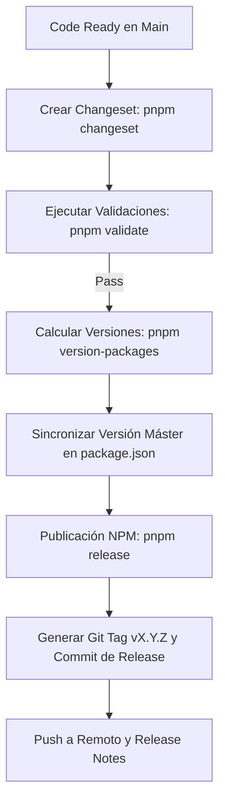

1. **Declaración de Cambios:** Todo cambio destinado a producción debe incorporar un archivo changeset (`pnpm changeset`) que describa el impacto (major, minor, patch) en los paquetes afectados.
2. **Versionado Automático:** El comando `pnpm version-packages` actualiza los `package.json` individuales y el `CHANGELOG.md` del monorepo.
3. **Publicación y Etiquetado:** El script `pnpm release` valida los contratos, publica los paquetes autorizados en el registro npm y genera la etiqueta Git global (`vX.Y.Z`) vinculada a la versión canónica del ecosistema.

---

## 12. Deployment & Post-Deployment

### 12.1. Entornos de Despliegue

| Entorno         | Propósito                           | Promoción                      |
| :-------------- | :---------------------------------- | :----------------------------- |
| **Development** | Desarrollo y pruebas locales.       | Manual.                        |
| **QA**          | Pruebas de calidad y automatizadas. | Automática desde `develop`.    |
| **Staging**     | Pruebas pre-producción.             | Manual desde `develop`/`main`. |
| **Production**  | Entorno de producción.              | Manual desde `main`.           |

### 12.2. Deployment Strategy

| Estrategia     | Descripción                                      | Uso                                   |
| :------------- | :----------------------------------------------- | :------------------------------------ |
| **Rolling**    | Actualización gradual de instancias.             | Default para la mayoría de servicios. |
| **Blue/Green** | Dos entornos idénticos, cambio de tráfico.       | Para servicios críticos.              |
| **Canary**     | Despliegue gradual a un subconjunto de usuarios. | Para experimentos y pruebas A/B.      |

### 12.3. Post-Deployment Validation

| Validación             | Descripción                                       |
| :--------------------- | :------------------------------------------------ |
| **Health Checks**      | Verificación de que el servicio está funcionando. |
| **Smoke Tests**        | Pruebas rápidas de funcionalidad básica.          |
| **Monitoring**         | Verificación de métricas y logs.                  |
| **Incident Detection** | Detección automática de incidentes.               |

### 12.4. Deployment Success Criteria

Un deployment se considera exitoso cuando se cumplen todos los siguientes criterios:

| Criterio          | Descripción                                                                      | Umbral                                                                 |
| ----------------- | -------------------------------------------------------------------------------- | ---------------------------------------------------------------------- |
| **Health Checks** | Todos los health checks del servicio deben estar verdes.                         | 100% de checks exitosos.                                               |
| **Smoke Tests**   | Las pruebas de humo deben pasar sin fallos.                                      | 0 fallos.                                                              |
| **Error Rate**    | La tasa de error debe mantenerse dentro del umbral definido.                     | Dentro del umbral definido por el SLO/SLA correspondiente al servicio. |
| **Rollback**      | No se ha requerido un rollback durante el período de observación.                | 0 rollbacks en 30 minutos.                                             |
| **Monitoring**    | Las métricas clave (latencia, throughput) están dentro de los límites esperados. | Según SLO definido.                                                    |

> **Nota:**
> El período de observación post-deployment es de **30 minutos** para servicios críticos y **15 minutos** para servicios no críticos. Durante este período, se monitorean activamente las métricas y logs.

---

## 13. Hotfix Workflow

### 13.1. Cuándo Usar

| Situación                  | Descripción                                                  |
| :------------------------- | :----------------------------------------------------------- |
| **Critical Bug**           | Error que afecta a la funcionalidad principal en producción. |
| **Security Vulnerability** | Vulnerabilidad de seguridad crítica.                         |
| **Data Loss**              | Pérdida de datos en producción.                              |

### 13.2. Proceso

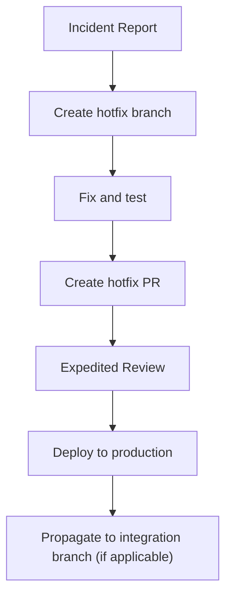

> **Nota de Propagación:**
>
> - Estrategia Main Only (Trunk-Based): La rama `hotfix/*` se origina directamente desde la rama `main` y se fusiona únicamente en `main` tras superar los controles automatizados mínimos establecidos.
> - Estrategia Main + Develop: La rama `hotfix/*` se origina desde la rama `main`, se valida, se fusiona primero en `main` (desencadenando el despliegue a producción) y de manera obligatoria se realiza una propagación (cherry-pick o back-port Pull Request) hacia la rama `develop` para garantizar la alineación del flujo de desarrollo futuro.

### 13.3. Reglas Especiales

| Regla  | Descripción                                                                                                                                                                                                                     |
| :----: | :------------------------------------------------------------------------------------------------------------------------------------------------------------------------------------------------------------------------------ |
| **R1** | El hotfix podrá desplegarse directamente a producción mediante el flujo de emergencia autorizado, siempre que se hayan ejecutado los controles mínimos de seguridad, validación y trazabilidad definidos para cambios urgentes. |
| **R2** | Cuando el proyecto utilice la estrategia Main + Develop, el hotfix debe propagarse a develop después del despliegue a producción. En la estrategia Main Only, esta propagación no aplica.                                       |
| **R3** | El hotfix debe ser documentado y revisado posteriormente.                                                                                                                                                                       |
| **R4** | El hotfix puede omitir quality gates opcionales.                                                                                                                                                                                |

---

## 14. Rollback Workflow

### 14.1. Cuándo Usar

| Situación             | Descripción                                |
| :-------------------- | :----------------------------------------- |
| **Failed Deployment** | El despliegue falló o causó problemas.     |
| **Critical Incident** | Incidente crítico detectado en producción. |
| **Data Corruption**   | Corrupción de datos.                       |

### 14.2. Proceso

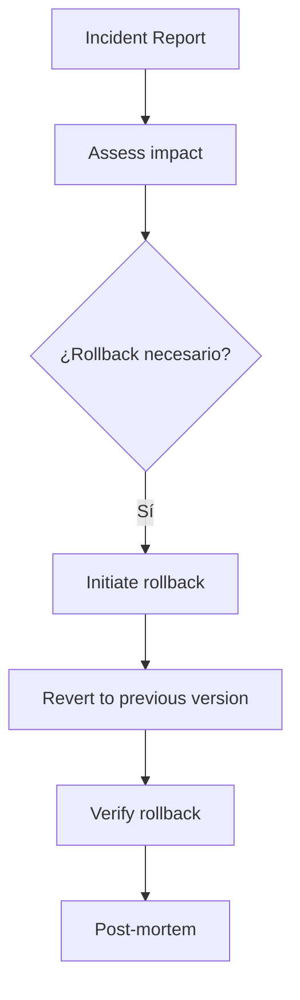

### 14.3. Estrategias de Rollback

| Estrategia            | Descripción                               |
| :-------------------- | :---------------------------------------- |
| **Revert Commit**     | Revertir el commit que causó el problema. |
| **Tag Rollback**      | Volver a un tag anterior.                 |
| **Blue/Green Switch** | Cambiar el tráfico al entorno anterior.   |

---

## 15. Workflow Exceptions

Una excepción de workflow modifica temporalmente la forma de ejecución del workflow, pero no elimina los requisitos de trazabilidad, autorización, seguridad ni documentación. Los mecanismos de Hotfix y Rollback definidos en las Secciones 13 y 14 constituyen workflows especializados y no deben considerarse excepciones por sí mismos, salvo que requieran apartarse de las reglas normativas establecidas.

### 15.1. Tipos de Excepciones

| Tipo                       | Descripción                          | Autorización            |
| :------------------------- | :----------------------------------- | :---------------------- |
| **Production Down**        | Caída de producción.                 | DevOps / Arquitecto.    |
| **Critical Vulnerability** | Vulnerabilidad de seguridad crítica. | Security Team.          |
| **Urgent Hotfix**          | Corrección urgente.                  | Arquitecto.             |
| **Temporal Bypass**        | Bypass temporal de quality gates.    | Equipo de Arquitectura. |

### 15.2. Reglas para Excepciones

| Regla  | Descripción                                                           |
| :----: | :-------------------------------------------------------------------- |
| **R1** | Toda excepción debe ser documentada.                                  |
| **R2** | Las excepciones deben ser aprobadas por la autoridad correspondiente. |
| **R3** | Las excepciones deben tener un plan de normalización.                 |
| **R4** | Las excepciones deben ser revisadas en la próxima auditoría.          |

---

## 16. Compliance & Audit

### 16.1. Compliance Checks

| Check                 | Descripción                                           | Frecuencia  |
| :-------------------- | :---------------------------------------------------- | :---------- |
| **Branch Protection** | Verificar que las ramas principales están protegidas. | Continua.   |
| **PR Compliance**     | Verificar que los PRs siguen el template.             | Por PR.     |
| **Commit Convention** | Verificar que los commits siguen la convención.       | Por commit. |
| **Quality Gates**     | Verificar que los quality gates se cumplen.           | Por PR.     |

### 16.2. Workflow Audits

| Auditoría              | Descripción                                        | Frecuencia      |
| :--------------------- | :------------------------------------------------- | :-------------- |
| **Quarterly Audit**    | Revisión trimestral del cumplimiento del workflow. | Trimestral.     |
| **Random Spot Checks** | Verificaciones aleatorias de cumplimiento.         | Aleatoria.      |
| **Incident Audits**    | Auditoría después de incidentes importantes.       | Post-incidente. |

### 16.3. Automatic Enforcement

| Mecanismo            | Descripción                                  |
| :------------------- | :------------------------------------------- |
| **Pre-commit Hooks** | Verificaciones automáticas antes del commit. |
| **Pre-push Hooks**   | Verificaciones automáticas antes del push.   |
| **CI Checks**        | Verificaciones automáticas en CI.            |
| **Branch Rules**     | Reglas automáticas de protección de ramas.   |

### 16.4. Exception Reporting

| Reporte               | Descripción                                    |
| :-------------------- | :--------------------------------------------- |
| **Exception Log**     | Registro de todas las excepciones aprobadas.   |
| **Exception Review**  | Revisión periódica de excepciones.             |
| **Exception Metrics** | Métricas de excepciones por tipo y frecuencia. |

### 16.5. Workflow Metrics

| Métrica                          | Descripción                                             | Objetivo     |
| :------------------------------- | :------------------------------------------------------ | :----------- |
| **Lead Time**                    | Tiempo desde la idea hasta la entrega.                  | < 7 días.    |
| **Cycle Time**                   | Tiempo desde el inicio del desarrollo hasta la entrega. | < 3 días.    |
| **Deployment Frequency**         | Frecuencia de despliegues.                              | > 1 por día. |
| **Change Failure Rate**          | Porcentaje de cambios que causan fallos.                | < 5%.        |
| **Mean Time To Recovery (MTTR)** | Tiempo medio de recuperación.                           | < 1 hora.    |

---

## 17. Referencias

| Código         | Documento                          | Descripción                        |
| :------------- | :--------------------------------- | :--------------------------------- |
| **EE-DOC-001** | Master Documentation Index         | Índice maestro del ecosistema      |
| **EE-DOC-002** | Document Design Template           | Estándar documental del ecosistema |
| **EE-DOC-003** | Engineering Ecosystem Constitution | Constitución del ecosistema        |
| **EE-DOC-004** | Engineering Architecture           | Arquitectura del ecosistema        |

---

## 18. Historial de Cambios

| Versión    | Fecha      | Autor                  | Aprobado por           | Motivo                                                | Cambios                                                                                                                            | Estado        |
| :--------- | :--------- | :--------------------- | :--------------------- | :---------------------------------------------------- | :--------------------------------------------------------------------------------------------------------------------------------- | :------------ |
| **v1.0.0** | 2026-08-02 | Equipo de Arquitectura | Equipo de Arquitectura | Creación inicial                                      | Versión inicial del Development Workflow                                                                                           | **Congelado** |
| **v1.1.0** | 2026-08-20 | Equipo de Arquitectura | Equipo de Arquitectura | Incorporación de Implementación Adaptativa Controlada | Nueva Sección 04; actualización de principios, flujo SDLC y alcance                                                                | **Congelado** |
| **v1.2.0** | 2026-08-21 | Equipo de Arquitectura | Equipo de Arquitectura | Implementación por fase y reordenamiento documental   | Se añadió Implementación → Validación → Borrador DT por fase; DT precede a Validación Final y Congelación apunta a Descubrimiento. | **Congelado** |
| **v1.3.0** | 2026-09-17 | Equipo de Arquitectura | Equipo de Arquitectura | Sincronización con ADR-001, ADR-002 y Changesets      | Integración de Changesets en Release Workflow, especificación de Vitest/Playwright en Quality Gates y precisión SSOT.              | Congelado     |
| **v1.3.1** | 2026-09-29 | Equipo de Arquitectura | Equipo de Arquitectura | Alineación Formatting con EE-DOC-010                  | Gate Formatting = Prettier **check** (no write); puntero SSOT a EE-DOC-010                                                         | Congelado     |
| **v1.4.0** | 2026-09-29 | Equipo de Arquitectura | Equipo de Arquitectura | EE-ADR-004 Adopción progresiva QG                     | §10.4 Mandatory ≠ Implemented ≠ Enforced; §10.3 R5; régimen transitorio; cadena PENDING→ACTIVE                                     | **Congelado** |

---

## FIN DEL DOCUMENTO
