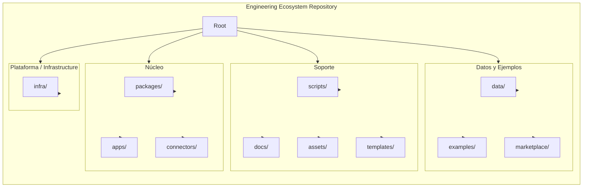
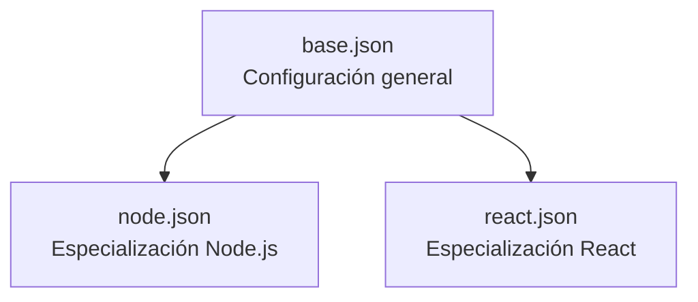
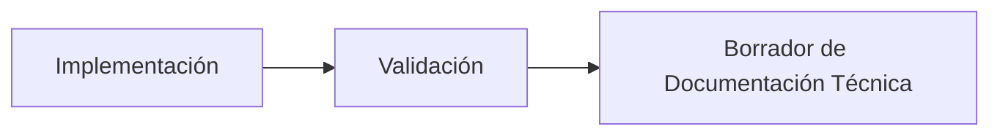

# EE-DOC-006 — Repository Structure

Este documento sigue el estándar EE-DOC-002 — Document Design Template y EE-DOC-005 - Development Workflow.

---

## METADATOS

| Campo                 | Valor                                                                                                                  |
| --------------------- | ---------------------------------------------------------------------------------------------------------------------- |
| **ID**                | EE-DOC-006                                                                                                             |
| **Documento**         | Repository Structure                                                                                                   |
| **Código corto**      | EE-DOC-006                                                                                                             |
| **Tipo**              | Documento Técnico                                                                                                      |
| **Clasificación**     | Implementación                                                                                                         |
| **Nivel**             | Técnico                                                                                                                |
| **Normativo**         | Sí                                                                                                                     |
| **Versión**           | v1.8.1                                                                                                                 |
| **Estado**            | Congelado                                                                                                              |
| **Propietario**       | Equipo de Arquitectura                                                                                                 |
| **Documento padre**   | EE-DOC-005                                                                                                             |
| **Dependencias**      | EE-DOC-001, EE-DOC-002, EE-DOC-003, EE-DOC-004, EE-DOC-005, EE-ADR-001, EE-ADR-002, EE-ADR-005, EE-RFC-001, EE-RFC-002 |
| **Aprobado por**      | Equipo de Arquitectura                                                                                                 |
| **Audiencia**         | Arquitectura, Desarrollo, DevOps                                                                                       |
| **Fecha de creación** | 2026-08-03                                                                                                             |
| **Última revisión**   | 2026-10-06                                                                                                             |
| **Próxima revisión**  | No aplica — Documento Congelado                                                                                        |

---

## 01. Propósito

Este documento define la organización física y lógica del repositorio del Engineering Ecosystem. Establece la estructura de directorios, la organización de paquetes, las convenciones de nombres y las reglas de dependencias que garantizan consistencia, mantenibilidad y escalabilidad del código fuente.
La estructura definida en este documento será la base sobre la que se construirán todos los componentes del Engineering Ecosystem.

---

## 02. Alcance

Este documento cubre:

- Los principios de organización del repositorio.
- La arquitectura general del repositorio.
- La estructura de directorios y su propósito.
- La organización por workspaces y paquetes.
- Las convenciones de nombres para directorios, paquetes, aplicaciones y archivos.
- La organización de configuraciones compartidas.
- La gestión de dependencias y versionado.
- La organización de scripts y herramientas de automatización.
- Las reglas de imports y dependencias entre paquetes.
- Los assets y recursos compartidos.
- La evolución y cumplimiento de la estructura.

Este documento **no cubre**:

- La gobernanza de GitHub (cubierta en EE-DOC-007).
- La configuración del entorno de desarrollo (cubierta en EE-DOC-008).
- La infraestructura del ecosistema (cubierta en EE-DOC-009).
- La implementación de calidad y pipelines (cubierta en EE-DOC-010).

---

## 03. Principios de Organización del Repositorio

| #   | Principio                           | Descripción                                                                               |
| --- | ----------------------------------- | ----------------------------------------------------------------------------------------- |
| 1   | **Monorepo**                        | Todo el código del Engineering Ecosystem reside en un único repositorio.                  |
| 2   | **Modularidad**                     | El código se organiza en paquetes independientes con responsabilidades claras.            |
| 3   | **Separación de Responsabilidades** | Cada paquete tiene un propósito único y bien definido.                                    |
| 4   | **Consistencia**                    | Todas las estructuras siguen las mismas convenciones.                                     |
| 5   | **Escalabilidad**                   | La estructura permite añadir nuevos paquetes sin reestructurar el repositorio.            |
| 6   | **Local First**                     | La estructura debe funcionar completamente en entornos locales sin dependencias externas. |
| 7   | **Vendor Agnostic**                 | La estructura no depende de un proveedor específico.                                      |
| 8   | **Documentation Driven**            | La estructura está documentada antes de implementarse.                                    |

---

## 04. Arquitectura General del Repositorio



> **Nota:**
> El diagrama representa la estructura completa de directorios de primer nivel del repositorio. Los directorios de primer nivel se agrupan en **cuatro** categorías funcionales: Núcleo del Ecosistema (`packages/`, `apps/` y `connectors/`), Soporte (`scripts/`, `docs/`, `assets/` y `templates/`), Datos, Ejemplos y Extensibilidad (`data/`, `examples/` y `marketplace/`), y **Plataforma / Infrastructure** (`infra/`). Las configuraciones compartidas forman parte de `packages/config/` y se documentan en el desglose interno de `packages/` definido en la Sección 05. El **contenido semántico** de `infra/` se rige por **EE-DOC-009**; este documento registra únicamente el **nivel estructural autorizado** (EE-RFC-001).

---

## 05. Estructura de Directorios

```text
ee-monorepo/
├── .changeset/                           # Infraestructura de Changesets (versionado / releases)
│   └── config.json                       # Configuración de Changesets
│
├── .github/                              # Gobernanza GitHub (EE-DOC-007)
│   ├── ISSUE_TEMPLATE/                   # Plantillas de issues
│   ├── PULL_REQUEST_TEMPLATE/            # Plantillas de pull request
│   ├── workflows/                        # GitHub Actions (CI de plataforma)
│   └── CODEOWNERS                        # Ownership de rutas
│
├── .vscode/                              # Workspace VS Code / editor compartido (EE-DOC-008)
│   ├── extensions.json                   # Extensiones recomendadas
│   └── settings.json                     # Ajustes de editor del workspace
│
├── apps/                                 # Aplicaciones del ecosistema
│   ├── cli/                              # CLI del Engineering Ecosystem
│   ├── dashboard/                        # Dashboard web
│   └── extensions/                       # Extensiones para IDEs
│       ├── windsurf/                     # Extensión para Windsurf
│       └── vscode/                       # Extensión para VS Code
│
├── assets/                               # Recursos compartidos estáticos (§14)
│   ├── fonts/                            # Fuentes
│   ├── images/                           # Imágenes
│   └── templates/                        # Recursos estáticos de plantilla (no generativos)
│
├── connectors/                           # Conectores a servicios externos
│   ├── community/                        # Conectores mantenidos por la comunidad (futuro)
│   ├── experimental/                     # Conectores experimentales (futuro)
│   └── official/                         # Conectores oficiales soportados
│       ├── a2a/                          # Protocolo A2A
│       ├── docker/                       # Adaptador de integración Docker
│       ├── github/                       # Adaptador de integración GitHub
│       ├── kubernetes/                   # Adaptador de integración Kubernetes
│       ├── mcp/                          # Servidores MCP
│       └── notebooklm/                   # Adaptador NotebookLM
│
├── data/                                 # Datos del ecosistema
│   ├── benchmarks/                       # Datos de benchmarks
│   ├── datasets/                         # Conjuntos de datos
│   └── models/                           # Modelos / artefactos de modelo (gobierno en EE-DOC-013/014)
│
├── docs/                                 # Documentación del ecosistema
│   ├── adr/                              # Decisiones arquitectónicas (EE-ADR)
│   ├── architecture/                     # Documentación de arquitectura (EE-DOC / EE-TEC)
│   ├── developer/                        # Guías e implementación (EE-IMP)
│   ├── rfc/                              # Solicitudes de cambio transversal (EE-RFC)
│   └── validation/                       # Ecosystem Validation (EE-DOC-015): reports, waivers, evidence
│       ├── README.md                     # Índice del dominio de validación de ecosistema
│       ├── reports/                      # EE-VAL-* Validation Reports
│       ├── waivers/                      # EE-WAIVE-* (registro WAIVED de gates, EE-DOC-010)
│       └── evidence/                     # Evidencias de revisión (p. ej. layers/)
│
├── examples/                             # Ejemplos de uso
│   ├── ddd/                              # Ejemplo de DDD
│   ├── erp/                              # Ejemplo de ERP
│   └── microservices/                    # Ejemplo de microservicios
│
├── infra/                                # Infraestructura de producto/plataforma (EE-DOC-009 / EE-RFC-001)
│   ├── containers/                       # Contenerización de producto (semántica → EE-DOC-009)
│   ├── orchestration/                    # Orquestación desplegada (semántica → EE-DOC-009)
│   └── secrets/                          # Política / convenciones de secretos de runtime (no credenciales)
│
├── marketplace/                          # Marketplace de extensibilidad
│   ├── agents/                           # Agentes
│   ├── plugins/                          # Plugins
│   ├── prompts/                          # Prompts
│   ├── skills/                           # Skills
│   └── templates/                        # Plantillas de marketplace (≠ templates/ generativos de raíz)
│
├── packages/                             # Paquetes del ecosistema
│   ├── config/                           # Configuraciones compartidas (SSOT de tooling)
│   │   ├── eslint/                       # Configuración base de ESLint
│   │   ├── jest/                         # Configuración base de Jest (legacy / compat. EE-ADR-002)
│   │   ├── playwright/                   # Configuración base de Playwright (EE-ADR-002)
│   │   ├── prettier/                     # Configuración base de Prettier
│   │   ├── typescript/                   # Configuración base de TypeScript
│   │   ├── vite/                         # Configuración base de Vite
│   │   └── vitest/                       # Configuración base de Vitest (EE-ADR-002)
│   │
│   ├── execution/                        # Ejecución y orquestación
│   │   ├── engine/                       # Motor de ejecución
│   │   ├── workflow/                     # Motor de workflows
│   │   ├── scheduler/                    # Planificador
│   │   └── execution-manager/            # Gestor de ejecuciones
│   │
│   ├── foundation/                       # Fundación técnica
│   │   ├── kernel/                       # Núcleo técnico
│   │   ├── contracts/                    # Contratos e interfaces (p. ej. Provider SPI — EE-ADR-005)
│   │   ├── core/                         # Servicios centrales
│   │   ├── shared/                       # Utilidades compartidas de foundation
│   │   ├── runtime/                      # Infraestructura de ejecución
│   │   ├── configuration/                # Gestión de configuración
│   │   ├── cache/                        # Gestión de caché
│   │   ├── events/                       # Infraestructura de eventos
│   │   ├── policy/                       # Gestión de políticas
│   │   └── security/                     # Seguridad base
│   │
│   ├── governance/                       # Gobernanza y calidad
│   │   ├── quality/                      # Puertas de calidad
│   │   ├── governance-engine/            # Motor de gobernanza
│   │   ├── metrics/                      # Motor de métricas
│   │   └── observability/                # Observabilidad
│   │
│   ├── integration/                      # Integración y API
│   │   ├── framework/                    # Framework de integración
│   │   └── api-gateway/                  # Gateway de API
│   │
│   ├── intelligence/                     # Inteligencia artificial (EE-DOC-013)
│   │   ├── specialization-router/        # Enrutamiento por especialidad
│   │   ├── provider-router/              # Enrutamiento de proveedores
│   │   ├── context/                      # Adaptación de contexto hacia el Router
│   │   ├── complexity/                   # Analizador de complejidad
│   │   ├── learning/                     # Motor de aprendizaje (diferido según 013)
│   │   ├── evaluation/                   # Motor de evaluación (≠ QG-010)
│   │   └── ai-providers/                 # Orquestación/policy de providers (SDK vendor en connectors)
│   │
│   ├── knowledge/                        # Gestión del conocimiento
│   │   ├── knowledge-engine/             # Motor de conocimiento
│   │   ├── knowledge-acquisition/        # Adquisición de conocimiento
│   │   ├── knowledge-pipeline/           # Pipeline de conocimiento
│   │   ├── knowledge-graph/              # Grafo de conocimiento
│   │   ├── second-brain/                 # Almacenamiento permanente
│   │   ├── documentation/                # Generación de documentación
│   │   ├── ontology/                     # Ontología
│   │   ├── taxonomy/                     # Taxonomía
│   │   ├── semantic-model/               # Modelo semántico
│   │   ├── semantic-search/              # Búsqueda semántica
│   │   └── embeddings/                   # Embeddings vectoriales (SSOT semántico → EE-DOC-014)
│   │
│   ├── registry/                         # Registros
│   │   ├── core/                         # Núcleo del registro
│   │   ├── system/                       # Sistema de registros
│   │   └── specialists/                  # Registro de especialistas
│   │
│   ├── shared/                           # Componentes y contratos compartidos (paquete plano as-built)
│   │
│   └── sdk/                              # SDKs de exposición pública
│       ├── routing-sdk/                  # SDK de enrutamiento
│       ├── workflow-sdk/                 # SDK de workflows
│       ├── context-sdk/                  # SDK de contexto
│       ├── artifact-sdk/                 # SDK de artefactos
│       └── knowledge-sdk/                # SDK de conocimiento
│
├── scripts/                              # Scripts de automatización (EE-DOC-011)
│   ├── bootstrap                         # Configuración inicial
│   ├── build                             # Compilación
│   ├── clean                             # Limpieza de artefactos
│   ├── configure-lint.mjs                # Configuración automatizada de ESLint
│   ├── dev                               # Ejecución en modo desarrollo
│   ├── doctor                            # Diagnóstico del entorno
│   ├── format                            # Formateo del repositorio
│   ├── generate                          # Generación desde templates/ (Plop)
│   ├── lint                              # Análisis estático y linting
│   ├── release                           # Gestión de releases
│   ├── test                              # Ejecución de pruebas
│   ├── typecheck                         # Verificación de tipos TypeScript
│   └── validate                          # Validación integral del repositorio
│
├── templates/                            # Templates generativos SSOT (EE-DOC-012 / EE-RFC-002)
│   ├── app/                              # Categoría T-APP
│   ├── connector/                        # Categoría T-CON
│   ├── document/                         # Categoría T-DOC
│   └── package/                          # Categoría T-PKG
│
├── .editorconfig                         # Estilo de editor (raíz)
├── .gitattributes                        # Atributos Git
├── .gitignore                            # Exclusiones Git
├── .markdownlint.json                    # SSOT markdownlint (editor / higiene docs)
├── .npmrc                                # Configuración npm/pnpm del monorepo
├── .nvmrc                                # Pin de Node (EE-ADR-003)
├── .prettierignore                       # Exclusiones Prettier
├── CHANGELOG.md                          # Historial de cambios del repositorio
├── LICENSE                               # Apache License 2.0
├── NOTICE                                # Avisos de licencia
├── package.json                          # Manifesto raíz y scripts root
├── pnpm-lock.yaml                        # Lockfile de dependencias
├── pnpm-workspace.yaml                   # Definición de workspaces
├── README.md                             # Introducción al monorepo
└── turbo.json                            # Pipeline Turborepo (EE-ADR-001)
```

> **Nota sobre archivos de configuración en la raíz:**
> La raíz del repositorio no contiene archivos de configuración de herramientas como `tsconfig.base.json`, `.eslintrc` o `.prettierrc`. Toda la configuración compartida de tooling reside exclusivamente en `packages/config/`. Los únicos archivos de configuración en la raíz son los de orquestación del monorepo (`.npmrc`, `.nvmrc`, `turbo.json`, `pnpm-workspace.yaml`), higiene/editor (`.editorconfig`, `.gitattributes`, `.gitignore`, `.prettierignore`, `.markdownlint.json`) y gobierno del repositorio (`LICENSE`, `NOTICE`).
>
> **Nota sobre connectors/:**
> Los conectores se ubican como carpeta de primer nivel porque representan integraciones externas con servicios fuera del repositorio (GitHub, Docker, Kubernetes, NotebookLM, MCP, A2A). Su ciclo de vida, propósito y dependencias difieren de los paquetes internos de `packages/integration/`, que contienen el framework de integración y el API gateway. Esta separación es coherente con el principio de Separación de Concerns (EE-DOC-004, Sección 04). Las reglas de import de connectors están en **§13.2** (EE-ADR-005).
>
> **Nota sobre infra/ (EE-RFC-001 / EE-DOC-009):**
> El directorio de primer nivel `infra/` es la **frontera física** de la infraestructura de producto/plataforma. **EE-DOC-006** autoriza su existencia, categoría y subárbol estructural (`containers/`, `orchestration/`, `secrets/`). **EE-DOC-009** define el significado, reglas y especialización del contenido. Los workspaces `connectors/official/docker` y `connectors/official/kubernetes` son **adaptadores de integración** y **no** alojan manifiestos IaC de plataforma. La materialización física de `infra/` en el monorepo corresponde a **EE-IMP-009**, no a la implementación histórica de EE-DOC-006.
>
> **Nota sobre templates/ vs assets/templates/ vs marketplace/templates/:**
>
> - `templates/` (raíz): SSOT de **templates generativos** (EE-DOC-012 / EE-RFC-002); materialización de la capacidad generativa → **EE-IMP-012**.
> - `assets/templates/`: recursos **estáticos** no generativos (§14).
> - `marketplace/templates/`: activos de marketplace; no sustituyen la SSOT generativa de raíz.
>
> **Nota sobre connectors/community y connectors/experimental:**
> Los directorios `community/` y `experimental/` están definidos en la estructura del repositorio (Sección 05) pero no se incluyen como workspaces hasta que contengan paquetes Node.js reales. Cuando se añadan conectores en esas categorías, se agregarán al `pnpm-workspace.yaml` mediante el patrón `connectors/community/*` o `connectors/experimental/*` según corresponda.

---

## 06. Organización por Workspaces

### 06.1. pnpm Workspaces

```yaml
packages:
  - 'apps/*'
  - 'apps/extensions/*'
  - 'connectors/official/*'
  - 'packages/config/*'
  - 'packages/foundation'
  - 'packages/shared'
  - 'packages/execution'
  - 'packages/intelligence'
  - 'packages/knowledge'
  - 'packages/governance'
  - 'packages/integration'
  - 'packages/registry'
  - 'packages/sdk'

ignoredBuiltDependencies:
  - '@parcel/watcher'
  - esbuild
  - unrs-resolver
```

---

### 06.2. Turborepo

El repositorio utiliza Turborepo para la orquestación de builds y tareas:

| Configuración   | Descripción                                                    |
| :-------------- | :------------------------------------------------------------- |
| **Pipeline**    | Define las tareas y sus dependencias (build, test, lint).      |
| **Cache**       | Cachea los resultados de las tareas para acelerar ejecuciones. |
| **Paralelismo** | Ejecuta tareas en paralelo cuando no hay dependencias.         |

---

## 07. Convenciones de Nombres

### 07.1. Convenciones de Nomenclatura e Idioma

La **política de idioma por tipo de artefacto** se define normativamente en **EE-DOC-002 §16.1 — Política de Idioma por Tipo de Artefacto**. Esta sección **no redefine** dicha política; la aplica y especializa a la **nomenclatura del monorepo**.

| Elemento                                | Regla de Formato                  | Idioma Obligatorio   | Ejemplo                                          |
| :-------------------------------------- | :-------------------------------- | :------------------- | :----------------------------------------------- |
| **Namespace Corporativo**               | `@eq-labs/<categoría>-<nombre>`   | Inglés (`en-US`)     | `@eq-labs/foundation-kernel`                     |
| **Paquetes e Infraestructura**          | `kebab-case`                      | Inglés (`en-US`)     | `@eq-labs/artifact-generator`                    |
| **Aplicaciones**                        | `kebab-case`                      | Inglés (`en-US`)     | `eq-labs-cli`                                    |
| **Directorios y Archivos de Código**    | `kebab-case`                      | Inglés (`en-US`)     | `workflow-router.ts`, `artifact-generator/`      |
| **Clases y Componentes**                | `PascalCase`                      | Inglés (`en-US`)     | `ContextEngine`, `KnowledgeEngine`               |
| **Interfaces**                          | `PascalCase` (con prefijo `I`)    | Inglés (`en-US`)     | `IWorkflowRouter`, `IKnowledgeEngine`            |
| **Variables, Funciones y Métodos**      | `camelCase`                       | Inglés (`en-US`)     | `validateArtifact()`, `getKnowledgeById()`       |
| **Constantes y Enums**                  | `UPPER_SNAKE_CASE` / `PascalCase` | Inglés (`en-US`)     | `MAX_RETRY_COUNT`, `KnowledgeStatus`             |
| **Pruebas Unitarias e Integración**     | `.test.ts` / `.spec.ts`           | Inglés (`en-US`)     | `knowledge-engine.test.ts`                       |
| **Pruebas End-to-End (E2E)**            | `.e2e.ts` / `.spec.ts`            | Inglés (`en-US`)     | `knowledge-flow.e2e.ts`                          |
| **Ramas Git**                           | `tipo/descripción-corta`          | Inglés (`en-US`)     | `feature/add-ai-router`, `fix/governance-parser` |
| **Documentos de Gobernanza (`EE-DOC`)** | Prefijo + Código + Nombre         | Contenido en Español | `EE-DOC-001_Master_Documentation_Index.md`       |
| **Planes de Implementación (`EE-IMP`)** | Prefijo + Código + Nombre         | Contenido en Español | `EE-IMP-006-P01_Bootstrap_del_Repositorio.md`    |
| **Registros de Decisión (`EE-ADR`)**    | Prefijo + Código + Nombre         | Contenido en Español | `EE-ADR-001_Workspace_Task_Orchestration.md`     |
| **Propuestas de Cambio (`EE-RFC`)**     | Prefijo + Código + Nombre         | Contenido en Español | `EE-RFC-001_Layer_Responsibilities.md`           |

> **Nota sobre idioma:** El idioma de cada fila deriva de **EE-DOC-002 §16.1**. Cualquier cambio de política de idioma se realiza únicamente en EE-DOC-002; esta sección se actualiza solo si cambia la nomenclatura del monorepo o la aplicación de esa norma.
>
> **Nota sobre nombres de paquetes:**
> El formato de los nombres de paquetes sigue el patrón `@eq-labs/<categoría>-<nombre>`, donde:
>
> - **`categoría`** corresponde a la capa o dominio del paquete (ej. `foundation`, `execution`, `config`, `intelligence`, `knowledge`, `governance`, `integration`, `registry`, `sdk`).
> - **`nombre`** corresponde al componente específico dentro de la categoría (ej. `kernel`, `core`, `typescript`, `engine`).

---

## 08. Organización de Paquetes

| Categoría        | Propósito                                                                                                   | Paquetes                                                                                                                                                                                         |
| :--------------- | :---------------------------------------------------------------------------------------------------------- | :----------------------------------------------------------------------------------------------------------------------------------------------------------------------------------------------- |
| **Config**       | Configuraciones técnicas compartidas utilizadas por los paquetes, aplicaciones y herramientas del monorepo. | `typescript`, `eslint`, `prettier`, `vite`, `jest`, `vitest`, `playwright`                                                                                                                       |
| **Foundation**   | Componentes fundamentales del ecosistema.                                                                   | `kernel`, `contracts`, `core`, `shared`, `runtime`, `configuration`, `cache`, `events`, `policy`, `security`                                                                                     |
| **Execution**    | Ejecución y orquestación de tareas.                                                                         | `engine`, `workflow`, `scheduler`, `execution-manager`                                                                                                                                           |
| **Intelligence** | Capacidades de IA y enrutamiento inteligente.                                                               | `specialization-router`, `provider-router`, `context`, `complexity`, `learning`, `evaluation`, `ai-providers`                                                                                    |
| **Knowledge**    | Gestión del conocimiento.                                                                                   | `knowledge-engine`, `knowledge-acquisition`, `knowledge-pipeline`, `knowledge-graph`, `second-brain`, `documentation`, `ontology`, `taxonomy`, `semantic-model`, `semantic-search`, `embeddings` |
| **Governance**   | Gobernanza y calidad.                                                                                       | `quality`, `governance-engine`, `metrics`, `observability`                                                                                                                                       |
| **Integration**  | Integración y APIs.                                                                                         | `framework`, `api-gateway`                                                                                                                                                                       |
| **Registry**     | Registros de especialistas y recursos.                                                                      | `core`, `system`, `specialists`                                                                                                                                                                  |
| **SDK**          | SDKs para consumir el ecosistema.                                                                           | `routing-sdk`, `workflow-sdk`, `context-sdk`, `artifact-sdk`, `knowledge-sdk`                                                                                                                    |

> **Nota:**
> Los paquetes de configuración (`packages/config/*`) constituyen la base técnica del monorepo y deben existir antes del resto de paquetes, ya que proveen la configuración compartida utilizada durante el desarrollo, compilación y pruebas.

---

## 09. Organización de Aplicaciones

| Aplicación             | Propósito                                                                     | Tecnología                          |
| :--------------------- | :---------------------------------------------------------------------------- | :---------------------------------- |
| **CLI**                | Interfaz de línea de comandos para el Engineering Ecosystem.                  | Node.js + TypeScript + Commander.js |
| **Dashboard**          | Interfaz web para visualización y administración.                             | React + TypeScript + Vite           |
| **Windsurf Extension** | Aplicación independiente del workspace ubicada en `apps/extensions/windsurf`. | TypeScript + Windsurf API           |
| **VS Code Extension**  | Aplicación independiente del workspace ubicada en `apps/extensions/vscode`.   | TypeScript + VS Code API            |

---

## 10. Organización de Configuración Compartida

| Paquete de Configuración | Configuración  | Propósito                                             | Archivo                                 |
| :----------------------- | :------------- | :---------------------------------------------------- | :-------------------------------------- |
| **TypeScript**           | **Base**       | Configuración general de TypeScript.                  | `packages/config/typescript/base.json`  |
| **TypeScript**           | **Node**       | Configuración de TypeScript para proyectos Node.js.   | `packages/config/typescript/node.json`  |
| **TypeScript**           | **React**      | Configuración de TypeScript para proyectos React.     | `packages/config/typescript/react.json` |
| **ESLint**               | **Base**       | Configuración base de ESLint.                         | `packages/config/eslint/base.mjs`       |
| **ESLint**               | **TypeScript** | Configuración de ESLint para proyectos TypeScript.    | `packages/config/eslint/typescript.mjs` |
| **Prettier**             | **Base**       | Configuración compartida de Prettier.                 | `packages/config/prettier/index.mjs`    |
| **Vite**                 | **Base**       | Configuración base de Vite.                           | `packages/config/vite/base.mjs`         |
| **Vite**                 | **Library**    | Configuración de Vite para construcción de librerías. | `packages/config/vite/library.mjs`      |
| **Vite**                 | **React**      | Configuración de Vite para aplicaciones React.        | `packages/config/vite/react.mjs`        |
| **Jest**                 | **Base**       | Configuración base de Jest.                           | `packages/config/jest/base.mjs`         |
| **Jest**                 | **TypeScript** | Configuración de Jest para proyectos TypeScript.      | `packages/config/jest/typescript.mjs`   |
| **Vitest**               | **Base**       | Configuración base de Vitest.                         | `packages/config/vitest/base.mjs`       |
| **Vitest**               | **React**      | Configuración de Vitest para proyectos React.         | `packages/config/vitest/react.mjs`      |
| **Playwright**           | **Base**       | Configuración base de Playwright para pruebas E2E.    | `packages/config/playwright/base.mjs`   |

> **Nota:**
> Cada subdirectorio ubicado dentro de `packages/config/` constituye un paquete independiente del workspace de pnpm. Por ejemplo, `packages/config/typescript`, `packages/config/eslint`, `packages/config/prettier`, `packages/config/vite`, `packages/config/jest` y `packages/config/vitest` son paquetes independientes, cada uno con su propio `package.json`, versión y ciclo de vida. Los demás paquetes del Engineering Ecosystem consumen estas configuraciones mediante sus nombres de paquete (por ejemplo, `@eq-labs/config-typescript`), utilizando el mecanismo de extensión o consumo definido por cada herramienta (por ejemplo `extends`, `presets`, plugins o configuraciones equivalentes). Este enfoque establece una única fuente de verdad para toda la configuración técnica del monorepo, evita duplicación de configuraciones, permite el versionado independiente de cada paquete de configuración y garantiza una evolución consistente y controlada de las herramientas de desarrollo en todo el Engineering Ecosystem.

### Estructura Física de configuraciones consumibles (packages/config/)

```text
packages/
└── config/
    ├── typescript/
    │   ├── base.json
    │   ├── node.json
    │   ├── package.json
    │   ├── react.json
    │   └── README.md
    ├── eslint/
    │   ├── base.mjs
    │   ├── package.json
    │   ├── README.md
    │   └── typescript.mjs
    ├── prettier/
    │   ├── index.mjs
    │   ├── package.json
    │   └── README.md
    ├── vite/
    │   ├── base.mjs
    │   ├── library.mjs
    │   ├── package.json
    │   ├── react.mjs
    │   └── README.md
    ├── jest/
    │   ├── base.mjs
    │   ├── package.json
    │   ├── README.md
    │   └── typescript.mjs
    ├── vitest/
    │   ├── base.mjs
    │   ├── package.json
    │   ├── react.mjs
    │   └── README.md
    └── playwright/
        ├── base.mjs
        ├── base.d.ts
        ├── package.json
        ├── eslint.config.mjs
        ├── turbo.json
        └── README.md
```

### Reglas de uso

| Regla  | Descripción                                                                                                                                                                                             |
| :----: | :------------------------------------------------------------------------------------------------------------------------------------------------------------------------------------------------------ |
| **R1** | Todos los paquetes deben consumir las configuraciones compartidas correspondientes mediante `extends`, `presets` o el mecanismo equivalente de la herramienta.                                          |
| **R2** | Las configuraciones específicas de paquete pueden sobrescribir las configuraciones compartidas cuando exista una necesidad técnica justificada.                                                         |
| **R3** | Las configuraciones especializadas deben mantener una relación explícita con la configuración base correspondiente y no pueden redefinir de forma independiente las reglas generales que esta establece |
| **R4** | Los cambios en las configuraciones compartidas requieren aprobación de Arquitectura.                                                                                                                    |

### 10.1. Configuraciones Especializadas

Las configuraciones compartidas pueden incluir configuraciones especializadas derivadas de una configuración base cuando una tecnología, framework o tipo de aplicación requiera reglas adicionales.

Las configuraciones especializadas:

- pertenecen al mismo paquete de configuración que su configuración base;
- deben mantener una relación explícita con la configuración base correspondiente;
- no constituyen una nueva fuente de verdad independiente;
- pueden ser consumidas únicamente por los workspaces que requieran dicha especialización;
- deben conservar compatibilidad con las reglas generales establecidas por la configuración base.

Para TypeScript, el paquete `@eq-labs/config-typescript` proporciona:

- `base.json` — configuración general de TypeScript.
- `node.json` — configuración especializada para proyectos Node.js.
- `react.json` — configuración especializada para proyectos React.

Las configuraciones `node.json` y `react.json` constituyen especializaciones del perfil base de TypeScript y deben mantener la compatibilidad con las reglas establecidas por `base.json`.



---

## 11. Gestión de Dependencias

### 11.1. Gestor de Paquetes

El repositorio utiliza **pnpm** como gestor de paquetes:

| Característica | Descripción                                        |
| :------------- | :------------------------------------------------- |
| **Workspaces** | Soporte nativo para monorepos.                     |
| **Eficiencia** | Uso de enlaces simbólicos para evitar duplicación. |
| **Lockfile**   | `pnpm-lock.yaml` para bloqueo de versiones.        |

### 11.2. Política de Dependencias

| Política                       | Descripción                                                                                                                                                                               |
| :----------------------------- | :---------------------------------------------------------------------------------------------------------------------------------------------------------------------------------------- |
| **Versiones fijas**            | Las dependencias declaradas en `dependencies` y `devDependencies` deben utilizar versiones exactas, sin `^`, `~` ni rangos abiertos.                                                      |
| **Rangos en peerDependencies** | Las dependencias declaradas en `peerDependencies` podrán utilizar rangos de compatibilidad (`^`, `~`, etc.) cuando sea necesario expresar el rango de versiones soportado por el paquete. |
| **Actualizaciones**            | Las actualizaciones de dependencias requieren revisión.                                                                                                                                   |
| **Seguridad**                  | Las vulnerabilidades críticas se actualizan de inmediato.                                                                                                                                 |

### 11.3. Dependencias en el Monorepo

| Dependencia               | Descripción                                            |
| :------------------------ | :----------------------------------------------------- |
| **Dependencias internas** | Paquetes del monorepo referenciados con `workspace:*`. |
| **Dependencias externas** | Paquetes de npm.                                       |
| **Dev dependencies**      | Herramientas de desarrollo (tests, builds, etc.).      |

### 11.4. Versionado de Paquetes Internos

| Regla  | Descripción                                                                                                   |
| :----- | :------------------------------------------------------------------------------------------------------------ |
| **R1** | Todos los paquetes internos utilizan `workspace:*` para referenciar dependencias entre paquetes del monorepo. |
| **R2** | No se permite fijar versiones manuales entre paquetes internos.                                               |
| **R3** | El versionado para publicación será gestionado por el proceso de release definido en **EE-DOC-011**.          |

> **Nota:**
> El uso de `workspace:*` garantiza que las dependencias entre paquetes del monorepo siempre se resuelvan localmente, evitando versiones desactualizadas y conflictos. El versionado semántico de cada paquete se gestiona en el momento del release mediante el proceso de Automation (**EE-DOC-011**), que actualiza las versiones de los paquetes afectados y genera los artefactos de publicación correspondientes.

---

## 12. Organización de Scripts y Comandos Root

| Comando              | Implementación      | Propósito                                             | Frecuencia          |
| :------------------- | :------------------ | :---------------------------------------------------- | :------------------ |
| **bootstrap**        | `scripts/bootstrap` | Configuración inicial del entorno.                    | Una vez.            |
| **build**            | `scripts/build`     | Compilación de todos los paquetes.                    | Por cambio.         |
| **dev**              | `scripts/dev`       | Ejecución en modo desarrollo con recarga en caliente. | Durante desarrollo. |
| **test**             | `scripts/test`      | Ejecución de todas las pruebas disponibles.           | Por cambio.         |
| **lint**             | `scripts/lint`      | Análisis estático y linting.                          | Por cambio.         |
| **format**           | `scripts/format`    | Formateo del repositorio mediante Prettier.           | Por cambio.         |
| **typecheck**        | `scripts/typecheck` | Verificación de tipos TypeScript.                     | Por cambio.         |
| **validate**         | `scripts/validate`  | Validación integral del repositorio.                  | Por cambio.         |
| **doctor**           | `scripts/doctor`    | Diagnóstico del entorno de desarrollo.                | Por necesidad.      |
| **generate**         | `scripts/generate`  | Generación de código mediante Plop.                   | Por necesidad.      |
| **release**          | `scripts/release`   | Gestión del proceso de release.                       | Por release.        |
| **clean**            | `scripts/clean`     | Limpieza de artefactos de compilación y cachés.       | Por necesidad.      |
| **changeset**        | `changeset`         | Declaración interactiva de cambios y SemVer.          | Por cambio.         |
| **version-packages** | `changeset version` | Cálculo y actualización de versiones en el monorepo.  | Por release.        |

> **Nota:**
> Esta lista constituye el contrato oficial de comandos root del repositorio. Los comandos mantienen interfaces estables y no deben cambiar de forma incompatible. Los comandos que requieren implementación mediante archivos de automatización delegan en `scripts/`; los comandos `changeset` y `version-packages` son invocados directamente mediante la CLI de Changesets. Turborepo se utiliza para la orquestación de tareas de workspace cuando corresponde.

---

## 13. Reglas de Imports y Dependencias

### 13.1. Arquitectura en Capas

|    Capa    | Categoría        | Descripción                                                   |
| :--------: | :--------------- | :------------------------------------------------------------ |
| **Capa 0** | **Config**       | Configuraciones compartidas. Base de todas las herramientas.  |
| **Capa 1** | **Foundation**   | Componentes fundamentales del ecosistema. Núcleo técnico.     |
| **Capa 2** | **Execution**    | Ejecución y orquestación de tareas.                           |
| **Capa 3** | **Intelligence** | Capacidades de IA y enrutamiento inteligente.                 |
| **Capa 4** | **Knowledge**    | Gestión del conocimiento y documentación.                     |
| **Capa 5** | **Governance**   | Gobernanza, calidad, métricas y observabilidad.               |
| **Capa 6** | **Integration**  | Integración y APIs.                                           |
| **Capa 7** | **Registry**     | Registros de especialistas y recursos.                        |
| **Capa 8** | **SDK**          | SDKs para consumir el ecosistema. Capa de exposición pública. |

> **Regla fundamental:**
> El Engineering Ecosystem utiliza una arquitectura lógica organizada por capas. Las dependencias entre los paquetes del ecosistema no son libres ni implícitas por la posición de una capa. Cada paquete únicamente puede depender de otros paquetes pertenecientes a las categorías expresamente autorizadas en la **Sección 13.2**. Ningún paquete puede depender de otro paquete perteneciente a una categoría ubicada en una capa superior.

### 13.2. Dependencias Permitidas

| Categoría        |      Capa      | Puede importar de                                                                                                                                                                                                                                                                 |
| :--------------- | :------------: | :-------------------------------------------------------------------------------------------------------------------------------------------------------------------------------------------------------------------------------------------------------------------------------- |
| **Config**       |       0        | Ninguno.                                                                                                                                                                                                                                                                          |
| **Foundation**   |       1        | Config, Foundation.                                                                                                                                                                                                                                                               |
| **Execution**    |       2        | Foundation, Execution.                                                                                                                                                                                                                                                            |
| **Intelligence** |       3        | Foundation, Execution, Intelligence.                                                                                                                                                                                                                                              |
| **Knowledge**    |       4        | Foundation, Execution, Intelligence, Knowledge.                                                                                                                                                                                                                                   |
| **Governance**   |       5        | Foundation, Execution, Knowledge, Governance.                                                                                                                                                                                                                                     |
| **Integration**  |       6        | Foundation, Execution, Governance, Integration.                                                                                                                                                                                                                                   |
| **Registry**     |       7        | Foundation, Knowledge, Registry.                                                                                                                                                                                                                                                  |
| **SDK**          |       8        | Foundation, Execution, Intelligence, Knowledge, Governance, Integration, Registry. **No** Connectors (ni como wiring de provider; SDK no es composition root — **§13.5** / EE-ADR-005).                                                                                           |
| **Connectors**   | Límite externo | **Runtime/contrato:** solo **Foundation**. **Tooling:** `packages/config/*` como `devDependency` (TypeScript, ESLint, etc.). **Prohibido en runtime:** Intelligence, Registry, Knowledge, Execution, Governance, Integration, SDK, otros connectors como dependencia de contrato. |

> **Nota sobre la arquitectura en capas:**
> La tabla anterior define la matriz oficial de dependencias permitidas del Engineering Ecosystem. Aunque las categorías se organizan en capas, cada paquete únicamente puede depender de otros paquetes pertenecientes a las categorías expresamente autorizadas en esta matriz. Por ejemplo, **Governance (Capa 5)** puede depender de **Knowledge (Capa 4)** porque requiere inspeccionar el conocimiento para aplicar políticas de calidad, métricas u observabilidad, mientras que Knowledge no puede depender de Governance.
> **Enforcement:** la validación automática completa de capas/ciclos en `scripts/validate` puede estar **PENDING** conforme a **EE-DOC-010** (No False Pass). Hasta que el gate esté **ACTIVE**, el cumplimiento se garantiza por revisión arquitectónica, CODEOWNERS y criterios de **EE-IMP** aplicables — **no** se declara PASS de matriz si el mecanismo no existe.
>
> **Config como tooling (todas las categorías de packages y connectors):**
> Dependencias de `@eq-labs/config-*` en `devDependencies` **no** se interpretan como violación de la matriz de runtime. Config es capa 0 de tooling compartido.
>
> **Extensión Connectors (EE-ADR-005):**
>
> - Un **connector** de provider **depende en runtime/contrato únicamente hacia** Foundation; **tooling** vía Config (`devDependency`) está permitido.
> - **Prohibido** que un connector dependa de Intelligence, Registry, Knowledge, Execution, Governance, Integration o SDK.
> - **Intelligence no importa connectors** (solo tipos Foundation).
> - **Composition root** (quién puede importar implementaciones de connectors para wiring): ver **§13.5**.

### 13.3. Dependencias Prohibidas

| Categoría        | Destino prohibido                                                          | Motivo                                                                                                                                                      |
| :--------------- | :------------------------------------------------------------------------- | :---------------------------------------------------------------------------------------------------------------------------------------------------------- |
| **Config**       | Cualquier categoría ubicada en una capa superior                           | Config constituye la capa base del ecosistema y no puede depender de categorías superiores.                                                                 |
| **Foundation**   | Cualquier capa superior a Foundation                                       | Foundation constituye la base funcional del ecosistema.                                                                                                     |
| **Execution**    | Cualquier capa superior a Execution                                        | Violación de la arquitectura en capas.                                                                                                                      |
| **Intelligence** | Cualquier capa superior a Intelligence                                     | Violación de la arquitectura en capas.                                                                                                                      |
| **Knowledge**    | Cualquier capa superior a Knowledge                                        | Violación de la arquitectura en capas.                                                                                                                      |
| **Governance**   | Cualquier capa superior a Governance                                       | Violación de la arquitectura en capas.                                                                                                                      |
| **Integration**  | Cualquier capa superior a Integration                                      | Violación de la arquitectura en capas.                                                                                                                      |
| **Registry**     | SDK                                                                        | Registry no puede depender de los SDK, ya que estos constituyen la capa de exposición pública del ecosistema.                                               |
| **SDK**          | Connectors (como wiring de provider)                                       | Los SDK constituyen la capa terminal de exposición pública; **no** actúan como composition root ni importan connectors para cablear providers (EE-ADR-005). |
| **Connectors**   | Intelligence, Registry, Knowledge, Execution, Governance, Integration, SDK | Un connector de provider no acopla el core; solo implementa contratos Foundation.                                                                           |

> **Nota:**
> La tabla de dependencias prohibidas se deriva directamente de la matriz de dependencias permitidas definida en la **Sección 13.2** y se incluye únicamente como referencia arquitectónica para facilitar la revisión y comprensión de las restricciones del ecosistema. En caso de discrepancia, la matriz de dependencias permitidas de la **Sección 13.2** constituye la fuente normativa.

### 13.4. Reglas de Imports

| Regla        | Descripción                                                                                                        |
| :----------- | :----------------------------------------------------------------------------------------------------------------- |
| **R1**       | Los imports deben ser explícitos y no usar rutas relativas profundas.                                              |
| **R2**       | Los paquetes deben exportar sus APIs públicas a través de `index.ts`.                                              |
| **R3**       | Los imports entre paquetes deben usar el nombre del paquete, no rutas relativas.                                   |
| **R4**       | No se permiten imports circulares entre paquetes.                                                                  |
| **R5**       | Las dependencias entre paquetes deben respetar la matriz definida en la **Sección 13.2**.                          |
| **R-SDK-1**  | Los SDKs son la capa de exposición pública del ecosistema.                                                         |
| **R-SDK-2**  | Los SDKs pueden depender de paquetes internos, pero nunca a la inversa.                                            |
| **R-SDK-3**  | Los SDKs deben ser livianos y no deben contener lógica de negocio.                                                 |
| **R-CONN-1** | Runtime/contrato: **solo Foundation**. Tooling: **Config** como `devDependency` permitido.                         |
| **R-CONN-2** | **Intelligence no importa** packages de `connectors/*`.                                                            |
| **R-CONN-3** | Solo el **composition root** definido en **§13.5** importa implementaciones de connectors para inyección / wiring. |
| **R-CONN-4** | Un único composition root efectivo por runtime ejecutable (EE-ADR-005).                                            |

> **Nota:**
> Los SDKs son el punto de entrada para consumidores externos del Engineering Ecosystem. Actúan como capa de abstracción y encapsulan la complejidad interna, exponiendo únicamente las APIs públicas necesarias. Al ser la capa superior (Capa 8), ninguna capa inferior puede depender de ellos.

### 13.5. Composition root

Norma de **wiring de implementaciones** (fuera de la matriz de categorías `packages/*` de §13.2). Fuente de decisión: **EE-ADR-005 §04.3**.

| Aspecto                 | Norma                                                                                                                                                                                                    |
| :---------------------- | :------------------------------------------------------------------------------------------------------------------------------------------------------------------------------------------------------- |
| **Quién**               | **`apps/*`**. **Un único composition root efectivo por runtime ejecutable**.                                                                                                                             |
| **Qué puede importar**  | Las capas de `packages/*` que la aplicación ya tenga autorizadas por su diseño, **más** implementaciones de **Connectors**, **solo para wiring** (registro/inyección hacia Router / puertos Foundation). |
| **Qué no es**           | (1) **`packages/sdk`** ni ningún otro package del monorepo como composition root. (2) El comando root **`pnpm run bootstrap`** / `scripts/bootstrap` (setup de entorno local — **EE-DOC-011 §04.2**).    |
| **Ubicación en código** | Punto de entrada o módulo de composición de la app bajo `apps/<app>/` (detalle y evidencia de unicidad → **EE-IMP-013-P04**).                                                                            |

**R-CONN-3** y la nota de extensión de Connectors en §13.2 **referencian esta sección** en lugar de redefinir el composition root.

---

## 14. Assets y Recursos Compartidos

Esta sección cubre únicamente recursos **estáticos** bajo `assets/`. No define templates generativos ni el marketplace.

| Directorio          | Propósito                                             | Contenido                                       |
| :------------------ | :---------------------------------------------------- | :---------------------------------------------- |
| `assets/images/`    | Imágenes compartidas.                                 | Logos, iconos, diagramas.                       |
| `assets/fonts/`     | Fuentes tipográficas.                                 | Fuentes para dashboard y documentación.         |
| `assets/templates/` | Recursos **estáticos** de plantilla (no generativos). | Recursos pasivos; **no** es la SSOT generativa. |

> **Frontera con `templates/` (raíz):**
> El directorio de primer nivel `templates/` **no** forma parte de `assets/`. Es la SSOT de **templates generativos** (EE-DOC-012 / EE-RFC-002). EE-DOC-006 registra su **existencia y categoría** en §05; la estructura interna (`template.json`, categorías, validación) se rige por **EE-DOC-012**. La **materialización e integración del generador** corresponde a **EE-IMP-012** (no a EE-IMP-006). Esta referencia no implica que §14 gobierne `templates/`.

---

## 15. Plan de Implementación y Fases (Normativo)

La implementación física de la estructura del repositorio se rige por un flujo secuencial y adaptativo de nueve (9) unidades de implementación: Fase 0, Fase 1, Fase 2, Fase 3, Fase 4, Fase 5, Fase 6, Fase 7 y Fase 08–12. El ciclo de vida de cada unidad (**Implementación**, **Validación** y **Documentación**), así como el proceso de unificación, validación final y congelación, se rigen estrictamente por las normas de gobernanza y flujos de trabajo establecidos en el estándar **EE-DOC-005 (Development Workflow)**.



### 15.1. Catálogo Oficial de Fases de la Estructura

| Fase           | Identificador                | Propósito Técnico                                                                                                                              | Entregable Principal / Artefacto                                                                   |
| :------------- | :--------------------------- | :--------------------------------------------------------------------------------------------------------------------------------------------- | :------------------------------------------------------------------------------------------------- |
| **Fase 0**     | Inicialización               | Validación del entorno local de desarrollo y prerrequisitos del sistema.                                                                       | Entorno local validado y repositorio Git vacío.                                                    |
| **Fase 1**     | Bootstrap                    | Creación física de la raíz del monorepo y los archivos globales de gobierno.                                                                   | `package.json` raíz, `turbo.json`, `pnpm-workspace.yaml`, `.nvmrc` y archivos `.github/` base.     |
| **Fase 2**     | Config. Compartida           | Implementación de las configuraciones técnicas unificadas y reutilizables del monorepo.                                                        | Paquetes de configuración dentro de `packages/config/` (`eslint`, `typescript`, `prettier`, etc.). |
| **Fase 3**     | Workspaces                   | Configuración fina de la orquestación de tareas mediante PNPM y Turborepo.                                                                     | Lockfile unificado, caché de pipelines funcionales y validadores de integridad.                    |
| **Fase 4**     | Packages                     | Generación física de la estructura de las capas de software reutilizables del ecosistema.                                                      | Estructura de paquetes bajo `packages/` con su respectivo punto de entrada mínimo.                 |
| **Fase 5**     | Apps                         | Puntos de entrada mínimos ejecutables de interacción humana y del ecosistema.                                                                  | Directorio `apps/` incluyendo `@eq-labs/cli`, `@eq-labs/dashboard` y base de extensiones.          |
| **Fase 6**     | Connectors                   | Puntos de integración formales con infraestructura, protocolos y entornos externos.                                                            | Directorios de conectores bajo `connectors/official/` (`mcp`, `a2a`, `github`, etc.).              |
| **Fase 7**     | Scripts                      | Suite de automatización root para el control, build, validación, generación, release y limpieza del monorepo.                                  | Directorio `scripts/` y sus puntos de entrada de automatización.                                   |
| **Fase 08–12** | Repository Support Structure | Creación física de las carpetas de soporte del monorepo para activos, documentación normada, bases de conocimiento, ejemplos y extensibilidad. | Directorios de primer nivel `assets/`, `docs/`, `data/`, `examples/` y `marketplace/`.             |

### 15.2. Especificaciones Técnicas por Unidad de Implementación

Cada unidad de implementación física del monorepo es responsable de materializar los directorios y archivos detallados en la **Sección 05. Estructura de Directorios**. Los archivos internos específicos, las dependencias y la configuración de bajo nivel de cada componente se rigen y detallan de forma exclusiva en su respectivo documento de implementación **EE-IMP-006-PXX**.

#### Fase 0: Inicialización del Repositorio

- **Propósito:** Validación del entorno local de desarrollo y prerrequisitos del sistema.
- **Artefactos físicos (Sección 05):** Ninguno en el repositorio (validación de entorno).
- **Especificación:** Comprobación de herramientas oficiales mediante la terminal de desarrollo.

#### Fase 1: Bootstrap del Repositorio

- **Propósito:** Creación de la raíz física del monorepo, configuraciones base de orquestación y archivos globales de gobernanza.
- **Artefactos físicos creados (Sección 05):** Archivos de configuración y gobierno de la raíz del repositorio (`.gitignore`, `.editorconfig`, `.gitattributes`, `.npmrc`, `.nvmrc`, `package.json`, `pnpm-workspace.yaml`, `turbo.json`, `LICENSE`, `NOTICE`, `README.md`, `CHANGELOG.md`) y el directorio `.github/` base.
- **Especificación:** Se detallan en el documento técnico **EE-IMP-006-P01**. Queda prohibida la inclusión de archivos de herramientas específicas en la raíz, delegando esto a la Fase 2.

#### Fase 2: Configuración Compartida

- **Propósito:** Creación física e implementación de las configuraciones técnicas unificadas y reutilizables del monorepo.
- **Artefactos físicos creados (Sección 05):** Workspaces de configuración bajo `packages/config/` (`typescript/`, `eslint/`, `prettier/`, `vite/`, `jest/`, `vitest/`, `playwright/`).
- **Especificación:** El detalle físico de los archivos de configuración de cada paquete se define de forma exclusiva en **EE-IMP-006-P02**. El directorio `packages/config/` funciona como la única fuente de verdad (SSOT) del repositorio.

#### Fase 3: Workspaces

- **Propósito:** Configuración de la orquestación PNPM y Turborepo para los paquetes de configuración compartida.
- **Artefactos físicos creados/modificados (Sección 05):** Lockfile unificado (`pnpm-lock.yaml`) y actualización de `packages/config/package.json`.
- **Especificación:** Se detallan en el documento técnico **EE-IMP-006-P03 (Fase 3)**. Queda prohibida la existencia de código fuente (`src/`) o compilación en el contenedor raíz `packages/config/`.

#### Fase 4: Core Packages Structure

- **Propósito:** Creación de los directorios base de los paquetes del núcleo del ecosistema.
- **Artefactos físicos creados (Sección 05):** Workspaces independientes bajo `packages/` (`foundation/`, `shared/`, `execution/`, `intelligence/`, `knowledge/`, `governance/`, `integration/`, `registry/`, `sdk/`).
- **Especificación:** Se detallan en el documento técnico **EE-IMP-006-P04**. Cada paquete hereda la configuración compartida de TypeScript y expone un punto de entrada mínimo estándar para typecheck.

#### Fase 5: Apps

- **Propósito:** Materialización física de los puntos de entrada mínimos ejecutables de interacción humana y de servicios.
- **Artefactos físicos creados (Sección 05):** Workspaces independientes bajo `apps/` (`cli/`, `dashboard/`, `extensions/`).
- **Especificación:** Se detallan en el documento técnico **EE-IMP-006-P05**. El CLI debe retornar un _"Hello World"_ y el Dashboard web debe generar su compilado de producción utilizando los presets compartidos correspondientes.

#### Fase 6: Connectors

- **Propósito:** Puntos de integración formales y aislados con infraestructura, protocolos y entornos externos.
- **Artefactos físicos creados (Sección 05):** Workspaces independientes bajo `connectors/official/` (`mcp/`, `a2a/`, `github/`, `docker/`, `kubernetes/`, `notebooklm/`) y directorios de soporte para `community/` y `experimental/`.
- **Especificación:** Se detallan en el documento técnico **EE-IMP-006-P06**. Las carpetas `community` y `experimental` quedan excluidas del workspace activo de PNPM hasta poseer código ejecutable.

#### Fase 7: Scripts

- **Propósito:** Implementación de la suite de scripts root para la automatización, build, typecheck, lint, validación, generación, release y limpieza del repositorio.
- **Artefactos físicos creados (Sección 05):** Archivos de automatización bajo el directorio raíz `scripts/`: `bootstrap`, `build`, `dev`, `test`, `lint`, `format`, `typecheck`, `validate`, `doctor`, `generate`, `release`, `clean`, `configure-lint.mjs` y `README.md`.
- **Comandos root relacionados:** `bootstrap`, `build`, `dev`, `test`, `lint`, `format`, `typecheck`, `validate`, `doctor`, `generate`, `release` y `clean` utilizan los puntos de entrada correspondientes de `scripts/`. Los comandos `changeset` y `version-packages` permanecen definidos en el `package.json` raíz y son ejecutados directamente mediante Changesets.
- **Especificación:** Se detallan en el documento técnico **EE-IMP-006-P07**. Los scripts root deben mantener una interfaz pública estable y delegar el grafo de tareas del workspace a Turborepo cuando corresponda, conforme a EE-ADR-001.

#### Fase 08–12: Repository Support Structure

- **Propósito:** Creación física de las carpetas de soporte del monorepo para activos, documentación normada, bases de conocimiento, ejemplos y extensibilidad.
- **Artefactos físicos creados (Sección 05):** Directorios de primer nivel (`assets/`, `docs/`, `data/`, `examples/`, `marketplace/`).
- **Especificación:** Se detalla en el documento técnico de implementación **EE-IMP-006-P08 — Repository Support Structure**. Este único documento comprende conjuntamente los cinco directorios de soporte de la unidad Fase 08–12. No se generan documentos de implementación independientes **EE-IMP-006-P09**, **EE-IMP-006-P10**, **EE-IMP-006-P11** ni **EE-IMP-006-P12**.

---

## 16. Evolución de la Estructura

### 16.1. Principios de Evolución

| Principio          | Descripción                                                  |
| :----------------- | :----------------------------------------------------------- |
| **Compatibilidad** | Los cambios no rompen la estructura existente.               |
| **Modularidad**    | Los cambios se realizan en módulos específicos.              |
| **Gobernanza**     | Todo cambio estructural requiere aprobación de Arquitectura. |
| **Documentación**  | Todo cambio debe estar documentado.                          |

### 16.2. Mecanismos de Evolución

| Mecanismo             | Descripción                                              |
| :-------------------- | :------------------------------------------------------- |
| **Nuevos paquetes**   | Pueden añadirse en la categoría correspondiente.         |
| **Nuevas categorías** | Pueden añadirse si no rompen la estructura.              |
| **Deprecación**       | Los paquetes obsoletos se deprecan con aviso de 6 meses. |

---

## 17. Cumplimiento de la Estructura del Repositorio

### 17.1. Mecanismos de Validación

| Mecanismo                | Descripción                                                                                      | Responsable            | Frecuencia    |
| :----------------------- | :----------------------------------------------------------------------------------------------- | :--------------------- | :------------ |
| **Script de validación** | `scripts/validate` — verifica estructura de directorios, convenciones de nombres y dependencias. | Developer (local) / CI | Por cambio.   |
| **CI Pipeline**          | Ejecuta `scripts/validate` en cada PR como parte de los Quality Gates (EE-DOC-010).              | CI / GitHub Actions    | Por PR.       |
| **Quality Gates**        | La validación de estructura es un gate obligatorio definido en EE-DOC-010.                       | CI / GitHub Actions    | Por PR.       |
| **Tooling interno**      | El CLI del Engineering Ecosystem (`ee validate`) ejecuta las mismas validaciones.                | Developer              | Bajo demanda. |
| **Auditorías**           | Revisión periódica manual por el Equipo de Arquitectura.                                         | Equipo de Arquitectura | Trimestral.   |

> **Nota:**
> La integración con el pipeline y los quality gates se detalla en **EE-DOC-010** (Quality Gates) y **EE-DOC-011** (Automation). El script `scripts/validate` es el punto de entrada único para todas las validaciones de estructura, garantizando consistencia entre entornos locales y CI.

### 17.2. Reglas de Cumplimiento

| Regla  | Descripción                                                                      |
| :----: | :------------------------------------------------------------------------------- |
| **R1** | Todos los paquetes deben seguir las convenciones de nombres.                     |
| **R2** | Las dependencias deben respetar las reglas de imports.                           |
| **R3** | No se permiten dependencias circulares.                                          |
| **R4** | La estructura de directorios debe mantenerse consistente.                        |
| **R5** | El script `scripts/validate` debe pasar sin errores para que un PR sea aprobado. |

---

## 18. Referencias

| Código         | Documento                              | Uso en este documento                                    |
| :------------- | :------------------------------------- | :------------------------------------------------------- |
| **EE-DOC-001** | Master Documentation Index             | Índice y roadmap                                         |
| **EE-DOC-002** | Document Design Template               | Plantilla y ciclo documental                             |
| **EE-DOC-003** | Engineering Ecosystem Constitution     | Principios (Vendor Agnostic, etc.)                       |
| **EE-DOC-004** | Engineering Architecture               | Capas lógicas; Adapter Pattern                           |
| **EE-DOC-005** | Development Workflow                   | Implementación, cambio gobernado                         |
| **EE-DOC-007** | GitHub Governance                      | `.github/`, CODEOWNERS                                   |
| **EE-DOC-008** | Development Environment                | `.vscode/`, runtime local                                |
| **EE-DOC-009** | Infrastructure                         | Semántica de `infra/`                                    |
| **EE-DOC-010** | Quality Gates                          | Enforcement; No False Pass                               |
| **EE-DOC-011** | Automation                             | Scripts root; release                                    |
| **EE-DOC-012** | Templates                              | `templates/`; T-CON / T-PKG                              |
| **EE-DOC-013** | AI Ecosystem                           | Intelligence; consumo de connectors vía composition root |
| **EE-ADR-001** | Workspace Task Orchestration Strategy  | Turborepo / pnpm                                         |
| **EE-ADR-002** | Engineering Ecosystem Testing Standard | Vitest / Playwright                                      |
| **EE-ADR-003** | Node.js Baseline Upgrade to 24 LTS     | `.nvmrc` / engines                                       |
| **EE-ADR-005** | AI Provider SPI and Connector Adapters | SPI en Foundation; connectors; composition root          |
| **EE-RFC-001** | Infra Top-Level Directory              | Incorporación de `infra/`                                |
| **EE-RFC-002** | Templates Top-Level Directory          | Incorporación de `templates/`                            |
| **EE-IMP-006** | (histórico)                            | Materialización de la estructura base                    |
| **EE-IMP-009** | Infrastructure implementation          | Materialización de `infra/`                              |
| **EE-IMP-012** | Templates implementation               | Materialización generativa de `templates/`               |

---

## 19. Historial de Cambios

|  Versión   |   Fecha    | Autor                   | Aprobado por           | Motivo                                           | Cambios                                                                                                                                                                                                                       |        Estado         |
| :--------: | :--------: | :---------------------- | :--------------------- | :----------------------------------------------- | :---------------------------------------------------------------------------------------------------------------------------------------------------------------------------------------------------------------------------- | :-------------------: |
| **v1.0.0** | 2026-08-03 | Equipo de Arquitectura  | Equipo de Arquitectura | Creación inicial                                 | Versión inicial de la estructura del repositorio                                                                                                                                                                              | **En Implementación** |
| **v1.1.0** | 2026-09-17 | Equipo de Arquitectura  | Equipo de Arquitectura | Sincronización con ADR-001, ADR-002 y Changesets | Inclusión de config/playwright, .changeset, ignoredBuiltDependencies y scripts de Changesets.                                                                                                                                 | **En Implementación** |
| **v1.2.0** | 2026-09-18 | IA Asistente (revisión) | Equipo de Arquitectura | Sincronización con la implementación actual      | Alineación de la estructura de `scripts/`, comandos root, configuración Playwright y especificación de Fase 7 con la referencia de implementación actual.                                                                     | **En Implementación** |
| **v1.3.0** | 2026-09-19 | IA Asistente (revisión) | Equipo de Arquitectura | Consolidación de las Fases 08–12                 | Consolidación de `assets/`, `docs/`, `data/`, `examples/` y `marketplace/` como una única unidad de implementación y documentación técnica **EE-IMP-006-P08**. Validación Final completada y cierre documental del documento. |     **Congelado**     |
| **v1.3.1** | 2026-09-21 | Equipo de Arquitectura  | Equipo de Arquitectura | SSOT política de idioma                          | §07.1 declara que el idioma deriva de EE-DOC-002 §16.1; esta sección especializa nomenclatura del monorepo sin redefinir la política                                                                                          |     **Congelado**     |
| **v1.4.0** | 2026-09-25 | Equipo de Arquitectura  | Equipo de Arquitectura | EE-RFC-001 aprobado                              | Incorporación estructural de `infra/` (§04 diagrama, §05 árbol, nota frontera vs connectors). Semántica de infraestructura permanece en EE-DOC-009. Paquete coordinado con EE-DOC-001                                         |     **Congelado**     |
| **v1.5.0** | 2026-10-01 | Equipo de Arquitectura  | Equipo de Arquitectura | EE-RFC-002 aprobado                              | Incorporación estructural de `templates/` (§04 Soporte, §05 árbol, §14 frontera assets). Semántica de templates → EE-DOC-012. Paquete coordinado con EE-DOC-001 v2.9.0                                                        |     **Congelado**     |
| **v1.6.0** | 2026-10-03 | Equipo de Arquitectura  | Equipo de Arquitectura | EE-ADR-005 / EE-DOC-013                          | §13.2–13.4: categoría Connectors; composition root; R-CONN; higiene §05/§14 (`infra/secrets/`)                                                                                                                                |     **Congelado**     |
| **v1.6.1** | 2026-10-03 | Equipo de Arquitectura  | Equipo de Arquitectura | Revisión cumplimiento + ADR-005 Aprobado v1.3.0  | Runtime Foundation + Config tooling; composition root **sin** SDK; No False Pass (validate); §12 tabla; §18 refs; §20.4 vigente **v1.6.1**                                                                                    |     **Congelado**     |
| **v1.7.0** | 2026-10-03 | Equipo de Arquitectura  | Equipo de Arquitectura | DOC-002 §15 (cambio de significado)              | Reemisión **minor**: matriz Connectors (Foundation + Config tooling); composition root **sin** SDK; No False Pass; cierre distingue validación v1.3.0 vs cambios gobernados v1.4–v1.7.0                                       |     **Congelado**     |
| **v1.7.1** | 2026-10-03 | Equipo de Arquitectura  | Equipo de Arquitectura | §13.5 Composition root                           | Subsección composition root (`apps/*`); nota §13.2/R-CONN-3 sin “bootstrap” ambiguo; alineación SDK/Connectors                                                                                                                |     **Congelado**     |
| **v1.7.2** | 2026-10-03 | Equipo de Arquitectura  | Equipo de Arquitectura | Higiene §13.5                                    | Una sola fila «Qué no es» (sdk + scripts/bootstrap)                                                                                                                                                                           |     **Congelado**     |
| **v1.8.0** | 2026-10-06 | Equipo de Arquitectura  | Equipo de Arquitectura | Auth docs/validation/                            | Subárbol `docs/validation/{reports,waivers,evidence}` para EE-DOC-015                                                                                                                                                         |     **Congelado**     |
| **v1.8.1** | 2026-10-06 | Equipo de Arquitectura  | Equipo de Arquitectura | Higiene validation + metadatos                   | `docs/validation/README.md`; unifica declaración de vigencia en metadatos                                                                                                                                                     |     **Congelado**     |

---

## 20. Cierre Documental

### 20.1. Validación Final

La Validación Final de **EE-DOC-006 — Repository Structure** fue completada el **2026-09-20** después de finalizar todas las unidades de implementación definidas en la Sección 15.

La validación utilizó como evidencia:

- **EE-IMP-006-P01** a **EE-IMP-006-P08**.
- **EE-TEC-001 — Consolidated Technical Documentation of EE-DOC-006**.
- El estado físico del repositorio registrado en `Paquetes_Archivos_Monorepo.md`.
- La ejecución del Quality Gate `pnpm validate`.
- La ejecución de la suite E2E del Dashboard mediante Playwright.

### 20.2. Resultado de Quality Gates

| Validación                          |                         Resultado                         |
| :---------------------------------- | :-------------------------------------------------------: |
| Typecheck                           |                         ✅ 18/18                          |
| Lint                                |                         ✅ 25/25                          |
| Tests globales                      | ✅ Conforme al modelo de adopción definido por EE-ADR-002 |
| Format                              |                        ✅ Conforme                        |
| Security Audit                      |              ✅ 0 vulnerabilidades conocidas              |
| Project Structure                   |                        ✅ Conforme                        |
| Workspace Configuration             |                        ✅ Conforme                        |
| Dashboard E2E                       |                          ✅ 1/1                           |
| Validación integral `pnpm validate` |                        ✅ Conforme                        |

### 20.3. Dictamen de Cierre

La Validación Final determinó que la implementación correspondiente a **EE-DOC-006** es conforme con el alcance establecido por el documento y con la documentación técnica consolidada en **EE-TEC-001**.

Las diferencias correspondientes a componentes cuya materialización se encuentra prevista en etapas posteriores del roadmap del Engineering Ecosystem no constituyen desviaciones de la norma, conforme al modelo de implementación progresiva establecido por EE-DOC-001.

No existen hallazgos abiertos que bloqueen el cierre documental del **alcance histórico validado (v1.3.0)**.

Los cambios gobernados **v1.4.0–v1.7.1** (RFC-001, RFC-002, ADR-005 / matriz Connectors y composition root) están **documentados y aprobados** como evolución de la norma. Su **enforcement automatizado** en `scripts/validate` (imports de capas/connectors) permanece sujeto a **EE-DOC-010** (No False Pass) hasta que el gate correspondiente esté ACTIVE.

### 20.4. Estado Final

La Validación Final original (2026-09-20) cerró el alcance implementado de **v1.3.0**. Versiones posteriores incorporaron cambios gobernados **sin invalidar** aquella validación para el alcance previo:

| Versión    | Cambio gobernado                                                                                   |
| :--------- | :------------------------------------------------------------------------------------------------- |
| **v1.4.0** | EE-RFC-001 — `infra/`                                                                              |
| **v1.5.0** | EE-RFC-002 — `templates/`                                                                          |
| **v1.6.0** | EE-ADR-005 — Connectors + composition root (§13.2); higiene estructural §05/§14                    |
| **v1.6.1** | Cumplimiento post-revisión (patch intermedio)                                                      |
| **v1.7.0** | **Minor:** Config tooling + composition root sin SDK (DOC-002 §15); No False Pass                  |
| **v1.7.1** | **Patch:** §13.5 Composition root (`apps/*`); desambiguación vs `scripts/bootstrap`; refs R-CONN-3 |
| **v1.7.2** | **Patch:** §13.5 — una sola fila «Qué no es»                                                       |
| **v1.8.0** | **Minor:** `docs/validation/` (reports, waivers, evidence)                                         |
| **v1.8.1** | **Patch:** `docs/validation/README.md`; higiene metadatos                                          |

En cumplimiento de **EE-DOC-005**, la versión normativa vigente de **EE-DOC-006 — Repository Structure** es:

**Congelado** (versión = metadatos)

Cualquier cambio estructural o de matriz de imports posterior deberá seguir el mecanismo de evolución y gobernanza (ADR/RFC) y no deberá modificar retroactivamente versiones anteriores.

---

## FIN DEL DOCUMENTO
