# EE-DOC-007 — GitHub Governance

Este documento sigue el estándar **EE-DOC-002 — Document Design Template** y se desarrolla conforme al ciclo documental definido por **EE-DOC-005 — Development Workflow**.

---

## METADATOS

| Campo                 | Valor                                                                  |
| --------------------- | ---------------------------------------------------------------------- |
| **ID**                | EE-DOC-007                                                             |
| **Documento**         | GitHub Governance                                                      |
| **Código corto**      | EE-DOC-007                                                             |
| **Tipo**              | Documento Normativo                                                    |
| **Clasificación**     | Gobernanza                                                             |
| **Nivel**             | Especializado                                                          |
| **Normativo**         | Sí                                                                     |
| **Versión**           | v1.1.0                                                                 |
| **Estado**            | Congelado                                                              |
| **Propietario**       | Equipo de Arquitectura                                                 |
| **Documento padre**   | EE-DOC-006                                                             |
| **Dependencias**      | EE-DOC-001, EE-DOC-002, EE-DOC-003, EE-DOC-004, EE-DOC-005, EE-DOC-006 |
| **Aprobado por**      | Equipo de Arquitectura                                                 |
| **Audiencia**         | Arquitectura, Desarrollo, DevOps, IA                                   |
| **Fecha de creación** | 2026-09-21                                                             |
| **Última revisión**   | 2026-09-23                                                             |
| **Próxima revisión**  | No aplica — Documento Congelado (cambio solo vía RFC)                  |

---

## 01. Propósito

Este documento define la gobernanza de GitHub para el Engineering Ecosystem.

Establece las reglas normativas para la configuración organizacional de GitHub, la administración de repositorios, las reglas de protección y colaboración, los permisos y las automatizaciones asociadas al repositorio.

La implementación física de estas definiciones se materializará principalmente mediante la estructura `.github/` del monorepo, conforme a la separación de responsabilidades establecida por **EE-DOC-006 — Repository Structure**.

Este documento **materializa en la plataforma GitHub** el Development Workflow definido por **EE-DOC-005**. No redefine el ciclo de desarrollo, las reglas de branching, el proceso de Pull Request, Code Review, Quality Gates ni el mecanismo de cambio gobernado; proporciona los controles de plataforma necesarios para aplicarlos.

---

## 02. Alcance

### 02.1. Incluye

Este documento define normativamente:

- La gobernanza organizacional de GitHub.
- Las reglas aplicables a los repositorios del Engineering Ecosystem.
- Las políticas de colaboración y control de cambios.
- Las reglas de protección de ramas.
- La administración de permisos y responsabilidades.
- La definición y uso de `CODEOWNERS`.
- La organización de GitHub Actions y workflows.
- Las automatizaciones asociadas a la gobernanza del repositorio.
- Los mecanismos de auditoría y trazabilidad de GitHub.
- La relación entre GitHub Governance y los Quality Gates definidos posteriormente por el ecosistema.

### 02.2. No incluye

Este documento no define:

- La estructura física general del monorepo, cubierta por **EE-DOC-006 — Repository Structure**.
- El workflow general de desarrollo, cubierto por **EE-DOC-005 — Development Workflow**.
- La configuración del entorno local de desarrollo, cubierta por **EE-DOC-008 — Development Environment**.
- La definición de infraestructura, cubierta por **EE-DOC-009 — Infrastructure**.
- La definición normativa completa de Quality Gates, cubierta por **EE-DOC-010 — Quality Gates**.
- La implementación de automatizaciones de negocio o herramientas internas que no correspondan a la gobernanza de GitHub.

---

## 03. Principios de GitHub Governance

La gobernanza de GitHub deberá respetar los principios establecidos por los documentos superiores del Engineering Ecosystem.

### 03.1. Governance First

Las reglas de colaboración, permisos y control de cambios deberán estar definidas antes de su implementación.

### 03.2. Documentation Driven

Toda configuración normativa de GitHub deberá estar respaldada por documentación correspondiente.

### 03.3. Least Privilege

Los permisos deberán otorgarse de acuerdo con la responsabilidad requerida por cada rol y operación.

### 03.4. Protected Change

Los cambios sobre componentes protegidos del ecosistema deberán pasar por los mecanismos de revisión y validación establecidos por el workflow vigente.

### 03.5. Automation

Las validaciones y controles que puedan ejecutarse de forma determinista deberán favorecer mecanismos automatizados.

### 03.6. Auditability

Las operaciones relevantes de gobernanza deberán mantener trazabilidad suficiente para permitir su revisión y auditoría.

### 03.7. Separation of Concerns

GitHub Governance deberá definir las reglas de la plataforma sin absorber responsabilidades pertenecientes a otros documentos normativos.

---

## 04. Modelo de Gobernanza de GitHub

La gobernanza de GitHub deberá establecer una separación explícita entre:

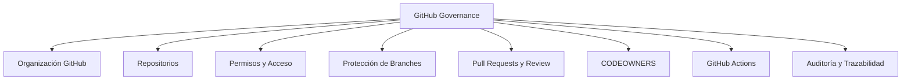

La implementación concreta de cada elemento deberá especificarse en las secciones normativas correspondientes de este documento.

---

## 05. Gobernanza Organizacional

### 05.1. Organización GitHub

El Engineering Ecosystem deberá estar administrado mediante una **organización GitHub institucional**, separando la administración del ecosistema de cuentas personales individuales.

La organización GitHub constituye la unidad administrativa superior para los repositorios, equipos, permisos y mecanismos de colaboración sujetos a esta política.

**Nombre de la organización GitHub:** Pendiente de definición.

La identificación concreta de la organización deberá registrarse en la configuración oficial de GitHub y en la documentación técnica de implementación correspondiente (`EE-IMP-007-P01` / `EE-IMP-007-P02`), una vez que la organización haya sido formalmente establecida.

Este documento **no fija** el nombre de la organización ni los identificadores de equipos. Dichos valores son materia de implementación y no forman parte de la especificación normativa, conforme al principio de no incorporar nombres personales ni identificadores operativos en documentos de gobernanza.

---

### 05.2. Repositorio Principal

El Engineering Ecosystem utiliza un modelo **Monorepo** como estrategia principal de organización del código fuente.

El repositorio principal del ecosistema es:

```text
ee-monorepo
```

Este repositorio contiene la implementación del Engineering Ecosystem y constituye la unidad principal de control de versiones, colaboración y automatización.

La estructura interna del repositorio se encuentra definida normativamente en:

- **EE-DOC-006 — Repository Structure**

La existencia de un único repositorio principal no impide que puedan existir repositorios adicionales en el futuro cuando exista una necesidad arquitectónica, organizacional o técnica formalmente justificada.

---

### 05.3. Modelo de Repositorios

El modelo vigente para el Engineering Ecosystem es:

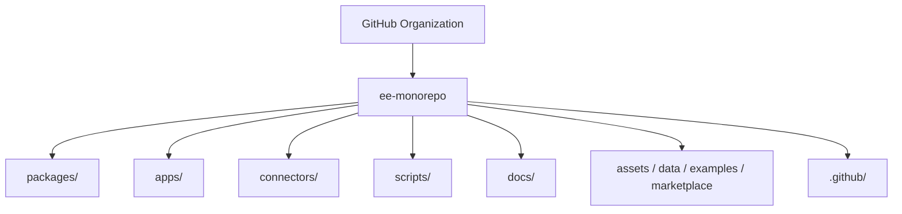

El repositorio `ee-monorepo` constituye la unidad principal de integración del código, documentación técnica, configuración, automatización y estructuras de soporte del Engineering Ecosystem.

La creación de repositorios adicionales deberá estar respaldada por una necesidad documentada y no deberá fragmentar arbitrariamente componentes que pertenecen al modelo Monorepo vigente.

Cuando la justificación de un repositorio adicional implique una decisión arquitectónica o un cambio transversal, deberá gestionarse conforme al mecanismo de cambio gobernado de **EE-DOC-005** (ADR o RFC, según corresponda).

---

### 05.4. Convenciones de Nombres de Repositorios

Los repositorios administrados por el Engineering Ecosystem deberán utilizar la convención:

```text
kebab-case
```

Ejemplo:

```text
eq-labs-platform
```

La convención se deriva del estándar de nomenclatura definido por **EE-DOC-002 — Document Design Template**.

Para el repositorio principal vigente se establece:

```text
ee-monorepo
```

Cualquier cambio posterior del nombre deberá gestionarse mediante el mecanismo de cambio gobernado correspondiente.

---

### 05.5. Administración y Responsabilidad

La gobernanza normativa del Engineering Ecosystem corresponde al **Equipo de Arquitectura**.

La administración operativa de GitHub deberá separar:

| Responsabilidad                    | Autoridad / Mecanismo             |
| :--------------------------------- | :-------------------------------- |
| Definición de políticas            | Equipo de Arquitectura            |
| Aprobación de cambios normativos   | Equipo de Arquitectura            |
| Administración operativa de GitHub | Roles administrativos autorizados |
| Desarrollo                         | Contributors autorizados          |
| Validación automatizada            | GitHub Actions / Quality Gates    |
| Control de cambios                 | Pull Request + Code Review        |

La asignación de usuarios individuales, equipos concretos y permisos específicos se definirá en las secciones correspondientes de este documento y no deberá establecerse mediante nombres personales dentro de la norma.

---

### 05.6. Principio de Separación de Responsabilidades

GitHub Governance deberá mantener separadas las siguientes responsabilidades:

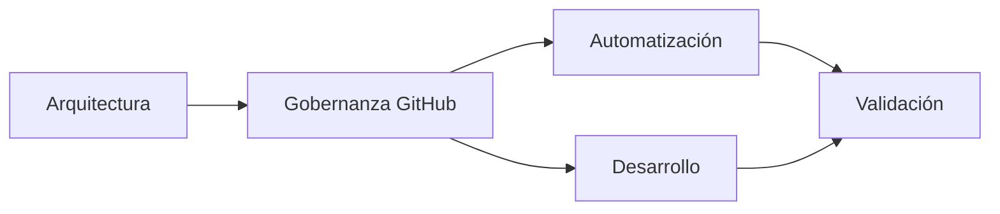

La gobernanza de GitHub no sustituye al **Development Workflow** definido en **EE-DOC-005**, sino que proporciona los mecanismos de plataforma necesarios para materializarlo.

El flujo humano de desarrollo continúa definido por:

```text
Branch
  ↓
Development
  ↓
Commit
  ↓
Push
  ↓
Pull Request
  ↓
Code Review
  ↓
Quality Gates
  ↓
Merge
```

---

### 05.7. Estado de Definiciones Organizacionales

| Definición                          | Estado                                    |
| :---------------------------------- | :---------------------------------------- |
| Modelo Monorepo                     | **Definido**                              |
| Repositorio principal `ee-monorepo` | **Definido**                              |
| Directorio `.github/`               | **Definido**                              |
| Organización GitHub concreta        | **Pendiente de implementación (P01/P02)** |
| Equipos GitHub                      | **Pendiente de implementación (P02)**     |
| Roles administrativos concretos     | **Pendiente de implementación (P02)**     |
| Repositorios adicionales            | **Pendiente de necesidad / definición**   |
| Política detallada de permisos      | **Sección 06**                            |
| Protección de branches              | **Sección 07**                            |
| CODEOWNERS                          | **Sección 08**                            |
| GitHub Actions                      | **Sección 09**                            |

---

### 05.8. Límites Normativos

Esta sección no define:

- permisos individuales;
- protección específica de branches;
- reglas detalladas de Pull Requests;
- reviewers concretos;
- reglas de `CODEOWNERS`;
- workflows específicos de GitHub Actions;
- secrets;
- environments;
- Quality Gates concretos.

Estos elementos serán definidos en las secciones especializadas correspondientes de **EE-DOC-007**.

---

## 06. Modelo de Permisos y Acceso

### 06.1. Principios de Acceso

El acceso a GitHub deberá gestionarse mediante un modelo basado en responsabilidades y mínimo privilegio.

Cada identidad, equipo o automatización deberá disponer únicamente de los permisos necesarios para ejecutar sus responsabilidades dentro del Engineering Ecosystem.

El modelo deberá cumplir los siguientes principios:

| Principio                  | Regla                                                                                                            |
| :------------------------- | :--------------------------------------------------------------------------------------------------------------- |
| **Least Privilege**        | Cada identidad recibe únicamente los permisos necesarios.                                                        |
| **Separation of Duties**   | Las responsabilidades de administración, desarrollo, revisión y automatización deberán mantenerse diferenciadas. |
| **Traceability**           | Las operaciones relevantes deberán poder atribuirse a una identidad o automatización identificable.              |
| **Controlled Access**      | El acceso deberá otorgarse mediante roles o equipos autorizados.                                                 |
| **No Personal Governance** | Las reglas normativas no deberán depender de una única cuenta personal.                                          |
| **Automation Isolation**   | Las automatizaciones deberán utilizar identidades y permisos específicos para sus operaciones.                   |

---

### 06.2. Categorías de Acceso

La gobernanza de GitHub deberá distinguir, como mínimo, las siguientes categorías:

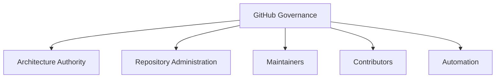

Estas categorías representan **responsabilidades funcionales**, no necesariamente nombres de equipos GitHub concretos.

La creación de los equipos concretos y su configuración técnica se definirá durante la implementación de este documento.

---

### 06.3. Architecture Authority

El **Equipo de Arquitectura** constituye la autoridad normativa del Engineering Ecosystem.

Sus responsabilidades incluyen:

- Definir y aprobar políticas arquitectónicas.
- Aprobar documentos normativos.
- Aprobar cambios que requieran autoridad arquitectónica.
- Determinar cuándo una modificación requiere un ADR o RFC conforme a EE-DOC-005.
- Supervisar el cumplimiento de la gobernanza definida por el ecosistema.

La autoridad arquitectónica **no implica automáticamente privilegios administrativos ilimitados sobre GitHub**.

Los permisos técnicos deberán asignarse de acuerdo con la función operativa realmente requerida.

---

### 06.4. Repository Administration

Los administradores del repositorio serán responsables de ejecutar las operaciones administrativas necesarias para mantener la configuración de GitHub conforme a las políticas aprobadas.

Entre sus responsabilidades podrán incluirse:

- Administración de configuración del repositorio.
- Administración de equipos y permisos.
- Configuración de reglas de protección.
- Administración de GitHub Actions.
- Configuración de mecanismos de seguridad.
- Gestión de integraciones autorizadas.
- Administración de configuraciones organizacionales cuando corresponda.

La identidad concreta de los administradores deberá definirse en la configuración de GitHub y no mediante nombres personales dentro de este documento.

---

### 06.5. Maintainers

Los **Maintainers** representan el nivel operativo responsable de mantener la integridad técnica del repositorio.

Sus responsabilidades incluyen:

- Revisar cambios técnicos.
- Participar en Code Review.
- Validar que los cambios respeten la arquitectura y las convenciones vigentes.
- Supervisar la integración de cambios aprobados.
- Participar en el mantenimiento de componentes bajo su responsabilidad.

Los Maintainers no deberán recibir automáticamente permisos administrativos de organización.

Su nivel de acceso deberá corresponder a las responsabilidades técnicas asignadas.

---

### 06.6. Contributors

Los **Contributors** son los participantes autorizados para realizar cambios de desarrollo dentro del Engineering Ecosystem.

Su flujo deberá respetar el SDLC definido en EE-DOC-005:

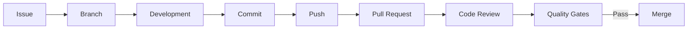

El acceso de un Contributor deberá permitir realizar el trabajo de desarrollo sin conceder privilegios innecesarios sobre la configuración administrativa del repositorio.

EE-DOC-005 establece que el Pull Request constituye la solicitud de fusión hacia la rama principal y que Code Review y Quality Gates forman parte del control previo al Merge.

---

### 06.7. Automation

Las automatizaciones deberán considerarse identidades operativas independientes.

GitHub Actions y otras automatizaciones autorizadas deberán utilizar únicamente los permisos necesarios para ejecutar su función.

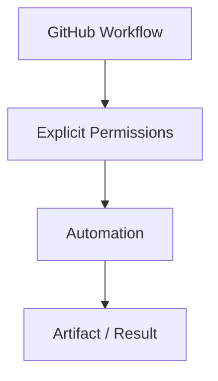

Una automatización no deberá utilizar permisos administrativos generales cuando pueda ejecutar la misma operación mediante permisos restringidos.

La definición detallada de los workflows, eventos, permisos de Actions y mecanismos de secretos corresponde a la **Sección 09 — GitHub Actions y Automatizaciones**.

---

### 06.8. Matriz Inicial de Responsabilidades

La siguiente matriz establece el modelo conceptual inicial:

| Capacidad                        | Architecture Authority | Repository Administration | Maintainers | Contributors | Automation |
| :------------------------------- | :--------------------: | :-----------------------: | :---------: | :----------: | :--------: |
| Definir política arquitectónica  |         **R**          |             —             |      —      |      —       |     —      |
| Aprobar cambio normativo         |         **A**          |             —             |      —      |      —       |     —      |
| Administrar configuración GitHub |           —            |          **R/A**          |      —      |      —       |     —      |
| Administrar equipos/permisos     |           —            |          **R/A**          |      —      |      —       |     —      |
| Crear branch de desarrollo       |           —            |             —             |    **R**    |    **R**     |     —      |
| Realizar commits                 |           —            |             —             |    **R**    |    **R**     |  **R\***   |
| Crear Pull Request               |           —            |             —             |    **R**    |    **R**     |  **R\***   |
| Realizar Code Review             |        **A\***         |             —             |    **R**    |      —       |     —      |
| Ejecutar Quality Gates           |           —            |             —             |      —      |      —       |   **R**    |
| Integrar cambios                 |        **A\***         |          **A\***          |    **R**    |      —       |  **R\***   |

**Leyenda:**

- **R — Responsible:** ejecuta la actividad.
- **A — Accountable:** posee la responsabilidad final.
- `*` — sujeto a las reglas específicas que se definan en las secciones posteriores.

Esta matriz es conceptual y no constituye todavía una asignación de permisos técnicos de GitHub.

**Reglas de interpretación:**

1. La asignación de reviewers concretos se materializa mediante `CODEOWNERS` (Sección 08) y la configuración de protección de ramas (Sección 07); no se deriva únicamente de esta matriz.
2. La capacidad **Integrar cambios** no autoriza el merge a ramas protegidas sin cumplir Pull Request, Code Review, approvals requeridos y Quality Gates. Ningún rol, incluido Repository Administration, puede omitir esos controles en el flujo normal.
3. Architecture Authority es **Accountable** de la integridad normativa del review; Maintainers son **Responsible** de ejecutar la revisión técnica según ownership.
4. **Accountable** y **Responsible** en esta matriz son roles de gobernanza conceptual. **No equivalen** a roles técnicos de GitHub (Owner, Admin, Maintain, Write, Triage, Read). Los permisos técnicos de la plataforma se asignan durante la implementación (`EE-IMP-007-P02`) conforme al principio de mínimo privilegio y no se derivan automáticamente de esta matriz.

---

### 06.9. Equipos de GitHub

La gobernanza deberá favorecer la asignación de permisos mediante **equipos** en lugar de conceder permisos individualmente siempre que GitHub permita aplicar dicha política.

El modelo previsto será:

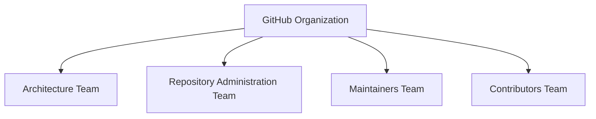

Los nombres definitivos de los equipos deberán establecerse durante la implementación de EE-DOC-007.

No se deberán introducir nombres de usuarios individuales como parte de la especificación normativa.

---

### 06.10. Administración de Accesos

El otorgamiento o modificación de accesos deberá seguir un proceso controlado:

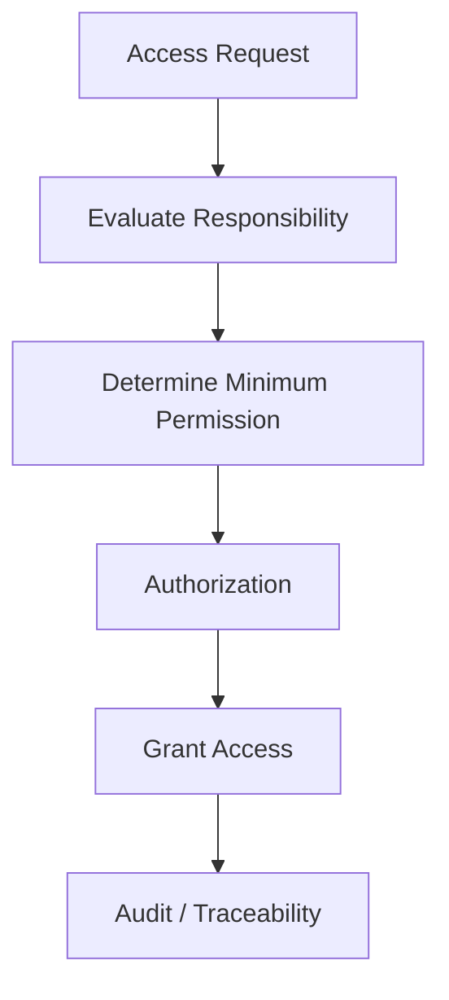

La concesión de acceso deberá estar asociada a una responsabilidad legítima dentro del Engineering Ecosystem.

El acceso deberá revisarse cuando:

- cambie la responsabilidad de una persona;
- cambie su participación en el proyecto;
- deje de requerirse el acceso;
- cambie la estructura organizacional;
- cambien las políticas de seguridad o gobernanza.

---

### 06.11. Revocación de Accesos

El acceso deberá revocarse cuando desaparezca la necesidad que justificó su otorgamiento.

La revocación deberá conservar trazabilidad suficiente para determinar:

- identidad afectada;
- permiso retirado;
- fecha de modificación;
- responsable de la modificación;
- motivo cuando corresponda.

---

### 06.12. Límites del Modelo

Esta sección establece el **modelo conceptual de acceso**, pero no define todavía:

- nombres definitivos de equipos GitHub;
- usuarios individuales;
- permisos exactos de GitHub;
- reglas de branch protection;
- reglas de aprobación de Pull Requests;
- configuración de `CODEOWNERS`;
- permisos específicos de GitHub Actions;
- Secrets;
- Environments;
- integraciones externas.

Estos elementos se definirán en las secciones especializadas de **EE-DOC-007**.

---

### 06.13. Criterio de Evolución

Cualquier modificación del modelo de permisos deberá evaluarse conforme al mecanismo de cambio gobernado definido por **EE-DOC-005**.

Una modificación que únicamente aclare o especialice la configuración existente podrá gestionarse como cambio documental o técnico.

Una modificación que introduzca una nueva decisión arquitectónica deberá evaluarse para determinar si requiere un **ADR**.

Una modificación significativa o transversal deberá evaluarse para determinar si requiere un **RFC**.

EE-DOC-005 define precisamente ADR como el registro formal de una decisión arquitectónica y RFC como la propuesta formal para cambios significativos o transversales.

---

### 06.14. Estado de Definiciones

| Definición                      | Estado                       |
| :------------------------------ | :--------------------------- |
| Principio de mínimo privilegio  | **Definido**                 |
| Separación de responsabilidades | **Definido**                 |
| Architecture Authority          | **Definido conceptualmente** |
| Repository Administration       | **Definido conceptualmente** |
| Maintainers                     | **Definido conceptualmente** |
| Contributors                    | **Definido conceptualmente** |
| Automation                      | **Definido conceptualmente** |
| Equipos GitHub concretos        | **Pendiente**                |
| Usuarios individuales           | **Pendiente**                |
| Permisos técnicos exactos       | **Pendiente**                |
| Branch protection               | **Sección 07**               |
| CODEOWNERS                      | **Sección 08**               |
| GitHub Actions                  | **Sección 09**               |

---

## 07. Protección de Branches

### 07.1. Objetivo

Las ramas protegidas constituyen el mecanismo de control de integridad del repositorio GitHub.

Esta sección establece las reglas que deberán materializarse mediante la configuración de protección de ramas de GitHub, manteniendo como fuente normativa del workflow las reglas definidas en **EE-DOC-005 — Development Workflow**.

La protección deberá impedir modificaciones directas sobre las ramas principales y exigir el flujo controlado de Pull Request, Code Review y Quality Gates antes de permitir su integración.

---

### 07.2. Estrategias de Branching Soportadas

El Engineering Ecosystem soporta las siguientes estrategias:

| Estrategia                  | Rama principal | Rama de integración |
| :-------------------------- | :------------- | :------------------ |
| **Main Only (Trunk-Based)** | `main`         | No aplica           |
| **Main + Develop**          | `main`         | `develop`           |

La estrategia concreta deberá seleccionarse durante la inicialización de cada proyecto y deberá quedar registrada mediante un **ADR aprobado**.

EE-DOC-007 no selecciona ni modifica la estrategia de branching del proyecto.

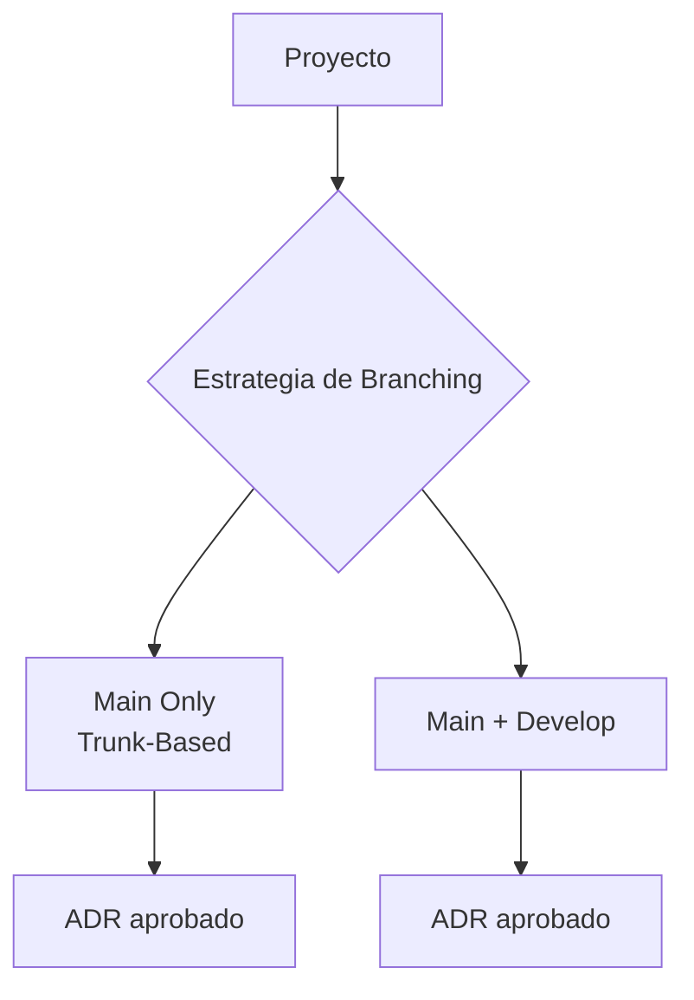

Esta regla deriva directamente de `EE-DOC-005`, que establece que el modelo de branching es una decisión del proyecto y que no debe cambiarse durante su ciclo de vida sin un ADR aprobado por el Equipo de Arquitectura.

---

### 07.3. Ramas Protegidas

Las ramas permanentes que participen en el flujo principal de integración deberán estar protegidas.

La matriz normativa es:

| Rama           | Existencia  | Protección              | Merge                                 |
| :------------- | :---------- | :---------------------- | :------------------------------------ |
| `main`         | Obligatoria | **Protegida**           | PR + Quality Gates + ≥ 1 approval     |
| `develop`      | Condicional | **Protegida**           | PR + Quality Gates + ≥ 1 approval     |
| `feature/*`    | Temporal    | Sin protección especial | PR + Quality Gates                    |
| `bugfix/*`     | Temporal    | Sin protección especial | PR + Quality Gates                    |
| `hotfix/*`     | Temporal    | Sin protección especial | PR + Quality Gates + revisión urgente |
| `release/*`    | Condicional | Sin protección especial | PR + Quality Gates                    |
| `spike/*`      | Temporal    | Sin protección especial | Según destino                         |
| `docs/*`       | Temporal    | Sin protección especial | PR + Quality Gates                    |
| `refactor/*`   | Temporal    | Sin protección especial | PR + Quality Gates                    |
| `experiment/*` | Temporal    | Sin protección especial | Según destino                         |

La clasificación y ciclo de vida de estas ramas provienen de `EE-DOC-005`.

---

### 07.4. Protección de `main`

La rama `main` deberá cumplir obligatoriamente las siguientes condiciones:

1. No se permitirá escritura directa.
2. Los cambios deberán ingresar mediante Pull Request.
3. El Pull Request deberá superar el Code Review requerido.
4. Los Quality Gates obligatorios deberán completarse satisfactoriamente.
5. Deberá existir como mínimo **1 approval** de un reviewer calificado.
6. Los cambios críticos deberán cumplir el requisito reforzado de aprobación definido en el workflow.
7. Los cambios deberán utilizar la estrategia de Merge permitida por EE-DOC-005.
8. Los conflictos deberán resolverse en la rama de origen y no directamente sobre `main`.

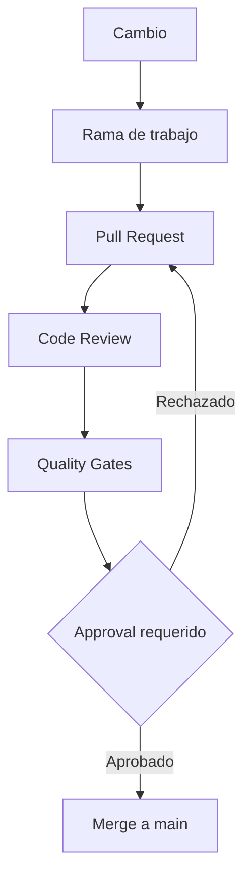

`EE-DOC-005` establece que `main` es permanente, protegida y bloqueada para escritura directa.

---

### 07.5. Protección de `develop`

Cuando un proyecto utilice la estrategia **Main + Develop**, la rama `develop` deberá recibir protección equivalente a la rama `main` en cuanto a control de integración.

Deberá cumplir:

- Sin escritura directa.
- Integración mediante Pull Request.
- Code Review.
- Quality Gates.
- Mínimo 1 approval.
- Resolución de conflictos en la rama de origen.

`develop` no deberá existir como rama normativa obligatoria para proyectos que utilicen **Main Only**.

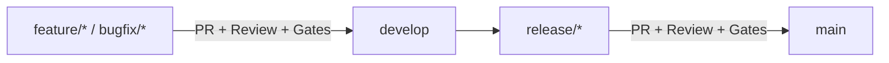

La existencia condicional de `develop` y su función como rama de integración están definidas por `EE-DOC-005`.

---

### 07.6. Escritura Directa

No se permitirá escritura directa sobre:

```text
main
develop
```

cuando `develop` forme parte de la estrategia seleccionada.

La configuración de GitHub deberá impedir, como mínimo:

- Push directo.
- Actualización directa de archivos.
- Bypass del Pull Request.
- Integración sin los controles obligatorios.

La protección técnica deberá estar aplicada en GitHub y no depender únicamente de una convención humana.

---

### 07.7. Pull Request Obligatorio

Todo cambio destinado a una rama protegida deberá ingresar mediante Pull Request.

El Pull Request deberá cumplir las reglas establecidas por `EE-DOC-005`, incluyendo:

- Referencia al Issue correspondiente.
- Descripción del cambio.
- Tipo de cambio.
- Información de testing.
- Checklist correspondiente.
- Evidencia adicional cuando aplique.

`EE-DOC-005` establece además que los PR deberán ser pequeños y enfocados y que deben incluir la referencia al Issue correspondiente.

---

### 07.8. Code Review

El Code Review será un requisito previo al Merge.

Las reglas normativas existentes establecen:

| Requisito           | Regla                               |
| :------------------ | :---------------------------------- |
| Reviewer            | Reviewer calificado                 |
| Approval estándar   | ≥ 1                                 |
| Reviewer assignment | Basado en `CODEOWNERS`              |
| Cambio crítico      | ≥ 2 approvals                       |
| Integración         | No permitida sin revisión requerida |

Estas reglas están definidas en `EE-DOC-005` y serán materializadas técnicamente mediante la configuración de GitHub y `CODEOWNERS`.

La definición concreta de los patrones de ownership pertenece a la **Sección 08 — CODEOWNERS**.

**Materialización de cambios críticos:** GitHub no clasifica de forma nativa un Pull Request como “crítico”. El requisito de ≥ 2 approvals para cambios críticos deberá materializarse mediante la combinación de:

- patrones de `CODEOWNERS` sobre áreas de alto impacto (Sección 08);
- reglas de protección de ramas / rulesets que exijan el número de approvals correspondiente;
- convenciones de etiquetado o checklist de PR alineadas con EE-DOC-005, cuando aplique.

EE-DOC-007 no redefine qué constituye un cambio crítico; esa clasificación permanece bajo el workflow y la gobernanza del ecosistema.

---

### 07.9. Quality Gates Obligatorios

Ningún cambio destinado a una rama protegida deberá integrarse mientras los Quality Gates obligatorios no hayan finalizado satisfactoriamente.

El flujo será:

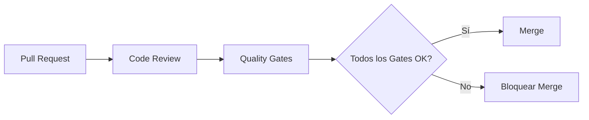

La definición detallada de los Quality Gates no pertenece a `EE-DOC-007`; será establecida por **EE-DOC-010 — Quality Gates**.

Por tanto, EE-DOC-007 establece únicamente el requisito de integración con dichos controles.

---

### 07.10. Cambios Críticos

Los cambios considerados críticos deberán utilizar un control reforzado de revisión.

`EE-DOC-005` establece que los cambios críticos requieren **al menos 2 approvals**.

La clasificación de qué constituye un cambio crítico deberá mantenerse alineada con las reglas de gobernanza del Engineering Ecosystem y **no** deberá ser redefinida arbitrariamente por una configuración de GitHub.

La materialización técnica del umbral de ≥ 2 approvals se describe en la Sección 07.8 (relación con `CODEOWNERS`, rulesets y convenciones de PR).

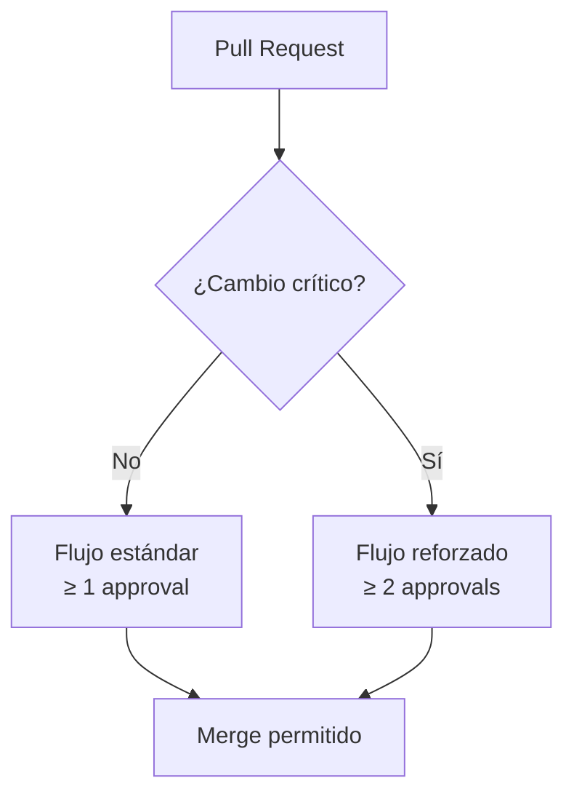

---

### 07.11. Estrategia de Merge

La estrategia de integración deberá respetar las reglas establecidas en `EE-DOC-005`.

Actualmente se define:

| Estrategia           | Estado                                          |
| :------------------- | :---------------------------------------------- |
| **Squash and Merge** | Obligatorio para `feature/*` y `bugfix/*`       |
| **Rebase and Merge** | Opcional para ramas con múltiples colaboradores |
| **Merge Commit**     | Prohibido                                       |

Estas reglas son normativas del workflow y la configuración de GitHub deberá impedir las estrategias incompatibles cuando técnicamente sea posible.

---

### 07.12. Resolución de Conflictos

Los conflictos deberán resolverse en la rama de origen del Pull Request.

No se permitirá resolver conflictos directamente sobre una rama protegida.

El flujo será:

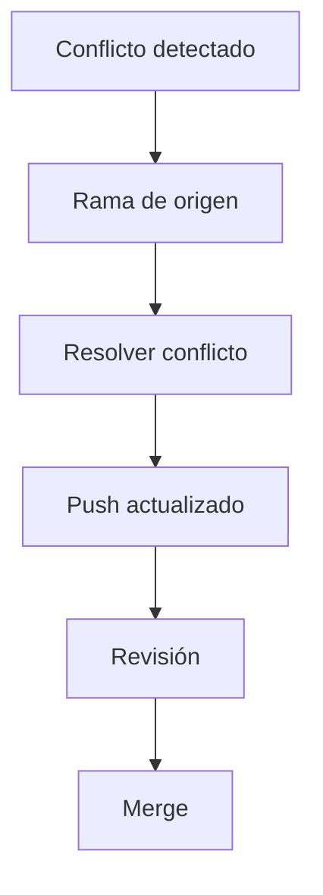

Esta regla se encuentra establecida en `EE-DOC-005`.

---

### 07.13. Protección de Ramas Temporales

Las ramas temporales no requieren protección equivalente a `main` o `develop`.

Sin embargo, deberán cumplir:

- Convención de nombres.
- Rama base correcta.
- Vida corta.
- Pull Request para integración.
- Quality Gates.
- Eliminación posterior al Merge.

`EE-DOC-005` establece que las ramas deben tener una vida máxima de 7 días sin actividad y deben eliminarse después de ser fusionadas.

---

### 07.14. Hotfix

Los `hotfix/*` constituyen un caso especial por su relación con producción.

Un hotfix deberá originarse desde `main`.

En **Main Only**, deberá integrarse nuevamente en `main` después de superar los controles mínimos establecidos.

En **Main + Develop**, deberá integrarse en `main` y posteriormente propagarse obligatoriamente hacia `develop`.

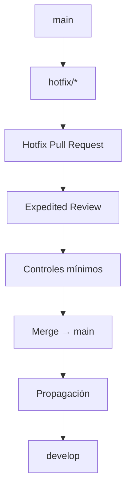

Esta regla deriva directamente del `Hotfix Workflow` definido en `EE-DOC-005`.

---

### 07.15. Reglas Técnicas de Protección

La configuración de GitHub deberá materializar, como mínimo, los siguientes controles sobre las ramas protegidas:

| Control                                      | `main` | `develop` |
| :------------------------------------------- | :----: | :-------: |
| Escritura directa bloqueada                  | **Sí** |  **Sí**   |
| Pull Request requerido                       | **Sí** |  **Sí**   |
| Approval requerido                           | **Sí** |  **Sí**   |
| ≥ 1 approval estándar                        | **Sí** |  **Sí**   |
| ≥ 2 approvals para cambios críticos          | **Sí** |  **Sí**   |
| Quality Gates requeridos                     | **Sí** |  **Sí**   |
| Integración sin gates                        | **No** |  **No**   |
| Integración directa                          | **No** |  **No**   |
| Code Review                                  | **Sí** |  **Sí**   |
| CODEOWNERS                                   | **Sí** |  **Sí**   |
| Resolución de conflictos en branch protegida | **No** |  **No**   |

La columna `develop` será aplicable únicamente cuando el proyecto haya adoptado la estrategia **Main + Develop**.

---

### 07.16. Relación con CODEOWNERS

La protección de ramas y `CODEOWNERS` deberán funcionar conjuntamente.

La protección de ramas establece **cuándo** un cambio puede integrarse.

`CODEOWNERS` establece **quién debe participar en la revisión** según el área afectada.

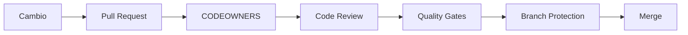

La especificación detallada de `CODEOWNERS` pertenece a la **Sección 08**.

---

### 07.17. Bypass de Protección

Las protecciones de ramas no deberán ser evitables mediante permisos administrativos ordinarios.

Cualquier mecanismo excepcional de bypass deberá:

1. estar explícitamente autorizado;
2. estar limitado a situaciones justificadas;
3. conservar trazabilidad;
4. no convertirse en el flujo normal de integración.

La definición de excepciones específicas deberá evaluarse durante la implementación técnica de GitHub.

---

### 07.18. Estado de Definiciones

| Definición                                              | Estado                          |
| :------------------------------------------------------ | :------------------------------ |
| `main` protegida                                        | **Definido**                    |
| `develop` protegida cuando exista                       | **Definido**                    |
| Escritura directa bloqueada                             | **Definido**                    |
| Pull Request obligatorio                                | **Definido**                    |
| ≥ 1 approval estándar                                   | **Definido**                    |
| ≥ 2 approvals para cambios críticos                     | **Definido**                    |
| Quality Gates obligatorios                              | **Definido**                    |
| CODEOWNERS integrado con revisión                       | **Definido**                    |
| Merge Commit prohibido                                  | **Definido**                    |
| Squash para `feature/*` y `bugfix/*`                    | **Definido**                    |
| Reglas concretas de GitHub Rulesets / Branch Protection | **Pendiente de implementación** |
| Configuración exacta de bypass                          | **Pendiente**                   |
| Identidades con bypass autorizado                       | **Pendiente**                   |
| Patrones concretos de CODEOWNERS                        | **Sección 08**                  |
| Quality Gates concretos                                 | **EE-DOC-010**                  |

---

## 08. CODEOWNERS

### 08.1. Propósito

`CODEOWNERS` define los responsables de revisión asociados a las distintas áreas del repositorio.

Su función dentro del Engineering Ecosystem es establecer una relación explícita entre:

- una ruta o área del repositorio;
- el equipo responsable de dicha área;
- los reviewers que deberán participar en el Code Review;
- las reglas de protección de ramas que condicionan el Merge.

`CODEOWNERS` no sustituye las reglas de Branch Protection ni los Quality Gates.

La relación normativa es:

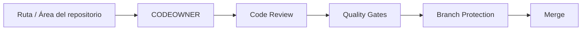

---

### 08.2. Ubicación

El archivo normativo de ownership deberá ubicarse en:

```text
ee-monorepo/
└── .github/
    └── CODEOWNERS
```

Esta ubicación forma parte de la estructura normativa establecida por **EE-DOC-006 — Repository Structure**.

El archivo deberá mantenerse versionado junto con el repositorio.

---

### 08.3. Principios de Ownership

El modelo de `CODEOWNERS` deberá cumplir los siguientes principios:

| Principio                       | Regla                                                                                       |
| :------------------------------ | :------------------------------------------------------------------------------------------ |
| **Explicit Ownership**          | Cada área gobernada deberá tener un responsable identificable.                              |
| **Domain Ownership**            | El ownership deberá asignarse por responsabilidad técnica y no arbitrariamente por persona. |
| **Least Privilege**             | Un equipo deberá ser owner únicamente de las áreas que realmente administra.                |
| **Automatic Review Assignment** | GitHub deberá utilizar `CODEOWNERS` para determinar reviewers aplicables.                   |
| **Traceability**                | Las revisiones deberán quedar registradas en el Pull Request.                               |
| **Separation of Concerns**      | Ownership no implica automáticamente privilegios administrativos.                           |
| **Architecture Governance**     | Las áreas arquitectónicamente sensibles deberán quedar bajo ownership apropiado.            |
| **Documentation Driven**        | Los cambios relevantes de ownership deberán estar documentados.                             |

---

### 08.4. Relación con Pull Requests

Todo Pull Request que modifique una ruta cubierta por `CODEOWNERS` deberá activar el mecanismo de revisión correspondiente.

El flujo normativo será:

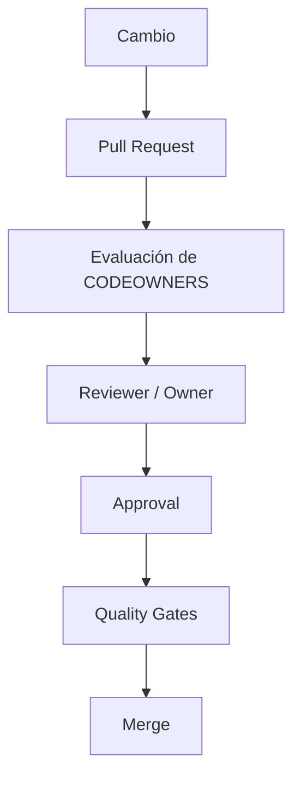

`EE-DOC-005` establece expresamente que los reviewers deberán asignarse automáticamente basándose en `CODEOWNERS`.

---

### 08.5. Ownership por Áreas del Monorepo

El ownership deberá organizarse principalmente por áreas funcionales y técnicas del repositorio.

Las áreas de primer nivel ya definidas por `EE-DOC-006` son:

```text
ee-monorepo/
├── .github/
├── packages/
├── apps/
├── connectors/
├── scripts/
├── docs/
├── assets/
├── data/
├── examples/
└── marketplace/
```

El modelo de ownership deberá poder expresar responsabilidades sobre estas áreas sin asumir que todas pertenecen necesariamente al mismo equipo.

---

### 08.6. Áreas de Gobernanza

La configuración de GitHub deberá mantener ownership explícito sobre:

```text
.github/
```

Esta área incluye la configuración utilizada para la gobernanza del repositorio, incluyendo:

```text
.github/
├── workflows/
├── CODEOWNERS
└── ...
```

El ownership de `.github/` deberá estar asociado a responsables con autoridad suficiente para revisar modificaciones que puedan afectar las políticas de GitHub Governance.

---

### 08.7. Documentación Normativa

El área:

```text
docs/
```

deberá disponer de ownership apropiado para garantizar la revisión de cambios en documentación gobernada.

La asignación concreta deberá respetar la separación entre:

- documentos normativos;
- documentos técnicos de implementación;
- documentación técnica consolidada;
- ADRs.

Cuando la documentación normativa o los ADRs residan bajo rutas específicas (por ejemplo `docs/architecture/`, `docs/adr/`), el ownership deberá mapearse a esas rutas reales de la estructura física vigente (**EE-DOC-006**), sin crear ownership ficticio sobre rutas inexistentes.

La asignación concreta de equipos a cada categoría queda pendiente de la implementación de `EE-DOC-007`.

---

### 08.8. Código del Ecosistema

Las áreas:

```text
packages/
apps/
connectors/
```

representan el núcleo de implementación del Engineering Ecosystem.

El ownership deberá establecerse de acuerdo con la responsabilidad técnica sobre cada componente.

No se deberá asignar automáticamente un único owner global a todo el código si existen dominios técnicos claramente diferenciados.

La estructura física de estas áreas está definida por `EE-DOC-006`; este documento únicamente establece el mecanismo de gobernanza de ownership sobre ellas.

---

### 08.9. Automatización y Scripts

Las áreas:

```text
scripts/
.github/workflows/
```

deberán contar con ownership explícito debido a su capacidad para modificar procesos de validación, automatización o integración.

Los cambios sobre estas áreas deberán ser revisados por los responsables correspondientes antes de su integración.

---

### 08.10. Datos, Ejemplos y Marketplace

Las áreas:

```text
data/
examples/
marketplace/
```

deberán poder disponer de ownership independiente cuando sus responsabilidades técnicas sean diferentes de las del núcleo del ecosistema.

La asignación concreta de owners deberá basarse en la responsabilidad efectiva de cada área.

No se deberá crear ownership ficticio únicamente para completar el archivo `CODEOWNERS`.

---

### 08.11. Arquitectura

Los cambios que afecten directamente a documentación o artefactos de carácter arquitectónico deberán disponer de una ruta de revisión que permita la participación del **Equipo de Arquitectura** cuando corresponda.

Esto incluye, como mínimo:

```text
docs/architecture/
docs/adr/
```

El ownership de estas áreas representa una responsabilidad de revisión y **no debe interpretarse automáticamente como permiso administrativo de GitHub**.

Esta separación es consistente con la distinción establecida en la Sección 06 entre autoridad arquitectónica y permisos técnicos.

---

### 08.12. Cambios Críticos

`CODEOWNERS` deberá participar en el mecanismo reforzado de revisión para cambios críticos.

`EE-DOC-005` establece:

- mínimo **1 approval** para cambios normales;
- mínimo **2 approvals** para cambios críticos.

Por tanto:

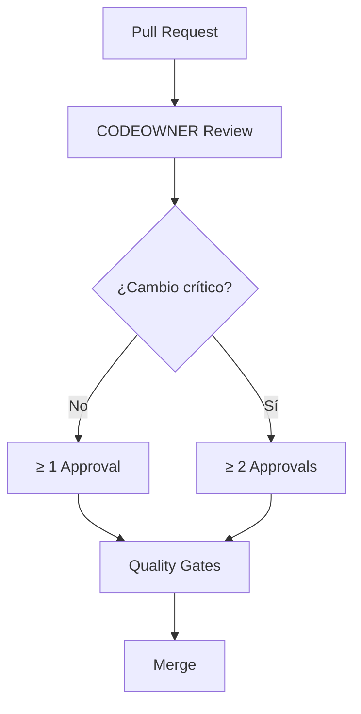

`CODEOWNERS` determina los reviewers aplicables; la Branch Protection determina la condición mínima de aprobación requerida antes del Merge.

---

### 08.13. CODEOWNERS y Branch Protection

`CODEOWNERS` y Branch Protection deberán configurarse como mecanismos complementarios.

| Mecanismo             | Responsabilidad                                                        |
| :-------------------- | :--------------------------------------------------------------------- |
| **CODEOWNERS**        | Determina quién debe revisar un área determinada.                      |
| **Pull Request**      | Proporciona el mecanismo formal de revisión.                           |
| **Branch Protection** | Impide la integración cuando no se cumplen las condiciones requeridas. |
| **Quality Gates**     | Valida automáticamente calidad y seguridad.                            |

La arquitectura resultante será:

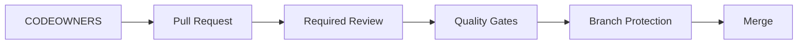

Ninguno de estos mecanismos deberá utilizarse como sustituto de los otros.

---

### 08.14. Cambios al Archivo CODEOWNERS

Las modificaciones de `.github/CODEOWNERS` deberán realizarse mediante Pull Request.

Los cambios deberán quedar sujetos a:

1. Code Review.
2. Ownership correspondiente.
3. Quality Gates.
4. Branch Protection.
5. Registro histórico mediante Git.

El archivo `CODEOWNERS` no deberá modificarse directamente sobre una rama protegida.

---

### 08.15. Ownership de CODEOWNERS

El propio archivo:

```text
.github/CODEOWNERS
```

deberá estar sujeto a ownership explícito.

Esto evita que una modificación del sistema de ownership pueda realizarse sin revisión de los responsables de gobernanza correspondientes.

La configuración concreta del owner deberá definirse durante la implementación.

---

### 08.16. Equipos vs. Usuarios

El modelo normativo deberá favorecer el ownership mediante **equipos GitHub**.

La forma conceptual será:

```text
@organization/architecture
@organization/maintainers
@organization/developers
```

Los identificadores anteriores son únicamente representativos del modelo y **no constituyen nombres oficiales de equipos**.

Los nombres definitivos deberán establecerse durante la implementación de `EE-DOC-007`.

No se deberán introducir usuarios personales directamente en la norma salvo que exista una necesidad explícita y documentada.

---

### 08.17. Reglas de Granularidad

El ownership deberá ser suficientemente específico para garantizar revisión adecuada, pero no deberá fragmentarse innecesariamente.

Se evitarán:

- reglas duplicadas;
- ownership contradictorio;
- ownership sin responsable real;
- asignaciones excesivamente amplias;
- reglas específicas que contradigan ownership superior;
- owners utilizados únicamente para obtener permisos administrativos.

La granularidad deberá seguir la responsabilidad técnica real de los componentes.

---

### 08.18. Reglas de Herencia

Cuando un área superior tenga un owner definido y un subdirectorio requiera una responsabilidad diferente, deberá utilizarse una regla específica para el subdirectorio.

Conceptualmente:

```text
packages/
├── domain-a/      → Team A
├── domain-b/      → Team B
└── shared/        → Architecture / Shared Maintainers
```

La existencia de reglas específicas deberá estar justificada por una diferencia real de responsabilidad.

---

### 08.19. Validación de CODEOWNERS

La implementación deberá validar que:

- el archivo `CODEOWNERS` existe;
- sus patrones sean válidos;
- los owners referenciados existan;
- no existan reglas contradictorias;
- las áreas críticas dispongan de ownership;
- el archivo pueda ser interpretado correctamente por GitHub.

La automatización concreta de estas validaciones pertenece a la implementación de GitHub Governance y a los Quality Gates correspondientes.

---

### 08.20. Estado de Definiciones

| Definición                                        | Estado                          |
| :------------------------------------------------ | :------------------------------ |
| Ubicación `.github/CODEOWNERS`                    | **Definido**                    |
| Ownership mediante equipos                        | **Definido**                    |
| Review automático mediante CODEOWNERS             | **Definido**                    |
| Integración con Pull Requests                     | **Definido**                    |
| Integración con Branch Protection                 | **Definido**                    |
| ≥ 1 approval estándar                             | **Definido**                    |
| ≥ 2 approvals para cambios críticos               | **Definido**                    |
| Ownership de `.github/`                           | **Definido conceptualmente**    |
| Ownership de `docs/architecture/`                 | **Definido conceptualmente**    |
| Ownership de `docs/adr/`                          | **Definido conceptualmente**    |
| Ownership de `packages/`, `apps/`, `connectors/`  | **Definido conceptualmente**    |
| Ownership de `scripts/`                           | **Definido conceptualmente**    |
| Ownership de `data/`, `examples/`, `marketplace/` | **Definido conceptualmente**    |
| Nombres definitivos de equipos                    | **Pendiente de implementación** |
| Usuarios concretos                                | **Pendiente de implementación** |
| Patrones finales del archivo                      | **Pendiente de implementación** |
| Validación automatizada del archivo               | **Pendiente de implementación** |

---

## 09. GitHub Actions y Automatizaciones

Esta sección define la gobernanza normativa de las automatizaciones ejecutadas mediante **GitHub Actions** dentro del Engineering Ecosystem.

La implementación física de los workflows deberá ubicarse bajo:

```text
ee-monorepo/
└── .github/
    └── workflows/
```

GitHub Actions constituye el mecanismo de automatización de plataforma utilizado para ejecutar controles, validaciones y procesos asociados al repositorio.

Esta sección **no redefine el Development Workflow** establecido por **EE-DOC-005 — Development Workflow** ni define los Quality Gates concretos que corresponden a **EE-DOC-010 — Quality Gates**.

Su responsabilidad es establecer cómo deberán gobernarse, organizarse, ejecutarse y protegerse las automatizaciones de **plataforma GitHub** (GitHub Actions bajo `.github/workflows/`).

**Frontera con EE-DOC-011 — Automation:** EE-DOC-007 gobierna únicamente la automatización ejecutada mediante GitHub Actions en el repositorio. La automatización de producto del ecosistema (CLI, generadores, scripts de orquestación de negocio y procesos internos no basados en GitHub Actions) corresponde a **EE-DOC-011 — Automation** y no deberá definirse ni duplicarse en esta sección.

---

### 09.1. Principios de Automatización

Las automatizaciones deberán cumplir como mínimo los siguientes principios:

| Principio                  | Regla                                                                                                                            |
| :------------------------- | :------------------------------------------------------------------------------------------------------------------------------- |
| **Reproducibility**        | Una misma entrada y configuración deberá producir resultados deterministas siempre que la naturaleza de la operación lo permita. |
| **Traceability**           | Toda ejecución deberá poder asociarse a un evento, commit, Pull Request, branch o ejecución identificable.                       |
| **Versioning**             | Los workflows deberán estar versionados junto con el repositorio.                                                                |
| **Least Privilege**        | Cada workflow deberá utilizar únicamente los permisos necesarios para ejecutar su responsabilidad.                               |
| **Separation of Concerns** | Cada workflow deberá mantener una responsabilidad claramente delimitada.                                                         |
| **Automation Isolation**   | Las automatizaciones deberán operar con identidades, permisos y credenciales controladas.                                        |
| **Fail Safe**              | Ante un fallo de una validación obligatoria, el mecanismo deberá impedir la integración cuando corresponda.                      |
| **Auditability**           | Las ejecuciones y resultados relevantes deberán conservar trazabilidad suficiente para su revisión.                              |
| **Documentation Driven**   | Las automatizaciones normativas deberán estar respaldadas por documentación correspondiente.                                     |
| **No Manual Bypass**       | Ningún control automatizado obligatorio deberá depender de una excepción manual no gobernada.                                    |

---

### 09.2. Workflows

Los workflows deberán representar unidades de automatización con responsabilidades claramente delimitadas.

La estructura normativa será:

```text
.github/
└── workflows/
    ├── <workflow>.yml
    ├── <workflow>.yaml
    └── ...
```

No se establece un nombre concreto de workflow en esta sección mientras su responsabilidad específica no haya sido formalmente definida.

Los workflows deberán:

1. Tener una responsabilidad principal identificable.
2. Mantener configuración versionada dentro del repositorio.
3. Evitar duplicación innecesaria de lógica.
4. Utilizar mecanismos reutilizables cuando exista una necesidad real de compartir comportamiento.
5. Separar las responsabilidades de validación, seguridad, documentación, publicación o automatización que tengan ciclos de ejecución diferentes.
6. Exponer resultados suficientemente claros para permitir diagnóstico de fallos.
7. Integrarse con los mecanismos de Branch Protection y Pull Request cuando su resultado constituya una condición de integración.

El modelo conceptual será:

```mermaid
flowchart TD
    Repository["Repository Change"]

    Workflow["GitHub Actions Workflow"]

    Validation["Validation"]
    Security["Security"]
    Documentation["Documentation"]
    Automation["Repository Automation"]

    Result["Execution Result"]

    Repository --> Workflow

    Workflow --> Validation
    Workflow --> Security
    Workflow --> Documentation
    Workflow --> Automation

    Validation --> Result
    Security --> Result
    Documentation --> Result
    Automation --> Result
```

La existencia de múltiples workflows no deberá utilizarse para fragmentar artificialmente una única responsabilidad.

---

### 09.3. Categorías de Automatización

Las automatizaciones podrán organizarse conceptualmente en las siguientes categorías:

| Categoría                    | Responsabilidad                                                                          |
| :--------------------------- | :--------------------------------------------------------------------------------------- |
| **Continuous Integration**   | Ejecutar validaciones asociadas a cambios de código y Pull Requests.                     |
| **Repository Validation**    | Validar estructura, configuración y convenciones del repositorio.                        |
| **Security Automation**      | Ejecutar controles automatizados relacionados con seguridad.                             |
| **Documentation Automation** | Ejecutar controles o procesos relacionados con documentación.                            |
| **Governance Automation**    | Validar o aplicar mecanismos de gobernanza del repositorio.                              |
| **Release Automation**       | Automatizar procesos asociados a releases cuando éstos sean definidos por el ecosistema. |
| **Maintenance Automation**   | Ejecutar tareas de mantenimiento controladas del repositorio.                            |

Estas categorías no implican que cada una deba tener un workflow independiente.

La decisión de consolidar o separar workflows deberá basarse en:

- responsabilidad;
- ciclo de ejecución;
- permisos requeridos;
- criticidad;
- trazabilidad;
- reutilización;
- aislamiento de credenciales.

La definición detallada de los controles que pertenezcan a **Quality Gates** corresponde a **EE-DOC-010**.

---

### 09.4. Eventos de Ejecución

Los workflows deberán ejecutarse únicamente ante eventos explícitamente definidos.

Los eventos deberán seleccionarse de acuerdo con la responsabilidad del workflow.

Como modelo normativo, podrán utilizarse eventos asociados a:

```text
push
pull_request
pull_request_target
workflow_dispatch
schedule
release
workflow_call
```

No todos los workflows deberán utilizar todos estos eventos.

La selección del evento deberá considerar especialmente:

1. Seguridad.
2. Contexto disponible durante la ejecución.
3. Permisos requeridos.
4. Exposición de información sensible.
5. Necesidad de ejecución automática o manual.
6. Necesidad de ejecución sobre Pull Requests.
7. Necesidad de reutilización entre workflows.

El uso de eventos con privilegios elevados deberá estar sujeto a revisión específica.

**Evento `pull_request_target`:** este evento puede ejecutarse con permisos elevados y acceso al contexto del repositorio base. Su uso deberá restringirse a casos justificados, evaluarse bajo criterios de seguridad y no emplearse como sustituto genérico de `pull_request` cuando este último sea suficiente.

#### 09.4.1. Pull Requests

Los workflows destinados a validar cambios antes de integración deberán poder integrarse con el ciclo de Pull Request definido por **EE-DOC-005**.

La relación normativa será:

```mermaid
flowchart LR
    Push["Push / Branch Update"]
    PR["Pull Request"]
    Actions["GitHub Actions"]
    Result["Validation Result"]
    Review["Code Review"]
    Gates["Quality Gates"]
    Merge["Merge"]

    Push --> PR
    PR --> Actions
    Actions --> Result
    Result --> Review
    Review --> Gates
    Gates --> Merge
```

GitHub Actions no sustituye el Code Review.

Su función es proporcionar automatización y evidencia para los controles que correspondan.

---

### 09.5. Ejecución Manual

Los workflows que requieran ejecución manual podrán utilizar mecanismos explícitos de disparo manual.

La ejecución manual deberá:

- estar justificada por la responsabilidad del workflow;
- mantener trazabilidad de quién inició la ejecución;
- utilizar los mismos controles de seguridad aplicables a la ejecución automática;
- no constituir un mecanismo para omitir controles obligatorios;
- registrar el resultado de la ejecución.

La ejecución manual no deberá utilizarse como mecanismo general para reemplazar validaciones automáticas obligatorias.

---

### 09.6. Permisos de Workflows

Todo workflow deberá declarar permisos explícitos de acuerdo con las capacidades que realmente necesite.

El modelo normativo será:

```mermaid
flowchart TD
    Workflow["Workflow"]

    Evaluate["Evaluate Required Operations"]
    Permission["Minimum Required Permissions"]
    Execute["Execute"]
    Result["Result"]

    Workflow --> Evaluate
    Evaluate --> Permission
    Permission --> Execute
    Execute --> Result
```

Los permisos deberán seguir el principio de **Least Privilege** establecido en la Sección 06.

Como regla general:

- los permisos no requeridos deberán permanecer deshabilitados;
- un workflow de solo lectura no deberá disponer de permisos de escritura;
- los permisos de escritura deberán estar justificados por la responsabilidad del workflow;
- los permisos administrativos no deberán concederse a workflows salvo necesidad técnica explícita y documentada;
- un workflow no deberá utilizar permisos superiores únicamente por conveniencia de implementación.

La configuración concreta de permisos de cada workflow pertenece a su implementación y deberá poder ser auditada.

---

### 09.7. Separación de Permisos entre Workflows

Los workflows deberán mantener aislamiento cuando sus responsabilidades o niveles de privilegio sean diferentes.

Por ejemplo:

```text
Workflow A
└── Read-only validation

Workflow B
└── Security validation

Workflow C
└── Repository write operation
```

El Workflow C no deberá heredar automáticamente los permisos del Workflow A o B.

Cada workflow deberá declarar sus propios requisitos.

La reutilización de workflows no deberá provocar una elevación implícita de privilegios.

---

### 09.8. Secrets

Las credenciales sensibles no deberán almacenarse directamente dentro de los archivos de workflow.

No deberán incluirse en:

```text
.github/workflows/*.yml
.github/workflows/*.yaml
```

ni en código fuente, documentación o archivos de configuración versionados cuando constituyan información secreta.

Los secrets deberán administrarse mediante los mecanismos seguros proporcionados por GitHub.

El acceso a un secret deberá limitarse al workflow que realmente lo requiera.

Los secrets deberán cumplir:

- mínimo privilegio;
- alcance controlado;
- trazabilidad;
- rotación cuando corresponda;
- ausencia de exposición innecesaria;
- no reutilización indiscriminada entre workflows.

---

### 09.9. Variables de Configuración

Las variables no sensibles podrán utilizar mecanismos de configuración apropiados de GitHub.

La configuración deberá distinguir claramente entre:

| Tipo                                        | Tratamiento                                                                     |
| :------------------------------------------ | :------------------------------------------------------------------------------ |
| **Configuración no sensible**               | Puede mantenerse como variable de configuración gobernada.                      |
| **Credencial / Token / Secret**             | Debe mantenerse mediante mecanismo seguro de secrets.                           |
| **Valor derivable**                         | Preferentemente deberá calcularse durante la ejecución cuando sea determinista. |
| **Configuración específica de Environment** | Deberá asociarse al environment correspondiente.                                |

No deberá utilizarse un secret para información que no sea sensible únicamente por conveniencia.

---

### 09.10. Environments

Los **GitHub Environments** deberán utilizarse cuando un proceso requiera separación explícita de contexto, controles adicionales o credenciales específicas de un entorno.

Los environments podrán establecer controles como:

- variables específicas;
- secrets específicos;
- restricciones de despliegue;
- aprobaciones requeridas;
- protección adicional para operaciones sensibles.

La existencia de un environment deberá responder a una necesidad real del proceso.

No se deberán crear environments únicamente por simetría nominal.

La definición de los entornos de infraestructura pertenece a **EE-DOC-009 — Infrastructure**; esta sección únicamente establece cómo GitHub Governance deberá controlar su utilización cuando corresponda.

---

### 09.11. Integración con Branch Protection

Los workflows cuyos resultados sean necesarios para integrar cambios deberán poder utilizarse como condiciones de protección de las ramas correspondientes.

La relación será:

```mermaid
flowchart LR
    PR["Pull Request"]
    Workflow["GitHub Actions"]
    Result{"Required Check OK?"}
    Protection["Branch Protection"]
    Merge["Merge"]

    PR --> Workflow
    Workflow --> Result
    Result -->|Sí| Protection
    Result -->|No| Block["Block Merge"]

    Protection --> Merge
```

La Branch Protection continúa siendo responsabilidad de la Sección 07.

GitHub Actions proporciona los resultados automatizados que podrán ser utilizados por dicha protección.

La definición de **qué checks constituyen Quality Gates obligatorios** corresponde a **EE-DOC-010**.

---

### 09.12. Integración con CODEOWNERS

Los workflows que modifiquen o validen mecanismos de gobernanza deberán respetar el ownership establecido mediante `CODEOWNERS`.

En particular, los cambios sobre:

```text
.github/
.github/workflows/
.github/CODEOWNERS
```

deberán quedar sujetos a los mecanismos de ownership y revisión correspondientes.

La relación será:

```mermaid
flowchart TD
    Change["Change in .github/"]
    CODEOWNERS["CODEOWNERS"]
    Review["Required Review"]
    Actions["GitHub Actions"]
    Gates["Quality Gates"]
    Protection["Branch Protection"]
    Merge["Merge"]

    Change --> CODEOWNERS
    CODEOWNERS --> Review
    Review --> Actions
    Actions --> Gates
    Gates --> Protection
    Protection --> Merge
```

La asignación concreta de owners continúa gobernada por la **Sección 08 — CODEOWNERS**.

---

### 09.13. Integridad de los Workflows

Los archivos de GitHub Actions forman parte de la superficie de gobernanza del repositorio.

Por tanto:

- deberán estar versionados;
- deberán estar sujetos a `CODEOWNERS`;
- deberán modificarse mediante Pull Request;
- deberán pasar los controles aplicables;
- no deberán permitir bypass de las políticas de gobernanza;
- deberán conservar historial mediante Git.

Una modificación de un workflow con capacidad de alterar permisos, seguridad, validaciones o integración deberá considerarse una modificación de alta sensibilidad dentro de la gobernanza del repositorio.

---

### 09.14. Dependencias y Actions Externas

Las Actions externas utilizadas por los workflows deberán seleccionarse de forma controlada.

Cuando se utilicen Actions de terceros, deberá evaluarse:

- procedencia;
- mantenimiento;
- permisos requeridos;
- superficie de ataque;
- necesidad real;
- estabilidad;
- compatibilidad con las políticas de seguridad del ecosistema.

Las dependencias externas no deberán incorporarse únicamente por conveniencia cuando exista una alternativa suficientemente mantenible y controlable.

La política detallada de seguridad de dependencias deberá alinearse con los Quality Gates definidos por **EE-DOC-010**.

---

### 09.15. Reutilización de Workflows

Cuando exista lógica de automatización compartida entre varios workflows, podrá utilizarse un mecanismo de reutilización gobernado.

La reutilización deberá:

1. Evitar duplicación innecesaria.
2. Mantener responsabilidades claras.
3. Mantener trazabilidad.
4. No elevar privilegios implícitamente.
5. Mantener interfaces de entrada y salida claramente definidas.

La reutilización no deberá ocultar responsabilidades críticas ni dificultar la auditoría de los controles ejecutados.

---

### 09.16. Fallos de Automatización

Cuando un workflow obligatorio falle, el resultado deberá impedir la integración cuando dicho workflow constituya una condición requerida por Branch Protection.

El comportamiento normativo será:

```mermaid
flowchart TD
    Execute["Execute Workflow"]
    Result{"Execution Result"}

    Success["Success"]
    Failure["Failure"]

    Continue["Continue Validation / Integration"]
    Block["Block Integration"]
    Investigate["Investigate / Correct"]

    Execute --> Result

    Result -->|Success| Success
    Result -->|Failure| Failure

    Success --> Continue
    Failure --> Block
    Block --> Investigate
```

Los fallos deberán conservar evidencia suficiente para facilitar diagnóstico y corrección.

No deberá utilizarse un bypass manual como mecanismo ordinario para resolver fallos de automatización.

---

### 09.17. Auditoría y Trazabilidad

Las ejecuciones de GitHub Actions deberán permitir determinar, cuando corresponda:

- workflow ejecutado;
- evento que originó la ejecución;
- commit asociado;
- branch asociada;
- Pull Request asociado;
- identidad que inició la ejecución cuando aplique;
- resultado;
- fecha y hora de ejecución;
- información suficiente para investigar fallos.

Los mecanismos de auditoría detallados pertenecen a la gobernanza general de GitHub y deberán mantenerse alineados con la Sección 16.

---

### 09.18. Nomenclatura de Workflows

Los workflows deberán utilizar nombres descriptivos y consistentes con su responsabilidad.

La nomenclatura deberá evitar:

- nombres ambiguos;
- nombres genéricos sin responsabilidad identificable;
- duplicación semántica;
- nombres dependientes de una implementación temporal;
- nombres que oculten operaciones privilegiadas.

La convención concreta de nombres de los archivos de workflow podrá establecerse durante la implementación, manteniendo coherencia con las convenciones documentales y de repositorio vigentes.

---

### 09.19. Cambios en GitHub Actions

Los cambios sobre GitHub Actions deberán realizarse mediante Pull Request.

Los cambios deberán quedar sujetos a:

1. `CODEOWNERS`.
2. Code Review.
3. Quality Gates aplicables.
4. Branch Protection.
5. Registro histórico mediante Git.

Cuando un cambio modifique únicamente la implementación técnica de una automatización ya gobernada, podrá gestionarse como cambio técnico.

Cuando el cambio:

- introduzca una nueva capacidad arquitectónica;
- modifique transversalmente la gobernanza;
- altere significativamente el modelo de seguridad;
- introduzca una nueva política de integración;
- cambie de forma sustancial la arquitectura de automatización;

deberá evaluarse conforme al mecanismo de cambio gobernado de **EE-DOC-005** para determinar si requiere **ADR** o **RFC**.

---

### 09.20. Límites de esta Sección

Esta sección establece la gobernanza de GitHub Actions, pero no define:

- la lista definitiva de workflows;
- los nombres definitivos de los workflows;
- los comandos concretos ejecutados por cada workflow;
- los Quality Gates específicos (pertenecen a **EE-DOC-010**);
- la arquitectura de infraestructura ni environments de infraestructura (pertenecen a **EE-DOC-009**);
- la automatización de producto del ecosistema, CLI, generadores o scripts de negocio no basados en GitHub Actions (pertenecen a **EE-DOC-011**);
- los secrets concretos;
- los usuarios individuales;
- los equipos GitHub definitivos;
- las reglas concretas de Branch Protection (Sección 07 e implementación);
- la implementación detallada de herramientas externas.

Estos elementos deberán definirse en sus respectivos documentos, fases de implementación o mecanismos de cambio gobernado.

---

### 09.21. Estado de Definiciones

| Definición                                      | Estado                          |
| :---------------------------------------------- | :------------------------------ |
| Ubicación `.github/workflows/`                  | **Definido**                    |
| GitHub Actions como mecanismo de automatización | **Definido**                    |
| Principio de reproducibilidad                   | **Definido**                    |
| Principio de trazabilidad                       | **Definido**                    |
| Versionado de workflows                         | **Definido**                    |
| Least Privilege                                 | **Definido**                    |
| Separación de responsabilidades                 | **Definido**                    |
| Integración con Pull Requests                   | **Definido**                    |
| Integración con Branch Protection               | **Definido**                    |
| Integración con CODEOWNERS                      | **Definido**                    |
| Gestión de permisos por workflow                | **Definido**                    |
| Gestión conceptual de Secrets                   | **Definido**                    |
| Gestión conceptual de Variables                 | **Definido**                    |
| Uso normativo de Environments                   | **Definido conceptualmente**    |
| Auditoría y trazabilidad                        | **Definido**                    |
| Lista definitiva de workflows                   | **Pendiente de implementación** |
| Nombres definitivos de workflows                | **Pendiente de implementación** |
| Eventos concretos por workflow                  | **Pendiente de implementación** |
| Permisos concretos por workflow                 | **Pendiente de implementación** |
| Secrets concretos                               | **Pendiente de implementación** |
| Variables concretas                             | **Pendiente de implementación** |
| Environments concretos                          | **Pendiente de implementación** |
| Required Checks concretos                       | **Pendiente / EE-DOC-010**      |
| Quality Gates concretos                         | **EE-DOC-010**                  |

---

### 09.22. Conformidad Normativa

La implementación de GitHub Actions será conforme a esta sección cuando:

1. Los workflows estén ubicados bajo `.github/workflows/`.
2. Cada workflow tenga una responsabilidad identificable.
3. Los workflows estén versionados junto con el repositorio.
4. Los permisos estén limitados al mínimo necesario.
5. Las credenciales sensibles no estén almacenadas en los archivos de workflow.
6. Los workflows aplicables estén integrados con Pull Requests y Branch Protection.
7. Los cambios sobre workflows estén sujetos a `CODEOWNERS` y Code Review.
8. Los resultados de automatización puedan utilizarse como controles de integración cuando corresponda.
9. Los Quality Gates concretos sean definidos por **EE-DOC-010** y no duplicados aquí.
10. Las decisiones que excedan la especialización técnica sean evaluadas mediante el mecanismo de cambio gobernado de **EE-DOC-005**.

---

## 10. Estructura Física de `.github/`

La configuración de **GitHub Governance** del Engineering Ecosystem deberá materializarse dentro del directorio:

```text
ee-monorepo/
└── .github/
```

La estructura física de `.github/` constituye la representación técnica de las políticas de gobernanza definidas en **EE-DOC-007 — GitHub Governance** y deberá permanecer alineada con la estructura normativa establecida por **EE-DOC-006 — Repository Structure**.

EE-DOC-006 establece `.github/` como el espacio destinado a GitHub Governance e identifica explícitamente `workflows/` y `CODEOWNERS` como elementos de dicha estructura.

---

### 10.1. Estructura Normativa Base

La estructura mínima definida para `.github/` será:

```text
.github/
├── workflows/
└── CODEOWNERS
```

Estos elementos tienen responsabilidades diferenciadas:

| Elemento             | Responsabilidad                                | Estado          |
| :------------------- | :--------------------------------------------- | :-------------- |
| `.github/`           | Raíz física de GitHub Governance               | **Obligatorio** |
| `.github/workflows/` | Workflows y automatizaciones de GitHub Actions | **Obligatorio** |
| `.github/CODEOWNERS` | Definición de ownership y reviewers            | **Obligatorio** |

La estructura mínima no deberá contener elementos adicionales únicamente por convención o simetría.

---

### 10.2. Directorio `workflows/`

El directorio:

```text
.github/workflows/
```

será el espacio normativo destinado a los workflows de **GitHub Actions**.

Su responsabilidad comprende los workflows utilizados para:

- Continuous Integration;
- Repository Validation;
- Security Automation;
- Documentation Automation;
- Governance Automation;
- Release Automation;
- Maintenance Automation.

Estas categorías ya fueron definidas en la Sección 09 y no implican que cada categoría deba disponer necesariamente de un workflow independiente.

La estructura interna será:

```text
.github/
└── workflows/
    ├── <workflow>.yml
    └── <workflow>.yaml
```

Los nombres concretos y el número definitivo de workflows permanecen sujetos a la implementación de la Sección 09.

---

### 10.3. `CODEOWNERS`

El archivo:

```text
.github/CODEOWNERS
```

será el mecanismo normativo de ownership utilizado por GitHub para asociar rutas del repositorio con responsables de revisión.

Su existencia y ubicación están establecidas por EE-DOC-006 y desarrolladas normativamente en la **Sección 08 — CODEOWNERS** de este documento.

El archivo deberá:

1. Estar versionado.
2. Modificarse mediante Pull Request.
3. Estar sujeto a su propio ownership.
4. Integrarse con el mecanismo de Code Review.
5. Mantener coherencia con la estructura física del monorepo.
6. Evitar asignaciones de ownership que no correspondan a responsabilidades reales.

La configuración concreta de los patrones y equipos permanece pendiente de implementación, conforme al estado definido en la Sección 08.

---

### 10.4. Elementos Adicionales

Podrán incorporarse elementos adicionales dentro de `.github/` cuando exista una necesidad técnica o de gobernanza que lo justifique.

Ejemplos posibles incluyen:

```text
.github/
├── workflows/
├── CODEOWNERS
├── ISSUE_TEMPLATE/
├── PULL_REQUEST_TEMPLATE.md
└── ...
```

Sin embargo, la existencia de estos elementos **no queda establecida como obligatoria por esta versión de EE-DOC-007**.

La estructura mínima normativa permanece en `workflows/` y `CODEOWNERS`. Elementos como plantillas de Issue o Pull Request, si existen en el repositorio por bootstrap u otras fases, son **compatibles** con esta norma y podrán formalizarse en la implementación sin contradecir el mínimo obligatorio.

Un elemento adicional deberá incorporarse únicamente cuando:

1. exista una responsabilidad claramente identificada;
2. su ubicación sea coherente con la arquitectura documental y de repositorio;
3. su función esté documentada;
4. no duplique una responsabilidad ya definida;
5. sea compatible con EE-DOC-005 y EE-DOC-006;
6. quede sujeto a los mecanismos de ownership correspondientes.

#### 10.4.1. Idioma de plantillas y mensajes de automatización

Las plantillas de Issue, Pull Request y cualquier mensaje emitido por automatizaciones de plataforma (GitHub Actions, bots de gobernanza u otros mecanismos configurados bajo `.github/`) constituyen **artefactos técnicos de repositorio**, no documentos normativos.

La **fuente normativa de idioma por tipo de artefacto** es **EE-DOC-002 §16.1 — Política de Idioma por Tipo de Artefacto**.  
**EE-DOC-006 §07.1** especializa dicha política para nomenclatura del monorepo; no la redefine.

Aplicación a artefactos de GitHub Governance (derivada de la Regla de Oro de EE-DOC-002: _código e interfaces en inglés; gobernanza y arquitectura en español_):

| Artefacto                                                              | Idioma obligatorio | Base normativa                                                |
| :--------------------------------------------------------------------- | :----------------- | :------------------------------------------------------------ |
| Plantillas de Issue (`ISSUE_TEMPLATE/`)                                | Inglés (`en-US`)   | EE-DOC-002 §16.1 (artefacto técnico / interfaz de plataforma) |
| Plantilla de Pull Request (`PULL_REQUEST_TEMPLATE.md` u equivalentes)  | Inglés (`en-US`)   | EE-DOC-002 §16.1                                              |
| Mensajes, comentarios y salidas de GitHub Actions / bots de plataforma | Inglés (`en-US`)   | EE-DOC-002 §16.1                                              |
| Nombres de workflows, jobs y steps                                     | Inglés (`en-US`)   | EE-DOC-002 §16.1                                              |
| Documentos de gobernanza (`EE-DOC`, `EE-IMP`, `EE-ADR`, `EE-RFC`)      | Español            | EE-DOC-002 §16.1                                              |

Esta sección **no define** una política de idioma propia. Cualquier ampliación del catálogo de artefactos (p. ej. incluir explícitamente plantillas CI en EE-DOC-002 §16.1) deberá realizarse mediante cambio gobernado sobre **EE-DOC-002**, no sobre EE-DOC-007.

---

### 10.5. Regla de No Expansión Arbitraria

No deberá utilizarse `.github/` como directorio genérico para almacenar cualquier archivo relacionado indirectamente con el proyecto.

Todo elemento incorporado deberá responder a una responsabilidad propia de la plataforma GitHub o de sus mecanismos de gobernanza.

No deberán ubicarse en `.github/`:

- código fuente del ecosistema;
- paquetes del monorepo;
- scripts generales del proyecto;
- documentación normativa general;
- datasets;
- assets generales;
- configuraciones que pertenezcan a otro ámbito arquitectónico.

La ubicación deberá seguir la separación de responsabilidades definida por EE-DOC-006.

---

### 10.6. Relación entre `.github/` y el Monorepo

La estructura deberá mantener una separación clara entre:

```mermaid
flowchart TD
    Repo["ee-monorepo"]

    Github[".github/"]
    Core["packages/"]
    Apps["apps/"]
    Connectors["connectors/"]
    Scripts["scripts/"]
    Docs["docs/"]
    Support["assets/ data/ examples/ marketplace/"]

    Repo --> Github
    Repo --> Core
    Repo --> Apps
    Repo --> Connectors
    Repo --> Scripts
    Repo --> Docs
    Repo --> Support

    Github --> Governance["GitHub Governance"]
    Governance --> Workflows["workflows/"]
    Governance --> Owners["CODEOWNERS"]
```

`.github/` no forma parte del código funcional del Engineering Ecosystem.

Representa la **capa de gobernanza y automatización de plataforma del repositorio**.

---

### 10.7. Relación con GitHub Actions

La estructura física deberá reflejar la separación entre configuración de plataforma y ejecución de automatizaciones:

```text
.github/
└── workflows/
    ├── workflow-a.yml
    ├── workflow-b.yml
    └── workflow-c.yml
```

Cada workflow deberá mantener su responsabilidad independiente y deberá cumplir las reglas establecidas en la **Sección 09 — GitHub Actions y Automatizaciones**.

La estructura física no deberá utilizarse para redefinir el comportamiento funcional de los workflows.

---

### 10.8. Relación con CODEOWNERS

La relación entre ownership y estructura física será:

```mermaid
flowchart LR
    Structure[".github/ Structure"]

    Workflows[".github/workflows/"]
    Owners[".github/CODEOWNERS"]

    Ownership["Ownership"]
    Review["Code Review"]
    Gates["Quality Gates"]
    Protection["Branch Protection"]

    Structure --> Workflows
    Structure --> Owners

    Owners --> Ownership
    Ownership --> Review
    Workflows --> Gates
    Review --> Gates
    Gates --> Protection
```

`CODEOWNERS` determina quién deberá participar en la revisión de las áreas gobernadas.

GitHub Actions proporciona automatización y resultados de validación.

Branch Protection utiliza los mecanismos correspondientes para condicionar la integración.

Esta separación mantiene las responsabilidades establecidas en las Secciones 07, 08 y 09.

---

### 10.9. Integridad Física

La estructura de `.github/` deberá mantenerse íntegra respecto de la especificación normativa.

Como mínimo deberá verificarse:

| Control              | Requisito                                          |
| :------------------- | :------------------------------------------------- |
| `.github/`           | Existe como raíz de GitHub Governance              |
| `.github/workflows/` | Existe para workflows de GitHub Actions            |
| `.github/CODEOWNERS` | Existe para ownership                              |
| Workflows            | Permanecen versionados                             |
| CODEOWNERS           | Permanece versionado                               |
| Ownership            | Cubre los elementos gobernados                     |
| Estructura           | No contiene elementos sin responsabilidad definida |

La validación automatizada de estos controles podrá ser implementada posteriormente mediante los mecanismos definidos por **EE-DOC-010 — Quality Gates**.

---

### 10.10. Evolución de la Estructura

La estructura de `.github/` podrá evolucionar conforme aumenten las capacidades de GitHub Governance.

La evolución deberá seguir:

```mermaid
flowchart TD
    Need["Necesidad identificada"]
    Analyze["Evaluación técnica"]
    Document["Documentación de responsabilidad"]
    Validate["Validación contra EE-DOC-005 / EE-DOC-006 / EE-DOC-007"]
    Implement["Implementación"]
    Review["Code Review"]
    Merge["Merge"]

    Need --> Analyze
    Analyze --> Document
    Document --> Validate
    Validate --> Implement
    Implement --> Review
    Review --> Merge
```

La incorporación de una nueva estructura física no implica automáticamente una modificación arquitectónica.

Deberá evaluarse ADR o RFC únicamente cuando el cambio introduzca una decisión arquitectónica, una modificación transversal de gobernanza o una nueva política que exceda la implementación técnica de esta estructura.

---

### 10.11. Límites de esta Sección

Esta sección define la **estructura física normativa de `.github/`**, pero no define:

- los nombres definitivos de los workflows;
- los comandos ejecutados por los workflows;
- los eventos concretos de ejecución;
- los permisos concretos de GitHub Actions;
- los secrets concretos;
- los environments concretos;
- los equipos GitHub definitivos;
- los patrones definitivos de `CODEOWNERS`;
- los Quality Gates concretos;
- las reglas detalladas de Branch Protection.

Estos elementos corresponden a las Secciones 07, 08 y 09, o a **EE-DOC-010 — Quality Gates**, según corresponda.

---

### 10.12. Estado de Definiciones

| Definición                                | Estado                                    |
| :---------------------------------------- | :---------------------------------------- |
| `.github/` como raíz de GitHub Governance | **Definido**                              |
| `.github/workflows/`                      | **Definido**                              |
| `.github/CODEOWNERS`                      | **Definido**                              |
| Workflows versionados                     | **Definido**                              |
| CODEOWNERS versionado                     | **Definido**                              |
| Ownership de `.github/`                   | **Definido conceptualmente**              |
| Estructura mínima obligatoria             | **Definido**                              |
| Elementos adicionales                     | **Permitidos bajo justificación**         |
| Idioma de plantillas y mensajes (en-US)   | **Definido**                              |
| Nombres definitivos de workflows          | **Pendiente de implementación**           |
| Patrones definitivos de CODEOWNERS        | **Pendiente de implementación**           |
| Equipos GitHub definitivos                | **Pendiente de implementación**           |
| Validación automatizada                   | **EE-DOC-010 / implementación posterior** |

---

### 10.13. Conformidad Normativa

La estructura física de `.github/` será conforme a esta sección cuando:

1. `.github/` exista como raíz de GitHub Governance.
2. `.github/workflows/` exista para alojar GitHub Actions.
3. `.github/CODEOWNERS` exista para definir ownership.
4. Los elementos estén versionados junto con el repositorio.
5. Los elementos adicionales tengan una responsabilidad documentada.
6. No se utilice `.github/` como almacenamiento genérico de artefactos del monorepo.
7. Los workflows cumplan la gobernanza definida en la Sección 09.
8. `CODEOWNERS` cumpla la gobernanza definida en la Sección 08.
9. La estructura permanezca alineada con EE-DOC-006.
10. Cualquier expansión de la estructura respete el mecanismo de cambio gobernado establecido por EE-DOC-005.
11. Las plantillas de Issue/PR y los mensajes de automatización de plataforma se redacten en inglés (`en-US`), conforme a EE-DOC-002 §16.1 (norma) y su aplicación en esta sección.

---

## 11. Seguridad y Gobernanza

La seguridad de GitHub deberá considerarse una parte integral de la gobernanza del Engineering Ecosystem.

Esta sección establece las reglas de seguridad aplicables a identidades, credenciales, automatizaciones, cambios protegidos, trazabilidad y operaciones administrativas de GitHub.

La sección deberá mantenerse alineada con los principios de **Least Privilege**, **Protected Change**, **Automation**, **Auditability** y **Separation of Concerns** definidos en este documento.

Esta sección no sustituye las reglas específicas de permisos definidas en la **Sección 06**, ni las reglas de Branch Protection, CODEOWNERS o GitHub Actions definidas respectivamente en las **Secciones 07, 08 y 09**.

Los controles automatizados de seguridad que constituyan Quality Gates (por ejemplo, secret scanning, dependency review u otras validaciones de seguridad del pipeline) se **exigen** desde la gobernanza de GitHub como required checks cuando corresponda, pero su **definición normativa** pertenece a **EE-DOC-010 — Quality Gates** y no deberá duplicarse en este documento.

---

### 11.1. Principio de Mínimo Privilegio

Los accesos administrativos, operativos y automatizados deberán limitarse estrictamente a las responsabilidades requeridas.

El modelo deberá cumplir:

| Regla                                       | Requisito                                                                                    |
| :------------------------------------------ | :------------------------------------------------------------------------------------------- |
| **Minimum Access**                          | Una identidad deberá recibir únicamente los permisos necesarios.                             |
| **Scoped Access**                           | El acceso deberá limitarse al repositorio, organización, recurso o workflow requerido.       |
| **Explicit Permission**                     | Los permisos relevantes deberán estar explícitamente definidos.                              |
| **No Privilege Inheritance by Convenience** | No deberán concederse privilegios superiores únicamente para simplificar una implementación. |
| **Reviewability**                           | Los permisos relevantes deberán poder ser revisados.                                         |
| **Revocability**                            | Los accesos deberán poder retirarse cuando dejen de ser necesarios.                          |

La definición detallada de roles y categorías de acceso corresponde a la **Sección 06 — Modelo de Permisos y Acceso**.

---

### 11.2. Separación de Responsabilidades

Las responsabilidades de GitHub deberán mantenerse separadas para reducir el riesgo de cambios no controlados.

Como mínimo deberán distinguirse:

```mermaid
flowchart LR
    Architecture["Architecture Authority"]
    Administration["Repository Administration"]
    Development["Development"]
    Review["Code Review"]
    Automation["Automation"]
    Validation["Validation"]

    Architecture --> Administration
    Administration --> Development
    Development --> Review
    Review --> Validation
    Automation --> Validation
```

Ningún mecanismo de automatización deberá utilizarse para eliminar las responsabilidades humanas establecidas por el Development Workflow.

GitHub Governance materializa los controles de plataforma, pero no sustituye el criterio y autoridad del equipo humano de Arquitectura.

La separación conceptual de roles ya se encuentra establecida en la Sección 06.

---

### 11.3. Protección de Credenciales

Las credenciales utilizadas por GitHub o por GitHub Actions deberán gestionarse mediante mecanismos seguros y nunca deberán formar parte del código fuente versionado.

No deberán almacenarse directamente en:

```text
.github/workflows/
.github/CODEOWNERS
scripts/
packages/
apps/
connectors/
```

cuando su contenido constituya una credencial, token, clave privada, secreto de autenticación o información equivalente.

La regla general será:

```mermaid
flowchart TD
    Secret["Sensitive Credential"]
    SecureStore["GitHub Secure Secret Mechanism"]
    Workflow["Authorized Workflow"]
    Execution["Execution"]
    Output["Controlled Result"]

    Secret --> SecureStore
    SecureStore --> Workflow
    Workflow --> Execution
    Execution --> Output
```

El workflow deberá recibir únicamente los secretos que necesite para ejecutar su responsabilidad.

---

### 11.4. Protección contra Exposición de Secrets

Los workflows deberán evitar operaciones que puedan exponer información sensible en logs, artefactos o resultados públicos.

Deberá evitarse:

- imprimir secrets;
- escribir secrets en archivos versionados;
- incluir secrets en mensajes de error;
- incluir tokens en URLs;
- almacenar credenciales en artefactos de CI;
- transferir secretos a workflows que no los necesitan;
- utilizar secretos como valores de configuración no sensibles.

Los logs deberán considerarse información potencialmente auditable y no deberán utilizarse como mecanismo de almacenamiento de información sensible.

---

### 11.5. Tokens y Credenciales de Automatización

Los tokens utilizados por GitHub Actions deberán disponer del mínimo alcance necesario.

El principio será:

```text id="yp9z4p"
Workflow
    ↓
Required Operation
    ↓
Required Permission
    ↓
Minimum Token Scope
```

Cuando una operación pueda ejecutarse sin un permiso de escritura, no deberá concederse dicho permiso.

Cuando una operación requiera escritura, el permiso deberá limitarse al recurso y capacidad necesarios.

Esta regla complementa la política de permisos de workflows definida en la **Sección 09.6 — Permisos de Workflows**.

---

### 11.6. Credenciales de Terceros

Las integraciones con servicios externos deberán utilizar credenciales gestionadas de forma segura.

No deberá incorporarse una credencial de terceros directamente en:

- workflows;
- código fuente;
- scripts;
- documentación;
- ejemplos ejecutables;
- archivos de configuración versionados.

Los valores de ejemplo deberán ser claramente no funcionales y no deberán representar credenciales reales.

Cuando una integración requiera una credencial real, su almacenamiento y alcance deberán quedar definidos durante la implementación correspondiente.

---

### 11.7. Seguridad de GitHub Actions

Los workflows deberán considerarse parte de la superficie de seguridad del repositorio.

Toda Action utilizada deberá evaluarse considerando como mínimo:

| Criterio        | Requisito                                                      |
| :-------------- | :------------------------------------------------------------- |
| **Source**      | Debe conocerse el origen de la Action.                         |
| **Trust**       | Debe existir una justificación para utilizarla.                |
| **Permissions** | Debe requerir únicamente los permisos necesarios.              |
| **Maintenance** | Debe mantenerse razonablemente mantenida.                      |
| **Versioning**  | Debe utilizar una referencia controlada.                       |
| **Exposure**    | Debe evaluarse la información que recibe durante su ejecución. |

La utilización de una Action externa no deberá conceder automáticamente permisos adicionales al workflow.

Esta regla complementa la gobernanza de dependencias externas definida en la **Sección 09.14 — Dependencias y Actions Externas**.

---

### 11.8. Integridad de Workflows

Los archivos bajo:

```text
.github/workflows/
```

forman parte de la superficie protegida del repositorio.

Por tanto, sus modificaciones deberán estar sujetas a:

1. Pull Request.
2. `CODEOWNERS`.
3. Code Review.
4. Quality Gates aplicables.
5. Branch Protection.
6. Registro histórico mediante Git.

El flujo será:

```mermaid
flowchart LR
    Change["Workflow Change"]
    PR["Pull Request"]
    Owners["CODEOWNERS"]
    Review["Code Review"]
    Gates["Quality Gates"]
    Protection["Branch Protection"]
    Merge["Merge"]

    Change --> PR
    PR --> Owners
    Owners --> Review
    Review --> Gates
    Gates --> Protection
    Protection --> Merge
```

La integridad física de los workflows ya está establecida en las Secciones 09 y 10.

---

### 11.9. Protección de `CODEOWNERS`

El archivo:

```text
.github/CODEOWNERS
```

deberá considerarse un componente crítico de gobernanza.

Una modificación de `CODEOWNERS` puede alterar indirectamente quién revisa cambios posteriores.

Por esta razón:

- deberá estar bajo ownership explícito;
- deberá modificarse mediante Pull Request;
- deberá pasar Code Review;
- deberá estar sujeto a Branch Protection;
- deberá mantener trazabilidad histórica;
- no deberá permitir que un cambio elimine arbitrariamente los mecanismos de ownership existentes.

La Sección 08 establece las reglas específicas de ownership y revisión.

---

### 11.10. Protección de Branches

Las ramas protegidas deberán constituir una barrera contra cambios directos no controlados.

La seguridad de Branch Protection deberá garantizar, como mínimo:

- prohibición de modificaciones directas cuando la política de la branch lo establezca;
- Pull Request obligatorio;
- revisión requerida;
- Quality Gates requeridos cuando correspondan;
- aplicación de CODEOWNERS;
- trazabilidad del cambio.

La configuración detallada corresponde a la **Sección 07 — Protección de Branches** y al Development Workflow definido por **EE-DOC-005**.

---

### 11.11. Protección de Cambios Críticos

Los cambios que puedan afectar directamente la gobernanza, seguridad o integridad del repositorio deberán recibir un nivel de revisión proporcional a su impacto.

Se consideran especialmente sensibles:

```text
.github/
.github/workflows/
.github/CODEOWNERS
Branch Protection
Permissions
Security Configuration
Repository Administration
```

Los cambios críticos deberán respetar las reglas de revisión establecidas por CODEOWNERS y Branch Protection.

Cuando el cambio implique una decisión arquitectónica o una modificación transversal de gobernanza, deberá evaluarse el mecanismo ADR/RFC definido por **EE-DOC-005**.

---

### 11.12. Auditoría y Trazabilidad

Las operaciones relevantes de GitHub deberán mantener evidencia suficiente para determinar:

- qué operación ocurrió;
- cuándo ocurrió;
- sobre qué recurso;
- qué identidad o automatización la ejecutó;
- cuál fue su resultado;
- qué cambio produjo cuando corresponda.

El modelo será:

```mermaid
flowchart TD
    Operation["GitHub Operation"]
    Identity["Identity / Automation"]
    Resource["Affected Resource"]
    Timestamp["Timestamp"]
    Result["Result"]
    Evidence["Audit Evidence"]

    Operation --> Identity
    Operation --> Resource
    Operation --> Timestamp
    Operation --> Result

    Identity --> Evidence
    Resource --> Evidence
    Timestamp --> Evidence
    Result --> Evidence
```

La trazabilidad deberá conservarse mediante los mecanismos disponibles de GitHub y Git.

---

### 11.13. Trazabilidad de Cambios

Los cambios normativos y técnicos sobre GitHub deberán poder relacionarse con su correspondiente Pull Request y commits.

Cuando el cambio sea consecuencia de una decisión formal, deberá existir la referencia correspondiente a:

- ADR;
- RFC;
- documento normativo;
- documento de implementación;
- issue;
- Pull Request.

La relación deberá evitar cambios administrativos o técnicos sin contexto documental cuando éstos afecten a la gobernanza del ecosistema.

Esto mantiene el principio **Documentation Driven** definido en la Sección 03.2.

---

### 11.14. Auditoría de Automatizaciones

Las ejecuciones de GitHub Actions deberán conservar suficiente información para permitir investigar:

- workflow;
- evento de ejecución;
- commit;
- branch;
- Pull Request, cuando corresponda;
- resultado;
- errores;
- identidad iniciadora, cuando corresponda.

Los resultados deberán utilizarse como evidencia técnica de la ejecución de controles.

La auditoría no deberá depender exclusivamente de información manual introducida por un desarrollador.

---

### 11.15. Detección de Incumplimientos

Cuando se detecte una violación de una regla de seguridad o gobernanza, deberá registrarse y evaluarse de acuerdo con su impacto.

El tratamiento conceptual será:

```mermaid
flowchart TD
    Detection["Incumplimiento Detectado"]
    Classify["Clasificación"]
    Contain["Contención"]
    Correct["Corrección"]
    Validate["Validación"]
    Document["Documentación"]

    Detection --> Classify
    Classify --> Contain
    Contain --> Correct
    Correct --> Validate
    Validate --> Document
```

La corrección deberá priorizar la eliminación de la causa del incumplimiento y no únicamente su efecto inmediato.

---

### 11.16. Revocación de Accesos

Cuando una identidad, equipo, integración o automatización deje de requerir acceso, dicho acceso deberá ser retirado.

La revocación deberá aplicar especialmente cuando:

- cambie la responsabilidad;
- se elimine una función;
- una integración deje de utilizarse;
- un token deje de ser necesario;
- una credencial haya quedado comprometida;
- un permiso haya sido concedido incorrectamente.

La administración concreta de accesos continúa definida por la **Sección 06 — Modelo de Permisos y Acceso**.

---

### 11.17. Gestión de Credenciales Comprometidas

Cuando exista evidencia o sospecha razonable de compromiso de una credencial, deberá priorizarse:

1. Revocación o invalidación.
2. Sustitución de la credencial.
3. Evaluación del alcance de exposición.
4. Revisión de las operaciones afectadas.
5. Corrección de la causa.
6. Documentación del incidente.

No deberá mantenerse una credencial potencialmente comprometida únicamente para evitar una interrupción operativa.

---

### 11.18. Seguridad y Quality Gates

Los controles automatizados de seguridad que deban formar parte de los Quality Gates deberán ser definidos normativamente por:

- **EE-DOC-010 — Quality Gates**

EE-DOC-007 proporciona la plataforma de gobernanza necesaria para ejecutar y exigir dichos controles, pero no deberá duplicar su catálogo.

La relación será:

```mermaid
flowchart LR
    Governance["EE-DOC-007"]
    Platform["GitHub Platform"]
    Security["Security Controls"]
    Gates["EE-DOC-010"]
    PR["Pull Request"]
    Merge["Merge"]

    Governance --> Platform
    Platform --> Security
    Security --> Gates
    Gates --> PR
    PR --> Merge
```

Esto mantiene la separación normativa ya establecida en el alcance de EE-DOC-007.

---

### 11.19. Seguridad de la Configuración Organizacional

La configuración de la organización GitHub deberá mantenerse alineada con los principios de gobernanza definidos en este documento.

Deberán protegerse especialmente:

- administración de la organización;
- permisos administrativos;
- equipos;
- repositorios;
- reglas de protección;
- mecanismos de autenticación;
- automatizaciones;
- integraciones externas.

Los valores concretos de la organización GitHub permanecen pendientes de definición, conforme al estado actual de la Sección 05.

---

### 11.20. Prohibiciones Normativas

Queda prohibido utilizar GitHub de forma que:

1. Se almacenen credenciales reales en código versionado.
2. Se concedan permisos superiores sin justificación.
3. Se utilicen workflows privilegiados sin control.
4. Se modifiquen mecanismos protegidos fuera del flujo gobernado.
5. Se elimine deliberadamente la trazabilidad de cambios.
6. Se utilicen automatizaciones para eludir Code Review.
7. Se utilicen secrets como mecanismo de configuración general.
8. Se utilicen cuentas personales como sustituto de mecanismos institucionales de gobernanza.
9. Se introduzcan cambios críticos sin la revisión correspondiente.
10. Se utilicen mecanismos manuales de bypass como práctica ordinaria.

---

### 11.21. Responsabilidad de Seguridad

La seguridad de GitHub será una responsabilidad compartida entre las funciones de:

```text
Architecture
    ↓
Governance
    ↓
Repository Administration
    ↓
Development
    ↓
Automation
    ↓
Validation
```

Cada función deberá cumplir las responsabilidades que le correspondan sin absorber las responsabilidades de las demás.

El **Equipo de Arquitectura** conserva la autoridad normativa sobre la gobernanza del Engineering Ecosystem, mientras que la administración operativa de GitHub deberá mantenerse separada de dicha autoridad normativa.

---

### 11.22. Estado de Definiciones

| Definición                                     | Estado                          |
| :--------------------------------------------- | :------------------------------ |
| Principio de mínimo privilegio                 | **Definido**                    |
| Separación de responsabilidades                | **Definido**                    |
| Protección de credenciales                     | **Definido**                    |
| Protección de tokens                           | **Definido**                    |
| Protección de secrets                          | **Definido**                    |
| Seguridad de GitHub Actions                    | **Definido**                    |
| Integridad de workflows                        | **Definido**                    |
| Protección de CODEOWNERS                       | **Definido**                    |
| Protección de Branches                         | **Definido / Sección 07**       |
| Auditoría y trazabilidad                       | **Definido**                    |
| Trazabilidad documental                        | **Definido**                    |
| Revocación de accesos                          | **Definido / Sección 06**       |
| Gestión de credenciales comprometidas          | **Definido**                    |
| Integración con Quality Gates                  | **Definido / EE-DOC-010**       |
| Equipos GitHub concretos                       | **Pendiente de implementación** |
| Usuarios concretos                             | **Pendiente de implementación** |
| Credenciales concretas                         | **Pendiente de implementación** |
| Secrets concretos                              | **Pendiente de implementación** |
| Configuración concreta de seguridad            | **Pendiente de implementación** |
| Controles de seguridad automatizados concretos | **EE-DOC-010**                  |

---

### 11.23. Conformidad Normativa

La gobernanza de seguridad será conforme a esta sección cuando:

1. Los permisos se otorguen bajo el principio de mínimo privilegio.
2. Las responsabilidades administrativas, operativas, de desarrollo y revisión estén separadas.
3. Las credenciales sensibles no formen parte del contenido versionado.
4. Los secrets sean gestionados mediante mecanismos seguros.
5. Los workflows utilicen únicamente los permisos requeridos.
6. Los cambios sobre `.github/`, workflows y `CODEOWNERS` estén protegidos mediante Pull Request, review y controles correspondientes.
7. Las operaciones relevantes mantengan trazabilidad.
8. Los cambios críticos reciban una revisión proporcional a su impacto.
9. Los accesos innecesarios puedan ser revocados.
10. Los Quality Gates de seguridad definidos por EE-DOC-010 puedan integrarse con GitHub Governance.
11. Los incumplimientos puedan ser detectados, corregidos y documentados.
12. Las decisiones que introduzcan cambios arquitectónicos o transversales sean sometidas al mecanismo ADR/RFC correspondiente.

---

## 12. Integración con el Development Workflow

GitHub Governance deberá proporcionar los mecanismos de plataforma necesarios para materializar el **Development Workflow** definido normativamente por:

- **EE-DOC-005 — Development Workflow**

EE-DOC-005 conserva la autoridad sobre:

- el ciclo de desarrollo;
- las fases del SDLC;
- el branching model;
- las reglas de Pull Request;
- Code Review;
- Quality Gates;
- Merge;
- Release;
- el mecanismo de cambio gobernado.

EE-DOC-007 define exclusivamente cómo GitHub deberá proporcionar los mecanismos técnicos necesarios para ejecutar y controlar dichas reglas.

Por tanto:

> **EE-DOC-007 implementa las reglas de plataforma; EE-DOC-005 define el workflow que la plataforma debe soportar.**

Las subsecciones siguientes (12.4 en adelante) detallan la correspondencia etapa a etapa. La **matriz de integración (12.3)** es la referencia normativa condensada; el detalle por etapa no redefine EE-DOC-005 ni introduce un workflow paralelo.

---

### 12.1. Principio de Integración

La integración deberá mantener una separación explícita entre:

```text id="x0cq5b"
EE-DOC-005
Development Workflow
        │
        ▼
Reglas del SDLC
        │
        ▼
EE-DOC-007
GitHub Governance
        │
        ▼
Mecanismos de Plataforma
        │
        ▼
GitHub Repository
```

La gobernanza de GitHub no deberá introducir un workflow paralelo que contradiga o sustituya el definido por EE-DOC-005.

---

### 12.2. Flujo Normativo Integrado

La relación entre ambos documentos será:

```mermaid id="j7r8w2"
flowchart LR
    Issue["Issue"]
    Branch["Branch"]
    Development["Development"]
    Commit["Commit"]
    Push["Push"]
    PR["Pull Request"]
    Review["Code Review"]
    Gates["Quality Gates"]
    Merge["Merge"]

    GitHub["GitHub Governance"]

    Issue --> Branch
    Branch --> Development
    Development --> Commit
    Commit --> Push
    Push --> PR
    PR --> Review
    Review --> Gates
    Gates --> Merge

    GitHub -. "Platform Controls" .-> Branch
    GitHub -. "Platform Controls" .-> Push
    GitHub -. "Platform Controls" .-> PR
    GitHub -. "Platform Controls" .-> Review
    GitHub -. "Platform Controls" .-> Gates
    GitHub -. "Platform Controls" .-> Merge
```

El flujo SDLC continúa perteneciendo a EE-DOC-005.

GitHub Governance actúa transversalmente proporcionando controles de plataforma.

---

### 12.3. Matriz de Integración

| Etapa de EE-DOC-005        | Mecanismo GitHub                                 | Responsabilidad de EE-DOC-007                                       |
| :------------------------- | :----------------------------------------------- | :------------------------------------------------------------------ |
| **Issue**                  | GitHub Issues o mecanismo de tracking autorizado | Proporcionar integración cuando corresponda                         |
| **Branch**                 | Git Branches                                     | Gobernar protección y convenciones de integración                   |
| **Development**            | Repository                                       | Proporcionar control de acceso                                      |
| **Commit**                 | Git                                              | Mantener trazabilidad mediante Git                                  |
| **Push**                   | Remote Repository                                | Aplicar restricciones de acceso y protección                        |
| **Pull Request**           | GitHub Pull Request                              | Proporcionar mecanismo formal de integración                        |
| **Code Review**            | PR Review + CODEOWNERS                           | Aplicar reviewers y approvals                                       |
| **Quality Gates**          | GitHub Actions / Required Checks                 | Exigir los controles definidos por EE-DOC-010                       |
| **Merge**                  | Protected Branch / Merge Controls                | Impedir integración cuando no se cumplan las condiciones requeridas |
| **Release**                | GitHub Releases, cuando corresponda              | Proporcionar mecanismos de plataforma                               |
| **Deployment**             | GitHub Actions / Integraciones autorizadas       | Proporcionar soporte de plataforma cuando corresponda               |
| **Monitoring**             | Integraciones externas autorizadas               | No definido por EE-DOC-007 como mecanismo funcional                 |
| **Feedback / Improvement** | Issues, PRs y mecanismos de seguimiento          | Mantener trazabilidad de cambios y evolución                        |

La matriz no redefine las fases ni responsabilidades del SDLC. Su función es establecer la correspondencia entre el workflow y la plataforma GitHub.

**Mecanismo de tracking autorizado:** el mecanismo por defecto es **GitHub Issues**. La adopción de un sistema de tracking alternativo o complementario deberá ser aprobada por el **Equipo de Arquitectura** mediante el mecanismo de cambio gobernado de **EE-DOC-005** (Tipo B — Especialización Técnica, o Tipo C — ADR, según el impacto arquitectónico o de integración).

---

### 12.4. Issue

Cuando el workflow de EE-DOC-005 requiera un Issue, GitHub deberá proporcionar un mecanismo que permita identificar la unidad de trabajo.

La integración deberá permitir relacionar, cuando corresponda:

```text id="b6pk0h"
Issue
  ↓
Branch
  ↓
Pull Request
  ↓
Commit
  ↓
Merge
```

El Issue no deberá sustituir documentos normativos, ADRs o RFCs cuando éstos sean requeridos por EE-DOC-005.

---

### 12.5. Branch

GitHub deberá materializar las reglas de branching establecidas por EE-DOC-005.

En particular, la plataforma deberá soportar:

- ramas de trabajo;
- ramas protegidas;
- Pull Requests hacia ramas protegidas;
- restricciones de escritura directa;
- integración mediante revisión y Quality Gates.

La selección entre **Main Only** y **Main + Develop** permanece gobernada por EE-DOC-005 y no será redefinida por esta sección.

La Sección 07 de EE-DOC-007 materializa técnicamente estas reglas.

---

### 12.6. Development

Durante Development, el desarrollador deberá trabajar dentro de la rama correspondiente y respetar las reglas de acceso establecidas por GitHub Governance.

GitHub Governance deberá proporcionar:

- acceso controlado;
- protección de ramas;
- trazabilidad;
- integración con revisión;
- soporte de automatización.

GitHub Governance no deberá definir cómo se implementa funcionalmente el código.

La arquitectura y el proceso de desarrollo permanecen gobernados por los documentos correspondientes del ecosistema.

---

### 12.7. Commit

Los commits deberán permanecer registrados en Git y asociados a la rama correspondiente.

GitHub deberá conservar la trazabilidad necesaria para relacionar el commit con:

- branch;
- Pull Request;
- autor;
- fecha;
- integración resultante.

Las reglas de formato de commit permanecen definidas por EE-DOC-005.

---

### 12.8. Push

El Push representa la publicación de cambios desde el repositorio local hacia GitHub.

GitHub Governance deberá controlar el acceso necesario para realizar esta operación.

En ramas protegidas, la plataforma deberá impedir que un Push directo permita eludir los controles definidos para integración.

La regla específica de protección de `main` y `develop`, cuando corresponda, está definida en la Sección 07.

---

### 12.9. Pull Request

El Pull Request constituye el mecanismo formal mediante el cual un cambio puede solicitar su integración en una rama protegida.

GitHub Governance deberá proporcionar:

1. Creación del Pull Request.
2. Asociación con el cambio correspondiente.
3. Asignación de reviewers mediante `CODEOWNERS`.
4. Ejecución de GitHub Actions aplicables.
5. Evaluación de Required Checks.
6. Aplicación de Branch Protection.
7. Registro de approvals.
8. Control de Merge.

EE-DOC-005 conserva la definición normativa del Pull Request y sus requisitos.

---

### 12.10. Code Review

GitHub deberá proporcionar el mecanismo técnico para materializar el Code Review definido por EE-DOC-005.

La integración será:

```mermaid id="q0c9w1"
flowchart TD
    PR["Pull Request"]
    Match["CODEOWNERS Match"]
    Reviewer["Assigned Reviewer"]
    Review["Code Review"]
    Approval{"Approval"}

    PR --> Match
    Match --> Reviewer
    Reviewer --> Review
    Review --> Approval

    Approval -->|Approved| Gates["Quality Gates"]
    Approval -->|Changes Requested| PR
```

La asignación automática de reviewers mediante `CODEOWNERS` ya está establecida en la Sección 08.

El número de approvals requerido continúa derivándose de EE-DOC-005 y de la configuración de Branch Protection.

---

### 12.11. Quality Gates

GitHub Governance deberá proporcionar la infraestructura de plataforma necesaria para ejecutar y exigir los Quality Gates.

La relación será:

```text id="w5i6p2"
Pull Request
     ↓
GitHub Actions
     ↓
Required Checks
     ↓
Quality Gates
     ↓
Branch Protection
     ↓
Merge
```

EE-DOC-007 **no define el catálogo de Quality Gates**.

La definición normativa de dichos controles corresponde a:

- **EE-DOC-010 — Quality Gates**

Esta separación evita duplicación normativa.

---

### 12.12. Merge

El Merge deberá producirse únicamente cuando se hayan cumplido las condiciones requeridas para la rama de destino.

Como mínimo, cuando sean aplicables:

- Pull Request válido;
- Code Review requerido;
- approvals requeridos;
- Quality Gates satisfactorios;
- Branch Protection satisfecha;
- ausencia de bloqueos de integración.

El comportamiento técnico de Merge deberá ser configurado mediante los mecanismos de protección de GitHub.

EE-DOC-007 no redefine las estrategias de Merge establecidas por EE-DOC-005.

---

### 12.13. Relación entre CODEOWNERS, Actions y Branch Protection

Los mecanismos de GitHub deberán operar de forma complementaria:

```mermaid id="k9v2fd"
flowchart LR
    Change["Change"]
    PR["Pull Request"]

    Owners["CODEOWNERS"]
    Review["Code Review"]

    Actions["GitHub Actions"]
    Gates["Required Checks / Quality Gates"]

    Protection["Branch Protection"]
    Merge["Merge"]

    Change --> PR

    PR --> Owners
    Owners --> Review

    PR --> Actions
    Actions --> Gates

    Review --> Protection
    Gates --> Protection

    Protection --> Merge
```

Cada mecanismo mantiene una responsabilidad distinta:

| Mecanismo             | Responsabilidad                                          |
| :-------------------- | :------------------------------------------------------- |
| **CODEOWNERS**        | Determinar ownership y reviewers                         |
| **Pull Request**      | Formalizar la integración                                |
| **Code Review**       | Obtener revisión humana                                  |
| **GitHub Actions**    | Ejecutar automatizaciones                                |
| **Quality Gates**     | Validar controles definidos por EE-DOC-010               |
| **Branch Protection** | Impedir integración cuando no se cumplen las condiciones |
| **Merge**             | Materializar la integración autorizada                   |

Ninguno de estos mecanismos deberá utilizarse como sustituto de otro.

---

### 12.14. Cambios en la Gobernanza durante el Workflow

Un cambio descubierto durante Development, Code Review, Quality Gates o Validación podrá revelar la necesidad de modificar una regla del ecosistema.

En ese caso, el cambio no deberá introducirse informalmente dentro del código o configuración de GitHub.

Deberá utilizarse el mecanismo de cambio gobernado definido por EE-DOC-005.

El flujo será:

```mermaid id="x1q5ne"
flowchart TD
    Discovery["Descubrimiento durante Workflow"]
    Evaluate["Evaluación"]
    Classification{"¿Tipo de cambio?"}

    Clarification["Aclaración"]
    Technical["Especialización Técnica"]
    Architecture["Decisión Arquitectónica"]
    Transversal["Cambio Significativo / Transversal"]

    Update["Actualizar Documento"]
    ADR["ADR"]
    RFC["RFC"]

    Discovery --> Evaluate
    Evaluate --> Classification

    Classification -->|A| Clarification
    Classification -->|B| Technical
    Classification -->|C| Architecture
    Classification -->|D| Transversal

    Clarification --> Update
    Technical --> Update
    Architecture --> ADR
    ADR --> Update
    Transversal --> RFC
    RFC --> Update
```

Esta integración mantiene el principio de que el workflow de ingeniería puede producir descubrimientos que requieran actualización documental o decisiones gobernadas. EE-DOC-005 define explícitamente este mecanismo transversal.

---

### 12.15. Fallos de Validación

Cuando una validación automatizada obligatoria falle, GitHub deberá impedir el Merge cuando dicha validación constituya un Required Check de la rama protegida.

El comportamiento será:

```mermaid id="j4m3qz"
flowchart TD
    PR["Pull Request"]
    Actions["GitHub Actions"]
    Result{"Validation"}

    Continue["Continue Integration"]
    Block["Block Merge"]
    Fix["Correction"]

    PR --> Actions
    Actions --> Result

    Result -->|Pass| Continue
    Result -->|Fail| Block
    Block --> Fix
    Fix --> PR
```

El desarrollador deberá corregir el problema en la rama de origen.

No deberá utilizarse GitHub Governance para ocultar o bypassar un fallo de Quality Gate.

---

### 12.16. Trazabilidad del Workflow

GitHub deberá permitir reconstruir la relación entre los principales artefactos del workflow:

```text id="n5o4yl"
Issue
  │
  ▼
Branch
  │
  ▼
Commit
  │
  ▼
Pull Request
  │
  ├── CODEOWNERS
  ├── Code Review
  └── GitHub Actions
          │
          ▼
     Quality Gates
          │
          ▼
        Merge
```

Esta trazabilidad constituye un requisito de gobernanza y auditoría.

La Sección 11 establece las reglas generales de auditoría y trazabilidad.

---

### 12.17. Responsabilidades por Documento

La distribución normativa será:

| Responsabilidad              | Documento          |
| :--------------------------- | :----------------- |
| SDLC general                 | **EE-DOC-005**     |
| Branching Model              | **EE-DOC-005**     |
| Pull Request Workflow        | **EE-DOC-005**     |
| Code Review                  | **EE-DOC-005**     |
| Quality Gates                | **EE-DOC-010**     |
| GitHub Repository Governance | **EE-DOC-007**     |
| Branch Protection en GitHub  | **EE-DOC-007 §07** |
| CODEOWNERS                   | **EE-DOC-007 §08** |
| GitHub Actions               | **EE-DOC-007 §09** |
| `.github/` Structure         | **EE-DOC-007 §10** |
| GitHub Security              | **EE-DOC-007 §11** |

Esta distribución constituye la **Single Source of Truth** para cada responsabilidad y evita duplicación normativa.

---

### 12.18. Límites de esta Integración

Esta sección no redefine:

- el SDLC;
- el branching model;
- las convenciones de commits;
- los requisitos completos del Pull Request;
- los criterios de Code Review;
- el catálogo de Quality Gates;
- las estrategias de Merge;
- el mecanismo ADR/RFC.

Estos elementos continúan siendo responsabilidad de los documentos normativos correspondientes.

EE-DOC-007 únicamente establece la integración de dichas reglas con GitHub.

---

### 12.19. Estado de Definiciones

| Definición                                 | Estado                                 |
| :----------------------------------------- | :------------------------------------- |
| Integración EE-DOC-005 ↔ EE-DOC-007       | **Definido**                           |
| Issue ↔ GitHub                            | **Definido conceptualmente**           |
| Branch ↔ GitHub                           | **Definido / Sección 07**              |
| Commit ↔ GitHub                           | **Definido**                           |
| Push ↔ GitHub                             | **Definido**                           |
| Pull Request ↔ GitHub                     | **Definido**                           |
| CODEOWNERS ↔ Code Review                  | **Definido / Sección 08**              |
| GitHub Actions ↔ Quality Gates            | **Definido / Sección 09 + EE-DOC-010** |
| Branch Protection ↔ Merge                 | **Definido / Sección 07**              |
| Trazabilidad del workflow                  | **Definido / Sección 11**              |
| Quality Gates concretos                    | **EE-DOC-010**                         |
| Workflows concretos                        | **Pendiente de implementación**        |
| Required Checks concretos                  | **Pendiente / EE-DOC-010**             |
| Integraciones concretas con Issue Tracking | **Pendiente de implementación**        |
| Configuración concreta de GitHub           | **Pendiente de implementación**        |

---

### 12.20. Conformidad Normativa

La integración con el Development Workflow será conforme cuando:

1. GitHub implemente los mecanismos necesarios para soportar el workflow de EE-DOC-005.
2. No exista un workflow paralelo o contradictorio definido por EE-DOC-007.
3. Las ramas protegidas utilicen Pull Requests para su integración.
4. CODEOWNERS pueda determinar los reviewers correspondientes.
5. Code Review sea aplicado antes del Merge cuando corresponda.
6. GitHub Actions pueda ejecutar los controles automatizados aplicables.
7. Los Quality Gates definidos por EE-DOC-010 puedan actuar como Required Checks.
8. Branch Protection pueda impedir el Merge cuando no se cumplan las condiciones obligatorias.
9. Los cambios mantengan trazabilidad desde su origen hasta su integración.
10. Los descubrimientos que afecten las reglas del ecosistema sean procesados mediante el mecanismo de cambio gobernado de EE-DOC-005.
11. Cada responsabilidad normativa permanezca en su documento correspondiente.

---

## 13. Integración con Quality Gates

GitHub Governance deberá proporcionar los mecanismos de plataforma necesarios para ejecutar, reportar y exigir los **Quality Gates** definidos por:

**EE-DOC-010 — Quality Gates**.

La definición normativa de los Quality Gates, sus categorías, criterios, umbrales y controles específicos pertenece a EE-DOC-010.

EE-DOC-007 define exclusivamente la **integración de dichos controles con GitHub**.

Por tanto:

> **EE-DOC-010 define qué debe validarse; EE-DOC-007 define cómo GitHub ejecuta, reporta y condiciona la integración mediante esos controles.**

Esta separación mantiene el principio de **Single Source of Truth** y evita duplicar reglas de calidad dentro de la gobernanza de GitHub.

---

### 13.1. Principio de Integración

La integración deberá mantener la siguiente separación:

```mermaid
flowchart TD
    DOC010["EE-DOC-010<br/>Quality Gates"]

    Definition["Definición normativa<br/>de controles"]
    Criteria["Criterios y umbrales"]
    Required["Required Gates"]

    GitHub["EE-DOC-007<br/>GitHub Governance"]

    Actions["GitHub Actions"]
    Checks["Required Checks"]
    Protection["Branch Protection"]

    Merge["Merge"]

    DOC010 --> Definition
    DOC010 --> Criteria
    DOC010 --> Required

    Definition --> GitHub
    Criteria --> GitHub
    Required --> GitHub

    GitHub --> Actions
    Actions --> Checks
    Checks --> Protection
    Protection --> Merge
```

EE-DOC-007 no deberá redefinir los criterios funcionales de validación.

---

### 13.2. Responsabilidades por Documento

La responsabilidad normativa deberá dividirse de la siguiente manera:

| Responsabilidad                                | Documento                           |
| :--------------------------------------------- | :---------------------------------- |
| Definir Quality Gates                          | **EE-DOC-010**                      |
| Definir categorías de calidad                  | **EE-DOC-010**                      |
| Definir criterios de aprobación                | **EE-DOC-010**                      |
| Definir thresholds / criterios cuantitativos   | **EE-DOC-010**                      |
| Definir controles obligatorios                 | **EE-DOC-010**                      |
| Definir cómo se ejecutan en GitHub             | **EE-DOC-007**                      |
| Integrar controles con GitHub Actions          | **EE-DOC-007**                      |
| Integrar resultados como Required Checks       | **EE-DOC-007**                      |
| Integrar Required Checks con Branch Protection | **EE-DOC-007**                      |
| Impedir Merge por controles obligatorios       | **EE-DOC-007**                      |
| Implementación concreta de cada workflow       | **EE-DOC-007 §09 / implementación** |

Esta distribución deberá mantenerse como referencia normativa para evitar duplicación.

---

### 13.3. GitHub Actions como Ejecutor

GitHub Actions será el mecanismo principal de plataforma para ejecutar los Quality Gates automatizables definidos por EE-DOC-010.

La relación será:

```mermaid
flowchart LR
    PR["Pull Request"]

    Actions["GitHub Actions"]

    Gate["Quality Gate"]
    Result{"Resultado"}

    Pass["Pass"]
    Fail["Fail"]

    PR --> Actions
    Actions --> Gate
    Gate --> Result

    Result -->|Pass| Pass
    Result -->|Fail| Fail
```

GitHub Actions no define el criterio del Quality Gate.

El workflow deberá ejecutar el control definido por EE-DOC-010 y publicar su resultado de forma que GitHub pueda utilizarlo como evidencia de validación.

---

### 13.4. Quality Gate como Required Check

Cuando un Quality Gate sea obligatorio para la integración de una rama protegida, su resultado deberá poder representarse mediante un **Required Check** de GitHub.

El modelo será:

```text
Quality Gate
     ↓
GitHub Actions
     ↓
Check Result
     ↓
Required Check
     ↓
Branch Protection
```

Un Required Check deberá considerarse satisfecho únicamente cuando el control asociado haya finalizado con un resultado aceptable conforme a la definición normativa de EE-DOC-010.

Los nombres concretos de los Required Checks no se definen en esta sección mientras EE-DOC-010 no establezca el catálogo correspondiente.

---

### 13.5. Quality Gates Obligatorios

Los Quality Gates que EE-DOC-010 determine como obligatorios deberán integrarse con los mecanismos de protección de GitHub correspondientes.

La relación será:

```mermaid
flowchart TD
    Gate["Quality Gate definido por EE-DOC-010"]
    Workflow["GitHub Actions"]
    Check["Required Check"]
    Protection["Branch Protection"]
    Decision{"¿Todos los checks requeridos satisfechos?"}

    Merge["Merge permitido"]
    Block["Merge bloqueado"]

    Gate --> Workflow
    Workflow --> Check
    Check --> Protection
    Protection --> Decision

    Decision -->|Sí| Merge
    Decision -->|No| Block
```

La obligatoriedad del Quality Gate procede de EE-DOC-010 y de la configuración normativa aplicable.

EE-DOC-007 proporciona el mecanismo técnico para hacer cumplir dicha obligatoriedad.

---

### 13.6. Relación con Pull Requests

Los Quality Gates deberán integrarse principalmente con el flujo de Pull Request definido por EE-DOC-005.

La secuencia será:

```mermaid
flowchart LR
    Branch["Development Branch"]
    Push["Push"]
    PR["Pull Request"]
    Actions["GitHub Actions"]
    Gates["Quality Gates"]
    Review["Code Review"]
    Protection["Branch Protection"]
    Merge["Merge"]

    Branch --> Push
    Push --> PR
    PR --> Actions
    Actions --> Gates
    PR --> Review
    Gates --> Protection
    Review --> Protection
    Protection --> Merge
```

La ejecución de Quality Gates no sustituye el Code Review.

El Code Review tampoco sustituye los Quality Gates automatizados.

Ambos mecanismos son complementarios.

---

### 13.7. Relación con CODEOWNERS

`CODEOWNERS` y Quality Gates deberán operar como controles complementarios.

| Mecanismo             | Responsabilidad                              |
| :-------------------- | :------------------------------------------- |
| **CODEOWNERS**        | Determina ownership y reviewers              |
| **Code Review**       | Proporciona validación humana                |
| **GitHub Actions**    | Ejecuta controles automatizados              |
| **Quality Gates**     | Define controles de calidad según EE-DOC-010 |
| **Required Checks**   | Expone resultados de controles a GitHub      |
| **Branch Protection** | Condiciona la integración                    |
| **Merge**             | Integra el cambio autorizado                 |

La arquitectura será:

```mermaid
flowchart LR
    Change["Change"]
    PR["Pull Request"]

    Owners["CODEOWNERS"]
    Review["Code Review"]

    Actions["GitHub Actions"]
    Gates["Quality Gates"]

    Checks["Required Checks"]
    Protection["Branch Protection"]

    Merge["Merge"]

    Change --> PR

    PR --> Owners
    Owners --> Review

    PR --> Actions
    Actions --> Gates
    Gates --> Checks

    Review --> Protection
    Checks --> Protection

    Protection --> Merge
```

Esta relación es consistente con la integración ya definida entre CODEOWNERS, Pull Request, Quality Gates y Branch Protection.

---

### 13.8. Estado `Pass`

Cuando un Quality Gate obligatorio finalice satisfactoriamente:

1. GitHub Actions deberá reportar el resultado.
2. El correspondiente check deberá quedar satisfecho.
3. Branch Protection podrá considerar satisfecho ese requisito.
4. El Merge podrá continuar siempre que los demás requisitos también estén satisfechos.

Un Quality Gate satisfecho **no autoriza por sí mismo el Merge**.

La autorización final depende del conjunto de controles aplicables.

---

### 13.9. Estado `Fail`

Cuando un Quality Gate obligatorio falle:

1. GitHub Actions deberá reportar el fallo.
2. El correspondiente Required Check deberá permanecer insatisfecho.
3. Branch Protection deberá impedir el Merge cuando dicho check sea obligatorio.
4. El cambio deberá corregirse en la rama de origen.
5. La nueva ejecución deberá validar nuevamente el cambio.

El flujo será:

```mermaid
flowchart TD
    Failure["Quality Gate Failed"]
    Check["Required Check = Failed"]
    Block["Branch Protection"]
    Fix["Correction"]
    Push["Push Correction"]
    Rerun["Re-run Validation"]

    Failure --> Check
    Check --> Block
    Block --> Fix
    Fix --> Push
    Push --> Rerun
    Rerun --> Failure
```

No deberá utilizarse un bypass manual como mecanismo ordinario para superar un Quality Gate obligatorio.

---

### 13.10. Estado `Pending`

Mientras un Quality Gate obligatorio no haya producido un resultado final, el estado deberá considerarse no satisfecho para efectos de integración cuando GitHub lo configure como Required Check.

El flujo será:

```text
Pending
   ↓
Execution
   ↓
┌───────────────┐
│               │
▼               ▼
Pass           Fail
│               │
▼               ▼
Continue       Block
```

La configuración concreta del comportamiento de cada check deberá realizarse durante la implementación de GitHub Governance.

---

### 13.11. Fallos de Infraestructura o Automatización

Deberá distinguirse entre:

- fallo del control validado;
- fallo de la infraestructura de ejecución;
- fallo del workflow;
- cancelación de ejecución;
- ausencia de resultado.

Esta distinción es relevante porque GitHub Governance debe evitar considerar automáticamente como satisfecho un Quality Gate cuyo resultado no pueda determinarse de forma válida.

El tratamiento concreto de cada estado deberá alinearse con la implementación del workflow y con las reglas que establezca EE-DOC-010.

---

### 13.12. Required Checks y Branch Protection

Los Required Checks deberán integrarse con Branch Protection de forma que los controles definidos como obligatorios no puedan ser omitidos durante la integración normal.

La relación será:

```mermaid
flowchart TD
    PR["Pull Request"]
    Checks["Required Checks"]
    Reviews["Required Reviews"]
    Protection["Branch Protection"]

    Decision{"Requirements Satisfied?"}

    Merge["Merge"]
    Block["Merge Blocked"]

    PR --> Checks
    PR --> Reviews

    Checks --> Protection
    Reviews --> Protection

    Protection --> Decision

    Decision -->|Yes| Merge
    Decision -->|No| Block
```

Branch Protection deberá evaluar conjuntamente los requisitos aplicables.

No deberá interpretarse que la existencia de un Required Check elimina la necesidad de los demás controles.

---

### 13.13. Quality Gates y Merge

El Merge deberá estar condicionado por la combinación de:

- Pull Request válido;
- Code Review requerido;
- approvals requeridos;
- Quality Gates obligatorios;
- Required Checks satisfechos;
- Branch Protection satisfecha;
- ausencia de otros bloqueos aplicables.

Conceptualmente:

```text
Merge
  =
Pull Request
  +
Required Review
  +
Required Quality Gates
  +
Branch Protection
```

Esta expresión es conceptual y no constituye una nueva regla independiente del Development Workflow.

---

### 13.14. Quality Gates de Seguridad

Los Quality Gates relacionados con seguridad deberán seguir la misma arquitectura de integración.

EE-DOC-007 deberá proporcionar:

- ejecución mediante GitHub Actions cuando corresponda;
- exposición de resultados;
- integración con Required Checks;
- aplicación mediante Branch Protection.

EE-DOC-010 deberá definir:

- qué controles de seguridad son Quality Gates;
- qué criterios determinan su conformidad;
- qué umbrales son aplicables;
- qué controles son obligatorios.

La Sección 11 ya establece explícitamente esta separación entre la gobernanza de GitHub y la definición normativa de los controles de seguridad.

---

### 13.15. Quality Gates de Documentación

Cuando EE-DOC-010 determine que una validación documental constituye un Quality Gate obligatorio, GitHub Governance deberá proporcionar el mecanismo para ejecutarla y reportarla.

La integración podrá seguir:

```text
Documentation Change
        ↓
Pull Request
        ↓
GitHub Actions
        ↓
Documentation Quality Gate
        ↓
Required Check
        ↓
Branch Protection
```

No se define en esta sección qué validaciones documentales deberán ejecutarse.

---

### 13.16. Quality Gates de Estructura

Los controles relacionados con la estructura física del repositorio podrán integrarse mediante GitHub Actions cuando EE-DOC-010 los determine como Quality Gates.

Esto podrá incluir, según la definición futura de EE-DOC-010:

- validación de estructura;
- validación de configuración;
- validación de archivos obligatorios;
- validación de convenciones.

La Sección 10 únicamente establece que estos controles podrán ser automatizados mediante los mecanismos de Quality Gates.

---

### 13.17. Quality Gates y cambios en `.github/`

Los cambios sobre:

```text
.github/
.github/workflows/
.github/CODEOWNERS
```

deberán continuar sujetos a los controles de gobernanza establecidos.

La secuencia será:

```mermaid
flowchart LR
    Change["Change in .github/"]
    PR["Pull Request"]
    Owners["CODEOWNERS"]
    Review["Code Review"]
    Actions["GitHub Actions"]
    Gates["Quality Gates"]
    Protection["Branch Protection"]
    Merge["Merge"]

    Change --> PR
    PR --> Owners
    Owners --> Review
    PR --> Actions
    Actions --> Gates
    Review --> Protection
    Gates --> Protection
    Protection --> Merge
```

Un cambio en la propia infraestructura de gobernanza no deberá quedar exento de los controles que esa infraestructura implementa.

---

### 13.18. Trazabilidad de Quality Gates

Cada resultado de Quality Gate deberá poder relacionarse, cuando corresponda, con:

- Pull Request;
- commit;
- branch;
- workflow;
- ejecución;
- resultado;
- fecha de ejecución.

El objetivo es permitir reconstruir posteriormente qué controles fueron ejecutados antes de una integración.

El modelo será:

```mermaid
flowchart TD
    PR["Pull Request"]
    Commit["Commit"]
    Workflow["Workflow Run"]
    Gate["Quality Gate"]
    Result["Result"]
    Merge["Merge"]

    PR --> Commit
    PR --> Workflow
    Workflow --> Gate
    Gate --> Result
    Result --> Merge
```

Esta trazabilidad complementa las reglas de auditoría establecidas en la Sección 11.

---

### 13.19. Reejecución de Quality Gates

Cuando un cambio sea modificado después de una ejecución de Quality Gates, los controles aplicables deberán volver a ejecutarse sobre el estado actualizado del cambio.

No deberá considerarse válido automáticamente un resultado producido sobre un commit diferente al que se pretende integrar cuando el control dependa del contenido modificado.

La plataforma deberá utilizar mecanismos de GitHub Actions y Required Checks que permitan asociar los resultados al estado correspondiente del Pull Request.

---

### 13.20. Reutilización de Quality Gates

Cuando un mismo control de Quality Gate sea utilizado por múltiples workflows, podrá utilizarse un mecanismo de reutilización de automatización.

La reutilización deberá:

- mantener la definición normativa en EE-DOC-010;
- evitar duplicación de lógica;
- conservar trazabilidad;
- mantener permisos mínimos;
- evitar resultados ambiguos;
- no permitir bypass de controles.

La reutilización técnica no deberá producir múltiples definiciones normativas del mismo Quality Gate.

---

### 13.21. Cambios en Quality Gates

Cuando EE-DOC-010 modifique un Quality Gate, deberá evaluarse el impacto sobre GitHub Governance.

Podrán existir dos escenarios:

```mermaid
flowchart TD
    Change["Cambio en Quality Gate"]

    Evaluate["Evaluar impacto en GitHub"]

    Technical["Cambio técnico de integración"]
    Governance["Cambio de gobernanza"]
    Architecture["Cambio arquitectónico"]

    Update["Actualizar implementación"]
    ADR["ADR"]
    RFC["RFC"]

    Change --> Evaluate

    Evaluate --> Technical
    Evaluate --> Governance
    Evaluate --> Architecture

    Technical --> Update
    Governance --> Update
    Architecture --> ADR

    Governance -->|Cambio significativo / transversal| RFC
    ADR --> Update
    RFC --> Update
```

La clasificación deberá realizarse mediante el mecanismo de cambio gobernado definido por EE-DOC-005.

Un cambio en un Quality Gate no implica automáticamente un cambio arquitectónico.

---

### 13.22. Bypass de Quality Gates

Los Quality Gates definidos como obligatorios no deberán poder omitirse mediante mecanismos ordinarios de desarrollo.

Cualquier capacidad de bypass administrativo deberá:

1. estar explícitamente gobernada;
2. limitarse a identidades autorizadas;
3. mantener trazabilidad;
4. utilizarse únicamente cuando exista una necesidad legítima;
5. quedar sujeta a las reglas de seguridad y auditoría.

La configuración concreta de identidades autorizadas para bypass permanece pendiente de implementación y no se define en esta sección.

---

### 13.23. Límites de esta Sección

Esta sección **no define**:

- el catálogo de Quality Gates;
- nombres definitivos de Quality Gates;
- thresholds;
- métricas concretas;
- herramientas concretas de análisis;
- comandos concretos;
- número definitivo de workflows;
- nombres definitivos de Required Checks;
- configuración exacta de Branch Protection;
- identidades autorizadas para bypass;
- política detallada de seguridad de cada herramienta.

Estos elementos deberán definirse en **EE-DOC-010 — Quality Gates** o en la documentación de implementación correspondiente.

---

### 13.24. Estado de Definiciones

| Definición                                               | Estado                          |
| :------------------------------------------------------- | :------------------------------ |
| EE-DOC-010 como fuente normativa de Quality Gates        | **Definido**                    |
| GitHub Actions como mecanismo de ejecución               | **Definido**                    |
| Required Checks como mecanismo de integración            | **Definido**                    |
| Branch Protection como mecanismo de enforcement          | **Definido**                    |
| Integración con Pull Requests                            | **Definido**                    |
| Integración con CODEOWNERS                               | **Definido**                    |
| Bloqueo de Merge ante checks obligatorios no satisfechos | **Definido**                    |
| Trazabilidad de resultados                               | **Definido**                    |
| Reejecución sobre cambios actualizados                   | **Definido**                    |
| Bypass controlado                                        | **Definido conceptualmente**    |
| Catálogo de Quality Gates                                | **EE-DOC-010**                  |
| Criterios de cada Quality Gate                           | **EE-DOC-010**                  |
| Thresholds                                               | **EE-DOC-010**                  |
| Herramientas concretas                                   | **EE-DOC-010 / implementación** |
| Workflows concretos                                      | **Pendiente de implementación** |
| Required Checks concretos                                | **Pendiente / EE-DOC-010**      |
| Configuración exacta de Branch Protection                | **Sección 07 / implementación** |
| Identidades de bypass                                    | **Pendiente de implementación** |

---

### 13.25. Conformidad Normativa

La integración con Quality Gates será conforme cuando:

1. EE-DOC-010 sea la fuente normativa de los Quality Gates.
2. GitHub Actions pueda ejecutar los controles automatizables aplicables.
3. Los resultados de los Quality Gates obligatorios puedan exponerse como Required Checks.
4. Branch Protection pueda utilizar dichos checks para condicionar el Merge.
5. Los Quality Gates no sean sustituidos por Code Review.
6. Code Review no sea utilizado como sustituto de Quality Gates obligatorios.
7. Los cambios sobre `.github/` permanezcan sujetos a los controles de gobernanza.
8. Los resultados de los controles mantengan trazabilidad suficiente.
9. Los controles se vuelvan a ejecutar cuando el estado relevante del cambio haya sido modificado.
10. Los Quality Gates no sean redefinidos dentro de EE-DOC-007.
11. Los cambios significativos sobre la gobernanza de Quality Gates sean evaluados mediante el mecanismo ADR/RFC correspondiente.
12. No exista un mecanismo ordinario de bypass que permita omitir controles obligatorios.

---

## 14. Plan de Implementación y Fases

La implementación física de **EE-DOC-007 — GitHub Governance** deberá materializar progresivamente las reglas normativas definidas en este documento.

La implementación se ejecutará mediante unidades de implementación independientes, donde cada unidad deberá completar su ciclo de:

**Implementación → Validación → Documentación Técnica**.

conforme al ciclo de vida y mecanismo de implementación adaptativa establecido por **EE-DOC-005 — Development Workflow**.

La implementación física deberá permanecer alineada con la especificación normativa vigente de EE-DOC-007.

> **Regla de implementación:** La existencia de un elemento físico pendiente de materialización no constituye por sí misma un incumplimiento de EE-DOC-007 mientras dicha materialización forme parte de una fase de implementación pendiente y no exista una desviación no documentada respecto de la especificación vigente.

### 14.1. Relación con EE-DOC-006 e EE-IMP-006

La serie **EE-IMP-006-P01 … P08** materializa la **estructura física del monorepo** definida por **EE-DOC-006 — Repository Structure**, incluyendo el esqueleto base de `.github/` creado durante el bootstrap (existencia de directorios y archivos mínimos).

La serie **EE-IMP-007-P01 … P08** materializa la **gobernanza de plataforma GitHub** definida por este documento: políticas de acceso, Branch Protection, `CODEOWNERS` operativo, workflows de gobernanza, Required Checks, controles de seguridad y evidencia de conformidad.

| Serie              | Documento propietario | Responsabilidad                                            |
| :----------------- | :-------------------- | :--------------------------------------------------------- |
| **EE-IMP-006-PXX** | EE-DOC-006            | Estructura del repositorio (incl. esqueleto de `.github/`) |
| **EE-IMP-007-PXX** | EE-DOC-007            | Gobernanza y configuración operativa de GitHub             |

La existencia de una estructura base de `.github/` heredada de EE-DOC-006 **no sustituye** ni completa la implementación de EE-DOC-007. Los scripts, workflows vacíos o plantillas creados en el bootstrap de 006 deberán alinearse, completarse o sustituirse según las reglas normativas de este documento durante las unidades P01–P08 correspondientes.

---

### 14.2. Flujo de Implementación

```mermaid
flowchart LR
    Norm["EE-DOC-007<br/>Especificación Normativa"]
    Phase["Unidad de Implementación"]
    Validation["Validación"]
    TechDoc["EE-IMP-007-PXX<br/>Documentación Técnica"]
    Next{"¿Existen más unidades?"}
    Final["Validación Final"]
    Close["Cierre Documental"]

    Norm --> Phase
    Phase --> Validation
    Validation --> TechDoc
    TechDoc --> Next

    Next -->|Sí| Phase
    Next -->|No| Final
    Final --> Close
```

Cada unidad deberá poder trazarse hasta una responsabilidad normativa concreta de EE-DOC-007.

---

### 14.3. Catálogo Oficial de Unidades de Implementación

Las unidades de implementación deberán definirse de acuerdo con el dominio físico que deba materializarse.

| Unidad       | Identificador | Propósito Técnico                                                                    | Artefacto Principal               |
| :----------- | :------------ | :----------------------------------------------------------------------------------- | :-------------------------------- |
| **Unidad 1** | **P01**       | Materialización inicial de la gobernanza base de GitHub y del repositorio principal. | Configuración base de GitHub      |
| **Unidad 2** | **P02**       | Materialización del modelo organizacional y de acceso.                               | Teams / permisos / accesos        |
| **Unidad 3** | **P03**       | Materialización de la protección de branches y controles de integración.             | Branch Protection / Rules         |
| **Unidad 4** | **P04**       | Materialización del ownership y revisión automática.                                 | `.github/CODEOWNERS`              |
| **Unidad 5** | **P05**       | Materialización de GitHub Actions y automatizaciones de plataforma.                  | `.github/workflows/`              |
| **Unidad 6** | **P06**       | Integración de Quality Gates y Required Checks con GitHub.                           | Required Checks / protección      |
| **Unidad 7** | **P07**       | Materialización de controles de seguridad y auditoría de GitHub.                     | Configuración de seguridad        |
| **Unidad 8** | **P08**       | Validación y consolidación de la gobernanza GitHub implementada.                     | Documentación técnica consolidada |

> **Nota normativa:** El catálogo anterior constituye una estructura de planificación de alto nivel. Los artefactos físicos, nombres concretos, configuración técnica y evidencia de cada unidad deberán registrarse exclusivamente en su correspondiente **EE-IMP-007-PXX**.

#### Dependencias entre unidades

Las unidades no son todas ejecutables en paralelo. La ruta crítica base es:

```text
P01 (Bootstrap / Org base)
  └── P02 (Access / Teams / Permisos)
        ├── P03 (Branch Protection)     ← requiere org/repo y modelo de acceso
        ├── P04 (CODEOWNERS)            ← requiere equipos definidos en P02
        └── P05 (GitHub Actions)        ← puede iniciar tras P01; integración fina tras P03
              └── P06 (Quality Gates / Required Checks)  ← requiere P03 + P05
                    └── P07 (Security & Audit)           ← requiere P05; refuerza P02/P03
                          └── P08 (Validación y consolidación)  ← requiere P01–P07
```

| Unidad  | Depende de | Puede paralelizarse con |
| :------ | :--------- | :---------------------- |
| **P01** | —          | —                       |
| **P02** | P01        | —                       |
| **P03** | P01, P02   | P04, P05 (tras P01/P02) |
| **P04** | P01, P02   | P03, P05 (tras P01/P02) |
| **P05** | P01        | P03, P04 (tras P01/P02) |
| **P06** | P03, P05   | P07 (parcial)           |
| **P07** | P02, P05   | P06 (parcial)           |
| **P08** | P01–P07    | —                       |

P03 deberá configurar la protección de ramas conforme al **ADR de branching** del proyecto (Main Only o Main + Develop), definido según **EE-DOC-005**. No introducirá una estrategia de branching distinta de la aprobada.

---

### 14.4. Unidad P01 — GitHub Governance Bootstrap

La primera unidad deberá establecer la base física mínima sobre la cual se materializará la gobernanza de GitHub.

Su alcance deberá incluir, cuando corresponda:

- repositorio principal `ee-monorepo`;
- establecimiento o registro de la organización GitHub institucional (nombre concreto pendiente de definición en §05.1);
- estructura inicial de `.github/`;
- configuración base requerida;
- elementos mínimos necesarios para iniciar las siguientes unidades.

La implementación no deberá introducir configuraciones que contradigan las reglas de EE-DOC-007. El nombre concreto de la organización y cualquier identificador operativo deberán registrarse exclusivamente en la documentación técnica de esta unidad o de P02, no en el texto normativo de EE-DOC-007.

**Documento técnico asociado:**

`EE-IMP-007-P01 — GitHub Governance Bootstrap`

---

### 14.5. Unidad P02 — Access and Organization Governance

Esta unidad deberá materializar las reglas definidas en:

**EE-DOC-007 §05 — Gobernanza Organizacional**.

y:

**EE-DOC-007 §06 — Modelo de Permisos y Acceso**.

El detalle físico de:

- nombre concreto de la organización GitHub (si no quedó registrado en P01);
- equipos;
- roles;
- permisos;
- usuarios;
- accesos;
- mecanismos de autorización;

deberá registrarse en:

`EE-IMP-007-P02 — Access and Organization Governance`

Los nombres concretos de la organización, equipos y usuarios deberán permanecer fuera de la especificación normativa de EE-DOC-007. Su materialización controlada y trazable corresponde exclusivamente a esta unidad de implementación (y a P01 cuando aplique).

---

### 14.6. Unidad P03 — Branch Protection

Esta unidad deberá materializar:

**EE-DOC-007 §07 — Protección de Branches**.

Deberá incluir la configuración física necesaria para garantizar las reglas de protección definidas normativamente.

La implementación deberá respetar el branching model seleccionado mediante los mecanismos gobernados correspondientes y no deberá introducir una estrategia de branching alternativa de manera implícita.

**Documento técnico asociado:**

`EE-IMP-007-P03 — Branch Protection`

---

### 14.7. Unidad P04 — CODEOWNERS and Ownership

Esta unidad deberá materializar:

**EE-DOC-007 §08 — CODEOWNERS**.

El artefacto principal deberá corresponder a:

```text
ee-monorepo/
└── .github/
    └── CODEOWNERS
```

La configuración deberá establecer ownership real sobre las áreas definidas por la gobernanza.

La asignación de equipos concretos deberá quedar registrada en el documento técnico de implementación y no deberá inventarse dentro de la especificación normativa.

**Documento técnico asociado:**

`EE-IMP-007-P04 — CODEOWNERS and Ownership`

---

### 14.8. Unidad P05 — GitHub Actions

Esta unidad deberá materializar:

**EE-DOC-007 §09 — GitHub Actions y Automatizaciones**.

El área física principal será:

```text
ee-monorepo/
└── .github/
    └── workflows/
```

Los workflows concretos deberán documentarse mediante el correspondiente documento técnico de implementación.

La implementación deberá preservar la frontera con:

- **EE-DOC-005 — Development Workflow**;
- **EE-DOC-010 — Quality Gates**;
- **EE-DOC-011 — Automation**.

EE-DOC-007 gobierna la automatización de plataforma ejecutada mediante GitHub Actions y no la automatización funcional del ecosistema.

**Documento técnico asociado:**

`EE-IMP-007-P05 — GitHub Actions`

---

### 14.9. Unidad P06 — Quality Gates Integration

Esta unidad deberá materializar:

**EE-DOC-007 §13 — Integración con Quality Gates**.

Su responsabilidad será conectar los controles definidos por **EE-DOC-010** con:

- GitHub Actions;
- Check Results;
- Required Checks;
- Branch Protection;
- controles de Merge.

La unidad no deberá definir nuevos Quality Gates.

La definición de los Quality Gates continúa siendo responsabilidad de:

**EE-DOC-010 — Quality Gates**.

**Documento técnico asociado:**

`EE-IMP-007-P06 — Quality Gates Integration`

---

### 14.10. Unidad P07 — Security and Audit Governance

Esta unidad deberá materializar las reglas correspondientes a:

- **§11 — Seguridad y Gobernanza**;
- **§16 — Cumplimiento**.

El alcance podrá incluir, cuando corresponda:

- permisos de automatización;
- protección de workflows;
- protección de credenciales;
- controles de auditoría;
- evidencias;
- mecanismos de revisión.

Los controles automatizados que constituyan Quality Gates deberán continuar bajo la responsabilidad de **EE-DOC-010**.

**Documento técnico asociado:**

`EE-IMP-007-P07 — Security and Audit Governance`

---

### 14.11. Unidad P08 — Governance Validation and Consolidation

La última unidad deberá consolidar la evidencia técnica generada por las unidades anteriores y preparar la Validación Final de EE-DOC-007.

Deberá considerar como mínimo:

- EE-IMP-007-P01 … EE-IMP-007-P07;
- estado físico de `.github/`;
- configuración organizacional implementada;
- Branch Protection;
- CODEOWNERS;
- GitHub Actions;
- Required Checks;
- controles de seguridad;
- evidencia de auditoría;
- resultados de los Quality Gates aplicables.

La documentación técnica consolidada deberá permitir verificar la correspondencia entre:

```text
EE-DOC-007
     ↓
EE-IMP-007-P01 ... P07
     ↓
Estado físico de GitHub
     ↓
Validación Final
     ↓
Cierre Documental
```

**Documento técnico asociado:**

`EE-TEC-002 — Consolidated Technical Documentation of EE-DOC-007`

---

### 14.12. Trazabilidad de las Unidades

Cada unidad de implementación deberá mantener una relación explícita con:

| Elemento         | Requisito                                            |
| :--------------- | :--------------------------------------------------- |
| Regla normativa  | Identificar la sección de EE-DOC-007 afectada        |
| Unidad           | Identificar `EE-IMP-007-PXX`                         |
| Artefacto físico | Identificar recurso GitHub o archivo correspondiente |
| Validación       | Registrar evidencia de validación                    |
| Descubrimientos  | Registrar y clasificar conforme a EE-DOC-005         |
| ADR              | Referenciarlo cuando corresponda                     |
| RFC              | Referenciarlo cuando corresponda                     |

---

### 14.13. Descubrimientos durante la Implementación

Durante cualquier unidad podrán aparecer descubrimientos respecto de la especificación normativa vigente.

Estos deberán procesarse mediante el mecanismo definido por **EE-DOC-005 — Development Workflow**.

```mermaid
flowchart TD
    Phase["Unidad de Implementación"]
    Discovery{"¿Descubrimiento?"}
    Continue["Continuar especificación vigente"]
    Evaluate["Evaluación de impacto"]
    Classify["Clasificación A / B / C / D"]
    Update["Actualizar especificación si corresponde"]

    Phase --> Discovery
    Discovery -->|No| Continue
    Discovery -->|Sí| Evaluate
    Evaluate --> Classify
    Classify --> Update
```

Una unidad de implementación no podrá modificar directamente la especificación normativa vigente.

---

### 14.14. Condiciones de Finalización de una Unidad

Una unidad podrá considerarse técnicamente completada cuando:

1. Los artefactos correspondientes hayan sido implementados.
2. La implementación haya sido validada.
3. Los descubrimientos hayan sido procesados.
4. Las desviaciones conocidas hayan sido documentadas.
5. La evidencia técnica esté disponible.
6. El documento `EE-IMP-007-PXX` correspondiente haya sido preparado.
7. La unidad no mantenga bloqueadores abiertos.

La finalización de una unidad no implica la congelación de EE-DOC-007.

---

### 14.15. Validación Final de EE-DOC-007

Una vez completadas todas las unidades de implementación, deberá ejecutarse la Validación Final.

La Validación Final deberá verificar:

- conformidad normativa;
- integridad de `.github/`;
- coherencia organizacional;
- permisos;
- Branch Protection;
- CODEOWNERS;
- GitHub Actions;
- Quality Gates;
- seguridad;
- auditoría;
- trazabilidad;
- ausencia de desviaciones no documentadas.

La Validación Final constituye un paso previo al **Cierre Documental** de EE-DOC-007.

---

### 14.16. Restricciones del Plan de Implementación

El Plan de Implementación no autoriza:

- modificar la arquitectura sin decisión gobernada;
- modificar EE-DOC-007 sin su ciclo documental;
- crear configuraciones no respaldadas por una responsabilidad normativa;
- introducir Quality Gates fuera de EE-DOC-010;
- redefinir el Development Workflow;
- modificar EE-DOC-006 desde una implementación GitHub sin actualizar primero el documento propietario;
- utilizar bypasses para declarar una unidad conforme;
- cerrar una unidad con desviaciones conocidas y no documentadas.

---

### 14.17. Estado del Plan

| Elemento                             | Estado                                                        |
| :----------------------------------- | :------------------------------------------------------------ |
| Plan general de implementación       | **Completado**                                                |
| Unidades P01–P08                     | **Completadas y validadas**                                   |
| Artefactos físicos concretos         | **Implementados**                                             |
| Equipos GitHub concretos             | **Implementados** (P02)                                       |
| Usuarios concretos                   | **Bootstrap single-operator** (`edus194`)                     |
| Branch Protection concreta           | **Implementada** (ruleset Protect main)                       |
| `CODEOWNERS` concreto                | **Implementado** (P04)                                        |
| Workflows concretos                  | **Implementados** (`ci.yml`)                                  |
| Required Checks concretos            | **Implementados** (`Validate`; catálogo EE-DOC-010 pendiente) |
| Configuración de seguridad concreta  | **Implementada** (P07)                                        |
| Documentación `EE-IMP-007-P01...P08` | **Completa**                                                  |
| `EE-TEC-002`                         | **Publicado** v1.0.0                                          |
| Validación Final                     | **Conforme** (2026-09-23)                                     |
| Cierre Documental                    | **Completado** — Congelado                                    |

---

## 15. Evolución

La gobernanza de GitHub deberá evolucionar de manera controlada, trazable y alineada con la jerarquía normativa del Engineering Ecosystem.

Los cambios deberán gestionarse mediante el mecanismo de cambio gobernado definido por **EE-DOC-005 — Development Workflow**, preservando la separación entre:

- aclaraciones documentales;
- especializaciones técnicas;
- decisiones arquitectónicas;
- cambios significativos o transversales.

EE-DOC-007 no deberá establecer un proceso de cambio paralelo al definido por EE-DOC-005.

---

### 15.1. Principio de Evolución Controlada

Toda modificación de la gobernanza de GitHub deberá responder a una necesidad identificable y deberá poder relacionarse con:

- un descubrimiento;
- una necesidad técnica;
- un hallazgo de auditoría;
- un cambio normativo;
- una necesidad de seguridad;
- una evolución de la arquitectura;
- una necesidad operativa;
- una limitación de la implementación actual.

La evolución deberá mantener el principio:

> **La configuración de GitHub evoluciona como consecuencia de una decisión gobernada y documentada, no como consecuencia de cambios administrativos aislados.**

Este principio deriva directamente de **Governance First**, **Documentation Driven**, **Protected Change** y **Auditability** establecidos por EE-DOC-007.

---

### 15.2. Flujo de Evolución

La evolución de GitHub Governance seguirá el siguiente flujo:

```mermaid
flowchart TD
    Discovery["Necesidad / Descubrimiento"]
    Evaluate["Evaluación de Impacto"]
    Classify{"Clasificación del Cambio"}

    A["A — Aclaración"]
    B["B — Especialización Técnica"]
    C["C — Decisión Arquitectónica"]
    D["D — Cambio Significativo / Transversal"]

    Document["Actualizar documentación"]
    ADR["Crear / actualizar ADR"]
    RFC["Crear RFC"]
    Review["Revisión correspondiente"]
    Approve["Aprobación"]
    Implement["Implementación"]
    Validate["Validación"]
    Audit["Evidencia / Auditoría"]

    Discovery --> Evaluate
    Evaluate --> Classify

    Classify -->|A| A
    Classify -->|B| B
    Classify -->|C| C
    Classify -->|D| D

    A --> Document
    B --> Document
    C --> ADR
    ADR --> Document
    D --> RFC
    RFC --> Document

    Document --> Review
    Review --> Approve
    Approve --> Implement
    Implement --> Validate
    Validate --> Audit
```

El flujo anterior no sustituye el ciclo documental ni el workflow de desarrollo. Representa exclusivamente la relación entre una necesidad de evolución y su incorporación controlada a GitHub Governance.

---

### 15.3. Clasificación de Cambios

Los cambios deberán clasificarse antes de su implementación.

| Clasificación                              | Naturaleza                                                                     | Tratamiento                               |
| :----------------------------------------- | :----------------------------------------------------------------------------- | :---------------------------------------- |
| **A — Aclaración**                         | Corrige ambigüedad o precisión documental sin modificar la intención normativa | Actualización documental                  |
| **B — Especialización Técnica**            | Detalla una implementación dentro de una regla ya aprobada                     | Actualización documental / implementación |
| **C — Decisión Arquitectónica**            | Introduce o modifica una decisión arquitectónica                               | ADR                                       |
| **D — Cambio Significativo / Transversal** | Afecta múltiples áreas o modifica reglas de alcance transversal                | RFC                                       |

La clasificación deberá realizarse con base en el impacto real del cambio y no únicamente por el archivo que se modifica.

---

### 15.4. Cambios de Tipo A — Aclaración

Un cambio será de Tipo A cuando:

- elimine una ambigüedad;
- corrija una redacción;
- precise una definición existente;
- sincronice una definición con una decisión ya aprobada;
- no modifique la intención normativa.

Estos cambios no requieren ADR ni RFC.

La modificación deberá quedar registrada mediante el mecanismo documental correspondiente.

---

### 15.5. Cambios de Tipo B — Especialización Técnica

Un cambio será de Tipo B cuando detalle técnicamente una regla ya aprobada sin modificar su intención arquitectónica.

Ejemplos dentro del alcance de GitHub Governance:

- especificación técnica de un mecanismo ya aprobado;
- detalle de configuración de un workflow;
- materialización de un control ya definido;
- precisión de patrones técnicos de `CODEOWNERS`;
- definición de una automatización que implementa una regla existente.

La especialización no deberá utilizarse para introducir silenciosamente una nueva política.

Si durante la especialización se identifica una nueva decisión arquitectónica, el cambio deberá reclasificarse.

---

### 15.6. Cambios de Tipo C — Decisión Arquitectónica

Un cambio deberá requerir un **ADR** cuando introduzca o modifique una decisión arquitectónica.

Podrán constituir ejemplos:

- modificación estructural del modelo de gobernanza;
- cambio del modelo de integración entre componentes de gobernanza;
- adopción de una estrategia que tenga impacto arquitectónico;
- modificación de una decisión previamente registrada;
- incorporación de una capacidad con consecuencias arquitectónicas relevantes.

El ADR deberá registrar como mínimo:

- contexto;
- problema;
- alternativas consideradas;
- decisión;
- consecuencias;
- estado;
- relación con EE-DOC-007.

EE-DOC-007 deberá actualizarse posteriormente para reflejar la decisión aprobada cuando ésta forme parte de su dominio normativo.

---

### 15.7. Cambios de Tipo D — Cambio Significativo o Transversal

Un cambio deberá requerir un **RFC** cuando pueda afectar de manera significativa o transversal al Engineering Ecosystem.

Podrán constituir ejemplos:

- modificación de reglas que afecten múltiples documentos normativos;
- cambios relevantes en el modelo de colaboración;
- cambios que afecten simultáneamente GitHub Governance, Development Workflow y Quality Gates;
- cambios con impacto organizacional amplio;
- modificaciones que requieran coordinación entre múltiples dominios del ecosistema.

El RFC deberá permitir evaluar el impacto antes de convertir la propuesta en una modificación normativa.

---

### 15.8. Relación entre ADR, RFC y EE-DOC-007

La relación normativa será:

```mermaid
flowchart LR
    Need["Necesidad de cambio"]
    Classification["Clasificación"]
    ADR["ADR"]
    RFC["RFC"]
    Governance["EE-DOC-007"]
    Implementation["Implementación GitHub"]

    Need --> Classification

    Classification -->|Arquitectónico| ADR
    Classification -->|Transversal| RFC

    ADR --> Governance
    RFC --> Governance

    Governance --> Implementation
```

Un ADR o RFC no sustituye a EE-DOC-007 cuando la decisión aprobada afecta las reglas normativas de GitHub Governance.

Del mismo modo, EE-DOC-007 no deberá utilizarse para ocultar una decisión que requiera ADR o RFC.

---

### 15.9. Evolución Basada en Auditoría

Los resultados de auditoría podrán generar necesidades de evolución.

El flujo será:

```text id="7w1lq4"
Auditoría
    ↓
Hallazgo / Observación
    ↓
Evaluación de Impacto
    ↓
Clasificación del Cambio
    ↓
Corrección / ADR / RFC
    ↓
Actualización Normativa
    ↓
Implementación
    ↓
Validación
    ↓
Nueva Evidencia
```

Esto mantiene la relación establecida en la Sección 16 entre cumplimiento, hallazgos, corrección y reverificación.

---

### 15.10. Evolución por Cambios de Seguridad

Los cambios derivados de necesidades de seguridad deberán evaluarse de acuerdo con su impacto.

Un cambio podrá clasificarse como:

- aclaración;
- especialización técnica;
- decisión arquitectónica;
- cambio transversal.

La existencia de una motivación de seguridad no determina automáticamente la utilización de un ADR o RFC.

La clasificación deberá depender del impacto y naturaleza real del cambio.

---

### 15.11. Evolución de `CODEOWNERS`

Los cambios sobre `CODEOWNERS` deberán seguir el workflow protegido establecido por EE-DOC-007.

Cuando el cambio únicamente actualice ownership dentro de un modelo ya aprobado, podrá tratarse como especialización técnica.

Cuando el cambio modifique el modelo de responsabilidad o ownership de forma arquitectónica o transversal, deberá evaluarse para ADR o RFC.

**Autoridad de clasificación:** la determinación de si un cambio de `CODEOWNERS` es Especialización Técnica (Tipo B) o requiere ADR/RFC (Tipo C/D) corresponde al **Equipo de Arquitectura**. Los Maintainers pueden proponer actualizaciones de ownership; no clasifican por sí solos el tipo de cambio ni aprueban modificaciones que alteren el modelo de responsabilidad.

La implementación deberá preservar:

- ownership explícito;
- trazabilidad;
- separación de responsabilidades;
- revisión mediante Pull Request;
- coherencia con la estructura del repositorio.

La Sección 08 mantiene la responsabilidad normativa sobre `CODEOWNERS`.

---

### 15.12. Evolución de GitHub Actions

La incorporación o modificación de workflows deberá respetar la separación de responsabilidades existente:

- **EE-DOC-007** define la gobernanza de GitHub Actions;
- **EE-DOC-010** define los Quality Gates cuando correspondan;
- **EE-DOC-005** define el workflow de desarrollo.

La implementación de un workflow concreto no deberá modificar silenciosamente las reglas normativas de los documentos anteriores.

Cuando un workflow introduzca una nueva decisión arquitectónica o transversal, deberá aplicarse la clasificación definida en esta sección.

---

### 15.13. Evolución de Branch Protection

Los cambios sobre protección de branches deberán mantenerse alineados con:

**EE-DOC-005 — Development Workflow**0

y:

**EE-DOC-007 §07 — Protección de Branches**.

La selección entre las estrategias de branching definidas por EE-DOC-005 no deberá ser modificada incidentalmente durante una implementación técnica.

Cuando la evolución propuesta implique modificar la estrategia normativa, deberá evaluarse mediante el mecanismo de cambio gobernado correspondiente.

---

### 15.14. Evolución de Quality Gates

EE-DOC-007 no deberá convertirse en el propietario del catálogo de Quality Gates.

La evolución deberá respetar:

```text id="k0p4pz"
EE-DOC-010
   │
   ├── Define Quality Gates
   │
   ▼
EE-DOC-007
   │
   ├── Integrates them with GitHub
   │
   ▼
GitHub Actions / Required Checks / Branch Protection
```

Por tanto:

- cambios en la definición de Quality Gates → **EE-DOC-010**;
- cambios en su integración con GitHub → **EE-DOC-007**;
- cambios que afecten ambas responsabilidades → evaluación conjunta.

La Sección 13 ya establece esta separación normativa.

---

### 15.15. Evolución de la Estructura `.github/`

La estructura física de `.github/` deberá permanecer alineada con **EE-DOC-006 — Repository Structure**.

Actualmente la estructura normativa mínima es:

```text id="j1h1s2"
.github/
├── workflows/
└── CODEOWNERS
```

La incorporación de nuevos elementos deberá justificarse por una responsabilidad real de GitHub Governance.

No deberán incorporarse archivos o directorios únicamente por:

- simetría;
- conveniencia personal;
- preferencia de implementación;
- imitación de otros repositorios.

Si la nueva estructura modifica una definición normativa de EE-DOC-006, deberá actualizarse primero la documentación correspondiente conforme a la jerarquía normativa.

---

### 15.16. Compatibilidad con la Jerarquía Normativa

Todo cambio deberá respetar la siguiente dirección de dependencia:

```mermaid
flowchart TD
    D001["EE-DOC-001"]
    D002["EE-DOC-002"]
    D003["EE-DOC-003"]
    D004["EE-DOC-004"]
    D005["EE-DOC-005"]
    D006["EE-DOC-006"]
    D007["EE-DOC-007"]
    D010["EE-DOC-010"]
    ADR["ADR / RFC"]
    Impl["Implementación"]

    D001 --> D002
    D002 --> D003
    D003 --> D004
    D004 --> D005
    D005 --> D006
    D006 --> D007
    D007 --> Impl
    D010 --> Impl
    ADR --> D007
    RFC["RFC"] --> D007
```

Un cambio de nivel inferior no deberá contradecir una regla normativa de nivel superior.

Cuando se detecte una contradicción, deberá resolverse primero mediante el mecanismo documental correspondiente.

---

### 15.17. Compatibilidad con el Ciclo de Vida Documental

La evolución de la gobernanza deberá respetar el ciclo de vida documental establecido por **EE-DOC-005**.

La implementación de un cambio no deberá confundirse con la aprobación del documento que lo define.

Por tanto:

```text id="c9l4fa"
Propuesta
   ↓
Elaboración
   ↓
Revisión Arquitectónica
   ↓
Aprobación
   ↓
Implementación
   ↓
Validación
   ↓
Documentación
   ↓
Congelación
```

Una modificación aprobada de EE-DOC-007 podrá requerir fases de implementación posteriores sin que ello implique que la implementación ya esté concluida.

---

### 15.18. Trazabilidad de la Evolución

Toda evolución relevante deberá poder reconstruirse mediante la relación:

```text id="n3p7ab"
Necesidad
   ↓
Issue / Registro
   ↓
Evaluación
   ↓
Clasificación
   ├── A → Documento
   ├── B → Documento / Implementación
   ├── C → ADR
   └── D → RFC
          ↓
     Aprobación
          ↓
     Pull Request
          ↓
       Commit
          ↓
    Implementación
          ↓
      Validación
          ↓
       Evidencia
```

La trazabilidad deberá conservarse como parte de la gobernanza y auditoría establecida en la Sección 16.

---

### 15.19. Revisión de Cambios Implementados

Después de implementar una evolución deberá verificarse:

1. Que la implementación corresponde a la definición aprobada.
2. Que no se introdujeron cambios fuera de alcance.
3. Que las reglas existentes continúan siendo compatibles.
4. Que los controles afectados continúan funcionando.
5. Que la evidencia de validación se encuentre disponible.
6. Que la documentación permanezca sincronizada.
7. Que cualquier ADR o RFC relacionado pueda localizarse desde el cambio correspondiente.

La validación deberá preceder al cierre documental del cambio.

---

### 15.20. Prohibición de Deriva de Gobernanza

No deberá existir una diferencia no controlada entre:

```text
Gobernanza Documentada
        ≠
Configuración GitHub
```

Cuando se detecte una diferencia deberá determinarse si:

- la configuración es incorrecta;
- la documentación quedó desactualizada;
- existe una decisión aprobada que todavía no fue documentada;
- existe una desviación temporal pendiente de corrección.

No deberá resolverse la diferencia modificando unilateralmente la documentación para reflejar una configuración que nunca fue aprobada.

---

### 15.21. Evolución y Single Source of Truth

Cada responsabilidad deberá continuar teniendo un único propietario normativo.

| Dominio                    | Documento propietario |
| :------------------------- | :-------------------- |
| Master Documentation Index | **EE-DOC-001**        |
| Document Design            | **EE-DOC-002**        |
| Constitution               | **EE-DOC-003**        |
| Architecture               | **EE-DOC-004**        |
| Development Workflow       | **EE-DOC-005**        |
| Repository Structure       | **EE-DOC-006**        |
| GitHub Governance          | **EE-DOC-007**        |
| Development Environment    | **EE-DOC-008**        |
| Infrastructure             | **EE-DOC-009**        |
| Quality Gates              | **EE-DOC-010**        |

La evolución de EE-DOC-007 no deberá trasladar a este documento responsabilidades que pertenecen a los documentos anteriores o posteriores.

Esta separación es consistente con el modelo de Single Source of Truth ya establecido.

---

### 15.22. Estado de Definiciones

| Definición                                    | Estado                          |
| :-------------------------------------------- | :------------------------------ |
| Principio de evolución controlada             | **Definido**                    |
| Flujo de evolución                            | **Definido**                    |
| Clasificación A                               | **Definido**                    |
| Clasificación B                               | **Definido**                    |
| Clasificación C / ADR                         | **Definido**                    |
| Clasificación D / RFC                         | **Definido**                    |
| Evolución basada en auditoría                 | **Definido**                    |
| Evolución de seguridad                        | **Definido**                    |
| Evolución de `CODEOWNERS`                     | **Definido**                    |
| Evolución de GitHub Actions                   | **Definido**                    |
| Evolución de Branch Protection                | **Definido**                    |
| Evolución de Quality Gates                    | **Definido / EE-DOC-010**       |
| Evolución de `.github/`                       | **Definido / EE-DOC-006**       |
| Trazabilidad                                  | **Definido / Sección 16**       |
| Herramientas concretas para gestionar cambios | **Pendiente de implementación** |
| Automatización concreta del proceso de cambio | **Pendiente de implementación** |

---

### 15.23. Conformidad Normativa

La evolución de GitHub Governance será conforme cuando:

1. Los cambios se originen en una necesidad identificable.
2. Los cambios sean evaluados antes de su implementación.
3. Cada cambio sea clasificado según su naturaleza e impacto.
4. Las aclaraciones no sean utilizadas para introducir nuevas decisiones arquitectónicas.
5. Las especializaciones técnicas no modifiquen silenciosamente la intención normativa.
6. Las decisiones arquitectónicas sean registradas mediante ADR cuando corresponda.
7. Los cambios significativos o transversales sean sometidos a RFC cuando corresponda.
8. Las modificaciones respeten la jerarquía normativa del ecosistema.
9. Los cambios mantengan trazabilidad documental y técnica.
10. Las modificaciones relevantes sean implementadas mediante el workflow protegido de GitHub.
11. La implementación sea validada antes de cerrar el cambio.
12. La evidencia de validación pueda ser auditada.
13. La configuración de GitHub permanezca alineada con la documentación aprobada.
14. No exista deriva normativa entre documentación e implementación.
15. Cada responsabilidad permanezca bajo su correspondiente Single Source of Truth.
16. La evolución de Quality Gates permanezca bajo la autoridad de EE-DOC-010.
17. La evolución del Development Workflow permanezca bajo la autoridad de EE-DOC-005.
18. La evolución de la estructura del repositorio permanezca bajo la autoridad de EE-DOC-006.

---

### 15.24. Decisión Arquitectónica

Esta sección **no introduce una nueva decisión arquitectónica**.

Formaliza el mecanismo mediante el cual **EE-DOC-007 — GitHub Governance** podrá evolucionar sin crear un ciclo de gobernanza paralelo y manteniendo la jerarquía documental del Engineering Ecosystem.

| Mecanismo             | Requerimiento                                      |
| :-------------------- | :------------------------------------------------- |
| **ADR**               | Condicional — cambios arquitectónicos              |
| **RFC**               | Condicional — cambios significativos/transversales |
| **Cambio documental** | ✅ Requerido para modificar EE-DOC-007             |
| **Implementación**    | Según el cambio aprobado                           |
| **Auditoría**         | Según impacto del cambio                           |

La autoridad final para aprobar decisiones arquitectónicas permanece en el **Equipo de Arquitectura**.

- **Estado de la sección:** **Definido**.

---

## 16. Cumplimiento

La gobernanza de GitHub deberá disponer de mecanismos que permitan verificar la conformidad de la plataforma respecto de las reglas definidas por **EE-DOC-007** y de los documentos normativos superiores aplicables.

Esta sección establece el modelo de **cumplimiento, evidencia, auditoría, identificación de incumplimientos y seguimiento de hallazgos** dentro del ámbito de GitHub Governance.

No redefine los Quality Gates, el Development Workflow, el modelo de branching ni las reglas de seguridad ya establecidas en otras secciones.

---

### 16.1. Principio de Cumplimiento

La implementación de GitHub Governance deberá mantenerse conforme con:

- **EE-DOC-001 — Master Documentation Index**;
- **EE-DOC-002 — Document Design Template**;
- **EE-DOC-003 — Engineering Ecosystem Constitution**;
- **EE-DOC-004 — Engineering Architecture**;
- **EE-DOC-005 — Development Workflow**;
- **EE-DOC-006 — Repository Structure**;
- **EE-DOC-007 — GitHub Governance**;
- **EE-DOC-010 — Quality Gates**, cuando corresponda.

El cumplimiento deberá evaluarse contra la responsabilidad normativa de cada documento y no mediante la duplicación de sus reglas.

Por tanto:

> **Cada documento conserva la autoridad sobre su propio dominio y EE-DOC-007 verifica la conformidad de la implementación de GitHub respecto de las reglas que le corresponden.**

---

### 16.2. Alcance del Cumplimiento

El cumplimiento de GitHub Governance deberá considerar, como mínimo:

| Área           | Referencia normativa | Objeto de cumplimiento                |
| :------------- | :------------------- | :------------------------------------ |
| Organización   | §05                  | Modelo organizacional y repositorio   |
| Accesos        | §06                  | Roles, permisos y mínimo privilegio   |
| Branches       | §07                  | Protección y controles de integración |
| Ownership      | §08                  | `CODEOWNERS` y revisión               |
| Automatización | §09                  | GitHub Actions y workflows            |
| Estructura     | §10                  | Integridad de `.github/`              |
| Seguridad      | §11                  | Controles de seguridad de GitHub      |
| Workflow       | §12                  | Integración con EE-DOC-005            |
| Quality Gates  | §13 / EE-DOC-010     | Integración y enforcement             |
| Auditoría      | §16                  | Evidencia, revisión y seguimiento     |

La tabla constituye una matriz de responsabilidad y no crea controles adicionales a los definidos por las secciones correspondientes.

---

### 16.3. Modelo de Cumplimiento

El cumplimiento deberá evaluarse mediante la siguiente cadena:

```mermaid
flowchart TD
    Norm["Norma Aplicable"]
    Implementation["Implementación GitHub"]
    Evidence["Evidencia"]
    Verification["Verificación"]
    Result{"¿Conforme?"}

    Compliant["Conforme"]
    Finding["Hallazgo"]
    Corrective["Acción Correctiva"]
    Reverify["Reverificación"]

    Norm --> Implementation
    Implementation --> Evidence
    Evidence --> Verification
    Verification --> Result

    Result -->|Sí| Compliant
    Result -->|No| Finding
    Finding --> Corrective
    Corrective --> Reverify
    Reverify --> Verification
```

La ausencia de evidencia suficiente deberá considerarse una condición que requiere revisión, incluso cuando no exista evidencia directa de una modificación incorrecta.

---

### 16.4. Evidencia de Cumplimiento

La conformidad deberá sustentarse mediante evidencia verificable.

Podrá constituir evidencia, según corresponda:

- configuración de repositorios;
- configuración de protección de branches;
- configuración de permisos;
- configuración y contenido versionado de `CODEOWNERS`;
- workflows versionados;
- ejecuciones de GitHub Actions;
- resultados de checks;
- Pull Requests;
- approvals;
- commits;
- historial de cambios;
- registros disponibles de GitHub;
- referencias documentales;
- ADRs;
- RFCs;
- issues;
- documentación técnica de implementación.

La evidencia deberá permitir relacionar el control con el recurso o cambio que se está verificando.

---

### 16.5. Requisitos de Evidencia

Cuando una verificación requiera demostrar una operación o modificación de GitHub, la evidencia deberá permitir determinar, cuando corresponda:

| Dato         | Propósito                                                  |
| :----------- | :--------------------------------------------------------- |
| Operación    | Determinar qué ocurrió                                     |
| Identidad    | Determinar quién o qué automatización ejecutó la operación |
| Recurso      | Determinar sobre qué elemento actuó                        |
| Fecha y hora | Determinar cuándo ocurrió                                  |
| Resultado    | Determinar si la operación tuvo éxito                      |
| Cambio       | Determinar qué modificación produjo                        |
| Contexto     | Relacionar la operación con PR, commit, issue o documento  |

Este requisito es consistente con el modelo de auditoría ya establecido en la gobernanza de seguridad.

---

### 16.6. Trazabilidad de Cambios

Los cambios relevantes de gobernanza deberán mantener trazabilidad desde su origen hasta su integración.

La relación esperada será:

```text
Necesidad / Hallazgo
        │
        ▼
Issue / Registro
        │
        ▼
Change
        │
        ▼
Branch
        │
        ▼
Commit
        │
        ▼
Pull Request
        │
        ├── CODEOWNERS
        ├── Code Review
        └── GitHub Actions
                │
                ▼
          Quality Gates
                │
                ▼
             Merge
```

Esta trazabilidad ya constituye un requisito explícito de gobernanza del workflow.

Cuando el cambio derive de una decisión formal, deberá conservarse además la referencia al documento, ADR o RFC correspondiente.

---

### 16.7. Auditoría de Gobernanza

La auditoría deberá verificar que la configuración y operación de GitHub continúen siendo consistentes con las reglas normativas vigentes.

La auditoría podrá abarcar:

1. Organización y repositorios.
2. Permisos y accesos.
3. Branch Protection.
4. `CODEOWNERS`.
5. GitHub Actions.
6. Estructura de `.github/`.
7. Configuración de seguridad.
8. Integración con Pull Requests.
9. Required Checks.
10. Trazabilidad de cambios.
11. Evidencia documental.
12. Integración con Quality Gates.

La auditoría no deberá modificar directamente la configuración como mecanismo de corrección.

Los hallazgos deberán gestionarse mediante el flujo de cambio correspondiente.

---

### 16.8. Auditoría de Accesos

La gobernanza deberá permitir revisar periódicamente los accesos concedidos a GitHub.

La revisión deberá determinar, cuando corresponda:

- identidad o equipo;
- responsabilidad asociada;
- permiso concedido;
- repositorio o recurso afectado;
- necesidad actual del acceso;
- fecha de modificación;
- necesidad de revocación o ajuste.

La revocación de accesos deberá conservar trazabilidad suficiente, conforme al modelo establecido en la Sección 06.

---

### 16.9. Auditoría de Branch Protection

Las ramas protegidas deberán poder verificarse contra las reglas normativas aplicables.

La revisión deberá comprobar, como mínimo:

- existencia de protección cuando corresponda;
- Pull Request obligatorio;
- approvals requeridos;
- aplicación de controles correspondientes;
- integración con Required Checks cuando corresponda;
- ausencia de mecanismos de bypass no autorizados;
- coherencia con el branching model definido por **EE-DOC-005**.

La configuración concreta de cada rama no deberá duplicarse en esta sección.

La responsabilidad normativa continúa perteneciendo a la **Sección 07 — Protección de Branches** y a **EE-DOC-005 — Development Workflow**.

---

### 16.10. Auditoría de CODEOWNERS

La auditoría de `CODEOWNERS` deberá verificar:

- existencia del archivo;
- ubicación correcta;
- versionado;
- ownership explícito;
- cobertura de las áreas gobernadas;
- coherencia con la estructura vigente del monorepo;
- existencia de revisión sobre cambios al propio archivo;
- ausencia de asignaciones que no correspondan a responsabilidades reales.

La auditoría no deberá introducir nombres de equipos o usuarios que no hayan sido formalmente definidos.

La implementación concreta de los equipos permanece pendiente cuando así lo indique el estado de EE-DOC-007.

---

### 16.11. Auditoría de GitHub Actions

Las automatizaciones deberán poder auditarse mediante sus ejecuciones y resultados disponibles.

Cuando corresponda, deberá poder determinarse:

- workflow;
- evento desencadenante;
- commit;
- branch;
- Pull Request;
- identidad iniciadora;
- resultado;
- fecha y hora;
- información necesaria para investigar fallos.

Estos requisitos ya están establecidos para las ejecuciones de GitHub Actions.

La auditoría no deberá convertir cada workflow en un Quality Gate independiente.

La definición de qué controles constituyen Quality Gates continúa perteneciendo a **EE-DOC-010**.

---

### 16.12. Auditoría de `.github/`

La estructura física de `.github/` deberá mantenerse conforme a la estructura normativa establecida.

Como mínimo deberá verificarse:

```text
.github/
├── workflows/
└── CODEOWNERS
```

La verificación deberá considerar:

| Control         | Condición                                       |
| :-------------- | :---------------------------------------------- |
| `.github/`      | Existe como raíz de gobernanza                  |
| `workflows/`    | Existe para GitHub Actions                      |
| `CODEOWNERS`    | Existe para ownership                           |
| Versionado      | Los elementos están bajo control de versiones   |
| Ownership       | Las áreas gobernadas poseen responsables        |
| Responsabilidad | Cada elemento tiene una finalidad definida      |
| Coherencia      | La estructura permanece alineada con EE-DOC-006 |

Esta estructura ya está establecida normativamente en las secciones precedentes.

---

### 16.13. Auditoría de Quality Gates

EE-DOC-007 no define los Quality Gates concretos.

Su responsabilidad consiste en verificar que los mecanismos de GitHub puedan:

- ejecutar los controles definidos por **EE-DOC-010**;
- publicar sus resultados;
- representar los resultados mediante checks;
- integrar los Required Checks con Branch Protection;
- impedir el Merge cuando una condición obligatoria no sea satisfecha.

La arquitectura de integración es:

```mermaid
flowchart LR
    Definition["EE-DOC-010"]
    Action["GitHub Actions"]
    Check["Check Result"]
    Required["Required Check"]
    Protection["Branch Protection"]
    Merge["Merge"]

    Definition --> Action
    Action --> Check
    Check --> Required
    Required --> Protection
    Protection --> Merge
```

Los nombres, herramientas, umbrales y criterios concretos de Quality Gates no deberán definirse aquí.

---

### 16.14. Clasificación de Hallazgos

Los incumplimientos detectados deberán clasificarse según su naturaleza e impacto.

| Clasificación   | Descripción                                                                                   |
| :-------------- | :-------------------------------------------------------------------------------------------- |
| **Informativo** | Situación observada que no constituye incumplimiento                                          |
| **Menor**       | Incumplimiento limitado sin impacto significativo sobre la gobernanza                         |
| **Mayor**       | Incumplimiento que afecta un control relevante                                                |
| **Crítico**     | Incumplimiento que puede comprometer seguridad, integridad, trazabilidad o control de cambios |

La clasificación deberá utilizarse para determinar la prioridad de corrección y no constituye un sustituto de la clasificación de cambios definida por **EE-DOC-005**.

---

### 16.15. Gestión de Incumplimientos

Cuando se detecte un incumplimiento, deberá seguirse el siguiente flujo:

```mermaid
flowchart TD
    Detect["Incumplimiento Detectado"]
    Record["Registrar Hallazgo"]
    Classify["Clasificar Impacto"]
    Analyze["Analizar Causa"]
    Correct["Aplicar Corrección"]
    Validate["Validar Corrección"]
    Close{"¿Conforme?"}
    Closed["Cerrar Hallazgo"]
    Reopen["Reabrir / Escalar"]

    Detect --> Record
    Record --> Classify
    Classify --> Analyze
    Analyze --> Correct
    Correct --> Validate
    Validate --> Close

    Close -->|Sí| Closed
    Close -->|No| Reopen
    Reopen --> Analyze
```

La corrección deberá realizarse mediante los mecanismos de cambio establecidos por el Development Workflow.

No deberá utilizarse una modificación administrativa directa para ocultar un incumplimiento.

---

### 16.16. Incumplimientos Críticos

Los incumplimientos que afecten directamente:

- permisos privilegiados;
- credenciales;
- seguridad;
- Branch Protection;
- `CODEOWNERS`;
- integridad de workflows;
- trazabilidad;
- mecanismos de Merge;
- controles obligatorios;

deberán recibir tratamiento prioritario y deberán evaluarse de acuerdo con el impacto real sobre el ecosistema.

Cuando exista riesgo de compromiso de credenciales o acceso no autorizado, deberá aplicarse además el mecanismo correspondiente de gestión de credenciales comprometidas definido en la Sección 11.

---

### 16.17. Bypass y Excepciones

No deberá utilizarse un bypass manual como mecanismo ordinario para resolver incumplimientos.

Una excepción deberá estar:

1. Justificada.
2. Identificada.
3. Autorizada por la responsabilidad correspondiente.
4. Documentada cuando afecte una regla normativa.
5. Trazable.
6. Revisada para determinar si requiere una modificación permanente de la gobernanza.

Una excepción que introduzca una decisión arquitectónica o un cambio significativo o transversal deberá evaluarse mediante el mecanismo ADR/RFC definido por **EE-DOC-005**.

---

### 16.18. Auditoría de Cambios Normativos

Cuando una modificación de GitHub Governance derive de un cambio normativo, la auditoría deberá poder relacionar:

```text
Documento
   ↓
Decisión / Cambio
   ↓
Issue
   ↓
Pull Request
   ↓
Commit
   ↓
GitHub Configuration
   ↓
Validation Evidence
```

Esto garantiza que la configuración de GitHub no evolucione de manera independiente de la documentación que la gobierna.

El principio es consistente con **Documentation Driven** y con la trazabilidad documental ya definida por EE-DOC-007.

---

### 16.19. Frecuencia de Auditoría

La frecuencia concreta de las auditorías operativas podrá establecerse durante la implementación de EE-DOC-007 y mediante los mecanismos de operación correspondientes.

Sin embargo, deberá realizarse una revisión cuando exista una modificación significativa sobre:

- organización;
- permisos;
- Branch Protection;
- `CODEOWNERS`;
- workflows;
- configuración de seguridad;
- Required Checks;
- integración con Quality Gates.

La periodicidad operativa no deberá convertirse en una nueva regla arquitectónica sin la evaluación correspondiente.

---

### 16.20. Responsabilidades

La responsabilidad se distribuirá de la siguiente manera:

| Responsabilidad                 | Autoridad / Documento                     |
| :------------------------------ | :---------------------------------------- |
| Definición de gobernanza GitHub | **EE-DOC-007**                            |
| SDLC y workflow                 | **EE-DOC-005**                            |
| Estructura del repositorio      | **EE-DOC-006**                            |
| Quality Gates                   | **EE-DOC-010**                            |
| Evidencia de implementación     | Documentación técnica correspondiente     |
| Revisión de conformidad         | Responsables de gobernanza y arquitectura |
| Corrección técnica              | Responsable del componente afectado       |
| Decisión arquitectónica         | **Equipo de Arquitectura**                |
| Cambio transversal              | Mecanismo RFC correspondiente             |

Esta distribución mantiene la **Single Source of Truth** y evita duplicar responsabilidades entre documentos.

---

### 16.21. Estado de Cumplimiento

El estado de una verificación podrá representarse mediante:

| Estado                     | Significado                                                |
| :------------------------- | :--------------------------------------------------------- |
| **Conforme**               | La evidencia disponible demuestra cumplimiento             |
| **No Conforme**            | Existe evidencia de incumplimiento                         |
| **Pendiente de Evidencia** | No existe evidencia suficiente para determinar conformidad |
| **En Corrección**          | Existe un hallazgo con acción correctiva en curso          |
| **En Reverificación**      | La corrección fue aplicada y requiere validación           |
| **Cerrado**                | El hallazgo fue corregido y verificado                     |

Estos estados describen el resultado de una actividad de verificación y no sustituyen los estados documentales definidos por **EE-DOC-005** y **EE-DOC-002**.

---

### 16.22. Estado de Definiciones

| Definición                           | Estado                                        |
| :----------------------------------- | :-------------------------------------------- |
| Modelo de cumplimiento               | **Definido**                                  |
| Evidencia de cumplimiento            | **Definido**                                  |
| Requisitos de evidencia              | **Definido**                                  |
| Trazabilidad de cambios              | **Definido**                                  |
| Auditoría de gobernanza              | **Definido**                                  |
| Auditoría de accesos                 | **Definido / Sección 06**                     |
| Auditoría de Branch Protection       | **Definido / Sección 07**                     |
| Auditoría de CODEOWNERS              | **Definido / Sección 08**                     |
| Auditoría de GitHub Actions          | **Definido / Sección 09**                     |
| Auditoría de `.github/`              | **Definido / Sección 10**                     |
| Auditoría de seguridad               | **Definido / Sección 11**                     |
| Integración con Development Workflow | **Definido / Sección 12**                     |
| Integración con Quality Gates        | **Definido / Sección 13 + EE-DOC-010**        |
| Clasificación de hallazgos           | **Definido**                                  |
| Gestión de incumplimientos           | **Definido**                                  |
| Excepciones y bypass                 | **Definido**                                  |
| Frecuencia operativa de auditoría    | **Pendiente de implementación**               |
| Herramientas concretas de auditoría  | **Pendiente de implementación**               |
| Evidencias concretas por control     | **Pendiente de implementación**               |
| Automatización concreta de auditoría | **Pendiente / EE-DOC-010 cuando corresponda** |

---

### 16.23. Conformidad Normativa

La gobernanza de GitHub será conforme a esta sección cuando:

1. Exista un modelo identificable de cumplimiento.
2. Los controles de GitHub puedan relacionarse con su responsabilidad normativa.
3. Exista evidencia suficiente para verificar los controles aplicables.
4. Las operaciones relevantes mantengan trazabilidad.
5. Los cambios relevantes puedan relacionarse con Pull Requests y commits.
6. Los accesos puedan ser revisados y revocados cuando corresponda.
7. Branch Protection pueda ser auditada respecto de las reglas aplicables.
8. `CODEOWNERS` pueda ser auditado respecto de ownership y revisión.
9. GitHub Actions conserve evidencia de sus ejecuciones relevantes.
10. `.github/` permanezca alineado con la estructura normativa.
11. Los Quality Gates definidos por EE-DOC-010 puedan integrarse con GitHub Governance.
12. Los incumplimientos puedan registrarse, clasificarse, corregirse y reverificarse.
13. Los bypasses no sean utilizados como mecanismo ordinario de evasión de controles.
14. Las excepciones relevantes mantengan justificación y trazabilidad.
15. Los cambios arquitectónicos o transversales sean sometidos al mecanismo ADR/RFC correspondiente.
16. La implementación permanezca alineada con los documentos normativos superiores.

---

### 16.24. Decisión Arquitectónica

La presente sección **no introduce una nueva decisión arquitectónica**.

Se limita a formalizar dentro de **EE-DOC-007 — GitHub Governance** los mecanismos de cumplimiento y auditoría que ya se desprenden de:

- `Auditability`;
- `Documentation Driven`;
- `Least Privilege`;
- `Protected Change`;
- trazabilidad del Development Workflow;
- integración de GitHub Actions;
- Branch Protection;
- CODEOWNERS;
- Quality Gates.

Por tanto:

| Mecanismo                    | Requerimiento             |
| :--------------------------- | :------------------------ |
| **ADR**                      | ❌ No requerido           |
| **RFC**                      | ❌ No requerido           |
| **Cambio documental**        | ✅ Requerido              |
| **Implementación posterior** | Según fases de EE-DOC-007 |

La implementación concreta de herramientas, automatizaciones o políticas que excedan esta definición deberá evaluarse individualmente conforme al mecanismo de cambio gobernado de **EE-DOC-005**.

---

## 17. Referencias

| Código         | Documento                              | Relación                                                                        |
| :------------- | :------------------------------------- | :------------------------------------------------------------------------------ |
| **EE-DOC-001** | Master Documentation Index             | Define el roadmap y la posición de EE-DOC-007                                   |
| **EE-DOC-002** | Document Design Template               | Define el estándar documental y la cola de cierre                               |
| **EE-DOC-003** | Engineering Ecosystem Constitution     | Define los principios constitucionales                                          |
| **EE-DOC-004** | Engineering Architecture               | Define la arquitectura superior                                                 |
| **EE-DOC-005** | Development Workflow                   | Define el workflow, branching, PR, review y cambio gobernado                    |
| **EE-DOC-006** | Repository Structure                   | Define la estructura física del monorepo y `.github/`                           |
| **EE-DOC-008** | Development Environment                | EE-DOC-007 no define entorno local (`.vscode/`, devcontainer)                   |
| **EE-DOC-009** | Infrastructure                         | EE-DOC-007 no define infra; solo environments GitHub como control de plataforma |
| **EE-DOC-010** | Quality Gates                          | Define los Quality Gates del ecosistema                                         |
| **EE-DOC-011** | Automation                             | Automatización de producto; distinta de GitHub Actions de plataforma            |
| **EE-ADR-001** | Workspace Task Orchestration Strategy  | Orquestación de tareas (Turborepo); contexto de automatización de plataforma    |
| **EE-ADR-002** | Engineering Ecosystem Testing Standard | Estándar de testing (Vitest / Playwright); contexto de Quality Gates            |

---

## 18. Historial de Cambios

| Versión    | Fecha      | Autor                                             | Aprobado por           | Motivo                       | Cambios                                                                                                                                                                                                                    | Estado             |
| :--------- | :--------- | :------------------------------------------------ | :--------------------- | :--------------------------- | :------------------------------------------------------------------------------------------------------------------------------------------------------------------------------------------------------------------------- | :----------------- |
| **v0.1.0** | 2026-09-21 | IA Asistente                                      | —                      | Creación inicial             | Definición inicial de propósito, alcance, límites normativos y estructura de GitHub Governance                                                                                                                             | **En Elaboración** |
| **v0.1.1** | 2026-09-21 | Equipo de Arquitectura / AI Engineering Assistant | —                      | Revisión secciones 08–12     | Aclaraciones: frontera EE-DOC-011, `pull_request_target`, límites §09, QG de seguridad → EE-DOC-010, ownership docs, templates opcionales §10, matriz §12, referencias 008/009/011                                         | **En Elaboración** |
| **v0.1.2** | 2026-09-21 | AI Engineering Assistant                          | —                      | Sección 18 Cumplimiento      | Incorporación de §18 Cumplimiento conforme a EE-DOC-002 §18.1; consolidación formal del modelo de §14                                                                                                                      | **En Elaboración** |
| **v0.1.3** | 2026-09-21 | AI Engineering Assistant                          | —                      | Cierre documental formal     | Actualización de §19 Referencias; §20 Historial; incorporación de §21 Cierre Documental (pendiente de validación final)                                                                                                    | **En Elaboración** |
| **v0.1.4** | 2026-09-21 | AI Engineering Assistant                          | —                      | Correcciones de cumplimiento | §10.4.1 idioma en-US para plantillas y mensajes de automatización; relación EE-IMP-006 vs EE-IMP-007 en Plan de Implementación                                                                                             | **En Elaboración** |
| **v0.1.5** | 2026-09-21 | AI Engineering Assistant                          | —                      | SSOT idioma                  | §10.4.1 apunta a EE-DOC-002 §16.1 como norma; EE-DOC-006 §07.1 como especialización de nomenclatura                                                                                                                        | **En Elaboración** |
| **v0.1.6** | 2026-09-22 | AI Engineering Assistant                          | —                      | Revisión arquitectónica      | Resolución de observaciones: claridad SSOT §17↔§15 y §18↔§14; organización/equipos vinculados a P01/P02; refuerzo de pendientes de implementación en §05 y §16                                                           | **En Elaboración** |
| **v0.1.7** | 2026-09-22 | AI Engineering Assistant                          | —                      | Unificación estructural      | Unificación §14/§15/§16/§17/§18: cola alineada con EE-DOC-002 y EE-DOC-006 — §14 Plan, §15 Evolución (ex-§15), §16 Cumplimiento (ex-§14), §17 Referencias, §18 Historial, §19 Cierre; eliminadas secciones duales formales | **En Elaboración** |
| **v0.1.8** | 2026-09-22 | AI Engineering Assistant                          | —                      | Clarificaciones revisión     | §06.8 nota RACI≠roles GitHub; §12.3 autoridad tracking alternativo; §14 dependencias P01–P08 y ADR branching en P03; §15.11 autoridad clasificación CODEOWNERS                                                             | **En Elaboración** |
| **v1.0.0** | 2026-09-22 | Equipo de Arquitectura                            | Equipo de Arquitectura | Aprobación normativa         | Revisión arquitectónica cerrada; documento aprobado. Próximo hito: Implementación EE-IMP-007-P01…P08                                                                                                                       | **Aprobado**       |
| **v1.1.0** | 2026-09-23 | Equipo de Arquitectura                            | Equipo de Arquitectura | Cierre Documental            | P01–P08 completados; Validación Final conforme; EE-TEC-002; estado **Congelado**                                                                                                                                           | **Congelado**      |

---

## 19. Cierre Documental

> **Aplicabilidad:** Obligatoria al completar la Validación Final de la implementación (documento implementable).

Cierre ejecutado el **2026-09-23** tras completar **EE-IMP-007-P01 … P08**, **EE-TEC-002** y la Validación Final conforme a **§14.15**.

---

### 19.1. Validación Final

| Campo                           | Valor                                                                                                                                                             |
| :------------------------------ | :---------------------------------------------------------------------------------------------------------------------------------------------------------------- |
| **Fecha de validación final**   | **2026-09-23**                                                                                                                                                    |
| **Evidencias utilizadas**       | `EE-IMP-007-P01` … `P08`, `EE-TEC-002` v1.0.0                                                                                                                     |
| **Resultados de Quality Gates** | Controles de **plataforma** satisfechos (required check `Validate`). Catálogo normativo **EE-DOC-010** pendiente de elaboración (no bloquea cierre de EE-DOC-007) |
| **Responsable de validación**   | Equipo de Arquitectura                                                                                                                                            |
| **Dictamen P08**                | **CONFORME**                                                                                                                                                      |

---

### 19.2. Resultado de Quality Gates (plataforma GitHub)

| Validación                           |       Resultado       |
| :----------------------------------- | :-------------------: |
| Conformidad estructural `.github/`   |       **PASS**        |
| Branch Protection (ruleset)          |       **PASS**        |
| CODEOWNERS                           |       **PASS**        |
| GitHub Actions / Required Checks     | **PASS** (`Validate`) |
| Controles de seguridad de plataforma |       **PASS**        |
| Integración con Development Workflow |       **PASS**        |
| Trazabilidad y auditoría             |       **PASS**        |

> Los Quality Gates de **producto/código** y sus umbrales detallados se definirán en **EE-DOC-010**. Esta tabla registra la Validación Final del **alcance de EE-DOC-007** (gobernanza de plataforma GitHub).

---

### 19.3. Dictamen de Cierre

**CONFORME.**

La implementación de GitHub Governance materializada en `EE-IMP-007-P01` … `P08` y consolidada en `EE-TEC-002` es conforme al alcance normativo de **EE-DOC-007**. Las excepciones de bootstrap (repo Public temporal, bypass single-operator, ausencia de catálogo EE-DOC-010) están documentadas y no constituyen desviaciones silenciosas.

El Equipo de Arquitectura emite el dictamen de cierre y autoriza la **Congelación** del documento.

---

### 19.4. Estado Final

| Campo                 | Valor                                                                   |
| :-------------------- | :---------------------------------------------------------------------- |
| **Estado documental** | **Congelado**                                                           |
| **Versión normativa** | **v1.1.0**                                                              |
| **Congelación**       | **Efectiva 2026-09-23**                                                 |
| **Próximo hito**      | Cambios solo vía **RFC** (EE-DOC-005). Roadmap: EE-DOC-008+, EE-DOC-010 |

---

### 19.5. Condiciones para el Cierre

| #   | Condición                                                                                                            | Cumplida |
| :-- | :------------------------------------------------------------------------------------------------------------------- | :------: |
| 1   | Unidades EE-IMP-007-P01 … P08 implementadas y validadas                                                              |  **Sí**  |
| 2   | Documentación técnica consolidada (EE-TEC-002) disponible                                                            |  **Sí**  |
| 3   | Validación Final conforme; desviaciones documentadas                                                                 |  **Sí**  |
| 4   | Controles de plataforma / required checks satisfechos (EE-DOC-010 catálogo pendiente, no bloqueante del alcance 007) |  **Sí**  |
| 5   | Dictamen de cierre emitido por Arquitectura                                                                          |  **Sí**  |
| 6   | Tránsito a **Congelado** según EE-DOC-005                                                                            |  **Sí**  |

---

## FIN DEL DOCUMENTO
