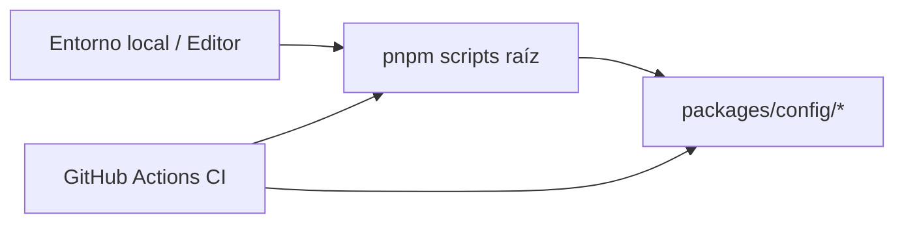
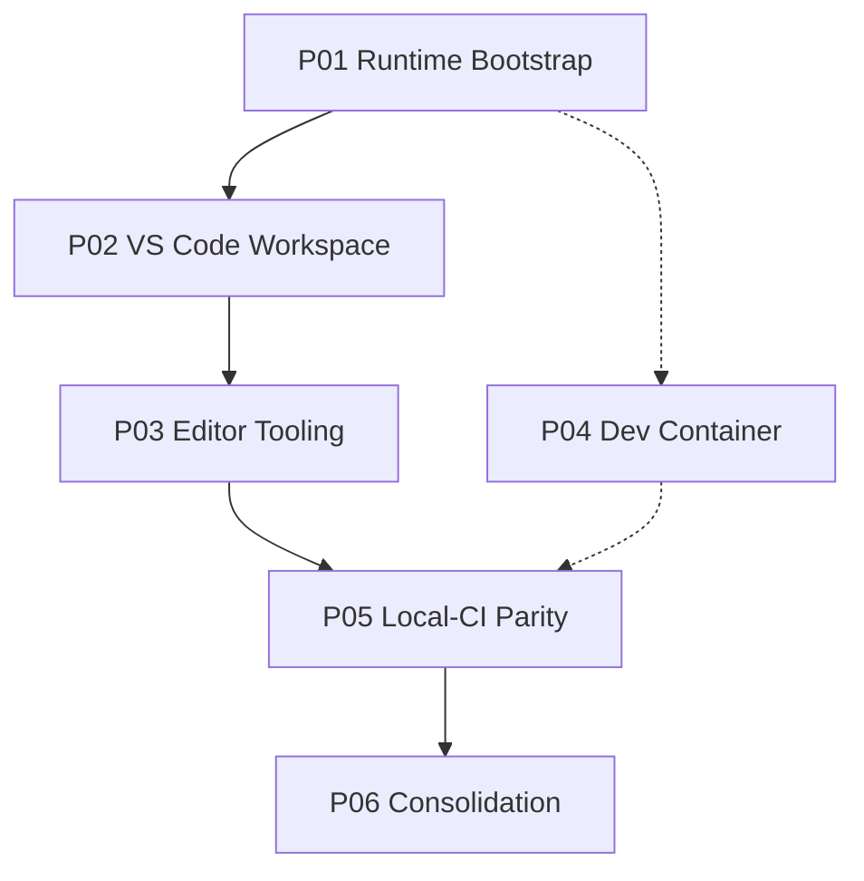

# EE-DOC-008 — Development Environment

Este documento sigue el estándar **EE-DOC-002 — Document Design Template** y se desarrolla conforme al ciclo documental definido por **EE-DOC-005 — Development Workflow**.

---

## METADATOS

| Campo                 | Valor                                                       |
| :-------------------- | :---------------------------------------------------------- |
| **ID**                | EE-DOC-008                                                  |
| **Documento**         | Development Environment                                     |
| **Código corto**      | EE-DOC-008                                                  |
| **Tipo**              | Documento Normativo                                         |
| **Clasificación**     | Especializado                                               |
| **Nivel**             | Especializado                                               |
| **Normativo**         | Sí                                                          |
| **Versión**           | v1.1.1                                                      |
| **Estado**            | Congelado                                                   |
| **Propietario**       | Equipo de Arquitectura                                      |
| **Documento padre**   | EE-DOC-007                                                  |
| **Dependencias**      | EE-DOC-001 … EE-DOC-007, EE-ADR-001, EE-ADR-002, EE-ADR-003 |
| **Aprobado por**      | Equipo de Arquitectura                                      |
| **Audiencia**         | Arquitectura, Desarrollo, DevOps, IA                        |
| **Fecha de creación** | 2026-09-23                                                  |
| **Última revisión**   | 2026-09-25                                                  |
| **Próxima revisión**  | No aplica — Documento Congelado (cambio solo vía RFC)       |

---

## 01. Propósito

Este documento define la **configuración estandarizada del entorno local de desarrollo** del Engineering Ecosystem para el monorepo `ee-monorepo`.

Establece las reglas normativas para:

- prerrequisitos de runtime y herramientas de escritorio;
- configuración del workspace del editor (VS Code / compatible);
- contenedores de desarrollo (Dev Containers), cuando se adopten;
- alineación del entorno local con la **Single Source of Truth** de configuración (`packages/config/`);
- reproducibilidad entre desarrolladores, CI y automatización de plataforma.

No redefine el Development Workflow (EE-DOC-005), la estructura del repositorio (EE-DOC-006) ni la gobernanza de GitHub (EE-DOC-007).

---

## 02. Alcance

### 02.1. Incluye

| Área                              | Artefactos / dominios                                         |
| :-------------------------------- | :------------------------------------------------------------ |
| Runtime local                     | Node.js, pnpm, Git, shell                                     |
| Editor                            | `.vscode/` (settings, extensions, tasks recomendados)         |
| Contenedor de desarrollo          | `.devcontainer/` (opcional pero gobernado si existe)          |
| Integración con config compartida | Consumo de `@eq-labs/config-*` vía herramientas del monorepo  |
| Scripts de verificación local     | Uso de `pnpm` scripts de la raíz (`doctor`, `validate`, etc.) |

### 02.2. No incluye

| Área                                                  | Documento responsable                                                       |
| :---------------------------------------------------- | :-------------------------------------------------------------------------- |
| Estructura de carpetas del monorepo                   | EE-DOC-006                                                                  |
| Gobernanza GitHub / Actions / branches                | EE-DOC-007                                                                  |
| Infraestructura de ejecución (Docker/K8s de producto) | EE-DOC-009                                                                  |
| Catálogo de Quality Gates                             | EE-DOC-010                                                                  |
| Automatización de producto (CLI de negocio)           | EE-DOC-011                                                                  |
| Extensiones publicadas (`apps/extensions/vscode`)     | Código de producto; este doc solo el **entorno de desarrollo del monorepo** |

---

## 03. Principios

| Principio                   | Regla                                                                                                                         |
| :-------------------------- | :---------------------------------------------------------------------------------------------------------------------------- |
| **Reproducibility**         | El mismo commit debe poder desarrollarse con el mismo baseline de herramientas en cualquier máquina conforme.                 |
| **Single Source of Truth**  | TypeScript, ESLint, Prettier y afines se configuran en `packages/config/`, no duplicados en la raíz ni solo en el editor.     |
| **Configuration over Code** | Preferir settings y manifests versionados a instrucciones orales o wiki no gobernada.                                         |
| **Least Local Privilege**   | No exigir herramientas o extensiones no necesarias para el trabajo diario del monorepo.                                       |
| **Editor Agnostic Core**    | El núcleo (Node, pnpm, scripts) debe funcionar sin VS Code; `.vscode/` es la experiencia **recomendada**, no el único camino. |
| **Align with CI**           | El entorno local debe poder ejecutar los mismos scripts que el job `Validate` de CI, en la medida de lo razonable.            |
| **Security by Default**     | No almacenar secrets en `.vscode/`, `.devcontainer/` ni settings compartidos.                                                 |

---

## 04. Baseline de Runtime

### 04.1. Node.js

Conforme a **EE-ADR-003**:

```text
Node.js ≥ 24.0.0 < 25
```

| Artefacto      | Valor normativo de proyecto                       |
| :------------- | :------------------------------------------------ |
| `.nvmrc`       | **`24`** (exactamente, conforme a **EE-ADR-003**) |
| `engines.node` | `>=24 <25`                                        |

Los desarrolladores deberán usar una versión de Node dentro del rango de `engines` (nvm, fnm, asdf u otro gestor), con `.nvmrc` apuntando a la línea **24**.

Un **pin de versión patch** en `.nvmrc` (p.ej. `24.21.0`) que modifique el baseline declarado por EE-ADR-003 **solo** podrá introducirse mediante **decisión gobernada** (ADR o actualización explícita del ADR). EE-DOC-008 no amplía unilateralmente EE-ADR-003.

### 04.2. pnpm

| Campo                 | Valor                                                                                     |
| :-------------------- | :---------------------------------------------------------------------------------------- |
| Gestor de paquetes    | **pnpm** (EE-ADR-001 / convención de monorepo)                                            |
| `engines.pnpm`        | **Rango de compatibilidad** declarado en la raíz (p.ej. `>=10.16.1 <11`)                  |
| `packageManager`      | **Versión efectiva de referencia** del proyecto (p.ej. `pnpm@10.16.1`)                    |
| Instalación normativa | **Corepack** (`corepack enable`) resolviendo la versión indicada por **`packageManager`** |

**Distinción obligatoria:**

- `engines.pnpm` define el **rango de compatibilidad** permitido.
- `packageManager` define la **versión efectiva de referencia** del monorepo.
- Corepack deberá resolver y usar la versión de `packageManager`.
- Una instalación manual de otra versión de pnpm que solo cumpla el rango de `engines` **no** se considera equivalente al baseline efectivo del proyecto ni satisface por sí sola el principio de **Reproducibility**.

### 04.3. Git

| Campo        | Valor                                              |
| :----------- | :------------------------------------------------- |
| Cliente      | Git 2.x compatible con el hosting                  |
| Identidad    | `user.name` / `user.email` configurados localmente |
| Line endings | Respetar `.gitattributes` del monorepo             |

### 04.4. Sistema operativo

El entorno de desarrollo soporta:

- **Windows** (PowerShell 5.1+ o PowerShell 7+; WSL2 recomendado para paridad Unix);
- **macOS**;
- **Linux**.

Las diferencias de shell no autorizan divergir del baseline de Node/pnpm ni de los scripts de la raíz.

---

## 05. Bootstrap local obligatorio

Todo desarrollador del monorepo deberá poder completar, como mínimo:

```text
1. Clonar el repositorio
2. Usar Node según .nvmrc (24.x)
3. Habilitar pnpm vía Corepack respetando `packageManager` de la raíz
4. pnpm install
5. pnpm run doctor
6. pnpm run validate
```

### 05.1. Roles de los scripts de la raíz

| Script                                 | Rol                                                                                             | Obligatorio en bootstrap local               | Parte del job CI `Validate`                               |
| :------------------------------------- | :---------------------------------------------------------------------------------------------- | :------------------------------------------- | :-------------------------------------------------------- |
| **`pnpm run doctor`**                  | Diagnóstico de **entorno** (Node, pnpm, engines, estructura)                                    | **Sí** (verificación de entorno)             | **No**                                                    |
| **`pnpm run validate`**                | **Verja de calidad** del monorepo (_Single Source of Validation_ de controles de producto/repo) | **Sí**                                       | **Sí** (junto con lint / typecheck / test según `ci.yml`) |
| `pnpm run lint` / `typecheck` / `test` | Controles de calidad ejecutados en CI y recomendados en local                                   | Recomendados; integrados vía `validate` o CI | **Sí** (según workflow vigente)                           |

`doctor` **existe** en el monorepo y no debe tratarse como script “futuro”. Su función es distinta de la verja de calidad: no sustituye a `validate` ni debe usarse como criterio de paridad local ↔ CI.

### 05.2. Verificaciones mínimas

| Verificación        | Criterio                                                                  |
| :------------------ | :------------------------------------------------------------------------ |
| `node -v`           | Mayor o igual a 24 y menor que 25                                         |
| `pnpm -v`           | Preferible igual a `packageManager`; como mínimo dentro de `engines.pnpm` |
| `pnpm install`      | Completa sin error con lockfile                                           |
| Workspace           | `pnpm-workspace.yaml` reconocido                                          |
| `pnpm run doctor`   | Finaliza sin error de entorno bloqueante                                  |
| `pnpm run validate` | Finaliza conforme a los controles vigentes del monorepo (alineado a CI)   |

Fallos de bootstrap se diagnostican primero con `doctor` (entorno) y `validate` (calidad), no con cambios ad hoc a la estructura normativa.

---

## 06. Configuración del editor (`.vscode/`)

### 06.1. Carácter normativo

El monorepo **deberá versionar** bajo control de versiones, como mínimo:

- `.vscode/extensions.json`
- `.vscode/settings.json`

Esos archivos definen la experiencia de editor **recomendada y gobernada** del proyecto.

El uso de VS Code (u editor compatible que consuma `.vscode/`) es **recomendado**, no obligatorio: el núcleo del entorno (§04–§05) debe funcionar sin IDE concreto (**Editor Agnostic Core**).

`.vscode/` **no** sustituye `packages/config/`.

### 06.2. Ubicación

```text
ee-monorepo/
└── .vscode/
    ├── extensions.json      # obligatorio en el repo (recomendaciones de extensiones)
    ├── settings.json        # obligatorio en el repo (settings de workspace)
    ├── tasks.json           # opcional — tareas pnpm
    └── launch.json          # opcional — debug
```

### 06.3. Reglas de `settings.json`

| Regla                         | Descripción                                                                                                                                                                                             |
| :---------------------------- | :------------------------------------------------------------------------------------------------------------------------------------------------------------------------------------------------------ |
| Formateo                      | Debe alinearse con Prettier del monorepo (`@eq-labs/config-prettier` / script `format`)                                                                                                                 |
| ESLint                        | Debe usar la config del monorepo, no reglas locales contradictorias                                                                                                                                     |
| TypeScript                    | Preferir el TypeScript del workspace (claves actuales `js/ts.tsdk.*` en el editor) cuando aplique                                                                                                       |
| Exclusiones                   | Los archivos de plataforma que **no** sean Markdown no deberán ser procesados por herramientas de linting Markdown como si fueran documentos Markdown (p.ej. `CODEOWNERS`, **`LICENSE`**, **`NOTICE`**) |
| Markdownlint SSOT             | Las reglas MD\* del repositorio se declaran en **`.markdownlint.json`** (raíz). **No** embeber `markdownlint.config` en `.vscode/settings.json` (deprecado por la extensión)                            |
| Markdownlint ignores (editor) | `markdownlint.ignore` + `files.associations` → `plaintext` para los archivos de la fila Exclusiones; evidencia en EE-IMP-008-P02                                                                        |
| Secrets                       | Prohibido commitear tokens, claves o `.env` con secretos en settings                                                                                                                                    |

**Paridad con CI (formato):** el script `format` de la raíz puede **escribir** archivos. El entorno local **no** debe depender del formateo silencioso como único gate de calidad. La paridad con CI se valida con `lint`, `typecheck`, `test` y `validate`. Un `format:check` (o equivalente) se incorporará cuando exista en la raíz o lo defina **EE-DOC-010**.

### 06.4. Extensiones recomendadas (`extensions.json`)

El conjunto recomendado deberá incluir, como mínimo conceptual:

| Categoría       | Propósito                                       |
| :-------------- | :---------------------------------------------- |
| ESLint          | Diagnóstico alineado a `packages/config/eslint` |
| Prettier        | Formateo alineado a `packages/config/prettier`  |
| TypeScript / JS | Soporte de lenguaje                             |
| EditorConfig    | Respeto a `.editorconfig`                       |
| YAML / JSON     | Edición de manifests del monorepo               |

La lista exacta de IDs de extensión se fija en la **implementación** (EE-IMP-008) y puede evolucionar sin cambiar el principio de este documento.

### 06.5. Tareas y debug

`tasks.json` / `launch.json` son opcionales. Si existen, deberán invocar scripts **oficiales** de la raíz (`pnpm run lint`, `test`, `validate`, etc.), no comandos paralelos no gobernados.

---

## 07. Dev Containers (`.devcontainer/`)

### 07.1. Carácter

**Política normativa actual:** Dev Containers son una capacidad **soportada y recomendada** para máxima paridad, **no** forman parte del baseline **obligatorio** del entorno mientras el bootstrap local (§05) sea viable.

Si el directorio `.devcontainer/` existe en el monorepo, queda sujeto a este documento.

La materialización de `.devcontainer/` (**unidad P04**) es **diferible**: no bloquea la conformidad mínima del entorno local (P01–P03 y paridad con CI).

**Cambio de obligatoriedad:** si Arquitectura decide convertir Dev Containers en **baseline obligatorio** del ecosistema, deberá registrarse mediante **ADR** **antes** de modificar la obligatoriedad normativa de este documento (transición opcional → obligatorio).

### 07.2. Ubicación

```text
ee-monorepo/
└── .devcontainer/
    ├── devcontainer.json
    └── Dockerfile          # opcional, si no se usa imagen base sola
```

### 07.3. Requisitos si se adopta

| Requisito             | Descripción                                                        |
| :-------------------- | :----------------------------------------------------------------- |
| Node                  | Imagen o feature con Node **24.x**                                 |
| pnpm                  | Disponible en el contenedor (Corepack o instalación explícita)     |
| Workspace mount       | El monorepo montado como workspace                                 |
| Post-create           | Preferible `pnpm install` (o script oficial)                       |
| Secrets               | Solo vía mecanismos seguros del entorno; no hardcode               |
| No redefinir monorepo | El contenedor no introduce una estructura alternativa a EE-DOC-006 |

### 07.4. Frontera con EE-DOC-009

Dev Container = **entorno de desarrollo**.  
Infraestructura de producto (cluster, servicios desplegados, docker de runtime de apps) = **EE-DOC-009 — Infrastructure**.

---

## 08. Relación con la configuración compartida



| Capa                | Responsabilidad                                    |
| :------------------ | :------------------------------------------------- |
| `packages/config/*` | SSOT de TypeScript, ESLint, Prettier, Vitest, etc. |
| Scripts raíz        | Orquestación (`lint`, `test`, `validate`, …)       |
| `.vscode/`          | UX del editor sobre esa SSOT                       |
| CI (`ci.yml`)       | Misma familia de scripts en plataforma             |

Está **prohibido** introducir en `.vscode/` reglas de lint/format que contradigan `packages/config/` sin cambio gobernado en la config compartida.

---

## 09. Variables de entorno locales

| Tipo                                  | Tratamiento                                                                                                                                                                                           |
| :------------------------------------ | :---------------------------------------------------------------------------------------------------------------------------------------------------------------------------------------------------- |
| No sensibles (flags de feature local) | Cuando el monorepo **introduzca** variables de entorno de desarrollo: `.env.example` versionado (nombres sin secretos) y `.env` en `.gitignore`. **No** crear `.env.example` vacío sin necesidad real |
| Sensibles                             | Nunca en git; documentar solo el **nombre** de la variable, nunca el valor                                                                                                                            |
| Alineación GitHub                     | Secrets de Actions se gobiernan en EE-DOC-007; el local no los duplica en el repo                                                                                                                     |

---

## 10. Integración con el flujo de desarrollo

El entorno local deberá soportar el flujo de EE-DOC-005:

1. Crear rama según convención.
2. Desarrollar con Node 24 + pnpm.
3. Ejecutar validaciones locales antes del PR.
4. Abrir PR hacia `main` (gobernanza EE-DOC-007).
5. Satisfacer required checks (p.ej. `Validate`).

El entorno local **no** sustituye Branch Protection, CODEOWNERS ni required checks.

---

## 11. Prohibiciones

1. Commitear secretos en `.vscode/`, `.devcontainer/` o `.env`.
2. Duplicar `tsconfig`/`eslint`/`prettier` de raíz que rompan el SSOT de `packages/config/`.
3. Exigir un único sistema operativo propietario como único entorno soportado.
4. Usar Node fuera del rango **≥ 24 < 25** sin ADR que lo autorice.
5. Sustituir pnpm por otro gestor en el monorepo sin ADR.
6. Tratar Dev Container como infraestructura de producción (EE-DOC-009).

---

## 12. Plan de Implementación y Fases

La implementación física de este documento se materializará mediante la serie **EE-IMP-008-P01 … P06**, con el mismo patrón de trazabilidad usado en **EE-DOC-007** (norma → unidad IMP → artefacto físico → evidencia → validación).

> La existencia de artefactos previos en el monorepo (p.ej. `.nvmrc`, scripts `doctor`/`validate`, o un `.vscode/` parcial) **no sustituye** la implementación gobernada de EE-DOC-008. Deberán alinearse, completarse o documentarse en las unidades correspondientes.

### 12.1. Resumen de unidades

| Unidad  | Nombre                                   | Dependencias            | Bloquea conformidad mínima |
| :------ | :--------------------------------------- | :---------------------- | :------------------------- |
| **P01** | Runtime and Local Bootstrap              | —                       | Sí                         |
| **P02** | VS Code Workspace Governance             | P01                     | Sí                         |
| **P03** | Editor Tooling Specialization            | P02                     | Sí                         |
| **P04** | Dev Container (condicional)              | P01                     | **No** (diferible)         |
| **P05** | Local–CI Parity Validation               | P01–P03 (P04 si existe) | Sí                         |
| **P06** | Consolidation and Implementation Closure | P01–P05 según adopción  | Sí (cierre)                |

### 12.2. Orden de ejecución

```text
P01 → P02 → P03 → P05 → P06
         ↘
          P04 (opcional / diferible; no bloquea P05 ni conformidad mínima)
```



**Conformidad mínima del entorno** = P01 + P02 + P03 + P05 + P06.  
**P04** no forma parte de la conformidad mínima. El estado (adoptado / diferido) se registra en **EE-IMP-008-P04** o en P06. Convertir Dev Containers en baseline obligatorio requiere **ADR** (§07.1).

### 12.3. Prerrequisitos de ecosistema

| Prerrequisito                                | Origen                     | Nota                                                                                         |
| :------------------------------------------- | :------------------------- | :------------------------------------------------------------------------------------------- |
| Estructura del monorepo y `packages/config/` | **EE-DOC-006** (Congelado) | P02 **depende** de config compartida existente; no es dependencia circular con un P01 de 008 |
| Gobernanza GitHub / CI `Validate`            | **EE-DOC-007** (Congelado) | P05 compara local con el job CI vigente                                                      |
| Node 24 / engines                            | **EE-ADR-003**             | Baseline de runtime                                                                          |

### 12.4. Unidad P01 — Runtime and Local Bootstrap

Materializa **§04** y **§05**.

**Naturaleza de la unidad:** cuando los artefactos de runtime y scripts ya existan en el monorepo (p.ej. heredados de EE-DOC-006 o del bootstrap previo), P01 **no** exige recrearlos. Su responsabilidad es:

1. **Validar conformidad** respecto a §04–§05 y EE-ADR-003;
2. **Corregir o alinear** únicamente si existe desvío (p.ej. `.nvmrc` incorrecto, `packageManager` ausente, engines desalineados);
3. **Documentar evidencia** as-built (versiones de Node/pnpm, SO, logs de `install` / `doctor` / `validate`).

Alcance:

- verificar / alinear `.nvmrc` (`24`), `engines.node`, `engines.pnpm`, `packageManager`;
- evidencia de `pnpm install`, `pnpm run doctor` (entorno) y `pnpm run validate` (calidad);
- documentar bootstrap en el SO del operador (Windows / macOS / Linux).

**Documento técnico asociado:** `EE-IMP-008-P01 — Runtime and Local Bootstrap`

---

### 12.5. Unidad P02 — VS Code Workspace Governance

Materializa **§06.1–§06.4** (mínimo normativo).

Alcance:

- versionar `.vscode/extensions.json` y `.vscode/settings.json` en el monorepo;
- alinear settings a Prettier / ESLint / TypeScript de `packages/config/`;
- no introducir reglas que contradigan la SSOT de configuración.

**Documento técnico asociado:** `EE-IMP-008-P02 — VS Code Workspace Governance`

---

### 12.6. Unidad P03 — Editor Tooling Specialization

Materializa **§06.5** y exclusiones de tooling.

Alcance:

- `tasks.json` / `launch.json` opcionales invocando solo scripts oficiales;
- exclusiones de linting Markdown sobre archivos de plataforma no Markdown (p.ej. `CODEOWNERS`, `LICENSE`, `NOTICE`) y SSOT `.markdownlint.json`; la evidencia concreta se registra en el IMP;
- especializaciones Type B registradas en el IMP.

**Documento técnico asociado:** `EE-IMP-008-P03 — Editor Tooling Specialization`

---

### 12.7. Unidad P04 — Dev Container (condicional / diferible)

Materializa **§07**, solo si se adopta bajo la política actual (recomendado, no obligatorio).

Alcance:

- `.devcontainer/devcontainer.json` (+ Dockerfile si aplica);
- Node 24.x + pnpm conforme a `packageManager` / engines;
- post-create con install/scripts oficiales;
- frontera explícita con EE-DOC-009.

Si se **difieren**: registrar la decisión en el IMP (o en P06) sin bloquear P05 ni el cierre mínimo.

Si en el futuro Dev Containers pasan a ser **baseline obligatorio**, se requiere **ADR** previo (§07.1) y actualización gobernada de este documento.

**Documento técnico asociado:** `EE-IMP-008-P04 — Dev Container` (o registro de diferimiento)

---

### 12.8. Unidad P05 — Local–CI Parity Validation

Materializa **§08** y el principio **Align with CI**.

**Frontera SSOT (obligatoria):**

| Autoridad      | Responsabilidad                                                                                                                                             |
| :------------- | :---------------------------------------------------------------------------------------------------------------------------------------------------------- |
| **EE-DOC-007** | Gobierna GitHub Actions / integración de plataforma; el workflow vigente (p.ej. `.github/workflows/ci.yml`) es la referencia de **ejecución en plataforma** |
| **EE-DOC-010** | Define el catálogo normativo de Quality Gates (cuando exista)                                                                                               |
| **EE-DOC-008** | Define la **paridad del entorno local** con esos controles; **no** redefine ni duplica el contenido de `ci.yml` ni el catálogo de QG                        |

**Criterio de aceptación (normativo):**

1. En local, tras bootstrap, se ejecutan con éxito los **mismos controles de calidad** que el job CI de validación del workflow **vigente** bajo EE-DOC-007 (típicamente el job **`Validate`**: familia `lint`, `typecheck`, `test`, `validate` según el `ci.yml` real del monorepo en el momento de la evidencia).
2. **`pnpm run doctor` no es criterio de paridad con CI**; pertenece a P01 (entorno).
3. EE-DOC-008 no fija el catálogo de checks: si el workflow evoluciona bajo EE-DOC-007, la paridad se re-verifica contra el workflow **actual**, no contra una lista congelada en este documento.
4. Queda evidencia as-built (comandos, versiones Node/`packageManager`, resultado pass local y referencia al run CI equivalente).

**Documento técnico asociado:** `EE-IMP-008-P05 — Local–CI Parity Validation`

---

### 12.9. Unidad P06 — Consolidation and Implementation Closure

Consolida evidencia P01–P05 (y P04 si aplica), prepara la Validación Final de EE-DOC-008 y la documentación técnica consolidada (**EE-TEC-** a confirmar en Cierre Documental).

**Documento técnico asociado:** `EE-IMP-008-P06 — Consolidation and Implementation Closure`

---

### 12.10. Estado del Plan

| Elemento                             | Estado                                   |
| :----------------------------------- | :--------------------------------------- |
| Plan general                         | **Definido** (v1.0.0)                    |
| Unidades P01–P06                     | **Definidas** en este documento          |
| Documentos EE-IMP-008-P0x            | **Completados** (P01–P06)                |
| Validación Final / Cierre Documental | **Completados** (2026-09-24); EE-TEC-003 |

---

## 13. Evolución

Los cambios a este documento siguen EE-DOC-005:

| Tipo                        | Ejemplo                                           | Mecanismo                         |
| :-------------------------- | :------------------------------------------------ | :-------------------------------- |
| A — Aclaración              | Redacción de settings                             | Cambio documental menor gobernado |
| B — Especialización técnica | Lista exacta de extension IDs                     | IMP / nota técnica                |
| C — ADR                     | Cambiar baseline de Node o gestor de paquetes     | EE-ADR                            |
| D — RFC                     | Cambios transversales que afecten docs congelados | RFC                               |

---

## 14. Cumplimiento

El cumplimiento se verifica contra:

- existencia y coherencia de `.nvmrc` / engines con EE-ADR-003;
- capacidad de `pnpm install` + scripts de validación;
- ausencia de secretos en artefactos de entorno;
- alineación editor ↔ `packages/config/`;
- no contradicción con EE-DOC-006 y EE-DOC-007.

La evidencia de implementación se registrará en **EE-IMP-008-P0x**. La documentación técnica consolidada as-built se publicará al cierre de la implementación; el código **EE-TEC-** definitivo (p.ej. EE-TEC-003) se **confirma en el Cierre Documental** de EE-DOC-008, sin presuponer numeración rígida antes de ese hito.

---

## 15. Referencias

| Código         | Documento                                       |
| :------------- | :---------------------------------------------- |
| **EE-DOC-001** | Master Documentation Index                      |
| **EE-DOC-002** | Document Design Template                        |
| **EE-DOC-003** | Engineering Ecosystem Constitution              |
| **EE-DOC-004** | Engineering Architecture                        |
| **EE-DOC-005** | Development Workflow                            |
| **EE-DOC-006** | Repository Structure                            |
| **EE-DOC-007** | GitHub Governance                               |
| **EE-DOC-009** | Infrastructure (posterior)                      |
| **EE-ADR-001** | Workspace Task Orchestration (Turborepo / pnpm) |
| **EE-ADR-002** | Testing Standard (Vitest / Playwright)          |
| **EE-ADR-003** | Node.js Baseline Upgrade to 24 LTS              |

---

## 16. Historial de Cambios

| Versión    | Fecha      | Autor                    | Aprobado por           | Motivo                                  | Cambios                                                                                                                                                                                                                          | Estado             |
| :--------- | :--------- | :----------------------- | :--------------------- | :-------------------------------------- | :------------------------------------------------------------------------------------------------------------------------------------------------------------------------------------------------------------------------------- | :----------------- |
| **v0.1.0** | 2026-09-23 | AI Engineering Assistant | —                      | Creación inicial                        | Propósito, alcance, baseline Node 24/pnpm, `.vscode/`, Dev Containers, SSOT config, plan conceptual IMP                                                                                                                          | **En Elaboración** |
| **v0.1.1** | 2026-09-23 | AI Engineering Assistant | —                      | Revisión arquitectónica                 | 10 correcciones: pnpm rango+packageManager; bootstrap doctor/validate obligatorios; `.vscode/` normativo; plan IMP con deps; format vs CI; `.env.example` condicional; P04 diferible; clasificación Especializado; TEC al cierre | **En Elaboración** |
| **v0.1.2** | 2026-09-23 | AI Engineering Assistant | —                      | Paridad estructural 007 + roles scripts | Roles doctor vs validate; criterio paridad CI en P05; plan con detalle por unidad (P01–P06); §17 Cierre Documental con esqueleto completo (pendiente de valores)                                                                 | **En Elaboración** |
| **v1.0.0** | 2026-09-24 | Equipo de Arquitectura   | Equipo de Arquitectura | Aprobación normativa                    | Cierre revisión arquitectónica: packageManager vs engines; `.nvmrc`=24 (ADR-003); regla CODEOWNERS sin ID IMP; P01 validar/alinear; P05 SSOT 007/010; Dev Container→obligatorio vía ADR                                          | **Aprobado**       |
| **v1.1.0** | 2026-09-24 | Equipo de Arquitectura   | Equipo de Arquitectura | Validación Final y Congelación          | IMP P01–P06; EE-TEC-003; §17 Cierre Documental completo                                                                                                                                                                          | Congelado          |
| **v1.1.1** | 2026-09-25 | Equipo de Arquitectura   | Equipo de Arquitectura | Type B — markdownlint                   | §06.3: exclusiones LICENSE/NOTICE; SSOT `.markdownlint.json`; sin config embebida deprecada (EE-IMP-008-P02 v1.2.0)                                                                                                              | **Congelado**      |

---

## 17. Cierre Documental

> **Aplicabilidad:** Obligatoria al completar la Validación Final de la implementación (documento implementable). Se rellena al cierre del ciclo; permanece **pendiente de valores** durante Elaboración / Implementación. La **estructura** de esta sección es normativa y se mantiene alineada al patrón de **EE-DOC-007 §19**.

---

### 17.1. Validación Final

| Campo                                               | Valor                                                                                                                             |
| :-------------------------------------------------- | :-------------------------------------------------------------------------------------------------------------------------------- |
| **Fecha de validación final**                       | 2026-09-24                                                                                                                        |
| **Evidencias utilizadas**                           | EE-IMP-008-P01 … P06; **EE-TEC-003** v1.0.0                                                                                       |
| **Resultados de controles de plataforma / calidad** | lint / typecheck / test / validate **pass** local (paridad comandos job `Validate`); catálogo EE-DOC-010 pendiente de elaboración |
| **Responsable de validación**                       | Equipo de Arquitectura                                                                                                            |

---

### 17.2. Resultado de controles de conformidad (entorno)

| Validación                                                      |          Resultado          |
| :-------------------------------------------------------------- | :-------------------------: |
| Baseline Node / pnpm / packageManager                           |             ✅              |
| Bootstrap `doctor` (entorno)                                    |             ✅              |
| Bootstrap / paridad `validate` (+ lint/typecheck/test según CI) |             ✅              |
| `.vscode/extensions.json` + `settings.json` versionados         |             ✅              |
| Alineación editor ↔ `packages/config/`                         |             ✅              |
| Dev Container (si adoptado)                                     | ✅ N/A — **diferido** (P04) |
| Ausencia de secretos en artefactos de entorno                   |             ✅              |
| Trazabilidad IMP + TEC                                          |        ✅ EE-TEC-003        |

---

### 17.3. Dictamen de Cierre

**CONFORME.**

La implementación del entorno de desarrollo cumple el alcance de **EE-DOC-008** y la documentación técnica consolidada **EE-TEC-003**. La conformidad mínima (P01+P02+P03+P05+P06) está materializada. P04 queda diferida de forma explícita. No existen desviaciones silenciosas.

Código TEC confirmado en este cierre: **EE-TEC-003**.

---

### 17.4. Estado Final

| Campo                 | Valor                                |
| :-------------------- | :----------------------------------- |
| **Estado documental** | **Congelado**                        |
| **Versión normativa** | v1.1.1                               |
| **Congelación**       | **Sí** — 2026-09-24                  |
| **Próximo hito**      | EE-DOC-009 — Infrastructure (Fase 3) |

---

### 17.5. Condiciones para el Cierre

El Cierre Documental de EE-DOC-008 podrá completarse únicamente cuando:

1. Las unidades de la **conformidad mínima** (P01, P02, P03, P05, P06) hayan sido implementadas y validadas.
2. P04 esté **implementada** o **explícitamente diferida** con registro en IMP.
3. La documentación técnica consolidada esté disponible (código EE-TEC confirmado en este cierre).
4. La Validación Final haya verificado conformidad y ausencia de desviaciones no documentadas.
5. El Equipo de Arquitectura haya emitido el dictamen de cierre.
6. El estado documental pueda transitar a **Congelado** según EE-DOC-005.

---

## FIN DEL DOCUMENTO
