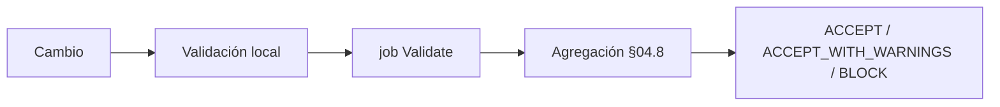
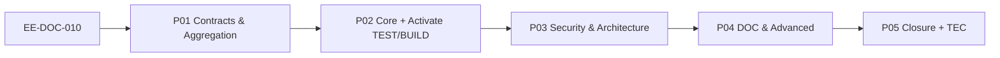

# EE-DOC-010 — Quality Gates

Este documento sigue el estándar **EE-DOC-002 — Document Design Template** y se desarrolla conforme al ciclo documental definido por **EE-DOC-005 — Development Workflow**.

---

## METADATOS

| Campo                 | Valor                                                                                                                                          |
| :-------------------- | :--------------------------------------------------------------------------------------------------------------------------------------------- |
| **ID**                | EE-DOC-010                                                                                                                                     |
| **Documento**         | Quality Gates                                                                                                                                  |
| **Código corto**      | EE-DOC-010                                                                                                                                     |
| **Tipo**              | Documento Normativo                                                                                                                            |
| **Clasificación**     | Especializado                                                                                                                                  |
| **Nivel**             | Especializado                                                                                                                                  |
| **Normativo**         | Sí                                                                                                                                             |
| **Versión**           | v1.5.1                                                                                                                                         |
| **Estado**            | Congelado                                                                                                                                      |
| **Propietario**       | Equipo de Arquitectura                                                                                                                         |
| **Documento padre**   | EE-DOC-006 — Repository Structure                                                                                                              |
| **Dependencias**      | EE-DOC-001, EE-DOC-002, EE-DOC-003, EE-DOC-004, EE-DOC-005, EE-DOC-006, EE-DOC-007, EE-DOC-008, EE-DOC-009, EE-ADR-002, EE-ADR-003, EE-ADR-004 |
| **Aprobado por**      | Equipo de Arquitectura                                                                                                                         |
| **Audiencia**         | Arquitectura, Desarrollo, DevOps, QA, IA                                                                                                       |
| **Fecha de creación** | 2026-09-26                                                                                                                                     |
| **Última revisión**   | 2026-10-06                                                                                                                                     |
| **Próxima revisión**  | 2026-12-29                                                                                                                                     |

---

## 01. Propósito

Este documento define el **catálogo normativo de Quality Gates** del Engineering Ecosystem para el monorepo `ee-monorepo` y el **contrato de ejecución** consumible por CI y validación local.

Establece:

- qué propiedades de calidad deben verificarse;
- el flujo definición → aplicabilidad → evaluación → resultado → **agregación** → decisión;
- **Severity**, **Availability** y **Result** como dimensiones independientes;
- evidencia mínima y mapeo al required check de plataforma;
- la separación norma (010) / CI (007) / local (008) / dominio infra (009).

**EE-DOC-010** es el **Single Source of Validation** del detalle de gates (IDs, severidad, disponibilidad, agregación).  
**EE-DOC-005 §10** define el conjunto **Mandatory** del workflow; 010 **no elimina ni relaja** esa obligatoriedad (**EE-ADR-004**, EE-DOC-005 §10.4).  
**Separación normativa:** `Mandatory` (005) ≠ `Availability` (010) ≠ `Enforcement` (007).  
**EE-DOC-007** aplica enforcement efectivo solo a gates **ACTIVE**.  
**EE-DOC-008** habilita paridad local.  
**EE-DOC-011** (Automation) y **EE-DOC-015** (Ecosystem Validation) **no** forman parte del catálogo ni de la agregación de merge de este documento. Frontera: **010** = Quality Gates de cambio/merge (Severity, Availability, Result, agregación ACCEPT/BLOCK); **015** = dictamen de validación del **ecosistema** en un ref (PASS/DEGRADED/FAIL por dominios). Ninguno sustituye al otro. Un dictamen PASS de 015 **no** bypasea required checks ni gates ACTIVE.

**Documento padre:** EE-DOC-006 (serie implementable 006–015; mismo criterio que EE-DOC-007 y EE-DOC-009).  
**Precedente de roadmap en EE-DOC-001:** EE-DOC-009. Ambas relaciones coexisten: padre estructural vs. orden de fase. Al **Aprobar** este documento debe sincronizarse **EE-DOC-001** (matriz §09, métricas §13) en el mismo cambio (R10).

---

## 02. Alcance

### 02.1. Incluye

Type Safety, Linting, Formatting (**check**), Tests (unit / integration / component / **E2E** cuando aplique), Build, Security, Architecture automatizable, Documentation, Repository integrity, Infrastructure enforcement, Evidence, Aggregation.

### 02.2. No incluye

Gobernanza GitHub (007), diseño concreto de workflows (007/IMP), IDE/Dev Container (008), definición de dominio IaC (009), Automation/Templates (011/012) y Ecosystem Validation (015) — **fuera del catálogo de merge** (no redefinen QG-\*), lógica de producto, ADR/RFC de cambio de norma.

**Frontera excepción:** **ADR/RFC** (EE-DOC-005) cambian la norma; **WAIVED** es excepción **temporal operativa** de un gate ACTIVE (máx. alineado a bypass 005 §10.3).

### 02.3. Frontera con EE-DOC-007 — GitHub Governance

| Responsabilidad                                            | EE-DOC-010                   | EE-DOC-007               |
| :--------------------------------------------------------- | :--------------------------- | :----------------------- |
| Catálogo QG-\*, Severity, Availability, Result, agregación | **Sí**                       | No                       |
| Ejecución CI, required checks, Rulesets                    | No                           | **Sí**                   |
| Nombre de check de plataforma                              | Define contrato (`Validate`) | Publica y exige el check |

### 02.4. Frontera con EE-DOC-008 — Development Environment

Paridad local ↔ CI: los mismos contratos de gate se evalúan vía comandos root del monorepo. EE-DOC-008 no redefine el catálogo.

### 02.5. Frontera con EE-DOC-009 — Infrastructure

| Documento      | Rol                                                |
| :------------- | :------------------------------------------------- |
| **EE-DOC-009** | Requisitos de dominio de infraestructura           |
| **EE-DOC-010** | Ownership exclusivo del enforcement (`QG-INFRA-*`) |

Queda prohibido un catálogo paralelo de Quality Gates en 007 o 009.

---

### 02.6. Frontera con EE-DOC-015 — Engineering Ecosystem Validation

| Responsabilidad                                                         | EE-DOC-010                    | EE-DOC-015                                                                                        |
| :---------------------------------------------------------------------- | :---------------------------- | :------------------------------------------------------------------------------------------------ |
| Catálogo QG-\*, Severity, Availability, Result, agregación de **merge** | **Sí**                        | No                                                                                                |
| Dictamen de validación del **ecosistema** (dominios V-\*) en un ref     | No                            | **Sí**                                                                                            |
| Required check / Rulesets                                               | Vía contrato `Validate` + 007 | No bypassea 007/010                                                                               |
| Residuales **WAIVED vigentes** (010 §04.6.1)                            | Result de gate **WAIVED**     | Mapeo a dominio 015 (p. ej. V-QG **DEGRADED**). **High sin WAIVE → FAIL de dominio**, no DEGRADED |

## 03. Principios

| Principio                                  | Regla                                                                            |
| :----------------------------------------- | :------------------------------------------------------------------------------- |
| **Quality by Default**                     | Todo cambio se somete a los gates aplicables.                                    |
| **Automation First**                       | Validaciones repetibles automatizadas cuando sea razonable.                      |
| **Objective Evidence**                     | Evidencia verificable; no sustituir por afirmación manual si hay automatización. |
| **Fail Explicitly**                        | Fallo explícito; sin interpretación ambigua.                                     |
| **Exit Code First**                        | PASS/FAIL por exit code o señal contractual, no parsing frágil de stdout.        |
| **Reproducibility**                        | Mismo estado → mismos gates bajo condiciones equivalentes.                       |
| **Least Privilege**                        | Permisos mínimos para ejecutar y reportar.                                       |
| **Traceability**                           | Resultado ligado a commit / ejecución.                                           |
| **Separation of Concerns**                 | Norma (010) ≠ CI (007) ≠ local (008) ≠ automatización de producto (011).         |
| **Minimal Intervention**                   | Sin modificar silenciosamente el estado evaluado.                                |
| **No False Pass**                          | No PASS si no hubo ejecución determinable.                                       |
| **Single Source of Validation**            | Catálogo detallado solo en EE-DOC-010.                                           |
| **Version Pinning**                        | Herramientas de QG con versiones exactas (EE-DOC-006).                           |
| **Definition ≠ Implementation**            | Mecanismo contractual estable; el CLI puede evolucionar en IMP.                  |
| **Mandatory ≠ Availability ≠ Enforcement** | EE-ADR-004 / EE-DOC-005 §10.4.                                                   |

---

## 04. Modelo de Quality Gate

### 04.1. Tres dimensiones

```text
Severity      = BLOCKING | WARNING | INFORMATIONAL
Availability  = ACTIVE | PENDING_IMPLEMENTATION | DEPRECATED
Result        = PASS | FAIL | NOT_APPLICABLE | SKIPPED | ERROR | WAIVED
```

### 04.2. Flujo de ejecución

```text
Catalog → applicability → Evaluation (solo ACTIVE) → Result → Aggregation (§04.8) → ACCEPT | ACCEPT_WITH_WARNINGS | BLOCK
```

### 04.3. Atributos de definición

Identificador, Dominio, Propósito, Condición de aplicación, **Mecanismo contractual**, PASS/FAIL, Severity, Availability, Evidencia, Propietario.

### 04.4. Availability y activación (EE-ADR-004 / EE-DOC-005 §10.4)

Availability describe el **estado de materialización del mecanismo**, no el carácter obligatorio del requisito.

| Availability               | Obligación normativa (si el gate es Mandatory en 005) | Enforcement de merge (007) | ¿PASS permitido?              |
| :------------------------- | :---------------------------------------------------- | :------------------------- | :---------------------------- |
| **ACTIVE**                 | Sí                                                    | Sí, cuando aplicable       | Solo tras evaluación conforme |
| **PENDING_IMPLEMENTATION** | **Sí — sigue siendo Mandatory**                       | Aún **no** materializado   | **No**                        |
| **DEPRECATED**             | Retirado del uso normativo vigente                    | No                         | No                            |

**PENDING_IMPLEMENTATION no significa “opcional”.** Significa: la obligación existe; el mecanismo aún no está implementado y cableado de forma verificable (**No False Pass**).

**PENDING no es ejecutable en la agregación de merge** (§04.8) porque no hay enforcement materializado — **no** porque el requisito haya dejado de ser obligatorio. El cumplimiento del workflow respecto de gates PENDING queda bajo el **régimen transitorio gobernado** de **EE-DOC-005 §10.4** (plan Arquitectura, hitos IMP, normalization), no bajo omisión silenciosa ni bajo bypass ad hoc indefinido (§10.3 R5).

**Activación PENDING → ACTIVE** requiere EE-IMP-010-PXX y la cadena:

```text
definition → implementation → invocation → result → evidence → CI → enforcement → actualización de este documento
```

### 04.5. Aplicabilidad

Tipo de cambio, paths/packages, tipo de artefacto, contexto (local / CI PR / main).

### 04.6. Result

| Result         | Significado                               |
| :------------- | :---------------------------------------- |
| PASS           | Ejecutado y conforme                      |
| FAIL           | Ejecutado y no conforme                   |
| NOT_APPLICABLE | No corresponde; **evidencia obligatoria** |
| SKIPPED        | Corresponde y **no** se ejecutó           |
| ERROR          | Resultado indeterminable                  |
| WAIVED         | Excepción autorizada con evidencia        |

**SKIPPED ≠ NOT_APPLICABLE.** Sin evidencia, NOT_APPLICABLE se trata como ERROR.

#### 04.6.1. WAIVED

Requiere: justificación, autoridad Arquitectura / EE-DOC-005, `gate_id`, `authority`, `reason`, `scope`, `effective_from`, `expires_at` (**máximo 7 días** salvo ADR/RFC que autorice otra ventana — alineado a EE-DOC-005 §10.3), `normalization_plan`. No elimina el gate del catálogo.

### 04.7. Severity

Todo gate del catálogo tiene **exactamente un** valor: BLOCKING, WARNING o INFORMATIONAL (sin “según política” en el atributo).

### 04.8. Agregación (contrato crítico)

**Entrada:** resultados de **todos los gates ACTIVE considerados** para el cambio, **incluyendo `NOT_APPLICABLE`** cuando la regla de aplicabilidad determine que el gate no corresponde.

```text
Gate ACTIVE
    ↓
Applicability evaluation
    ├── applicable     → execute → PASS | FAIL | SKIPPED | ERROR | WAIVED
    └── not applicable → NOT_APPLICABLE + evidencia
```

**No False Pass (conjunto vacío de evaluación):**

| Situación                                                                                      | Decisión                                     |
| :--------------------------------------------------------------------------------------------- | :------------------------------------------- |
| **No existe ningún resultado** de gate ACTIVE **evaluado** para el cambio (no hubo evaluación) | **BLOCK**                                    |
| Gates ACTIVE **evaluados** y todos **NOT_APPLICABLE** con evidencia                            | **ACCEPT** (N/A válido no es incumplimiento) |
| Gates ACTIVE evaluados con al menos un incumplimiento BLOCKING                                 | **BLOCK**                                    |

**Regla general de incumplimiento por severidad:**

Para cualquier Severity, un Result ∈ {FAIL, ERROR, SKIPPED sin justificación autorizada} o WAIVED inválido/vencido constituye **incumplimiento de ese nivel**. El efecto sobre la decisión del cambio es:

| Severity del gate incumplido | Efecto                                                       |
| :--------------------------- | :----------------------------------------------------------- |
| **BLOCKING**                 | **BLOCK**                                                    |
| **WARNING**                  | contribuye a **ACCEPT_WITH_WARNINGS** (no BLOCK por sí solo) |
| **INFORMATIONAL**            | solo evidencia; no cambia la decisión                        |

**NOT_APPLICABLE** con evidencia y **WAIVED** válido **no** constituyen incumplimiento. Tampoco lo constituye un **SKIPPED con justificación contractual** expresamente declarada en el catálogo (§05.4, caso cero tareas de test).

| Decisión                 | Condición                                                               |
| :----------------------- | :---------------------------------------------------------------------- |
| **BLOCK**                | Ningún resultado ACTIVE evaluado **o** algún BLOCKING ACTIVE incumplido |
| **ACCEPT_WITH_WARNINGS** | Hubo evaluación; no BLOCK; al menos un WARNING incumplido               |
| **ACCEPT**               | Hubo evaluación; ningún BLOCKING incumplido; ningún WARNING incumplido  |

PENDING y DEPRECATED **no** entran en la agregación de bloqueo del merge (no hay mecanismo ejecutable). Eso **no** los convierte en opcionales si son Mandatory en EE-DOC-005; rige el régimen §10.4 de 005.

**Enforcement en merge:** todo gate **ACTIVE** con Severity=**BLOCKING** que resulte **aplicable** al cambio participa en el enforcement del required check **`Validate`** (EE-DOC-007), salvo regla de alcance explícita en este documento. No se introduce una dimensión adicional de “required vs advisory”.

---

## 05. Catálogo Normativo

### 05.1. Matriz

| ID               | Gate                                                                |             Mandatory (005 §10)              | Severity | Availability           |
| :--------------- | :------------------------------------------------------------------ | :------------------------------------------: | :------- | :--------------------- |
| **QG-TYPE-001**  | Typecheck                                                           |           (soporte de integridad)            | BLOCKING | ACTIVE                 |
| **QG-LINT-001**  | Lint                                                                |                    **Sí**                    | BLOCKING | ACTIVE                 |
| **QG-FMT-001**   | Format check                                                        |                    **Sí**                    | BLOCKING | ACTIVE                 |
| **QG-TEST-001**  | Tests (unit / integration / component; E2E bajo §10.4 de 005)       |                    **Sí**                    | BLOCKING | **ACTIVE**             |
| **QG-BUILD-001** | Build                                                               |                    **Sí**                    | BLOCKING | **ACTIVE**             |
| **QG-SEC-001**   | Dependency Audit                                                    |             (seguridad de deps)              | BLOCKING | ACTIVE                 |
| **QG-SEC-002**   | Secret Detection                                                    |           **Sí** (Secret Scanning)           | BLOCKING | **ACTIVE**             |
| **QG-SEC-003**   | Static Security Analysis                                            |            Condicional 005 §10.2             | BLOCKING | PENDING_IMPLEMENTATION |
| **QG-ARCH-001**  | Architecture Boundaries (top-level; capas/ciclos bajo §10.4 de 005) |      **Sí** (Architecture & Structure)       | BLOCKING | **ACTIVE**             |
| **QG-DOC-001**   | Documentation Structure                                             |      **Sí** (Documentation Validation)       | BLOCKING | **ACTIVE**             |
| **QG-DOC-002**   | Documentation Consistency                                           |      **Sí** (Documentation Validation)       | BLOCKING | **ACTIVE**             |
| **QG-REPO-001**  | Repository Integrity                                                | **Sí** (Architecture & Structure / validate) | BLOCKING | ACTIVE                 |
| **QG-INFRA-001** | Infrastructure Security                                             |                 Dominio 009                  | BLOCKING | **ACTIVE**             |
| **QG-PERF-001**  | Performance                                                         |            Condicional 005 §10.2             | WARNING  | PENDING_IMPLEMENTATION |
| **QG-COV-001**   | Coverage                                                            |            Condicional 005 §10.2             | WARNING  | PENDING_IMPLEMENTATION |

> **Mandatory (005)** = obligación normativa del workflow. **Availability (010)** = estado de materialización. Un gate puede ser Mandatory **y** PENDING a la vez (**EE-ADR-004**).  
> **PENDING** = falta de implementación/enforcement del **mecanismo del gate**, no “ausencia de tests/comando” ni “gate opcional”.  
> **QG-TEST-001 ACTIVE (v1.1.0 / EE-IMP-010-P02):** `pnpm run test` + paso CI; **0 tasks → SKIPPED** (no PASS).  
> **QG-BUILD-001 ACTIVE (v1.1.0 / EE-IMP-010-P02):** `pnpm run build` en `validate` y step **Build** en job `Validate`.  
> **Alcance ACTIVE (v1.4.0 / EE-IMP-010-P05):** TEST-001 cubre unit/integration/component; E2E y la verificación de ciclos/capas de ARCH-001 permanecen PENDING bajo régimen transitorio (EE-IMP-010-P05 §06).  
> Gates Mandatory + PENDING: régimen transitorio **EE-DOC-005 §10.4** (plan Arquitectura + IMP-010), no PASS simulado.

### 05.2. Mapeo baseline y required check

| Gate         | Materialización actual                               | Notas                                                |
| :----------- | :--------------------------------------------------- | :--------------------------------------------------- |
| QG-TYPE-001  | `pnpm run typecheck`                                 | ACTIVE                                               |
| QG-LINT-001  | `pnpm run lint`                                      | ACTIVE                                               |
| QG-FMT-001   | Prettier **`--check`** dentro de `pnpm run validate` | ACTIVE; `pnpm run format` = **write**, no es el gate |
| QG-SEC-001   | `pnpm audit` vía validate                            | ACTIVE; umbral §05.8                                 |
| QG-REPO-001  | checks de estructura en validate/doctor              | ACTIVE                                               |
| QG-TEST-001  | `pnpm run test` + CI; 0 tasks → SKIPPED              | **ACTIVE**                                           |
| QG-BUILD-001 | `pnpm run build` en validate + CI step Build         | **ACTIVE**                                           |

**Required status check (EE-DOC-007):** nombre de plataforma **`Validate`**.

| Required check | Rol          | Gates que debe garantizar (Minimum Merge Set ACTIVE)                                                              |
| :------------- | :----------- | :---------------------------------------------------------------------------------------------------------------- |
| **`Validate`** | Agregador CI | todos los gates ACTIVE del §05.1 (TYPE, LINT, FMT, SEC-001, SEC-002, REPO, TEST, BUILD, ARCH, DOC-001/002, INFRA) |

Contrato de comandos root: **EE-DOC-006**.  
**Format check:** hoy materializado **dentro** de `validate`; un comando root aislado `format:check` es especialización Type B opcional (no bloquea la norma del gate).

### 05.2.1. Minimum Merge Set (enforcement efectivo)

> Fases P01–P05: **§09.1**.  
> Este conjunto es el de gates **ACTIVE** que participan en la agregación y en el required check **`Validate`**.  
> **No** redefine el catálogo Mandatory de EE-DOC-005 §10.1: los gates Mandatory aún PENDING siguen obligatorios en norma y bajo régimen §10.4 de 005.

| Etapa                                | Gates ACTIVE en enforcement de merge                        |
| :----------------------------------- | :---------------------------------------------------------- |
| **Baseline P01**                     | TYPE, LINT, FMT, SEC-001, REPO                              |
| **Tras P02**                         | + QG-TEST-001, QG-BUILD-001                                 |
| **Tras P03**                         | + QG-SEC-002, QG-ARCH-001                                   |
| **Tras P04 (vigente v1.4.0)**        | + QG-DOC-001, QG-DOC-002, QG-INFRA-001                      |
| **Pendiente (régimen §10.4 de 005)** | QG-SEC-003, QG-PERF-001, QG-COV-001; E2E; ARCH capas/ciclos |

La columna de fases describe **materialización**, no “cuando el gate pasa a ser obligatorio”.

### 05.3. QG-TYPE-001 / QG-LINT-001 / QG-FMT-001

| Gate            | Criterio PASS                        | Criterio FAIL                                   |
| :-------------- | :----------------------------------- | :---------------------------------------------- |
| **QG-TYPE-001** | Typecheck oficial exitoso            | Errores de tipos / ejecución indeterminable     |
| **QG-LINT-001** | Lint oficial sin errores bloqueantes | Errores de lint / config inválida               |
| **QG-FMT-001**  | Prettier **`--check`** conforme      | Archivos fuera de formato / check no ejecutable |

**QG-FMT-001:** solo **check**. `pnpm run format` (write) no es Quality Gate. Alineado a **EE-DOC-005 §10.1** (desde v1.3.1; régimen de adopción v1.4.0).

### 05.4. QG-TEST-001 — Tests (incl. E2E)

**Mecanismo contractual:** ejecución de las pruebas **aplicables** al ámbito afectado, incluyendo **unit, integration, component y E2E** cuando corresponda (**EE-ADR-002**: Vitest / Playwright).

**Availability vs aplicabilidad (no confundir):**

| Concepto          | Significado                                                                                 |
| :---------------- | :------------------------------------------------------------------------------------------ |
| **Availability**  | ¿El **mecanismo del gate** está implementado y cableado (evaluación → Result → agregación)? |
| **Applicability** | ¿**Este cambio** tiene superficie de test que deba ejecutarse?                              |

- **Availability = ACTIVE** (v1.1.0 / EE-IMP-010-P02): mecanismo cableado en `scripts/test`, `scripts/validate` y job CI `Validate`.
- **Regla cero tareas (implementada):** exit 0 con 0 tasks → **SKIPPED** con mensaje contractual `QG-TEST-001: SKIPPED` — **nunca PASS** (EE-DOC-010 §05.4).
- Target/cambio **sin tests aplicables** con tasks en scope vacío a nivel monorepo → **SKIPPED** (baseline actual); cuando existan suites en packages afectados → ejecución real → PASS/FAIL; sin superficie aplicable → **NOT_APPLICABLE** + evidencia.

**Alcance ACTIVE (v1.4.0):** unit / integration / component (Vitest, `pnpm run test`).

**E2E (Playwright):** Mandatory en EE-DOC-005 §10.1, **sin cableado** (no existe script root `e2e`, tarea Turbo ni step CI). Permanece bajo el régimen transitorio de **EE-DOC-005 §10.4** (EE-IMP-010-P05 §06). Al cablearse: PASS si la suite E2E aplicable es exitosa; NOT_APPLICABLE con evidencia si no hay superficie E2E afectada.

**Regla cero tareas:** exit 0 con **0 tasks** ≠ PASS. Mientras **ningún workspace defina `test`**, ese caso se resuelve como **SKIPPED con justificación contractual** (no constituye incumplimiento BLOCKING, §04.8). Desde que exista la primera suite, 0 tareas sobre un ámbito con superficie de test es incumplimiento (SKIPPED sin justificación).

**Materialización de la evidencia:** el mensaje `QG-TEST-001: SKIPPED` lo emite `scripts/test`; la fase Tests de `validate` invoca Turbo directamente y solo muestra la advertencia de Turbo (evidencia granular: observación D6, EE-IMP-010-P05).

### 05.5. QG-BUILD-001

**Mecanismo contractual:** construcción de artefactos aplicables al cambio.

- **Availability = ACTIVE** (v1.1.0 / EE-IMP-010-P02).
- El comando root **`pnpm run build`** existe y está integrado en `scripts/validate` (fase Build, critical) y en `.github/workflows/ci.yml` (step Build).
- Al activarse: **PASS** si build aplicable exitoso; **NOT_APPLICABLE** si el cambio no es susceptible de build (con evidencia).

### 05.6. QG-SEC-001 — Dependency Audit

- **FAIL** si existen vulnerabilidades **high** o **critical** en el alcance de la auditoría.
- **low / moderate** no producen FAIL de BLOCKING por sí solas.
- **Materialización (v1.4.0):** `pnpm audit --audit-level high`, incluyendo devDependencies (sin `--prod`).
- **devDependencies:** high/critical **sí** producen FAIL (tooling/CI es supply chain). Solo low/moderate en devDependencies pueden no bloquear.
- Cualquier cambio de umbral normativo requiere **modificación gobernada de EE-DOC-010**. La implementación (IMP/suite) materializa **exactamente** el umbral de este documento — no lo redefine.

### 05.7. QG-SEC-002 / QG-SEC-003

- **QG-SEC-002 — ACTIVE (v1.2.0):** GitHub secret scanning + push protection y step **Gitleaks CLI** en el job `Validate`. Verificado con prueba negativa (regla `github-pat`, EE-IMP-010-P05 N11). **Límite conocido:** el checkout superficial escanea solo el commit evaluado, no el historial (observación W-P05-001).
- **QG-SEC-003 — PENDING_IMPLEMENTATION:** SAST no materializado; adopción de herramienta vía EE-DOC-005 (ADR).

### 05.8. QG-ARCH-001

**Contrato ACTIVE (v1.4.0):** directorios requeridos + allowlist/forbidden de directorios top-level (EE-DOC-006 / EE-RFC-001), en `scripts/validate`.

**PENDING (régimen §10.4 de 005):** dependencias circulares, dependencias prohibidas entre capas (EE-DOC-006 §13.2) y fronteras apps / packages / connectors. Fuera de gate: design review / ADR narrativo.

### 05.9. QG-DOC-001 / QG-DOC-002

**ACTIVE (v1.3.0):** DOC-001 verifica README, LICENSE, NOTICE, CHANGELOG; DOC-002 verifica `name` y `engines.node` alineado con `.nvmrc`.

### 05.10. QG-REPO-001

ACTIVE. Integridad EE-DOC-006.

### 05.11. QG-INFRA-001

**Severity: BLOCKING.** Availability: **ACTIVE** (v1.3.0; alcance: existencia de `infra/{containers,orchestration,secrets}` y `infra/secrets/.gitignore`; el análisis de contenido de manifiestos se incorpora al existir manifiestos). Vendor Agnostic (EE-DOC-003): sin amarre a cloud vendor. Requisitos de dominio en 009; enforcement aquí.

### 05.12. QG-PERF-001 / QG-COV-001

**Severity: WARNING.** PENDING hasta política de umbrales publicada vía actualización de este documento.

---

## 06. Ejecución y Evidencia

### 06.1. Principio de ejecución

| Regla                   | Descripción                                                                          |
| :---------------------- | :----------------------------------------------------------------------------------- |
| **Automatización**      | Las validaciones repetibles se ejecutan de forma reproducible.                       |
| **Local vs CI**         | La validación local no sustituye el required check en ramas protegidas (EE-DOC-007). |
| **Herramienta ≠ norma** | La herramienta materializa el contrato; no altera la autoridad de EE-DOC-010.        |



### 06.2. Evidencia mínima

| Campo                                 | Requerido                                          | Notas                                                   |
| :------------------------------------ | :------------------------------------------------- | :------------------------------------------------------ |
| `gate_id`                             | Sí                                                 | Identificador estable `QG-*`                            |
| `repository` / target                 | Sí                                                 | Ámbito evaluado                                         |
| `commit` o ref                        | Sí                                                 | Trazabilidad                                            |
| `execution_id` o run id               | Sí cuando el mecanismo lo soporte                  | CI / local                                              |
| `timestamp`                           | Sí cuando el mecanismo lo soporte                  | ISO 8601 preferible                                     |
| `result`                              | Sí                                                 | PASS / FAIL / NOT_APPLICABLE / SKIPPED / ERROR / WAIVED |
| `severity`                            | Sí en reportes estructurados                       | BLOCKING / WARNING / INFORMATIONAL                      |
| `availability`                        | Sí en reportes estructurados                       | ACTIVE / PENDING / DEPRECATED                           |
| `output` o referencia a log/artefacto | Sí en FAIL, ERROR, SKIPPED, NOT_APPLICABLE, WAIVED | —                                                       |

Un check CI que solo exponga `Validate: passed` **sin** poder reconstruir resultados por gate cuando falle un subpaso no cumple el espíritu de evidencia desglosable; IMP debe mejorar la granularidad de forma progresiva.

### 06.3. Detección de resultados

Orden de preferencia:

1. Exit code contractual.
2. Estado estructurado (API / JSON de la tool).
3. API contractual del runner.
4. Parsing de texto (último recurso; prohibido como única base de PASS frágil).

### 06.4. Herramientas del workspace

Preferir `pnpm` / `pnpm exec` / Turbo del workspace. La ausencia de un binario global no constituye FAIL si la herramienta está disponible en el workspace del monorepo.

---

## 07. Baseline y Gaps

### 07.1. Baseline ACTIVE (enforcement efectivo)

| Gate         | Materialización                                                        | Entorno         |
| :----------- | :--------------------------------------------------------------------- | :-------------- |
| QG-TYPE-001  | `pnpm run typecheck`                                                   | Local + CI      |
| QG-LINT-001  | `pnpm run lint`                                                        | Local + CI      |
| QG-FMT-001   | Prettier `--check` vía `pnpm run validate`                             | Local + CI      |
| QG-SEC-001   | `pnpm audit --audit-level high` vía `validate` (incl. devDependencies) | Local + CI      |
| QG-REPO-001  | Checks de estructura en `validate` / `doctor`                          | Local + CI      |
| QG-TEST-001  | `pnpm run test` (0 tasks → SKIPPED)                                    | Local + CI      |
| QG-BUILD-001 | `pnpm run build` / fase Build en validate + CI                         | Local + CI      |
| QG-SEC-002   | GitHub secret scanning + push protection; Gitleaks CLI en CI           | Plataforma + CI |
| QG-ARCH-001  | required dirs + top-level allowlist en `scripts/validate`              | Local + CI      |
| QG-DOC-001   | README, LICENSE, NOTICE, CHANGELOG en validate                         | Local + CI      |
| QG-DOC-002   | package.json name/engines ↔ `.nvmrc` en validate                      | Local + CI      |
| QG-INFRA-001 | infra/{containers,orchestration,secrets} + secrets/.gitignore          | Local + CI      |
| Agregador    | Job **`Validate`** (EE-DOC-007)                                        | CI              |

Runtime y estándares de apoyo: Node ≥ 24 (EE-ADR-003), Vitest/Playwright (EE-ADR-002), versiones exactas (EE-DOC-006).

### 07.2. Gaps (PENDING_IMPLEMENTATION)

| Gate                       | Motivo de PENDING                                   | Unidad IMP prevista                   |
| :------------------------- | :-------------------------------------------------- | :------------------------------------ |
| QG-SEC-003                 | SAST no materializado (sin CodeQL/Semgrep cableado) | EE-IMP-010-P03 (diferido) / posterior |
| QG-PERF-001 / QG-COV-001   | Sin política de umbrales publicada                  | Posterior a umbral normativo en 010   |
| QG-TEST-001 (E2E)          | Sin script root `e2e`, tarea Turbo ni step CI       | Régimen §10.4 — EE-IMP-010-P05 §06    |
| QG-ARCH-001 (capas/ciclos) | Validador no implementado                           | Régimen §10.4 — EE-IMP-010-P05 §06    |
| Evidencia por gate (§06.2) | `validate` sin reporte estructurado                 | Observación D6 — EE-IMP-010-P05 §06   |

Los gaps **Mandatory** (005 §10.1) permanecen bajo régimen transitorio **EE-DOC-005 §10.4**.

---

## 08. Prohibiciones

| #   | Prohibición                                                          |
| :-- | :------------------------------------------------------------------- |
| 1   | Omitir un gate BLOCKING **ACTIVE** aplicable.                        |
| 2   | Declarar PASS sin ejecución determinable.                            |
| 3   | Convertir FAIL en PASS por parsing incorrecto.                       |
| 4   | Tratar SKIPPED o NOT_APPLICABLE sin evidencia como PASS.             |
| 5   | Usar WAIVED sin autoridad / caducidad (≤ 7 días salvo ADR/RFC).      |
| 6   | Redefinir el catálogo de gates en CI o en EE-DOC-009.                |
| 7   | Declarar PASS de un gate en **PENDING_IMPLEMENTATION**.              |
| 8   | Usar `pnpm run format` (write) como QG-FMT-001.                      |
| 9   | Amarrar QG-INFRA a un vendor cloud como norma.                       |
| 10  | Interpretar `0 tests executed` como tests pasados.                   |
| 11  | ACCEPT sin ningún resultado de gate ACTIVE **evaluado**.             |
| 12  | Umbral de auditoría distinto al de §05.8 sin cambiar este documento. |
| 13  | Tratar un gate **Mandatory** (005) en PENDING como **opcional**.     |

---

## 09. Plan de Implementación y Fases (Normativo)

> Obligatoria: documento implementable. Ciclo por unidad según **EE-DOC-005**.  
> Las fases materializan **PENDING → ACTIVE** bajo **EE-DOC-005 §10.4** y **EE-ADR-004**. No alteran el carácter Mandatory de §10.1 de 005.



### 09.1. Catálogo de fases

| Fase    | Identificador              | Propósito técnico                                                                  | Entregable principal        |
| :------ | :------------------------- | :--------------------------------------------------------------------------------- | :-------------------------- |
| **P01** | Quality Gates Baseline     | Contratos, agregación, evidencia, mapeo `Validate`; régimen transitorio de PENDING | EE-IMP-010-P01              |
| **P02** | Core Gates Activation      | Activar TEST + BUILD (Mandatory 005) con evidencia de cableado                     | EE-IMP-010-P02              |
| **P03** | Security and Architecture  | Activar SEC-002 (+ SEC-003 / ARCH según evidencia)                                 | EE-IMP-010-P03              |
| **P04** | Documentation and Advanced | Activar DOC / COV / PERF / INFRA priorizados                                       | EE-IMP-010-P04              |
| **P05** | Validation and Closure     | Evidencia consolidada; **EE-TEC-005**                                              | EE-IMP-010-P05 + EE-TEC-005 |

### 09.2. Especificaciones por unidad

Cada unidad documentará en su **EE-IMP-010-PXX**: propósito, artefactos, restricciones y evidencia de validación. El detalle de bajo nivel **no** se duplica en este documento normativo.

Cadena de activación por gate:

```text
definition → implementation → invocation → result → evidence → CI → enforcement → actualización de EE-DOC-010
```

Al finalizar todas las fases, se consolidará la **Documentación Técnica Consolidada (EE-TEC-005)** conforme a **EE-DOC-005** y **EE-DOC-002 §18.4**. Cada activación actualiza Availability en este documento y el enforcement en EE-DOC-007 cuando corresponda.

---

## 10. Evolución

| Cambio                                              | Mecanismo                                            |
| :-------------------------------------------------- | :--------------------------------------------------- |
| Severity, criterios PASS/FAIL, umbrales, agregación | Actualización gobernada de **EE-DOC-010**            |
| Availability PENDING → ACTIVE                       | **EE-IMP-010-PXX** + actualización de este documento |
| Sustitución de tool preservando contrato del gate   | Especialización técnica (Type B / IMP)               |
| Conjunto Mandatory del workflow                     | **EE-DOC-005** (no se altera solo desde 010)         |
| Adopción progresiva / régimen transitorio           | **EE-DOC-005 §10.4** + **EE-ADR-004**                |
| Required checks / Rulesets de plataforma            | **EE-DOC-007** + IMP                                 |
| Fronteras de packages / top-level                   | ADR / RFC (EE-DOC-005)                               |

Mecanismo general de cambio: EE-DOC-005 (Aclaración, Especialización Técnica, ADR, RFC).

---

## 11. Cumplimiento

### 11.1. Controles

| Control           | Criterio                                                    |
| :---------------- | :---------------------------------------------------------- |
| Agregación        | Resultados conforme a §04.8                                 |
| Evidencia         | Campos mínimos de §06.2 cuando aplique                      |
| WAIVED            | Autoridad + caducidad + plan (§04.6.1)                      |
| Mandatory PENDING | Régimen transitorio **EE-DOC-005 §10.4** (no PASS simulado) |
| SSOT              | Catálogo detallado solo en este documento                   |
| Enforcement       | Solo gates **ACTIVE** en required check `Validate`          |

### 11.2. Decisión del cambio

| Decisión                 | Significado                                                           |
| :----------------------- | :-------------------------------------------------------------------- |
| **ACCEPT**               | Conforme **sin** incumplimientos WARNING                              |
| **ACCEPT_WITH_WARNINGS** | Conforme **con** incumplimientos WARNING registrados                  |
| **BLOCK**                | **No conforme** (bloqueo de merge respecto de gates ACTIVE evaluados) |

La decisión de agregación refleja el **enforcement efectivo** (gates ACTIVE). La **obligación normativa** de gates Mandatory aún PENDING permanece y se gobierna por EE-DOC-005 §10.4 hasta su activación.

---

## 12. Referencias

| Código         | Documento                          | Descripción                                                                |
| :------------- | :--------------------------------- | :------------------------------------------------------------------------- |
| **EE-DOC-001** | Master Documentation Index         | Roadmap; sincronizar al Aprobar                                            |
| **EE-DOC-002** | Document Design Template           | Plantilla; §18.4 TEC                                                       |
| **EE-DOC-003** | Constitution                       | Vendor Agnostic                                                            |
| **EE-DOC-004** | Engineering Architecture           | Capa quality                                                               |
| **EE-DOC-005** | Development Workflow               | §10 Mandatory; §10.3 bypass ad hoc; **§10.4 adopción progresiva** (v1.4.0) |
| **EE-DOC-006** | Repository Structure               | Padre; comandos root                                                       |
| **EE-DOC-007** | GitHub Governance                  | Required check `Validate`                                                  |
| **EE-DOC-008** | Development Environment            | Paridad local                                                              |
| **EE-DOC-009** | Infrastructure                     | Dominio infra; precedente roadmap                                          |
| **EE-DOC-011** | Automation                         | Comandos root / orquestación (no catálogo QG)                              |
| **EE-DOC-015** | Ecosystem Validation               | Dictamen de ecosistema por dominios (no merge gates)                       |
| **EE-ADR-002** | Testing Standard                   | Vitest / Playwright                                                        |
| **EE-ADR-003** | Node 24 LTS                        | Runtime                                                                    |
| **EE-ADR-004** | Quality Gates Progressive Adoption | Mandatory ≠ Implemented ≠ Enforced                                         |

---

## 13. Historial de Cambios

| Versión           | Fecha         | Autor                  | Aprobado por           | Motivo                                        | Cambios                                                                                                                                                                                                                                                                              | Estado                     |
| :---------------- | :------------ | :--------------------- | :--------------------- | :-------------------------------------------- | :----------------------------------------------------------------------------------------------------------------------------------------------------------------------------------------------------------------------------------------------------------------------------------- | :------------------------- |
| **v0.1.0–v0.4.0** | 2026-09-26…29 | Arquitectura           | —                      | Elaboración incremental                       | Modelo, PENDING, agregación inicial                                                                                                                                                                                                                                                  | En Elaboración / Revisión  |
| **v0.5.0**        | 2026-09-29    | Equipo de Arquitectura | —                      | Cierre hallazgos bloqueantes                  | Alineación 005; E2E; Severity; TEST/BUILD PENDING; agregación; SEC SSOT; Validate                                                                                                                                                                                                    | En Revisión Arquitectónica |
| **v0.6.0**        | 2026-09-29    | Equipo de Arquitectura | —                      | Correcciones quirúrgicas agregación/PENDING   | N/A → ACCEPT; vacío = sin evaluación → BLOCK; PENDING = enforcement                                                                                                                                                                                                                  | En Revisión Arquitectónica |
| **v0.7.0**        | 2026-09-29    | Equipo de Arquitectura | —                      | Alineación EE-ADR-004 / 005 §10.4             | Mandatory ≠ Availability ≠ Enforcement; Merge Set = enforcement efectivo                                                                                                                                                                                                             | En Revisión Arquitectónica |
| **v0.7.1**        | 2026-09-29    | Equipo de Arquitectura | —                      | Conformidad plantilla EE-DOC-002 / estilo 009 | Subtítulos §06; tablas; fases; Cierre §14                                                                                                                                                                                                                                            | En Revisión Arquitectónica |
| **v1.0.0**        | 2026-09-29    | Equipo de Arquitectura | Equipo de Arquitectura | Aprobación arquitectónica                     | Norma de Quality Gates aprobada; listo para EE-IMP-010                                                                                                                                                                                                                               | Aprobado                   |
| **v1.1.0**        | 2026-09-29    | Equipo de Arquitectura | Equipo de Arquitectura | Activación P02                                | QG-TEST-001 + QG-BUILD-001 → **ACTIVE**; 0 tasks → SKIPPED; Build en validate/CI; commit `b386e14`                                                                                                                                                                                   | Aprobado                   |
| **v1.2.0**        | 2026-09-29    | Equipo de Arquitectura | Equipo de Arquitectura | Activación P03                                | QG-SEC-002 + QG-ARCH-001 → **ACTIVE**; Gitleaks CLI en CI; allowlist top-level; SEC-003 PENDING justificado; commits `4bdaae3`/`6b1793f`                                                                                                                                             | Aprobado                   |
| **v1.3.0**        | 2026-09-29    | Equipo de Arquitectura | Equipo de Arquitectura | Activación P04                                | QG-DOC-001/002 + QG-INFRA-001 → **ACTIVE**; PERF/COV/SEC-003 PENDING; commit `7682e45`                                                                                                                                                                                               | Aprobado                   |
| **v1.4.0**        | 2026-09-29    | Equipo de Arquitectura | Equipo de Arquitectura | Cierre P05 (Tipo A)                           | D3: SKIPPED contractual por cero tareas (§04.8, §05.4); D4: E2E fuera del alcance ACTIVE; D5: contrato ARCH-001 acotado; D1: SEC-001 materializado con `--audit-level high` incl. dev; texto obsoleto §05.5–05.11 corregido; régimen transitorio §07.2; EE-TEC-005; commit `e2400d3` | Aprobado                   |
| **v1.4.0**        | 2026-09-30    | Equipo de Arquitectura | Equipo de Arquitectura | Congelación post-Validación Final             | EE-IMP-010-P05 Completado; EE-TEC-005 Completado; Validación Final §14; estado **Congelado**                                                                                                                                                                                         | **Congelado**              |
| **v1.5.0**        | 2026-10-06    | Equipo de Arquitectura | Equipo de Arquitectura | Sync frontera 015 (B1)                        | Quita «no vinculante» 011/015; §02.6 frontera 010↔015; 011/015 fuera del catálogo de merge                                                                                                                                                                                          | **Congelado**              |
| **v1.5.1**        | 2026-10-06    | Equipo de Arquitectura | Equipo de Arquitectura | Tipo A frontera 015                           | §02.6: solo WAIVED vigentes → DEGRADED en 015; high sin WAIVE no DEGRADED                                                                                                                                                                                                            | **Congelado**              |

---

## 14. Cierre Documental

> Validación Final completada tras **EE-IMP-010-P01…P05** (Completados) y **EE-TEC-005** (Completado). Documento **Congelado**.

### 14.1. Validación Final

| Campo                     | Valor                                                                                                                                               |
| :------------------------ | :-------------------------------------------------------------------------------------------------------------------------------------------------- |
| **Fecha**                 | 2026-09-30                                                                                                                                          |
| **Evidencias utilizadas** | EE-IMP-010-P01…P05; EE-TEC-005 v1.0.0; `pnpm run validate` PASS; CI Validate success (`e2400d3`, run `36652601997`); pruebas negativas N1–N13 (P05) |
| **Responsable**           | Equipo de Arquitectura                                                                                                                              |

### 14.2. Dictamen de Cierre

**Aprobado para congelación.** El catálogo de Quality Gates está implementado en el alcance ACTIVE (12/15 gates), con régimen transitorio explícito (EE-DOC-005 §10.4 / EE-ADR-004) para QG-SEC-003, QG-PERF-001 y QG-COV-001. No hay desviaciones silenciosas; los descubrimientos D1–D6 están adoptados, aclarados o diferidos con trazabilidad en EE-IMP-010-P05 y EE-TEC-005.

### 14.3. Estado Final

| Campo                 | Valor                                                                                                 |
| :-------------------- | :---------------------------------------------------------------------------------------------------- |
| **Estado documental** | **Congelado**                                                                                         |
| **Versión**           | v1.5.1                                                                                                |
| **Congelación**       | **2026-09-30** (norma); sync frontera **2026-10-06**                                                  |
| **Próximo hito**      | Evolución PENDING vía IMP; frontera **EE-DOC-015** vigente (§02.6); cambio de catálogo solo gobernado |

### 14.4. Condiciones para el Cierre

| Condición                                | Estado               |
| :--------------------------------------- | :------------------- |
| Alineación EE-DOC-005 §10.4 / EE-ADR-004 | ✅ Cumplida          |
| Plantilla EE-DOC-002 §18.1               | ✅ Cumplida          |
| Aprobación arquitectónica                | ✅ v1.0.0            |
| EE-IMP-010-P01…P05                       | ✅ Completados       |
| EE-TEC-005                               | ✅ Completado v1.0.0 |
| Validación Final                         | ✅ 2026-09-30        |

---

## FIN DEL DOCUMENTO
