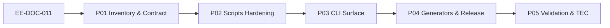

# EE-DOC-011 — Automation

Este documento sigue el estándar **EE-DOC-002 — Document Design Template** y se desarrolla conforme al ciclo documental definido por **EE-DOC-005 — Development Workflow**.

---

## METADATOS

| Campo                 | Valor                                                                                                                                                                  |
| :-------------------- | :--------------------------------------------------------------------------------------------------------------------------------------------------------------------- |
| **ID**                | EE-DOC-011                                                                                                                                                             |
| **Documento**         | Automation                                                                                                                                                             |
| **Código corto**      | EE-DOC-011                                                                                                                                                             |
| **Tipo**              | Documento Normativo                                                                                                                                                    |
| **Clasificación**     | Especializado                                                                                                                                                          |
| **Nivel**             | Especializado                                                                                                                                                          |
| **Normativo**         | Sí                                                                                                                                                                     |
| **Versión**           | v1.1.0                                                                                                                                                                 |
| **Estado**            | Congelado                                                                                                                                                              |
| **Propietario**       | Equipo de Arquitectura                                                                                                                                                 |
| **Documento padre**   | EE-DOC-006 — Repository Structure                                                                                                                                      |
| **Dependencias**      | EE-DOC-001, EE-DOC-002, EE-DOC-003, EE-DOC-004, EE-DOC-005, EE-DOC-006, EE-DOC-007, EE-DOC-008, EE-DOC-009, EE-DOC-010, EE-ADR-001, EE-ADR-002, EE-ADR-003, EE-ADR-004 |
| **Aprobado por**      | Equipo de Arquitectura                                                                                                                                                 |
| **Audiencia**         | Arquitectura, Desarrollo, DevOps, QA, IA                                                                                                                               |
| **Fecha de creación** | 2026-09-30                                                                                                                                                             |
| **Última revisión**   | 2026-10-01                                                                                                                                                             |
| **Próxima revisión**  | 2026-12-30                                                                                                                                                             |

> **Jerarquía documental (patrón alineado a EE-DOC-010):**
>
> | Relación                            | Documento                              | Significado                                                                 |
> | :---------------------------------- | :------------------------------------- | :-------------------------------------------------------------------------- |
> | **Padre estructural**               | EE-DOC-006                             | Estructura del monorepo (`scripts/`, `apps/cli`, contrato de comandos root) |
> | **Precedente de roadmap**           | EE-DOC-010                             | Orden de la serie Fase 3 (EE-DOC-001); no es padre estructural              |
> | **Dependencia de contenido**        | EE-DOC-010                             | Catálogo de gates, Severity, Availability, agregación                       |
> | **Otras dependencias de contenido** | EE-DOC-005, 007, 008, 009, ADR-001…004 | Workflow, CI, entorno, infra, orquestación                                  |

---

## 01. Propósito

Este documento define la **norma de automatización de ingeniería del Engineering Ecosystem** para el monorepo `ee-monorepo`: qué se automatiza, dónde vive cada clase de automatización, cómo se invoca y cómo se relaciona con Quality Gates, CI de plataforma y el entorno local.

Establece:

- la frontera entre **automatización de ingeniería del monorepo / EE** (este documento) y **automatización de plataforma GitHub** (EE-DOC-007);
- el contrato de **comandos root** (EE-DOC-006 §12) y scripts bajo `scripts/`;
- el rol de **`@eq-labs/cli`** (`apps/cli`) como punto de entrada de DX del ecosistema de ingeniería;
- generadores, bootstrap, release del monorepo y limpieza como capacidades automatizadas;
- principios de **Automation First**, **Reproducibility** y **mínimo privilegio**.

**Separación de SSOT:**

| Documento      | SSOT de                                                                                                                        |
| :------------- | :----------------------------------------------------------------------------------------------------------------------------- |
| **EE-DOC-010** | **Single Source of Validation** — catálogo de gates, IDs, Severity, Availability, Result, agregación                           |
| **EE-DOC-011** | **Punto único de invocación de automatización de ingeniería** — comandos root, `scripts/`, CLI, generate, release del monorepo |
| **EE-DOC-007** | Enforcement y workflows de **plataforma GitHub**                                                                               |

**EE-DOC-010** define **qué** debe validarse; **EE-DOC-011** define **cómo** se orquestan e invocan los mecanismos de ingeniería que materializan o apoyan esas validaciones y el ciclo de desarrollo. **EE-DOC-007** determina **qué mecanismos invoca CI** sin redefinir el contrato de 011 ni el catálogo de 010.

---

## 02. Alcance

### 02.1. Incluye

| Dominio                                   | Descripción                                                                 |
| :---------------------------------------- | :-------------------------------------------------------------------------- |
| **Scripts root**                          | Comandos `pnpm run *` materializados en `scripts/`                          |
| **Comandos root A-REL sin script propio** | `changeset`, `version-packages` (CLI Changesets; EE-DOC-006 §12)            |
| **CLI de ingeniería del ecosistema**      | `@eq-labs/cli` en `apps/cli`                                                |
| **Generación de código/artefactos**       | `pnpm run generate` / Plop y convenciones asociadas                         |
| **Bootstrap y doctor**                    | Arranque y diagnóstico del entorno (coordinación con EE-DOC-008)            |
| **Release del monorepo / paquetes EE**    | Changesets + `scripts/release` (no release comercial de Product Ecosystems) |
| **Contrato de estabilidad**               | Nombres, efectos, terminación, exit codes y `scripts/README.md`             |
| **Fronteras y prohibiciones**             | Qué no debe automatizarse aquí vs 007 / 010 / 012                           |

### 02.2. No incluye

| Dominio                                                                      | Documento responsable                                           |
| :--------------------------------------------------------------------------- | :-------------------------------------------------------------- |
| Workflows `.github/workflows`, branch protection, secrets de plataforma      | **EE-DOC-007**                                                  |
| Catálogo de Quality Gates, Severity, Availability, agregación                | **EE-DOC-010**                                                  |
| Dev Containers, extensiones de editor, baseline Node/pnpm (norma de entorno) | **EE-DOC-008**                                                  |
| Manifiestos IaC / containers de despliegue                                   | **EE-DOC-009**                                                  |
| Plantillas documentales y scaffolding normativo de docs                      | **EE-DOC-012** (futuro; este doc no lo sustituye)               |
| Lógica comercial / release de Product Ecosystems o Business Applications     | Fuera del alcance normativo de EE-LABS open source (EE-DOC-004) |

### 02.3. Frontera 007 ↔ 010 ↔ 011 (normativa)

```text
EE-DOC-010 (norma de validación)
  └── qué gates existen, Severity, Availability, Result, agregación

EE-DOC-011 (automatización de ingeniería)
  └── scripts/, apps/cli, generate, bootstrap, release monorepo, contrato pnpm run *

EE-DOC-007 (plataforma GitHub)
  └── jobs, events, permissions, required checks
  └── invoca mecanismos definidos por 011 (p.ej. pnpm run lint|…|validate)
  └── no redefine contratos de comandos ni catálogo de gates
```

### 02.4. Consumidores posteriores (posicionamiento)

| Documento (roadmap)         | Relación esperada con 011                                               |
| :-------------------------- | :---------------------------------------------------------------------- |
| **EE-DOC-012** Templates    | Consumirá `generate` / convenciones de scaffolding                      |
| **EE-DOC-013** AI Ecosystem | Podrá usar CLI/scripts como puntos de entrada de DX                     |
| **EE-DOC-014** Knowledge    | Podrá añadir automatización de sincronización vía comandos root futuros |
| **EE-DOC-015** Validation   | Validará conformidad e2e del ecosistema incluyendo automatización       |

Las interfaces públicas de 011 (comandos root, CLI) deben permanecer estables y documentadas; el detalle de esos documentos futuros **no** se fija aquí.

**EE-DOC-011 no depende operativamente de EE-DOC-015** (ni de 012–014) mientras esos documentos no estén aprobados; la tabla anterior es solo posicionamiento de roadmap.

---

## 03. Principios de Automatización

### 03.1. Principios del ecosistema (aplicados a 011)

Derivados de **EE-DOC-003** y aplicables con especial fuerza a la automatización:

| #   | Principio                          | Aplicación en 011                                           |
| :-- | :--------------------------------- | :---------------------------------------------------------- |
| 1   | **Automation First**               | Tareas repetibles seguras se automatizan                    |
| 2   | **Configuration over Code**        | Preferir `packages/config/` y convenciones a lógica ad hoc  |
| 3   | **Vendor Agnostic**                | Plop/Changesets/Turbo son mecanismos, no acoplamiento cloud |
| 4   | **Security by Design**             | Sin secretos en scripts ni argumentos versionados           |
| 5   | **AI Assisted, Human Accountable** | La IA propone; ownership y aprobación siguen 005/007        |
| 6   | **Quality by Default**             | Scripts materializan 010; no inventan gates                 |

### 03.2. Principios específicos de 011

| #   | Principio                       | Descripción                                                                                                                                                                                                                           |
| :-- | :------------------------------ | :------------------------------------------------------------------------------------------------------------------------------------------------------------------------------------------------------------------------------------ |
| 7   | **Single Source of Invocation** | Cada capacidad tiene un **mecanismo canónico** definido por este documento; los **comandos root** son la interfaz canónica de ingeniería; `@eq-labs/cli` puede actuar como **fachada de DX** sin duplicar el mecanismo ni su contrato |
| 8   | **Exit Code First**             | Contrato de éxito/fallo = código de salida, no parsing frágil de stdout                                                                                                                                                               |
| 9   | **No Silent Divergence**        | Scripts no alteran umbrales de QG; cambios de comportamiento se documentan                                                                                                                                                            |
| 10  | **Reproducibility**             | Bajo condiciones equivalentes: mismas entradas, efectos y códigos de salida esperables                                                                                                                                                |
| 11  | **Contractual Determinism**     | Ver §05.2 (no exige salida idéntica byte a byte en procesos interactivos o long-running)                                                                                                                                              |

---

## 04. Clasificación de Automatizaciones

### 04.1. Categorías

| ID         | Categoría                            | Ubicación típica               | Invocación                                                        |
| :--------- | :----------------------------------- | :----------------------------- | :---------------------------------------------------------------- |
| **A-ROOT** | Scripts de orquestación del monorepo | `scripts/`                     | `pnpm run <name>`                                                 |
| **A-CLI**  | CLI de ingeniería del ecosistema     | `apps/cli` (`@eq-labs/cli`)    | binario / filter workspace                                        |
| **A-GEN**  | Generadores                          | `scripts/generate`, Plop       | `pnpm run generate`                                               |
| **A-REL**  | Versionado y release del monorepo    | Changesets + `scripts/release` | `pnpm changeset`, `pnpm run version-packages`, `pnpm run release` |
| **A-PLAT** | CI / Actions                         | `.github/workflows`            | Eventos GitHub — **norma EE-DOC-007**                             |

Solo **A-ROOT**, **A-CLI**, **A-GEN** y **A-REL** son objeto principal de este documento. **A-PLAT** se referencia como consumidor.

### 04.2. Comandos root normativos (contrato alineado a EE-DOC-006 §12)

| Comando            | Implementación        | Propósito                                                         | Categoría    |
| :----------------- | :-------------------- | :---------------------------------------------------------------- | :----------- |
| `bootstrap`        | `scripts/bootstrap`   | Configuración inicial del entorno                                 | A-ROOT / 008 |
| `build`            | `scripts/build`       | Compilación de workspaces                                         | A-ROOT       |
| `dev`              | `scripts/dev`         | Desarrollo local (long-running)                                   | A-ROOT / 008 |
| `test`             | `scripts/test`        | Pruebas orquestadas                                               | A-ROOT       |
| `lint`             | `scripts/lint`        | Análisis estático                                                 | A-ROOT       |
| `format`           | `scripts/format`      | Formateo en modo **write** (herramienta local; **no** es el gate) | A-ROOT       |
| `typecheck`        | `scripts/typecheck`   | Verificación de tipos                                             | A-ROOT       |
| `validate`         | `scripts/validate`    | Agregador local de validaciones                                   | A-ROOT       |
| `doctor`           | `scripts/doctor`      | Diagnóstico de entorno (conveniencia; no sustituye `validate`)    | A-ROOT / 008 |
| `generate`         | `scripts/generate`    | Scaffolding                                                       | A-GEN        |
| `release`          | `scripts/release`     | Orquestación de release del monorepo                              | A-REL        |
| `clean`            | `scripts/clean`       | Limpieza de artefactos                                            | A-ROOT       |
| `changeset`        | CLI `@changesets/cli` | Declaración interactiva de cambios SemVer                         | A-REL        |
| `version-packages` | `changeset version`   | Cálculo y actualización de versiones                              | A-REL        |

**Notas:**

1. `changeset` y `version-packages` **no** requieren archivo bajo `scripts/`; se invocan vía Changesets según EE-DOC-006 §12.
2. Añadir, deprecar o renombrar un comando root exige actualizar **este documento (§04.2)**, `package.json` y **`scripts/README.md` en la misma ola**.
3. `format` (write) ≠ Quality Gate de formato (EE-DOC-010: modo **check** vía `validate`).
4. Availability y Severity de cada gate viven **solo** en EE-DOC-010; esta tabla no las duplica.
5. **Scripts con mutación de estado** (p.ej. `format` write, `clean`, `bootstrap`): cuando materialicen o apoyen un Quality Gate, CI debe disponer del **equivalente estricto de verificación** (p.ej. Prettier `--check` dentro de `validate`), no solo de la variante que reescribe el árbol. Las mutaciones operativas legítimas (`clean`, `bootstrap`) no se tratan como gates.

---

## 05. Scripts Root (`scripts/`)

### 05.1. Responsabilidad

`scripts/` materializa la automatización de orquestación del monorepo. **Review ownership** (quién debe aprobar cambios en PRs): patrones **CODEOWNERS** definidos conforme a **EE-DOC-007**. La responsabilidad de diseño normativo de automatización permanece en el Equipo de Arquitectura (este documento).

### 05.2. Contrato de ejecución (determinismo contractual)

Un script invocado por `package.json` debe tener **documentados**:

| Elemento              | Descripción                                     |
| :-------------------- | :---------------------------------------------- |
| **Entradas**          | Flags, env relevantes, precondiciones           |
| **Efectos**           | Qué modifica (filesystem, locks, nada)          |
| **Terminación**       | Finito vs long-running; cómo se detiene         |
| **Códigos de salida** | 0 = éxito del contrato del comando; ≠ 0 = fallo |

**No** se exige salida idéntica byte a byte. En particular:

- `dev` — proceso long-running;
- `generate` / `changeset` — pueden ser interactivos;
- `bootstrap` / `clean` / `release` — modifican estado bajo precondiciones.

Bajo **condiciones equivalentes**, el resultado contractual (éxito/fallo y efectos declarados) debe ser reproducible.

### 05.3. Documentación del contrato — norma vs README

| Artefacto                      | Rol                                                                                              |
| :----------------------------- | :----------------------------------------------------------------------------------------------- |
| **EE-DOC-011 §04.2**           | **Norma** del conjunto de comandos root                                                          |
| **`scripts/README.md`**        | Documentación operativa **derivada** (flags, ejemplos). **No** es fuente normativa independiente |
| **`package.json` → `scripts`** | Materialización de invocación                                                                    |

No debe haber conflicto entre §04.2 y `scripts/README.md`. Ante divergencia, prevalece este documento hasta sincronización gobernada.

### 05.4. Mapeo contractual: comandos → Quality Gates

Los scripts **materializan** gates definidos en EE-DOC-010; no los definen. Availability = estado vigente en 010.

#### 05.4.1. Comandos root que materializan o agregan gates

| Comando root                   | Gate(s) materializado(s) (IDs)                                                                                            | Contrato de resultado (resumen)                         |
| :----------------------------- | :------------------------------------------------------------------------------------------------------------------------ | :------------------------------------------------------ |
| `typecheck`                    | QG-TYPE-001                                                                                                               | exit ≠ 0 → FAIL del mecanismo                           |
| `lint`                         | QG-LINT-001                                                                                                               | exit ≠ 0 → FAIL                                         |
| `format` (write)               | — (herramienta local)                                                                                                     | No es gate; no sustituye verificación en CI             |
| check de formato en `validate` | QG-FMT-001                                                                                                                | Equivalente **check** (sin reescritura)                 |
| `test`                         | QG-TEST-001                                                                                                               | 0 tasks → **SKIPPED** (no PASS); con tareas → PASS/FAIL |
| `build`                        | QG-BUILD-001                                                                                                              | exit ≠ 0 → FAIL                                         |
| `validate`                     | Agregador de mecanismos ACTIVE aplicables (TYPE, LINT, FMT, TEST, BUILD, SEC-001, ARCH, DOC-\*, REPO, INFRA, … según 010) | Agregación conforme a **EE-DOC-010 §04.8**              |

#### 05.4.2. Gates cuyo enforcement depende de plataforma o de subpasos internos de `validate`

| Mecanismo                                                      | Gate(s)                                           | Norma de enforcement                                                      |
| :------------------------------------------------------------- | :------------------------------------------------ | :------------------------------------------------------------------------ |
| Job CI / secret scanning / Gitleaks (plataforma)               | QG-SEC-002                                        | **EE-DOC-007** + catálogo **EE-DOC-010** (no es un comando root dedicado) |
| Subpasos de estructura/docs/infra dentro de `scripts/validate` | QG-REPO-001, QG-ARCH-001, QG-DOC-\*, QG-INFRA-001 | Implementación en `validate`; IDs y umbrales en **010**                   |

### 05.5. Reglas de invocación

**Regla:** Todo mecanismo que materialice un Quality Gate **ACTIVE** debe disponer de una **invocación canónica documentada** en este documento (comando root o subpaso documentado de `validate`). **CI debe consumir esa invocación canónica** — directamente (`pnpm run <cmd>`) o mediante `pnpm run validate` — conforme a la **composición del job definida por EE-DOC-007**, de modo que el exit code alimente el contrato de 010.

| Contexto             | Permitido                                                                        | No permitido                                                                                          |
| :------------------- | :------------------------------------------------------------------------------- | :---------------------------------------------------------------------------------------------------- |
| **CI (formal)**      | Invocación canónica de 011 (`pnpm run …` / `validate`) según composición **007** | Sustituir el gate por invocación ad hoc no documentada (p.ej. `vitest` suelto como único “test gate”) |
| **Scripts root**     | Orquestar Turbo/pnpm **dentro** de `scripts/*`                                   | —                                                                                                     |
| **Desarrollo local** | Herramientas directas (eslint, vitest, turbo) para DX                            | Presentar ese uso ad hoc como evidencia formal de gate sin la invocación canónica                     |

**011 define el contrato de invocación; 007 decide la composición del job.**

### 05.6. Límites arquitectónicos (EE-DOC-006)

1. Generadores no crean árboles de primer nivel fuera del permitido por 006.
2. Artefactos generados respetan namespace `@eq-labs/…` y convenciones de 006.
3. `validate` contribuye a QG-REPO-001 / QG-ARCH-001 según 010 (no se redefine la matriz de capas aquí).

---

## 06. CLI del Ecosistema (`@eq-labs/cli`)

### 06.1. Rol

`apps/cli` es el punto de entrada de **DX de ingeniería del ecosistema**. Complementa, no reemplaza, los comandos root (`pnpm run validate`, etc.).

### 06.2. Normas

1. Pertenece al workspace; runtime Node ≥ 24 (EE-ADR-003).
2. Si dispara validaciones, **delega** en la invocación canónica (comandos root / mecanismos existentes); **no** reimplementa umbrales ni lógica de agregación de **EE-DOC-010**.
3. Opera bajo la **misma jerarquía de configuración** del monorepo (**SSOT en `packages/config/`**); el binario **no** redefine de forma arbitraria flags globales de validación ni umbrales de Quality Gates.
4. Evolución de superficie de comandos: IMP de 011; si el cambio afecta el **modelo o contrato público de DX**, descubrimiento Type B/C y **ADR o RFC** según alcance (EE-DOC-005 §04).
5. Baseline existente en monorepo: P03 **alinea y documenta** el CLI actual; no asume greenfield obligatorio con RFC previo.

### 06.3. Matriz de responsabilidades: scripts vs CLI

| Concepto                                    | `scripts/` (ingeniería)               | `@eq-labs/cli` (DX)     | Regla                                                                |
| :------------------------------------------ | :------------------------------------ | :---------------------- | :------------------------------------------------------------------- |
| Validación monorepo                         | **Propietario** (`pnpm run validate`) | Puede invocar / resumir | CLI no reimplementa gates                                            |
| Generación                                  | Mecanismo (`pnpm run generate`)       | Puede ofrecer UX        | Mismo generador subyacente                                           |
| Release / versionado                        | Changesets + `release`                | Puede invocar           | Changesets = verdad de versiones                                     |
| Doctor                                      | **Propietario**                       | Puede exponer           | No sustituye `validate`                                              |
| **Decisión de ubicación** (¿scripts o CLI?) | Mecanismo canónico en root/`scripts/` | Solo fachada DX         | Nueva capacidad: mecanismo en 011/root; CLI no sustituye el canónico |

### 06.4. Nivel de abstracción (orientación)

CLI puede ofrecer una UX de mayor nivel (resúmenes, flujos guiados). **No** debe convertirse en un segundo catálogo de gates ni exponer como norma flags internos de herramientas de forma que compita con `packages/config/`. El detalle de UX se materializa en IMP/ADR si hace falta, no como lista exhaustiva en este documento.

---

## 07. Generadores (A-GEN)

### 07.1. Propósito

Creación consistente de paquetes, conectores, apps u artefactos alineados a EE-DOC-006 y, en el futuro, EE-DOC-012.

### 07.2. Normas

1. Entrada oficial: `pnpm run generate` (mecanismo actual: Plop).
2. Artefactos: namespace `@eq-labs/…`, árbol y naming de 006.
3. La generación no exime de QG ni de revisión (005 / 007).
4. Cambio de herramienta de generación: Type B en IMP, o ADR si cambia el modelo de scaffolding del ecosistema.

---

## 08. Release y Versionado (A-REL)

### 08.1. Alcance

Automatización de **versionado y release de paquetes del monorepo Engineering Ecosystem**, no de productos comerciales externos.

| Elemento               | Norma                                                                          |
| :--------------------- | :----------------------------------------------------------------------------- |
| **Changesets**         | Mecanismo de declaración SemVer y versionado (`changeset`, `version-packages`) |
| **`pnpm run release`** | Orquestación de release a nivel root                                           |
| **Changelog**          | Trazabilidad de versiones publicables del monorepo                             |

### 08.2. Normas

1. No se publica una versión que no haya pasado el conjunto de gates **ACTIVE** aplicables (010 + enforcement 007).
2. Scripts de release no omiten validación por conveniencia.
3. Acceso a recursos GitHub protegidos (branches, secrets, environments): solo con permisos y mecanismos autorizados en **EE-DOC-007**; sin escalada implícita.

---

## 09. Relación con CI y Quality Gates

```text
EE-DOC-010  →  define gates + agregación
EE-DOC-011  →  define comandos/mecanismos y su contrato
EE-DOC-007  →  elige qué mecanismos invoca el job CI
```

| Regla  | Descripción                                                                                                                                   |
| :----- | :-------------------------------------------------------------------------------------------------------------------------------------------- |
| **R1** | CI no redefine el catálogo de gates (010).                                                                                                    |
| **R2** | Scripts no relajan umbrales normativos de 010.                                                                                                |
| **R3** | Paridad local ↔ CI: mismos comandos root cuando el entorno cumple EE-DOC-008.                                                                |
| **R4** | `doctor` no sustituye `validate` ni el required check de plataforma.                                                                          |
| **R5** | **011** define la invocación canónica; **007** define la composición del job (desglose y/o `validate`), siempre consumiendo contratos de 011. |

---

## 10. Seguridad de la Automatización

| #   | Requisito                                                                                                |
| :-- | :------------------------------------------------------------------------------------------------------- |
| 1   | Sin secretos en repositorio ni en logs de scripts (007 / 009).                                           |
| 2   | Preferir invocación con argumentos controlados; reducir `shell:true` innecesario (mejora Type B en IMP). |
| 3   | Release/generate no escalan privilegios GitHub por sí solos.                                             |
| 4   | Tooling de automatización sujeto a QG-SEC-001 cuando ACTIVE.                                             |

### 10.1. Integración con EE-DOC-007

Toda automatización de 011 que acceda a recursos GitHub protegidos debe:

1. Estar autorizada por permisos/workflows/CODEOWNERS de **007**.
2. Usar credenciales declaradas en 007 (p.ej. `GITHUB_TOKEN`, secrets de repo/org).
3. No asumir roles administrativos amplios.
4. Respetar Rulesets y required checks.

Cambios de permiso necesarios se coordinan con 007 en la misma ola de implementación.

---

## 11. Prohibiciones

| #   | Prohibición                                                                                                         | Principio                   |
| :-- | :------------------------------------------------------------------------------------------------------------------ | :-------------------------- |
| 1   | Duplicar el catálogo de Quality Gates de 010                                                                        | SSOT 010                    |
| 2   | Definir workflows GitHub Actions como norma de 011                                                                  | Frontera 007                |
| 3   | Tratar `pnpm run format` (write) como gate de formato                                                               | 010 / FMT                   |
| 4   | Declarar PASS de un gate PENDING (No False Pass)                                                                    | 010 / ADR-004               |
| 5   | Introducir comandos root no documentados en §04.2                                                                   | Documentación / contrato    |
| 6   | Automatizar merges a `main` eludiendo rulesets/reviews                                                              | 007                         |
| 7   | Cambiar umbrales de gates desde scripts sin actualizar 010                                                          | No Silent Divergence        |
| 8   | Forzar exit 0 ante error detectado (stdout frágil)                                                                  | Exit Code First             |
| 9   | En CI formal, sustituir comandos root de gate por herramientas ad hoc no documentadas                               | Single Source of Invocation |
| 10  | Secretos en scripts o argumentos versionados                                                                        | Security by Design          |
| 11  | En CI formal, usar solo la variante **write** de un formateador/mutador cuando el gate exige verificación **check** | OBS-01 / FMT                |

---

## 12. Plan de Implementación y Fases

> Ciclo: Documento → Implementación por fases → Validación → Documentación Técnica → Congelación (EE-DOC-005).



### 12.1. Catálogo de fases

| Fase    | Identificador                  | Propósito                                                                                        | Entregable                      |
| :------ | :----------------------------- | :----------------------------------------------------------------------------------------------- | :------------------------------ |
| **P01** | Inventory and Command Contract | Inventario as-built `scripts/` + `package.json` vs §04.2; alinear `scripts/README.md`            | EE-IMP-011-P01                  |
| **P02** | Scripts Hardening              | Exit codes, mensajes QG, deuda técnica (p.ej. shell)                                             | EE-IMP-011-P02                  |
| **P03** | CLI Surface                    | Alinear `@eq-labs/cli` existente a §06; documentar superficie                                    | EE-IMP-011-P03                  |
| **P04** | Generators and Release         | Audit generate + A-REL frente a 006/010                                                          | EE-IMP-011-P04                  |
| **P05** | Validation and Closure         | Evidencia integral; **EE-TEC-006** (Documentación Técnica Consolidada de 011); cierre documental | EE-IMP-011-P05 + **EE-TEC-006** |

### 12.2. Especificaciones mínimas por unidad (EE-IMP-011-PXX)

Cada IMP documentará: propósito, artefactos, QG aplicables, restricciones, dependencias, criterios de aceptación, evidencia, descubrimientos (005 §04).

| Fase | Criterios de aceptación (resumen)                                       |
| :--- | :---------------------------------------------------------------------- |
| P01  | Tabla §04.2 ↔ realidad sin gaps no justificados; README sincronizado   |
| P02  | Comandos de gate con contrato de exit code verificable; `validate` PASS |
| P03  | CLI documentado; delegación a root sin reimplementar gates              |
| P04  | generate respeta 006; release no omite validación ACTIVE                |
| P05  | Pruebas + **EE-TEC-006**; sin descubrimientos Adoptados abiertos        |

### 12.3. Riesgo P03 — alineación vs cambio arquitectónico

| Situación                                                                                 | Tratamiento                                                                               |
| :---------------------------------------------------------------------------------------- | :---------------------------------------------------------------------------------------- |
| **Alineación** del `@eq-labs/cli` existente a §06 (documentar superficie, delegar a root) | Alcance normal de **EE-IMP-011-P03**                                                      |
| **Cambio de modelo** o del **contrato público de DX** del CLI                             | Descubrimiento **EE-DOC-005 §04** Type B o C; **ADR** o **RFC** según alcance transversal |

**No** se exige RFC/ADR de CLI como prerequisito de **aprobación** de este documento.

---

## 13. Evolución y gobernanza de descubrimientos

| Tipo de cambio                                       | Mecanismo                                            |
| :--------------------------------------------------- | :--------------------------------------------------- |
| Aclaración de redacción                              | Type A                                               |
| Nuevo comando root / cambio de contrato de exit code | Type B + actualización §04.2 + README + package.json |
| Cambio de modelo CLI o generador del ecosistema      | ADR si es decisión arquitectónica (005 §04 Type C)   |
| Cambio transversal de estructura                     | RFC si impacta 006 u otros congelados                |

Durante IMP / TEC / Validación / Congelación de 011, los descubrimientos se gestionan según **EE-DOC-005 §04** (Rechazado | Diferido | Adoptado → A/B/C/D). **No** se congela 011 con descubrimientos Adoptados sin resolver.

---

## 14. Cumplimiento

| Control              | Descripción                                                                                                                                                           |
| :------------------- | :-------------------------------------------------------------------------------------------------------------------------------------------------------------------- |
| **Inventario**       | Comandos §04.2 presentes en `package.json` (y `scripts/` cuando aplique)                                                                                              |
| **README**           | `scripts/README.md` alineado a §04.2                                                                                                                                  |
| **Sincronización**   | Todo cambio en `scripts/`, `package.json` (scripts) o `scripts/README.md` que afecte el contrato root debe ir en la **misma ola** con evidencia de alineación a §04.2 |
| **Validate**         | `pnpm run validate` materializa gates ACTIVE sin contradecir 010                                                                                                      |
| **CI**               | Job de plataforma consume invocaciones canónicas de 011 sin redefinir catálogo 010                                                                                    |
| **Review ownership** | CODEOWNERS sobre `scripts/` y `apps/cli` (EE-DOC-007)                                                                                                                 |
| **006**              | generate/validate respetan estructura autorizada                                                                                                                      |
| **CLI**              | No redefine umbrales QG ni flags globales fuera de `packages/config/`                                                                                                 |

Incumplimiento de un comando root que materializa un gate ACTIVE → agregación **EE-DOC-010 §04.8**.

---

## 15. Referencias

| Código                 | Documento                                          | Relación                                   |
| :--------------------- | :------------------------------------------------- | :----------------------------------------- |
| **EE-DOC-001**         | Master Documentation Index                         | Roadmap y códigos                          |
| **EE-DOC-002**         | Document Design Template                           | Plantilla                                  |
| **EE-DOC-003**         | Constitution                                       | Principios del ecosistema                  |
| **EE-DOC-004**         | Engineering Architecture                           | Frontera EE-LABS vs Product Ecosystems     |
| **EE-DOC-005**         | Development Workflow                               | Ciclo documental; §04 descubrimientos      |
| **EE-DOC-006**         | Repository Structure                               | Padre estructural; §12 comandos root       |
| **EE-DOC-007**         | GitHub Governance                                  | CI, permisos, secrets de plataforma        |
| **EE-DOC-008**         | Development Environment                            | Bootstrap, doctor, paridad local           |
| **EE-DOC-009**         | Infrastructure                                     | Secretos de runtime / infra                |
| **EE-DOC-010**         | Quality Gates                                      | SSOT de validación (catálogo y agregación) |
| **EE-ADR-001**         | Workspace Task Orchestration                       | Turbo / pnpm                               |
| **EE-ADR-002**         | Testing Standard                                   | Vitest / Playwright                        |
| **EE-ADR-003**         | Node 24 LTS                                        | Runtime                                    |
| **EE-ADR-004**         | Progressive Adoption                               | Mandatory ≠ ACTIVE ≠ Enforced              |
| **EE-IMP-011-P01…P05** | Fases de implementación                            | Evidencia as-built                         |
| **EE-TEC-006**         | Consolidated Technical Documentation of EE-DOC-011 | Documentación técnica consolidada          |

---

## 16. Historial de Cambios

| Versión    | Fecha      | Autor                  | Aprobado por           | Motivo                         | Cambios                                                                                                                                                                                                                    | Estado        |
| :--------- | :--------- | :--------------------- | :--------------------- | :----------------------------- | :------------------------------------------------------------------------------------------------------------------------------------------------------------------------------------------------------------------------- | :------------ |
| **v0.1.0** | 2026-09-30 | Equipo de Arquitectura | —                      | Apertura EE-DOC-011            | Borrador inicial                                                                                                                                                                                                           | Borrador      |
| **v0.2.0** | 2026-09-30 | Equipo de Arquitectura | —                      | Revisión arquitectónica        | Padre 006; changeset/version-packages; SSOT local vs 010; terminología ingeniería EE; determinismo contractual; CI consume 011; mapeo gates; matriz CLI; prohibiciones; plan P01–P05; refs completas; README inequívoco    | Borrador      |
| **v0.3.0** | 2026-09-30 | Equipo de Arquitectura | —                      | Observaciones residuales       | Invocación canónica vs fachada DX; CI consume canónico (007 compone); §05.4 separada comando/plataforma; mutación vs check; CLI y packages/config; ownership review; EE-TEC-006; P03 alineación vs ADR; sync §14; nota 015 | Borrador      |
| **v1.0.0** | 2026-09-30 | Equipo de Arquitectura | Equipo de Arquitectura | Aprobación arquitectónica      | Norma de Automation aprobada; listo para EE-IMP-011-P01                                                                                                                                                                    | Aprobado      |
| **v1.1.0** | 2026-10-01 | Equipo de Arquitectura | Equipo de Arquitectura | Validación Final y Congelación | EE-IMP-011-P01…P05 + EE-TEC-006 Completados; TEC-006 (no TEC-011); diferidos 012/backlog documentados                                                                                                                      | **Congelado** |

---

## 17. Cierre Documental

> Documento **Congelado** tras Validación Final. Evidencia: **EE-IMP-011-P01…P05** (Completado) y **EE-TEC-006** v1.1.0 (Completado).

### 17.1. Validación Final

| Campo             | Valor                                                                                                |
| :---------------- | :--------------------------------------------------------------------------------------------------- |
| **Fecha**         | 2026-10-01                                                                                           |
| **Responsable**   | Equipo de Arquitectura                                                                               |
| **Evidencia IMP** | EE-IMP-011-P01…P05 Completados (P04 v1.2.0; P05 v1.1.0)                                              |
| **Evidencia TEC** | **EE-TEC-006** v1.1.0 Completado                                                                     |
| **Resultado**     | **APROBADO** — as-built alineado a esta norma; sin descubrimientos Adoptados abiertos en alcance 011 |

### 17.2. Condiciones de congelación

| Condición                               | Estado                                                                                   |
| :-------------------------------------- | :--------------------------------------------------------------------------------------- |
| Norma Aprobada (v1.0.0)                 | ✅                                                                                       |
| EE-IMP-011-P01…P05                      | ✅ Completado                                                                            |
| EE-TEC-006                              | ✅ Completado v1.1.0                                                                     |
| Matriz de conformidad §04–§12 (TEC/P05) | ✅                                                                                       |
| Descubrimientos Adoptados abiertos      | ✅ Ninguno                                                                               |
| Diferidos legítimos documentados        | 🟡 EE-DOC-012 (templates); D-P04-005/006 (backlog no-gate) — **no bloquean** congelación |

### 17.3. Estado Final

| Campo                      | Valor                      |
| :------------------------- | :------------------------- |
| **Estado documental**      | **Congelado**              |
| **Versión**                | v1.1.0                     |
| **Validado**               | ✅ 2026-10-01              |
| **Congelación**            | ✅ 2026-10-01              |
| **Próximo hito normativo** | **EE-DOC-012** — Templates |

### 17.4. Dictamen

> La automatización de ingeniería del monorepo (`scripts/`, contrato root, CLI fachada, generate/release) está **implementada, validada y documentada**.  
> EE-DOC-011 **v1.1.0 Congelado** es fuente de verdad normativa de Automation hasta un cambio gobernado (EE-DOC-005).

---

## FIN DEL DOCUMENTO
