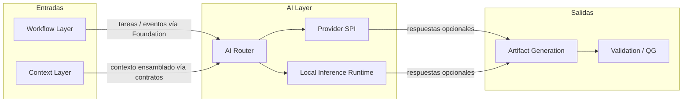
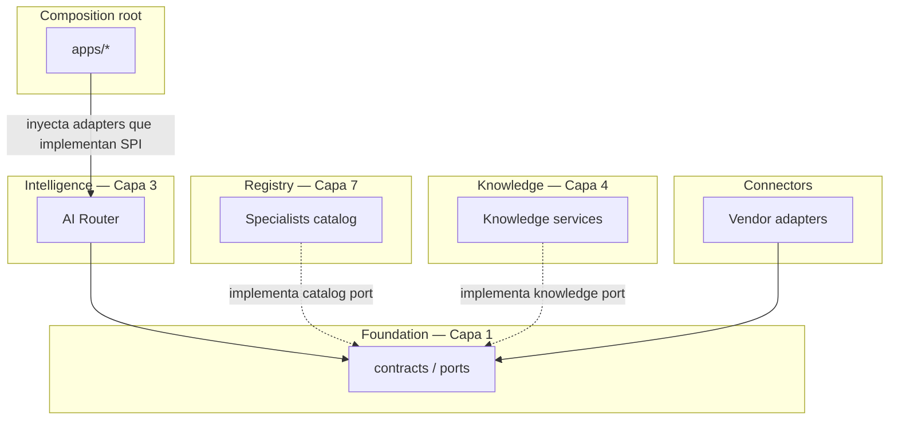
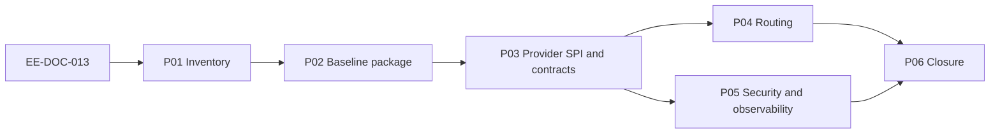

# EE-DOC-013 — AI Ecosystem

Este documento sigue el estándar **EE-DOC-002 — Document Design Template** y se desarrolla conforme al ciclo documental definido por **EE-DOC-005 — Development Workflow**.

> **Vigencia:** tipo **Documento Normativo** en estado **Congelado**. Normativo para implementación y merge conforme a EE-DOC-005. Implementación P01–P06 + EE-TEC-008 cerradas.

---

## METADATOS

| Campo                 | Valor                                                                                                                                                                                          |
| :-------------------- | :--------------------------------------------------------------------------------------------------------------------------------------------------------------------------------------------- |
| **ID**                | EE-DOC-013                                                                                                                                                                                     |
| **Documento**         | AI Ecosystem                                                                                                                                                                                   |
| **Código corto**      | EE-DOC-013                                                                                                                                                                                     |
| **Tipo**              | Documento Normativo                                                                                                                                                                            |
| **Clasificación**     | Especializado                                                                                                                                                                                  |
| **Nivel**             | Especializado                                                                                                                                                                                  |
| **Normativo**         | Sí                                                                                                                                                                                             |
| **Versión**           | v1.1.0                                                                                                                                                                                         |
| **Estado**            | Congelado                                                                                                                                                                                      |
| **Propietario**       | Equipo de Arquitectura                                                                                                                                                                         |
| **Documento padre**   | EE-DOC-004 — Engineering Architecture                                                                                                                                                          |
| **Dependencias**      | EE-DOC-001, EE-DOC-002, EE-DOC-003, EE-DOC-004, EE-DOC-005, EE-DOC-006, EE-DOC-007, EE-DOC-009, EE-DOC-010, EE-DOC-011, EE-DOC-012, EE-ADR-001, EE-ADR-002, EE-ADR-003, EE-ADR-004, EE-ADR-005 |
| **Aprobado por**      | Equipo de Arquitectura                                                                                                                                                                         |
| **Audiencia**         | Arquitectura, Desarrollo, DevOps, QA, IA                                                                                                                                                       |
| **Fecha de creación** | 2026-10-02                                                                                                                                                                                     |
| **Última revisión**   | 2026-10-03                                                                                                                                                                                     |
| **Próxima revisión**  | 2026-10-17                                                                                                                                                                                     |

> **Jerarquía documental:**
>
> | Relación                             | Documento                          | Significado                                                                                       |
> | :----------------------------------- | :--------------------------------- | :------------------------------------------------------------------------------------------------ |
> | **Padre estructural (conceptual)**   | EE-DOC-004                         | Define la **AI Layer** y sus fronteras (Context, Artifact, Validation, Governance)                |
> | **Precedente de roadmap**            | EE-DOC-012                         | Orden de la serie Fase 3 (EE-DOC-001); no es padre estructural                                    |
> | **Dependencia de estructura física** | EE-DOC-006                         | Ubicación normativa: **`packages/intelligence/`**, matriz de capas §13.2, `connectors/official/*` |
> | **Dependencia de contenido**         | EE-DOC-010, EE-DOC-011, EE-ADR-002 | Quality Gates, automatización y tests asistidos por IA                                            |
>
> **Nota sobre “Documento padre”:** a diferencia de EE-DOC-010/011/012 (padre estructural EE-DOC-006 por ser normas de repositorio/implementación física), EE-DOC-013 tiene **padre conceptual EE-DOC-004** porque su objeto primario es la **AI Layer** de la arquitectura de producto. EE-DOC-006 sigue siendo dependencia obligatoria de estructura y capas.
>
> **Artefacto (EE-DOC-001):** SSOT estructural = **`packages/intelligence/`** (EE-DOC-006 §05 / §08). **Prohibido** `packages/ai/` sin RFC.

---

## 01. Propósito

1. Gobernar la **AI Layer** (EE-DOC-004) bajo **Intelligence**, respetando la **matriz de dependencias EE-DOC-006 §13.2**.
2. Definir **dos planos** de alcance: (a) **runtime AI Layer**; (b) **desarrollo asistido por IA** (ADR-002 §26 / Constitución).
3. Imponer **Vendor Agnostic**, **AI Assisted Engineering** y **No Silent Divergence**.
4. Separar **contratos/tipos** (**Foundation**) de **orquestación** (Intelligence), **catálogos** (Registry) y **conocimiento** (Knowledge / EE-DOC-014).
5. Implementación **EE-IMP-013-PXX** y **EE-TEC-008** cerradas; no declarar capacidades ACTIVE sin evidencia.

---

## 02. Alcance

### 02.1. Planos de alcance

| Plano                              | Contenido                                                                                                          | Norma                                                                            |
| :--------------------------------- | :----------------------------------------------------------------------------------------------------------------- | :------------------------------------------------------------------------------- |
| **(a) Runtime — AI Layer**         | Router, SPI de provider, Inference/Generation API, local inference, evaluation de modelo, política de enrutamiento | Este documento §§04–09                                                           |
| **(b) Desarrollo asistido por IA** | Asistentes, prompts/reglas de autoría, generación/modificación de código y **tests**                               | §02.4 + EE-ADR-002 §26; la IA **no puede aprobar sus propios tests** ni el merge |

### 02.2. Dentro de alcance

| Dominio                                  | Descripción                                                                                        |
| :--------------------------------------- | :------------------------------------------------------------------------------------------------- |
| AI Layer normativa                       | Router, SPI providers, políticas, Local Inference Runtime (existencia conceptual)                  |
| Paquetes Intelligence                    | `packages/intelligence/` (EE-DOC-006 §05 / §08)                                                    |
| Contratos de invocación                  | Existencia, owner y ubicación de tipos en **Foundation**; detalle de schemas en **EE-IMP-013-P03** |
| Gobierno de uso                          | Human-in-the-loop; plano (b) mínimo                                                                |
| Seguridad y observabilidad de principios | Secretos, minimización, redacción, fail-safe                                                       |
| Relación QG/CI                           | IA no es gate; tests de **código** del router sí pueden ser QG-TEST                                |

### 02.3. Fuera de alcance

| Dominio                                                                               | Nota                                                           |
| :------------------------------------------------------------------------------------ | :------------------------------------------------------------- |
| Catálogo QG / agregación                                                              | EE-DOC-010                                                     |
| Scripts / CLI / generate                                                              | EE-DOC-011                                                     |
| Templates                                                                             | EE-DOC-012                                                     |
| Knowledge graph / Second Brain / embeddings de producto                               | EE-DOC-014                                                     |
| IaC plataforma                                                                        | EE-DOC-009                                                     |
| Branch protection                                                                     | EE-DOC-007                                                     |
| Vendor baseline comercial único                                                       | **ADR** futuro                                                 |
| Entrenamiento de modelos fundacionales                                                | Fuera de EE                                                    |
| Payloads Zod/OpenAPI completos, timeouts/retries numéricos, versionado fino de schema | **EE-IMP-013-P03** (especialización sobre tipos en Foundation) |
| MLOps completo / datasets de learning                                                 | Diferido con gobierno mínimo (§09.2)                           |
| Ubicación física exacta del Local Inference Runtime y deps nativas                    | **ADR posterior**; norma actual: **implementa el SPI**         |

### 02.4. Plano (b) — Desarrollo asistido (ADR-002)

| Regla     | Norma                                                                                                                                                       |
| :-------- | :---------------------------------------------------------------------------------------------------------------------------------------------------------- |
| **AD-01** | La IA puede **proponer** tests, código y docs; **no** puede marcar QG PASS ni aprobar PR/merge.                                                             |
| **AD-02** | Tests generados o modificados por IA se someten a la misma suite y gates que el resto (EE-ADR-002, EE-DOC-010).                                             |
| **AD-03** | **La IA no aprueba sus propios tests** (EE-ADR-002 §26).                                                                                                    |
| **AD-04** | Contenido de `marketplace/{agents,prompts,skills}` es **catálogo de activos**; **no** sustituye políticas versionadas de Intelligence ni el Router runtime. |

### 02.5. Estado de evolución (as-built)

| Hecho                                                 | Implicación                                                                      |
| :---------------------------------------------------- | :------------------------------------------------------------------------------- |
| Existe scaffold `@eq-labs/intelligence` (`export {}`) | **Baseline físico** para P01–P02                                                 |
| No hay Router/Providers funcionales en repo           | Este DOC describe **arquitectura objetivo**, no cumplimiento as-built de runtime |
| Evidencia de materialización                          | **EE-IMP-013** + **EE-TEC-008**                                                  |

---

## 03. Principios del AI Ecosystem

| #         | Principio                       | Implicación                                                                                                                                                                                                                              |
| :-------- | :------------------------------ | :--------------------------------------------------------------------------------------------------------------------------------------------------------------------------------------------------------------------------------------- |
| **AI-01** | AI Assisted Engineering         | Salida de modelo = **propuesta** hasta humano y/o gates                                                                                                                                                                                  |
| **AI-02** | Vendor Agnostic                 | Ningún vendor hard-coded como única implementación del SPI                                                                                                                                                                               |
| **AI-03** | Single Source of Truth          | QG, estructura y comandos no se redefinen por el modelo                                                                                                                                                                                  |
| **AI-04** | Security by Design              | **Sin secretos deliberadamente incorporados** en prompts/logs; datos de invocación sujetos a **minimización, redacción y políticas de observabilidad** (§09.3). No es garantía absoluta de ausencia accidental de secretos en un prompt. |
| **AI-05** | Reproducibilidad de **proceso** | Se registran **entradas + configuración** de invocación; **no** se exige salida bit-identical del modelo                                                                                                                                 |
| **AI-06** | Least privilege                 | Providers y conectores con mínimo alcance                                                                                                                                                                                                |
| **AI-07** | Separation of concerns          | Intelligence ≠ negocio de producto ≠ IaC                                                                                                                                                                                                 |
| **AI-08** | No Silent Divergence            | Cambio de contrato Router/SPI/provider → documentación IMP y **ADR/RFC según impacto** (explícito desde el diseño, no solo en fases)                                                                                                     |
| **AI-09** | Observability-ready             | Trazas correlacionables; default sin raw prompt/response (§09.3)                                                                                                                                                                         |
| **AI-10** | Fail safe                       | Fallo de provider → error controlado; **no** inventar éxito de gate ni de inferencia                                                                                                                                                     |
| **AI-11** | Tests herméticos en CI          | Suite de Intelligence en Validate: **sin** llamadas reales a providers ni secretos de modelo en el job                                                                                                                                   |

---

## 04. AI Layer — Fronteras arquitectónicas

### 04.1. Diagrama de flujo (EE-DOC-004)



> **AG-01:** Artifact Generation es **usable sin** invocar la AI Layer. La IA es productor **opcional** de entradas.

### 04.2. Matriz capas EE-DOC-004 ↔ EE-DOC-006 §13.2

| Concepto 004 | Categoría 006 | Capa | Intelligence puede **importar** paquete de…        |
| :----------- | :------------ | :--: | :------------------------------------------------- |
| AI Layer     | Intelligence  |  3   | **Foundation, Execution, Intelligence** únicamente |
| Knowledge    | Knowledge     |  4   | **No**                                             |
| Registry     | Registry      |  7   | **No**                                             |
| Governance   | Governance    |  5   | Política vía **contratos/eventos** de Foundation   |

**Inversión de dependencias (obligatoria):**



| Rol                                                        | Dónde vive                                                                                                                                                                                                          |
| :--------------------------------------------------------- | :------------------------------------------------------------------------------------------------------------------------------------------------------------------------------------------------------------------ |
| **SPI + tipos Inference/Generation/Error (SSOT de tipos)** | **`packages/foundation` (`contracts`)**                                                                                                                                                                             |
| **Puertos de catálogo, eventos, policy**                   | `packages/foundation`                                                                                                                                                                                               |
| **Implementación del catálogo de specialists**             | `packages/registry`                                                                                                                                                                                                 |
| **Implementación de consulta de conocimiento**             | `packages/knowledge` (EE-DOC-014)                                                                                                                                                                                   |
| **Router + orquestación de enrutamiento**                  | `packages/intelligence`                                                                                                                                                                                             |
| **Adapters vendor remotos**                                | `connectors/official/*`                                                                                                                                                                                             |
| **Composition root**                                       | **`apps/*`** (EE-DOC-006 §13.5); **un root efectivo por runtime**; registra/inyecta adapters (**EE-ADR-005** / PR-09). **`packages/sdk` no es composition root**                                                    |
| **Prohibido**                                              | `intelligence` → import de `registry`, `knowledge` o `connectors`                                                                                                                                                   |
| **Dependencia de un connector de provider**                | El connector depende en **runtime/contrato únicamente de Foundation**. Tooling: `packages/config/*` como `devDependency`. **Prohibido:** Intelligence, Registry, Knowledge, Execution, Governance, Integration, SDK |

Si Registry o Knowledge no están disponibles en runtime: el Router degrada según **AI-10** (error o modo degradado documentado en policy); **no** inventa catálogo paralelo silencioso.

### 04.3. Decision domains

| Dominio                                                                     | Responsable                                                              |
| :-------------------------------------------------------------------------- | :----------------------------------------------------------------------- |
| Enrutamiento runtime, orquestación del SPI, uso de Inference/Generation API | **Intelligence**                                                         |
| **SSOT de tipos** del SPI e Inference/Generation/Error                      | **Foundation (`contracts`)**                                             |
| Metadata de especialidades / specialists (SSOT de catálogo)                 | **Registry**                                                             |
| Ontología / grafo / second brain                                            | **Knowledge** (014)                                                      |
| Orquestación de tareas / workflows                                          | **Execution / Workflow**                                                 |
| Materialización de archivos artefactos                                      | **Artifact Generation** (+ humano/automation)                            |
| Conformidad de merge                                                        | **EE-DOC-010** + **EE-DOC-007**                                          |
| Activos marketplace                                                         | **marketplace/** — no política runtime                                   |
| **Wiring de providers**                                                     | **Composition root** (un efectivo por runtime; patrón → IMP-013-P03/P04) |

### 04.4. Componentes lógicos

| Componente                                 | Responsabilidad                                                                           | Materialización                                                                   |
| :----------------------------------------- | :---------------------------------------------------------------------------------------- | :-------------------------------------------------------------------------------- |
| **AI Router**                              | Modo/especialización + selección de provider según **puertos** Foundation                 | Intelligence                                                                      |
| **Provider SPI**                           | Interfaz Vendor Agnostic                                                                  | **Tipos SSOT: Foundation**; uso: Intelligence                                     |
| **Vendor adapters**                        | SDK/HTTP del proveedor externo                                                            | **`connectors/official/<name>`** (EE-ADR-005)                                     |
| **Local Inference Runtime**                | Ejecución local del SPI                                                                   | Ubicación física y deps nativas → **ADR posterior**; norma: **implementa el SPI** |
| **Context Layer (EE-DOC-004)**             | Ensamblado canónico de contexto de producto                                               | **Fuera** de Intelligence                                                         |
| **`intelligence/context` (blueprint 006)** | Adaptación/consumo de contexto **hacia** el Router; **no** es el SSOT de la Context Layer | Subdominio blueprint dentro de Intelligence                                       |
| **Complexity**                             | Señales de complejidad                                                                    | Intelligence                                                                      |
| **Evaluation**                             | Calidad de respuesta de modelo                                                            | Intelligence — **≠ QG-010**                                                       |
| **Learning**                               | Feedback/adaptación                                                                       | Diferido (§04.6)                                                                  |

### 04.5. Contratos de la AI Layer (existencia normativa)

| Contrato                                   | Owner de tipos (SSOT)        | Rol                                                |
| :----------------------------------------- | :--------------------------- | :------------------------------------------------- |
| **InferenceRequest / InferenceResponse**   | **Foundation (`contracts`)** | Inferencia (completion; embedding genérico §04.8)  |
| **GenerationRequest / GenerationResponse** | **Foundation (`contracts`)** | Generación hacia Artifact                          |
| **Provider SPI**                           | **Foundation (`contracts`)** | `invoke` / health / capacidades                    |
| **Error contract**                         | **Foundation (`contracts`)** | Fallos tipados                                     |
| **Policy contract**                        | **Foundation (`contracts`)** | Entrada de política                                |
| **Catalog port**                           | **Foundation (`contracts`)** | Lectura de especialidades; **implementa** Registry |

**Detalle operativo / ABI** (payload exacto de Request/Response, Error contract estructurado, timeouts, retries, backoff, versionado del SPI, semántica de degraded mode, reglas de compatibilidad de provider): **EE-IMP-013-P03** como **contrato mínimo obligatorio versionado**. Este documento fija **existencia, owner y ubicación de tipos** (= Foundation). Sin ese entregable de P03 no se consideran cerrados los adapters de provider.

### 04.6. Evaluation vs Learning vs Quality Gates

| Concepto                             | Significado normativo                         | 1ª materialización    |
| :----------------------------------- | :-------------------------------------------- | :-------------------- |
| **Evaluation**                       | Señales/métricas de calidad de respuesta      | En alcance; no QG     |
| **Learning / Feedback / Adaptation** | Datasets, tuning, evolución de comportamiento | **Diferido**          |
| **QG-010**                           | Agregación merge                              | SSOT                  |
| **Tests de código**                  | Suite hermética Router/SPI                    | QG-TEST cuando ACTIVE |

### 04.7. Execution backend: Remote Adapter vs Local Inference

```text
Provider SPI  (tipos SSOT en Foundation)
       │
       ├── Remote → Vendor Adapter (connectors/official/*) → External API
       └── Local  → Local Inference Runtime → Local Model
```

| Dimensión                   | Norma                                                                                                                                                                                                                                                                                 |
| :-------------------------- | :------------------------------------------------------------------------------------------------------------------------------------------------------------------------------------------------------------------------------------------------------------------------------------ |
| **SPI**                     | Único; tipos en **Foundation**                                                                                                                                                                                                                                                        |
| **Remote adapter**          | `connectors/official/*`                                                                                                                                                                                                                                                               |
| **Local runtime**           | Implementa el SPI; **ubicación física y deps nativas → ADR posterior**; no contradice PR-07                                                                                                                                                                                           |
| **Constraint (ADR futuro)** | La ubicación elegida **debe** (1) implementar el **mismo SPI** Foundation, (2) **respetar EE-DOC-006** (matriz y composition root §13.5). Candidatos orientativos — **no decisión**: `connectors/official/<local-…>`, subdominio bajo Intelligence, o dominio `infra/` si aplica RFC. |
| **Trust boundary**          | Adapter remoto y runtime local **no** comparten ownership ni el mismo límite de confianza                                                                                                                                                                                             |

### 04.8. Embeddings — ownership

| Capacidad                                                 | Owner                                      |
| :-------------------------------------------------------- | :----------------------------------------- |
| Capacidad genérica de embedding vía SPI                   | Intelligence (uso del contrato Foundation) |
| Almacenamiento, indexación, ownership semántico Knowledge | **EE-DOC-014**                             |

### 04.9. Paquete plano vs subpaquetes

| Estado                | Norma                                                                                                       |
| :-------------------- | :---------------------------------------------------------------------------------------------------------- |
| As-built Intelligence | `@eq-labs/intelligence` plano                                                                               |
| As-built Foundation   | `@eq-labs/foundation` plano; **`contracts`** = subdominio lógico (p. ej. `src/contracts`) hasta anidado 006 |
| P02 baseline          | Evolucionar el plano Intelligence                                                                           |
| Nested 006            | Workspace + posible RFC 006                                                                                 |
| `ai-providers`        | Policy/orquestación en Intelligence; SDK vendor en connectors; **tipos SPI en Foundation**                  |

### 04.10. Context Layer (004) vs `intelligence/context` (006)

| Concepto                                   | Norma                                                                                     |
| :----------------------------------------- | :---------------------------------------------------------------------------------------- |
| **Context Layer (EE-DOC-004)**             | Ensamblado canónico de contexto de producto; **fuera** de Intelligence                    |
| **`intelligence/context` (blueprint 006)** | Adaptación/consumo de contexto **hacia** el Router; **no** es el SSOT de la Context Layer |

---

## 05. Estructura de repositorio

| Elemento                                               | Norma                                                                                                                                                                                                                   |
| :----------------------------------------------------- | :---------------------------------------------------------------------------------------------------------------------------------------------------------------------------------------------------------------------- |
| Raíz IA producto                                       | `packages/intelligence/`                                                                                                                                                                                                |
| Namespace                                              | `@eq-labs/intelligence` / `@eq-labs/<cat>-<name>`                                                                                                                                                                       |
| **Prohibido sin RFC**                                  | `packages/ai/`, raíces no 006                                                                                                                                                                                           |
| **SSOT de tipos SPI / Inference / Generation / Error** | **`packages/foundation` (`contracts`)**                                                                                                                                                                                 |
| **Adapters vendor**                                    | `connectors/official/*` (**EE-ADR-005**)                                                                                                                                                                                |
| **Dependencia de un connector de provider**            | Ver **PR-08** (runtime → Foundation; tooling → Config; prohibiciones alineadas a EE-DOC-006 §13.2 / §13.4)                                                                                                              |
| **Composition root**                                   | **`apps/*`** (EE-DOC-006 §13.5). **Un único composition root efectivo por runtime ejecutable**. **`packages/sdk` no es composition root** (EE-ADR-005). Ubicación concreta y evidencia de unicidad → **EE-IMP-013-P04** |
| **Catálogo specialists**                               | Registry (implementa catalog port de Foundation)                                                                                                                                                                        |
| Apps                                                   | Consumen; no alojan core del Router                                                                                                                                                                                     |
| Config compartida                                      | Solo `packages/config/`                                                                                                                                                                                                 |

### 05.1. marketplace vs políticas runtime

| Ubicación                                                | Rol                                                  |
| :------------------------------------------------------- | :--------------------------------------------------- |
| `marketplace/agents`, `prompts`, `skills`                | Activos reutilizables (006)                          |
| Políticas versionadas en Intelligence + Foundation ports | **Única** fuente de decisión de enrutamiento runtime |

### 05.2. MCP / A2A (EE-DOC-004 §12.2)

La AI Layer consume **connectors** oficiales (`mcp`, `a2a`, …) como límites de confianza. Wiring detallado → **IMP**. Si un conector no está listo → **AI-10**.

---

## 06. Abstracción de proveedores (Vendor Agnostic)

### 06.1. Regla única de ubicación (**EE-ADR-005**)

| Pieza                                               | Ubicación                                                                                                                             |
| :-------------------------------------------------- | :------------------------------------------------------------------------------------------------------------------------------------ |
| **Provider SPI + tipos Inference/Generation/Error** | **`packages/foundation` (`contracts`)**. Subdominio lógico `contracts` (p. ej. `src/contracts`) en el paquete plano hasta anidado 006 |
| **Uso del SPI (Router)**                            | `packages/intelligence`                                                                                                               |
| **Remote Provider Adapter**                         | **`connectors/official/<vendor-or-protocol>`**                                                                                        |
| **Local Inference Runtime**                         | Implementa el SPI; **ubicación física y deps nativas → ADR posterior**; no contradice PR-07                                           |
| Blueprint **`ai-providers`** (006)                  | Orquestación/policy en Intelligence; **no** SDKs de vendor                                                                            |

**SSOT de la decisión arquitectónica (SPI, adapters, composition root):** **EE-ADR-005**. Esta sección **especializa** su aplicación en el AI Ecosystem y **no redefine** esa decisión.

### 06.2. Reglas

| ID                                      | Regla                                                                                                                                                                                                                       |
| :-------------------------------------- | :-------------------------------------------------------------------------------------------------------------------------------------------------------------------------------------------------------------------------- |
| **PR-01**                               | Todo acceso a modelo (remoto o local) pasa por **Provider SPI**.                                                                                                                                                            |
| **PR-02**                               | Credenciales solo secretos 007/009.                                                                                                                                                                                         |
| **PR-03**                               | Default provider = configuración, no constante de un solo vendor.                                                                                                                                                           |
| **PR-04**                               | Nuevo vendor remoto = nuevo **connector** adapter + registro en policy.                                                                                                                                                     |
| **PR-05**                               | SDKs de terceros de vendor remoto **solo** en el connector adapter.                                                                                                                                                         |
| **PR-06**                               | Fallo de backend → **Error contract** / degradación; **AI-10**.                                                                                                                                                             |
| **PR-07 — Provider/Connector Boundary** | Tipos SSOT en **Foundation**. Adapters de APIs externas en `connectors/official/*`. **Intelligence no depende de implementaciones concretas, SDKs de vendor ni packages de connectors.**                                    |
| **PR-08 — Dependencia de connectors**   | **Runtime/contrato:** únicamente **Foundation**. **Tooling:** Config como `devDependency`. **Prohibido:** Intelligence, Registry, Knowledge, Execution, Governance, Integration, SDK (alineado a EE-DOC-006 §13.2 y §13.4). |
| **PR-09 — Composition root**            | **`apps/*`** (EE-DOC-006 §13.5). **Un único composition root efectivo por runtime**. **`packages/sdk` no es composition root**. No confundir con `scripts/bootstrap`. Patrón de wiring → **EE-IMP-013-P03/P04**.            |

### 06.3. Diferido

| Tema                                                               | Norma                                                                                                                                   |
| :----------------------------------------------------------------- | :-------------------------------------------------------------------------------------------------------------------------------------- |
| Lista cerrada de vendors / modelo baseline de producto             | **ADR** de producto cuando haga falta release                                                                                           |
| Ubicación física exacta del Local Inference Runtime y deps nativas | **ADR posterior**; norma actual: **implementa el SPI**                                                                                  |
| Nuevo connector oficial de vendor                                  | **Tipo B** bajo `connectors/official/*` + template **T-CON** (EE-DOC-012); no requiere RFC si no altera el árbol de primer nivel de 006 |

---

## 07. Enrutamiento y políticas

| ID                                       | Regla                                                                                                                                                                                                                                                                     |
| :--------------------------------------- | :------------------------------------------------------------------------------------------------------------------------------------------------------------------------------------------------------------------------------------------------------------------------ |
| **RT-01**                                | AI Router = punto normativo de “qué modo / qué provider” en runtime EE.                                                                                                                                                                                                   |
| **RT-02**                                | Políticas versionadas y auditables en PR.                                                                                                                                                                                                                                 |
| **RT-03**                                | Complexity/evaluation **informan**; no son QG-010.                                                                                                                                                                                                                        |
| **RT-04**                                | Scripts/CLI no redefinen umbrales QG por sugerencia del modelo.                                                                                                                                                                                                           |
| **RT-05**                                | **SSOT del catálogo** = **Registry**. **Tipos del Router y consumo del catalog port** = **Intelligence** + **Foundation**. Intelligence **no** importa Registry; **Prohibido** segundo catálogo silencioso.                                                               |
| **RT-06**                                | Catálogo local de emergencia solo si policy lo define y queda trazado.                                                                                                                                                                                                    |
| **RT-07 — Precedencia de configuración** | Política efectiva con **SSOT determinista** y **precedencia explícita** (defaults versionados → config workspace → env despliegue → override runtime documentado). Overrides **no** modifican en silencio políticas normativas (protege **AI-05**). Orden concreto → IMP. |

### 07.1. Contrato mínimo Registry → Router (entregable P01)

| Registry **owns**               | Router **consumes**                         | Router **owns**                           |
| :------------------------------ | :------------------------------------------ | :---------------------------------------- |
| Identity de especialización     | Identity                                    | Algoritmo de selección de especialización |
| Metadata de specialists         | Capabilities relevantes para routing        | Selección de provider / backend           |
| Capabilities declaradas         | Availability / status usable para routing   | **Routing policy** versionada             |
| Lifecycle / status del catálogo | Configuración expuesta vía **catalog port** | Decisión final de enrutamiento            |

**Catalog port (norma):**

| Aspecto               | Norma                                                                                                                                                             |
| :-------------------- | :---------------------------------------------------------------------------------------------------------------------------------------------------------------- |
| **Interface (tipos)** | **Foundation (`contracts`)**                                                                                                                                      |
| **Implementación**    | **Registry**                                                                                                                                                      |
| **Consumo**           | **Intelligence** (Router), sin importar el paquete Registry                                                                                                       |
| **Inyección**         | Composition root registra la implementación del port                                                                                                              |
| **Degradación**       | Si Registry no está disponible o metadata es inconsistente → **AI-10**: error controlado o modo degradado **definido en policy**; no catálogo paralelo silencioso |

```text
Registry (catalog SSOT)
        │ specialization catalog (port en Foundation)
        ▼
Specialization Router
        │ routing decision
        ▼
Provider Router
        │
        ├── Remote Provider Adapter  (connectors/official/*)
        └── Local Inference Runtime  (implementa SPI; ubicación física → ADR posterior)
```

### 07.2. Degradation policy (norma mínima)

Vinculante para **EE-IMP-013-P04**. Detalle de códigos/timeouts → ABI en **P03**.

| Situación                                             | Comportamiento normativo del Router                                                                                                                             |
| :---------------------------------------------------- | :-------------------------------------------------------------------------------------------------------------------------------------------------------------- |
| Provider remoto falla                                 | Reintentos solo según **policy**; luego fallback a Local Runtime **solo si** policy lo habilita; si no → **Error contract** (**AI-10**). **No** inventar éxito. |
| Local Inference no disponible                         | **Error controlado** al caller (**AI-10**); no simular inferencia exitosa.                                                                                      |
| Catalog port error / timeout / metadata inconsistente | **AI-10**: error o modo degradado **explícito en policy**; **prohibido** catálogo paralelo silencioso (RT-05/RT-06).                                            |
| Ninguna especialización coincide                      | **Error explícito** tipado (Error contract); no forzar provider por defecto no autorizado por policy.                                                           |

---

## 08. Human-in-the-loop y cambio gobernado

| ID        | Regla                                                                                                                                                                                                                      |
| :-------- | :------------------------------------------------------------------------------------------------------------------------------------------------------------------------------------------------------------------------- |
| **HL-01** | Cambios asistidos por IA → EE-DOC-005 (PR, CODEOWNERS, gates).                                                                                                                                                             |
| **HL-02** | La **aprobación de merge es humana** (revisores/CODEOWNERS según 007). El **bypass de rulesets/gates** de EE-DOC-007 **no** sustituye ni elimina la necesidad de revisión humana cuando la política de ownership la exige. |
| **HL-03** | Descubrimientos IMP → A/B/C/D (005).                                                                                                                                                                                       |
| **HL-04** | Generación masiva revisable; sin eludir ownership en `.github/`, `packages/config/`, routers.                                                                                                                              |
| **HL-05** | Decisiones de provider/router se versionan como **código/config**, no como prompt efímero no rastreable.                                                                                                                   |

---

## 09. Seguridad, datos y observabilidad

### 09.1. Seguridad

| ID         | Regla                                                                            |
| :--------- | :------------------------------------------------------------------------------- |
| **SEC-01** | Secretos de providers: GitHub Secrets / EE-DOC-009.                              |
| **SEC-02** | Minimización de datos en prompts.                                                |
| **SEC-03** | Observabilidad de invocaciones: ver §09.3 (default **sin** raw prompt/response). |
| **SEC-04** | No eludir secret scanning / push protection.                                     |
| **SEC-05** | Dependencias: política de versiones 006 §11; QG-SEC-001.                         |

### 09.2. Local Inference, `data/` y learning

| Tema                                         | Norma mínima                                                                                                                                         |
| :------------------------------------------- | :--------------------------------------------------------------------------------------------------------------------------------------------------- |
| **Owner operativo de artefactos**            | Equipo de Arquitectura (política); implementación y lifecycle en **EE-IMP-013** / especialización Knowledge (**EE-DOC-014**) según tipo de artefacto |
| **Ubicación estructural de artefactos**      | `data/models/` (EE-DOC-006 §05) — no pesos/credenciales en git sin política explícita                                                                |
| **Licencia y actualización**                 | Documentada por artefacto; sin silent drift de pesos en main                                                                                         |
| **Limpieza / retención**                     | Política en IMP; no almacenamiento indefinido de datasets sensibles sin gobierno                                                                     |
| **Binarios / pesos**                         | No versionar secretos; respetar `.gitignore` y licencias                                                                                             |
| **Learning datasets**                        | **Diferido**; si se introducen, gobierno explícito                                                                                                   |
| **Fallback remoto → local**                  | Solo si policy lo habilita; si no, **Error contract** (AI-10)                                                                                        |
| **Ubicación física Local Inference Runtime** | **ADR posterior**; norma actual: **implementa el SPI**                                                                                               |

### 09.3. Observabilidad (principios)

**Default:**

```text
metadata + correlation ids + provider/policy ids
+ latency / cost metrics + error codes
        └── NO raw prompt / NO raw response
```

| Nivel                   | Condición                                                 |
| :---------------------- | :-------------------------------------------------------- |
| **Default**             | Siempre                                                   |
| **Raw prompt/response** | Opt-in + policy versionada + redacción + retención mínima |

Aplica a secretos, PII y **contenido sensible** (código propietario, arquitectura interna, IP de diseño).

**Requisitos de materialización (EE-IMP-013-P05):** redaction en logging; filtros de contenido sensible; correlation IDs obligatorios; prohibición de persistir raw prompt/response salvo opt-in + policy; evidencia verificable (tests o checklist de PR). Hasta entonces la norma es **declarativa** (No False Pass: no declarar enforcement de observabilidad en CI si no existe).

---

## 10. Relación con otros documentos

| Documento                | Relación                                |
| :----------------------- | :-------------------------------------- |
| EE-DOC-004               | AI Layer; MCP/A2A; Artifact             |
| EE-DOC-006 §05/§08/§13.2 | intelligence; capas; imports            |
| EE-DOC-009               | Secretos runtime / infra                |
| EE-DOC-010               | Único SSOT agregación merge             |
| EE-DOC-011               | Automation; CLI no redefine QG          |
| EE-DOC-012               | Templates; T-CON para nuevos connectors |
| EE-DOC-014               | Knowledge / embeddings de producto      |
| EE-ADR-002               | Tests; IA no aprueba sus tests          |
| EE-ADR-005               | SPI + adapters en connectors            |

**QG y CI:** los Quality Gates se ejecutan siempre según 010/007. La AI Layer **sugiere**, **nunca decide** el merge.

---

## 11. Prohibiciones

1. `packages/ai/` u raíz no 006 sin RFC.
2. Hard-code de un solo vendor como única implementación del SPI.
3. Tratar salida de modelo como PASS de QG.
4. Auto-merge solo por confianza del modelo.
5. API keys en repo, templates o issues.
6. Orquestar merge/CI dentro de Intelligence.
7. Duplicar SSOT Knowledge o **catálogo Registry** dentro de Intelligence.
8. `intelligence` → import de `registry`, `knowledge` o `connectors` (viola 006 §13.2 / PR-07).
9. Connector con dependencia runtime hacia Intelligence, Registry, Knowledge, Execution, Governance, Integration o SDK.
10. Usar `packages/sdk` como composition root de providers (EE-ADR-005).
11. Silent divergence de 004 / este DOC (AI-08).
12. Eludir CODEOWNERS en routers/SPI/connectors de providers.
13. Tests de CI que llamen providers reales o requieran secretos de modelo (AI-11).
14. Usar IA para cambiar rulesets sin proceso 007.
15. Persistir raw prompt/response por defecto (§09.3).

---

## 12. Plan de Implementación y Fases

> Consolidado: **EE-TEC-008** (**emitido**). Ciclo IMP cerrado bajo EE-DOC-013 **Congelado**.



> Tras **P03**, **P04** y **P05** pueden ejecutarse **en paralelo** y convergen en **P06**.

### 12.1. Catálogo de fases

| Fase    | Propósito                                                                                                                             | Entregable                  |
| :------ | :------------------------------------------------------------------------------------------------------------------------------------ | :-------------------------- |
| **P01** | Inventario; fronteras; **matriz Registry→Router §07.1**                                                                               | EE-IMP-013-P01              |
| **P02** | Paquete plano; **criterio deps**: sin `@eq-labs/registry` ni `@eq-labs/knowledge` en `intelligence/package.json` (Tipo B / 005 §10.4) | EE-IMP-013-P02              |
| **P03** | Contratos Foundation + SPI + adapter boundary (§12.3)                                                                                 | EE-IMP-013-P03              |
| **P04** | Routing + policy + Registry port (§12.3)                                                                                              | EE-IMP-013-P04              |
| **P05** | Secrets + observabilidad default §09.3 + AI-11                                                                                        | EE-IMP-013-P05              |
| **P06** | Cierre; **RT-07** evidenciado; EE-TEC-008                                                                                             | EE-IMP-013-P06 + EE-TEC-008 |

### 12.2. Criterios verificables

| Fase | Criterio                                                                                                                                                                                                                                                                                                                                               |
| :--- | :----------------------------------------------------------------------------------------------------------------------------------------------------------------------------------------------------------------------------------------------------------------------------------------------------------------------------------------------------- |
| P01  | Matriz §07.1 publicada; capas 006; inventario as-built                                                                                                                                                                                                                                                                                                 |
| P02  | Lint/typecheck/build OK; **package.json de intelligence sin registry/knowledge**                                                                                                                                                                                                                                                                       |
| P03  | Contract + SPI + adapter boundary (ABI mínimo versionado en Foundation); `connectors/*/package.json` **sin** dependencias runtime a `@eq-labs/intelligence`, `registry`, `knowledge`, `execution`, `governance`, `integration` ni `sdk`; Config solo como `devDependency`; tests herméticos si aplica; propuesta Tipo B `validate` imports documentada |
| P04  | Routing + policy + catalog port; evaluation ≠ QG                                                                                                                                                                                                                                                                                                       |
| P05  | SEC + default sin raw prompt/response; redaction/filters en camino de logs; correlation IDs; AI-11; evidencia de no persistencia raw por defecto                                                                                                                                                                                                       |
| P06  | TEC-008; **precedencia RT-07 referenciada**; sin bloqueantes                                                                                                                                                                                                                                                                                           |

### 12.3. Desglose de entregables P03 / P04

**P03:**

| Entregable                | Contenido mínimo                                                                                                                           |
| :------------------------ | :----------------------------------------------------------------------------------------------------------------------------------------- |
| **Contract (ABI mínimo)** | Inference/Generation/Error + timeouts/retries/backoff/degraded/compat documentados en Foundation; **obligatorio** antes de adapters ACTIVE |
| **Provider abstraction**  | SPI; remote vs local (§04.7)                                                                                                               |
| **Adapter boundary**      | Stub/connector de referencia; PR-07                                                                                                        |

**P04:**

| Entregable               | Contenido mínimo                                                                                                                                                                             |
| :----------------------- | :------------------------------------------------------------------------------------------------------------------------------------------------------------------------------------------- |
| **Routing contract**     | Specialization + Provider router                                                                                                                                                             |
| **Policy contract**      | Política versionada (orden de precedencia → evidencia en P06)                                                                                                                                |
| **Registry integration** | Catalog port según §07.1; comportamiento degradado (Registry no disponible / metadata inconsistente / sin provider) → Error contract o modo documentado (AI-10); **sin** catálogo silencioso |

### 12.4. Descubrimiento esperado: primera suite de tests

Al introducir Vitest/tests reales en Intelligence:

- **Tipo B:** QG-TEST-001 puede pasar de SKIPPED a PASS/FAIL.
- Versión exacta de Vitest (006 §11).
- Obligatorio **AI-11**.

---

## 13. Evolución y descubrimientos

Clasificación A/B/C/D (EE-DOC-005). Ejemplos:

| Tema                              | Tipo              |
| :-------------------------------- | :---------------- |
| Puertos Foundation catalog/events | B                 |
| Nested intelligence/\*            | D (RFC 006)       |
| Vendor baseline                   | C                 |
| EE-ADR-005 providers              | C                 |
| Primera suite Vitest              | B                 |
| Ubicación física Local Runtime    | C (ADR posterior) |
| Nuevo connector oficial de vendor | B (T-CON)         |

---

## 14. Cumplimiento

**Arquitectura:**

- [x] Matriz 006 §13.2 + inversión de dependencias (§04.2)
- [x] SPI/tipos en **Foundation**; connectors solo importan Foundation
- [x] Composition root nombrado (PR-09) — `apps/*` (evidencia CLI)
- [x] EE-ADR-005 (SPI vs connectors)
- [x] Planos (a) y (b); ADR-002 §26
- [x] AG-01; Local Inference Runtime (ubicación física diferida a ADR)
- [x] Evaluation ≠ Learning ≠ QG
- [x] Artefacto `packages/intelligence/`

**Seguridad:**

- [x] AI-04, AI-10, AI-11, SEC-\*, §09.3 default sin raw
- [x] HL-02 sin confundir bypass de gates con ausencia de review humana

**Índice:**

- [x] EE-DOC-001 artefacto `packages/intelligence/`
- [x] Estado 013 **Congelado** reflejado en EE-DOC-001

**Implementación (congelación 013):**

- [x] EE-IMP-013-P01…P06 + EE-TEC-008

---

## 15. Referencias

| Código     | Relación                                                  |
| :--------- | :-------------------------------------------------------- |
| EE-DOC-001 | Roadmap; artefacto intelligence                           |
| EE-DOC-002 | Plantilla; Mermaid; §18.1 historial                       |
| EE-DOC-003 | AI Assisted; Vendor Agnostic                              |
| EE-DOC-004 | AI Layer; MCP/A2A; Artifact; API First                    |
| EE-DOC-005 | Workflow; descubrimientos; §10.4 Tipo B                   |
| EE-DOC-006 | §05 árbol; §08 paquetes; §13.2 imports                    |
| EE-DOC-007 | PR, secrets plataforma, ownership                         |
| EE-DOC-009 | Secretos / infra runtime                                  |
| EE-DOC-010 | QG                                                        |
| EE-DOC-011 | Automation                                                |
| EE-DOC-012 | Templates; T-CON                                          |
| EE-DOC-014 | Knowledge / embeddings de producto                        |
| EE-ADR-001 | Turbo/pnpm                                                |
| EE-ADR-002 | Testing; IA y tests                                       |
| EE-ADR-003 | Node 24                                                   |
| EE-ADR-004 | Progressive QG                                            |
| EE-ADR-005 | Provider SPI vs connectors                                |
| EE-TEC-008 | Consolidado post-IMP — **emitido / alineado al as-built** |

---

## 16. Historial de Cambios

| Versión    | Fecha      | Autor                  | Aprobado por           | Motivo                                    | Cambios                                                                                                                                                                                         | Estado                         |
| :--------- | :--------- | :--------------------- | :--------------------- | :---------------------------------------- | :---------------------------------------------------------------------------------------------------------------------------------------------------------------------------------------------- | :----------------------------- |
| **v0.1.0** | 2026-10-02 | Equipo de Arquitectura | —                      | Apertura                                  | Borrador inicial AI Ecosystem                                                                                                                                                                   | En Elaboración                 |
| **v0.2.0** | 2026-10-02 | Equipo de Arquitectura | —                      | 1ª revisión arquitectónica                | Alineación 004/006; planos; contratos                                                                                                                                                           | En Elaboración                 |
| **v0.3.0** | 2026-10-02 | Equipo de Arquitectura | —                      | 3 bloques revisión                        | B1 capas/puertos; B2 ADR-005; B3 plano asistido; Mermaid; P04∥P05                                                                                                                               | En Elaboración                 |
| **v0.3.1** | 2026-10-02 | Equipo de Arquitectura | —                      | …08                                       | PR-07 boundary; Local vs Remote backend; Evaluation≠Learning; embeddings §04.8; §07.1 Registry→Router; §09.3 default sin raw; RT-07 precedencia; desglose P03/P04                               | En Elaboración                 |
| **v0.4.0** | 2026-10-02 | Equipo de Arquitectura | —                      | N1 + cierre grafo SPI                     | SPI/tipos Inference/Generation/Error SSOT en Foundation (sin «o»); PR-08 import connectors; PR-09 composition root; Local ubicación diferida a ADR; catalog port degradación; criterios P02/P06 | En Elaboración                 |
| **v0.5.0** | 2026-10-03 | Equipo de Arquitectura | —                      | Sync 006/ADR-005                          | PR-08 redacción dependencia hacia Foundation; PR-09 un root/runtime + wiring→IMP; ABI mínimo P03; DRY §06+ADR SSOT; Foundation contracts as-built; alineación EE-DOC-006 v1.6.1 §13.2           | **En Elaboración**             |
| **v0.6.0** | 2026-10-03 | Equipo de Arquitectura | —                      | Revisión final pre-IMP + ADR-005 Aprobado | Config tooling; composition root sin SDK; dependencia connector clarificada; SSOT decisión = ADR-005; P03 criterio imports; ownership data/models; DRY/prohibiciones alineadas a 006; fechas    | En Elaboración                 |
| **v0.7.0** | 2026-10-03 | Equipo de Arquitectura | —                      | Revisión arquitectónica (Sí/Parcial)      | Mermaid sin SDK; PR-08 §13.2/§13.3; §05→PR-08; §09.2 fusionado; §11 renumerado; P03/P04/P05 criterios; estado **En Revisión Arquitectónica**; 006 v1.7.0                                        | **En Revisión Arquitectónica** |
| **v0.7.1** | 2026-10-03 | Equipo de Arquitectura | —                      | Revisión (Sí/Parcial)                     | Composition root `apps/*` + 006 §13.5; sin “sin o”; §07.2 Degradation policy; constraint Local Runtime; sync ADR-005 v1.3.1                                                                     | **En Revisión Arquitectónica** |
| **v1.0.0** | 2026-10-03 | Equipo de Arquitectura | Equipo de Arquitectura | Aprobación                                | Estado **Aprobado**; OBS-02/03 (ADR sin pin de versión en §17.3; PR-08 → §13.2/§13.4)                                                                                                           | **Aprobado**                   |
| **v1.1.0** | 2026-10-05 | Equipo de Arquitectura | Equipo de Arquitectura | Cierre IMP                                | EE-IMP-013-P01…P06 + EE-TEC-008; estado **Congelado**                                                                                                                                           | **Congelado**                  |

---

## 17. Cierre Documental

### 17.1. Validación Final

| Campo           | Valor                                 |
| :-------------- | :------------------------------------ |
| **Fecha**       | 2026-10-05 (cierre IMP-013 + TEC-008) |
| **Responsable** | Equipo de Arquitectura                |

### 17.2. Estado Final

| Campo            | Valor                                                                |
| :--------------- | :------------------------------------------------------------------- |
| **Estado**       | **Congelado**                                                        |
| **Versión**      | v1.1.0                                                               |
| **TEC**          | EE-TEC-008 — **Completado**                                          |
| **Próximo hito** | Consumo normativo por EE-DOC-014 / evolución vía descubrimientos 005 |

### 17.3. Condiciones de congelación

| Condición                         | Estado |
| :-------------------------------- | :----- |
| Revisión arquitectónica           | ✅     |
| Aprobación **EE-ADR-005**         | ✅     |
| Aprobación EE-DOC-013             | ✅     |
| EE-IMP-013-P01…P06                | ✅     |
| EE-TEC-008                        | ✅     |
| EE-DOC-001 artefacto intelligence | ✅     |
| EE-DOC-001 estado 013 Congelado   | ✅     |

---

## FIN DEL DOCUMENTO
