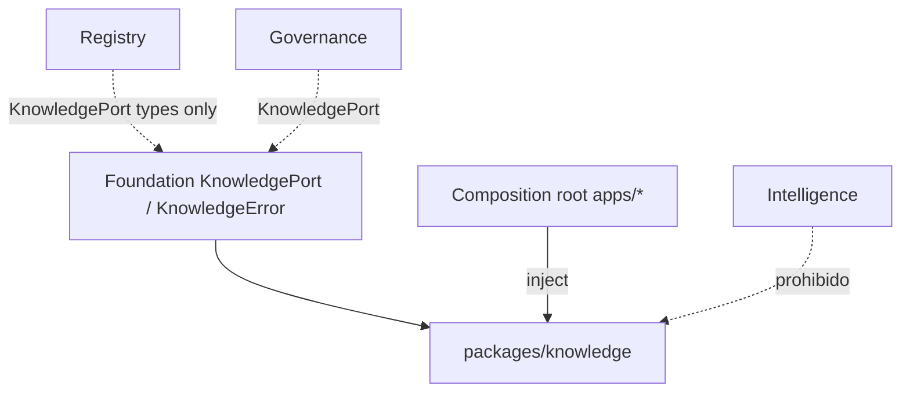
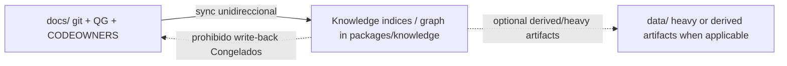

# EE-DOC-014 — Knowledge Management

Este documento sigue el estándar **EE-DOC-002 — Document Design Template** y se desarrolla conforme al ciclo documental definido por **EE-DOC-005 — Development Workflow**.

> **Vigencia:** tipo **Documento Normativo** en estado **Aprobado**. Normativo para implementación EE-IMP-014 conforme a EE-DOC-005. Congelación tras P01–P06 + EE-TEC-009.

---

## METADATOS

| Campo                 | Valor                                                                                                                                                                                                      |
| :-------------------- | :--------------------------------------------------------------------------------------------------------------------------------------------------------------------------------------------------------- |
| **ID**                | EE-DOC-014                                                                                                                                                                                                 |
| **Documento**         | Knowledge Management                                                                                                                                                                                       |
| **Código corto**      | EE-DOC-014                                                                                                                                                                                                 |
| **Tipo**              | Documento Normativo                                                                                                                                                                                        |
| **Clasificación**     | Especializado                                                                                                                                                                                              |
| **Nivel**             | Especializado                                                                                                                                                                                              |
| **Normativo**         | Sí                                                                                                                                                                                                         |
| **Versión**           | v1.1.0                                                                                                                                                                                                     |
| **Estado**            | Congelado                                                                                                                                                                                                  |
| **Propietario**       | Equipo de Arquitectura                                                                                                                                                                                     |
| **Documento padre**   | EE-DOC-004 — Engineering Architecture                                                                                                                                                                      |
| **Dependencias**      | EE-DOC-001, EE-DOC-002, EE-DOC-003, EE-DOC-004, EE-DOC-005, EE-DOC-006, EE-DOC-007, EE-DOC-008, EE-DOC-009, EE-DOC-010, EE-DOC-011, EE-DOC-012, EE-DOC-013, EE-ADR-001, EE-ADR-002, EE-ADR-004, EE-ADR-005 |
| **Aprobado por**      | Equipo de Arquitectura                                                                                                                                                                                     |
| **Audiencia**         | Arquitectura, Desarrollo, Knowledge Engineering, IA                                                                                                                                                        |
| **Fecha de creación** | 2026-10-05                                                                                                                                                                                                 |
| **Última revisión**   | 2026-10-06                                                                                                                                                                                                 |
| **Próxima revisión**  | 2026-10-19                                                                                                                                                                                                 |

---

## 01. Propósito

Definir la **Knowledge Layer** del Engineering Ecosystem: ownership, fronteras, puertos de contrato, dominios de conocimiento (grafo, ontología, búsqueda semántica, embeddings de producto, second brain) y su relación con la documentación normativa, Intelligence (EE-DOC-013), Registry y Governance.

Este documento **no** redefine Quality Gates (EE-DOC-010), estructura de primer nivel (EE-DOC-006) ni el Provider SPI (EE-ADR-005).

---

## 02. Alcance

### 02.1. Incluye

| Dominio                    | Descripción                                                                                                                              |
| :------------------------- | :--------------------------------------------------------------------------------------------------------------------------------------- |
| **Knowledge services**     | Adquisición, pipeline, motor, grafo, ontología/taxonomía, modelo semántico                                                               |
| **Semantic search**        | Búsqueda sobre base de conocimiento del ecosistema                                                                                       |
| **Embeddings de producto** | Almacenamiento, indexación y ownership semántico (SSOT de este DOC; capacidad genérica de embedding vía SPI → Intelligence / Foundation) |
| **Second brain**           | Persistencia de conocimiento operativo del ecosistema (no sustituye git/`docs/`)                                                         |
| **Sincronización**         | Con documentación validada, eventos Foundation y consumidores autorizados                                                                |
| **Puertos de contrato**    | Tipos en **Foundation**; implementación en **`packages/knowledge`**                                                                      |
| **Artefactos en `data/`**  | Política de corpus/índices/modelos de conocimiento (ver §07.2)                                                                           |

### 02.1.1. Artefacto canónico del monorepo

| Artefacto                        | Norma                                                                                                                |
| :------------------------------- | :------------------------------------------------------------------------------------------------------------------- |
| **Implementación de plataforma** | **`packages/knowledge/`** (+ tipos en `packages/foundation` contracts)                                               |
| **Datos pesados / cache local**  | **`data/`** según §07.2 y EE-DOC-006                                                                                 |
| **Obsidian / vault externo**     | **Fuente de autoría opcional**; **no** es el artefacto de entrega del DOC ni path de primer nivel autorizado por 006 |
| **Sincronización de EE-DOC-001** | Al **Aprobar**: sustituir artefacto histórico “Obsidian Vault/” por **`packages/knowledge/` (+ `data/`)**            |

### 02.2. No incluye

| Fuera de alcance                                                   | SSOT / owner                                                                   |
| :----------------------------------------------------------------- | :----------------------------------------------------------------------------- |
| Router / Provider SPI / composition root de providers              | EE-DOC-013 / EE-ADR-005                                                        |
| Catálogo de specializations/agentes runtime                        | **Registry** (`packages/registry`)                                             |
| Documentos normativos EE-DOC/ADR/RFC como “única verdad” editorial | Git + `docs/` (proceso 005/007); Knowledge **indexa/sincroniza**, no reemplaza |
| Quality Gates y agregación de merge                                | EE-DOC-010                                                                     |
| IaC de plataforma (no stores de knowledge)                         | EE-DOC-009                                                                     |
| Marketplace assets (`marketplace/*`) como política de routing      | EE-DOC-013 AD-04                                                               |
| Ubicación física Local Inference Runtime                           | ADR posterior (EE-DOC-013)                                                     |
| Nested workspaces bajo `packages/knowledge/*`                      | Blueprint EE-DOC-006 §05; **as-built** = paquete **plano** (ver §04.2)         |

### 02.3. Precedente de roadmap vs padre estructural

| Relación                     | Documento                                                               |
| :--------------------------- | :---------------------------------------------------------------------- |
| **Padre estructural**        | EE-DOC-004 (Knowledge Layer §07.7)                                      |
| **Precedente de roadmap**    | EE-DOC-013 (Fase 3)                                                     |
| **Dependencia de contenido** | EE-DOC-006 (capas §13), EE-DOC-013 (frontera Intelligence ↔ Knowledge) |

---

## 03. Principios (KN-\*)

| ID        | Principio                          | Norma                                                                                                                                                                     |
| :-------- | :--------------------------------- | :------------------------------------------------------------------------------------------------------------------------------------------------------------------------ |
| **KN-01** | Single Source of Truth             | El grafo/índices de Knowledge **no** contradicen documentos Congelados en `docs/`; ante conflicto, prevalece el documento normativo en git hasta sincronización gobernada |
| **KN-02** | Separation of concerns             | Knowledge ≠ Intelligence ≠ Registry ≠ `docs/` editorial                                                                                                                   |
| **KN-03** | Port-first                         | Consumidores usan **puertos** tipados en Foundation; implementación en `packages/knowledge`                                                                               |
| **KN-04** | Grafo de dependencias de Knowledge | Política efectiva ⊆ techo EE-DOC-006 §13.2 — ver **§04.5**                                                                                                                |
| **KN-05** | Security by Design                 | Sin secretos en corpus versionado; minimización de PII/contenido sensible en índices y logs (alineado a EE-DOC-013 §09.3 cuando hay IA)                                   |
| **KN-06** | Vendor Agnostic                    | Store vectorial / motor de búsqueda intercambiables detrás del puerto                                                                                                     |
| **KN-07** | Reproducibilidad de proceso        | Ingesta y reindex documentados; no se exige bit-identical de embeddings entre providers                                                                                   |
| **KN-08** | Human-in-the-loop                  | Material normativo sigue EE-DOC-005/007; Knowledge no aprueba merge ni QG                                                                                                 |
| **KN-09** | No Silent Divergence               | Cambio de contrato de Knowledge port / ownership de embeddings → IMP y ADR/RFC según impacto                                                                              |
| **KN-10** | Fail explicit                      | Si el knowledge port no está disponible → error o degradación **explícita** al caller (filosofía AI-10); sin “conocimiento inventado”                                     |

---

## 04. Arquitectura de la Knowledge Layer

### 04.1. Posición en el ecosistema

| Capa / paquete                     | Rol                                                                                                    |
| :--------------------------------- | :----------------------------------------------------------------------------------------------------- |
| **Foundation**                     | SSOT de **tipos** del Knowledge Port y de **`KnowledgeError`**                                         |
| **`@eq-labs/knowledge`**           | Implementación de servicios de conocimiento                                                            |
| **Registry**                       | Catálogo de specializations/agentes — **no** es SSOT de “qué se sabe”                                  |
| **Governance**                     | Puede **consumir** Knowledge Port (matriz 006); no define QG de merge                                  |
| **Intelligence**                   | Embedding **capability** vía SPI; **no** posee store semántico de producto; **no** importa `knowledge` |
| **`packages/sdk` / knowledge-sdk** | Facade liviana opcional; **no** composition root; **no** lógica de índice (R-SDK-3 / EE-ADR-005)       |

### 04.2. Paquete plano vs blueprint 006

| Estado                        | Norma                                                                                                                                                                     |
| :---------------------------- | :------------------------------------------------------------------------------------------------------------------------------------------------------------------------ |
| **As-built (repo)**           | Un solo workspace `packages/knowledge` (**plano**). Evidencia: `pnpm-workspace.yaml` → `packages/knowledge`; sin subpaquetes `knowledge-engine/`, etc. en el árbol físico |
| **Blueprint EE-DOC-006 §05**  | Subdominios _lógicos_ (engine, acquisition, pipeline, graph, …) — **no** materializados como workspaces pnpm hoy                                                          |
| **Implementación actual**     | Módulos bajo `packages/knowledge/src/**`                                                                                                                                  |
| **Nested workspaces futuros** | Solo con cambio gobernado de EE-DOC-006 (RFC/ADR según alcance)                                                                                                           |

### 04.3. Knowledge Port — contrato mínimo e as-built

| Elemento                 | Ubicación normativa                                                               |
| :----------------------- | :-------------------------------------------------------------------------------- |
| Tipos del Knowledge Port | **Foundation** (`contracts`)                                                      |
| **`KnowledgeError`**     | **Foundation** (SSOT único; **no** reutilizar `AIError` de provider)              |
| Implementación           | **`packages/knowledge`**                                                          |
| Wiring                   | **Un** composition root en **`apps/*`** (EE-DOC-006 §13.5); **no** `packages/sdk` |

#### 04.3.1. As-built (gap explícito)

| Artefacto                                  | Estado en monorepo (2026-10-05)                                                            |
| :----------------------------------------- | :----------------------------------------------------------------------------------------- |
| `KnowledgePort` / tipos query-index-health | **Ausente** en `packages/foundation/src/contracts`                                         |
| `KNOWLEDGE_PORT_VERSION`                   | **Ausente** (símbolo normativo fijo; valor inicial en P03)                                 |
| Contratos presentes en Foundation          | AI SPI, inference, generation, provider, catalog (`CatalogPort`), error AI                 |
| `@eq-labs/knowledge`                       | Stub (`export {}`); sin `exports`/`main`/`types`; `src/index.js` residual; `private: true` |
| Consumidores del port                      | **Ninguno** cableado                                                                       |

Este gap se cierra en **EE-IMP-014-P01…P03**. El inventario **canónico** del as-built lo formaliza **EE-IMP-014-P01** (no depender solo de la fecha de este DOC). **No** se declara Knowledge ACTIVE en producción hasta cerrar el gap (No False Pass / EE-ADR-004).

#### 04.3.2. Operaciones mínimas del port

| Operación            | Responsabilidad                                                                       |
| :------------------- | :------------------------------------------------------------------------------------ |
| **health**           | Disponibilidad del backend de knowledge                                               |
| **index**            | Ingestar/actualizar unidades de corpus con metadatos de versión                       |
| **query / retrieve** | Búsqueda o recuperación por id / filtros                                              |
| **semanticSearch**   | Consulta por similitud (puede permanecer PENDING tras P04 si el store no está ACTIVE) |

**Error contract (SSOT):** **`KnowledgeError`** en Foundation (código, mensaje, retryable, causa opcional). Mapeo desde fallos de store = responsabilidad de la implementación en knowledge, no del SPI de AI.

**Versionado:** símbolo normativo fijo **`KNOWLEDGE_PORT_VERSION`** en Foundation (mismo patrón que `AI_SPI_VERSION`). El **valor inicial** (p. ej. `1.0.0`) lo fija **EE-IMP-014-P03**. Breaking → major + ADR/IMP.

**No False Pass:** no declarar “Knowledge API completa ACTIVE” ni consumidores de producción hasta:

1. Tipos + `KnowledgeError` + versión en Foundation,
2. Implementación mínima en `@eq-labs/knowledge` con **API consumible en el workspace** (`exports` / `types` / `main` según patrón foundation),
3. Evidencia EE-IMP-014-P03/P04,
4. Degradación **KN-10** verificable (incl. test hermético donde aplique).

### 04.4. Composition root y consumidores (primer ciclo)

| Rol                              | Norma                                                                                                                                                                                                                                                                                                                                                                                              |
| :------------------------------- | :------------------------------------------------------------------------------------------------------------------------------------------------------------------------------------------------------------------------------------------------------------------------------------------------------------------------------------------------------------------------------------------------- |
| **Un root efectivo por runtime** | Un solo composition root en **`apps/*`** puede registrar **varios puertos** (p. ej. AI + Knowledge). **No** son dos roots distintos                                                                                                                                                                                                                                                                |
| **Evidencia inicial**            | Preferente: extender **`apps/cli`** (ya root de AI en EE-IMP-013) para registrar también Knowledge Port — cableado en **EE-IMP-014-P03**. Alinear README de cli y, si hace falta, EE-DOC-011 §06 vía **Tipo B** (cli sigue siendo fachada DX; el root de composición no convierte al CLI en reimplementador de gates)                                                                              |
| **apps/dashboard**               | Solo si IMP lo elige como root de _otro_ runtime; no duplicar el mismo runtime                                                                                                                                                                                                                                                                                                                     |
| **Intelligence**                 | No registra ni importa `@eq-labs/knowledge`                                                                                                                                                                                                                                                                                                                                                        |
| **Registry**                     | Puede **consumir `KnowledgePort`** (tipos Foundation) para enriquecer metadatos; la **implementación** se resuelve por **inyección en el composition root**. **Prohibido** `@eq-labs/registry` → import runtime de `@eq-labs/knowledge`. Cualquier excepción requiere **Tipo B** registrado en IMP (el techo 006 no obliga dependencia de package). **`CatalogPort` no expone tipos de Knowledge** |
| **Governance**                   | Puede consumir el port; no sustituye EE-DOC-010                                                                                                                                                                                                                                                                                                                                                    |
| **SDK**                          | Facade liviana; no root                                                                                                                                                                                                                                                                                                                                                                            |

### 04.5. Grafo de dependencias de Knowledge (KN-04)

EE-DOC-006 §13.2 define el **techo** (allowlist máxima). Este documento fija la **política efectiva de la capa Knowledge** como **subconjunto** de ese techo. **No** modifica ni enmienda la matriz de 006.

| Dirección                         | Techo 006 §13.2    | Política efectiva EE-DOC-014                                                                                                                                                                                                                                                                                                                       |
| :-------------------------------- | :----------------- | :------------------------------------------------------------------------------------------------------------------------------------------------------------------------------------------------------------------------------------------------------------------------------------------------------------------------------------------------- |
| Knowledge → Foundation            | Permitido          | **Obligatorio** para tipos/port                                                                                                                                                                                                                                                                                                                    |
| Knowledge → Execution             | Permitido en techo | **Prohibido** en política 014: Knowledge **no** depende de Execution. Jobs de reindex/acquisition se **orquestan en el composition root** (o en un workflow que el root arranca); Knowledge solo **expone** operaciones vía **KnowledgePort**. Execution (si se usa) posee la **semántica** del workflow; el root solo **cablea** implementaciones |
| Knowledge → Intelligence          | Permitido en techo | **Prohibido** en política 014                                                                                                                                                                                                                                                                                                                      |
| Knowledge → connectors (provider) | No en allowlist    | **Prohibido**                                                                                                                                                                                                                                                                                                                                      |
| Intelligence → Knowledge          | Prohibido          | **Prohibido**                                                                                                                                                                                                                                                                                                                                      |
| Registry → Knowledge (techo 006)  | Permitido          | **Consumo vía KnowledgePort** + inyección en root; **prohibido** import runtime del package knowledge (excepción solo Tipo B en IMP); CatalogPort sin tipos Knowledge                                                                                                                                                                              |
| Governance → Knowledge            | Permitido          | **Permitido**                                                                                                                                                                                                                                                                                                                                      |

**Orquestación de jobs (sin Knowledge→Execution):**

| Rol                             | Responsabilidad                                                                                                                     |
| :------------------------------ | :---------------------------------------------------------------------------------------------------------------------------------- |
| **Execution**                   | Posee definición y semántica del workflow/orquestación (si el runtime usa Execution)                                                |
| **Composition root (`apps/*`)** | Solo **registra/inyecta** implementaciones (KnowledgePort, y si aplica providers); **no** absorbe lógica de orquestación de negocio |
| **Knowledge**                   | Expone `index` / reindex / health vía **KnowledgePort**                                                                             |

Si Knowledge necesita señales derivadas de IA: **puertos en Foundation inyectados por el root** (p. ej. capacidad de embedding §04.6.1), nunca `import` de `@eq-labs/intelligence`.

#### 04.5.1. Enforcement de la política 014

| Régimen                                                                          | Estado                                                                                                                                                                                                                                              |
| :------------------------------------------------------------------------------- | :-------------------------------------------------------------------------------------------------------------------------------------------------------------------------------------------------------------------------------------------------- |
| **Norma** (prohibiciones §04.5 / §08)                                            | **Vigente** al **Aprobar** este DOC                                                                                                                                                                                                                 |
| **Enforcement automático** (análisis de imports en `scripts/validate` / QG-ARCH) | **PENDING** (Tipo B; mismo vacío conocido que la matriz 006 — TEC-005)                                                                                                                                                                              |
| **Enforcement interim**                                                          | Revisión arquitectónica + **CODEOWNERS** (EE-DOC-007). **P01** inspecciona paths reales; si faltan `packages/knowledge/**` o contratos knowledge en Foundation → **Tipo B** y materialización en **P01/P02** antes de declarar **KS-06** satisfecho |
| **Riesgo residual**                                                              | Bypass single-operator / merge directo a `main` (p. ej. TEC-002 W-P03-001) **debilita** el interim; se **acepta** en fase temprana y se mitiga con revisión explícita en IMP y endurecimiento progresivo de reglas                                  |

No se declara PASS automático de grafo de imports mientras el mecanismo no exista (No False Pass).

### 04.6. Embeddings — ownership (cierre EE-DOC-013)

| Capacidad                                                                         | Owner                                   |
| :-------------------------------------------------------------------------------- | :-------------------------------------- |
| Invocar modelo de embedding vía **Provider SPI**                                  | Intelligence / adapters (013 / ADR-005) |
| **Persistencia, índices, namespaces, retention, ownership semántico de producto** | **Knowledge (este DOC)**                |
| Corpus normativo en git                                                           | `docs/` + proceso 005/007               |

Prohibido: store vectorial paralelo silencioso en Intelligence como SSOT de producto.

#### 04.6.1. Camino de datos para embeddings (ABI)

Knowledge **no** puede importar Intelligence ni connectors. El Provider SPI as-built (`infer` / `generate`) **no** garantiza operación de embedding.

| Elemento                              | Norma                                                                                                                                                                                                         |
| :------------------------------------ | :------------------------------------------------------------------------------------------------------------------------------------------------------------------------------------------------------------ |
| **Capacidad de embedding**            | Tipos en **Foundation** (`EmbeddingPort` **o** extensión del SPI de provider documentada). Descubrimiento **Tipo B** que extiende el modelo de EE-DOC-013 / EE-ADR-005 sin que Knowledge importe Intelligence |
| **Wiring**                            | El **composition root** inyecta en la implementación de Knowledge la dependencia de embedding (solo tipos Foundation)                                                                                         |
| **semanticSearch / embeddings store** | Permanecen **PENDING** de producto hasta existir ese ABI + evidencia IMP                                                                                                                                      |
| **KS-corpus-remoto**                  | Corpus que salga a providers remotos debe cumplir minimización (§07); sin envío de secretos ni material Congelado no autorizado                                                                               |

### 04.7. Fuentes externas y stores

(Obsidian, NotebookLM, MCP, vector stores)

EE-DOC-004 §12.2 asocia **Knowledge Vault (Obsidian)**, **NotebookLM** y **MCP** a la Knowledge Layer. Existen workspaces en `connectors/official/*`. Este documento **no** abre aún un SPI completo de fuente/store (análogo al Provider SPI de EE-ADR-005).

| Regla                                         | Norma                                                                                                                                                                                                                               |
| :-------------------------------------------- | :---------------------------------------------------------------------------------------------------------------------------------------------------------------------------------------------------------------------------------- |
| **Knowledge → connectors**                    | **Prohibido** (política §04.5 / techo 006)                                                                                                                                                                                          |
| **Acquisition ACTIVE hacia fuentes externas** | **Diferido** hasta **ADR** (o extensión gobernada) que fije: contratos de fuente/store en Foundation, ubicación de adapters (p. ej. `connectors/official/...` implementando solo Foundation), y wiring **solo** en composition root |
| **Camino legal en el primer ciclo IMP**       | Ingesta desde **`docs/` / git** (contenido ya en `main`) y artefactos bajo **`data/`** conforme §07.2                                                                                                                               |
| **KN-06 (store intercambiable)**              | Sigue vigente **detrás del Knowledge Port**                                                                                                                                                                                         |
| **Backend ACTIVE primer ciclo**               | Solo **in-memory / local** **sin SDK de vendor** en `packages/knowledge`                                                                                                                                                            |
| **Vector store / backend de tercero**         | Requiere **ADR previo**: adapter en `connectors/official/*` que implemente **solo Foundation**, cableado en el **composition root** (mismo patrón ADR-005). **Prohibido** meter SDKs de vendor en el core knowledge                 |

Hasta los ADR aplicables: **no** declarar Acquisition de fuentes externas ni store vendor ACTIVE (No False Pass).

---

## 05. Dominios funcionales

| Dominio                         | Responsabilidad                                                                                                                                                          | 1ª materialización                                                             |
| :------------------------------ | :----------------------------------------------------------------------------------------------------------------------------------------------------------------------- | :----------------------------------------------------------------------------- |
| **Acquisition**                 | **Primer ciclo:** ingesta desde **`docs/` / git** y artefactos bajo **`data/`**. **Fuentes externas** (Obsidian, NotebookLM, MCP, etc.): **diferidas** hasta ADR (§04.7) | IMP (local); externa → ADR                                                     |
| **Pipeline**                    | Normalización, chunking, metadatos, versionado de corpus                                                                                                                 | IMP                                                                            |
| **Graph / Ontology / Taxonomy** | Relaciones y vocabulario controlado                                                                                                                                      | IMP / posible ADR de modelo                                                    |
| **Semantic search**             | Consulta por similitud / híbrida                                                                                                                                         | IMP **condicionado** a Embedding ABI (§04.6.1); PENDING hasta entonces         |
| **Embeddings store**            | Índices vectoriales de producto                                                                                                                                          | IMP **condicionado** a Embedding ABI + retención (§07); PENDING hasta entonces |
| **Second brain**                | Conocimiento operativo persistente                                                                                                                                       | Opcional / diferible                                                           |
| **Documentation generation**    | Asistida                                                                                                                                                                 | §05.3                                                                          |

### 05.1. Fuentes de verdad y sincronización

| Fuente                                                        | Rol                                                                                                                                                                                                                                                                                                                                                        |
| :------------------------------------------------------------ | :--------------------------------------------------------------------------------------------------------------------------------------------------------------------------------------------------------------------------------------------------------------------------------------------------------------------------------------------------------- |
| `docs/architecture`, `docs/adr`, `docs/rfc`, `docs/developer` | Normativo / implementación documental (**SSOT editorial**)                                                                                                                                                                                                                                                                                                 |
| Knowledge store (lógica en package)                           | Índice/API y grafo **derivados** + conocimiento operativo no normativo                                                                                                                                                                                                                                                                                     |
| **“ADR/RFC Registry” (EE-DOC-004 §07.7)**                     | **Sin redefinir 004 (Congelado).** SSOT editorial de ADR/RFC = **`docs/` + git** (005/007). La capacidad de Knowledge Layer de registrar/buscar decisiones se realiza en este monorepo como **índice/mirror** sobre ese SSOT, no como segundo almacén normativo. Cualquier cambio de wording en 004 requiere **cambio gobernado** de 004, no solo este DOC |
| **Obsidian / vault externo**                                  | Autoría opcional; congelación solo vía git + 005/007                                                                                                                                                                                                                                                                                                       |

### 05.2. Validation Layer y artefactos validados

| Fuente                                                  | Relación con Knowledge                                                                                                              |
| :------------------------------------------------------ | :---------------------------------------------------------------------------------------------------------------------------------- |
| Contenido ya en **`main`** tras QG (010) y review (007) | Candidatos legítimos a **ingesta** (modelo **push**: el pipeline/merge deja artefactos en git; Knowledge **no** llama a Validation) |
| Validation Layer (004)                                  | Knowledge **no** depende de Validation (004 §08.2); **no** implementa validación de merge                                           |
| Artefactos de build/test no documentales                | Solo si policy de acquisition en IMP los declara                                                                                    |

### 05.3. Documentation generation

Produce **propuestas**; no escribe Congelados; PR + CODEOWNERS + QG mandan. El subdominio blueprint `documentation/` no sustituye `docs/`.

---

## 06. Relación con Intelligence, Registry y Governance

| Tema                          | Norma                                                                                                                         |
| :---------------------------- | :---------------------------------------------------------------------------------------------------------------------------- |
| `intelligence` ↔ `knowledge` | **Prohibido** en ambas direcciones (política 014)                                                                             |
| Señales IA → Knowledge        | Solo **Foundation** (eventos/puertos)                                                                                         |
| Registry vs Knowledge         | Registry = specialists; Knowledge = conocimiento del ecosistema                                                               |
| Registry y Knowledge          | Registry consume **KnowledgePort** (inyección); sin import package knowledge por defecto; **CatalogPort sin tipos Knowledge** |
| Governance → Knowledge        | Permitido; no redefine QG                                                                                                     |
| Degradación                   | **KN-10**                                                                                                                     |

---

## 07. Seguridad, datos y `data/`

### 07.1. Controles (KS-\*)

| ID        | Regla                                                                                                                                                                                                                                                |
| :-------- | :--------------------------------------------------------------------------------------------------------------------------------------------------------------------------------------------------------------------------------------------------- |
| **KS-01** | Credenciales de stores solo en secretos runtime (EE-DOC-009 / GitHub Secrets)                                                                                                                                                                        |
| **KS-02** | No versionar dumps de índices con datos sensibles; soporte físico vía `.gitignore` en **P05**                                                                                                                                                        |
| **KS-03** | Logs de consulta: default sin payload completo sensible; correlación alineada a 013 §09.3 si hay IA                                                                                                                                                  |
| **KS-04** | Retención y borrado documentados en IMP (P05)                                                                                                                                                                                                        |
| **KS-05** | Versiones exactas (006 §11); QG-SEC-001                                                                                                                                                                                                              |
| **KS-06** | CODEOWNERS con paths verificables (p. ej. `packages/knowledge/**` y contratos knowledge en Foundation). El patrón genérico `packages/` **no** basta para declarar KS-06 PASS. Evidencia en **P01**; si faltan → Tipo B + materialización **P01/P02** |

### 07.2. `data/` vs `packages/knowledge`

| Tema                                           | Norma                                                                                                                                                          |
| :--------------------------------------------- | :------------------------------------------------------------------------------------------------------------------------------------------------------------- |
| **Lógica / API / transformación / indización** | **`packages/knowledge`** (y tipos en Foundation)                                                                                                               |
| **Artefactos pesados / cache local / pesos**   | Bajo **`data/`** (EE-DOC-006), **sin** nueva raíz de primer nivel                                                                                              |
| **Subpaths candidatos (evaluación en P05)**    | **`data/datasets/`** y **`data/models/`** son **candidatos** alineados a 006; **no** son estructura física obligatoria hasta que **EE-IMP-014-P05** los valide |
| **Otros subpaths bajo `data/`**                | Solo con **Tipo B** en IMP y sin nueva raíz de primer nivel                                                                                                    |
| **Qué no va a git**                            | Dumps binarios, pesos, credenciales, PII no autorizada                                                                                                         |
| **Lifecycle (P05)**                            | Distinguir: canónico versionable (si existe) vs **generado/reconstruible** vs **local-only**; ownership operativo Arquitectura / IMP-014                       |
| **Local Inference (013)**                      | Paths de runtime de modelo ≠ automáticamente corpus Knowledge; separación en IMP/ADR si comparten `data/`                                                      |

---

## 08. Prohibiciones

1. Usar Knowledge como sustituto del merge o de QG-010.
2. Import `intelligence` ↔ `knowledge`.
3. Duplicar el catálogo Registry como SSOT de routing dentro de Knowledge.
4. Exponer tipos de Knowledge en **`CatalogPort`**.
5. Declarar Knowledge ACTIVE en producción sin port + evidencia IMP (No False Pass).
6. Escribir automáticamente sobre Congelados sin 005/007.
7. Marketplace/prompts como ontología normativa.
8. API keys en corpus o second brain.
9. Silent divergence de 004 §07.7 / este DOC (KN-09).
10. `packages/sdk` como composition root de stores.
11. Vault Obsidian como SSOT normativo.
12. Eludir CODEOWNERS (KS-06).
13. Knowledge → Execution (política 014: jobs vía root + KnowledgePort).
14. SDKs de vendor de store/fuente dentro de `packages/knowledge` sin ADR + connector.

---

## 09. Plan de Implementación y Fases

> **Artefacto técnico previsto al cierre:** **EE-TEC-009** (no existe aún; se emite en P06).  
> Prerrequisito de IMP: EE-DOC-014 **Aprobado**.

### 09.1. Catálogo oficial de fases

| ID      | Unidad                   | Objetivo                                                                                                                                                                                                                                                                                                              | Documento      |
| :------ | :----------------------- | :-------------------------------------------------------------------------------------------------------------------------------------------------------------------------------------------------------------------------------------------------------------------------------------------------------------------- | :------------- |
| **P01** | Inventory and boundaries | Fronteras 013/Registry/docs/006; inventario as-built; **CODEOWNERS**: comprobar `packages/knowledge/**` y path real de contracts knowledge en Foundation (propuesta p. ej. architecture+maintainers); Tipo B si faltan; QG-SEC-001 precondición; riesgo single-operator documentado                                   | EE-IMP-014-P01 |
| **P02** | Baseline package         | lint/typecheck/build; deps §04.5; **exports/main/types/declaration** (API **consumible por workspace**, obligatoria); decisión **`private: true` vs publicación npm** (independiente); CODEOWNERS fino si P01 lo exige (Tipo B 007)                                                                                   | EE-IMP-014-P02 |
| **P03** | Knowledge Port ABI       | `KnowledgePort` + `KnowledgeError` + **`KNOWLEDGE_PORT_VERSION`** (valor inicial) en Foundation; surface knowledge; root demuestra **construcción/inyección mínima** del port (**no** integración ficticia de producto). Embedding ABI Tipo B si se aborda semanticSearch. **No** exige consumidor de producto ACTIVE | EE-IMP-014-P03 |
| **P04** | Minimum capability       | health + index + query/retrieve; **KN-10**; **test hermético in-memory** (PASS de fase); backend primer ciclo in-memory/local sin vendor; **semanticSearch PENDING** hasta Embedding ABI (§04.6.1); **no** ACTIVE de producto                                                                                         | EE-IMP-014-P04 |
| **P05** | Security / data / sync   | KS-\*; `.gitignore` data; retención; política lifecycle data/; sync desde docs validados                                                                                                                                                                                                                              | EE-IMP-014-P05 |
| **P06** | Closure                  | Validación final; **EE-TEC-009**; sin bloqueantes no gestionados                                                                                                                                                                                                                                                      | EE-IMP-014-P06 |

### 09.2. Primera suite de tests

Al introducir Vitest en knowledge: **Tipo B** respecto de QG-TEST-001 (posible salida de SKIPPED), alineado a EE-ADR-002 / precedente EE-DOC-013 §12.4. Tests de knowledge en CI: **sin** stores externos ni secretos (herméticos).

### 09.3. Criterios verificables (resumen)

| Fase | PASS de fase (medible)                                                                            |
| :--- | :------------------------------------------------------------------------------------------------ |
| P01  | Inventario escrito; boundaries sin ambigüedad nested vs plano                                     |
| P02  | Gates package verdes; exports consumibles; sin intelligence en deps                               |
| P03  | Tipos en Foundation exportados; knowledge implementa port; root inyecta                           |
| P04  | Test hermético: index + retrieve (o query) OK; health; backend ausente → `KnowledgeError` (KN-10) |
| P05  | Checklist KS + gitignore + nota retención                                                         |
| P06  | TEC-009 emitido; matriz de evidencias P01–P05                                                     |

---

## 10. Evolución y descubrimientos

| Tema                                                       | Tipo                                                                                                                    |
| :--------------------------------------------------------- | :---------------------------------------------------------------------------------------------------------------------- |
| ABI detallado del Port                                     | B (P03)                                                                                                                 |
| Tipos Knowledge Port / KnowledgeError en Foundation        | B (precedente CatalogPort; ADR-005 no los cubre)                                                                        |
| Nested `packages/knowledge/*`                              | D (RFC 006) si cambia árbol                                                                                             |
| Motor vectorial baseline                                   | C (ADR) si congela vendor                                                                                               |
| Suite Vitest / QG-TEST                                     | B                                                                                                                       |
| Enforcement automático de imports                          | B                                                                                                                       |
| Excepción Knowledge → Execution                            | B (IMP)                                                                                                                 |
| Alineación operativa ADR/RFC con `docs/` (sin reabrir 004) | Seguimiento: Issue/backlog de arquitectura (005 §04.4/§04.7); cambio gobernado de 004 solo si se exige alinear el texto |
| EmbeddingPort / extensión SPI                              | B (P03/P04; extiende 013/ADR-005)                                                                                       |
| Store vendor externo                                       | C (ADR) antes de ACTIVE                                                                                                 |
| `private` vs publish knowledge                             | B (P02)                                                                                                                 |

Durante IMP: **prohibida** desviación silenciosa de este DOC una vez **Aprobado** (EE-DOC-005).

---

## 11. Cumplimiento

### 11.1. Verificación normativa (post-aprobación)

| Mecanismo                | Uso                                                  |
| :----------------------- | :--------------------------------------------------- |
| Revisión PR + CODEOWNERS | Enforcement interim §04.5.1                          |
| EE-IMP-014-PXX           | Evidencia por fase                                   |
| EE-TEC-009               | As-built consolidado                                 |
| QG-010 / validate        | Estructura y gates existentes; grafo imports PENDING |

### 11.2. Checklist de elaboración

**Arquitectura:**

- [x] EE-DOC-004 §07.7: compatibilidad operativa con `docs/` (sin redefinir 004)
- [x] Fuentes externas / stores diferidos (§04.7)
- [x] Registry consume KnowledgePort (no package por defecto)
- [x] Política ⊆ techo 006 §13.2 (sin enmendar 006)
- [x] Frontera 013; un root / varios puertos
- [x] `KnowledgeError` SSOT; gap as-built Port
- [x] CatalogPort sin tipos Knowledge
- [x] data/ vs package (candidatos P05)
- [x] Artefacto canónico packages/knowledge (+ data/)
- [x] Embedding path §04.6.1; sin Knowledge→Execution
- [x] Backend primer ciclo in-memory

**Seguridad:**

- [x] KS-01…KS-06

**Índice:**

- [x] EE-DOC-001 al **Aprobar**

**Implementación:**

- [ ] EE-IMP-014-P01…P06 + EE-TEC-009

---

## 12. Referencias

| Código     | Relación                                                              |
| :--------- | :-------------------------------------------------------------------- |
| EE-DOC-004 | Knowledge Layer §07.7                                                 |
| EE-DOC-006 | Blueprint; `data/`; capas §13.2 / §13.5                               |
| EE-DOC-007 | CODEOWNERS                                                            |
| EE-DOC-008 | Entorno local                                                         |
| EE-DOC-009 | Secretos                                                              |
| EE-DOC-010 | QG; No False Pass de agregación                                       |
| EE-TEC-005 | Evidencia QG / PENDING de enforcement de capas (trazabilidad §04.5.1) |
| EE-ADR-004 | Adopción progresiva / gates                                           |
| EE-DOC-012 | Templates                                                             |
| EE-DOC-013 | AI; embeddings capability                                             |
| EE-ADR-005 | SPI; composition root                                                 |
| EE-ADR-002 | Tests                                                                 |

---

## 13. Historial de Cambios

| Versión    | Fecha      | Autor                  | Aprobado por           | Motivo                  | Cambios                                                                                                                                                                                                                 | Estado             |
| :--------- | :--------- | :--------------------- | :--------------------- | :---------------------- | :---------------------------------------------------------------------------------------------------------------------------------------------------------------------------------------------------------------------- | :----------------- |
| **v0.1.0** | 2026-10-05 | Equipo de Arquitectura | —                      | Apertura                | Borrador inicial                                                                                                                                                                                                        | En Elaboración     |
| **v0.2.0** | 2026-10-05 | Equipo de Arquitectura | —                      | Revisión 1              | B1–B4, M*, m*                                                                                                                                                                                                           | En Elaboración     |
| **v0.2.1** | 2026-10-05 | Equipo de Arquitectura | —                      | Residuales R1–R4        | 004 Registry; Validation; Execution; nota techo                                                                                                                                                                         | En Elaboración     |
| **v0.3.0** | 2026-10-05 | Equipo de Arquitectura | —                      | Revisión 2 (Sí/Parcial) | B1 excepción Tipo B; B2 política ⊆ techo; B3 enforcement interim; M1 gap as-built; M2 KnowledgeError; M3 un root; M4 CatalogPort; M5 data/; M6 catálogo fases; M7 P04 hermético; m1–m6; TEC-009 previsto; cierre v0.3.0 | **En Elaboración** |
| **v0.3.1** | 2026-10-05 | Equipo de Arquitectura | —                      | Revisión 3              | Registry→KnowledgePort (no package); §04.7 fuentes/stores diferidos; sin Tipo A sobre 004; TEC-005 en refs; P01 CODEOWNERS; P03 ABI-only; push ingesta; job Execution dirección; fecha próxima revisión                 | **En Elaboración** |
| **v0.3.2** | 2026-10-05 | Equipo de Arquitectura | —                      | Revisión 4 (3 bloques)  | Artefacto canónico; sin Knowledge→Execution; EmbeddingPort path; store vendor ADR; KNOWLEDGE_PORT_VERSION fijo; data candidatos P05; Mermaid; KS-06/P01; riesgo single-operator; P03 wiring mínimo                      | **En Elaboración** |
| **v0.3.3** | 2026-10-05 | Equipo de Arquitectura | —                      | Revisión 5              | Diagrama data/ opcional; Acquisition local vs externa; semantic/embeddings condicionados ABI; surface workspace ≠ npm; KS-06 paths finos                                                                                | **En Elaboración** |
| **v1.0.0** | 2026-10-05 | Equipo de Arquitectura | Equipo de Arquitectura | Aprobación              | Estado **Aprobado**; O1–O13 = IMP checklist; habilita EE-IMP-014-P01                                                                                                                                                    | Aprobado           |
| **v1.1.0** | 2026-10-06 | Equipo de Arquitectura | Equipo de Arquitectura | Cierre implementación   | P01–P06 Completados; EE-TEC-009 Aprobado; sin bloqueantes no gestionados (D-01 WAIVED)                                                                                                                                  | **Congelado**      |

---

## 14. Cierre Documental

### 14.1. Validación Final (documental)

Revisión arquitectónica sobre v0.3.3 **aceptada**. Documento **Aprobado** en **v1.0.0** (2026-10-05).

### 14.2. Resultado Quality Gates (documento)

No aplica QG de merge al ciclo documental. Los QG del monorepo rigen **EE-IMP-014**. Evidencia de implementación: **EE-IMP-014-P01…P06** y **EE-TEC-009**.

### 14.3. Dictamen

Knowledge Layer normativa coherente con EE-DOC-004/006/013 y EE-ADR-005. Implementación P01–P06 **cerrada**. As-built en **EE-TEC-009**. Knowledge **no** se declara ACTIVE de producto (No False Pass). Residual **D-01** braces WAIVED.

### 14.4. Estado Final

| Campo           | Valor                                                               |
| :-------------- | :------------------------------------------------------------------ |
| **Versión**     | **v1.1.0**                                                          |
| **Estado**      | **Congelado**                                                       |
| **IMP**         | EE-IMP-014-P01…P06 **Completados**                                  |
| **TEC**         | **EE-TEC-009** v1.0.0 Aprobado                                      |
| **Congelación** | ✅ Criterios cumplidos (P01–P06 + TEC-009; bloqueantes gestionados) |

---

## FIN DEL DOCUMENTO
