# EE-IMP-006-P07 — Root Script Suite Automation

Este documento registra la evidencia técnica de la implementación física y validación correspondiente a la Fase 7 conforme al estándar **EE-DOC-005**.

---

## METADATOS

| Campo                 | Valor                                                                                          |
| :-------------------- | :--------------------------------------------------------------------------------------------- |
| **ID**                | EE-IMP-006-P07                                                                                 |
| **Documento**         | Root Script Suite Automation                                                                   |
| **Código corto**      | EE-IMP-006-P07                                                                                 |
| **Fase**              | Fase 7                                                                                         |
| **Tipo**              | Documento Técnico de Implementación                                                            |
| **Clasificación**     | Implementación                                                                                 |
| **Nivel**             | Técnico                                                                                        |
| **Normativo**         | NO, especificación de implementación derivada de EE-DOC-006                                    |
| **Versión**           | v1.0.0                                                                                         |
| **Estado**            | Aprobado                                                                                       |
| **Propietario**       | Equipo de Arquitectura                                                                         |
| **Documento padre**   | EE-DOC-006                                                                                     |
| **Dependencias**      | EE-DOC-001, EE-DOC-002, EE-DOC-003, EE-DOC-004, EE-DOC-005, EE-DOC-006, EE-ADR-001, EE-ADR-002 |
| **Aprobado por**      | Equipo de Arquitectura                                                                         |
| **Audiencia**         | Arquitectura, Desarrollo, DevOps                                                               |
| **Fecha de creación** | 2026-09-18                                                                                     |
| **Última revisión**   | 2026-09-18                                                                                     |
| **Próxima revisión**  | —                                                                                              |

---

## 01. Objetivo

Documentar la implementación de la **Fase 7 — Scripts** del Engineering Ecosystem, correspondiente a la suite de automatización del nivel root del monorepo.

La Fase 7 materializa los puntos de entrada de automatización utilizados para las operaciones comunes del repositorio, manteniendo una interfaz estable en el nivel root y delegando la ejecución del task graph de los workspaces a Turborepo cuando corresponde.

La implementación aplica la estrategia de orquestación establecida por **EE-ADR-001 — Workspace Task Orchestration Strategy** y el estándar de testing establecido por **EE-ADR-002 — Engineering Ecosystem Testing Standard**.

---

## 02. Alcance Implementado

Esta documentación cubre:

- estructura física del directorio `scripts/`;
- scripts root de automatización;
- comandos root expuestos mediante `package.json`;
- relación entre comandos root y scripts físicos;
- delegación de tareas de workspace a Turborepo;
- operaciones de package management ejecutadas mediante PNPM;
- formateo mediante Prettier;
- validación integral del repositorio;
- diagnóstico del entorno;
- generación de código mediante Plop;
- gestión de releases mediante Changesets, PNPM y Git;
- limpieza de artefactos;
- script auxiliar de configuración de ESLint;
- documentación local del directorio `scripts/`;
- contrato de estabilidad de la interfaz root;
- validación técnica de la Fase 7.

Esta documentación no redefine:

- la arquitectura general del Engineering Ecosystem;
- la estrategia de orquestación definida por EE-ADR-001;
- el estándar de testing definido por EE-ADR-002;
- los Quality Gates definidos en EE-DOC-010;
- la automatización CI/CD definida en EE-DOC-011;
- la arquitectura de templates definida en EE-DOC-012.

---

## 03. Estructura Física Implementada

Árbol de directorios y archivos físicos del repositorio correspondientes a la Fase 7:

```text
ee-monorepo/
├── scripts/
│   ├── bootstrap                 # Inicialización y validación de entorno
│   ├── build                     # Orquestación de build
│   ├── dev                       # Orquestación de modo desarrollo
│   ├── test                      # Orquestación de tests
│   ├── lint                      # Orquestación de linting
│   ├── format                    # Formateo mediante Prettier
│   ├── typecheck                 # Orquestación de TypeScript
│   ├── validate                  # Validación integral del repositorio
│   ├── doctor                    # Diagnóstico del entorno
│   ├── generate                  # Generación de código mediante Plop
│   ├── release                   # Gestión del release
│   ├── clean                     # Limpieza de artefactos
│   ├── configure-lint.mjs        # Configuración automatizada de ESLint
│   └── README.md                 # Documentación local de scripts
│
└── package.json                  # Define comandos root y dependencias
    └── scripts:
        bootstrap
        build
        dev
        test
        lint
        format
        typecheck
        validate
        doctor
        generate
        release
        clean
        changeset (directo Changesets)
        version-packages (directo Changesets)
```

```text
changeset
version-packages
```

Estos dos comandos forman parte de la interfaz root de versionado, pero **no corresponden a archivos físicos `scripts/*`**. Son comandos directos de la CLI de Changesets.

Por tanto, la Fase 7 distingue explícitamente entre:

1. scripts físicos de automatización;
2. comandos root directos de Changesets;
3. herramientas de orquestación y soporte utilizadas por dichos scripts.

**Nota:** `configure-lint.mjs` y `README.md` son artefactos físicos de soporte de la Fase 7 y no constituyen comandos root públicos equivalentes a los scripts de operación.

---

## 04. Modelo de Orquestación y Arquitectura de Ejecución

La Fase 7 implementa una separación clara entre:

- interfaz root;
- scripts de repositorio;
- administración de paquetes;
- orquestación del task graph;
- herramientas especializadas.

### 04.1. Task Graph de Workspace

Cuando una operación corresponde a tareas distribuidas entre workspaces, el script root delega la ejecución a Turborepo.

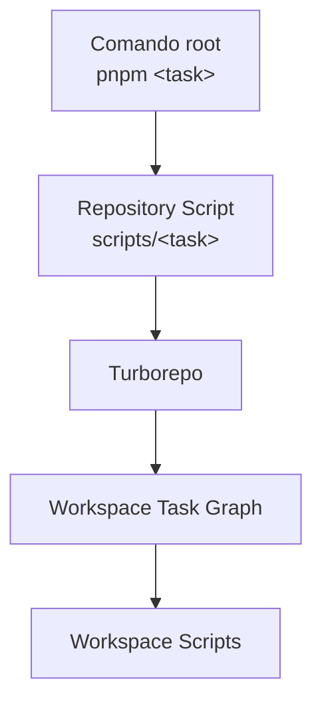

Turborepo mantiene la responsabilidad sobre:

- ejecución de tareas;
- grafo de dependencias;
- orden de ejecución;
- paralelismo;
- caching;
- ejecución incremental.

La suite de scripts no reemplaza a Turborepo ni implementa el task graph.

### 04.2. Package Management

Las operaciones de administración de paquetes utilizan PNPM.

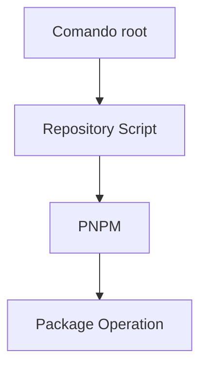

PNPM mantiene la responsabilidad sobre:

- instalación;
- resolución de dependencias;
- workspace management;
- ejecución de paquetes;
- publicación;
- operaciones propias del package manager.

### 04.3. Herramientas Especializadas

| Herramienta | Responsabilidad                     |
| :---------- | :---------------------------------- |
| Prettier    | Formateo                            |
| Plop        | Generación de código                |
| Changesets  | Versionado y release de paquetes    |
| SemVer      | Cálculo y validación de versiones   |
| Git         | Commit, tagging y push              |
| YAML parser | Validación de `pnpm-workspace.yaml` |

---

## 05. Especificación Técnica de Artefactos y Comandos

| Comando            | Ruta Física         | Responsabilidad                 | Mecanismo principal          |
| :----------------- | :------------------ | :------------------------------ | :--------------------------- |
| `bootstrap`        | `scripts/bootstrap` | Preparación inicial del entorno | PNPM + SemVer                |
| `build`            | `scripts/build`     | Build de workspaces             | Turborepo                    |
| `dev`              | `scripts/dev`       | Modo desarrollo                 | Turborepo                    |
| `test`             | `scripts/test`      | Ejecución de tests disponibles  | Turborepo                    |
| `lint`             | `scripts/lint`      | Lint de workspaces              | Turborepo                    |
| `format`           | `scripts/format`    | Formateo del repositorio        | Prettier                     |
| `typecheck`        | `scripts/typecheck` | Verificación de tipos           | Turborepo + TypeScript       |
| `validate`         | `scripts/validate`  | Validación integral             | Turbo + validaciones locales |
| `doctor`           | `scripts/doctor`    | Diagnóstico del entorno         | Node.js + PNPM + Git         |
| `generate`         | `scripts/generate`  | Generación de código            | Plop + PNPM                  |
| `release`          | `scripts/release`   | Release del ecosistema          | Changesets + PNPM + Git      |
| `clean`            | `scripts/clean`     | Limpieza de workspaces          | Turborepo                    |
| `changeset`        | CLI directa         | Declaración de cambios          | Changesets                   |
| `version-packages` | CLI directa         | Versionado de paquetes          | Changesets                   |

### 05.1. Bootstrap

El script `scripts/bootstrap` es el punto de entrada de Inicialización del monorepo.

Antes de instalar dependencias valida los requisitos declarados en el `package.json` root:

```text
engines.node
engines.pnpm
```

La validación utiliza SemVer para comprobar que las versiones actuales satisfacen los rangos declarados.

Actualmente se declaran:

```text
Node.js >=22.19.0 <23
PNPM >=10.16.1 <11
```

Flujo:

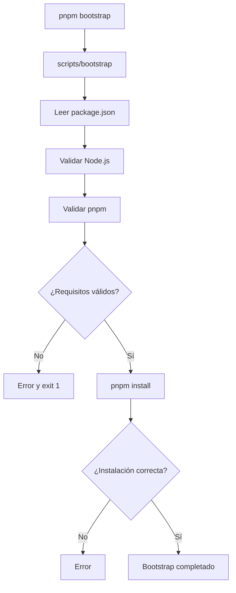

El bootstrap finaliza con error cuando los requisitos de entorno o la instalación no son satisfactorios.

### 05.2. Build

El script `scripts/build` delega el build de los workspaces a Turborepo mediante:

```text
turbo run build
```

Flujo:

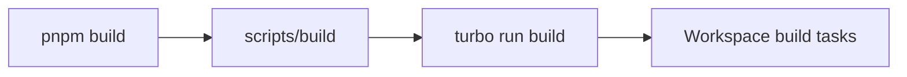

La suite root no implementa la lógica de compilación específica de cada workspace.

La responsabilidad de cada build permanece en el `package.json` del workspace y en su configuración técnica correspondiente.

### 05.3. Development

El script `scripts/dev` delega el modo desarrollo mediante:

```text
turbo run dev
```

Flujo:

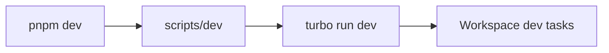

La configuración global de Turborepo define `dev` como:

- persistente;
- sin caching.

### 05.4. Testing

El script `scripts/test` delega la ejecución de las tareas `test` a Turborepo:

```text
turbo run test
```

Flujo:

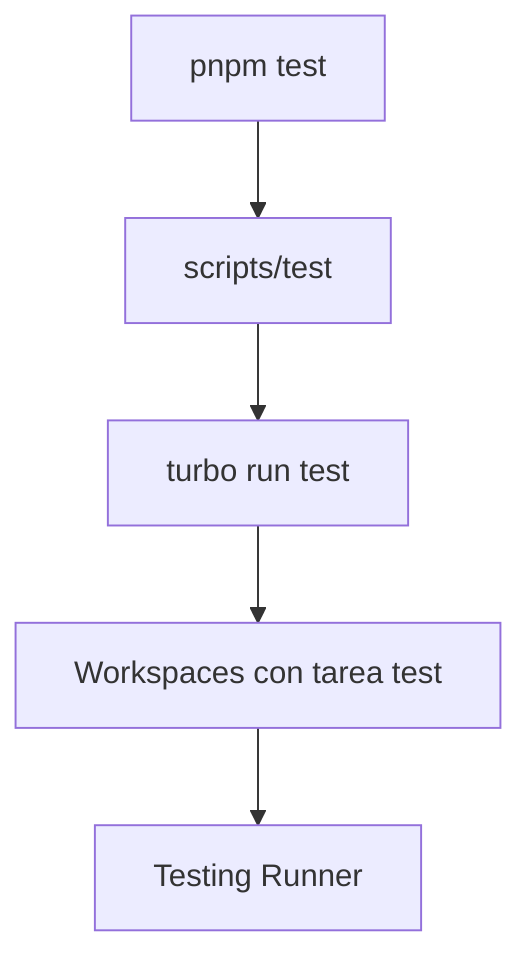

El runner concreto depende del workspace y de las reglas de **EE-ADR-002**.

El estándar establece:

| Tipo de prueba     | Herramienta |
| :----------------- | :---------- |
| Unit               | Vitest      |
| Integration        | Vitest      |
| Component          | Vitest      |
| E2E                | Playwright  |
| Browser            | Playwright  |
| Legacy / excepción | Jest        |

No se fuerza la creación de una tarea `test` en workspaces que no tengan una superficie de testing aplicable.

#### 05.4.1. Semántica `NO_TESTS`

La ejecución de:

```text
turbo run test
```

puede producir:

```text
Tasks: 0 successful, 0 total
```

cuando ningún workspace participante define una tarea `test`.

Este estado se interpreta conforme a la política de adopción progresiva de EE-ADR-002 y no constituye por sí mismo un fallo de la suite root.

El script `scripts/test` informa explícitamente esta posibilidad.

### 05.5. Lint

El script `scripts/lint` delega el linting a Turborepo:

```text
turbo run lint
```

Flujo:

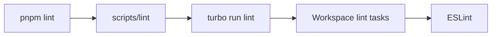

La configuración compartida de ESLint reside en:

```text
packages/config/eslint/
```

La suite root no contiene reglas específicas de linting de los workspaces.

#### 05.5.1. Configure Lint

El archivo `scripts/configure-lint.mjs` es un script auxiliar de configuración masiva de ESLint.

No constituye un comando root público equivalente a:

```text
pnpm lint
```

Su responsabilidad es preparar los workspaces para utilizar ESLint y la configuración compartida:

```text
@eq-labs/config-eslint
```

La implementación mantiene conjuntos explícitos de workspaces TypeScript y JavaScript y configura:

- `scripts.lint`;
- dependencia `eslint`;
- dependencia `@eq-labs/config-eslint` cuando corresponde;
- `eslint.config.mjs`.

Flujo conceptual:

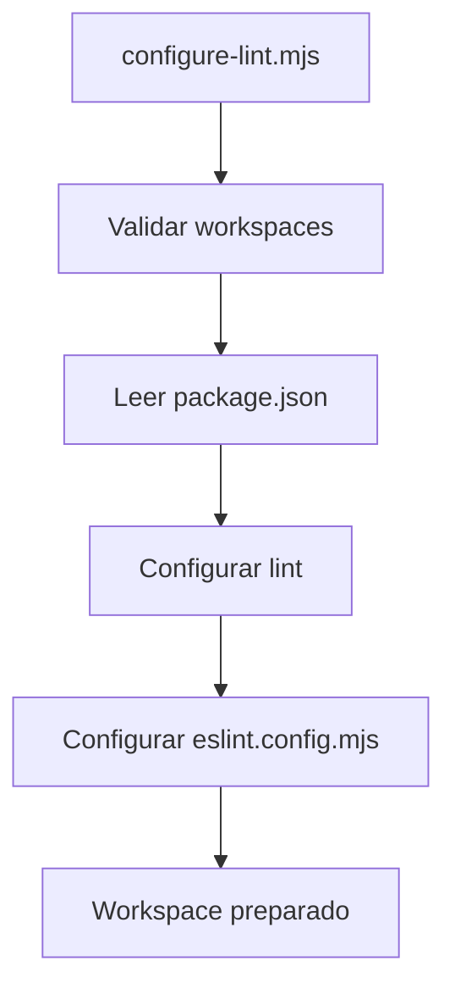

### 05.6. Format

El script `scripts/format` proporciona el punto de entrada root para Prettier.

Primero comprueba que Prettier está disponible mediante:

```text
pnpm exec prettier --version
```

Posteriormente ejecuta:

```text
pnpm exec prettier --write . --ignore-path .prettierignore
```

Flujo:

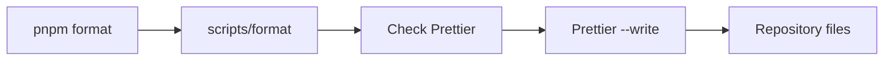

La configuración compartida de Prettier pertenece a:

```text
packages/config/prettier/
```

### 05.7. Typecheck

El script `scripts/typecheck` delega la comprobación de tipos a:

```text
turbo run typecheck
```

Flujo:

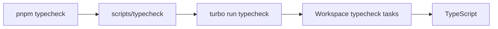

Cada workspace participante define su propia tarea `typecheck` y consume las configuraciones compartidas correspondientes.

### 05.8. Validate

El script `scripts/validate` constituye el punto de entrada para la validación integral del repositorio.

Su implementación combina ejecución de tareas y validaciones locales.

#### 05.8.1. Superficies de Validación

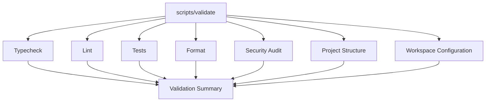

#### 05.8.2. Project Structure

La validación de estructura comprueba directorios requeridos, incluyendo:

```text
apps
apps/extensions
connectors
connectors/official
packages
packages/config
packages/foundation
packages/shared
packages/execution
packages/intelligence
packages/knowledge
packages/governance
packages/integration
packages/registry
packages/sdk
scripts
```

#### 05.8.3. Workspace Configuration

La validación lee:

```text
pnpm-workspace.yaml
```

y comprueba:

- existencia del archivo;
- sintaxis YAML válida;
- existencia de la colección `packages`;
- presencia de los patrones de workspace requeridos.

Entre los patrones requeridos se encuentran:

```text
apps/*
apps/extensions/*
connectors/official/*
packages/config/*
packages/foundation
packages/shared
packages/execution
packages/intelligence
packages/knowledge
packages/governance
packages/integration
packages/registry
packages/sdk
```

#### 05.8.4. Resultado de la Validación

La ejecución global registrada para el estado actual produjo:

```text
Typecheck: 18 successful / 18 total
Lint:      25 successful / 25 total
Tests:     0 tasks executed
Format:    All matched files use Prettier code style!
Structure: PASS
Workspace: PASS
Final:     All validations passed successfully!
```

La auditoría de seguridad registró:

```text
11 vulnerabilities
2 low
6 moderate
3 high
```

Este resultado se registra como **WARN** dentro de la validación actual y no impidió la finalización satisfactoria de `pnpm validate`.

### 05.9. Doctor

El script `scripts/doctor` proporciona diagnóstico del entorno local.

Comprueba herramientas fundamentales:

```text
Node.js
pnpm
Git
```

También comprueba archivos y directorios estructurales del repositorio.

Entre los elementos inspeccionados se encuentran:

```text
package.json
pnpm-workspace.yaml
turbo.json
.npmrc
.nvmrc
.editorconfig
.gitignore
.gitattributes
LICENSE
NOTICE
README.md
CHANGELOG.md
apps
packages
connectors/official
connectors/community
connectors/experimental
scripts
.github
.vscode
```

El diagnóstico también informa:

- root efectivo;
- plataforma;
- arquitectura;
- versión/configuración de Turbo;
- requisitos de Node.js;
- package manager.

El script finaliza con error cuando detecta un requisito estructural o de entorno marcado como obligatorio.

### 05.10. Generate

El script `scripts/generate` proporciona la interfaz root para generación de código mediante Plop.

Primero valida que Plop esté disponible:

```text
pnpm exec plop --version
```

Después comprueba:

```text
plopfile.js
```

#### 05.10.1. Templates no Configurados

Cuando `plopfile.js` no existe, la implementación actual:

1. informa que los templates todavía no están configurados;
2. indica que esta condición es esperada hasta la implementación de EE-DOC-012;
3. informa que el generador permanece pendiente;
4. finaliza correctamente.

Flujo:

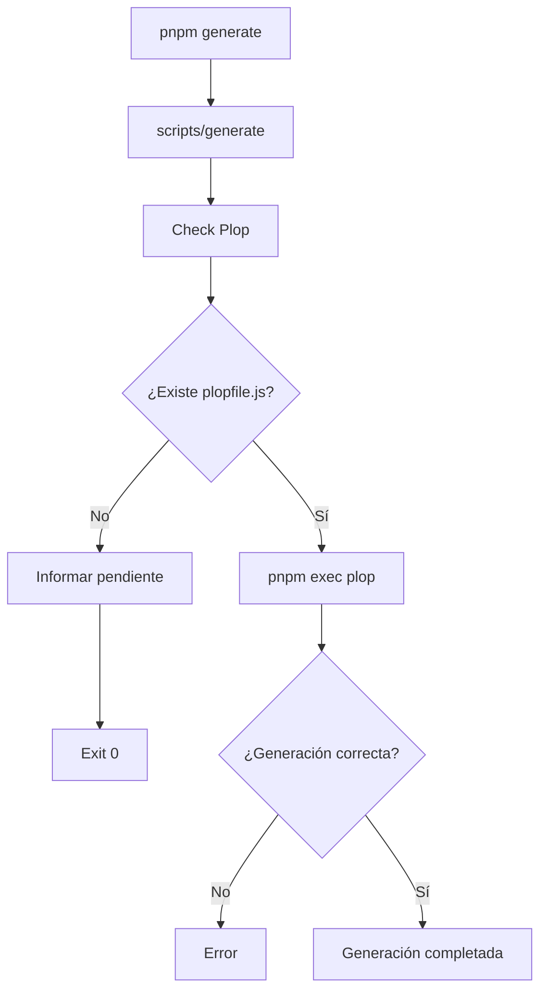

La generación efectiva queda condicionada a la implementación de templates definida por **EE-DOC-012**.

### 05.11. Release

El script `scripts/release` implementa el proceso de release del Engineering Ecosystem.

La implementación integra:

- lectura y validación de la versión root;
- evaluación de Changesets;
- cálculo de la siguiente versión;
- versionado de paquetes;
- sincronización de la versión canónica del Engineering Ecosystem;
- validación;
- build;
- publicación;
- commit de release;
- tag Git;
- push.

### 05.11.1. Versionado Canónico

La política establece:

```text
package.json root.version
        ↓
Versión canónica del Engineering Ecosystem
```

Los workspaces mantienen sus propias versiones para publicación y son versionados mediante Changesets.

| Elemento                 | Responsabilidad                         |
| :----------------------- | :-------------------------------------- |
| Root `package.json`      | Versión canónica del EE                 |
| Workspace `package.json` | Versión individual del paquete          |
| Changesets               | Determinación de releases de workspaces |
| `scripts/release`        | Sincronización y ejecución del release  |
| Git tag                  | Identificación del release completo     |

El tag global utiliza:

```text
vX.Y.Z
```

#### 05.11.2. Release Type

El script consulta el estado de Changesets y determina el tipo de release entre:

```text
major
minor
patch
```

Si existe al menos un `major`, ese tipo domina sobre `minor` y `patch`.

Si no existe `major` pero existe `minor`, se utiliza `minor`.

En ausencia de ambos, se utiliza `patch`, siempre que exista un release versionable.

#### 05.11.3. Flujo

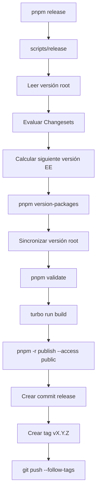

#### 05.11.4. Publicación

La política actual registrada en la implementación establece:

```text
access: public
```

Los workspaces marcados como:

```json
{
  "private": true
}
```

quedan excluidos de la publicación pública.

La modificación de la política de visibilidad o registry distribution no forma parte de la Fase 7 y requeriría revisión arquitectónica específica.

### 05.12. Clean

El script `scripts/clean` delega la limpieza en:

```text
turbo run clean
```

Flujo:

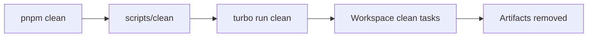

La tarea global `clean` está configurada sin caching.

---

## 06. Interfaz de Comandos Root

La interfaz pública actual del repositorio se encuentra definida en el `package.json` root.

### 06.1. Comandos Delegados a Scripts

```text
pnpm bootstrap
pnpm build
pnpm dev
pnpm test
pnpm lint
pnpm format
pnpm typecheck
pnpm validate
pnpm doctor
pnpm generate
pnpm release
pnpm clean
```

La relación general es:

```text
pnpm <command>
       ↓
node scripts/<command>
```

Ejemplo:

```text
pnpm build
    ↓
node scripts/build
```

### 06.2. Comandos Directos de Changesets

```text
pnpm changeset
pnpm version-packages
```

Su implementación root es:

```text
changeset
changeset version
```

Estos comandos son invocados directamente por PNPM mediante la CLI de Changesets y no mediante archivos del directorio `scripts/`.

---

## 07. Configuración Global de Turborepo

La orquestación global se encuentra definida en:

```text
turbo.json
```

La configuración actual es:

```json
{
  "ui": "tui",
  "tasks": {
    "build": {
      "dependsOn": ["^build"],
      "outputs": ["dist/**"]
    },
    "dev": {
      "cache": false,
      "persistent": true
    },
    "test": {
      "outputs": ["coverage/**"]
    },
    "typecheck": {
      "outputs": []
    },
    "clean": {
      "cache": false
    },
    "lint": {
      "outputs": []
    }
  }
}
```

### 07.1. Build

```text
dependsOn: ^build
outputs: dist/**
```

El build respeta las dependencias de build de los workspaces y registra `dist/**` como output cacheable.

### 07.2. Development

```text
cache: false
persistent: true
```

El modo desarrollo no utiliza caching y permanece activo.

### 07.3. Test

```text
outputs: coverage/**
```

Los outputs de cobertura se consideran artefactos de la tarea `test` cuando los workspaces los generan.

### 07.4. Typecheck

```text
outputs: []
```

La tarea se considera de validación y no registra outputs de build.

### 07.5. Lint

```text
outputs: []
```

El lint es una operación de validación y no registra outputs.

### 07.6. Clean

```text
cache: false
```

La limpieza no utiliza caching.

---

## 08. Documentación Local de Scripts

El archivo:

```text
scripts/README.md
```

documenta localmente la arquitectura de la suite.

Su contenido establece:

- PNPM como package manager oficial;
- Turbo como workspace task orchestrator oficial;
- separación entre package management y task orchestration;
- comandos de nivel repository;
- política de publicación.

El README local actúa como documentación operativa complementaria.

La autoridad normativa de la estructura y del contrato de comandos continúa perteneciendo a **EE-DOC-006**.

---

## 09. Contrato de Estabilidad

Los nombres y responsabilidades de los scripts y comandos root constituyen interfaces estables del Engineering Ecosystem.

Se establece:

1. Los comandos existentes no deben modificarse de forma incompatible.
2. Los nombres de los comandos root deben permanecer estables.
3. Nuevos scripts pueden introducirse de forma compatible.
4. Un nuevo script no debe alterar silenciosamente el comportamiento de los comandos existentes.
5. Los comandos `changeset` y `version-packages` deben conservar su carácter de comandos directos de Changesets mientras esa sea la arquitectura aprobada.
6. La responsabilidad del task graph debe permanecer en Turborepo.
7. La responsabilidad del package management debe permanecer en PNPM.
8. Los cambios de arquitectura de orquestación requieren el mecanismo de gobernanza correspondiente.

---

## 10. Separación de Responsabilidades

| Componente       | Responsabilidad                                               |
| :--------------- | :------------------------------------------------------------ |
| **PNPM**         | Gestión de dependencias, workspaces y operaciones de paquetes |
| **Root Scripts** | Interfaz estable de automatización del repositorio            |
| **Turborepo**    | Task graph y orquestación de workspaces                       |
| **TypeScript**   | Type checking                                                 |
| **ESLint**       | Static analysis                                               |
| **Prettier**     | Formatting                                                    |
| **Vitest**       | Unit / Integration / Component Testing                        |
| **Playwright**   | E2E / Browser Testing                                         |
| **Jest**         | Legacy / excepciones documentadas                             |
| **Plop**         | Code generation                                               |
| **Changesets**   | Versionado de paquetes y release plan                         |
| **SemVer**       | Validación y cálculo de versiones                             |
| **Git**          | Commit, tagging y push                                        |

---

## 11. Integración con EE-ADR-001

La implementación de Fase 7 no sustituye la decisión arquitectónica de orquestación.

**EE-ADR-001** determina que Turborepo es el mecanismo oficial para la orquestación del task graph de los workspaces.

La suite root implementa el punto de entrada:

```text
Usuario
  ↓
PNPM
  ↓
Root Script
  ↓
Turborepo
  ↓
Workspace Task Graph
  ↓
Workspace
```

Los scripts root funcionan como una capa de interfaz y coordinación de nivel repositorio.

---

## 12. Integración con EE-ADR-002

La suite `scripts/test` no define por sí misma los runners de testing.

Su responsabilidad es exponer:

```text
pnpm test
```

y delegar:

```text
turbo run test
```

La selección del runner queda determinada por cada workspace y por EE-ADR-002.

El modelo actual es:

```text
Root
  ↓
scripts/test
  ↓
Turborepo
  ↓
Workspace
  ↓
Vitest / Playwright / Jest exception
```

La ausencia de tareas `test` en un workspace no obliga a introducir una tarea artificial.

La semántica `NO_TESTS` se mantiene como estado válido de adopción progresiva.

---

## 13. Descubrimientos Identificados

### 13.1. Sincronización Documental de EE-DOC-006

Durante la preparación de esta documentación se confirmó que la especificación normativa de EE-DOC-006 debía reflejar explícitamente:

- `generate`;
- `release`;
- `configure-lint.mjs`;
- `scripts/README.md`;
- comandos directos `changeset`;
- comando directo `version-packages`;
- separación entre scripts físicos y comandos directos de Changesets.

Esta sincronización fue incorporada en **EE-DOC-006 v1.2.0**.

El tratamiento corresponde a una sincronización documental y no a una nueva decisión arquitectónica.

### 13.2. Estado del README Root

El estado del proyecto fue previamente sincronizado mediante **D-001 — Sincronización documental del estado del proyecto**.

No se introduce una nueva decisión arquitectónica por este hallazgo.

### 13.3. Estado de Templates

La capacidad `generate` está preparada para Plop, pero la generación efectiva depende de la existencia de `plopfile.js`.

La ausencia actual de templates se considera una condición pendiente de **EE-DOC-012**, no un fallo de la interfaz root.

### 13.4. Decisión Arquitectónica

La Fase 7 **no introduce una nueva decisión arquitectónica**.

La implementación materializa decisiones ya aprobadas:

| Decisión                                        | Fuente                                    |
| :---------------------------------------------- | :---------------------------------------- |
| Turborepo como orquestador                      | EE-ADR-001                                |
| PNPM como package manager                       | EE-DOC-006 / arquitectura del repositorio |
| Vitest como estándar Unit/Integration/Component | EE-ADR-002                                |
| Playwright como estándar E2E/Browser            | EE-ADR-002                                |
| Jest únicamente para legacy/excepciones         | EE-ADR-002                                |
| Changesets para versionado de paquetes          | EE-DOC-006 / workflow de release          |

---

## 14. Validaciones Ejecutadas

La validación registrada para el estado actual del repositorio de Fase 7:

| Validación            | Resultado   | Detalle                                        |
| :-------------------- | :---------- | :--------------------------------------------- |
| `turbo run typecheck` | ✅ Exitoso  | 18 successful, 18 total (18 cached)            |
| `turbo run lint`      | ✅ Exitoso  | 25 successful, 25 total (25 cached)            |
| `turbo run test`      | ✅ NO_TESTS | 0 tasks executed (adopción progresiva)         |
| `pnpm format`         | ✅ Exitoso  | All matched files use Prettier code style!     |
| `security audit`      | ⚠️ WARN     | 11 vulnerabilities (2 low, 6 moderate, 3 high) |
| `validate structure`  | ✅ Exitoso  | Project structure validated                    |
| `validate workspace`  | ✅ Exitoso  | Workspace configuration validated              |

### 14.1. Resultado de la Implementación y Estado de la Fase

Resultado global de validación:

```text
✅ All validations passed successfully!
```

La Fase 7 queda documentada como **implementada técnicamente** en el estado actual del repositorio.

La implementación materializa:

```text
scripts/
    ↓
Root Commands
    ↓
Repository Automation
    ↓
Turborepo / PNPM / Tooling
```

La separación arquitectónica resultante es:

```text
PNPM
└── Package Management

Root Scripts
└── Stable Repository Interface

Turborepo
└── Workspace Task Orchestration

Specialized Tools
├── TypeScript
├── ESLint
├── Prettier
├── Vitest
├── Playwright
├── Plop
├── Changesets
├── SemVer
└── Git
```

La implementación no introduce una nueva arquitectura de orquestación.

### 14.2. Advertencias y Notas Observadas

- **Seguridad:** 11 vulnerabilidades detectadas en auditoría (El hallazgo se registra como resultado de seguridad del estado actual y no como fallo de la implementación de scripts.);
- **Tests:** Estado `NO_TESTS` es válido conforme a adopción progresiva de EE-ADR-002;
- **Generación:** Plop está disponible pero `plopfile.js` no existe (condición esperada, pendiente de EE-DOC-012).

---

## 15. Trazabilidad

| Elemento                           | Referencia                                          |
| :--------------------------------- | :-------------------------------------------------- |
| **Documento normativo padre**      | EE-DOC-006 — Repository Structure                   |
| **Fase**                           | Fase 7 — Root Script Suite Automation               |
| **Implementación**                 | EE-IMP-006-P07                                      |
| **Artefactos físicos**             | `scripts/` y configuración en `package.json` root   |
| **Especificación de orquestación** | EE-ADR-001 — Workspace Task Orchestration Strategy  |
| **Especificación de testing**      | EE-ADR-002 — Engineering Ecosystem Testing Standard |

### 15.1. Conformidad

La implementación documentada en este documento es conforme con el alcance de la Fase 7 cuando:

- existe el directorio `scripts/`;
- existen los scripts físicos establecidos por EE-DOC-006;
- los comandos root establecidos permanecen disponibles;
- `changeset` y `version-packages` conservan su implementación directa mediante Changesets;
- las tareas de workspace se delegan a Turborepo cuando corresponde;
- las operaciones de package management permanecen bajo responsabilidad de PNPM;
- la interfaz pública de scripts permanece estable;
- la validación técnica se ejecuta satisfactoriamente;
- los estados `NO_TESTS` y `WARN` quedan correctamente interpretados;
- los descubrimientos relevantes quedan registrados;
- la documentación técnica acompaña la implementación y validación de la fase.

---

### 15.2. Estado Documental

Este documento constituye la **Documentación Técnica de Implementación** correspondiente a la **Fase 7 — Scripts** de **EE-DOC-006 — Repository Structure**.

La Fase 7 forma parte de la etapa de **Implementación** de EE-DOC-006 y sigue el ciclo establecido por EE-DOC-005:

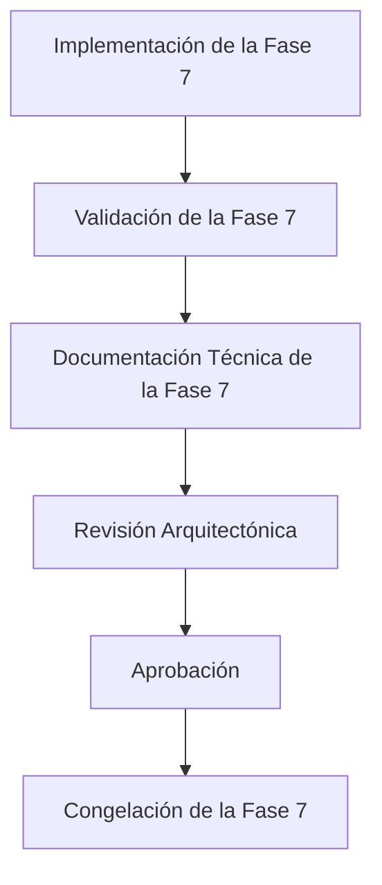

El estado actual de este documento es:

```text
En Revisión Arquitectónica
```

La secuencia de aprobación de esta fase es independiente del estado global de EE-DOC-006.

La aprobación y congelación de **EE-IMP-006-P07** no implica la finalización, Validación Final ni Congelación de **EE-DOC-006**.

EE-DOC-006 solo podrá pasar a su proceso de documentación consolidada, Validación Final y Congelación después de completar todas las fases de implementación y sus respectivos ciclos:

```text
Implementación
    ↓
Validación
    ↓
Documentación
    ↓
Aprobación
    ↓
Congelación de la Fase
```

Una vez finalizadas todas las fases:

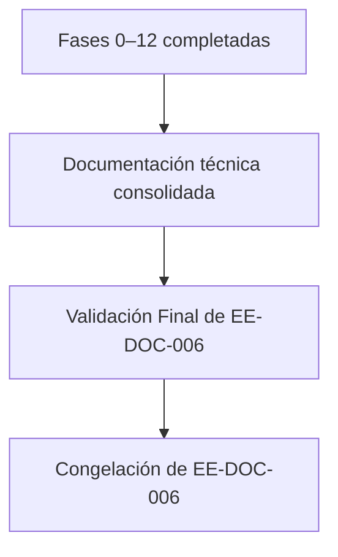

---

## 16. Referencias Normativas

| Código         | Documento                              | Relación                                        |
| :------------- | :------------------------------------- | :---------------------------------------------- |
| **EE-DOC-001** | Master Documentation Index             | Jerarquía documental                            |
| **EE-DOC-002** | Document Design Template               | Estructura documental aplicada                  |
| **EE-DOC-003** | Engineering Ecosystem Constitution     | Gobierno y principios aplicados                 |
| **EE-DOC-004** | Engineering Architecture               | Arquitectura del ecosistema                     |
| **EE-DOC-005** | Development Workflow                   | Ciclo de implementación y documentación         |
| **EE-DOC-006** | Repository Structure                   | Especificación normativa de la Fase 7           |
| **EE-ADR-001** | Workspace Task Orchestration Strategy  | Orquestación de tareas de workspace             |
| **EE-ADR-002** | Engineering Ecosystem Testing Standard | Estándar de testing aplicado por los workspaces |

---

## 17. Historial de Cambios

| Versión    | Fecha      | Autor                    | Aprobado por | Motivo           | Cambios                                                                                                                                          | Estado       |
| :--------- | :--------- | :----------------------- | :----------- | :--------------- | :----------------------------------------------------------------------------------------------------------------------------------------------- | :----------- |
| **v1.0.0** | 2026-09-18 | IA Asistente (propuesta) | Pendiente    | Creación inicial | Generación desde cero de la documentación técnica de la Fase 7, alineada con EE-DOC-006 v1.2.0, la implementación física registrada y EE-ADR-002 | **Aprobado** |

> **Regla de autoridad:** La columna **Autor** registra quién elaboró o propuso el documento. La columna **Aprobado por** registra exclusivamente la autoridad humana que formalmente aprueba el documento. La IA Asistente no constituye autoridad de aprobación.

---

## FIN DEL DOCUMENTO
