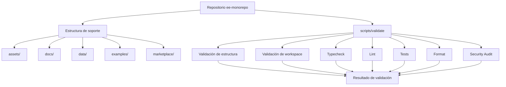
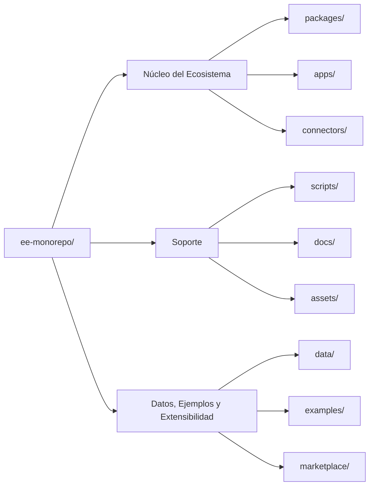

# EE-IMP-006-P08 — Repository Support Structure

Este documento registra la evidencia técnica de la implementación física y validación correspondiente a la unidad **Fase 08–12 — Repository Support Structure** conforme al estándar **EE-DOC-005** y a la especificación normativa vigente de **EE-DOC-006**.

---

## METADATOS

| Campo                 | Valor                                     |
| :-------------------- | :---------------------------------------- |
| **ID**                | EE-IMP-006-P08                            |
| **Documento**         | Repository Support Structure              |
| **Código corto**      | EE-IMP-006-P08                            |
| **Fase**              | Fase 08–12 — Repository Support Structure |
| **Tipo**              | Documento Técnico de Implementación       |
| **Clasificación**     | Implementación                            |
| **Nivel**             | Técnico                                   |
| **Normativo**         | No                                        |
| **Versión**           | v1.0.0                                    |
| **Estado**            | Aprobado                                  |
| **Propietario**       | Equipo de Arquitectura                    |
| **Documento padre**   | EE-DOC-006                                |
| **Dependencias**      | EE-DOC-006, EE-DOC-005                    |
| **Aprobado por**      | Equipo de Arquitectura                    |
| **Audiencia**         | Arquitectura, Desarrollo, DevOps          |
| **Fecha de creación** | 2026-09-19                                |
| **Última revisión**   | 2026-09-19                                |
| **Próxima revisión**  | —                                         |

---

## 01. Objetivo

Registrar la implementación física de la unidad consolidada **Fase 08–12 — Repository Support Structure** del monorepo `ee-monorepo`, materializando los directorios de soporte definidos normativamente por **EE-DOC-006 — Repository Structure v1.3.0**.

La implementación comprende los siguientes directorios de primer nivel:

- `assets/`
- `docs/`
- `data/`
- `examples/`
- `marketplace/`

---

## 02. Alcance Implementado

La implementación física comprende:

- La estructura de recursos compartidos bajo `assets/`.
- La estructura documental del ecosistema bajo `docs/`.
- La estructura de datos bajo `data/`.
- La estructura de ejemplos técnicos bajo `examples/`.
- La estructura de extensibilidad y marketplace bajo `marketplace/`.
- La creación física de los subdirectorios definidos por EE-DOC-006.
- La validación integral de la estructura mediante `pnpm validate`.

El directorio `assets/` forma parte de la estructura física existente del repositorio y se mantiene como parte de esta unidad consolidada. La presente fase no redefine su propósito ni introduce una estructura diferente a la especificada por EE-DOC-006.

No se incorporan:

- Nuevos workspaces PNPM.
- Nuevos paquetes ejecutables.
- Nuevas dependencias de producción.
- Nuevos comandos root.
- Nuevos scripts de automatización.
- Nuevos mecanismos de orquestación.
- Cambios sobre `packages/`, `apps/` o `connectors/`.

---

## 03. Estructura Física Implementada

La estructura física implementada corresponde a la especificación establecida en EE-DOC-006:

```text
ee-monorepo/
├── assets/
│   ├── images/
│   ├── fonts/
│   └── templates/
│
├── docs/
│   ├── architecture/
│   ├── developer/
│   └── adr/
│
├── data/
│   ├── benchmarks/
│   ├── datasets/
│   └── models/
│
├── examples/
│   ├── erp/
│   ├── microservices/
│   └── ddd/
│
└── marketplace/
    ├── plugins/
    ├── agents/
    ├── prompts/
    ├── skills/
    └── templates/
```

La especificación normativa define estos directorios como los artefactos físicos correspondientes a la unidad consolidada Fase 08–12.

### 03.1. `assets/`

```text
assets/
├── images/
├── fonts/
└── templates/
```

Responsabilidad estructural:

- `images/`: recursos gráficos compartidos.
- `fonts/`: fuentes compartidas.
- `templates/`: plantillas y recursos reutilizables.

La estructura coincide con la definida en EE-DOC-006.

### 03.2. `docs/`

```text
docs/
├── architecture/
├── developer/
└── adr/
```

Responsabilidad estructural:

- `architecture/`: documentación relacionada con arquitectura.
- `developer/`: documentación y guías para desarrollo.
- `adr/`: documentación de decisiones arquitectónicas.

### 03.3. `data/`

```text
data/
├── benchmarks/
├── datasets/
└── models/
```

Responsabilidad estructural:

- `benchmarks/`: datos relacionados con benchmarks.
- `datasets/`: conjuntos de datos.
- `models/`: modelos entrenados.

### 03.4. `examples/`

```text
examples/
├── erp/
├── microservices/
└── ddd/
```

Responsabilidad estructural:

- `erp/`: ejemplos relacionados con sistemas ERP.
- `microservices/`: ejemplos relacionados con arquitecturas de microservicios.
- `ddd/`: ejemplos relacionados con Domain-Driven Design.

### 03.5. `marketplace/`

```text
marketplace/
├── plugins/
├── agents/
├── prompts/
├── skills/
└── templates/
```

Responsabilidad estructural:

- `plugins/`: plugins.
- `agents/`: agentes.
- `prompts/`: prompts.
- `skills/`: skills.
- `templates/`: plantillas reutilizables.

La estructura de `examples/` y `marketplace/` está definida explícitamente por EE-DOC-006.

---

## 04. Modelo de Orquestación y Arquitectura de Ejecución

Esta unidad no introduce un nuevo motor de ejecución ni un nuevo orquestador de tareas.

Los directorios implementados constituyen **estructura física de soporte** y no workspaces ejecutables por sí mismos.

La validación de la estructura se integra en el mecanismo existente de validación del repositorio mediante `scripts/validate`.



La función de `scripts/validate` como punto de entrada integral de validación se encuentra establecida en EE-DOC-006.

### 04.1. Repartición de Responsabilidades

| Componente             | Responsabilidad                                                                                    |
| :--------------------- | :------------------------------------------------------------------------------------------------- |
| **`assets/`**          | Proporcionar la estructura física para recursos compartidos.                                       |
| **`docs/`**            | Proporcionar la estructura física para documentación del ecosistema.                               |
| **`data/`**            | Proporcionar la estructura física para datos del ecosistema.                                       |
| **`examples/`**        | Proporcionar la estructura física para ejemplos técnicos.                                          |
| **`marketplace/`**     | Proporcionar la estructura física para artefactos de extensibilidad y marketplace.                 |
| **`scripts/validate`** | Ejecutar la validación integral de la estructura y configuración del repositorio.                  |
| **PNPM**               | Mantener la gestión de paquetes y workspaces existentes; esta fase no incorpora nuevos workspaces. |
| **Turborepo**          | Mantener la orquestación existente; esta fase no modifica su grafo de tareas.                      |

---

## 05. Especificación Técnica de Artefactos

| Artefacto / Comando        | Ruta Física / CLI         | Descripción                          | Mecanismo Principal     |
| :------------------------- | :------------------------ | :----------------------------------- | :---------------------- |
| **Shared Assets**          | `assets/`                 | Estructura para recursos compartidos | Sistema de archivos     |
| **Images**                 | `assets/images/`          | Recursos gráficos                    | Sistema de archivos     |
| **Fonts**                  | `assets/fonts/`           | Fuentes compartidas                  | Sistema de archivos     |
| **Templates**              | `assets/templates/`       | Plantillas compartidas               | Sistema de archivos     |
| **Architecture Docs**      | `docs/architecture/`      | Documentación de arquitectura        | Sistema de archivos     |
| **Developer Docs**         | `docs/developer/`         | Documentación para desarrolladores   | Sistema de archivos     |
| **ADR Docs**               | `docs/adr/`               | Decisiones arquitectónicas           | Sistema de archivos     |
| **Benchmarks**             | `data/benchmarks/`        | Datos de benchmarks                  | Sistema de archivos     |
| **Datasets**               | `data/datasets/`          | Conjuntos de datos                   | Sistema de archivos     |
| **Models**                 | `data/models/`            | Modelos entrenados                   | Sistema de archivos     |
| **ERP Examples**           | `examples/erp/`           | Ejemplos de ERP                      | Sistema de archivos     |
| **Microservices Examples** | `examples/microservices/` | Ejemplos de microservicios           | Sistema de archivos     |
| **DDD Examples**           | `examples/ddd/`           | Ejemplos de DDD                      | Sistema de archivos     |
| **Plugins**                | `marketplace/plugins/`    | Plugins del marketplace              | Sistema de archivos     |
| **Agents**                 | `marketplace/agents/`     | Agentes del marketplace              | Sistema de archivos     |
| **Prompts**                | `marketplace/prompts/`    | Prompts reutilizables                | Sistema de archivos     |
| **Skills**                 | `marketplace/skills/`     | Skills reutilizables                 | Sistema de archivos     |
| **Marketplace Templates**  | `marketplace/templates/`  | Plantillas del marketplace           | Sistema de archivos     |
| **Repository Validation**  | `pnpm validate`           | Validación integral del repositorio  | PNPM + scripts/validate |

---

## 06. Integración con la Estructura del Monorepo

La unidad Repository Support Structure se integra con la estructura existente del repositorio sin alterar los dominios ejecutables existentes.



La organización en estas tres agrupaciones funcionales corresponde al modelo definido por EE-DOC-006.

### 06.1. Independencia respecto de Workspaces

Los directorios implementados en esta fase no constituyen workspaces PNPM por el solo hecho de existir.

Su función inicial es estructural y organizativa.

Por tanto:

- no se agregan patrones de workspace al `pnpm-workspace.yaml`;
- no se agregan `package.json` a estos directorios;
- no se introducen scripts de build;
- no se incorporan dependencias;
- no se modifica el grafo de Turborepo.

Esta separación mantiene la distinción entre estructura de soporte y unidades ejecutables del monorepo.

---

## 07. Integración con Validación y Quality Gates

La nueva estructura queda sujeta a los mecanismos de validación existentes.

EE-DOC-006 establece `scripts/validate` como mecanismo de validación de estructura, convenciones y dependencias, y establece su ejecución como requisito de cumplimiento del repositorio.

La implementación de esta fase no requirió modificar el mecanismo de validación.

El resultado observado confirma que la estructura de soporte coexistió correctamente con:

- workspaces existentes;
- configuración compartida;
- paquetes;
- aplicaciones;
- conectores;
- scripts root;
- configuración de PNPM;
- configuración de Turborepo.

---

## 08. Consideraciones de Implementación

### 08.1. Estructura vacía como estado válido

Los directorios de soporte implementados constituyen contenedores estructurales.

La existencia de una carpeta no implica que deba contener inmediatamente artefactos funcionales.

Por ejemplo:

```text
data/datasets/
```

define el espacio físico destinado a datasets, pero no obliga a que exista un dataset durante esta fase.

El mismo principio aplica a:

- `assets/images/`
- `assets/fonts/`
- `assets/templates/`
- `docs/architecture/`
- `docs/developer/`
- `docs/adr/`
- `data/benchmarks/`
- `data/datasets/`
- `data/models/`
- `examples/erp/`
- `examples/microservices/`
- `examples/ddd/`
- `marketplace/plugins/`
- `marketplace/agents/`
- `marketplace/prompts/`
- `marketplace/skills/`
- `marketplace/templates/`

### 08.2. Separación de responsabilidades

La implementación mantiene la separación establecida en EE-DOC-006:

- `packages/` mantiene los módulos reutilizables del ecosistema.
- `apps/` mantiene los puntos de entrada ejecutables.
- `connectors/` mantiene las integraciones externas.
- `scripts/` mantiene la automatización del repositorio.
- `docs/` mantiene la documentación.
- `assets/` mantiene recursos compartidos.
- `data/` mantiene datos.
- `examples/` mantiene ejemplos.
- `marketplace/` mantiene artefactos de extensibilidad.

### 08.3. Ausencia de cambios arquitectónicos

La implementación materializa una estructura ya definida por EE-DOC-006 v1.3.0.

No se introdujo:

- nueva capa arquitectónica;
- nuevo dominio;
- nuevo contrato;
- nueva integración;
- nuevo mecanismo de ejecución;
- nueva estrategia de orquestación.

---

## 09. Descubrimientos y Decisiones de Implementación

Durante la implementación no se identificó una desviación que requiriera modificar la especificación normativa vigente.

La consolidación de las Fases 08–12 ya se encontraba formalmente establecida en EE-DOC-006 v1.3.0.

Por tanto, esta implementación mantiene:

```text
Fase 08–12
    └── EE-IMP-006-P08
```

y no genera:

```text
EE-IMP-006-P09
EE-IMP-006-P10
EE-IMP-006-P11
EE-IMP-006-P12
```

EE-DOC-006 establece explícitamente que la unidad consolidada se documenta mediante un único EE-IMP-006-P08.

### 09.1. ADR / RFC

**ADR requerido:** No.

**RFC requerido:** No.

**Clasificación del cambio:** Aclaración / Sincronización documental e implementación de estructura ya aprobada.

No se ha tomado una nueva decisión arquitectónica que requiera un ADR y no existe un cambio transversal que requiera un RFC.

---

## 10. Validaciones Ejecutadas

La implementación fue sometida a la validación integral del repositorio mediante:

```text
pnpm validate
```

### 10.1. Resultados

| Comando / Pruebas       | Resultado   | Detalle / Tiempo                               |
| :---------------------- | :---------- | :--------------------------------------------- |
| `pnpm validate`         | ✅ Exitoso  | Suite integral completada correctamente        |
| Typecheck               | ✅ Exitoso  | 18 / 18 tareas exitosas                        |
| Lint                    | ✅ Exitoso  | 25 / 25 tareas exitosas                        |
| Tests                   | ✅ Exitoso  | 0 tareas ejecutadas / 0 total                  |
| Format                  | ✅ Exitoso  | Todos los archivos cumplen Prettier            |
| Security Audit          | ⚠️ Warnings | 11 vulnerabilidades: 2 low, 6 moderate, 3 high |
| Project Structure       | ✅ Exitoso  | Estructura del repositorio validada            |
| Workspace Configuration | ✅ Exitoso  | Configuración de workspaces validada           |
| Resultado final         | ✅ Exitoso  | `All validations passed successfully!`         |

### 10.2. Resultado de la Implementación y Estado de la Fase

La estructura física correspondiente a la unidad **Fase 08–12 — Repository Support Structure** fue implementada y validada satisfactoriamente.

Los cinco directorios de primer nivel definidos por EE-DOC-006 están presentes:

```text
assets/
docs/
data/
examples/
marketplace/
```

y contienen los subdirectorios establecidos por la especificación normativa.

La validación integral del repositorio finalizó satisfactoriamente.

### 10.3. Correcciones / Warnings Observados

La validación de seguridad reportó:

```text
11 vulnerabilities
├── 2 low
├── 6 moderate
└── 3 high
```

Estas vulnerabilidades corresponden al estado general de dependencias del repositorio y no fueron identificadas como consecuencia de la creación de la estructura física de soporte de esta fase.

El resultado de seguridad no impidió la finalización satisfactoria de `pnpm validate`.

El alcance de esta fase no incluye la resolución de dichas vulnerabilidades.

---

## 11. Trazabilidad

| Elemento                      | Referencia                                               |
| :---------------------------- | :------------------------------------------------------- |
| **Documento normativo padre** | EE-DOC-006 — Repository Structure                        |
| **Versión normativa**         | v1.3.0                                                   |
| **Fase**                      | Fase 08–12 — Repository Support Structure                |
| **Implementación**            | EE-IMP-006-P08                                           |
| **Artefactos físicos**        | `assets/`, `docs/`, `data/`, `examples/`, `marketplace/` |
| **Proceso documental**        | EE-DOC-005 — Development Workflow                        |
| **Validación**                | `pnpm validate`                                          |

### 11.1. Conformidad

La implementación registrada en este documento corresponde a la estructura física definida por EE-DOC-006 v1.3.0 para la unidad consolidada Fase 08–12 — Repository Support Structure.

Los artefactos físicos registrados fueron implementados y sometidos a la validación integral del repositorio mediante pnpm validate.

La evidencia registrada en este documento representa el resultado técnico de la implementación realizada y su validación correspondiente.

El ciclo de vida documental y las transiciones de aprobación, validación y congelación se gestionan conforme a EE-DOC-005 — Development Workflow y no forman parte del contenido operativo de este documento técnico.

---

## 12. Referencias

| Código         | Documento                              | Descripción                                                                         |
| :------------- | :------------------------------------- | :---------------------------------------------------------------------------------- |
| **EE-DOC-005** | Development Workflow                   | Define el ciclo de implementación, documentación técnica, validación y congelación. |
| **EE-DOC-006** | Repository Structure                   | Define normativamente la estructura física del repositorio.                         |
| **EE-DOC-002** | Document Design Template               | Define el estándar documental utilizado por este entregable.                        |
| **EE-ADR-001** | Workspace Task Orchestration Strategy  | Define la separación entre PNPM y Turborepo.                                        |
| **EE-ADR-002** | Engineering Ecosystem Testing Standard | Define el estándar de testing del ecosistema.                                       |

---

## 13. Historial de Cambios

| Versión    | Fecha      | Autor                  | Aprobado por           | Motivo                  | Cambios                                                                                                 | Estado       |
| :--------- | :--------- | :--------------------- | :--------------------- | :---------------------- | :------------------------------------------------------------------------------------------------------ | :----------- |
| **v1.0.0** | 2026-09-19 | Equipo de Arquitectura | Equipo de Arquitectura | Creación del DT de Fase | Registro inicial de la evidencia técnica de implementación y validación de Repository Support Structure | **Aprobado** |

---

## FIN DEL DOCUMENTO
