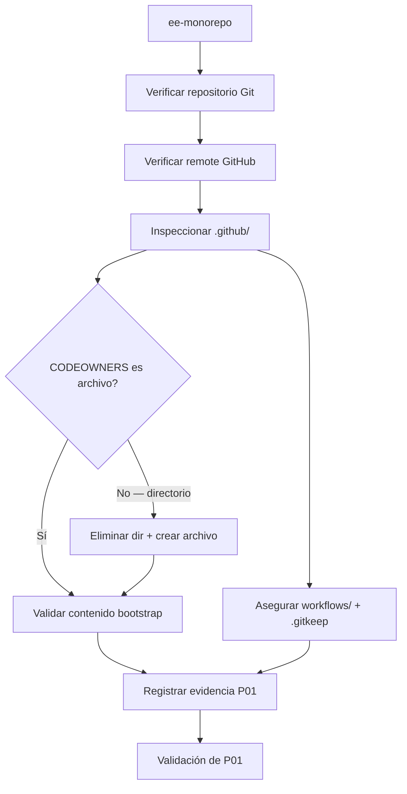

# EE-IMP-007-P01 — GitHub Governance Bootstrap

Este documento registra la evidencia técnica de la implementación física y validación correspondiente a la Unidad P01 conforme a **EE-DOC-005 — Development Workflow** y **EE-DOC-007 — GitHub Governance**.

---

## METADATOS

| Campo             | Valor                                |
| :---------------- | :----------------------------------- |
| **ID**            | EE-IMP-007-P01                       |
| **Documento**     | GitHub Governance Bootstrap          |
| **Código corto**  | EE-IMP-007-P01                       |
| **Fase**          | Fase 1 — GitHub Governance Bootstrap |
| **Tipo**          | Documento Técnico de Implementación  |
| **Clasificación** | Implementación                       |
| **Nivel**         | Técnico                              |
| **Normativo**     | No                                   |
| **Versión**       | v0.4.0                               |
| **Estado**        | Completado                           |
| **Propietario**   | Equipo de Arquitectura               |

| **Documento padre** | EE-DOC-007 — GitHub Governance |
| **Dependencias** | EE-DOC-002, EE-DOC-005, EE-DOC-006, EE-DOC-007 |
| **Aprobado por** | Pendiente |
| **Audiencia** | Arquitectura, Desarrollo, DevOps |
| **Fecha de creación** | 2026-09-22 |
| **Última revisión** | 2026-09-22 |
| **Próxima revisión** | No aplica — Unidad completada; siguientes cambios vía P02–P08 o evolución gobernada |

---

## 01. Objetivo

Materializar la base física mínima de **GitHub Governance** requerida por **EE-DOC-007**, preparando el repositorio `ee-monorepo` para las unidades posteriores P02–P08 sin anticipar decisiones que pertenecen a dichas unidades.

---

## 02. Alcance Implementado

P01 comprende exclusivamente:

- Verificación de identidad del repositorio principal `ee-monorepo`.
- Verificación del remote GitHub configurado, sin modificarlo automáticamente.
- Creación / corrección de la estructura base `.github/`.
- Creación de `.github/workflows/` como espacio físico para GitHub Actions.
- Creación de `.github/CODEOWNERS` como **archivo** bootstrap, sin asignar equipos operativos.
- Registro de la organización GitHub únicamente si puede verificarse desde la configuración existente.

P01 no implementa:

- Teams, roles o permisos operativos (P02).
- Branch Protection / Rulesets (P03).
- Ownership operativo de CODEOWNERS (P04).
- Workflows funcionales de GitHub Actions (P05).
- Required Checks / Quality Gates (P06).
- Controles avanzados de seguridad y auditoría (P07).
- Validación y consolidación final (P08).

---

## 03. Estado As-Found (pre-corrección)

Inspección local en:

```text
C:\Users\Edus\Desktop\Proyectos\EQ-LABS-TECH\ee-monorepo
```

### 03.1. Estructura `.github/` detectada

```text
.github/
├── CODEOWNERS/              ← DIRECTORIO (anomalía)
├── ISSUE_TEMPLATE/          ← directorio vacío
├── PULL_REQUEST_TEMPLATE/   ← directorio vacío
└── workflows/               ← directorio vacío
```

### 03.2. Estado Git (as-found)

```text
## No commits yet on main...origin/main [gone]
```

- Sin commits en `main`.
- Remote `origin/main` reportado como `[gone]` en el clone local al momento de la inspección.
- Directorios vacíos de `.github/` no aparecen en `git status` (comportamiento esperado de Git).

### 03.3. Organización y repositorio canónicos (registrados)

Valores verificables a partir de la URL oficial del repositorio (aportada 2026-09-22):

| Campo                     | Valor                                                        | Notas                                                 |
| :------------------------ | :----------------------------------------------------------- | :---------------------------------------------------- |
| **Organización GitHub**   | `EQ-LABS-TECH`                                               | Organización institucional (EE-DOC-007 §05.1)         |
| **Repositorio**           | `ee-monorepo`                                                | Alineado con EE-DOC-007 §05.2                         |
| **URL canónica**          | `https://github.com/EQ-LABS-TECH/ee-monorepo`                | Remote oficial                                        |
| **Remote local esperado** | `origin` → `https://github.com/EQ-LABS-TECH/ee-monorepo.git` | Configuración local pendiente si `origin/main [gone]` |

Estos identificadores se registran en la documentación técnica de implementación; **no** se incorporan al texto normativo de EE-DOC-007 (conforme a EE-DOC-007 §05.1 / §14.4).

### 03.4. Anomalía registrada

| ID            | Descripción                                                                                          | Norma               | Clasificación                                              |
| :------------ | :--------------------------------------------------------------------------------------------------- | :------------------ | :--------------------------------------------------------- |
| **A-P01-001** | `.github/CODEOWNERS` existía como **directorio**; EE-DOC-007 §08 / §10 exige **archivo** en esa ruta | EE-DOC-007 §08, §10 | Tipo B — Especialización / corrección técnica de bootstrap |

`ISSUE_TEMPLATE/` y `PULL_REQUEST_TEMPLATE/` como directorios son compatibles con GitHub y con EE-DOC-007 §10.4 (elementos opcionales). No constituyen anomalía.

---

## 04. Estructura Física Implementada (As-Built)

### 04.1. Estructura objetivo y resultado

```text
ee-monorepo/
└── .github/
    ├── CODEOWNERS                 # ARCHIVO (bootstrap)
    ├── ISSUE_TEMPLATE/
    │   └── .gitkeep
    ├── PULL_REQUEST_TEMPLATE/
    │   └── .gitkeep
    └── workflows/
        └── .gitkeep
```

La estructura mínima obligatoria de EE-DOC-007 §10 queda satisfecha:

| Elemento                 | Requisito normativo       | Estado as-built                        |
| :----------------------- | :------------------------ | :------------------------------------- |
| `.github/`               | Obligatorio               | ✅ Existe                              |
| `.github/workflows/`     | Obligatorio               | ✅ Existe (con `.gitkeep`)             |
| `.github/CODEOWNERS`     | Obligatorio (**archivo**) | ✅ Archivo (`Mode: -a----`, 242 bytes) |
| `ISSUE_TEMPLATE/`        | Opcional §10.4            | ✅ Compatible                          |
| `PULL_REQUEST_TEMPLATE/` | Opcional §10.4            | ✅ Compatible                          |

### 04.2. Evidencia de verificación (PowerShell)

```text
=== .github STRUCTURE ===
Mode   Length Name
----   ------ ----
d-----        ISSUE_TEMPLATE
d-----        PULL_REQUEST_TEMPLATE
d-----        workflows
-a---- 242    CODEOWNERS

=== CODEOWNERS ===
FullName   : ...\ee-monorepo\.github\CODEOWNERS
Mode       : -a----
Length     : 242
Attributes : Archive
```

### 04.3. Contenido bootstrap de CODEOWNERS

```text
# CODEOWNERS — EE-DOC-007 §08 / EE-IMP-007-P01
# Operational ownership patterns are defined in EE-IMP-007-P04
# after teams exist (EE-IMP-007-P02).
#
# This file exists to satisfy the normative path:
#   ee-monorepo/.github/CODEOWNERS
```

Sin equipos ni usuarios concretos (pertenece a P02 / P04).

### 04.4. Corrección aplicada (A-P01-001)

1. Eliminación del directorio anómalo `.github\CODEOWNERS\`.
2. Creación del archivo `.github\CODEOWNERS` (UTF-8).
3. Añadido de `.gitkeep` en `workflows/`, `ISSUE_TEMPLATE/` y `PULL_REQUEST_TEMPLATE/` para permitir versionado de directorios.

---

## 05. Modelo de Ejecución



### 05.1. Repartición de Responsabilidades

| Componente           | Responsabilidad                                               |
| :------------------- | :------------------------------------------------------------ |
| `ee-monorepo`        | Repositorio físico objetivo de la implementación.             |
| `.github/`           | Raíz física de GitHub Governance.                             |
| `.github/workflows/` | Espacio reservado para GitHub Actions posteriores.            |
| `.github/CODEOWNERS` | Artefacto bootstrap de ownership; contenido operativo en P04. |
| P02–P07              | Implementación posterior de capacidades específicas.          |

---

## 06. Especificación Técnica de Artefactos

| Artefacto                | Ruta física                      | Propósito                        | Estado P01                    |
| :----------------------- | :------------------------------- | :------------------------------- | :---------------------------- |
| GitHub Governance root   | `.github/`                       | Raíz física de gobernanza GitHub | **Implementado**              |
| GitHub Actions directory | `.github/workflows/`             | Contenedor de workflows          | **Implementado** (`.gitkeep`) |
| CODEOWNERS bootstrap     | `.github/CODEOWNERS`             | Preparar ownership para P04      | **Implementado** (archivo)    |
| Issue templates dir      | `.github/ISSUE_TEMPLATE/`        | Opcional §10.4                   | **Presente** (`.gitkeep`)     |
| PR templates dir         | `.github/PULL_REQUEST_TEMPLATE/` | Opcional §10.4                   | **Presente** (`.gitkeep`)     |

---

## 07. Reglas de Implementación

1. No se modifica el nombre del repositorio `ee-monorepo` desde P01.
2. No se inventa ni registra un nombre de organización GitHub que no pueda verificarse.
3. No se crean Teams en P01.
4. No se asignan permisos administrativos en P01.
5. No se configura Branch Protection en P01.
6. No se crean workflows funcionales en P01.
7. No se configuran Required Checks en P01.
8. No se asignan owners operativos en CODEOWNERS en P01.
9. Los nombres de archivos y directorios permanecen en inglés conforme a EE-DOC-002 §16.1.
10. Cualquier diferencia entre la especificación y el estado físico deberá registrarse y clasificarse conforme a EE-DOC-005.

---

## 08. Validaciones Ejecutadas

| Comando / Prueba                      | Resultado       | Evidencia                                                                        |
| :------------------------------------ | :-------------- | :------------------------------------------------------------------------------- |
| Inspección `.github/` (Get-ChildItem) | **OK**          | CODEOWNERS archivo; workflows/, ISSUE_TEMPLATE/, PULL_REQUEST_TEMPLATE/ existen  |
| `Get-Item .github\CODEOWNERS`         | **OK**          | Mode `-a----`, Length 242, Attributes Archive                                    |
| Contenido CODEOWNERS                  | **OK**          | Placeholder bootstrap sin owners operativos                                      |
| `.gitkeep` en workflows / templates   | **OK**          | Directorios versionables                                                         |
| `git status` / commits                | **Informativo** | Sin commits aún; `origin/main [gone]` en as-found                                |
| Organización GitHub concreta          | **Registrada**  | `EQ-LABS-TECH`                                                                   |
| Repositorio canónico                  | **Registrado**  | `https://github.com/EQ-LABS-TECH/ee-monorepo`                                    |
| Remote local `origin`                 | **Alineado**    | `git remote -v` → fetch/push a `https://github.com/EQ-LABS-TECH/ee-monorepo.git` |

### 08.1. Criterio de Conformidad

P01 será conforme cuando:

- [x] el repositorio objetivo sea identificado como `ee-monorepo`;
- [x] `.github/` exista;
- [x] `.github/workflows/` exista;
- [x] `.github/CODEOWNERS` exista como **archivo**;
- [x] no se hayan introducido decisiones pertenecientes a P02–P07;
- [x] la estructura física pueda trazarse directamente a EE-DOC-007;
- [x] organización GitHub y URL canónica del repositorio registradas (`EQ-LABS-TECH` / `https://github.com/EQ-LABS-TECH/ee-monorepo`);
- [x] remote local `origin` alineado con la URL canónica.

**Dictamen local de estructura:** **Conforme** respecto a la estructura mínima obligatoria de EE-DOC-007 §10.

**Dictamen org/remote:** organización, repositorio y remote local **conformes**.

**Unidad P01: Completada.** El primer commit que versiona `.github/` queda como pendiente operativo del commit inicial del monorepo; no forma parte del alcance de cierre de esta unidad ni bloquea P02.

---

## 09. Correcciones / Warnings Observados

| ID            | Severidad          | Descripción                                                  | Resolución                                                                                        |
| :------------ | :----------------- | :----------------------------------------------------------- | :------------------------------------------------------------------------------------------------ |
| **A-P01-001** | Mayor (estructura) | `CODEOWNERS` como directorio en lugar de archivo             | Corregido: dir eliminado, archivo bootstrap creado                                                |
| **W-P01-001** | Informativo        | Sin commits; `origin/main [gone]` en as-found                | Resuelto: remote alineado a URL canónica; sin commits sigue siendo estado del monorepo, no de P01 |
| **W-P01-002** | Informativo        | Encoding `utf8NoBOM` no disponible en Windows PowerShell 5.x | Usado `-Encoding UTF8` (con BOM); aceptable para placeholder                                      |

---

## 10. Trazabilidad

| Elemento                           | Referencia                                             |
| :--------------------------------- | :----------------------------------------------------- |
| **Documento normativo padre**      | EE-DOC-007 — GitHub Governance (v1.0.0 Aprobado)       |
| **Fase**                           | Fase 1 — GitHub Governance Bootstrap                   |
| **Implementación**                 | EE-IMP-007-P01                                         |
| **Artefactos físicos**             | `.github/`, `.github/workflows/`, `.github/CODEOWNERS` |
| **Documento estructural superior** | EE-DOC-006 — Repository Structure                      |
| **Ciclo de vida**                  | EE-DOC-005 — Development Workflow                      |

### 10.1. Conformidad

La estructura física mínima de P01 está **implementada y verificada**. La organización `EQ-LABS-TECH`, la URL canónica y el remote local `origin` están **conformes**. **EE-IMP-007-P01 queda Completado.**

---

## 11. Referencias

| Código         | Documento                | Descripción                                                  |
| :------------- | :----------------------- | :----------------------------------------------------------- |
| **EE-DOC-002** | Document Design Template | Estándar documental y ciclo de vida de artefactos.           |
| **EE-DOC-005** | Development Workflow     | Ciclo de implementación, validación y documentación.         |
| **EE-DOC-006** | Repository Structure     | Estructura física del repositorio y ubicación de `.github/`. |
| **EE-DOC-007** | GitHub Governance        | Norma de gobernanza GitHub implementada por P01.             |

---

## 12. Historial de Cambios

| Versión    | Fecha      | Autor                    | Aprobado por | Motivo                                      | Cambios                                                                                                  | Estado                                             |
| :--------- | :--------- | :----------------------- | :----------- | :------------------------------------------ | :------------------------------------------------------------------------------------------------------- | :------------------------------------------------- |
| **v0.1.0** | 2026-09-22 | Equipo de Arquitectura   | —            | Creación de la documentación técnica de P01 | Definición del bootstrap y criterios de evidencia                                                        | En Elaboración                                     |
| **v0.2.0** | 2026-09-22 | AI Engineering Assistant | —            | Evidencia as-built                          | Anomalía A-P01-001 corregida; CODEOWNERS archivo; validaciones locales; estructura conforme §10          | Implementado — Validación local completada         |
| **v0.3.0** | 2026-09-22 | AI Engineering Assistant | —            | Registro org/remote                         | Organización `EQ-LABS-TECH`; URL `https://github.com/EQ-LABS-TECH/ee-monorepo`; checklist org completado | Implementado — Estructura y org/remote registrados |
| **v0.4.0** | 2026-09-22 | AI Engineering Assistant | —            | Cierre P01                                  | Remote `origin` verificado y alineado; checklist completo; unidad **Completado**                         | **Completado**                                     |

---

## FIN DEL DOCUMENTO
