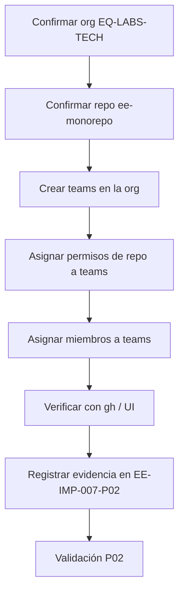

# EE-IMP-007-P02 — Access and Organization Governance

Este documento registra la evidencia técnica de la implementación física y validación correspondiente a la Unidad P02 conforme a **EE-DOC-005 — Development Workflow** y **EE-DOC-007 — GitHub Governance** (§05, §06).

---

## METADATOS

| Campo               | Valor                                       |
| :------------------ | :------------------------------------------ |
| **ID**              | EE-IMP-007-P02                              |
| **Documento**       | Access and Organization Governance          |
| **Código corto**    | EE-IMP-007-P02                              |
| **Fase**            | Fase 2 — Access and Organization Governance |
| **Tipo**            | Documento Técnico de Implementación         |
| **Clasificación**   | Implementación                              |
| **Nivel**           | Técnico                                     |
| **Normativo**       | No                                          |
| **Versión**         | v0.4.0                                      |
| **Estado**          | Completado                                  |
| **Propietario**     | Equipo de Arquitectura                      |
| **Documento padre** | EE-DOC-007 — GitHub Governance              |

| **Dependencias** | EE-DOC-005, EE-DOC-007, EE-IMP-007-P01 |
| **Aprobado por** | Pendiente |
| **Audiencia** | Arquitectura, Desarrollo, DevOps |
| **Fecha de creación** | 2026-09-22 |
| **Última revisión** | 2026-09-22 |
| **Próxima revisión** | Cierre formal P02 / inicio P03 |

---

## 01. Objetivo

Materializar el modelo de **gobernanza organizacional y de acceso** definido por EE-DOC-007 §05 y §06 sobre la organización GitHub y el repositorio principal, sin anticipar Branch Protection (P03), ownership operativo de CODEOWNERS (P04) ni workflows (P05).

---

## 02. Prerrequisitos (P01)

| Prerrequisito                       | Estado     | Referencia                                    |
| :---------------------------------- | :--------- | :-------------------------------------------- |
| Estructura `.github/` mínima        | Completado | EE-IMP-007-P01                                |
| `CODEOWNERS` como archivo bootstrap | Completado | EE-IMP-007-P01                                |
| Organización GitHub identificada    | Completado | `EQ-LABS-TECH`                                |
| Repositorio canónico                | Completado | `https://github.com/EQ-LABS-TECH/ee-monorepo` |
| Remote local `origin` alineado      | Completado | EE-IMP-007-P01 v0.4.0                         |

---

## 03. Identificadores Operativos Registrados

| Campo                     | Valor                                                         | Notas                                |
| :------------------------ | :------------------------------------------------------------ | :----------------------------------- |
| **Organización GitHub**   | `EQ-LABS-TECH`                                                | Registrada en P01; confirmada en P02 |
| **Repositorio principal** | `ee-monorepo`                                                 | EE-DOC-007 §05.2                     |
| **URL canónica**          | `https://github.com/EQ-LABS-TECH/ee-monorepo`                 | —                                    |
| **Visibility objetivo**   | Por definir en ejecución (Private recomendado para bootstrap) | Registrar as-built                   |

Los identificadores de **equipos** y **usuarios** se registran únicamente en este documento (y evidencia de GitHub); no se incorporan a EE-DOC-007.

---

## 04. Alcance de P02

### 04.1. Incluye

- Confirmación de la organización `EQ-LABS-TECH` y del repositorio `ee-monorepo`.
- Definición y creación de **equipos GitHub** alineados al modelo conceptual de EE-DOC-007 §06.9.
- Asignación de **permisos de repositorio** a equipos (no a usuarios individuales, salvo excepción justificada).
- Registro de miembros de equipos (identidades reales, solo en IMP).
- Documentación del proceso de otorgamiento / revocación de accesos aplicado.
- Evidencia de verificación (`gh` CLI o UI GitHub).

### 04.2. No incluye

| Tema                                  | Unidad |
| :------------------------------------ | :----- |
| Branch Protection / Rulesets          | P03    |
| Patrones operativos de CODEOWNERS     | P04    |
| Workflows / Actions                   | P05    |
| Required Checks / Quality Gates       | P06    |
| Secrets, Environments, audit avanzado | P07    |

---

## 05. Modelo de Equipos a Materializar

Derivado de EE-DOC-007 §06.2–§06.9. Nombres definitivos en **kebab-case**, prefijo de organización implícito en GitHub Teams.

| Equipo GitHub (slug) | Nombre visible   | Rol conceptual EE-DOC-007 | Permiso repo `ee-monorepo`                         | Notas                                                       |
| :------------------- | :--------------- | :------------------------ | :------------------------------------------------- | :---------------------------------------------------------- |
| `architecture`       | Architecture     | Architecture Authority    | **Maintain** (o Admin solo si se justifica)        | Accountable normativo; no equivale a Org Owner              |
| `repository-admin`   | Repository Admin | Repository Administration | **Admin**                                          | Administración de settings, teams, permisos del repo        |
| `maintainers`        | Maintainers      | Maintainers               | **Write**                                          | Code review, merge según protección (P03)                   |
| `contributors`       | Contributors     | Contributors              | **Triage** o **Write** según política del proyecto | Por defecto **Triage**; elevar a Write solo si se documenta |

### 05.1. Principios de asignación

1. **Least privilege:** ningún equipo recibe más permiso del necesario.
2. **Team-first:** permisos vía equipos; usuarios individuales solo con justificación registrada.
3. **Architecture ≠ Org Owner automático:** ser Architecture Authority no implica ser Owner de la organización.
4. **Automation:** identidades de Actions se configuran en P05/P07; no se crean teams de bots en P02 salvo necesidad documentada.

### 05.3. Bootstrap single-operator (estado actual)

En la fase actual del Engineering Ecosystem **una sola persona** concentra las responsabilidades de Architecture Authority, Repository Administration y Maintainer.

**Decisión de implementación:**

| Regla               | Aplicación                                                                    |
| :------------------ | :---------------------------------------------------------------------------- |
| Estructura de teams | **Se crea igual** (architecture, repository-admin, maintainers, contributors) |
| Membresía inicial   | El operador único se asigna a los teams que correspondan a sus roles actuales |
| Team `contributors` | Puede quedar **sin miembros** hasta incorporar colaboradores                  |
| Permisos de repo    | Siguen el mapa §05 (Maintain / Admin / Write / Triage por team)               |
| Evolución           | Al incorporar personas: añadir membresías a teams; **no** rediseñar el modelo |

Esto no contradice EE-DOC-007 §06.9: los teams existen como vehículo de permisos; el tamaño de la membresía es un hecho operativo, no una desviación normativa.

**No se inventan** usuarios ficticios ni se documentan logins de terceros inexistentes.

### 05.2. Mapeo conceptual → GitHub (permisos de repositorio)

| Capacidad conceptual                      | architecture | repository-admin | maintainers | contributors |
| :---------------------------------------- | :----------: | :--------------: | :---------: | :----------: |
| Definir política arquitectónica           |      R       |        —         |      —      |      —       |
| Administrar configuración GitHub del repo |      —       |       R/A        |      —      |      —       |
| Administrar equipos/permisos del repo     |      —       |       R/A        |      —      |      —       |
| Crear branch / commits                    |      —       |        —         |      R      |     R\*      |
| Crear Pull Request                        |      —       |        —         |      R      |      R       |
| Code Review                               |     A\*      |        —         |      R      |      —       |
| Integrar cambios                          |     A\*      |       A\*        |      R      |      —       |

`*` sujeto a Branch Protection (P03) y CODEOWNERS (P04). Esta tabla **no** otorga permisos técnicos por sí sola; guía la configuración.

---

## 06. Plan de Ejecución



### 06.1. Comandos orientativos (GitHub CLI)

Requiere `gh` autenticado con permisos de administración en `EQ-LABS-TECH`.

```powershell
# Identidad y contexto
gh auth status
gh api user --jq .login

# Organización y repositorio
gh api orgs/EQ-LABS-TECH --jq "{login:.login, id:.id}"
gh repo view EQ-LABS-TECH/ee-monorepo --json name,visibility,owner

# Crear teams (si no existen)
gh api -X POST orgs/EQ-LABS-TECH/teams -f name="Architecture" -f privacy=closed
gh api -X POST orgs/EQ-LABS-TECH/teams -f name="Repository Admin" -f privacy=closed
gh api -X POST orgs/EQ-LABS-TECH/teams -f name="Maintainers" -f privacy=closed
gh api -X POST orgs/EQ-LABS-TECH/teams -f name="Contributors" -f privacy=closed

# Listar teams
gh api orgs/EQ-LABS-TECH/teams --jq ".[] | {slug:.slug, name:.name, privacy:.privacy}"

# Permisos de repo (ajustar team_slug tras crear)
# permission: pull | triage | push | maintain | admin
gh api -X PUT orgs/EQ-LABS-TECH/teams/architecture/repos/EQ-LABS-TECH/ee-monorepo -f permission=maintain
gh api -X PUT orgs/EQ-LABS-TECH/teams/repository-admin/repos/EQ-LABS-TECH/ee-monorepo -f permission=admin
gh api -X PUT orgs/EQ-LABS-TECH/teams/maintainers/repos/EQ-LABS-TECH/ee-monorepo -f permission=push
gh api -X PUT orgs/EQ-LABS-TECH/teams/contributors/repos/EQ-LABS-TECH/ee-monorepo -f permission=triage

# Miembros (ejemplo — sustituir USER)
# gh api -X PUT orgs/EQ-LABS-TECH/teams/architecture/memberships/USER -f role=member

# Verificar permisos de teams sobre el repo
gh api repos/EQ-LABS-TECH/ee-monorepo/teams --jq ".[] | {name:.name, permission:.permission}"
```

> Los slugs reales de GitHub pueden diferir ligeramente del nombre visible (p.ej. `repository-admin`). Registrar el **slug real** en §08 as-built.

### 06.2. Alternativa UI

Si no se usa `gh`: GitHub → Organization `EQ-LABS-TECH` → Teams → New team; luego Repo Settings → Collaborators and teams → Add team.

---

## 07. Especificación Técnica de Artefactos

| Artefacto                 | Ubicación                  | Propósito                      | Estado P02                                                                                     |
| :------------------------ | :------------------------- | :----------------------------- | :--------------------------------------------------------------------------------------------- |
| Organización              | `EQ-LABS-TECH`             | Unidad administrativa superior | **Confirmada**                                                                                 |
| Repositorio               | `EQ-LABS-TECH/ee-monorepo` | Monorepo principal             | **Confirmado** (PRIVATE)                                                                       |
| Team Architecture         | Org team                   | Architecture Authority         | **Implementado** — permiso `maintain`                                                          |
| Team Repository Admin     | Org team                   | Repository Administration      | **Implementado** — permiso `admin`                                                             |
| Team Maintainers          | Org team                   | Maintainers                    | **Implementado** — permiso `push` (Write)                                                      |
| Team Contributors         | Org team                   | Contributors                   | **Implementado** — permiso `triage`                                                            |
| Permisos de repo por team | Repo settings              | Least privilege                | **Implementado** (verificado vía `gh api`)                                                     |
| Membresías                | Team memberships           | Single-operator                | **Implementado** — operador en Architecture, Repository Admin, Maintainers; Contributors vacío |

---

## 08. Evidencia As-Built

Evidencia capturada 2026-09-22 vía GitHub CLI y confirmación de ejecución en UI.

### 08.1. Organización y repositorio

| Campo           | Valor as-built                                |
| :-------------- | :-------------------------------------------- |
| Org login       | `EQ-LABS-TECH`                                |
| Org id (node)   | `O_kgDOEqstBQ` (owner del repo)               |
| Repo name       | `ee-monorepo`                                 |
| Repo visibility | **PRIVATE**                                   |
| URL canónica    | `https://github.com/EQ-LABS-TECH/ee-monorepo` |

Comando:

```text
gh repo view EQ-LABS-TECH/ee-monorepo --json name,visibility,owner
→ name=ee-monorepo, visibility=PRIVATE, owner.login=EQ-LABS-TECH
```

### 08.2. Teams y permisos sobre el repo

| Nombre visible   | Permiso API (`gh`) | Rol UI equivalente | Miembros                            |
| :--------------- | :----------------- | :----------------- | :---------------------------------- |
| Architecture     | `maintain`         | Maintain           | Operador único (bootstrap)          |
| Repository Admin | `admin`            | Admin              | Operador único (bootstrap)          |
| Maintainers      | `push`             | Write              | Operador único (bootstrap)          |
| Contributors     | `triage`           | Triage             | Ninguno (vacío hasta incorporación) |

Comando:

```text
gh api /repos/EQ-LABS-TECH/ee-monorepo/teams --jq '.[] | {team: .name, permission: .permission}'
→ Architecture/maintain, Repository Admin/admin, Maintainers/push, Contributors/triage
```

Visibilidad de teams (plan UI): Architecture y Repository Admin = **Secreto**; Maintainers y Contributors = **Visible**.

### 08.3. Excepciones (usuarios con permiso directo)

| Login | Permiso | Justificación | Aprobado por |
| :---- | :------ | :------------ | :----------- |
| —     | —       | Ninguna       | —            |

Acceso vía **teams únicamente** (team-first).

---

## 09. Validaciones

| Comando / Prueba                                     | Resultado                 | Evidencia                                                                   |
| :--------------------------------------------------- | :------------------------ | :-------------------------------------------------------------------------- |
| `gh repo view EQ-LABS-TECH/ee-monorepo`              | **OK**                    | PRIVATE; owner EQ-LABS-TECH                                                 |
| Permisos de teams sobre el repo                      | **OK**                    | maintain / admin / push / triage                                            |
| Cuatro teams del modelo                              | **OK**                    | Architecture, Repository Admin, Maintainers, Contributors                   |
| Membresías (single-operator)                         | **OK**                    | Operador en Architecture, Repository Admin, Maintainers; Contributors vacío |
| Permisos individuales no justificados                | **OK**                    | Ninguno registrado                                                          |
| Branch Protection / CODEOWNERS operativo / workflows | **OK (fuera de alcance)** | No introducidos en P02                                                      |

### 09.1. Criterio de Conformidad

P02 será conforme cuando:

- [x] la organización `EQ-LABS-TECH` y el repo `ee-monorepo` estén confirmados;
- [x] existan los cuatro teams del modelo (o equivalente documentado);
- [x] los permisos de repo por team respeten least privilege (§05);
- [x] las membresías estén registradas en §08 (bootstrap single-operator);
- [x] no se hayan configurado Branch Protection, CODEOWNERS operativos ni workflows (fuera de alcance);
- [x] cualquier excepción de acceso individual esté justificada en §08.3 (ninguna).

**Dictamen:** **Conforme**. Unidad lista para cierre formal e inicio de P03.

---

## 10. Reglas de Implementación

1. No crear teams con nombres de personas.
2. No otorgar Admin de organización a Maintainers/Contributors por defecto.
3. No configurar Branch Protection en P02.
4. No editar patrones operativos de CODEOWNERS en P02 (sigue siendo bootstrap de P01).
5. No crear secrets ni environments en P02.
6. Registrar slugs y permisos reales; no asumir que coinciden con el plan.
7. Si un team no puede crearse (límites de plan GitHub, permisos insuficientes), registrar el bloqueo y no improvisar un modelo alternativo sin clasificación de cambio (EE-DOC-005).

---

## 11. Correcciones / Warnings

| ID            | Severidad   | Descripción                                                                                 | Resolución                                                            |
| :------------ | :---------- | :------------------------------------------------------------------------------------------ | :-------------------------------------------------------------------- |
| **W-P02-001** | Informativo | Bootstrap single-operator: un solo miembro en Architecture / Repository Admin / Maintainers | Previsto en §05.3; Contributors vacío hasta incorporación de personal |
| **W-P02-002** | Informativo | API GitHub reporta permiso Write como `push`                                                | Equivalente al rol UI **Write**; sin desviación                       |

---

## 12. Trazabilidad

| Elemento                      | Referencia                               |
| :---------------------------- | :--------------------------------------- |
| **Documento normativo padre** | EE-DOC-007 §05, §06                      |
| **Unidad**                    | P02 — Access and Organization Governance |
| **Prerrequisito**             | EE-IMP-007-P01 (Completado)              |
| **Siguiente unidad**          | EE-IMP-007-P03 — Branch Protection       |
| **Ciclo de vida**             | EE-DOC-005                               |

---

## 13. Referencias

| Código             | Documento                                |
| :----------------- | :--------------------------------------- |
| **EE-DOC-005**     | Development Workflow                     |
| **EE-DOC-007**     | GitHub Governance (v1.0.0 Aprobado)      |
| **EE-IMP-007-P01** | GitHub Governance Bootstrap (Completado) |

---

## 14. Historial de Cambios

| Versión    | Fecha      | Autor                    | Aprobado por | Motivo                    | Cambios                                                                                           | Estado                                                 |
| :--------- | :--------- | :----------------------- | :----------- | :------------------------ | :------------------------------------------------------------------------------------------------ | :----------------------------------------------------- |
| **v0.1.0** | 2026-09-22 | AI Engineering Assistant | —            | Apertura P02              | Modelo de teams, permisos, plan de ejecución y criterios de evidencia                             | En Elaboración                                         |
| **v0.2.0** | 2026-09-22 | AI Engineering Assistant | —            | Bootstrap single-operator | §05.3: un solo operador; teams se crean; membresía mínima; contributors vacío hasta incorporación | En Elaboración — Bootstrap single-operator             |
| **v0.3.0** | 2026-09-22 | AI Engineering Assistant | —            | Evidencia as-built        | Teams + permisos verificados vía `gh api`; repo PRIVATE; checklist conformidad completo           | Implementado — Validación de teams/permisos completada |
| **v0.4.0** | 2026-09-22 | AI Engineering Assistant | —            | Cierre P02                | Unidad conforme; avance a P03 Branch Protection                                                   | **Completado**                                         |

---

## FIN DEL DOCUMENTO
