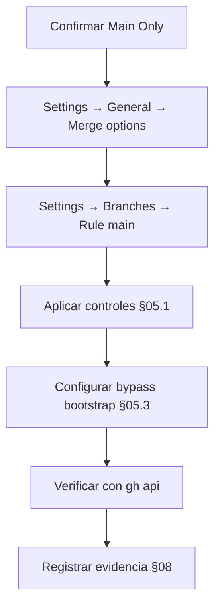

# EE-IMP-007-P03 — Branch Protection

Este documento registra la evidencia técnica de la implementación física y validación correspondiente a la Unidad P03 conforme a **EE-DOC-005 — Development Workflow** y **EE-DOC-007 — GitHub Governance** (§07).

---

## METADATOS

| Campo               | Valor                               |
| :------------------ | :---------------------------------- |
| **ID**              | EE-IMP-007-P03                      |
| **Documento**       | Branch Protection                   |
| **Código corto**    | EE-IMP-007-P03                      |
| **Fase**            | Fase 3 — Branch Protection          |
| **Tipo**            | Documento Técnico de Implementación |
| **Clasificación**   | Implementación                      |
| **Nivel**           | Técnico                             |
| **Normativo**       | No                                  |
| **Versión**         | v0.3.0                              |
| **Estado**          | Completado                          |
| **Propietario**     | Equipo de Arquitectura              |
| **Documento padre** | EE-DOC-007 — GitHub Governance      |

| **Dependencias** | EE-DOC-005, EE-DOC-007, EE-IMP-007-P01, EE-IMP-007-P02 |
| **Aprobado por** | Pendiente |
| **Audiencia** | Arquitectura, Desarrollo, DevOps |
| **Fecha de creación** | 2026-09-22 |
| **Última revisión** | 2026-09-22 |
| **Próxima revisión** | No aplica — Unidad completada; siguientes vía P04–P08 |

---

## 01. Objetivo

Materializar la **protección de ramas** definida por EE-DOC-007 §07 sobre el repositorio `EQ-LABS-TECH/ee-monorepo`, alineada con la estrategia de branching del proyecto y sin anticipar CODEOWNERS operativo (P04), workflows (P05) ni Required Checks de Quality Gates (P06).

---

## 02. Prerrequisitos

| Prerrequisito         | Estado                               | Referencia     |
| :-------------------- | :----------------------------------- | :------------- |
| Bootstrap `.github/`  | Completado                           | EE-IMP-007-P01 |
| Org, teams y permisos | Completado                           | EE-IMP-007-P02 |
| Repositorio           | `EQ-LABS-TECH/ee-monorepo` (PRIVATE) | P01/P02        |

---

## 03. Decisión de branching (obligatoria)

EE-DOC-005 y EE-DOC-007 exigen que la estrategia de branching se registre mediante **ADR aprobado**.

| Opción                      | Ramas protegidas   | Adecuado cuando                                       |
| :-------------------------- | :----------------- | :---------------------------------------------------- |
| **Main Only (Trunk-Based)** | solo `main`        | equipos pequeños, entregas continuas, single-operator |
| **Main + Develop**          | `main` y `develop` | integración intermedia, equipos mayores               |

### 03.1. Decisión propuesta para `ee-monorepo`

| Campo                     | Valor                                                                                                                                                                        |
| :------------------------ | :--------------------------------------------------------------------------------------------------------------------------------------------------------------------------- |
| **Estrategia**            | **Main Only (Trunk-Based)**                                                                                                                                                  |
| **Justificación**         | Bootstrap single-operator; no existe `develop`; monorepo en fase inicial; simplifica protección y flujo                                                                      |
| **Rama protegida en P03** | `main`                                                                                                                                                                       |
| **`develop`**             | No se crea ni se protege                                                                                                                                                     |
| **Registro formal**       | Decisión de implementación en este IMP; **ADR formal de branching pendiente** de emitir como artefacto EE-ADR (recomendado antes de Congelar EE-DOC-007 o en paralelo a P03) |

> Mientras no exista EE-ADR de branching, este documento actúa como registro operativo de la decisión **Main Only** para `ee-monorepo`. No sustituye el ADR normativo exigido por EE-DOC-005.

---

## 04. Alcance de P03

### 04.1. Incluye

- Protección de la rama `main`.
- Reglas técnicas mínimas de EE-DOC-007 §07.15 aplicables sin workflows aún existentes.
- Política de merge del repositorio (Squash; Merge Commit deshabilitado).
- Registro de bypass bootstrap (si se habilita) por single-operator.
- Evidencia vía UI o `gh`.

### 04.2. No incluye

| Tema                                                   | Unidad                                                   |
| :----------------------------------------------------- | :------------------------------------------------------- |
| Required status checks (nombres de checks CI)          | P05 / P06 — no hay workflows aún                         |
| CODEOWNERS operativo / require review from Code Owners | P04                                                      |
| Creación de rama `develop`                             | No aplica (Main Only)                                    |
| Rulesets avanzados multi-repo                          | Opcional; Classic Branch Protection es suficiente en P03 |

---

## 05. Configuración objetivo de `main`

### 05.1. Branch protection rules (classic)

Ruta UI: **Settings → Branches → Add branch protection rule**  
Pattern: `main`

| Control GitHub                                                   | Valor P03                                                                    | Norma                                                      |
| :--------------------------------------------------------------- | :--------------------------------------------------------------------------- | :--------------------------------------------------------- |
| Require a pull request before merging                            | **ON**                                                                       | §07.4, §07.7                                               |
| Required number of approvals                                     | **1**                                                                        | §07.4 (≥ 1 approval)                                       |
| Dismiss stale pull request approvals when new commits are pushed | **ON** (recomendado)                                                         | Buena práctica                                             |
| Require review from Code Owners                                  | **OFF** en P03                                                               | Se activa en P04 cuando CODEOWNERS sea operativo           |
| Require approval of the most recent reviewable push              | **ON** (recomendado)                                                         | Evita merge con push posterior sin re-review               |
| Require status checks to pass before merging                     | **OFF** en P03                                                               | Sin workflows (P05/P06); activar después                   |
| Require conversation resolution before merging                   | **ON** (recomendado)                                                         | Trazabilidad de review                                     |
| Require signed commits                                           | **OFF** (salvo política org)                                                 | No exigido aún por EE-DOC-007                              |
| Require linear history                                           | **ON** (recomendado)                                                         | Alineado con Squash; refuerza prohibición de merge commits |
| Do not allow bypassing the above settings                        | Ver §05.3                                                                    | §07.17                                                     |
| Restrict who can push to matching branches                       | **ON** — solo teams con Write+ (Maintainers, Architecture, Repository Admin) | §07.6                                                      |
| Allow force pushes                                               | **OFF**                                                                      | §07.15                                                     |
| Allow deletions                                                  | **OFF**                                                                      | Integridad de `main`                                       |

### 05.2. Settings de merge del repositorio

Ruta UI: **Settings → General → Pull Requests**

| Opción                                        | Valor                                                            |
| :-------------------------------------------- | :--------------------------------------------------------------- |
| Allow merge commits                           | **OFF** (prohibido EE-DOC-005 / EE-DOC-007 §07.11)               |
| Allow squash merging                          | **ON** (obligatorio para feature/bugfix)                         |
| Allow rebase merging                          | **ON** opcional (permitido para hotfix/release según EE-DOC-005) |
| Always suggest updating pull request branches | **ON** (recomendado)                                             |

### 05.3. Bootstrap single-operator y approvals

Con **Required approvals = 1**, un único operador **no puede auto-aprobar** su propio PR en el flujo normal de GitHub.

| Opción                              | Descripción                                                                                          | Uso en P03                                                                     |
| :---------------------------------- | :--------------------------------------------------------------------------------------------------- | :----------------------------------------------------------------------------- |
| **A — Bypass temporal documentado** | Permitir que actores con Admin (team Repository Admin / rol Admin) hagan bypass de branch protection | **Recomendada** en bootstrap; retirar o restringir al incorporar 2º maintainer |
| **B — Approvals = 0**               | Solo exigir PR, sin approval                                                                         | **No recomendada** (desvía de §07.4)                                           |
| **C — Esperar 2º reviewer**         | Dejar approvals = 1 sin bypass                                                                       | Bloquea merge en práctica hasta segunda persona                                |

**Decisión de implementación:** **Opción A**.

- En la rule de `main`: **no** marcar “Do not allow bypassing” mientras dure el bootstrap single-operator, **o** restringir bypass solo a administradores del repo.
- Registrar como **W-P03-001**: excepción temporal de bootstrap; no es el flujo normal de integración (§07.17).
- Al incorporar un segundo maintainer: exigir approvals sin bypass habitual y documentar el cierre de la excepción.

---

## 06. Plan de ejecución



### 06.1. UI (pasos)

1. `https://github.com/EQ-LABS-TECH/ee-monorepo/settings`
2. **General** → Pull Requests → desactivar merge commits; activar squash (y rebase si se desea).
3. **Branches** → **Add branch protection rule** → Branch name pattern: `main`.
4. Activar controles de la tabla §05.1.
5. Guardar (**Create** / **Save changes**).

### 06.2. Verificación con `gh`

```powershell
# Protección de main
gh api repos/EQ-LABS-TECH/ee-monorepo/branches/main/protection

# Si aún no hay protección, el API responde 404 — esperado antes de aplicar la rule
```

Tras aplicar:

```powershell
gh api repos/EQ-LABS-TECH/ee-monorepo/branches/main/protection --jq "{required_pr: .required_pull_request_reviews.required_approving_review_count, enforce_admins: .enforce_admins.enabled, allow_force: .allow_force_pushes.enabled, allow_deletions: .allow_deletions.enabled}"
```

---

## 07. Especificación técnica de artefactos

| Artefacto                     | Ubicación                           | Estado P03                   |
| :---------------------------- | :---------------------------------- | :--------------------------- |
| Branch ruleset `Protect main` | Settings → Rulesets (id `23861402`) | **Implementado** — Active    |
| Merge methods en ruleset      | `squash`, `rebase` (sin `merge`)    | **Implementado**             |
| Decisión Main Only            | Este IMP §03                        | **Registrada**               |
| ADR formal de branching       | EE-ADR (futuro)                     | **Pendiente** (backlog)      |
| Required status checks        | —                                   | **Diferido a P05/P06**       |
| Require code owner review     | —                                   | **Diferido a P04**           |
| Visibility repo               | Public (temporal bootstrap)         | **Implementado** (D-P03-001) |

---

## 08. Evidencia As-Built

Evidencia capturada 2026-09-22 vía GitHub UI (Rulesets) y `gh api`.

### 08.1. Branching y repositorio

| Campo            | Valor as-built                                                    |
| :--------------- | :---------------------------------------------------------------- |
| Estrategia       | **Main Only (Trunk-Based)**                                       |
| ADR de branching | Pendiente (W-P03-002); decisión operativa en este IMP             |
| Ramas protegidas | `main` únicamente                                                 |
| `develop`        | No existe / no protegida                                          |
| Visibility       | **Public** (temporal; D-P03-001 → Private cuando plan lo permita) |
| Operador         | `edus194`                                                         |

### 08.2. Ruleset `Protect main`

| Campo       | Valor as-built                                                   |
| :---------- | :--------------------------------------------------------------- |
| Ruleset id  | `23861402`                                                       |
| Name        | `Protect main`                                                   |
| Target      | `branch` → `refs/heads/main`                                     |
| Enforcement | **active**                                                       |
| Mechanism   | **Repository ruleset** (UI actual; no classic branch protection) |

| Control                         | Valor as-built                           |
| :------------------------------ | :--------------------------------------- |
| Restrict deletions              | **ON** (`type: deletion`)                |
| Require PR before merging       | **ON**                                   |
| Required approvals              | **1**                                    |
| Dismiss stale reviews on push   | **ON**                                   |
| Require code owner review       | **OFF**                                  |
| Require conversation resolution | **ON**                                   |
| Require linear history          | **ON**                                   |
| Block force pushes              | **ON** (`type: non_fast_forward`)        |
| Require status checks           | **OFF**                                  |
| Allowed merge methods           | **`squash`, `rebase`** — **sin `merge`** |

### 08.3. Bypass (bootstrap single-operator)

| Actor            | Tipo           | Mode   |
| :--------------- | :------------- | :----- |
| Repository admin | RepositoryRole | always |
| `edus194`        | User           | always |

Alineado con W-P03-001: temporal; retirar o restringir al incorporar segundo maintainer.

### 08.4. Comando de verificación

```text
gh api repos/EQ-LABS-TECH/ee-monorepo/rulesets/23861402
→ enforcement=active; rules: deletion, pull_request (approvals=1, squash/rebase), non_fast_forward, required_linear_history
```

---

## 09. Validaciones

| Prueba                             | Resultado | Evidencia                               |
| :--------------------------------- | :-------- | :-------------------------------------- |
| Classic `branches/main/protection` | N/A       | Sustituido por **Rulesets** (UI actual) |
| Ruleset activo sobre `main`        | **OK**    | id `23861402`, enforcement active       |
| Merge commits deshabilitados       | **OK**    | `allowed_merge_methods`: squash, rebase |
| Squash habilitado                  | **OK**    | Presente en ruleset                     |
| Force push a `main` bloqueado      | **OK**    | `non_fast_forward`                      |
| Deletions restringidas             | **OK**    | `deletion`                              |
| No se creó `develop`               | **OK**    | Solo target `main`                      |
| Status checks no bloquean          | **OK**    | No requeridos en P03                    |

### 09.1. Criterio de conformidad

- [x] Estrategia Main Only registrada (IMP; ADR formal en backlog).
- [x] `main` con require PR y ≥ 1 approval.
- [x] Force push y deletions deshabilitados en `main`.
- [x] Merge commit no permitido en el ruleset.
- [x] Squash habilitado.
- [x] Required status checks **no** bloquean el repo (OFF).
- [x] Bypass bootstrap documentado (W-P03-001; `edus194` + Repository admin).
- [x] Sin configuración de `develop` ni rules fuera de Main Only.

**Dictamen:** **Conforme**. Unidad **Completada**.

---

## 10. Reglas de implementación

1. No crear `develop` en P03.
2. No exigir status checks hasta que existan workflows (P05) y catálogo QG (P06).
3. No activar “Require review from Code Owners” hasta P04.
4. No usar merge commits.
5. Cualquier bypass debe quedar registrado y ser temporal (§07.17).
6. La decisión Main Only debe converger en un **EE-ADR** de branching cuando el equipo formalice ADRs del monorepo.

---

## 11. Correcciones / Warnings

| ID            | Severidad          | Descripción                                                          | Tratamiento                                                                                                                                                                        |
| :------------ | :----------------- | :------------------------------------------------------------------- | :--------------------------------------------------------------------------------------------------------------------------------------------------------------------------------- |
| **W-P03-001** | Media              | Single-operator no puede auto-aprobar PRs con required approvals = 1 | Bypass temporal Admin / Repository Admin; retirar al 2º maintainer                                                                                                                 |
| **W-P03-002** | Informativo        | ADR formal de branching aún no emitido                               | IMP registra Main Only; emitir EE-ADR en backlog de gobernanza                                                                                                                     |
| **W-P03-003** | Informativo        | Required status checks diferidos                                     | P05/P06                                                                                                                                                                            |
| **B-P03-001** | Bloqueo plataforma | Branch protection en repo **PRIVATE** exige plan de pago (403 API)   | **Decisión 2026-09-22:** pasar `ee-monorepo` a **Public** para habilitar protection en plan free; cuando el plan/org lo amerite, volver a **Private** manteniendo las mismas rules |
| **D-P03-001** | Decisión           | Visibility: Public (temporal de bootstrap) → Private cuando proceda  | No altera la config objetivo de §05; solo desbloquea el feature de GitHub                                                                                                          |

---

## 12. Trazabilidad

| Elemento           | Referencia                                |
| :----------------- | :---------------------------------------- |
| **Norma**          | EE-DOC-007 §07                            |
| **Workflow**       | EE-DOC-005 (branching, merge, approvals)  |
| **Prerrequisitos** | EE-IMP-007-P01, EE-IMP-007-P02            |
| **Siguiente**      | EE-IMP-007-P04 — CODEOWNERS and Ownership |

---

## 13. Referencias

| Código             | Documento                          |
| :----------------- | :--------------------------------- |
| **EE-DOC-005**     | Development Workflow               |
| **EE-DOC-007**     | GitHub Governance v1.0.0           |
| **EE-IMP-007-P01** | GitHub Governance Bootstrap        |
| **EE-IMP-007-P02** | Access and Organization Governance |

---

## 14. Historial de Cambios

| Versión    | Fecha      | Autor                    | Aprobado por | Motivo                | Cambios                                                                                          | Estado                                                 |
| :--------- | :--------- | :----------------------- | :----------- | :-------------------- | :----------------------------------------------------------------------------------------------- | :----------------------------------------------------- |
| **v0.1.0** | 2026-09-22 | AI Engineering Assistant | —            | Apertura P03          | Main Only; config objetivo main; merge policy; bypass bootstrap; criterios de evidencia          | En Elaboración                                         |
| **v0.2.0** | 2026-09-22 | AI Engineering Assistant | —            | Desbloqueo visibility | 403 en PRIVATE; decisión Public temporal (B-P03-001 / D-P03-001); Private cuando plan lo permita | En Elaboración — Repo Public para habilitar protection |
| **v0.3.0** | 2026-09-22 | AI Engineering Assistant | —            | As-built ruleset      | Ruleset `Protect main` (23861402) active; squash/rebase; bypass edus194; checklist conforme      | **Completado**                                         |

---

## FIN DEL DOCUMENTO
