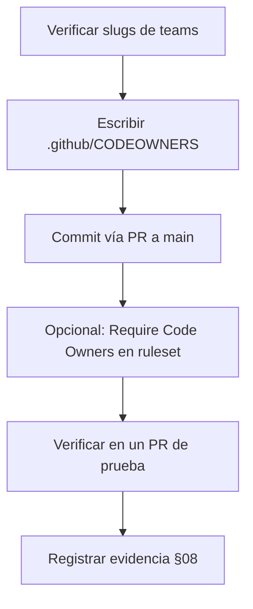

# EE-IMP-007-P04 — CODEOWNERS and Ownership

Este documento registra la evidencia técnica de la implementación física y validación correspondiente a la Unidad P04 conforme a **EE-DOC-005 — Development Workflow** y **EE-DOC-007 — GitHub Governance** (§08).

---

## METADATOS

| Campo                 | Valor                                                                  |
| :-------------------- | :--------------------------------------------------------------------- |
| **ID**                | EE-IMP-007-P04                                                         |
| **Documento**         | CODEOWNERS and Ownership                                               |
| **Código corto**      | EE-IMP-007-P04                                                         |
| **Fase**              | Fase 4 — CODEOWNERS and Ownership                                      |
| **Tipo**              | Documento Técnico de Implementación                                    |
| **Clasificación**     | Implementación                                                         |
| **Nivel**             | Técnico                                                                |
| **Normativo**         | No                                                                     |
| **Versión**           | v0.3.0                                                                 |
| **Estado**            | Completado                                                             |
| **Propietario**       | Equipo de Arquitectura                                                 |
| **Documento padre**   | EE-DOC-007 — GitHub Governance                                         |
| **Dependencias**      | EE-DOC-006, EE-DOC-007, EE-IMP-007-P01, EE-IMP-007-P02, EE-IMP-007-P03 |
| **Aprobado por**      | Pendiente                                                              |
| **Audiencia**         | Arquitectura, Desarrollo, DevOps                                       |
| **Fecha de creación** | 2026-09-22                                                             |
| **Última revisión**   | 2026-09-23                                                             |
| **Próxima revisión**  | No aplica — Unidad completada; siguientes vía P05–P08                  |

---

## 01. Objetivo

Materializar el archivo **`.github/CODEOWNERS`** con ownership real por áreas del monorepo, usando los **teams** creados en P02, sin anticipar workflows (P05) ni Quality Gates (P06).

---

## 02. Prerrequisitos

| Prerrequisito                            | Estado                         | Referencia     |
| :--------------------------------------- | :----------------------------- | :------------- |
| `.github/CODEOWNERS` existe como archivo | Completado (bootstrap)         | EE-IMP-007-P01 |
| Teams en org                             | Completado                     | EE-IMP-007-P02 |
| Ruleset `Protect main`                   | Completado                     | EE-IMP-007-P03 |
| Org / repo                               | `EQ-LABS-TECH` / `ee-monorepo` | P01–P02        |

### 02.1. Teams disponibles (handles GitHub)

| Team visible     | Handle CODEOWNERS                | Uso en ownership                                       |
| :--------------- | :------------------------------- | :----------------------------------------------------- |
| Architecture     | `@EQ-LABS-TECH/architecture`     | Gobernanza, norma, config crítica, docs normativos     |
| Repository Admin | `@EQ-LABS-TECH/repository-admin` | `.github/`, scripts de plataforma                      |
| Maintainers      | `@EQ-LABS-TECH/maintainers`      | Código del ecosistema (packages, apps, connectors)     |
| Contributors     | `@EQ-LABS-TECH/contributors`     | **No** como owner obligatorio en P04 (membresía vacía) |

> Si el **slug** real del team en GitHub difiere (p.ej. `repository-admin` vs `repository_admin`), ajustar el handle tras verificar en la URL del team. Registrar slug real en §08.

---

## 03. Alcance

### 03.1. Incluye

- Contenido operativo de `.github/CODEOWNERS` (sustituye el placeholder de P01).
- Mapa ruta → team alineado con EE-DOC-007 §08.5–§08.10 y EE-DOC-006.
- Opcional: activar **Require review from Code Owners** en el ruleset `Protect main`.
- Evidencia de verificación.

### 03.2. No incluye

| Tema                                  | Unidad                            |
| :------------------------------------ | :-------------------------------- |
| Workflows / Actions                   | P05                               |
| Required status checks / QG           | P06                               |
| Ownership por paquete individual fino | Evolución posterior si hace falta |
| Usuarios individuales como owners     | Evitar; team-first                |

---

## 04. Modelo de ownership (P04)

### 04.1. Principios aplicados

1. **Team-first** — solo handles de teams de la org.
2. **Domain ownership** — por área de primer nivel, no un único owner global sin criterio.
3. **Áreas sensibles** — `.github/`, raíz de orquestación y config compartida con Architecture / Repository Admin.
4. **Single-operator** — el operador `edus194` ya está en Architecture, Repository Admin y Maintainers; las menciones de team lo cubren.
5. **Última coincidencia gana** — en CODEOWNERS de GitHub, el último patrón que coincida tiene prioridad; ordenar de general → específico.

### 04.2. Mapa ruta → team

| Ruta / patrón                                                         | Owner(s)                                                      | Justificación                      |
| :-------------------------------------------------------------------- | :------------------------------------------------------------ | :--------------------------------- |
| `*` (default)                                                         | `@EQ-LABS-TECH/maintainers`                                   | Fallback del código del ecosistema |
| `.github/`                                                            | `@EQ-LABS-TECH/architecture` `@EQ-LABS-TECH/repository-admin` | Gobernanza de plataforma           |
| `package.json`, `pnpm-workspace.yaml`, `pnpm-lock.yaml`, `turbo.json` | `@EQ-LABS-TECH/architecture` `@EQ-LABS-TECH/maintainers`      | Orquestación del monorepo          |
| `.nvmrc`, `.npmrc`, `.editorconfig`, `.gitattributes`, `.gitignore`   | `@EQ-LABS-TECH/architecture`                                  | Config de repo / runtime base      |
| `packages/config/`                                                    | `@EQ-LABS-TECH/architecture` `@EQ-LABS-TECH/maintainers`      | SSOT de configuración compartida   |
| `packages/`                                                           | `@EQ-LABS-TECH/maintainers`                                   | Núcleo de paquetes                 |
| `apps/`                                                               | `@EQ-LABS-TECH/maintainers`                                   | Aplicaciones                       |
| `connectors/`                                                         | `@EQ-LABS-TECH/maintainers`                                   | Conectores                         |
| `scripts/`                                                            | `@EQ-LABS-TECH/repository-admin` `@EQ-LABS-TECH/maintainers`  | Automatización de repo             |
| `docs/`                                                               | `@EQ-LABS-TECH/architecture` `@EQ-LABS-TECH/maintainers`      | Documentación (norma + técnica)    |
| `assets/`, `data/`, `examples/`, `marketplace/`                       | `@EQ-LABS-TECH/maintainers`                                   | Soporte / extensibilidad           |
| `LICENSE`, `NOTICE`, `CHANGELOG.md`, `README.md`                      | `@EQ-LABS-TECH/architecture`                                  | Artefactos de gobierno del repo    |

---

## 05. Contenido objetivo de `.github/CODEOWNERS`

Archivo a escribir en el monorepo (UTF-8). Comentarios en inglés (artefacto técnico / plataforma).

```text
# CODEOWNERS — EE-DOC-007 §08 / EE-IMP-007-P04
# Organization: EQ-LABS-TECH
# Teams: architecture, repository-admin, maintainers, contributors
# Last matching pattern takes precedence.
#
# Operational ownership for ee-monorepo.
# Do not list individual users; use org teams only.

# Default — ecosystem code
*       @EQ-LABS-TECH/maintainers

# Repository root governance & orchestration
LICENSE                         @EQ-LABS-TECH/architecture
NOTICE                          @EQ-LABS-TECH/architecture
CHANGELOG.md                    @EQ-LABS-TECH/architecture
README.md                       @EQ-LABS-TECH/architecture
package.json                    @EQ-LABS-TECH/architecture @EQ-LABS-TECH/maintainers
pnpm-workspace.yaml             @EQ-LABS-TECH/architecture @EQ-LABS-TECH/maintainers
pnpm-lock.yaml                  @EQ-LABS-TECH/architecture @EQ-LABS-TECH/maintainers
turbo.json                      @EQ-LABS-TECH/architecture @EQ-LABS-TECH/maintainers
.nvmrc                          @EQ-LABS-TECH/architecture
.npmrc                          @EQ-LABS-TECH/architecture
.editorconfig                   @EQ-LABS-TECH/architecture
.gitattributes                  @EQ-LABS-TECH/architecture
.gitignore                      @EQ-LABS-TECH/architecture

# GitHub Governance (high impact)
.github/                        @EQ-LABS-TECH/architecture @EQ-LABS-TECH/repository-admin

# Shared config (SSOT)
packages/config/                @EQ-LABS-TECH/architecture @EQ-LABS-TECH/maintainers

# Ecosystem packages & applications
packages/                       @EQ-LABS-TECH/maintainers
apps/                           @EQ-LABS-TECH/maintainers
connectors/                     @EQ-LABS-TECH/maintainers

# Automation scripts
scripts/                        @EQ-LABS-TECH/repository-admin @EQ-LABS-TECH/maintainers

# Documentation
docs/                           @EQ-LABS-TECH/architecture @EQ-LABS-TECH/maintainers

# Support / extensibility
assets/                         @EQ-LABS-TECH/maintainers
data/                           @EQ-LABS-TECH/maintainers
examples/                       @EQ-LABS-TECH/maintainers
marketplace/                    @EQ-LABS-TECH/maintainers
```

---

## 06. Plan de ejecución



### 06.1. Verificar slugs de teams

```powershell
gh api orgs/EQ-LABS-TECH/teams --jq ".[] | {name:.name, slug:.slug}"
```

Si algún slug no coincide con el handle del §05, corregir el archivo antes del commit.

### 06.2. Escribir el archivo (local)

Desde la raíz del monorepo, reemplazar el placeholder de P01 con el contenido de §05.

### 06.3. Integración en `main`

Con ruleset activo: **Pull Request** + approval (o bypass bootstrap documentado). Preferible un PR `docs/codeowners-p04` o `chore/codeowners-p04` → squash a `main`.

### 06.4. Require review from Code Owners (opcional en P04)

En ruleset **Protect main** → editar → activar **Require review from Code Owners**.

| Momento                        | Recomendación                                                                                               |
| :----------------------------- | :---------------------------------------------------------------------------------------------------------- |
| Tras CODEOWNERS en `main`      | **Activar** para materializar §07.16 + §08                                                                  |
| Si aún no hay segundo reviewer | Puede convivir con bypass de `edus194` (W-P03-001); al quitar bypass, Code Owners + 1 approval se refuerzan |

---

## 07. Especificación de artefactos

| Artefacto                      | Ruta / ubicación     | Estado P04                 |
| :----------------------------- | :------------------- | :------------------------- |
| CODEOWNERS operativo           | `.github/CODEOWNERS` | **Pendiente de ejecución** |
| Require Code Owners en ruleset | Ruleset `23861402`   | **Opcional / pendiente**   |
| Mapa ownership                 | Este IMP §04         | **Definido**               |

---

## 08. Evidencia As-Built

Evidencia capturada 2026-09-23.

### 08.1. Teams (slugs reales)

| Name             | Slug               | Handle usado                     |
| :--------------- | :----------------- | :------------------------------- |
| Architecture     | `architecture`     | `@EQ-LABS-TECH/architecture`     |
| Repository Admin | `repository-admin` | `@EQ-LABS-TECH/repository-admin` |
| Maintainers      | `maintainers`      | `@EQ-LABS-TECH/maintainers`      |
| Contributors     | `contributors`     | No usado como owner obligatorio  |

### 08.2. CODEOWNERS

| Campo        | Valor as-built                                               |
| :----------- | :----------------------------------------------------------- |
| Ruta         | `.github/CODEOWNERS`                                         |
| Tamaño local | 2185 bytes (2026-09-23 01:13:39)                             |
| Encoding     | UTF-8                                                        |
| Contenido    | Conforme a §05; `marketplace/` → `@EQ-LABS-TECH/maintainers` |

### 08.3. Specialization Type B — Tooling (CODEOWNERS vs Markdown)

| ID            | Descripción                                                                    | Resolución                                                                |
| :------------ | :----------------------------------------------------------------------------- | :------------------------------------------------------------------------ |
| **B-P04-001** | VS Code / markdownlint trataban comentarios `#` de CODEOWNERS como headings MD | `.vscode/settings.json` + `.prettierignore` excluyen `.github/CODEOWNERS` |

### 08.4. Anomalía A-P04-001 (corrección obligatoria)

| Campo                 | Valor                                                   |
| :-------------------- | :------------------------------------------------------ |
| **Línea final**       | `marketplace/ @EQ-LABS-TECH/maintainers`                |
| **Problema original** | Apareció `@EQ-LABS-TECH/marketplace` (team inexistente) |
| **Corrección**        | Aplicada 2026-09-23 → `@EQ-LABS-TECH/maintainers`       |
| **Estado**            | **Resuelta**                                            |

### 08.5. Prueba de asignación

| Prueba                                                   | Resultado                     |
| :------------------------------------------------------- | :---------------------------- |
| PR que toca `.github/` → Architecture / Repository Admin | Pendiente de PR de validación |
| PR que toca `packages/` → Maintainers                    | Pendiente de PR de validación |

---

## 09. Validaciones

| Prueba                                   | Resultado          | Evidencia                                                 |
| :--------------------------------------- | :----------------- | :-------------------------------------------------------- |
| `gh api orgs/EQ-LABS-TECH/teams` (slugs) | **OK**             | architecture, repository-admin, maintainers, contributors |
| Archivo local `.github/CODEOWNERS`       | **OK**             | 2185 bytes, UTF-8                                         |
| Sin owners individuales                  | **OK**             | Solo teams de org                                         |
| Contributors como owner obligatorio      | **OK**             | No usado                                                  |
| Team `marketplace` inexistente           | **OK (corregido)** | A-P04-001 resuelta → maintainers                          |
| Tooling ignore CODEOWNERS                | **OK**             | B-P04-001 (Type B)                                        |
| Require Code Owners en ruleset           | Pendiente          | Opcional P04                                              |

### 09.1. Criterio de conformidad

- [x] `.github/CODEOWNERS` materializado con patrones de dominio.
- [x] Solo handles `@EQ-LABS-TECH/<team>` (sin usuarios sueltos).
- [x] `.github/` bajo Architecture + Repository Admin.
- [x] `packages/`, `apps/`, `connectors/` bajo Maintainers.
- [x] Contributors no usado como owner obligatorio.
- [x] **Sin ownership hacia teams inexistentes** (A-P04-001 resuelta).
- [x] Exclusiones de tooling documentadas (B-P04-001).

**Dictamen:** **Conforme**. Unidad **Completada**.

---

## 10. Reglas de implementación

1. No listar logins individuales en CODEOWNERS.
2. No asignar `@EQ-LABS-TECH/contributors` como owner requerido mientras el team esté vacío.
3. No activar Require Code Owners hasta que el archivo esté en la rama por defecto (o en el mismo cambio coordinado).
4. Cambios posteriores de ownership = especialización técnica o ADR según EE-DOC-007 §15.11.
5. Mantener comentarios y rutas en inglés.

---

## 11. Correcciones / Warnings

| ID            | Severidad   | Descripción                                | Tratamiento                                                                   |
| :------------ | :---------- | :----------------------------------------- | :---------------------------------------------------------------------------- |
| **W-P04-001** | Informativo | Single-operator: teams con un miembro      | CODEOWNERS por team sigue siendo válido; escala al crecer                     |
| **W-P04-002** | Informativo | Require Code Owners + bypass bootstrap     | Compatible temporalmente; al quitar bypass, Code Owners exige review del team |
| **B-P04-001** | Tipo B      | markdownlint/Prettier sobre CODEOWNERS     | Exclusiones en `.vscode/settings.json` y `.prettierignore`                    |
| **A-P04-001** | Mayor       | `marketplace/` apuntaba a team inexistente | **Resuelta:** `@EQ-LABS-TECH/maintainers`                                     |

---

## 12. Trazabilidad

| Elemento       | Referencia                        |
| :------------- | :-------------------------------- |
| **Norma**      | EE-DOC-007 §08                    |
| **Estructura** | EE-DOC-006                        |
| **Teams**      | EE-IMP-007-P02                    |
| **Protection** | EE-IMP-007-P03 (ruleset 23861402) |
| **Siguiente**  | EE-IMP-007-P05 — GitHub Actions   |

---

## 13. Referencias

| Código             | Documento                          |
| :----------------- | :--------------------------------- |
| **EE-DOC-006**     | Repository Structure               |
| **EE-DOC-007**     | GitHub Governance v1.0.0           |
| **EE-IMP-007-P01** | GitHub Governance Bootstrap        |
| **EE-IMP-007-P02** | Access and Organization Governance |
| **EE-IMP-007-P03** | Branch Protection                  |

---

## 14. Historial de Cambios

| Versión    | Fecha      | Autor                    | Aprobado por | Motivo             | Cambios                                                                             | Estado                                          |
| :--------- | :--------- | :----------------------- | :----------- | :----------------- | :---------------------------------------------------------------------------------- | :---------------------------------------------- |
| **v0.1.0** | 2026-09-22 | AI Engineering Assistant | —            | Apertura P04       | Mapa ownership; contenido CODEOWNERS; plan de ejecución; criterios                  | En Elaboración                                  |
| **v0.2.0** | 2026-09-23 | AI Engineering Assistant | —            | Evidencia as-built | CODEOWNERS materializado; B-P04-001 tooling; A-P04-001 team marketplace inexistente | Implementado — Corrección marketplace pendiente |
| **v0.3.0** | 2026-09-23 | AI Engineering Assistant | —            | Cierre P04         | A-P04-001 corregida; marketplace→maintainers; checklist conforme                    | **Completado**                                  |

---

## FIN DEL DOCUMENTO
