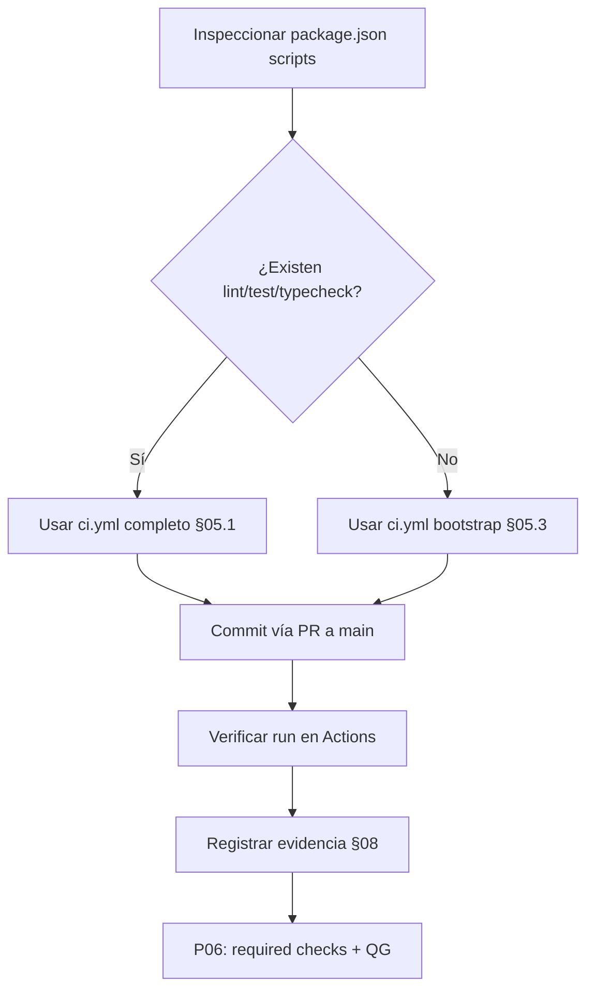

# EE-IMP-007-P05 — GitHub Actions

Este documento registra la evidencia técnica de la implementación física y validación correspondiente a la Unidad P05 conforme a **EE-DOC-005 — Development Workflow** y **EE-DOC-007 — GitHub Governance** (§09).

---

## METADATOS

| Campo                 | Valor                                                 |
| :-------------------- | :---------------------------------------------------- |
| **ID**                | EE-IMP-007-P05                                        |
| **Documento**         | GitHub Actions                                        |
| **Código corto**      | EE-IMP-007-P05                                        |
| **Fase**              | Fase 5 — GitHub Actions                               |
| **Tipo**              | Documento Técnico de Implementación                   |
| **Clasificación**     | Implementación                                        |
| **Nivel**             | Técnico                                               |
| **Normativo**         | No                                                    |
| **Versión**           | v0.2.0                                                |
| **Estado**            | Completado                                            |
| **Propietario**       | Equipo de Arquitectura                                |
| **Documento padre**   | EE-DOC-007 — GitHub Governance                        |
| **Dependencias**      | EE-DOC-005, EE-DOC-007, EE-IMP-007-P01 … P04          |
| **Aprobado por**      | Pendiente                                             |
| **Audiencia**         | Arquitectura, Desarrollo, DevOps                      |
| **Fecha de creación** | 2026-09-23                                            |
| **Última revisión**   | 2026-09-23                                            |
| **Próxima revisión**  | No aplica — Unidad completada; siguientes vía P06–P08 |

---

## 01. Objetivo

Materializar la **gobernanza de plataforma GitHub Actions** definida por EE-DOC-007 §09 bajo `.github/workflows/`, con least privilege, eventos controlados y frontera clara respecto a:

| Documento      | Frontera                                                                    |
| :------------- | :-------------------------------------------------------------------------- |
| **EE-DOC-005** | No redefine el Development Workflow                                         |
| **EE-DOC-010** | No define el catálogo de Quality Gates (eso es P06)                         |
| **EE-DOC-011** | No define automatización de producto (CLI, generadores, scripts de negocio) |

---

## 02. Prerrequisitos

| Prerrequisito               | Estado                                       | Referencia     |
| :-------------------------- | :------------------------------------------- | :------------- |
| `.github/workflows/` existe | Completado                                   | EE-IMP-007-P01 |
| Teams y permisos            | Completado                                   | EE-IMP-007-P02 |
| Ruleset `Protect main`      | Completado                                   | EE-IMP-007-P03 |
| CODEOWNERS operativo        | Completado                                   | EE-IMP-007-P04 |
| Repo                        | `EQ-LABS-TECH/ee-monorepo` (Public temporal) | P01–P03        |

---

## 03. Alcance de P05

### 03.1. Incluye

- Convenciones de nombre y ubicación de workflows.
- Declaración explícita de `permissions` (least privilege).
- Eventos permitidos / restringidos (`pull_request_target` no genérico).
- Workflow **CI** de plataforma mínimo (scaffold gobernado).
- Política: sin secrets en YAML; sin permisos de escritura salvo justificación.
- Evidencia de que el workflow corre en PR / push a `main`.

### 03.2. No incluye

| Tema                                                       | Unidad / doc                                |
| :--------------------------------------------------------- | :------------------------------------------ |
| Catálogo de Quality Gates y required checks en ruleset     | **P06** / EE-DOC-010                        |
| Secret scanning, dependency review como norma de seguridad | **P07** / EE-DOC-010                        |
| Automatización de producto (CLI, generadores)              | EE-DOC-011                                  |
| Release automation completa (Changesets publish)           | Posterior / EE-DOC-011                      |
| `pull_request_target` como flujo por defecto               | Prohibido en P05 salvo justificación formal |

---

## 04. Convenciones de implementación

### 04.1. Ubicación y nombres

```text
.github/
└── workflows/
    ├── ci.yml                 # Continuous Integration (plataforma)
    └── .gitkeep               # solo si el dir debe existir vacío (eliminar si hay yml)
```

| Regla                   | Valor                                           |
| :---------------------- | :---------------------------------------------- |
| Extensión               | `.yml` (preferida) o `.yaml`                    |
| Nombre de archivo       | kebab-case, inglés (`ci.yml`, `security.yml`)   |
| `name:` del workflow    | Inglés, legible en la UI (`CI`)                 |
| Idioma de logs/mensajes | `en-US` (EE-DOC-002 §16.1 / EE-DOC-007 §10.4.1) |

### 04.2. Eventos

| Evento                | Uso en P05                              |
| :-------------------- | :-------------------------------------- |
| `pull_request`        | **Sí** — validación antes de merge      |
| `push` (solo `main`)  | **Sí** — confirmación post-merge        |
| `workflow_dispatch`   | Opcional — re-ejecución manual trazable |
| `pull_request_target` | **No** en P05                           |
| `schedule`            | No en el CI base de P05                 |

### 04.3. Permisos por defecto (workflow)

Todo workflow de solo validación deberá declarar explícitamente:

```yaml
permissions:
  contents: read
```

No otorgar `contents: write`, `pull-requests: write`, `id-token: write`, etc. sin justificación documentada en este IMP o en un cambio gobernado.

### 04.4. Actions de terceros

| Regla                                          | Aplicación P05                                                               |
| :--------------------------------------------- | :--------------------------------------------------------------------------- |
| Preferir actions oficiales (`actions/*`)       | Sí                                                                           |
| Fijar versión por **SHA** o tag mayor conocido | Tag mayor aceptable en bootstrap (`@v4`); endurecer a SHA en P07 si se exige |
| No usar actions no mantenidas                  | Sí                                                                           |

### 04.5. Secrets

- Ningún secret en archivos bajo `.github/workflows/`.
- P05 **no** introduce secrets de repositorio (no se requieren para CI de solo lectura).

---

## 05. Workflow objetivo — `ci.yml`

Scaffold de **Continuous Integration** de plataforma. No sustituye el catálogo de QG de EE-DOC-010; ejecuta los scripts del monorepo **si existen** en `package.json` raíz.

### 05.1. Contenido

```yaml
# .github/workflows/ci.yml
# EE-DOC-007 §09 / EE-IMP-007-P05 — Platform CI (least privilege)
# As-built: actions on Node 24-compatible majors (checkout@v5, setup-node@v5)
name: CI

on:
  pull_request:
  push:
    branches:
      - main
  workflow_dispatch:

permissions:
  contents: read

concurrency:
  group: ci-${{ github.workflow }}-${{ github.ref }}
  cancel-in-progress: true

jobs:
  validate:
    name: Validate
    runs-on: ubuntu-latest
    timeout-minutes: 30

    steps:
      - name: Checkout
        uses: actions/checkout@v5

      - name: Setup pnpm
        uses: pnpm/action-setup@v4.4.0

      - name: Setup Node.js
        uses: actions/setup-node@v5
        with:
          node-version-file: '.nvmrc'
          cache: 'pnpm'

      - name: Install dependencies
        run: pnpm install --frozen-lockfile

      - name: Lint
        run: pnpm run lint

      - name: Typecheck
        run: pnpm run typecheck

      - name: Test
        run: pnpm run test

      - name: Validate
        run: pnpm run validate
```

> **Nota as-built:** la versión en `main` puede omitir temporalmente `with:` en setup-node; se recomienda **mantener** `node-version-file: ".nvmrc"` y `cache: "pnpm"` para reproducibilidad alineada con EE (Node ≥ 22.19 < 23 vía `.nvmrc`).

### 05.2. Adaptación si faltan scripts en `package.json`

Si la raíz **aún no** define `lint`, `format:check`, `typecheck` o `test`, **no inventar** fallos permanentes. Opciones gobernadas:

| Opción                          | Cuándo                                                           |
| :------------------------------ | :--------------------------------------------------------------- |
| **A — Scripts mínimos en root** | Preferible: añadir scripts que deleguen a Turbo cuando existan   |
| **B — Steps condicionales**     | Usar `if` / comprobar existencia del script antes de ejecutarlo  |
| **C — Job `ci-bootstrap`**      | Solo `install` + verificación de estructura hasta que existan QG |

**Decisión de implementación P05:** aplicar el YAML de §05.1 si los scripts existen; si no, usar la variante §05.3 (bootstrap) hasta P06.

### 05.3. Variante bootstrap (solo si faltan scripts)

```yaml
# .github/workflows/ci.yml — bootstrap variant
name: CI

on:
  pull_request:
  push:
    branches:
      - main
  workflow_dispatch:

permissions:
  contents: read

concurrency:
  group: ci-${{ github.workflow }}-${{ github.ref }}
  cancel-in-progress: true

jobs:
  validate:
    name: Validate
    runs-on: ubuntu-latest
    timeout-minutes: 20

    steps:
      - name: Checkout
        uses: actions/checkout@v4

      - name: Setup pnpm
        uses: pnpm/action-setup@v4
        with:
          version: 10

      - name: Setup Node.js
        uses: actions/setup-node@v4
        with:
          node-version-file: '.nvmrc'
          cache: 'pnpm'

      - name: Install dependencies
        run: pnpm install --frozen-lockfile

      - name: Verify workspace
        run: |
          test -f package.json
          test -f pnpm-workspace.yaml
          test -f turbo.json
          test -f .github/CODEOWNERS
          echo "Workspace structure OK"
```

---

## 06. Plan de ejecución



### 06.1. Inspección local (PowerShell)

```powershell
Get-Content package.json | Select-String -Pattern '"scripts"' -Context 0,25
Get-ChildItem .github\workflows -Force
Get-Content .nvmrc
```

### 06.2. Materializar workflow

1. Eliminar `.github/workflows/.gitkeep` si se añade `ci.yml`.
2. Crear `.github/workflows/ci.yml` con §05.1 o §05.3 según scripts.
3. Integrar en `main` vía PR (ruleset activo).

### 06.3. Verificación

```powershell
gh workflow list
gh run list --workflow=ci.yml --limit 5
```

UI: <https://github.com/EQ-LABS-TECH/ee-monorepo/actions>

---

## 07. Relación con Branch Protection (P03) y P06

| Capacidad                         | P05             | P06                           |
| :-------------------------------- | :-------------- | :---------------------------- |
| Workflow CI existe y corre        | **Sí**          | —                             |
| Required status checks en ruleset | **No** (aún)    | **Sí** — nombres de job/check |
| Catálogo normativo de QG          | No (EE-DOC-010) | Materialización en GitHub     |

Hasta P06, el merge a `main` **no** exige el check CI en el ruleset (sigue OFF). El workflow aporta evidencia; el enforcement llega en P06.

---

## 08. Evidencia As-Built

Evidencia capturada 2026-09-23.

### 08.1. Scripts root

| Script            | Existe                                          | En CI                                            |
| :---------------- | :---------------------------------------------- | :----------------------------------------------- |
| `lint`            | Sí                                              | Sí                                               |
| `typecheck`       | Sí                                              | Sí                                               |
| `test`            | Sí                                              | Sí                                               |
| `validate`        | Sí                                              | Sí                                               |
| `format`          | Sí                                              | **No** (escribe archivos; no hay `format:check`) |
| Variante CI usada | §05.1 adaptada (sin format:check; con validate) |

### 08.2. Workflow

| Campo          | Valor as-built                                                             |
| :------------- | :------------------------------------------------------------------------- |
| Path           | `.github/workflows/ci.yml`                                                 |
| `permissions`  | `contents: read`                                                           |
| Events         | `pull_request`, `push` → `main`, `workflow_dispatch`                       |
| Actions        | `actions/checkout@v5`, `pnpm/action-setup@v4.4.0`, `actions/setup-node@v5` |
| Run verificado | push a `main`, job **Validate**, ~47s, **success**                         |
| Resultado      | **✓ success**                                                              |

### 08.3. Specialization Type B — Node 20 deprecation on Actions

| ID            | Descripción                                                                                            | Resolución                                                                                                       |
| :------------ | :----------------------------------------------------------------------------------------------------- | :--------------------------------------------------------------------------------------------------------------- |
| **B-P05-001** | Warning: actions sobre Node 20 deprecado en runners (checkout@v4, setup-node@v4, pnpm/action-setup@v4) | Actualizar a `actions/checkout@v5`, `actions/setup-node@v5`, `pnpm/action-setup@v4.4.0`; CI en verde sin warning |

### 08.4. Fronteras respetadas

| Frontera                                    | Cumple                          |
| :------------------------------------------ | :------------------------------ |
| Sin `pull_request_target`                   | **Sí**                          |
| Sin secrets en YAML                         | **Sí**                          |
| Sin catálogo EE-DOC-010 embebido            | **Sí**                          |
| Sin automatización de producto (EE-DOC-011) | **Sí**                          |
| Required checks en ruleset                  | **OFF** (intencional hasta P06) |

---

## 09. Validaciones

| Prueba                        | Resultado | Evidencia                       |
| :---------------------------- | :-------- | :------------------------------ |
| `ci.yml` en repo              | **OK**    | En `main`                       |
| `permissions: contents: read` | **OK**    | Least privilege                 |
| Run en push a main            | **OK**    | success ~47s                    |
| Sin secrets en workflows      | **OK**    | —                               |
| Node 20 deprecation           | **OK**    | B-P05-001 resuelto (v5 actions) |

### 09.1. Criterio de conformidad

- [x] Existe al menos un workflow gobernado bajo `.github/workflows/`.
- [x] Permisos explícitos least privilege.
- [x] Eventos sin `pull_request_target` genérico.
- [x] Sin secrets en archivos de workflow.
- [x] Frontera con EE-DOC-010 y EE-DOC-011 respetada.
- [x] Al menos una ejecución registrada (**success**).

**Dictamen:** **Conforme**. Unidad **Completada**.

---

## 10. Reglas de implementación

1. No ampliar permisos “por si acaso”.
2. No usar `pull_request_target` en CI estándar.
3. No exigir required checks en ruleset hasta P06.
4. No copiar workflows de terceros sin revisión de permisos y supply chain.
5. Nombres y mensajes de workflow en inglés.
6. Ownership de cambios en `.github/workflows/` ya cubierto por CODEOWNERS (Architecture + Repository Admin).

---

## 11. Correcciones / Warnings

| ID            | Severidad   | Descripción                                                           | Tratamiento                                                    |
| :------------ | :---------- | :-------------------------------------------------------------------- | :------------------------------------------------------------- |
| **W-P05-001** | Informativo | Required checks aún OFF en ruleset                                    | Intencional hasta P06                                          |
| **W-P05-002** | Informativo | Sin `format:check` en root                                            | No usar `format` en CI; añadir check en P06 si aplica          |
| **B-P05-001** | Tipo B      | Deprecation Node 20 en Actions runners                                | Resuelto: checkout@v5, setup-node@v5, pnpm/action-setup@v4.4.0 |
| **W-P05-003** | Informativo | Recomendado `node-version-file: .nvmrc` + `cache: pnpm` en setup-node | Asegurar reproducibilidad Node 22 del monorepo                 |

---

## 12. Trazabilidad

| Elemento                   | Referencia                                 |
| :------------------------- | :----------------------------------------- |
| **Norma**                  | EE-DOC-007 §09                             |
| **Workflow de desarrollo** | EE-DOC-005                                 |
| **Prerrequisitos**         | EE-IMP-007-P01 … P04                       |
| **Siguiente**              | EE-IMP-007-P06 — Quality Gates Integration |

---

## 13. Referencias

| Código             | Documento                                                  |
| :----------------- | :--------------------------------------------------------- |
| **EE-DOC-005**     | Development Workflow                                       |
| **EE-DOC-007**     | GitHub Governance v1.0.0                                   |
| **EE-DOC-010**     | Quality Gates (pendiente — no implementar catálogo en P05) |
| **EE-DOC-011**     | Automation (fuera de alcance Actions de plataforma)        |
| **EE-IMP-007-P03** | Branch Protection                                          |
| **EE-IMP-007-P04** | CODEOWNERS and Ownership                                   |

---

## 14. Historial de Cambios

| Versión    | Fecha      | Autor                    | Aprobado por | Motivo       | Cambios                                                           | Estado         |
| :--------- | :--------- | :----------------------- | :----------- | :----------- | :---------------------------------------------------------------- | :------------- |
| **v0.1.0** | 2026-09-23 | AI Engineering Assistant | —            | Apertura P05 | Convenciones; ci.yml §05.1/§05.3; permisos; fronteras P06/010/011 | En Elaboración |
| **v0.2.0** | 2026-09-23 | AI Engineering Assistant | —            | Cierre P05   | CI success en main; B-P05-001 Node 24 actions; as-built conforme  | **Completado** |

---

## FIN DEL DOCUMENTO
