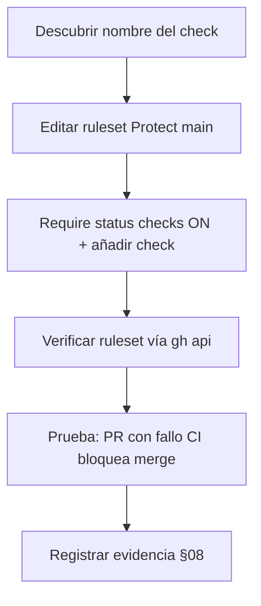

# EE-IMP-007-P06 — Quality Gates Integration

Este documento registra la evidencia técnica de la implementación física y validación correspondiente a la Unidad P06 conforme a **EE-DOC-005 — Development Workflow** y **EE-DOC-007 — GitHub Governance** (§13).

---

## METADATOS

| Campo                 | Valor                                                              |
| :-------------------- | :----------------------------------------------------------------- |
| **ID**                | EE-IMP-007-P06                                                     |
| **Documento**         | Quality Gates Integration                                          |
| **Código corto**      | EE-IMP-007-P06                                                     |
| **Fase**              | Fase 6 — Quality Gates Integration                                 |
| **Tipo**              | Documento Técnico de Implementación                                |
| **Clasificación**     | Implementación                                                     |
| **Nivel**             | Técnico                                                            |
| **Normativo**         | No                                                                 |
| **Versión**           | v0.2.0                                                             |
| **Estado**            | Completado                                                         |
| **Propietario**       | Equipo de Arquitectura                                             |
| **Documento padre**   | EE-DOC-007 — GitHub Governance                                     |
| **Dependencias**      | EE-DOC-005, EE-DOC-007, EE-IMP-007-P03, EE-IMP-007-P05, EE-ADR-003 |
| **Aprobado por**      | Pendiente                                                          |
| **Audiencia**         | Arquitectura, Desarrollo, DevOps                                   |
| **Fecha de creación** | 2026-09-23                                                         |
| **Última revisión**   | 2026-09-23                                                         |
| **Próxima revisión**  | No aplica — Unidad completada; siguientes vía P07–P08              |

---

## 01. Objetivo

Conectar los controles de calidad **ejecutados en GitHub Actions** con:

- **Check Results**
- **Required Checks**
- **Branch protection / Rulesets** (`Protect main`)
- **Condicionamiento del Merge**

de modo que un cambio no pueda integrarse en `main` mientras el check obligatorio no esté en estado exitoso.

> **EE-DOC-010 define qué debe validarse; EE-DOC-007 define cómo GitHub ejecuta, reporta y condiciona la integración.**  
> P06 **no define** el catálogo normativo de Quality Gates (eso es EE-DOC-010).

---

## 02. Prerrequisitos

| Prerrequisito                 | Estado            | Referencia                              |
| :---------------------------- | :---------------- | :-------------------------------------- |
| Ruleset `Protect main` activo | Completado        | EE-IMP-007-P03 (id `23861402`)          |
| Workflow `ci.yml` en `main`   | Completado        | EE-IMP-007-P05                          |
| CI success verificado         | Completado        | Runs en verde (incl. Node 24 / ADR-003) |
| EE-DOC-010 Quality Gates      | **No existe aún** | Ver §04 (mapeo provisional)             |

---

## 03. Alcance

### 03.1. Incluye

- Identificar el **nombre real del check** que publica el job CI.
- Activar **Require status checks to pass** en el ruleset `Protect main`.
- Registrar el check como **required** para `main`.
- Verificar que un PR con CI fallido **no** puede mergearse (salvo bypass bootstrap).
- Documentar el mapeo provisional CI ↔ controles de calidad del monorepo.

### 03.2. No incluye

| Tema                                           | Responsabilidad                                 |
| :--------------------------------------------- | :---------------------------------------------- |
| Catálogo normativo de QG, umbrales, categorías | **EE-DOC-010** (pendiente)                      |
| Nuevos workflows de seguridad / release        | P07 / posteriores                               |
| Redefinir lint/test en EE-DOC-007              | Prohibido                                       |
| Quitar el bypass single-operator               | Opcional; documentar si se mantiene (W-P03-001) |

---

## 04. Mapeo provisional (hasta EE-DOC-010)

Mientras EE-DOC-010 no exista, P06 usa como **controles operativos del monorepo** los scripts ya ejecutados por `ci.yml` (Quality by Default / EE-DOC-005), **sin elevarlos a norma de EE-DOC-010**.

| Control operativo (script) | Ejecutor               | Representación en GitHub |
| :------------------------- | :--------------------- | :----------------------- |
| `pnpm run lint`            | Job `Validate` en `CI` | Check del workflow       |
| `pnpm run typecheck`       | Idem                   | Idem                     |
| `pnpm run test`            | Idem                   | Idem                     |
| `pnpm run validate`        | Idem                   | Idem                     |

**Un solo Required Check** a nivel de plataforma (el job completo), no un check por script, hasta que EE-DOC-010 exija granularidad.

| Campo               | Valor provisional P06                                          |
| :------------------ | :------------------------------------------------------------- |
| Workflow            | `CI` (`.github/workflows/ci.yml`)                              |
| Job                 | `validate` / nombre UI **Validate**                            |
| Required check name | Descubrir con §06.1 (típicamente `Validate` o `CI / Validate`) |

Cuando exista EE-DOC-010, este mapeo se **reemplaza o refina** sin cambiar el principio §13 (010 define qué; 007/IMP definen cómo en GitHub).

---

## 05. Configuración objetivo en Ruleset

Ruleset: **Protect main** (id `23861402`)

| Control                                                 | Valor P06                                            |
| :------------------------------------------------------ | :--------------------------------------------------- |
| **Require status checks to pass**                       | **ON**                                               |
| **Required checks**                                     | El check del job CI (`Validate` / nombre real §06.1) |
| Require branches to be up to date (si existe la opción) | **ON** (recomendado)                                 |
| Resto de rules (PR, approvals, linear history, etc.)    | Sin cambio respecto a P03                            |

No activar required checks que **no existan**: GitHub solo lista checks que ya se hayan ejecutado al menos una vez en el repo.

---

## 06. Plan de ejecución



### 06.1. Descubrir el nombre del check

Tras un run exitoso en `main`:

```powershell
# Últimos check runs del repo
gh api repos/EQ-LABS-TECH/ee-monorepo/commits/main/check-runs --jq ".check_runs[] | {name: .name, status: .status, conclusion: .conclusion}"

# O desde el último workflow run
gh run list --workflow=ci.yml --limit 1
# (tomar RUN_ID)
gh run view <RUN_ID> --json jobs --jq ".jobs[] | {name: .name, conclusion: .conclusion}"
```

Anotar el **`name`** exacto que aparece (p. ej. `Validate`). Ese string es el que se añade como required check.

### 06.2. Activar en UI

1. <https://github.com/EQ-LABS-TECH/ee-monorepo/settings/rules>
2. Abrir **Protect main**
3. Activar **Require status checks to pass**
4. En el buscador de checks, seleccionar el check de §06.1
5. (Recomendado) Require branch to be up to date before merging
6. **Save changes**

### 06.3. Verificar API

```powershell
gh api repos/EQ-LABS-TECH/ee-monorepo/rulesets/23861402 --jq "{name: .name, enforcement: .enforcement, rules: [.rules[].type]}"
```

Si el API expone parámetros de required status checks, registrarlos en §08.

### 06.4. Prueba de conformidad (bloqueo)

1. Abrir un PR de prueba que falle CI (p. ej. introducir un error de lint temporal), **o** observar un PR real con CI rojo.
2. Confirmar que el botón de merge está bloqueado por required checks.
3. Revertir el fallo; CI verde → merge permitido (junto con approval/bypass según P03).

> Con **bypass** activo (`edus194` / Repository admin), un admin **puede** saltarse el bloqueo. Eso no invalida el required check para el flujo normal; documentar en W-P06-001.

---

## 07. Relación con P03 / P05 / futuro EE-DOC-010

| Unidad         | Aporta                                               |
| :------------- | :--------------------------------------------------- |
| **P03**        | Ruleset, PR obligatorio, approvals, linear history   |
| **P05**        | Workflow CI que **produce** el check                 |
| **P06**        | El check pasa a ser **obligatorio** para merge       |
| **EE-DOC-010** | Catálogo normativo de QG (refinará nombres/umbrales) |

---

## 08. Evidencia As-Built

Evidencia capturada 2026-09-23 vía UI y `gh api`.

### 08.1. Check identificado

| Campo                              | Valor as-built                    |
| :--------------------------------- | :-------------------------------- |
| Workflow                           | `CI` (`.github/workflows/ci.yml`) |
| Job / check name                   | **`Validate`**                    |
| Conclusion de referencia en `main` | `success` / `completed`           |
| integration_id (Actions)           | `15368`                           |

### 08.2. Ruleset `Protect main` (id `23861402`)

| Campo                                      | Valor as-built                                                  |
| :----------------------------------------- | :-------------------------------------------------------------- |
| Enforcement                                | **active**                                                      |
| Require status checks                      | **ON** (`type: required_status_checks`)                         |
| Required check                             | **`Validate`** (`context: Validate`)                            |
| Strict / up to date                        | **ON** (`strict_required_status_checks_policy: true`)           |
| Do not enforce on create                   | `false`                                                         |
| PR + approvals                             | Sin cambio (1 approval, dismiss stale, conversation resolution) |
| Merge methods                              | squash, rebase                                                  |
| Linear history / no force push / no delete | Activos                                                         |

### 08.3. Prueba de bloqueo

| Prueba                                      | Resultado                                                     |
| :------------------------------------------ | :------------------------------------------------------------ |
| CI fallido → merge bloqueado (flujo normal) | Configuración lista; bypass admin sigue W-P06-001 / W-P03-001 |
| Mapeo provisional §04                       | Un job `Validate` agrupa lint/typecheck/test/validate         |

---

## 09. Validaciones

| Prueba                            | Resultado | Evidencia                                    |
| :-------------------------------- | :-------- | :------------------------------------------- |
| Nombre de check descubierto       | **OK**    | `Validate`                                   |
| Require status checks ON          | **OK**    | ruleset API                                  |
| Check listado en ruleset          | **OK**    | context `Validate`                           |
| Strict up-to-date                 | **OK**    | `strict_required_status_checks_policy: true` |
| No se inventó catálogo EE-DOC-010 | **OK**    | mapeo provisional §04                        |

### 09.1. Criterio de conformidad

- [x] Required status checks activados en `Protect main`.
- [x] Al menos el check del job CI está en la lista required (`Validate`).
- [x] El nombre del check coincide con una ejecución real del workflow.
- [x] P06 no define umbrales ni catálogo propio de EE-DOC-010.
- [x] Frontera §13 respetada (010 = qué; 007 = cómo en GitHub).

**Dictamen:** **Conforme**. Unidad **Completada**.

---

## 10. Reglas de implementación

1. No crear required checks que nunca se hayan ejecutado en el repo.
2. No fragmentar en N required checks por script hasta que EE-DOC-010 lo exija.
3. No desactivar PR/approvals de P03 al activar status checks.
4. No eliminar el bypass bootstrap sin decisión explícita (sigue W-P03-001).
5. Cuando se publique EE-DOC-010, revisar este IMP y actualizar el mapeo §04.

---

## 11. Correcciones / Warnings

| ID            | Severidad   | Descripción                                                | Tratamiento                                     |
| :------------ | :---------- | :--------------------------------------------------------- | :---------------------------------------------- |
| **W-P06-001** | Media       | Bypass admin puede omitir required checks                  | Documentado; retirar al 2º maintainer           |
| **W-P06-002** | Informativo | EE-DOC-010 no existe                                       | Mapeo provisional §04; no es catálogo normativo |
| **W-P06-003** | Informativo | Un solo job `Validate` agrupa lint/typecheck/test/validate | Suficiente hasta granularidad en EE-DOC-010     |

---

## 12. Trazabilidad

| Elemento       | Referencia                                     |
| :------------- | :--------------------------------------------- |
| **Norma**      | EE-DOC-007 §13                                 |
| **Workflow**   | EE-DOC-005                                     |
| **CI**         | EE-IMP-007-P05                                 |
| **Protection** | EE-IMP-007-P03                                 |
| **Runtime**    | EE-ADR-003                                     |
| **Siguiente**  | EE-IMP-007-P07 — Security and Audit Governance |
| **Futuro**     | EE-DOC-010 — Quality Gates                     |

---

## 13. Referencias

| Código             | Documento                                    |
| :----------------- | :------------------------------------------- |
| **EE-DOC-005**     | Development Workflow                         |
| **EE-DOC-007**     | GitHub Governance v1.0.0                     |
| **EE-DOC-010**     | Quality Gates (**pendiente de elaboración**) |
| **EE-IMP-007-P03** | Branch Protection                            |
| **EE-IMP-007-P05** | GitHub Actions                               |
| **EE-ADR-003**     | Node.js Baseline Upgrade to 24 LTS           |

---

## 14. Historial de Cambios

| Versión    | Fecha      | Autor                    | Aprobado por | Motivo       | Cambios                                                                    | Estado         |
| :--------- | :--------- | :----------------------- | :----------- | :----------- | :------------------------------------------------------------------------- | :------------- |
| **v0.1.0** | 2026-09-23 | AI Engineering Assistant | —            | Apertura P06 | Mapeo provisional; required checks; plan de ejecución; frontera EE-DOC-010 | En Elaboración |
| **v0.2.0** | 2026-09-23 | AI Engineering Assistant | —            | Cierre P06   | Required check `Validate`; strict up-to-date; ruleset conforme             | **Completado** |

---

## FIN DEL DOCUMENTO
