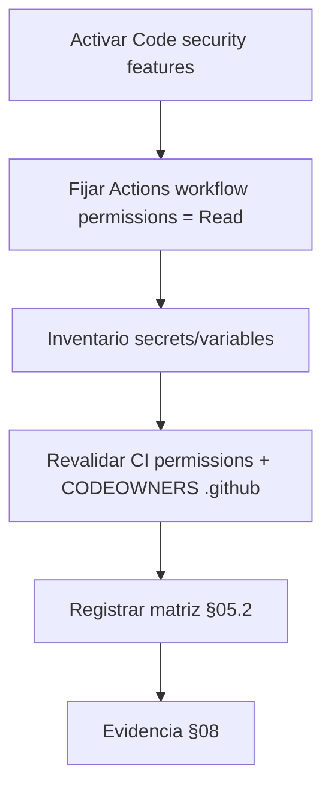

# EE-IMP-007-P07 — Security and Audit Governance

Este documento registra la evidencia técnica de la implementación física y validación correspondiente a la Unidad P07 conforme a **EE-DOC-007 — GitHub Governance** (§11 Seguridad y Gobernanza, §16 Cumplimiento).

---

## METADATOS

| Campo                 | Valor                                        |
| :-------------------- | :------------------------------------------- |
| **ID**                | EE-IMP-007-P07                               |
| **Documento**         | Security and Audit Governance                |
| **Código corto**      | EE-IMP-007-P07                               |
| **Fase**              | Fase 7 — Security and Audit Governance       |
| **Tipo**              | Documento Técnico de Implementación          |
| **Clasificación**     | Implementación                               |
| **Nivel**             | Técnico                                      |
| **Normativo**         | No                                           |
| **Versión**           | v0.2.0                                       |
| **Estado**            | Completado                                   |
| **Propietario**       | Equipo de Arquitectura                       |
| **Documento padre**   | EE-DOC-007 — GitHub Governance               |
| **Dependencias**      | EE-DOC-007, EE-IMP-007-P01 … P06             |
| **Aprobado por**      | Pendiente                                    |
| **Audiencia**         | Arquitectura, Desarrollo, DevOps, Seguridad  |
| **Fecha de creación** | 2026-09-23                                   |
| **Última revisión**   | 2026-09-23                                   |
| **Próxima revisión**  | No aplica — Unidad completada; siguiente P08 |

---

## 01. Objetivo

Materializar controles de **seguridad de plataforma GitHub** y el **modelo de evidencia/cumplimiento** aplicables al repositorio `EQ-LABS-TECH/ee-monorepo`, sin:

- definir el catálogo de Quality Gates de seguridad (EE-DOC-010);
- introducir secrets innecesarios;
- alterar el modelo de teams/permisos de P02 salvo hallazgos.

---

## 02. Prerrequisitos

| Prerrequisito                             | Estado                                         |
| :---------------------------------------- | :--------------------------------------------- |
| P01–P06 completados                       | Sí                                             |
| Repo Public (temporal, D-P03-001)         | Sí — habilita varias features free de security |
| CI least privilege (`contents: read`)     | Sí (P05)                                       |
| CODEOWNERS sobre `.github/`               | Sí (P04)                                       |
| Ruleset `Protect main` + check `Validate` | Sí (P03/P06)                                   |

---

## 03. Alcance

### 03.1. Incluye

| Área                  | Control concreto P07                                                                               |
| :-------------------- | :------------------------------------------------------------------------------------------------- |
| Credenciales          | Inventario: **cero secrets** de repo requeridos hoy; política de uso futuro                        |
| Secret scanning       | Activar **Secret scanning** + **Push protection** (repo)                                           |
| Dependencias          | Activar **Dependency graph** + **Dependabot alerts** (y opcionalmente Dependabot security updates) |
| Actions               | Default workflow permissions **Read**; no write-all                                                |
| Workflows             | Confirmar no hay secrets en YAML; actions de origen conocido                                       |
| CODEOWNERS / branches | Ya protegidos (P03–P04); revalidar ownership de `.github/`                                         |
| Cumplimiento §16      | Matriz de evidencia P01–P06 + controles P07                                                        |
| Auditoría operativa   | Cómo se revisan accesos, runs y cambios de gobernanza                                              |

### 03.2. No incluye / diferido

| Tema                                         | Motivo                                      |
| :------------------------------------------- | :------------------------------------------ |
| Org audit log avanzado / SIEM                | Puede requerir plan GitHub Team/Enterprise  |
| Secret rotation schedule con secrets reales  | No hay secrets de producto aún              |
| Code scanning / CodeQL como required check   | Opcional; definición normativa → EE-DOC-010 |
| Dependency review action como required check | Opcional hasta EE-DOC-010                   |
| Private vulnerability reporting formal       | Opcional en bootstrap                       |

---

## 04. Controles de seguridad de repositorio (objetivo)

### 04.1. Settings → Code security and analysis

Ruta: <https://github.com/EQ-LABS-TECH/ee-monorepo/settings/security_analysis>

| Feature                     | Valor P07                     | Norma              |
| :-------------------------- | :---------------------------- | :----------------- |
| Dependency graph            | **Enable**                    | §11 / supply chain |
| Dependabot alerts           | **Enable**                    | §11                |
| Dependabot security updates | **Enable** (recomendado)      | §11                |
| Secret scanning             | **Enable**                    | §11.3–11.4         |
| Push protection             | **Enable**                    | §11.4              |
| Code scanning (CodeQL)      | Opcional — no required en P07 | EE-DOC-010 futuro  |

### 04.2. Settings → Actions → General

| Control                                                  | Valor P07                                                                 |
| :------------------------------------------------------- | :------------------------------------------------------------------------ |
| Actions permissions                                      | Allow enterprise/org/local (o política org existente)                     |
| **Workflow permissions**                                 | **Read repository contents and packages permissions** (no Read and write) |
| Allow GitHub Actions to create and approve pull requests | **OFF** (salvo necesidad documentada)                                     |

### 04.3. Secrets e variables

```powershell
gh secret list
gh variable list
```

| Resultado esperado P07                     | Tratamiento                                            |
| :----------------------------------------- | :----------------------------------------------------- |
| Lista vacía de secrets                     | **Conforme** — no se introducen secrets “por si acaso” |
| Variables no sensibles solo si hacen falta | Documentar en §08 si se crean                          |

**Política futura:** todo secret se crea con justificación, alcance mínimo, rotación y workflow consumidor único (§11.3–11.5).

### 04.4. Integridad ya materializada (revalidación)

| Control                                  | Unidad  | Estado esperado                 |
| :--------------------------------------- | :------ | :------------------------------ |
| `.github/workflows/` vía PR + CODEOWNERS | P03–P05 | Architecture + Repository Admin |
| `CODEOWNERS` ownership                   | P04     | Architecture + Repository Admin |
| CI `permissions: contents: read`         | P05     | Sin write                       |
| Required check `Validate`                | P06     | Activo                          |
| Bypass bootstrap                         | P03     | W-P03-001 / W-P07-001           |

---

## 05. Modelo de cumplimiento y auditoría (§16)

### 05.1. Cadena

```text
Norma (EE-DOC-007) → Implementación (P01–P07) → Evidencia (IMP + gh/UI) → Verificación → Hallazgo / Conforme
```

### 05.2. Matriz de evidencia (consolidación previa a P08)

| Área §16.2                  | Evidencia principal                              | Unidad  |
| :-------------------------- | :----------------------------------------------- | :------ |
| Organización                | Org `EQ-LABS-TECH`, repo `ee-monorepo`           | P01–P02 |
| Accesos                     | Teams + permisos least privilege                 | P02     |
| Branches                    | Ruleset `Protect main`                           | P03     |
| Ownership                   | `.github/CODEOWNERS`                             | P04     |
| Automatización              | `ci.yml`, permissions read                       | P05     |
| Quality Gates (integración) | Required check `Validate`                        | P06     |
| Seguridad                   | Secret scanning, Dependabot, workflow perms      | **P07** |
| Auditoría                   | Este IMP + historiales IMP + commits/ruleset API | P07–P08 |

### 05.3. Rutina de revisión (single-operator)

| Frecuencia                         | Actividad                                                    |
| :--------------------------------- | :----------------------------------------------------------- |
| En cada PR de `.github/`           | Review vía CODEOWNERS + CI                                   |
| Tras cambio de teams/permisos      | Actualizar EE-IMP-007-P02 evidencia                          |
| Mensual (o al incorporar personal) | Revisar members de teams; retirar accesos obsoletos (§11.16) |
| Al crear el primer secret          | Documentar justificación + rotación en IMP o runbook         |

---

## 06. Plan de ejecución



### 06.1. Comandos útiles

```powershell
# Secrets / variables
gh secret list
gh variable list

# Security features (API; puede variar según plan)
gh api repos/EQ-LABS-TECH/ee-monorepo --jq "{visibility: .visibility, private: .private}"

# Confirmar workflow permissions vía UI si la API no expone el campo
# Settings → Actions → General → Workflow permissions
```

### 06.2. UI prioritaria

1. **Code security and analysis** — dependency graph, Dependabot alerts (+ security updates), secret scanning, push protection.
2. **Actions → General** — Workflow permissions = **Read**.
3. Confirmar que no hay secrets en Settings → Secrets and variables.

---

## 07. Especificación de artefactos

| Artefacto                            | Ubicación              | Estado P07             |
| :----------------------------------- | :--------------------- | :--------------------- |
| Secret Protection (secret scanning)  | Repo Advanced Security | **Implementado** — ON  |
| Push protection                      | Repo Advanced Security | **Implementado** — ON  |
| Dependabot alerts + security updates | Repo Advanced Security | **Implementado** — ON  |
| Dependency graph                     | Repo Advanced Security | **Implementado** — ON  |
| Workflow permissions Read            | Actions → General      | **Implementado**       |
| Inventario secrets                   | `gh secret list`       | **Conforme** — ninguno |
| Matriz cumplimiento                  | Este IMP §05.2         | **Definida**           |

---

## 08. Evidencia As-Built

Evidencia capturada 2026-09-23 vía UI y `gh`.

### 08.1. Code security (Advanced Security)

| Feature                             | Valor as-built                            |
| :---------------------------------- | :---------------------------------------- |
| Dependency graph                    | **ON**                                    |
| Dependabot alerts                   | **ON**                                    |
| Dependabot security updates         | **ON**                                    |
| Secret Protection (secret scanning) | **ON** (UI: Secret Protection)            |
| Push protection                     | **ON**                                    |
| Code scanning / CodeQL              | No requerido en P07 (diferido EE-DOC-010) |

### 08.2. Actions / secrets

| Campo                               | Valor as-built                            |
| :---------------------------------- | :---------------------------------------- |
| Workflow permissions                | **Read repository contents and packages** |
| Allow Actions to create/approve PRs | **OFF**                                   |
| `gh secret list`                    | **no secrets found**                      |
| `gh variable list`                  | **no variables found**                    |

### 08.3. Revalidación controles previos

| Control               | OK           |
| :-------------------- | :----------- |
| CI `contents: read`   | Sí (P05)     |
| CODEOWNERS `.github/` | Sí (P04)     |
| Ruleset + `Validate`  | Sí (P03/P06) |

---

## 09. Validaciones

| Prueba                               | Resultado | Evidencia              |
| :----------------------------------- | :-------- | :--------------------- |
| Secret Protection ON                 | **OK**    | UI Disable = activo    |
| Push protection ON                   | **OK**    | UI Disable = activo    |
| Dependabot alerts + security updates | **OK**    | UI                     |
| Dependency graph ON                  | **OK**    | UI                     |
| Workflow permissions Read            | **OK**    | UI                     |
| Cero secrets innecesarios            | **OK**    | `gh secret list` vacío |

### 09.1. Criterio de conformidad

- [x] Secret scanning (Secret Protection) y push protection habilitados.
- [x] Dependabot alerts (y graph) habilitados; security updates ON.
- [x] Workflow permissions por defecto = Read.
- [x] No hay secrets de repo sin justificación.
- [x] Matriz §05.2 aplicable a P01–P06 + P07.
- [x] No se definieron QG de seguridad como catálogo EE-DOC-010.

**Dictamen:** **Conforme**. Unidad **Completada**.

---

## 10. Reglas de implementación

1. No crear secrets “preventivos” vacíos de uso.
2. No otorgar write a `GITHUB_TOKEN` por defecto.
3. No añadir CodeQL/dependency-review como required check en P07 sin EE-DOC-010 (opcional enable sin required).
4. Hallazgos de Dependabot se tratan como deuda de seguridad operativa, no como fallo de P07 si el alert está activo.
5. Bypass admin sigue siendo excepción documentada (W-P07-001).

---

## 11. Correcciones / Warnings

| ID            | Severidad   | Descripción                                        | Tratamiento                                      |
| :------------ | :---------- | :------------------------------------------------- | :----------------------------------------------- |
| **W-P07-001** | Media       | Bypass bootstrap puede omitir required checks      | Heredado P03/P06; retirar al crecer el equipo    |
| **W-P07-002** | Informativo | EE-DOC-010 pendiente                               | Controles de seguridad QG no se inventan aquí    |
| **W-P07-003** | Informativo | Org audit log avanzado puede no estar en plan free | Diferido; evidencia vía IMP + git + Actions logs |

---

## 12. Trazabilidad

| Elemento           | Referencia                                               |
| :----------------- | :------------------------------------------------------- |
| **Norma**          | EE-DOC-007 §11, §16                                      |
| **Prerrequisitos** | EE-IMP-007-P01 … P06                                     |
| **Siguiente**      | EE-IMP-007-P08 — Governance Validation and Consolidation |

---

## 13. Referencias

| Código             | Documento                 |
| :----------------- | :------------------------ |
| **EE-DOC-007**     | GitHub Governance v1.0.0  |
| **EE-DOC-010**     | Quality Gates (pendiente) |
| **EE-IMP-007-P02** | Access and Organization   |
| **EE-IMP-007-P05** | GitHub Actions            |
| **EE-IMP-007-P06** | Quality Gates Integration |

---

## 14. Historial de Cambios

| Versión    | Fecha      | Autor                    | Aprobado por | Motivo       | Cambios                                                                     | Estado         |
| :--------- | :--------- | :----------------------- | :----------- | :----------- | :-------------------------------------------------------------------------- | :------------- |
| **v0.1.0** | 2026-09-23 | AI Engineering Assistant | —            | Apertura P07 | Controles security repo; Actions read; matriz §16; plan de ejecución        | En Elaboración |
| **v0.2.0** | 2026-09-23 | AI Engineering Assistant | —            | Cierre P07   | Secret Protection + push protection; Dependabot; Actions Read; cero secrets | **Completado** |

---

## FIN DEL DOCUMENTO
