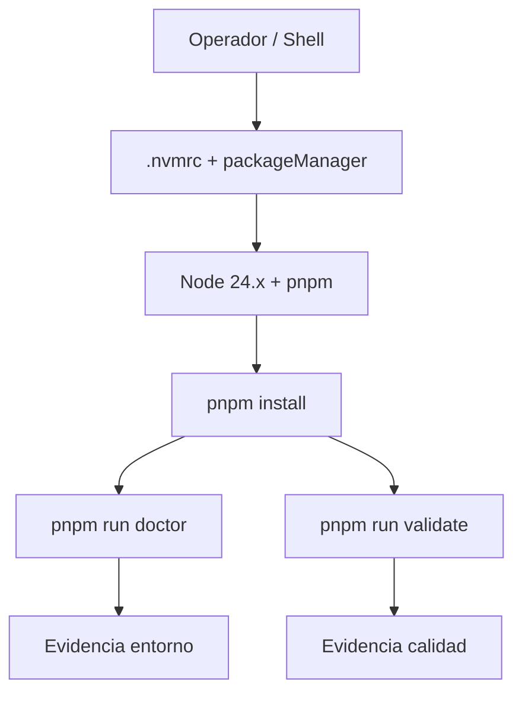

# EE-IMP-008-P01 — Runtime and Local Bootstrap

Este documento registra la evidencia técnica de la implementación física y validación correspondiente a la Fase 1 conforme al estándar **EE-DOC-005 — Development Workflow** y al documento normativo **EE-DOC-008 — Development Environment**.

---

## METADATOS

| Campo                 | Valor                                     |
| :-------------------- | :---------------------------------------- |
| **ID**                | EE-IMP-008-P01                            |
| **Documento**         | Runtime and Local Bootstrap               |
| **Código corto**      | EE-IMP-008-P01                            |
| **Fase**              | Fase 1 — Runtime and Local Bootstrap      |
| **Tipo**              | Documento Técnico de Implementación       |
| **Clasificación**     | Implementación                            |
| **Nivel**             | Técnico                                   |
| **Normativo**         | No                                        |
| **Versión**           | v1.1.0                                    |
| **Estado**            | Completado                                |
| **Propietario**       | Equipo de Arquitectura                    |
| **Documento padre**   | EE-DOC-008 — Development Environment      |
| **Dependencias**      | EE-DOC-008 v1.0.0, EE-ADR-003, EE-DOC-006 |
| **Aprobado por**      | Equipo de Arquitectura                    |
| **Audiencia**         | Arquitectura, Desarrollo, DevOps          |
| **Fecha de creación** | 2026-09-24                                |
| **Última revisión**   | 2026-09-24                                |
| **Próxima revisión**  | 2026-12-24                                |

---

## 01. Objetivo

Validar (y alinear solo si hubiera desvío) el baseline de runtime y el bootstrap local del monorepo `ee-monorepo` respecto a **EE-DOC-008 §04 / §05 / §12.4** y **EE-ADR-003**, sin recrear artefactos ya conformes.

---

## 02. Alcance Implementado

- Verificación de `.nvmrc`, `engines.node`, `engines.pnpm`, `packageManager`.
- Verificación de runtime local: Node 24.x, pnpm = versión de `packageManager`.
- Ejecución de `pnpm install`, `pnpm run doctor` (entorno) y `pnpm run validate` (calidad).
- Registro de evidencia as-built en Windows (PowerShell).

**Fuera de alcance:** `.vscode/`, Dev Container, paridad formal local↔CI (unidades posteriores).

---

## 03. Estructura Física Implementada

Artefactos **ya existentes** y **validados** (sin recreación):

```text
ee-monorepo/
├── .nvmrc                          # contenido: 24
├── package.json                    # engines + packageManager
├── pnpm-workspace.yaml
├── pnpm-lock.yaml
├── turbo.json
├── scripts/
│   ├── doctor                      # pnpm run doctor
│   └── validate                    # pnpm run validate
└── …
```

Ningún archivo nuevo de runtime fue creado en P01: modo **validación de conformidad** (EE-DOC-008 §12.4).

---

## 04. Modelo de Orquestación y Arquitectura de Ejecución



### 04.1. Repartición de Responsabilidades

| Componente             | Responsabilidad                           |
| :--------------------- | :---------------------------------------- |
| **`.nvmrc` / engines** | Declaran el baseline de Node (EE-ADR-003) |
| **`packageManager`**   | Versión efectiva de pnpm (Corepack)       |
| **`scripts/doctor`**   | Diagnóstico de entorno local              |
| **`scripts/validate`** | Suite de calidad alineable a CI           |
| **EE-IMP-008-P01**     | Evidencia de conformidad P01              |

---

## 05. Especificación Técnica de Artefactos

| Artefacto / Comando | Ruta Física / CLI   | Descripción            | Mecanismo Principal        |
| :------------------ | :------------------ | :--------------------- | :------------------------- |
| **`.nvmrc`**        | `.nvmrc`            | Línea Node `24`        | nvm / fnm / asdf           |
| **engines.node**    | `package.json`      | `>=24 <25`             | npm engines                |
| **engines.pnpm**    | `package.json`      | `>=10.16.1 <11`        | npm engines                |
| **packageManager**  | `package.json`      | `pnpm@10.16.1`         | Corepack                   |
| **doctor**          | `pnpm run doctor`   | Diagnóstico de entorno | `scripts/doctor`           |
| **validate**        | `pnpm run validate` | Suite de validación    | `scripts/validate` + turbo |

---

## 06. Naturaleza de la unidad (validar vs crear)

Conforme a EE-DOC-008 §12.4:

1. **Validar conformidad** de artefactos existentes.
2. **Corregir/alinear** solo ante desvío.
3. **Documentar evidencia**.

En esta ejecución: **sin desvíos** → sin correcciones de archivos.

---

## 07. Validaciones Ejecutadas

| Comando / Pruebas        | Resultado | Detalle                                                                    |
| :----------------------- | :-------- | :------------------------------------------------------------------------- |
| `Get-Content .nvmrc`     | ✅        | `24`                                                                       |
| `node -v`                | ✅        | `v24.21.0`                                                                 |
| `pnpm -v`                | ✅        | `10.16.1` (= packageManager)                                               |
| engines / packageManager | ✅        | `>=24 <25` / `>=10.16.1 <11` / `pnpm@10.16.1`                              |
| `pnpm install`           | ✅        | 26 workspaces; lockfile up to date; ~2.8s                                  |
| `pnpm run doctor`        | ✅        | Diagnostic completed successfully                                          |
| `pnpm run validate`      | ✅        | typecheck, lint, format check, audit, structure — _All validations passed_ |

### 07.1. Resultado de la Implementación y Estado de la Fase

| Campo                 | Valor                          |
| :-------------------- | :----------------------------- |
| **Estado de la fase** | **Completada**                 |
| **Dictamen**          | **Conforme**                   |
| **SO evidencia**      | Windows win32 x64 / PowerShell |
| **Fecha evidencia**   | 2026-09-24                     |

### 07.2. Correcciones / Warnings Observados

Ninguno. Artefactos de runtime ya alineados a EE-DOC-008 / EE-ADR-003.

---

## 08. Trazabilidad

| Elemento                      | Referencia                                                                               |
| :---------------------------- | :--------------------------------------------------------------------------------------- |
| **Documento normativo padre** | EE-DOC-008 — Development Environment                                                     |
| **Fase**                      | Fase 1 — Runtime and Local Bootstrap                                                     |
| **Implementación**            | EE-IMP-008-P01                                                                           |
| **Artefactos físicos**        | `.nvmrc`, `package.json` (engines, packageManager), `scripts/doctor`, `scripts/validate` |

### 08.1. Conformidad

Conforme a **EE-DOC-008 §04, §05, §12.4** y **EE-ADR-003**. Ciclo documental según **EE-DOC-005**: evidencia técnica de fase lista; no sustituye Validación Final ni Cierre de EE-DOC-008.

---

## 09. Referencias

| Código         | Documento                | Descripción                         |
| :------------- | :----------------------- | :---------------------------------- |
| **EE-DOC-005** | Development Workflow     | Ciclo de implementación y evidencia |
| **EE-DOC-006** | Repository Structure     | Artefactos raíz del monorepo        |
| **EE-DOC-008** | Development Environment  | Norma de entorno local              |
| **EE-ADR-003** | Node.js Baseline 24 LTS  | Baseline de Node                    |
| **EE-DOC-002** | Document Design Template | Plantilla §18.3 EE-IMP              |

---

## 10. Historial de Cambios

| Versión    | Fecha      | Autor                    | Aprobado por           | Motivo                      | Cambios                                         | Estado     |
| :--------- | :--------- | :----------------------- | :--------------------- | :-------------------------- | :---------------------------------------------- | :--------- |
| **v0.1.0** | 2026-09-24 | AI Engineering Assistant | —                      | Creación del DT de Fase     | Plan de validación runtime                      | Borrador   |
| **v1.0.0** | 2026-09-24 | AI Engineering Assistant | Equipo de Arquitectura | Cierre P01                  | Evidencia install/doctor/validate pass          | Completado |
| **v1.1.0** | 2026-09-24 | AI Engineering Assistant | Equipo de Arquitectura | Alineación EE-DOC-002 §18.3 | Reestructura metadatos y cuerpo al template IMP | Completado |

---

## FIN DEL DOCUMENTO
