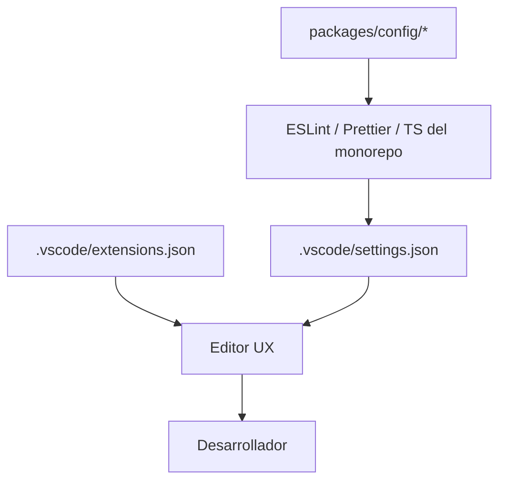

# EE-IMP-008-P02 — VS Code Workspace Governance

Este documento registra la evidencia técnica de la implementación física y validación correspondiente a la Fase 2 conforme al estándar **EE-DOC-005 — Development Workflow** y al documento normativo **EE-DOC-008 — Development Environment**.

---

## METADATOS

| Campo                 | Valor                                  |
| :-------------------- | :------------------------------------- |
| **ID**                | EE-IMP-008-P02                         |
| **Documento**         | VS Code Workspace Governance           |
| **Código corto**      | EE-IMP-008-P02                         |
| **Fase**              | Fase 2 — VS Code Workspace Governance  |
| **Tipo**              | Documento Técnico de Implementación    |
| **Clasificación**     | Implementación                         |
| **Nivel**             | Técnico                                |
| **Normativo**         | No                                     |
| **Versión**           | v1.2.0                                 |
| **Estado**            | Completado                             |
| **Propietario**       | Equipo de Arquitectura                 |
| **Documento padre**   | EE-DOC-008 — Development Environment   |
| **Dependencias**      | EE-DOC-008, EE-IMP-008-P01, EE-DOC-006 |
| **Aprobado por**      | Equipo de Arquitectura                 |
| **Audiencia**         | Arquitectura, Desarrollo, DevOps       |
| **Fecha de creación** | 2026-09-24                             |
| **Última revisión**   | 2026-09-25                             |
| **Próxima revisión**  | 2026-12-24                             |

---

## 01. Objetivo

Materializar y alinear el workspace de editor **normativo** del monorepo: `.vscode/extensions.json` y `.vscode/settings.json`, conforme a **EE-DOC-008 §06 / §12.5**, sin sustituir la SSOT de `packages/config/`.

---

## 02. Alcance Implementado

- Inventario de `.vscode/` existente.
- Alineación de `extensions.json` (ESLint, Prettier, EditorConfig, YAML; + opcional npm-dependency-links).
- Alineación de `settings.json` (Prettier, ESLint flat, TypeScript workspace SDK, exclusiones CODEOWNERS, files.exclude).
- Actualización de claves deprecadas de TypeScript SDK en VS Code (`js/ts.tsdk.*`).
- **Addendum 2026-09-25 (Type B):** markdownlint SSOT en raíz + exclusiones LICENSE/NOTICE; sin `markdownlint.config` embebido en settings (deprecado).

**Fuera de alcance:** `tasks.json` / `launch.json` (P03).

---

## 03. Estructura Física Implementada

```text
ee-monorepo/
├── .markdownlint.json      # SSOT reglas markdownlint (addendum Type B)
└── .vscode/
    ├── extensions.json     # recomendaciones de extensiones
    └── settings.json       # settings de workspace (+ ignores markdown)
```

---

## 04. Modelo de Orquestación y Arquitectura de Ejecución



### 04.1. Repartición de Responsabilidades

| Componente                    | Responsabilidad                      |
| :---------------------------- | :----------------------------------- |
| **`packages/config/*`**       | SSOT de reglas de lint/format/TS     |
| **`.vscode/settings.json`**   | UX del editor alineada a la SSOT     |
| **`.vscode/extensions.json`** | Extensiones recomendadas             |
| **Scripts raíz**              | Gates reales (`lint`, `validate`, …) |

---

## 05. Especificación Técnica de Artefactos

| Artefacto / Comando   | Ruta Física / CLI           | Descripción                 | Mecanismo Principal    |
| :-------------------- | :-------------------------- | :-------------------------- | :--------------------- |
| **extensions.json**   | `.vscode/extensions.json`   | Recommendations             | VS Code                |
| **settings.json**     | `.vscode/settings.json`     | Workspace settings          | VS Code                |
| **markdownlint.json** | `.markdownlint.json`        | Reglas MD\* del repo (SSOT) | markdownlint / VS Code |
| **ESLint ext**        | `dbaeumer.vscode-eslint`    | Diagnóstico                 | Extensión              |
| **Prettier ext**      | `esbenp.prettier-vscode`    | Formateo                    | Extensión              |
| **EditorConfig**      | `editorconfig.editorconfig` | Estilo de archivo           | Extensión              |
| **YAML**              | `redhat.vscode-yaml`        | Manifests                   | Extensión              |

---

## 06. Contenido as-built

### 06.1. extensions.json

Recommendations: `dbaeumer.vscode-eslint`, `esbenp.prettier-vscode`, `editorconfig.editorconfig`, `redhat.vscode-yaml`, `bfred-it.npm-dependency-links` (opcional retenido).

### 06.2. settings.json (puntos clave)

| Clave                                         | Valor / propósito                                                    |
| :-------------------------------------------- | :------------------------------------------------------------------- |
| `editor.defaultFormatter`                     | `esbenp.prettier-vscode`                                             |
| `eslint.useFlatConfig`                        | `true`                                                               |
| `js/ts.tsdk.path`                             | `node_modules/typescript/lib`                                        |
| `js/ts.tsdk.promptToUseWorkspaceVersion`      | `true`                                                               |
| `markdownlint.ignore`                         | `.github/CODEOWNERS`, `LICENSE`, `NOTICE`                            |
| `files.associations`                          | `CODEOWNERS`, `LICENSE`, `NOTICE` → `plaintext`                      |
| `files.exclude`                               | `node_modules`, `.turbo`, `dist`                                     |
| _(no usar)_ `markdownlint.config` en settings | **Deprecado** por la extensión; reglas viven en `.markdownlint.json` |

**Type B (2026-09-24):** sustitución de `typescript.tsdk` / `typescript.enablePromptUseWorkspaceTsdk` por `js/ts.tsdk.path` / `js/ts.tsdk.promptToUseWorkspaceVersion` (deprecación VS Code).

### 06.3. Addendum Type B — Markdownlint (2026-09-25)

| Problema                                | Tratamiento                                                                                               |
| :-------------------------------------- | :-------------------------------------------------------------------------------------------------------- |
| MD024 en `CHANGELOG.md`                 | Keep a Changelog repite `### Added` por versión → **MD024 `siblings_only: true`** en `.markdownlint.json` |
| MD041 / MD034 / MD029 en `LICENSE`      | Texto legal Apache 2.0 **no se modifica** → ignore + `plaintext`                                          |
| MD013 line-length 80 en todos los `.md` | Inviable en docs/tablas del monorepo → **MD013: false** en `.markdownlint.json`                           |
| Config embebida en settings             | Extensión deprecó `markdownlint.config` → SSOT = **`.markdownlint.json`**                                 |

**Contenido canónico de `.markdownlint.json`:**

```json
{
  "default": true,
  "MD024": { "siblings_only": true },
  "MD013": false
}
```

**Clasificación EE-DOC-005:** Type B — Especialización técnica del patrón de exclusiones de EE-DOC-008 §06.3 (CODEOWNERS → LICENSE/NOTICE + reglas MD).

---

## 07. Validaciones Ejecutadas

| Comando / Pruebas                    | Resultado | Detalle                              |
| :----------------------------------- | :-------- | :----------------------------------- |
| `Test-Path .vscode/extensions.json`  | ✅        | Presente                             |
| `Test-Path .vscode/settings.json`    | ✅        | Presente                             |
| Recommendations mínimas              | ✅        | ESLint, Prettier, EditorConfig, YAML |
| Prettier + ESLint flat               | ✅        | settings                             |
| TypeScript workspace SDK             | ✅        | claves `js/ts.tsdk.*`                |
| CODEOWNERS no Markdown               | ✅        | ignore + association                 |
| LICENSE / NOTICE no Markdown         | ✅        | ignore + association (addendum)      |
| `.markdownlint.json` (MD024 / MD013) | ✅        | SSOT reglas                          |
| Secrets en settings                  | ✅        | Ninguno                              |

### 07.1. Resultado de la Implementación y Estado de la Fase

| Campo                 | Valor          |
| :-------------------- | :------------- |
| **Estado de la fase** | **Completada** |
| **Dictamen**          | **Conforme**   |
| **Fecha evidencia**   | 2026-09-24     |

### 07.2. Correcciones / Warnings Observados

| ID            | Descripción                                                    | Tratamiento                                                        |
| :------------ | :------------------------------------------------------------- | :----------------------------------------------------------------- |
| **B-P02-001** | Claves `typescript.tsdk` deprecadas en VS Code                 | Migración a `js/ts.tsdk.path` / `promptToUseWorkspaceVersion`      |
| **B-P02-002** | Falsos positivos markdownlint en LICENSE / CHANGELOG; MD013=80 | `.markdownlint.json` + ignores; no reescribir LICENSE ni changelog |

---

## 08. Trazabilidad

| Elemento                      | Referencia                                                               |
| :---------------------------- | :----------------------------------------------------------------------- |
| **Documento normativo padre** | EE-DOC-008 — Development Environment                                     |
| **Fase**                      | Fase 2 — VS Code Workspace Governance                                    |
| **Implementación**            | EE-IMP-008-P02                                                           |
| **Artefactos físicos**        | `.vscode/extensions.json`, `.vscode/settings.json`, `.markdownlint.json` |

### 08.1. Conformidad

Conforme a **EE-DOC-008 §06 / §12.5**. Ciclo según **EE-DOC-005**.

---

## 09. Referencias

| Código             | Documento                   | Descripción             |
| :----------------- | :-------------------------- | :---------------------- |
| **EE-DOC-005**     | Development Workflow        | Ciclo de implementación |
| **EE-DOC-006**     | Repository Structure        | `packages/config/` SSOT |
| **EE-DOC-008**     | Development Environment     | Norma de editor         |
| **EE-IMP-008-P01** | Runtime and Local Bootstrap | Prerrequisito           |
| **EE-DOC-002**     | Document Design Template    | Plantilla §18.3         |

---

## 10. Historial de Cambios

| Versión    | Fecha      | Autor                    | Aprobado por           | Motivo                      | Cambios                                                                                                     | Estado         |
| :--------- | :--------- | :----------------------- | :--------------------- | :-------------------------- | :---------------------------------------------------------------------------------------------------------- | :------------- |
| **v0.1.0** | 2026-09-24 | AI Engineering Assistant | —                      | Creación del DT de Fase     | Plan extensions/settings                                                                                    | Borrador       |
| **v1.0.0** | 2026-09-24 | AI Engineering Assistant | Equipo de Arquitectura | Cierre P02                  | Alineación as-built + tsdk                                                                                  | Completado     |
| **v1.1.0** | 2026-09-24 | AI Engineering Assistant | Equipo de Arquitectura | Alineación EE-DOC-002 §18.3 | Reestructura al template IMP                                                                                | Completado     |
| **v1.2.0** | 2026-09-25 | AI Engineering Assistant | Equipo de Arquitectura | Type B markdownlint         | `.markdownlint.json`; ignores LICENSE/NOTICE; MD024 siblings_only; MD013 off; sin config embebida deprecada | **Completado** |

---

## FIN DEL DOCUMENTO
