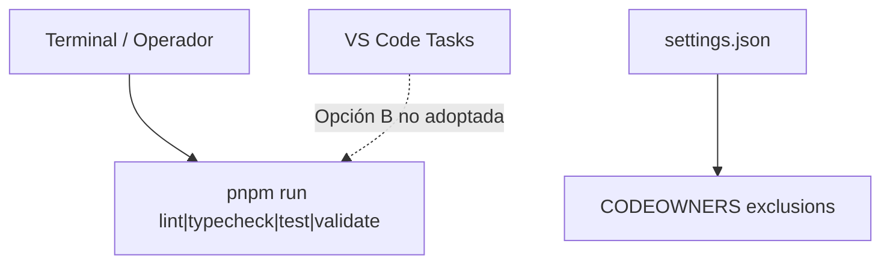

# EE-IMP-008-P03 — Editor Tooling Specialization

Este documento registra la evidencia técnica de la implementación física y validación correspondiente a la Fase 3 conforme al estándar **EE-DOC-005 — Development Workflow** y al documento normativo **EE-DOC-008 — Development Environment**.

---

## METADATOS

| Campo                 | Valor                                  |
| :-------------------- | :------------------------------------- |
| **ID**                | EE-IMP-008-P03                         |
| **Documento**         | Editor Tooling Specialization          |
| **Código corto**      | EE-IMP-008-P03                         |
| **Fase**              | Fase 3 — Editor Tooling Specialization |
| **Tipo**              | Documento Técnico de Implementación    |
| **Clasificación**     | Implementación                         |
| **Nivel**             | Técnico                                |
| **Normativo**         | No                                     |
| **Versión**           | v1.1.0                                 |
| **Estado**            | Completado                             |
| **Propietario**       | Equipo de Arquitectura                 |
| **Documento padre**   | EE-DOC-008 — Development Environment   |
| **Dependencias**      | EE-DOC-008, EE-IMP-008-P02             |
| **Aprobado por**      | Equipo de Arquitectura                 |
| **Audiencia**         | Arquitectura, Desarrollo, DevOps       |
| **Fecha de creación** | 2026-09-24                             |
| **Última revisión**   | 2026-09-24                             |
| **Próxima revisión**  | 2026-12-24                             |

---

## 01. Objetivo

Resolver la especialización opcional de tooling del editor (`tasks.json` / `launch.json`) y verificar las exclusiones de plataforma (CODEOWNERS), conforme a **EE-DOC-008 §06.5 / §12.6**.

---

## 02. Alcance Implementado

- Decisión **Opción A**: no materializar `tasks.json` ni `launch.json` (conformidad por omisión controlada).
- Verificación de exclusiones CODEOWNERS ya aplicadas en P02 (`markdownlint.ignore`, `files.associations`).
- Registro de evidencia de ausencia de tasks/launch.

**Fuera de alcance:** Dev Container (P04), paridad CI (P05).

---

## 03. Estructura Física Implementada

```text
ee-monorepo/
└── .vscode/
    ├── extensions.json      # P02
    ├── settings.json        # P02 (incluye exclusiones CODEOWNERS)
    ├── tasks.json           # NO presente (Opción A)
    └── launch.json          # NO presente (Opción A)
```

---

## 04. Modelo de Orquestación y Arquitectura de Ejecución



### 04.1. Repartición de Responsabilidades

| Componente         | Responsabilidad                                   |
| :----------------- | :------------------------------------------------ |
| **Scripts raíz**   | Ejecución real de calidad (única vía en Opción A) |
| **tasks.json**     | Atajos opcionales; no adoptados en P03            |
| **settings.json**  | Exclusiones de linting Markdown sobre CODEOWNERS  |
| **EE-IMP-008-P03** | Evidencia de decisión y verificación              |

---

## 05. Especificación Técnica de Artefactos

| Artefacto / Comando   | Ruta Física / CLI       | Descripción                        | Mecanismo Principal |
| :-------------------- | :---------------------- | :--------------------------------- | :------------------ |
| **tasks.json**        | `.vscode/tasks.json`    | **Ausente** (Opción A)             | N/A                 |
| **launch.json**       | `.vscode/launch.json`   | **Ausente** (Opción A)             | N/A                 |
| **CODEOWNERS ignore** | `.vscode/settings.json` | `markdownlint.ignore`              | VS Code             |
| **CODEOWNERS assoc.** | `.vscode/settings.json` | `files.associations` → `plaintext` | VS Code             |

---

## 06. Decisión de adopción

| Campo        | Valor                                                                         |
| :----------- | :---------------------------------------------------------------------------- |
| **Opción**   | **A — Sin tasks/launch**                                                      |
| **Motivo**   | Bootstrap / conformidad mínima; scripts oficiales vía terminal suficientes    |
| **Opción B** | Diferida; si se adopta, solo `pnpm run <script>` oficiales (EE-DOC-008 §06.5) |

---

## 07. Validaciones Ejecutadas

| Comando / Pruebas                        | Resultado | Detalle                             |
| :--------------------------------------- | :-------- | :---------------------------------- |
| `Test-Path .vscode\tasks.json`           | ✅        | `False` (esperado Opción A)         |
| `Test-Path .vscode\launch.json`          | ✅        | `False` (esperado Opción A)         |
| `Select-String … CODEOWNERS` en settings | ✅        | `markdownlint.ignore` + `plaintext` |

### 07.1. Resultado de la Implementación y Estado de la Fase

| Campo                 | Valor                   |
| :-------------------- | :---------------------- |
| **Estado de la fase** | **Completada**          |
| **Dictamen**          | **Conforme** (Opción A) |
| **Fecha evidencia**   | 2026-09-24              |

### 07.2. Correcciones / Warnings Observados

Ninguno.

---

## 08. Trazabilidad

| Elemento                      | Referencia                                                                  |
| :---------------------------- | :-------------------------------------------------------------------------- |
| **Documento normativo padre** | EE-DOC-008 — Development Environment                                        |
| **Fase**                      | Fase 3 — Editor Tooling Specialization                                      |
| **Implementación**            | EE-IMP-008-P03                                                              |
| **Artefactos físicos**        | Ausencia controlada de tasks/launch; exclusiones en `.vscode/settings.json` |

### 08.1. Conformidad

Conforme a **EE-DOC-008 §06.5 / §12.6**. Ciclo según **EE-DOC-005**.

---

## 09. Referencias

| Código             | Documento                    | Descripción                       |
| :----------------- | :--------------------------- | :-------------------------------- |
| **EE-DOC-005**     | Development Workflow         | Ciclo de implementación           |
| **EE-DOC-008**     | Development Environment      | Norma de tooling de editor        |
| **EE-IMP-008-P02** | VS Code Workspace Governance | Settings y exclusiones CODEOWNERS |
| **EE-DOC-002**     | Document Design Template     | Plantilla §18.3                   |

---

## 10. Historial de Cambios

| Versión    | Fecha      | Autor                    | Aprobado por           | Motivo                      | Cambios                            | Estado     |
| :--------- | :--------- | :----------------------- | :--------------------- | :-------------------------- | :--------------------------------- | :--------- |
| **v0.1.0** | 2026-09-24 | AI Engineering Assistant | —                      | Creación del DT de Fase     | Opciones A/B tasks-launch          | Borrador   |
| **v1.0.0** | 2026-09-24 | AI Engineering Assistant | Equipo de Arquitectura | Cierre P03                  | Opción A + verificación CODEOWNERS | Completado |
| **v1.1.0** | 2026-09-24 | AI Engineering Assistant | Equipo de Arquitectura | Alineación EE-DOC-002 §18.3 | Reestructura al template IMP       | Completado |

---

## FIN DEL DOCUMENTO
