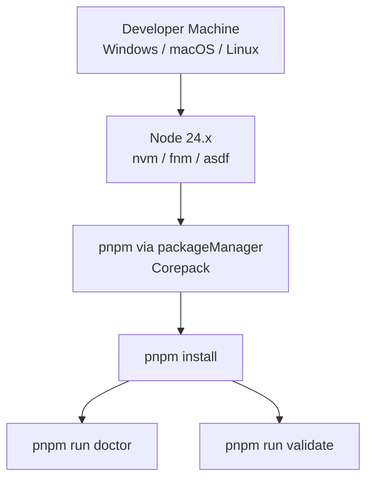

# EE-IMP-008-P04 — Dev Container (Condicional / Diferible)

Este documento registra la evidencia técnica de la implementación física y validación correspondiente a la Fase 4 conforme al estándar **EE-DOC-005 — Development Workflow** y al documento normativo **EE-DOC-008 — Development Environment**.

---

## METADATOS

| Campo                 | Valor                                                      |
| :-------------------- | :--------------------------------------------------------- |
| **ID**                | EE-IMP-008-P04                                             |
| **Documento**         | Dev Container (Condicional / Diferible)                    |
| **Código corto**      | EE-IMP-008-P04                                             |
| **Fase**              | Fase 4 — Dev Container                                     |
| **Tipo**              | Documento Técnico de Implementación                        |
| **Clasificación**     | Implementación                                             |
| **Nivel**             | Técnico                                                    |
| **Normativo**         | No                                                         |
| **Versión**           | v1.1.0                                                     |
| **Estado**            | Completado                                                 |
| **Propietario**       | Equipo de Arquitectura                                     |
| **Documento padre**   | EE-DOC-008 — Development Environment                       |
| **Dependencias**      | EE-DOC-008, EE-IMP-008-P01, EE-IMP-008-P02, EE-IMP-008-P03 |
| **Aprobado por**      | Equipo de Arquitectura                                     |
| **Audiencia**         | Arquitectura, Desarrollo, DevOps                           |
| **Fecha de creación** | 2026-09-24                                                 |
| **Última revisión**   | 2026-09-24                                                 |
| **Próxima revisión**  | Cuando se justifique adopción (requiere ADR previo)        |

---

## 01. Objetivo

Documentar la **decisión de deferimiento controlado** de Dev Containers (`.devcontainer/`) conforme a **EE-DOC-008 §07.1 / §12.7**. P04 **no materializa** artefactos físicos de contenedor. Registra que:

- el bootstrap local (P01–P03) es funcional sin Dev Container;
- la política actual permite el diferimiento;
- la adopción futura como baseline obligatorio requiere **ADR** previo;
- el diferimiento **no** bloquea la conformidad mínima ni la unidad **P05**.

---

## 02. Alcance Implementado

**Alcance:** decisión de deferimiento controlado + evidencia de ausencia de `.devcontainer/`.

| Aspecto                | Materialización             |
| :--------------------- | :-------------------------- |
| `.devcontainer/`       | **No existe** (diferida)    |
| `devcontainer.json`    | **No existe** (diferida)    |
| `Dockerfile` (dev)     | **No existe** (diferida)    |
| Análisis de viabilidad | **Completado**              |
| Registro de decisión   | **Completado**              |
| Evidencia `Test-Path`  | **Completada** (2026-09-24) |

---

## 03. Estructura Física Implementada

```text
ee-monorepo/
├── .devcontainer/              [NO CREADO — DIFERIDO]
│   └── devcontainer.json       [NO CREADO — DIFERIDO]
└── [Bootstrap local funcional sin Dev Container — P01…P03]
```

**Estado físico verificado:** `.devcontainer/` ausente (conforme a política EE-DOC-008 §07.1).

---

## 04. Modelo de Orquestación y Arquitectura de Ejecución

### 04.1. Entorno local actual (as-built, sin Dev Container)



**Bootstrap sin Dev Container:** funcional (evidencia P01–P03).

### 04.2. Repartición de Responsabilidades

| Componente              | Responsabilidad                                              |
| :---------------------- | :----------------------------------------------------------- |
| **Runtime local (P01)** | Node / pnpm / doctor / validate sin contenedor               |
| **Editor (P02–P03)**    | `.vscode/` sin dependencia de Dev Container                  |
| **P04**                 | Registro de deferimiento; no introduce infra de producto     |
| **EE-DOC-009**          | Frontera: infraestructura de producto (no implementada aquí) |

### 04.3. Frontera normativa

| Dominio                         | Responsabilidad                | Documento                                                |
| :------------------------------ | :----------------------------- | :------------------------------------------------------- |
| **Dev Container (diferido)**    | Entorno de desarrollo local    | EE-DOC-008 §07                                           |
| **Infraestructura de producto** | Cluster, servicios desplegados | EE-DOC-009 (referencia de frontera; documento posterior) |

Dev Container, si se adopta en el futuro, será **entorno local gobernado**, no infraestructura de producción.

---

## 05. Especificación Técnica de Artefactos

### 05.1. Decisión de deferimiento

| Elemento                  | Especificación                                                                                                                 |
| :------------------------ | :----------------------------------------------------------------------------------------------------------------------------- |
| **Status P04**            | **Diferida** (sin bloqueo de conformidad mínima)                                                                               |
| **Motivo**                | Bootstrap local viable (P01–P03); política EE-DOC-008 permite deferir; sin valor inmediato de paridad contenedor en esta etapa |
| **Condición de adopción** | Decisión de Arquitectura + **ADR** si se convierte en baseline obligatorio; materialización de `.devcontainer/` bajo §07.3     |
| **Impacto**               | Cero sobre P05 (paridad local ↔ CI se valida sin Dev Container)                                                               |

### 05.2. Baseline confirmado (P01–P03)

| Artefacto            | Valor as-built    |
| :------------------- | :---------------- |
| `.nvmrc`             | `24`              |
| `packageManager`     | `pnpm@10.16.1`    |
| `pnpm install`       | ✅ Exitoso        |
| `pnpm run doctor`    | ✅ Pass (entorno) |
| `pnpm run validate`  | ✅ Pass (calidad) |
| `.vscode/` normativo | ✅ P02–P03        |

### 05.3. Artefactos Dev Container

| Artefacto              | Ruta                              | Estado      |
| :--------------------- | :-------------------------------- | :---------- |
| Directorio             | `.devcontainer/`                  | **Ausente** |
| Manifest               | `.devcontainer/devcontainer.json` | **Ausente** |
| Dockerfile (si aplica) | `.devcontainer/Dockerfile`        | **Ausente** |

---

## 06. Validaciones Ejecutadas

| Comando / Pruebas                           | Resultado | Detalle                                           |
| :------------------------------------------ | :-------- | :------------------------------------------------ |
| `Test-Path .devcontainer`                   | ✅        | `False`                                           |
| `Test-Path .devcontainer\devcontainer.json` | ✅        | `False`                                           |
| `Get-ChildItem .devcontainer`               | ✅        | Sin entradas (path inexistente)                   |
| Bootstrap local sin Dev Container           | ✅        | P01–P03 completados y conformes                   |
| Política EE-DOC-008 §07.1                   | ✅        | Recomendado, no obligatorio — deferimiento válido |
| Frontera EE-DOC-009                         | ✅        | Explícita; sin solapamiento                       |

### 06.1. Resultado de la Implementación y Estado de la Fase

| Campo                 | Valor                                    |
| :-------------------- | :--------------------------------------- |
| **Estado de la fase** | **Completada** (deferimiento controlado) |
| **Dictamen**          | **Conforme**                             |
| **Fecha evidencia**   | 2026-09-24                               |
| **SO / shell**        | Windows / PowerShell                     |

- Decisión de deferimiento registrada.
- Motivo documentado.
- Evidencia física de ausencia de `.devcontainer/`.
- Frontera con EE-DOC-009 clara.
- Condición futura identificada (ADR si pasa a obligatorio).
- **No** bloquea P05 ni la conformidad mínima del entorno.

### 06.2. Correcciones / Warnings Observados

Ninguno en la ejecución. Ajustes documentales v1.1.0: alineación EE-DOC-002 §18.3, tipografía, dependencias y evidencia `Test-Path`.

---

## 07. Trazabilidad

| Elemento                      | Referencia                                                      |
| :---------------------------- | :-------------------------------------------------------------- |
| **Documento normativo padre** | EE-DOC-008 — Development Environment                            |
| **Sección normativa**         | §07, §07.1, §12.7                                               |
| **Fase**                      | Fase 4 — Dev Container (condicional / diferible)                |
| **Implementación**            | EE-IMP-008-P04                                                  |
| **Artefactos físicos**        | Ninguno (deferimiento); ausencia verificada de `.devcontainer/` |
| **Fase anterior**             | EE-IMP-008-P03                                                  |
| **Fase siguiente**            | EE-IMP-008-P05 — Local–CI Parity Validation                     |

### 07.1. Conformidad

**Conforme** a **EE-DOC-008 §07.1** (política: recomendado, no obligatorio) y **§12.7** (registro de diferimiento en IMP).

El deferimiento controlado no bloquea:

- conformidad mínima del entorno (P01–P03 + P05 + P06);
- finalización del ciclo de implementación de EE-DOC-008;
- inicio de P05 (paridad local–CI).

---

## 08. Referencias

| Código             | Documento                   | Descripción                                                                         |
| :----------------- | :-------------------------- | :---------------------------------------------------------------------------------- |
| **EE-DOC-002**     | Document Design Template    | Plantilla §18.3 EE-IMP                                                              |
| **EE-DOC-005**     | Development Workflow        | Ciclo de implementación                                                             |
| **EE-DOC-008**     | Development Environment     | Norma padre; §07 Dev Containers                                                     |
| **EE-DOC-009**     | Infrastructure              | Referencia de frontera (infra de producto; no dependencia de implementación de P04) |
| **EE-IMP-008-P01** | Runtime and Local Bootstrap | Baseline local sin contenedor                                                       |

---

## 09. Historial de Cambios

| Versión    | Fecha      | Autor                    | Aprobado por           | Motivo                         | Cambios                                                                          | Estado         |
| :--------- | :--------- | :----------------------- | :--------------------- | :----------------------------- | :------------------------------------------------------------------------------- | :------------- |
| **v1.0.0** | 2026-09-24 | AI Engineering Assistant | Equipo de Arquitectura | Deferimiento de P04            | Registro de decisión sin materializar `.devcontainer/`                           | Completado     |
| **v1.1.0** | 2026-09-24 | AI Engineering Assistant | Equipo de Arquitectura | Cierre + correcciones revisión | EE-DOC-005 intro; evidencia Test-Path; dependencias; typo; validaciones P04-only | **Completado** |

---

## FIN DEL DOCUMENTO
