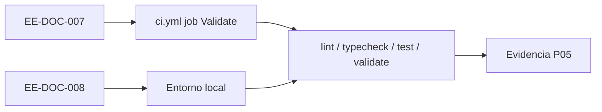

# EE-IMP-008-P05 — Local–CI Parity Validation

Este documento registra la evidencia técnica de la implementación física y validación correspondiente a la Fase 5 conforme al estándar **EE-DOC-005 — Development Workflow** y al documento normativo **EE-DOC-008 — Development Environment**.

---

## METADATOS

| Campo                 | Valor                                                  |
| :-------------------- | :----------------------------------------------------- |
| **ID**                | EE-IMP-008-P05                                         |
| **Documento**         | Local–CI Parity Validation                             |
| **Código corto**      | EE-IMP-008-P05                                         |
| **Fase**              | Fase 5 — Local–CI Parity Validation                    |
| **Tipo**              | Documento Técnico de Implementación                    |
| **Clasificación**     | Implementación                                         |
| **Nivel**             | Técnico                                                |
| **Normativo**         | No                                                     |
| **Versión**           | v1.0.0                                                 |
| **Estado**            | Completado                                             |
| **Propietario**       | Equipo de Arquitectura                                 |
| **Documento padre**   | EE-DOC-008 — Development Environment                   |
| **Dependencias**      | EE-DOC-008, EE-DOC-007, EE-IMP-008-P01, EE-IMP-007-P05 |
| **Aprobado por**      | Equipo de Arquitectura                                 |
| **Audiencia**         | Arquitectura, Desarrollo, DevOps                       |
| **Fecha de creación** | 2026-09-24                                             |
| **Última revisión**   | 2026-09-24                                             |
| **Próxima revisión**  | 2026-12-24                                             |

---

## 01. Objetivo

Verificar la **paridad del entorno local** con los controles de calidad del job CI **`Validate`** del workflow vigente bajo **EE-DOC-007**, conforme a **EE-DOC-008 §08 / §12.8**, sin redefinir `ci.yml` ni el catálogo de Quality Gates (EE-DOC-010).

---

## 02. Alcance Implementado

- Identificar los pasos de calidad del job `Validate` en `.github/workflows/ci.yml` (referencia de plataforma).
- Ejecutar en local la **misma familia** de comandos: `lint`, `typecheck`, `test`, `validate`.
- Registrar evidencia as-built (versiones Node/pnpm, resultados).
- Excluir explícitamente `pnpm run doctor` del criterio de paridad (pertenece a P01).

**Fuera de alcance:** modificar CI, definir EE-DOC-010, materializar Dev Container.

---

## 03. Estructura Física Implementada

P05 no crea estructura nueva; consume:

```text
ee-monorepo/
├── .github/workflows/ci.yml     # referencia SSOT de plataforma (EE-DOC-007)
├── package.json                 # scripts lint, typecheck, test, validate
├── .nvmrc / packageManager      # baseline (P01)
└── scripts/                     # implementaciones de los scripts raíz
```

---

## 04. Modelo de Orquestación y Arquitectura de Ejecución



### 04.1. Repartición de Responsabilidades

| Componente                | Responsabilidad                                             |
| :------------------------ | :---------------------------------------------------------- |
| **EE-DOC-007 / `ci.yml`** | Define _qué_ corre en plataforma (job `Validate`)           |
| **EE-DOC-010**            | Catálogo normativo de QG (cuando exista); no inventado aquí |
| **EE-DOC-008 / P05**      | Paridad local con esos controles                            |
| **Scripts raíz**          | Implementación ejecutable compartida                        |

### 04.2. Frontera SSOT (EE-DOC-008 §12.8)

| Autoridad  | Rol                                    |
| :--------- | :------------------------------------- |
| EE-DOC-007 | Workflow CI vigente                    |
| EE-DOC-010 | Catálogo QG (futuro)                   |
| EE-DOC-008 | Paridad local; **no** duplica `ci.yml` |

---

## 05. Especificación Técnica de Artefactos

### 05.1. Job CI de referencia (as-read del monorepo)

| Campo    | Valor                                   |
| :------- | :-------------------------------------- |
| Workflow | `.github/workflows/ci.yml` (`name: CI`) |
| Job      | `validate` / **name: Validate**         |
| Runner   | `ubuntu-latest`                         |
| Node     | `node-version-file: .nvmrc`             |
| Install  | `pnpm install --frozen-lockfile`        |

| Paso CI   | Comando              |
| :-------- | :------------------- |
| Lint      | `pnpm run lint`      |
| Typecheck | `pnpm run typecheck` |
| Test      | `pnpm run test`      |
| Validate  | `pnpm run validate`  |

### 05.2. Matriz de paridad local ↔ CI

| Control              | CI (`Validate`) | Local (P05)               | Criterio |
| :------------------- | :-------------- | :------------------------ | :------- |
| `pnpm run lint`      | Sí              | Ejecutar                  | pass     |
| `pnpm run typecheck` | Sí              | Ejecutar                  | pass     |
| `pnpm run test`      | Sí              | Ejecutar                  | pass     |
| `pnpm run validate`  | Sí              | Ejecutar                  | pass     |
| `pnpm run doctor`    | **No**          | No requerido para paridad | Solo P01 |

---

## 06. Plan de ejecución (PowerShell)

```powershell
# 1. Confirmar baseline (P01)
node -v
pnpm -v
Get-Content .nvmrc

# 2. Controles = job Validate
pnpm run lint
pnpm run typecheck
pnpm run test
pnpm run validate

# 3. Referencia CI (último run en main)
gh run list --workflow=ci.yml --branch main --limit 3
# Opcional: detalle del último success
# gh run list --workflow=ci.yml --branch main --status success --limit 1
```

Rellenar §07 con resultados.

---

## 07. Validaciones Ejecutadas

Evidencia 2026-09-24 (Windows / PowerShell). Controles alineados al job **`Validate`** de `.github/workflows/ci.yml`.

| Comando / Pruebas                                       | Resultado | Detalle                                                                               |
| :------------------------------------------------------ | :-------- | :------------------------------------------------------------------------------------ |
| `node -v`                                               | ✅        | `v24.21.0`                                                                            |
| `pnpm -v`                                               | ✅        | `10.16.1` (= packageManager)                                                          |
| `pnpm run lint`                                         | ✅        | 25 packages successful; _Linting passed_                                              |
| `pnpm run typecheck`                                    | ✅        | 18 packages successful; _Type checking passed_                                        |
| `pnpm run test`                                         | ✅        | Exit 0; **0 test tasks** en turbo (ningún workspace define script `test` aún)         |
| `pnpm run validate`                                     | ✅        | typecheck + lint + test + format check + audit + structure — _All validations passed_ |
| `gh run list --workflow=ci.yml --branch main --limit 3` | ⚠️        | **`no runs found`** — sin runs recientes listados en `main`                           |

### 07.1. Resultado de la Implementación y Estado de la Fase

| Campo                 | Valor                                                         |
| :-------------------- | :------------------------------------------------------------ |
| **Estado de la fase** | **Completada**                                                |
| **Dictamen**          | **Conforme** (paridad de **comandos** local ↔ CI; ver §07.2) |
| **Fecha evidencia**   | 2026-09-24                                                    |

**Paridad estructural:** los cuatro controles del job `Validate` (`lint`, `typecheck`, `test`, `validate`) se ejecutaron en local con el mismo baseline Node/pnpm que CI declara (`.nvmrc` / Corepack).

**Paridad de plataforma (run CI):** no hubo runs listables en `main` en el momento de la evidencia. No invalida la paridad de scripts; deja constancia de que la confirmación _end-to-end_ del job en GitHub Actions queda pendiente del próximo push/PR que dispare el workflow.

### 07.2. Correcciones / Warnings Observados

| ID            | Severidad | Descripción                                                          | Tratamiento                                                                                                                                          |
| :------------ | :-------- | :------------------------------------------------------------------- | :--------------------------------------------------------------------------------------------------------------------------------------------------- |
| **W-P05-001** | Info      | `pnpm run test`: 0 tasks turbo (no hay scripts `test` en workspaces) | Mismo comportamiento esperado en CI; no es fallo de paridad. Tests reales cuando existan scripts por paquete (EE-ADR-002 / implementación posterior) |
| **W-P05-002** | Info      | `gh run list … main` → _no runs found_                               | Documentado; revalidar con un run `Validate` success cuando el workflow se dispare de nuevo                                                          |
| **W-P05-003** | Info      | Node `DEP0190` en scripts raíz (shell + args)                        | Fuera de alcance P05; mejora futura de scripts                                                                                                       |

---

## 08. Trazabilidad

| Elemento                      | Referencia                              |
| :---------------------------- | :-------------------------------------- |
| **Documento normativo padre** | EE-DOC-008 — Development Environment    |
| **Sección normativa**         | §08, §12.8                              |
| **Plataforma CI**             | EE-DOC-007 / `.github/workflows/ci.yml` |
| **Fase**                      | Fase 5 — Local–CI Parity Validation     |
| **Implementación**            | EE-IMP-008-P05                          |
| **Fase anterior**             | EE-IMP-008-P04 (diferido)               |
| **Fase siguiente**            | EE-IMP-008-P06                          |

### 08.1. Conformidad

**Conforme** a **EE-DOC-008 §12.8**: mismos controles de calidad que el job CI `Validate` ejecutados con éxito en local. `doctor` excluido del criterio de paridad. Ausencia de runs CI listables en `main` registrada como **W-P05-002** (no bloquea cierre de P05; seguimiento operativo).

---

## 09. Referencias

| Código             | Documento                | Descripción                             |
| :----------------- | :----------------------- | :-------------------------------------- |
| **EE-DOC-005**     | Development Workflow     | Ciclo de implementación                 |
| **EE-DOC-007**     | GitHub Governance        | Propietario de Actions / CI             |
| **EE-DOC-008**     | Development Environment  | Paridad local                           |
| **EE-DOC-010**     | Quality Gates            | Catálogo QG (futuro; no inventado aquí) |
| **EE-IMP-008-P01** | Runtime Bootstrap        | Baseline local                          |
| **EE-DOC-002**     | Document Design Template | Plantilla §18.3                         |

---

## 10. Historial de Cambios

| Versión    | Fecha      | Autor                    | Aprobado por           | Motivo                  | Cambios                                                    | Estado         |
| :--------- | :--------- | :----------------------- | :--------------------- | :---------------------- | :--------------------------------------------------------- | :------------- |
| **v0.1.0** | 2026-09-24 | AI Engineering Assistant | —                      | Creación del DT de Fase | Matriz paridad vs job Validate; plan de ejecución          | En Elaboración |
| **v1.0.0** | 2026-09-24 | AI Engineering Assistant | Equipo de Arquitectura | Cierre P05              | lint/typecheck/test/validate pass local; W-P05-001/002/003 | **Completado** |

---

## FIN DEL DOCUMENTO
