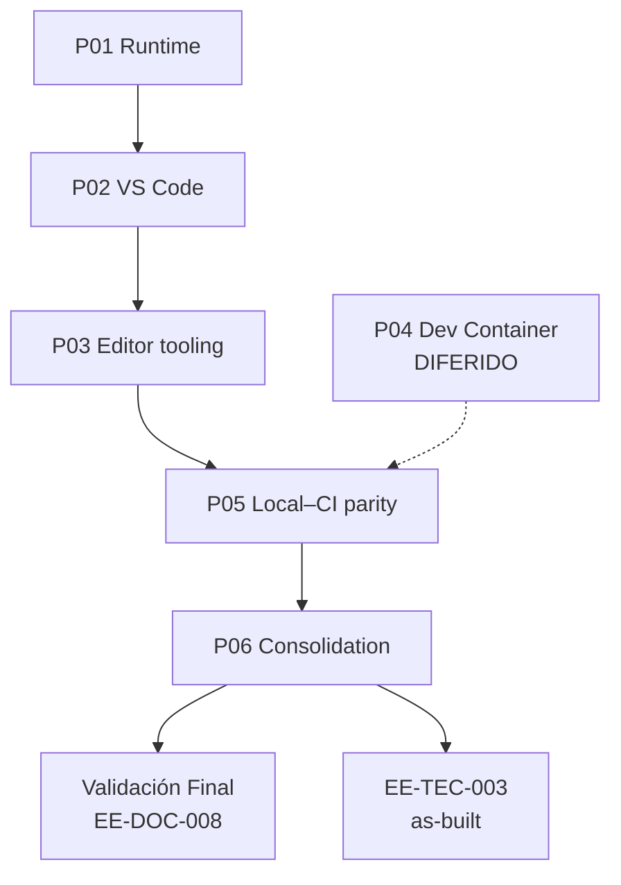

# EE-IMP-008-P06 — Consolidation and Implementation Closure

Este documento registra la evidencia técnica de la implementación física y validación correspondiente a la Fase 6 conforme al estándar **EE-DOC-005 — Development Workflow** y al documento normativo **EE-DOC-008 — Development Environment**.

---

## METADATOS

| Campo                 | Valor                                             |
| :-------------------- | :------------------------------------------------ |
| **ID**                | EE-IMP-008-P06                                    |
| **Documento**         | Consolidation and Implementation Closure          |
| **Código corto**      | EE-IMP-008-P06                                    |
| **Fase**              | Fase 6 — Consolidation and Implementation Closure |
| **Tipo**              | Documento Técnico de Implementación               |
| **Clasificación**     | Implementación                                    |
| **Nivel**             | Técnico                                           |
| **Normativo**         | No                                                |
| **Versión**           | v1.0.0                                            |
| **Estado**            | Completado                                        |
| **Propietario**       | Equipo de Arquitectura                            |
| **Documento padre**   | EE-DOC-008 — Development Environment              |
| **Dependencias**      | EE-DOC-008, EE-IMP-008-P01 … EE-IMP-008-P05       |
| **Aprobado por**      | Equipo de Arquitectura                            |
| **Audiencia**         | Arquitectura, Desarrollo, DevOps                  |
| **Fecha de creación** | 2026-09-24                                        |
| **Última revisión**   | 2026-09-24                                        |
| **Próxima revisión**  | Tras Validación Final de EE-DOC-008               |

---

## 01. Objetivo

Consolidar la evidencia de **EE-IMP-008-P01 … P05**, declarar el **cierre de la implementación** de EE-DOC-008 bajo el criterio de **conformidad mínima del entorno**, y dejar preparada la entrada a **Validación Final** + documentación técnica consolidada (**EE-TEC-003**, a confirmar en Cierre Documental).

---

## 02. Alcance Implementado

- Matriz de estado de todas las unidades P01–P05.
- Confirmación de conformidad mínima: **P01 + P02 + P03 + P05 + P06**.
- Registro de **P04 diferido** (no forma parte de la conformidad mínima).
- Lista de warnings / Type B abiertos (no bloqueantes).
- Preparación de insumos para EE-TEC y Cierre Documental de EE-DOC-008.

**Fuera de alcance:** Congelar EE-DOC-008 (acto posterior de Validación Final); redactar EE-TEC completo (artefacto siguiente).

---

## 03. Estructura Física Implementada (as-built consolidado)

```text
ee-monorepo/
├── .nvmrc                              # 24 (P01)
├── package.json                        # engines + packageManager (P01)
├── scripts/doctor, validate, lint, …   # P01 / P05
├── .vscode/
│   ├── extensions.json                 # P02
│   └── settings.json                   # P02 / P03 exclusiones
├── .devcontainer/                      # AUSENTE — P04 diferido
└── .github/workflows/ci.yml            # Referencia paridad P05 (EE-DOC-007)
```

---

## 04. Modelo de Orquestación y Arquitectura de Ejecución



### 04.1. Repartición de Responsabilidades

| Componente           | Responsabilidad                               |
| :------------------- | :-------------------------------------------- |
| **P01–P05**          | Evidencia por fase                            |
| **P06**              | Consolidación y cierre de implementación      |
| **Validación Final** | Dictamen formal sobre EE-DOC-008 (EE-DOC-005) |
| **EE-TEC-003**       | Documentación técnica consolidada as-built    |

---

## 05. Especificación Técnica — Matriz de unidades

| Unidad  | Documento                                | Versión | Estado     | Dictamen                                           |
| :------ | :--------------------------------------- | :------ | :--------- | :------------------------------------------------- |
| **P01** | Runtime and Local Bootstrap              | v1.1.0  | Completado | Conforme (validación sin recrear)                  |
| **P02** | VS Code Workspace Governance             | v1.1.0  | Completado | Conforme (extensions + settings)                   |
| **P03** | Editor Tooling Specialization            | v1.1.0  | Completado | Conforme (Opción A: sin tasks/launch)              |
| **P04** | Dev Container                            | v1.1.0  | Completado | **Diferido** controlado (`.devcontainer/` ausente) |
| **P05** | Local–CI Parity Validation               | v1.0.0  | Completado | Conforme (comandos = job Validate)                 |
| **P06** | Consolidation and Implementation Closure | v1.0.0  | Completado | Cierre de implementación                           |

### 05.1. Conformidad mínima del entorno (EE-DOC-008 §12)

| Unidad | ¿Requerida?    | ¿Cumple?    |
| :----- | :------------- | :---------- |
| P01    | Sí             | ✅          |
| P02    | Sí             | ✅          |
| P03    | Sí             | ✅          |
| P04    | No (diferible) | ✅ Diferida |
| P05    | Sí             | ✅          |
| P06    | Sí (cierre)    | ✅          |

**Resultado:** conformidad mínima del entorno **alcanzada**.

---

## 06. Resumen de evidencias clave

| Tema          | Evidencia                                                                |
| :------------ | :----------------------------------------------------------------------- |
| Node / pnpm   | `.nvmrc=24`, Node `v24.21.0`, `pnpm@10.16.1`                             |
| Bootstrap     | `install` + `doctor` + `validate` pass (P01)                             |
| Editor        | `.vscode/extensions.json` + `settings.json` (P02); CODEOWNERS exclusions |
| Tasks/launch  | Ausentes por decisión Opción A (P03)                                     |
| Dev Container | Ausente; diferimiento registrado (P04)                                   |
| Paridad CI    | `lint` / `typecheck` / `test` / `validate` pass local (P05)              |

---

## 07. Validaciones Ejecutadas

| Validación                             | Resultado | Detalle               |
| :------------------------------------- | :-------- | :-------------------- |
| Serie IMP P01–P05 completa             | ✅        | Todos Completados     |
| Conformidad mínima P01+P02+P03+P05+P06 | ✅        | Cumplida              |
| P04 diferido documentado               | ✅        | EE-IMP-008-P04 v1.1.0 |
| Warnings no bloqueantes registrados    | ✅        | Ver §07.2             |

### 07.1. Resultado de la Implementación y Estado de la Fase

| Campo                       | Valor                                                                       |
| :-------------------------- | :-------------------------------------------------------------------------- |
| **Estado de la fase**       | **Completada**                                                              |
| **Dictamen**                | **Implementación de EE-DOC-008 cerrada** (conformidad mínima)               |
| **Fecha**                   | 2026-09-24                                                                  |
| **Próximo acto documental** | Validación Final de EE-DOC-008 → EE-TEC-003 → Cierre Documental → Congelado |

### 07.2. Warnings / Type B abiertos (no bloquean cierre)

| ID            | Origen | Descripción                                       | Seguimiento                      |
| :------------ | :----- | :------------------------------------------------ | :------------------------------- |
| **B-P02-001** | P02    | Claves tsdk VS Code migradas a `js/ts.tsdk.*`     | Cerrado en P02                   |
| **W-P05-001** | P05    | 0 test tasks turbo (sin scripts `test`)           | Cuando existan tests por paquete |
| **W-P05-002** | P05    | Sin runs CI listables en `main` al momento de P05 | Revalidar en próximo push/PR     |
| **W-P05-003** | P05    | DEP0190 en scripts raíz                           | Mejora futura de scripts         |

---

## 08. Trazabilidad

| Elemento                      | Referencia                                        |
| :---------------------------- | :------------------------------------------------ |
| **Documento normativo padre** | EE-DOC-008 — Development Environment              |
| **Sección normativa**         | §12.9                                             |
| **Fase**                      | Fase 6 — Consolidation and Implementation Closure |
| **Implementación**            | EE-IMP-008-P06                                    |
| **IMP de origen**             | EE-IMP-008-P01 … P05                              |
| **Artefactos físicos**        | Ver §03                                           |

### 08.1. Conformidad

La serie de implementación **EE-IMP-008-P01 … P06** está **cerrada**. La conformidad mínima del entorno definida por EE-DOC-008 se considera **materializada y evidenciada**. Queda pendiente el acto formal de **Validación Final** y **Cierre Documental** del documento normativo padre (EE-DOC-005 / EE-DOC-008 §17).

---

## 09. Referencias

| Código                       | Documento                | Descripción                                          |
| :--------------------------- | :----------------------- | :--------------------------------------------------- |
| **EE-DOC-002**               | Document Design Template | Plantilla §18.3                                      |
| **EE-DOC-005**               | Development Workflow     | Ciclo Validación Final / Congelación                 |
| **EE-DOC-007**               | GitHub Governance        | CI de referencia (P05)                               |
| **EE-DOC-008**               | Development Environment  | Norma padre                                          |
| **EE-IMP-008-P01** … **P05** | Unidades de fase         | Evidencia por unidad                                 |
| **EE-TEC-003**               | (pendiente)              | Consolidación técnica as-built post-Validación Final |

---

## 10. Historial de Cambios

| Versión    | Fecha      | Autor                    | Aprobado por           | Motivo                           | Cambios                                                          | Estado         |
| :--------- | :--------- | :----------------------- | :--------------------- | :------------------------------- | :--------------------------------------------------------------- | :------------- |
| **v1.0.0** | 2026-09-24 | AI Engineering Assistant | Equipo de Arquitectura | Cierre implementación EE-DOC-008 | Matriz P01–P05; conformidad mínima; warnings; preparación VF/TEC | **Completado** |

---

## FIN DEL DOCUMENTO
