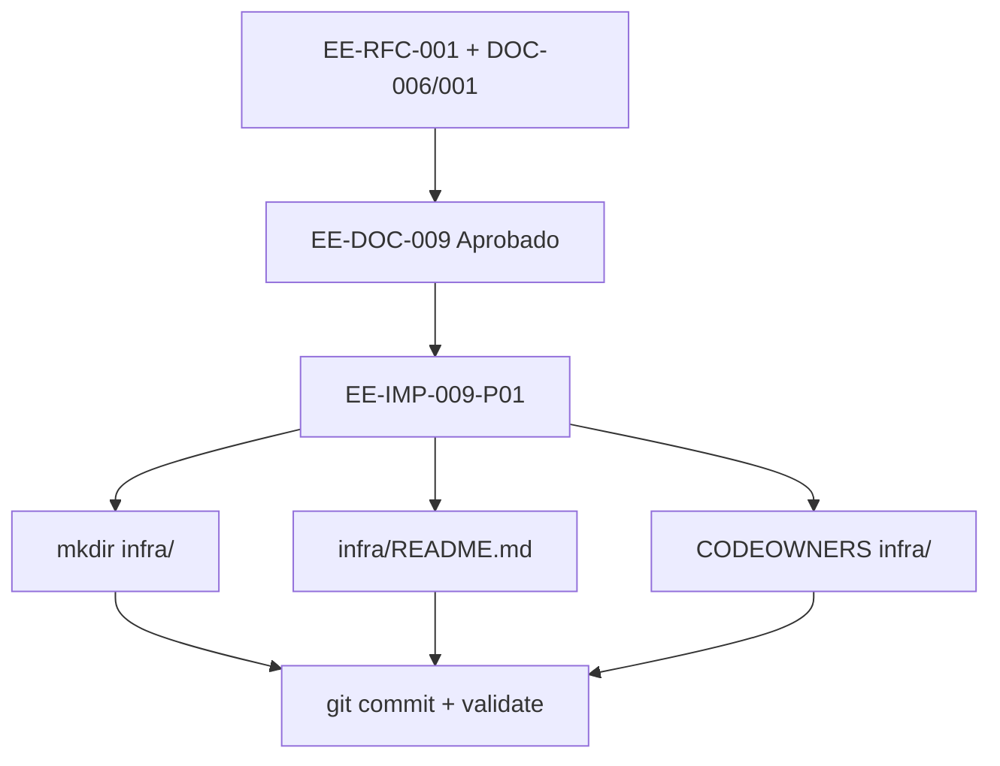

# EE-IMP-009-P01 — Infra Scaffold

Este documento registra la evidencia técnica de la implementación física y validación correspondiente a la **Fase 1** conforme al estándar **EE-DOC-005 — Development Workflow** y al documento normativo **EE-DOC-009 — Infrastructure**.

---

## METADATOS

| Campo                 | Valor                                                                                  |
| :-------------------- | :------------------------------------------------------------------------------------- |
| **ID**                | EE-IMP-009-P01                                                                         |
| **Documento**         | Infra Scaffold                                                                         |
| **Código corto**      | EE-IMP-009-P01                                                                         |
| **Fase**              | Fase 1 — Infra Scaffold                                                                |
| **Tipo**              | Documento Técnico de Implementación                                                    |
| **Clasificación**     | Implementación                                                                         |
| **Nivel**             | Técnico                                                                                |
| **Normativo**         | No                                                                                     |
| **Versión**           | v1.2.0                                                                                 |
| **Estado**            | Completado                                                                             |
| **Propietario**       | Equipo de Arquitectura                                                                 |
| **Documento padre**   | EE-DOC-009 — Infrastructure                                                            |
| **Dependencias**      | EE-DOC-009 v1.0.0, EE-DOC-006 v1.4.0, EE-DOC-001 v2.5.1, EE-RFC-001 v1.2.0, EE-DOC-007 |
| **Aprobado por**      | Equipo de Arquitectura                                                                 |
| **Audiencia**         | Arquitectura, Desarrollo, DevOps                                                       |
| **Fecha de creación** | 2026-09-25                                                                             |
| **Última revisión**   | 2026-09-26                                                                             |
| **Próxima revisión**  | 2026-12-26                                                                             |

---

## 01. Objetivo

Materializar en el monorepo `ee-monorepo` el **scaffold estructural** autorizado por **EE-DOC-006 v1.4.0** y normado por **EE-DOC-009 §08**:

```text
infra/
├── README.md
├── containers/
└── orchestration/
```

Sin semántica de despliegue de producto (Dockerfiles, Helm, etc.): corresponde a P02 / P03.

---

## 02. Alcance Implementado

- Directorios `infra/`, `infra/containers/`, `infra/orchestration/`
- `infra/README.md` (fronteras EE-DOC-008 / connectors / EE-DOC-009)
- `.gitkeep` en subdirectorios vacíos (versión inicial)
- Patrón **CODEOWNERS** para `infra/`
- Evidencia de validación y commit en `main`

**Fuera de alcance:** Dockerfiles, Compose, manifiestos K8s/Helm, secretos, P02–P05.

---

## 03. Estructura Física Implementada

```text
ee-monorepo/
└── infra/
    ├── README.md
    ├── containers/          # baseline de producto en P02
    └── orchestration/       # baseline de entornos en P03
```

**CODEOWNERS** (EE-DOC-007 §08):

```text
infra/    @EQ-LABS-TECH/architecture @EQ-LABS-TECH/repository-admin
```

---

## 04. Modelo de Orquestación y Arquitectura de Ejecución



### 04.1. Repartición de Responsabilidades

| Componente                  | Responsabilidad                                  |
| :-------------------------- | :----------------------------------------------- |
| **EE-DOC-006 / RFC-001**    | Autoridad del top-level `infra/`                 |
| **EE-DOC-009**              | Dominio semántico de infraestructura de producto |
| **Operador / Arquitectura** | Materialización física y ownership               |
| **EE-DOC-007 CODEOWNERS**   | Ownership de revisiones sobre `infra/`           |

---

## 05. Especificación Técnica de Artefactos

| Artefacto / Comando  | Ruta Física / CLI    | Descripción                       | Mecanismo Principal |
| :------------------- | :------------------- | :-------------------------------- | :------------------ |
| **Árbol infra**      | `infra/`             | Raíz canónica de IaC de producto  | filesystem / git    |
| **README fronteras** | `infra/README.md`    | Boundaries 008 / connectors / 009 | Markdown            |
| **CODEOWNERS**       | `.github/CODEOWNERS` | Patrón `infra/`                   | GitHub              |
| **validate**         | `pnpm run validate`  | Quality gate monorepo             | scripts + Turborepo |

---

## 06. Procedimiento Ejecutado (resumen)

1. Crear directorios y `.gitkeep`.
2. Escribir `infra/README.md` con fronteras.
3. Añadir patrón CODEOWNERS.
4. `pnpm run validate`.
5. Commit: `chore(infra): scaffold top-level infra/ tree (EE-IMP-009-P01)` → **`afccaf3`**.

---

## 07. Validaciones Ejecutadas

| Comando / Pruebas             | Resultado | Detalle                                           |
| :---------------------------- | :-------- | :------------------------------------------------ |
| Existencia `infra/` + subdirs | ✅        | Listado operador / inventario                     |
| `infra/README.md` fronteras   | ✅        | Paquetes_Archivos_Monorepo + git                  |
| CODEOWNERS `infra/`           | ✅        | `@EQ-LABS-TECH/architecture` + `repository-admin` |
| `pnpm run validate`           | ✅        | All validations passed                            |
| Commit en main                | ✅        | `afccaf3`                                         |

### 07.1. Resultado de la Implementación y Estado de la Fase

| Campo                 | Valor          |
| :-------------------- | :------------- |
| **Estado de la fase** | **Completada** |
| **Dictamen**          | **Conforme**   |
| **Commit**            | `afccaf3`      |

### 07.2. Correcciones / Warnings Observados

| ID            | Descripción                                         | Tratamiento                               |
| :------------ | :-------------------------------------------------- | :---------------------------------------- |
| **W-P01-001** | CODEOWNERS no visible en dump inicial de inventario | **Resuelto** — patrón `infra/` confirmado |

---

## 08. Trazabilidad

| Elemento                      | Referencia                                        |
| :---------------------------- | :------------------------------------------------ |
| **Documento normativo padre** | EE-DOC-009 — Infrastructure                       |
| **Fase**                      | Fase 1 — Infra Scaffold                           |
| **Implementación**            | EE-IMP-009-P01                                    |
| **Artefactos físicos**        | `infra/`, `infra/README.md`, `.github/CODEOWNERS` |

### 08.1. Conformidad

Conforme a **EE-DOC-009 §08 / §10 P01**, **EE-DOC-006 v1.4.0** y **EE-RFC-001**. Ciclo según **EE-DOC-005**.

---

## 09. Referencias

| Código         | Documento                 | Descripción      |
| :------------- | :------------------------ | :--------------- |
| **EE-DOC-009** | Infrastructure            | Norma padre      |
| **EE-DOC-006** | Repository Structure      | Árbol top-level  |
| **EE-RFC-001** | Infra top-level directory | Cambio gobernado |
| **EE-DOC-007** | GitHub Governance         | CODEOWNERS       |
| **EE-DOC-002** | Document Design Template  | Plantilla §18.3  |
| **EE-DOC-005** | Development Workflow      | Ciclo IMP        |

---

## 10. Historial de Cambios

| Versión    | Fecha      | Autor                    | Aprobado por           | Motivo                      | Cambios                      | Estado            |
| :--------- | :--------- | :----------------------- | :--------------------- | :-------------------------- | :--------------------------- | :---------------- |
| **v1.0.0** | 2026-09-25 | AI Engineering Assistant | —                      | Creación                    | Especificación P01           | En Implementación |
| **v1.1.0** | 2026-09-25 | AI Engineering Assistant | Equipo de Arquitectura | As-built                    | Evidencia materialización    | Completado        |
| **v1.1.1** | 2026-09-25 | AI Engineering Assistant | Equipo de Arquitectura | W-P01-001                   | CODEOWNERS confirmado        | Completado        |
| **v1.2.0** | 2026-09-26 | AI Engineering Assistant | Equipo de Arquitectura | Alineación EE-DOC-002 §18.3 | Reestructura al template IMP | **Completado**    |

---

## FIN DEL DOCUMENTO
