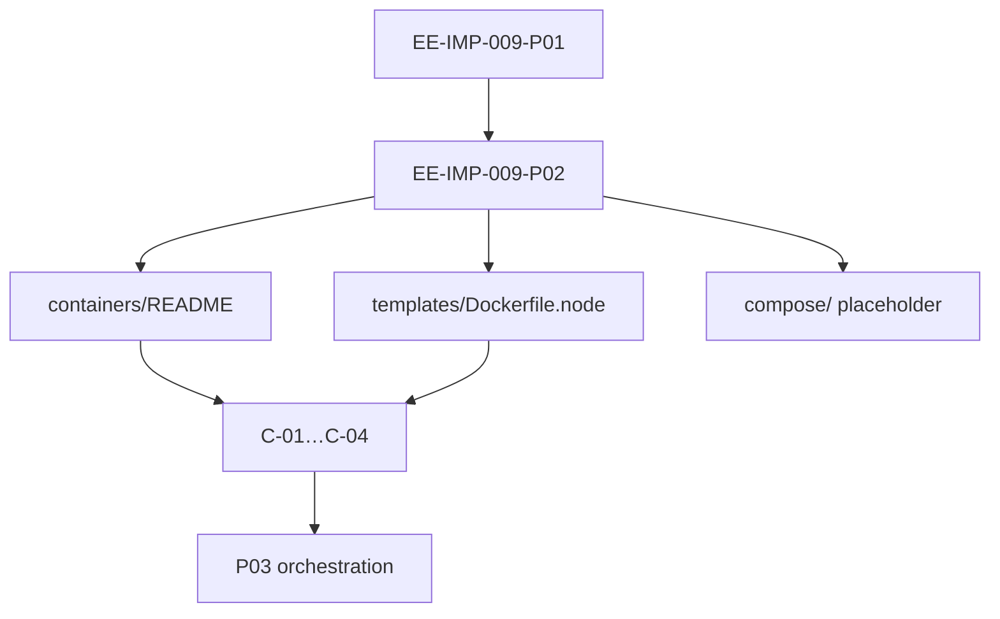

# EE-IMP-009-P02 — Product Containers

Este documento registra la evidencia técnica de la implementación física y validación correspondiente a la **Fase 2** conforme al estándar **EE-DOC-005 — Development Workflow** y al documento normativo **EE-DOC-009 — Infrastructure**.

---

## METADATOS

| Campo                 | Valor                                                          |
| :-------------------- | :------------------------------------------------------------- |
| **ID**                | EE-IMP-009-P02                                                 |
| **Documento**         | Product Containers                                             |
| **Código corto**      | EE-IMP-009-P02                                                 |
| **Fase**              | Fase 2 — Product Containers                                    |
| **Tipo**              | Documento Técnico de Implementación                            |
| **Clasificación**     | Implementación                                                 |
| **Nivel**             | Técnico                                                        |
| **Normativo**         | No                                                             |
| **Versión**           | v1.2.0                                                         |
| **Estado**            | Completado                                                     |
| **Propietario**       | Equipo de Arquitectura                                         |
| **Documento padre**   | EE-DOC-009 — Infrastructure                                    |
| **Dependencias**      | EE-DOC-009, EE-IMP-009-P01, EE-ADR-003, EE-DOC-006, EE-DOC-008 |
| **Aprobado por**      | Equipo de Arquitectura                                         |
| **Audiencia**         | Arquitectura, Desarrollo, DevOps                               |
| **Fecha de creación** | 2026-09-25                                                     |
| **Última revisión**   | 2026-09-26                                                     |
| **Próxima revisión**  | 2026-12-26                                                     |

---

## 01. Objetivo

Establecer el **baseline de contenerización de producto/plataforma** bajo `infra/containers/`, conforme a **EE-DOC-009 §06.1 / §06.2 / §10 P02** (reglas **C-01…C-04**), sin confundir con Dev Container (EE-DOC-008).

---

## 02. Alcance Implementado

- `infra/containers/README.md` (convenciones + fronteras)
- `infra/containers/templates/Dockerfile.node` (Node 24 / EE-ADR-003)
- `infra/containers/compose/.gitkeep` (reserva stack local de producto)
- Eliminación del `.gitkeep` vacío de `containers/` tras poblar contenido
- Commit en `main`: **`f4ad84b`**

**Fuera de alcance:** `.devcontainer/`, manifiestos K8s, secretos, CI de build/push de imágenes.

---

## 03. Estructura Física Implementada

```text
infra/containers/
├── README.md
├── templates/
│   └── Dockerfile.node
└── compose/
    └── .gitkeep
```

---

## 04. Modelo de Orquestación y Arquitectura de Ejecución



### 04.1. Repartición de Responsabilidades

| Componente                       | Responsabilidad                                      |
| :------------------------------- | :--------------------------------------------------- |
| **`infra/containers/`**          | Empaquetado de producto / stack local de producto    |
| **`.devcontainer/`**             | Entorno de desarrollo (EE-DOC-008) — **no** este P02 |
| **`connectors/official/docker`** | Adaptador de integración — **no** IaC de plataforma  |
| **EE-ADR-003**                   | Baseline Node 24 para plantilla                      |

---

## 05. Especificación Técnica de Artefactos

| Artefacto / Comando     | Ruta Física / CLI                            | Descripción                  | Mecanismo Principal |
| :---------------------- | :------------------------------------------- | :--------------------------- | :------------------ |
| **README containers**   | `infra/containers/README.md`                 | C-01…C-04 + boundaries       | Markdown            |
| **Dockerfile template** | `infra/containers/templates/Dockerfile.node` | Base `node:24-bookworm-slim` | Docker              |
| **compose placeholder** | `infra/containers/compose/.gitkeep`          | Reserva stack local          | git                 |
| **validate**            | `pnpm run validate`                          | Quality gate                 | scripts + Turborepo |

---

## 06. Cumplimiento C-01…C-04

| Regla    | Cumplimiento                                            |
| :------- | :------------------------------------------------------ |
| **C-01** | Definiciones versionadas bajo `infra/containers/`       |
| **C-02** | Plantilla sin secretos; README lo prohíbe               |
| **C-03** | Base Node 24 (ADR-003)                                  |
| **C-04** | README: Dev Container no sustituye imágenes de producto |

---

## 07. Validaciones Ejecutadas

| Comando / Pruebas                  | Resultado | Detalle                                       |
| :--------------------------------- | :-------- | :-------------------------------------------- |
| Tree containers                    | ✅        | README 1661; Dockerfile 394; compose/.gitkeep |
| `pnpm run validate`                | ✅        | All validations passed                        |
| Sin secretos / sin `.devcontainer` | ✅        | Scope respetado                               |
| Commit                             | ✅        | `f4ad84b`                                     |

### 07.1. Resultado de la Implementación y Estado de la Fase

| Campo                 | Valor          |
| :-------------------- | :------------- |
| **Estado de la fase** | **Completada** |
| **Dictamen**          | **Conforme**   |
| **Commit**            | `f4ad84b`      |

### 07.2. Correcciones / Warnings Observados

Ninguno bloqueante. Aviso git LF/CRLF en `Dockerfile.node` (normalización de fin de línea).

---

## 08. Trazabilidad

| Elemento                      | Referencia                  |
| :---------------------------- | :-------------------------- |
| **Documento normativo padre** | EE-DOC-009 — Infrastructure |
| **Fase**                      | Fase 2 — Product Containers |
| **Implementación**            | EE-IMP-009-P02              |
| **Artefactos físicos**        | `infra/containers/**`       |

### 08.1. Conformidad

Conforme a **EE-DOC-009 §06.1 / §10 P02**, **EE-ADR-003** y frontera **EE-DOC-008**. Ciclo **EE-DOC-005**.

---

## 09. Referencias

| Código             | Documento                | Descripción            |
| :----------------- | :----------------------- | :--------------------- |
| **EE-DOC-009**     | Infrastructure           | Norma padre            |
| **EE-IMP-009-P01** | Infra Scaffold           | Prerrequisito          |
| **EE-ADR-003**     | Node.js Baseline 24 LTS  | Runtime plantilla      |
| **EE-DOC-008**     | Development Environment  | Frontera Dev Container |
| **EE-DOC-002**     | Document Design Template | §18.3                  |
| **EE-DOC-005**     | Development Workflow     | Ciclo IMP              |

---

## 10. Historial de Cambios

| Versión    | Fecha      | Autor                    | Aprobado por           | Motivo                      | Cambios                      | Estado            |
| :--------- | :--------- | :----------------------- | :--------------------- | :-------------------------- | :--------------------------- | :---------------- |
| **v1.0.0** | 2026-09-25 | AI Engineering Assistant | —                      | Creación                    | Especificación P02           | En Implementación |
| **v1.1.0** | 2026-09-25 | AI Engineering Assistant | Equipo de Arquitectura | As-built                    | Tree + validate              | Completado        |
| **v1.1.1** | 2026-09-25 | AI Engineering Assistant | Equipo de Arquitectura | Commit                      | `f4ad84b`                    | Completado        |
| **v1.2.0** | 2026-09-26 | AI Engineering Assistant | Equipo de Arquitectura | Alineación EE-DOC-002 §18.3 | Reestructura al template IMP | **Completado**    |

---

## FIN DEL DOCUMENTO
