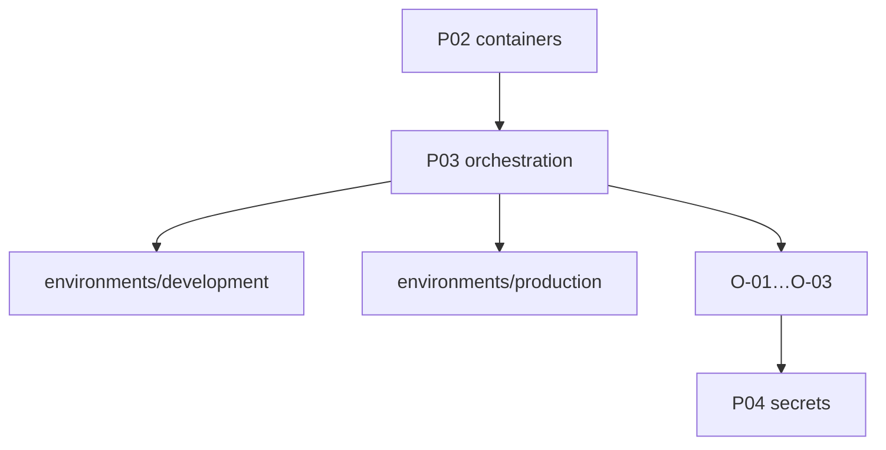

# EE-IMP-009-P03 — Orchestration and Environments

Este documento registra la evidencia técnica de la implementación física y validación correspondiente a la **Fase 3** conforme al estándar **EE-DOC-005 — Development Workflow** y al documento normativo **EE-DOC-009 — Infrastructure**.

---

## METADATOS

| Campo                 | Valor                                                              |
| :-------------------- | :----------------------------------------------------------------- |
| **ID**                | EE-IMP-009-P03                                                     |
| **Documento**         | Orchestration and Environments                                     |
| **Código corto**      | EE-IMP-009-P03                                                     |
| **Fase**              | Fase 3 — Orchestration and Environments                            |
| **Tipo**              | Documento Técnico de Implementación                                |
| **Clasificación**     | Implementación                                                     |
| **Nivel**             | Técnico                                                            |
| **Normativo**         | No                                                                 |
| **Versión**           | v1.2.0                                                             |
| **Estado**            | Completado                                                         |
| **Propietario**       | Equipo de Arquitectura                                             |
| **Documento padre**   | EE-DOC-009 — Infrastructure                                        |
| **Dependencias**      | EE-DOC-009, EE-IMP-009-P01, EE-IMP-009-P02, EE-DOC-006, EE-DOC-003 |
| **Aprobado por**      | Equipo de Arquitectura                                             |
| **Audiencia**         | Arquitectura, Desarrollo, DevOps                                   |
| **Fecha de creación** | 2026-09-25                                                         |
| **Última revisión**   | 2026-09-26                                                         |
| **Próxima revisión**  | 2026-12-26                                                         |

---

## 01. Objetivo

Establecer el **baseline de orquestación desplegada** bajo `infra/orchestration/` con entornos lógicos mínimos **development** y **production** (**O-01…O-03**), sin congelar un orquestador vendor concreto.

---

## 02. Alcance Implementado

- `infra/orchestration/README.md` (O-01…O-03 + fronteras)
- `environments/development/.gitkeep`
- `environments/production/.gitkeep`
- Commit en `main`: **`26a8464`**

**Fuera de alcance:** manifiestos completos de servicios, staging obligatorio, elección de Kubernetes como único path, secretos (P04).

---

## 03. Estructura Física Implementada

```text
infra/orchestration/
├── README.md
└── environments/
    ├── development/.gitkeep
    └── production/.gitkeep
```

---

## 04. Modelo de Orquestación y Arquitectura de Ejecución



### 04.1. Repartición de Responsabilidades

| Componente                           | Responsabilidad                                 |
| :----------------------------------- | :---------------------------------------------- |
| **`infra/orchestration/`**           | Cómo se **despliega** la plataforma por entorno |
| **`infra/containers/`**              | Cómo se **empaqueta** la imagen                 |
| **`connectors/official/kubernetes`** | Adaptador de integración — no IaC de plataforma |
| **EE-DOC-003**                       | Vendor Agnostic (O-03)                          |

---

## 05. Especificación Técnica de Artefactos

| Artefacto / Comando      | Ruta Física / CLI               | Descripción            | Mecanismo Principal |
| :----------------------- | :------------------------------ | :--------------------- | :------------------ |
| **README orchestration** | `infra/orchestration/README.md` | O-01…O-03 + boundaries | Markdown            |
| **env development**      | `…/environments/development/`   | Entorno lógico mínimo  | filesystem          |
| **env production**       | `…/environments/production/`    | Entorno lógico mínimo  | filesystem          |
| **validate**             | `pnpm run validate`             | Quality gate           | scripts + Turborepo |

---

## 06. Cumplimiento O-01…O-03

| Regla    | Cumplimiento                                           |
| :------- | :----------------------------------------------------- |
| **O-01** | Orquestación versionada bajo `infra/orchestration/`    |
| **O-02** | `development` y `production` distinguibles             |
| **O-03** | README: orquestador concreto = decisión futura IMP/ADR |

---

## 07. Validaciones Ejecutadas

| Comando / Pruebas   | Resultado | Detalle                          |
| :------------------ | :-------- | :------------------------------- |
| Tree orchestration  | ✅        | README 1896; envs con `.gitkeep` |
| `pnpm run validate` | ✅        | All validations passed           |
| Vendor Agnostic     | ✅        | Sin K8s-only obligatorio         |
| Commit              | ✅        | `26a8464`                        |

### 07.1. Resultado de la Implementación y Estado de la Fase

| Campo                 | Valor          |
| :-------------------- | :------------- |
| **Estado de la fase** | **Completada** |
| **Dictamen**          | **Conforme**   |
| **Commit**            | `26a8464`      |

### 07.2. Correcciones / Warnings Observados

Ninguno bloqueante.

---

## 08. Trazabilidad

| Elemento                      | Referencia                              |
| :---------------------------- | :-------------------------------------- |
| **Documento normativo padre** | EE-DOC-009 — Infrastructure             |
| **Fase**                      | Fase 3 — Orchestration and Environments |
| **Implementación**            | EE-IMP-009-P03                          |
| **Artefactos físicos**        | `infra/orchestration/**`                |

### 08.1. Conformidad

Conforme a **EE-DOC-009 §06.3 / §10 P03** y **EE-DOC-003 (Vendor Agnostic)**. Ciclo **EE-DOC-005**.

---

## 09. Referencias

| Código             | Documento                | Descripción     |
| :----------------- | :----------------------- | :-------------- |
| **EE-DOC-009**     | Infrastructure           | Norma padre     |
| **EE-IMP-009-P01** | Infra Scaffold           | Prerrequisito   |
| **EE-IMP-009-P02** | Product Containers       | Prerrequisito   |
| **EE-DOC-003**     | Constitution             | Vendor Agnostic |
| **EE-DOC-002**     | Document Design Template | §18.3           |
| **EE-DOC-005**     | Development Workflow     | Ciclo IMP       |

---

## 10. Historial de Cambios

| Versión    | Fecha      | Autor                    | Aprobado por           | Motivo                      | Cambios                      | Estado            |
| :--------- | :--------- | :----------------------- | :--------------------- | :-------------------------- | :--------------------------- | :---------------- |
| **v1.0.0** | 2026-09-25 | AI Engineering Assistant | —                      | Creación                    | Especificación P03           | En Implementación |
| **v1.1.0** | 2026-09-26 | AI Engineering Assistant | Equipo de Arquitectura | As-built                    | Commit `26a8464`             | Completado        |
| **v1.2.0** | 2026-09-26 | AI Engineering Assistant | Equipo de Arquitectura | Alineación EE-DOC-002 §18.3 | Reestructura al template IMP | **Completado**    |

---

## FIN DEL DOCUMENTO
