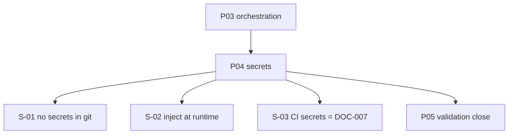

# EE-IMP-009-P04 — Runtime Secrets and IaC Minimum

Este documento registra la evidencia técnica de la implementación física y validación correspondiente a la **Fase 4** conforme al estándar **EE-DOC-005 — Development Workflow** y al documento normativo **EE-DOC-009 — Infrastructure**.

---

## METADATOS

| Campo                 | Valor                                      |
| :-------------------- | :----------------------------------------- |
| **ID**                | EE-IMP-009-P04                             |
| **Documento**         | Runtime Secrets and IaC Minimum            |
| **Código corto**      | EE-IMP-009-P04                             |
| **Fase**              | Fase 4 — Runtime Secrets and IaC Minimum   |
| **Tipo**              | Documento Técnico de Implementación        |
| **Clasificación**     | Implementación                             |
| **Nivel**             | Técnico                                    |
| **Normativo**         | No                                         |
| **Versión**           | v1.2.0                                     |
| **Estado**            | Completado                                 |
| **Propietario**       | Equipo de Arquitectura                     |
| **Documento padre**   | EE-DOC-009 — Infrastructure                |
| **Dependencias**      | EE-DOC-009, EE-IMP-009-P01…P03, EE-DOC-007 |
| **Aprobado por**      | Equipo de Arquitectura                     |
| **Audiencia**         | Arquitectura, Desarrollo, DevOps           |
| **Fecha de creación** | 2026-09-26                                 |
| **Última revisión**   | 2026-09-26                                 |
| **Próxima revisión**  | 2026-12-26                                 |

---

## 01. Objetivo

Aplicar **S-01…S-03** y fijar **convenciones mínimas de IaC** bajo `infra/`: política de secretos de runtime, separación vs GitHub Secrets de CI (EE-DOC-007), y ausencia de valores secretos en el repositorio.

---

## 02. Alcance Implementado

- `infra/secrets/README.md` (política S-01…S-03 + convenciones IaC)
- `infra/secrets/.gitignore` (patrones de material sensible local)
- Puntero en `infra/README.md` → `secrets/`
- Commit en `main`: **`e21ef3b`**

**Fuera de alcance:** secretos reales, catálogo operativo de Actions Secrets, adopción de un vault concreto como norma.

---

## 03. Estructura Física Implementada

```text
infra/
├── README.md              # sección Secrets → secrets/
└── secrets/
    ├── README.md
    └── .gitignore
```

---

## 04. Modelo de Orquestación y Arquitectura de Ejecución



### 04.1. Repartición de Responsabilidades

| Componente                               | Responsabilidad                                        |
| :--------------------------------------- | :----------------------------------------------------- |
| **`infra/secrets/`**                     | Política de secretos de **runtime de infraestructura** |
| **EE-DOC-007 / `.github`**               | GitHub Secrets de **CI de plataforma**                 |
| **`infra/containers` / `orchestration`** | Manifiestos sin valores secretos embebidos             |
| **Operador local**                       | No versionar `.env`, kubeconfig, keys                  |

---

## 05. Especificación Técnica de Artefactos

| Artefacto / Comando    | Ruta Física / CLI          | Descripción            | Mecanismo Principal |
| :--------------------- | :------------------------- | :--------------------- | :------------------ |
| **Política secrets**   | `infra/secrets/README.md`  | S-01…S-03 + IaC min    | Markdown            |
| **gitignore secrets**  | `infra/secrets/.gitignore` | Bloqueo material local | git                 |
| **Puntero root infra** | `infra/README.md`          | Enlace a `secrets/`    | Markdown            |
| **validate**           | `pnpm run validate`        | Quality gate           | scripts + Turborepo |

---

## 06. Cumplimiento S-01…S-03

| Regla    | Cumplimiento                                           |
| :------- | :----------------------------------------------------- |
| **S-01** | Sin secretos en claro; gitignore de patrones sensibles |
| **S-02** | README: inyección en runtime / secret store            |
| **S-03** | README delega CI secrets a EE-DOC-007                  |

---

## 07. Validaciones Ejecutadas

| Comando / Pruebas                      | Resultado | Detalle                       |
| :------------------------------------- | :-------- | :---------------------------- |
| Tree secrets                           | ✅        | README 2295; `.gitignore` 204 |
| Escaneo `*.pem` / `.env` / credentials | ✅        | Sin resultados                |
| Puntero `infra/README.md`              | ✅        | Sección Secrets               |
| `pnpm run validate`                    | ✅        | All validations passed        |
| Commit                                 | ✅        | `e21ef3b`                     |

### 07.1. Resultado de la Implementación y Estado de la Fase

| Campo                 | Valor          |
| :-------------------- | :------------- |
| **Estado de la fase** | **Completada** |
| **Dictamen**          | **Conforme**   |
| **Commit**            | `e21ef3b`      |

### 07.2. Correcciones / Warnings Observados

Aviso git CRLF→LF en `infra/secrets/.gitignore` (normalización).

---

## 08. Trazabilidad

| Elemento                      | Referencia                               |
| :---------------------------- | :--------------------------------------- |
| **Documento normativo padre** | EE-DOC-009 — Infrastructure              |
| **Fase**                      | Fase 4 — Runtime Secrets and IaC Minimum |
| **Implementación**            | EE-IMP-009-P04                           |
| **Artefactos físicos**        | `infra/secrets/**`, `infra/README.md`    |

### 08.1. Conformidad

Conforme a **EE-DOC-009 §06.4 / §10 P04** y frontera **EE-DOC-007**. Ciclo **EE-DOC-005**.

---

## 09. Referencias

| Código                 | Documento                | Descripción    |
| :--------------------- | :----------------------- | :------------- |
| **EE-DOC-009**         | Infrastructure           | Norma padre    |
| **EE-DOC-007**         | GitHub Governance        | CI secrets     |
| **EE-IMP-009-P01…P03** | Fases previas            | Prerrequisitos |
| **EE-DOC-002**         | Document Design Template | §18.3          |
| **EE-DOC-005**         | Development Workflow     | Ciclo IMP      |

---

## 10. Historial de Cambios

| Versión    | Fecha      | Autor                    | Aprobado por           | Motivo                      | Cambios                      | Estado            |
| :--------- | :--------- | :----------------------- | :--------------------- | :-------------------------- | :--------------------------- | :---------------- |
| **v1.0.0** | 2026-09-26 | AI Engineering Assistant | —                      | Creación                    | Especificación P04           | En Implementación |
| **v1.1.0** | 2026-09-26 | AI Engineering Assistant | Equipo de Arquitectura | As-built                    | Commit `e21ef3b`             | Completado        |
| **v1.2.0** | 2026-09-26 | AI Engineering Assistant | Equipo de Arquitectura | Alineación EE-DOC-002 §18.3 | Reestructura al template IMP | **Completado**    |

---

## FIN DEL DOCUMENTO
