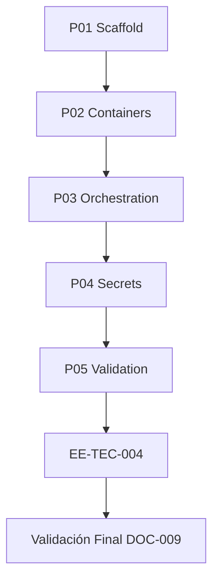

# EE-IMP-009-P05 — Validation and Closure

Este documento registra la evidencia técnica de la implementación física y validación correspondiente a la **Fase 5** conforme al estándar **EE-DOC-005 — Development Workflow** y al documento normativo **EE-DOC-009 — Infrastructure**.

---

## METADATOS

| Campo                 | Valor                                                                       |
| :-------------------- | :-------------------------------------------------------------------------- |
| **ID**                | EE-IMP-009-P05                                                              |
| **Documento**         | Validation and Closure                                                      |
| **Código corto**      | EE-IMP-009-P05                                                              |
| **Fase**              | Fase 5 — Validation and Closure                                             |
| **Tipo**              | Documento Técnico de Implementación                                         |
| **Clasificación**     | Implementación                                                              |
| **Nivel**             | Técnico                                                                     |
| **Normativo**         | No                                                                          |
| **Versión**           | v1.1.0                                                                      |
| **Estado**            | Completado                                                                  |
| **Propietario**       | Equipo de Arquitectura                                                      |
| **Documento padre**   | EE-DOC-009 — Infrastructure                                                 |
| **Dependencias**      | EE-IMP-009-P01…P04 (Completados), EE-DOC-009, EE-DOC-006 v1.4.0, EE-RFC-001 |
| **Aprobado por**      | Equipo de Arquitectura                                                      |
| **Audiencia**         | Arquitectura, Desarrollo, DevOps                                            |
| **Fecha de creación** | 2026-09-26                                                                  |
| **Última revisión**   | 2026-09-26                                                                  |
| **Próxima revisión**  | Tras Validación Final de EE-DOC-009                                         |

---

## 01. Objetivo

1. Verificar el estado **as-built** de `infra/` contra EE-DOC-009 (U-_, C-_, O-_, S-_).
2. Confirmar ausencia de secretos de runtime en el repo.
3. Confirmar `pnpm run validate` en verde.
4. Registrar evidencia consolidada y **cerrar la implementación** P01–P04.
5. Habilitar el siguiente hito: **EE-TEC-004** → Validación Final → Congelación de EE-DOC-009.

**Esta unidad no añade árbol funcional nuevo**; es de evidencia y cierre.

---

## 02. Alcance Implementado

- Checklist de conformidad P01–P04 ejecutado y documentado
- Inventario completo de `infra/` verificado
- Matriz de conformidad EE-DOC-009
- Dictamen de cierre de implementación

**Fuera de alcance:** nuevos Dockerfiles/manifiestos; congelar EE-DOC-009 en este IMP; modificar documentos 001–008.

---

## 03. Estructura Física Implementada

Árbol as-built validado (sin cambios funcionales en P05):

```text
infra/
├── README.md
├── containers/
│   ├── README.md
│   ├── templates/Dockerfile.node
│   └── compose/.gitkeep
├── orchestration/
│   ├── README.md
│   └── environments/
│       ├── development/.gitkeep
│       └── production/.gitkeep
└── secrets/
    ├── README.md
    └── .gitignore
```

### 03.1. Commits de implementación (main)

| Fase | IMP            | Commit    | Resumen                    |
| :--- | :------------- | :-------- | :------------------------- |
| P01  | EE-IMP-009-P01 | `afccaf3` | scaffold infra/            |
| P02  | EE-IMP-009-P02 | `f4ad84b` | containers baseline        |
| P03  | EE-IMP-009-P03 | `26a8464` | orchestration environments |
| P04  | EE-IMP-009-P04 | `e21ef3b` | secrets policy             |

---

## 04. Modelo de Orquestación y Arquitectura de Ejecución



### 04.1. Repartición de Responsabilidades

| Componente                 | Responsabilidad                               |
| :------------------------- | :-------------------------------------------- |
| **EE-IMP-009-P01…P04**     | Materialización por fase                      |
| **EE-IMP-009-P05**         | Evidencia consolidada y cierre                |
| **EE-TEC-004**             | Documentación técnica consolidada (siguiente) |
| **Equipo de Arquitectura** | Dictamen de conformidad                       |

---

## 05. Especificación Técnica de Artefactos

| Artefacto / Comando  | Ruta Física / CLI              | Descripción                   | Mecanismo Principal |
| :------------------- | :----------------------------- | :---------------------------- | :------------------ |
| **Inventario infra** | `Get-ChildItem -Recurse infra` | Árbol as-built                | PowerShell          |
| **CODEOWNERS**       | `.github/CODEOWNERS`           | Ownership `infra/`            | GitHub              |
| **Secret scan**      | glob bajo `infra/`             | Ausencia de material sensible | filesystem          |
| **validate**         | `pnpm run validate`            | Quality gate monorepo         | scripts + Turborepo |

---

## 06. Procedimiento de Validación Ejecutado

### 06.1. Inventario (Paso 1)

Verificado 2026-09-26. Paths y tamaños:

| Path                                                    | Length |
| :------------------------------------------------------ | -----: |
| `infra/README.md`                                       |   1742 |
| `infra/containers/README.md`                            |   1661 |
| `infra/containers/templates/Dockerfile.node`            |    394 |
| `infra/containers/compose/.gitkeep`                     |      0 |
| `infra/orchestration/README.md`                         |   1896 |
| `infra/orchestration/environments/development/.gitkeep` |      0 |
| `infra/orchestration/environments/production/.gitkeep`  |      0 |
| `infra/secrets/README.md`                               |   2295 |
| `infra/secrets/.gitignore`                              |    204 |

### 06.2. Matriz de conformidad EE-DOC-009

| Control         | Resultado |
| :-------------- | :-------- |
| U-01 / U-03     | ✅        |
| U-02            | ✅        |
| C-01…C-04       | ✅ P02    |
| O-01…O-03       | ✅ P03    |
| S-01…S-03       | ✅ P04    |
| Frontera 008    | ✅        |
| Vendor Agnostic | ✅        |
| validate        | ✅        |

---

## 07. Validaciones Ejecutadas

| Comando / Pruebas         | Resultado | Detalle                              |
| :------------------------ | :-------- | :----------------------------------- |
| Paths §03 (9/9)           | ✅        | Inventario operador                  |
| CODEOWNERS `infra/`       | ✅        | architecture + repository-admin      |
| Secret scan bajo `infra/` | ✅        | Sin resultados                       |
| `pnpm run validate`       | ✅        | All validations passed               |
| Fronteras en READMEs      | ✅        | containers / orchestration / secrets |
| Working tree limpio       | ✅        | post-P04                             |
| Commits P01–P04 en main   | ✅        | `afccaf3`…`e21ef3b`                  |

### 07.1. Resultado de la Implementación y Estado de la Fase

| Campo                 | Valor                                                    |
| :-------------------- | :------------------------------------------------------- |
| **Estado de la fase** | **Completada**                                           |
| **Dictamen**          | **Conforme** — implementación P01–P04 cerrada y validada |
| **Siguiente hito**    | **EE-TEC-004** → Validación Final EE-DOC-009             |

### 07.2. Correcciones / Warnings Observados

| ID            | Descripción                                                  | Tratamiento                                                                                           |
| :------------ | :----------------------------------------------------------- | :---------------------------------------------------------------------------------------------------- |
| **W-P05-001** | `pnpm run validate`: fase `test` con `0 successful, 0 total` | Observación de pipeline; **no** falla el gate global. No se interpreta como suite de tests ejecutada. |

---

## 08. Trazabilidad

| Elemento                      | Referencia                                |
| :---------------------------- | :---------------------------------------- |
| **Documento normativo padre** | EE-DOC-009 — Infrastructure               |
| **Fase**                      | Fase 5 — Validation and Closure           |
| **Implementación**            | EE-IMP-009-P05                            |
| **Artefactos físicos**        | `infra/**` (validado, sin cambios de P05) |

### 08.1. Conformidad

Conforme a **EE-DOC-009 §10 P05** y **§12 Cumplimiento**. Ciclo **EE-DOC-005**: listo para **EE-TEC-004** y Validación Final del documento padre.

---

## 09. Referencias

| Código                 | Documento                            | Descripción            |
| :--------------------- | :----------------------------------- | :--------------------- |
| **EE-DOC-009**         | Infrastructure                       | Norma padre            |
| **EE-IMP-009-P01…P04** | Fases de implementación              | Evidencia por fase     |
| **EE-DOC-005**         | Development Workflow                 | TEC / VF / Congelación |
| **EE-DOC-002**         | Document Design Template             | §18.3 / §18.4          |
| **EE-TEC-004**         | Consolidated Technical Documentation | Siguiente hito         |

---

## 10. Historial de Cambios

| Versión    | Fecha      | Autor                    | Aprobado por           | Motivo                      | Cambios                      | Estado            |
| :--------- | :--------- | :----------------------- | :--------------------- | :-------------------------- | :--------------------------- | :---------------- |
| **v1.0.0** | 2026-09-26 | AI Engineering Assistant | —                      | Creación                    | Checklist P05                | En Implementación |
| **v1.0.1** | 2026-09-26 | AI Engineering Assistant | Equipo de Arquitectura | Evidencia                   | Dictamen cierre              | Completado        |
| **v1.0.2** | 2026-09-26 | AI Engineering Assistant | Equipo de Arquitectura | Revisión                    | Inventario + residuales      | Completado        |
| **v1.1.0** | 2026-09-26 | AI Engineering Assistant | Equipo de Arquitectura | Alineación EE-DOC-002 §18.3 | Reestructura al template IMP | **Completado**    |

---

## FIN DEL DOCUMENTO
